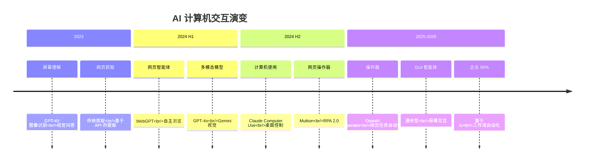
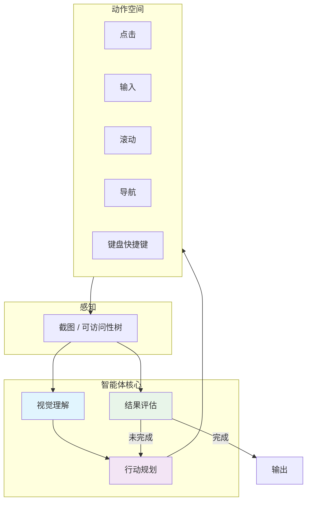
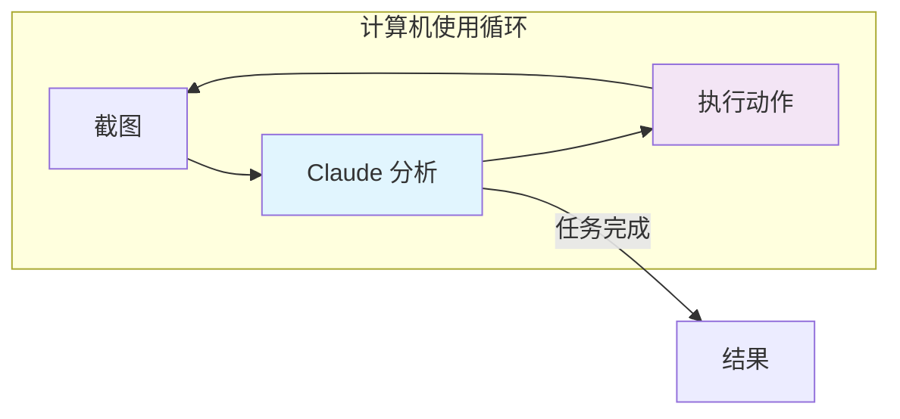
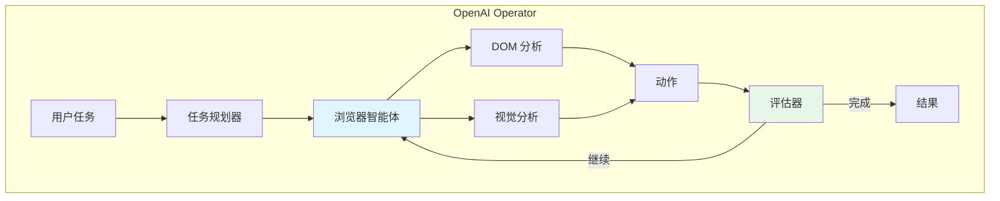
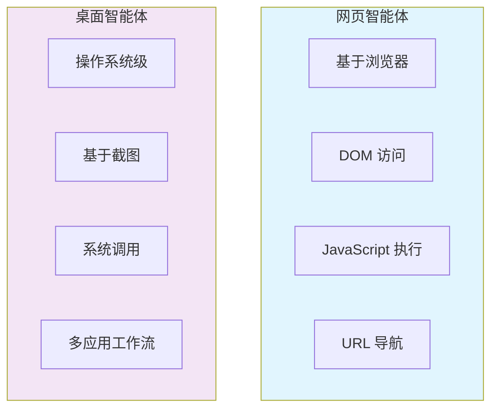
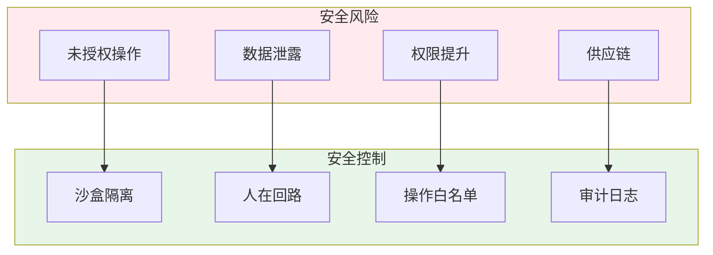
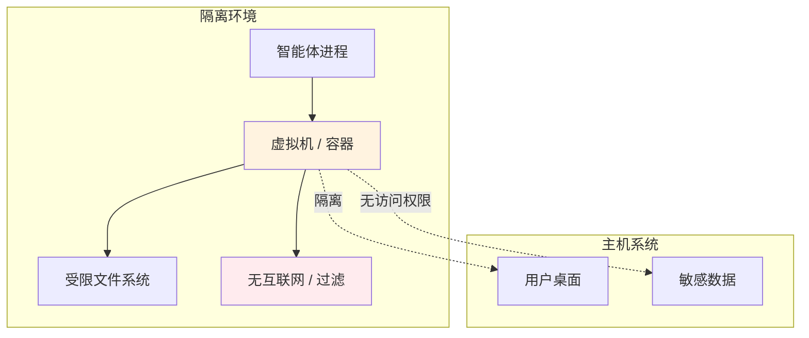

# 6. 计算机使用与 GUI 智能体

计算机使用智能体以与人类相同的方式与图形用户界面（GUI）交互——通过查看屏幕、点击按钮、输入文本和导航应用程序。这代表了从基于 API 的交互到视觉交互的根本性转变。

---

## 6.1 计算机交互的演变



### 交互谱系

```
API 调用 → 网页抓取 → 浏览器自动化 → GUI 智能体 → 桌面控制
    ↓           ↓               ↓                  ↓             ↓
  直接访问    解析 HTML      Playwright        操作器      计算机使用
```

---

## 6.2 GUI 智能体如何工作

### 核心架构



### 感知方法

| 方法 | 描述 | 优点 | 缺点 |
|------|------|------|------|
| **截图** | 通过 VLM 进行原始像素分析 | 适用于任何应用 | 昂贵、不精确 |
| **可访问性树** | 操作系统提供的 UI 元素结构 | 精确、快速 | 并非总是可用 |
| **DOM 分析** | 网页结构提取 | 网页端可靠 | 仅限网页 |
| **混合方式** | 结合截图 + 可访问性 | 两者兼顾 | 复杂 |

### 动作空间

GUI 智能体通常支持以下动作：

```typescript
type GUIAction =
  | { type: "click"; x: number; y: number; button?: "left" | "right" }
  | { type: "type"; text: string }
  | { type: "scroll"; direction: "up" | "down"; amount?: number }
  | { type: "keypress"; key: string; modifiers?: string[] }
  | { type: "navigate"; url: string }
  | { type: "wait"; duration: number }
  | { type: "screenshot" }
  | { type: "done"; result: string };
```

---

## 6.3 主要的计算机使用智能体

### Claude Computer Use (Anthropic, 2024.10)

Anthropic 开发的让 Claude 通过截图和动作与桌面应用程序交互的能力。

**工作原理**：



**主要特性**：
- 桌面级交互（不仅限于浏览器）
- 基于截图的感知
- 多应用程序工作流
- 沙盒执行环境

**安全机制**：
- 在隔离的容器/虚拟机中运行
- 默认无网络访问
- 敏感操作需要人工批准
- 截图记录用于审计

### OpenAI Operator (2025)

OpenAI 的基于浏览器的智能体，用于通过浏览器自主执行任务。

**功能**：
- 网页浏览和表单填写
- 在线购物和预订
- 信息检索和研究
- 多步骤网页工作流

**架构**：



### Google Mariner (2025)

Google 实验性的网页智能体，集成到 Chrome 中。

- 原生 Chrome 集成
- Google 账户上下文
- 网页任务自动化
- 与 Gemini 模型集成

### 其他 notable 智能体

| 智能体 | 类型 | 描述 |
|--------|------|------|
| **Multion** | 网页智能体 | 用于网页任务的浏览器扩展 |
| **Browser Use** | 开源 | 用于浏览器自动化的 Python 库 |
| **LaVague** | 开源 | 网页智能体框架 |
| **Skyvern** | 企业 | 带有视觉的工作流自动化 |

---

## 6.4 网页智能体 vs 桌面智能体

### 对比



| 方面 | 网页智能体 | 桌面智能体 |
|------|-----------|------------|
| **环境** | 浏览器 | 完整操作系统 |
| **感知** | DOM + 视觉 | 截图 + 可访问性 |
| **精确度** | 高（DOM 元素） | 中等（像素坐标） |
| **范围** | 仅网页应用 | 任何桌面应用 |
| **设置** | 简单（浏览器） | 复杂（虚拟机/容器） |
| **安全性** | 浏览器沙盒 | 操作系统级沙盒 |

---

## 6.5 安全与安全

### 风险模型



### 沙盒架构



### 最佳实践

1. **始终使用沙盒**：绝不在裸机上运行 GUI 智能体
2. **审计操作**：记录每个操作供审查
3. **人工批准**：财务/数据操作需要确认
4. **范围限制**：限制智能体可以访问的应用程序和 URL
5. **速率限制**：防止可能造成损害的快速连续操作
6. **凭证隔离**：为智能体操作使用独立账户

---

## 6.6 评估基准

### 主要基准

| 基准 | 重点 | 任务数 | 年份 |
|------|------|--------|------|
| **WebArena** | 网页交互 | 812 个任务 | 2023 |
| **OSWorld** | 桌面操作系统任务 | 369 个任务 | 2024 |
| **VisualWebArena** | 视觉网页任务 | 910 个任务 | 2023 |
| **WebShop** | 购物任务 | 100+ 产品 | 2022 |
| **Mind2Web** | 思维到网页任务 | 2000+ 任务 | 2023 |

### 性能进展

| 基准 | 最佳分数 (2024) | 最佳分数 (2025) | 人类基线 |
|------|----------------|----------------|----------|
| **WebArena** | ~35% | ~48% | ~78% |
| **OSWorld** | ~12% | ~22% | ~72% |
| **VisualWebArena** | ~28% | ~40% | ~88% |

:::info 差距分析
GUI 任务中智能体与人类性能之间仍存在显著差距，特别是在桌面应用方面。这是一个活跃的研究领域。
:::

---

## 6.7 用例

### 企业 RPA 2.0

传统的 RPA（机器人流程自动化）正在被 GUI 智能体转变：

| 传统 RPA | 基于 AI 的 RPA |
|----------|---------------|
| 脚本化、脆弱 | 自适应、有弹性 |
| 需要精确的 UI | 处理 UI 变化 |
| 高维护 | 自愈 |
| 固定工作流 | 动态任务处理 |
| 开发者构建 | 自然语言指令 |

### 实际应用

- **数据录入**：自动从文档填写表单
- **报告生成**：导航应用程序、收集数据、编译报告
- **测试**：跨应用程序的自动化 UI/UX 测试
- **客户支持**：与内部工具交互以解决问题
- **迁移**：通过 UI 在系统间传输数据

---

## 6.8 关键要点

1. **GUI 智能体弥合了最后一公里**—在没有 API 的情况下与应用程序交互
2. **Claude Computer Use 领先**—桌面级交互
3. **OpenAI Operator 领先**—基于网页的任务自动化
4. **安全至上**—始终沙盒化和审计智能体操作
5. **性能差距仍然存在**—桌面智能体仍处于早期阶段

---

:::tip 入门指南
网页自动化，尝试 **OpenAI Operator** 或开源的 **Browser Use**。桌面交互，在沙盒环境中探索 **Claude Computer Use**。
:::

:::caution 安全第一
在没有适当沙盒和人工监督的情况下，切勿让 GUI 智能体访问敏感系统。在生产系统上执行操作前，始终审查操作。
:::