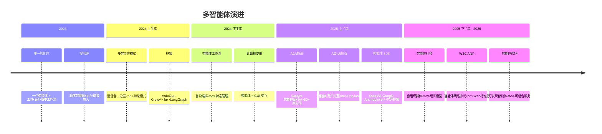
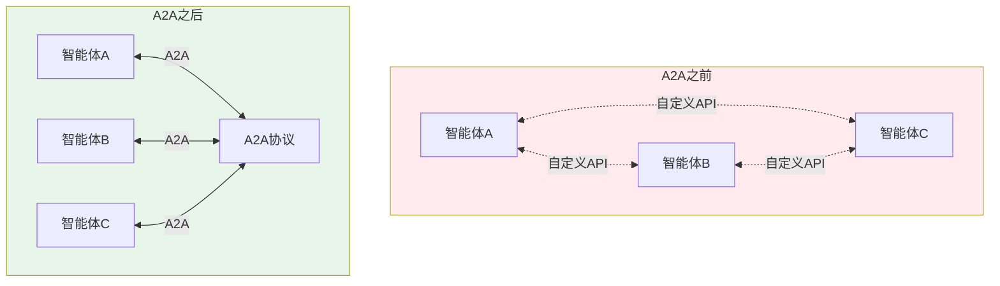
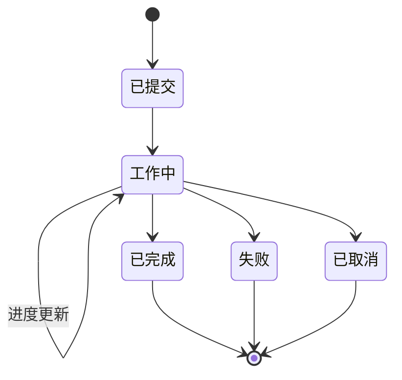
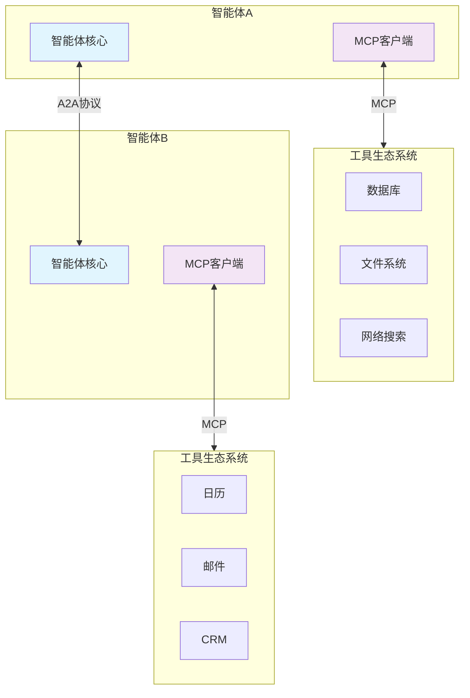
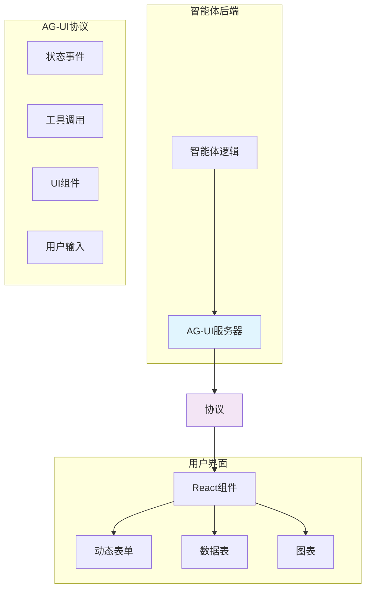
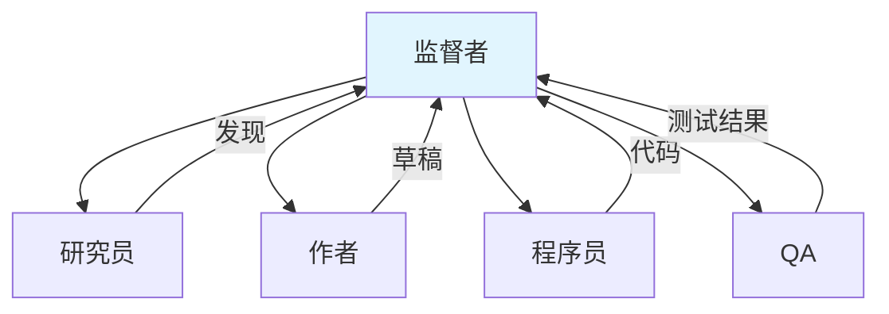
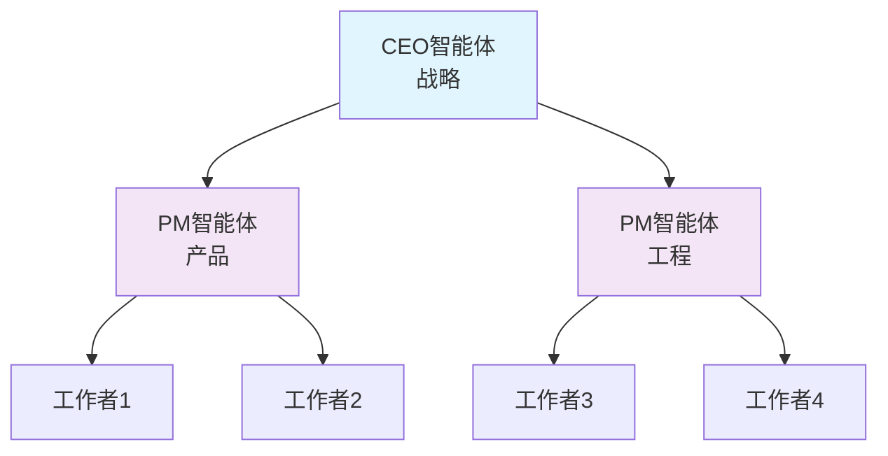
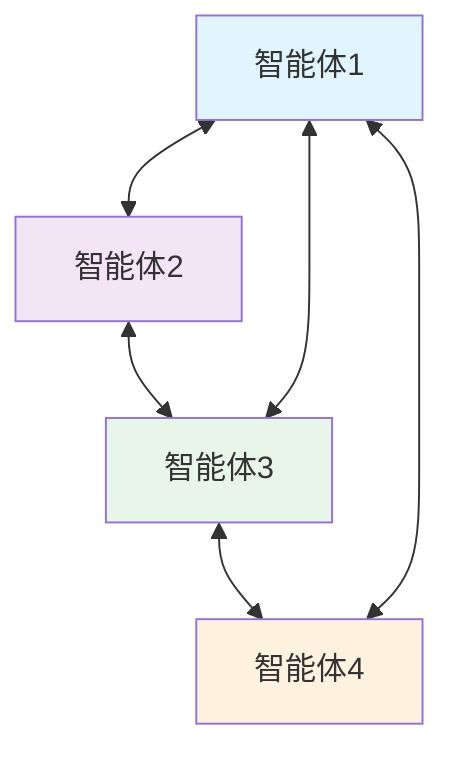
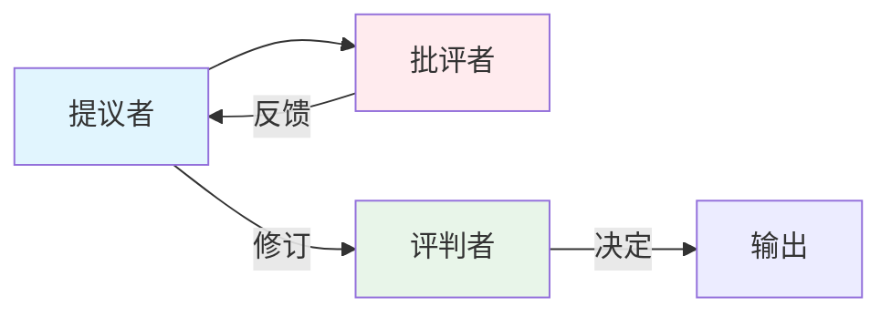
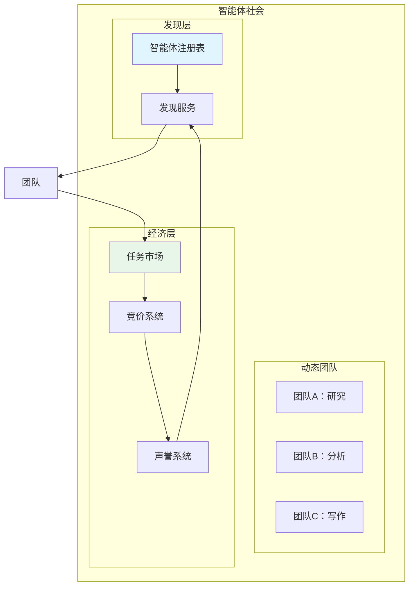

# 7. 多智能体 & A2A

随着单个智能体的成熟，前沿已转向**智能体协作**——智能体如何沟通、协调并形成社会。2025年，Google的A2A协议和AG-UI协议在智能体-用户交互方面进行了重大标准化工作。

---

## 7.1 多智能体系统的演进



---

## 7.2 A2A协议（Google, 2025.4）

**智能体间（A2A）协议**是Google的开放标准，用于智能体间通信，于2025年4月公布，得到了50多家公司的支持。

### 为什么A2A很重要



| A2A存在的问题 | A2A的解决方案 |
|---------------------|-------------------|
| 每对智能体都需要自定义集成 | 所有智能体的标准协议 |
| 供应商锁定 | 开放、互操作 |
| 无发现机制 | 用于能力发现的智能体卡片 |
| 专有的消息格式 | 标准JSON-RPC消息 |
| 无任务生命周期管理 | 标准化任务状态 |

### 核心概念

| 概念 | 描述 |
|---------|-------------|
| **智能体卡片** | 描述智能体能力、端点和认证的JSON元数据 |
| **任务** | 从一个智能体发送到另一个智能体的工作单元，具有生命周期管理 |
| **消息** | 任务内的通信（文本、文件、表单） |
| **部分** | 消息中的内容片段（文本、文件、数据） |
| **推送通知** | 长时间运行任务的异步通知 |

### 智能体卡片示例

```json
{
  "name": "研究智能体",
  "description": "执行网络研究并综合发现",
  "url": "https://research-agent.example.com/a2a",
  "capabilities": {
    "streaming": true,
    "pushNotifications": true
  },
  "skills": [
    {
      "id": "web-research",
      "name": "网络研究",
      "description": "从网络上搜索和综合信息"
    },
    {
      "id": "data-analysis",
      "name": "数据分析",
      "description": "分析数据集并生成报告"
    }
  ],
  "authentication": {
    "schemes": ["bearer"]
  }
}
```

### 任务生命周期



### A2A vs MCP

| 方面 | MCP（模型上下文协议） | A2A（智能体间） |
|--------|------------------------------|----------------------|
| **目的** | 智能体-工具通信 | 智能体-智能体通信 |
| **类比** | 连接外设的USB | 连接服务的HTTP |
| **范围** | 单个智能体的工具生态系统 | 多智能体协作 |
| **传输** | stdio / SSE | HTTP / JSON-RPC |
| **发现** | 服务器配置 | 智能体卡片 |
| **创建者** | Anthropic (2024) | Google (2025) |
| **关系** | 互补 | 互补 |



---

## 7.3 AG-UI协议（CopilotKit, 2025）

**智能体-用户交互协议（AG-UI）**标准化了智能体如何通过UI组件与人类用户交互。

### 为什么AG-UI很重要

传统智能体返回文本。AG-UI使智能体能：
- 渲染丰富的UI组件（表单、表格、图表）
- 流式传输实时进度指示器
- 请求结构化用户输入
- 显示交互式元素

### 架构



### 事件类型

| 事件类型 | 方向 | 描述 |
|------------|-----------|-------------|
| **TextMessageStart/Content/End** | 智能体 → UI | 流式文本输出 |
| **StateSnapshot / StateDelta** | 智能体 → UI | 智能体状态更新 |
| **ToolCallStart/Args/End** | 智能体 → UI | 工具执行进度 |
| **ToolCallResult** | 智能体 → UI | 工具结果 |
| **RunStarted / RunFinished** | 智能体 → UI | 生命周期事件 |

---

## 7.4 多智能体模式

### 常见编排模式

#### 1. 监督者模式

中央监督者智能体将任务委托给专业的工作者。



#### 2. 分层模式

具有战略和战术规划的多级管理。



#### 3. 网状/对等模式

智能体直接通信，无需中央协调器。



#### 4. 辩论模式

多个智能体通过结构化辩论讨论并达成共识。



### 模式比较

| 模式 | 复杂度 | 可扩展性 | 最适合 |
|---------|-----------|-------------|----------|
| **监督者** | 低 | 中等 | 任务委托 |
| **分层** | 中等 | 高 | 大型组织 |
| **网状** | 高 | 中等 | 创意协作 |
| **辩论** | 中等 | 低 | 质量改进 |

---

## 7.5 智能体社会 & 群体

### 自组织智能体

根据任务需求动态形成团队的智能体。



### 关键概念

| 概念 | 描述 |
|---------|-------------|
| **智能体注册表** | 可用智能体及其能力的目录 |
| **动态团队形成** | 智能体根据任务需求自组织 |
| **任务市场** | 任务被发布，智能体竞价完成 |
| **声誉系统** | 跟踪智能体性能和可靠性 |
| **经济模型** | 基于代币的智能体服务补偿 |

---

## 7.6 W3C ANP（智能体网络协议）

W3C正通过**智能体网络协议（ANP）**标准化智能体网络。

### 目标

1. **互操作性**：来自不同供应商的智能体可以通信
2. **发现**：查找智能体的标准机制
3. **信任**：验证和声誉系统
4. **隐私**：数据共享控制
5. **安全**：身份验证和授权

### 与其他标准的关系

```
W3C ANP（智能体网络协议）
  ├── 基于：A2A协议（Google）
  ├── 补充：MCP（Anthropic）
  ├── 灵感来自：AG-UI（CopilotKit）
  └── 对齐：Web标准（HTTP、JSON-LD）
```

---

## 7.7 使用智能体SDK实现

### OpenAI智能体SDK — 多智能体交接

```python
from agents import Agent, Runner

researcher = Agent(
    name="研究员",
    instructions="你彻底研究主题。",
)

writer = Agent(
    name="作者",
    instructions="你编写清晰、引人入胜的内容。",
)

coordinator = Agent(
    name="协调者",
    instructions="将任务路由到合适的专家。",
    handoffs=[researcher, writer],
)

result = Runner.run_sync(coordinator, "写一份关于量子计算的报告")
```

### LangGraph — 监督者模式

```python
from langgraph.graph import StateGraph, END
from typing import TypedDict, Annotated
import operator

class State(TypedDict):
    messages: Annotated[list, operator.add]
    next: str

def supervisor(state: State):
    # 决定下一个智能体
    return {"next": "researcher"}

def researcher(state: State):
    # 研究并返回发现
    return {"messages": ["研究发现..."]}

workflow = StateGraph(State)
workflow.add_node("supervisor", supervisor)
workflow.add_node("researcher", researcher)
workflow.add_conditional_edges("supervisor", lambda s: s["next"])
workflow.add_edge("researcher", "supervisor")
workflow.set_entry_point("supervisor")

app = workflow.compile()
```

---

## 7.8 关键要点

1. **A2A协议**正成为智能体间通信的标准
2. **AG-UI协议**桥接了智能体与丰富用户界面之间的差距
3. **MCP + A2A**是互补的 — 工具 vs 智能体协作
4. **多智能体模式**（监督者、分层、网状）解决不同的协调需求
5. **智能体社会**代表前沿 — 自组织、经济系统

---

:::tip 从模式开始
在构建多智能体系统之前，先掌握**监督者模式** — 它对大多数用例最实用。使用**LangGraph**或**OpenAI智能体SDK**进行实现。
:::

:::info 协议选择
- 需要智能体-工具通信？使用**MCP**
- 需要智能体-智能体通信？使用**A2A**
- 需要智能体-用户丰富交互？使用**AG-UI**
:::