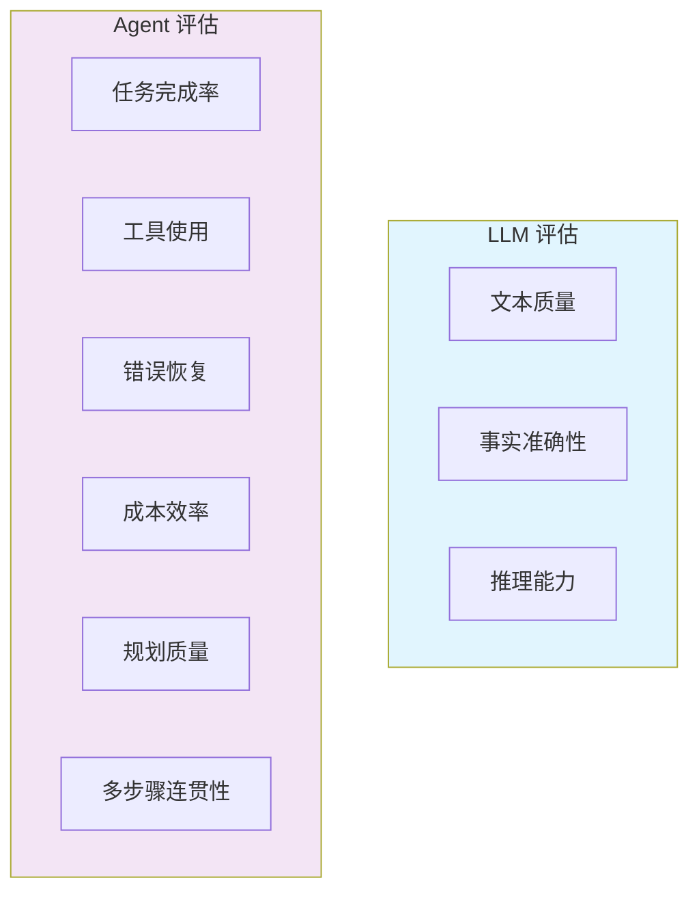
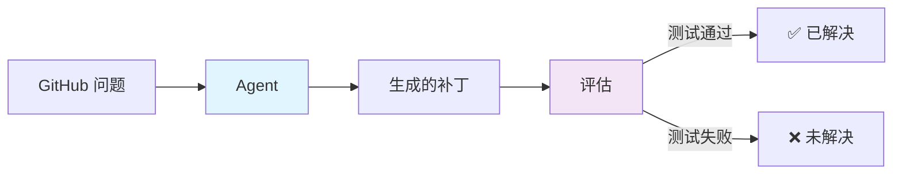
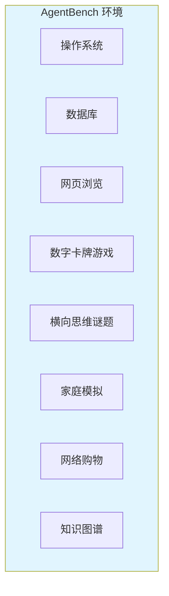
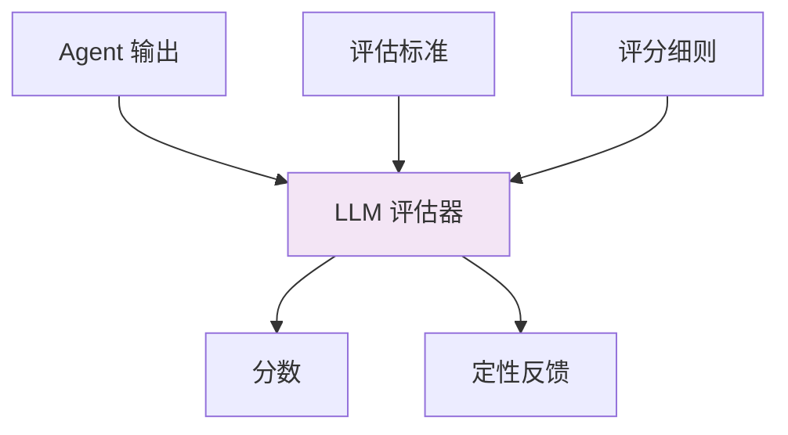
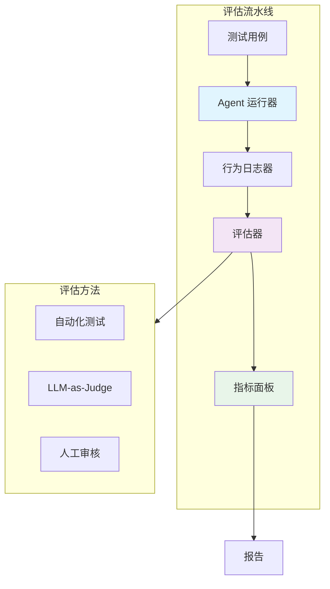

# 8. 评估与基准测试

评估 AI Agent 与评估静态 LLM 有着根本性的区别。Agent 需要基于其推理、规划、使用工具、从错误中恢复以及完成多步骤任务的能力进行评估，而不仅仅是生成文本。

---

## 8.1 为什么 Agent 评估很重要



### 关键指标

| 指标 | 描述 | 如何测量 |
|--------|-------------|----------------|
| **成功率** | 正确完成的任务百分比 | 真实值对比 |
| **Token 消耗** | 每个任务消耗的总 Token | Token 计数 |
| **延迟** | 完成任务所需时间 | 墙钟计时 |
| **工具准确性** | 正确的工具选择和使用 | 行为日志分析 |
| **错误恢复** | 从故障中恢复的能力 | 注入故障测试 |
| **规划质量** | 任务分解的效率 | 专家评估 |

---

## 8.2 SWE-bench

软件工程 Agent 的主要基准测试。

### 概述

**SWE-bench** 通过生成补丁来评估 Agent 解决真实 GitHub 问题的能力。



### 变体

| 变体 | 问题数量 | 描述 |
|---------|--------|-------------|
| **SWE-bench 完整版** | 2,294 | 来自 12 个 Python 仓库的完整基准测试 |
| **SWE-bench 精简版** | 300 | 精选子集，用于快速评估 |
| **SWE-bench 已验证版** | 500 | 人工验证，确保评估可靠性 |

### 评估流程

1. **输入**：Agent 接收 GitHub 问题（描述 + 仓库状态）
2. **执行**：Agent 探索代码库，识别错误，生成补丁
3. **评估**：应用补丁，运行测试套件
4. **结果**：如果所有相关测试通过则为通过

### 随时间进展

| 时期 | 最高分（已验证版） | 关键 Agent |
|--------|---------------------|-----------|
| 2024 Q1 | ~4% | 早期 SWE-Agent |
| 2024 Q2 | ~12% | SWE-Agent + GPT-4 |
| 2024 Q3 | ~22% | 无 Agent、AutoCodeRover |
| 2024 Q4 | ~33% | OpenAI、Anthropic Agent |
| 2025 Q1 | ~42% | Claude Code、Codex |
| 2025 Q2 | ~48% | 多 Agent 方案 |
| 2026 Q1 | ~53% | 持续改进 |

:::info 官方排行榜
最新分数请查看 [swebench.com](https://www.swebench.com/)
:::

---

## 8.3 WebArena & OSWorld

### WebArena

在真实的网页交互任务上评估 Agent。

**主要特点**：
- 5 个网页应用上的 812 个网页任务
- 任务包括：信息检索、表单填写、导航
- 完全可复现的网页环境
- 真实的、开放式的任务

| 类别 | 示例任务 |
|----------|---------------|
| **信息查找** | "找到纽约最便宜的 4 星酒店" |
| **表单填写** | "提交一份 50 美元的午餐报销单" |
| **导航** | "前往设置 → 隐私 → 更改为仅好友可见" |
| **数据录入** | "使用以下详细信息创建新联系人" |

### OSWorld

在真实桌面操作系统任务上评估 Agent。

**主要特点**：
- Ubuntu、Windows、macOS 上的 369 个任务
- 真实的操作系统环境
- 多应用程序工作流
- 文件、应用程序和系统操作

| 指标 | WebArena (2025) | OSWorld (2025) |
|--------|-----------------|-----------------|
| **顶级 Agent 分数** | ~48% | ~22% |
| **人类基线** | ~78% | ~72% |
| **差距** | 30% | 50% |

---

## 8.4 通用 Agent 基准测试

### GAIA（通用 AI 助手）

在不同难度级别上评估通用 AI 助手能力。

| 级别 | 任务数 | 描述 |
|-------|-------|-------------|
| **第 1 级** | 153 | 简单的单步骤 |
| **第 2 级** | 251 | 多步骤推理、工具使用 |
| **第 3 级** | 96 | 复杂的、多模态的、长期规划 |

### AgentBench

在 8 个环境中进行的多维度 Agent 评估。



### τ-bench

在具有合规性的真实客户服务任务上评估 Agent。

- 测试遵循复杂策略
- 评估工具使用准确性
- 衡量对话质量
- 包含对抗性用户场景

---

## 8.5 LLM-as-a-Judge

当人工评估不可行时，使用 LLM 评估 Agent 输出。

### 工作原理



### 评估方法

| 方法 | 描述 | 最适用场景 |
|----------|-------------|----------|
| **单次评分** | 在 1-5 分级上评价输出 | 快速评估 |
| **成对比较** | 比较两个输出 | 相对排名 |
| **基于参考** | 与真实值对比 | 任务完成度 |
| **多标准** | 在多个维度上评分 | 详细分析 |
| **思维链评估器** | 评估器解释推理 | 可靠性 |

### 最佳实践

1. **使用强模型作为评估器**（GPT-4o、Claude Opus）
2. **提供清晰的评分细则**和具体标准
3. **在子集上校准人工评估**
4. **使用多个评估器**进行高利害评估
5. **随机化呈现顺序**进行成对比较
6. **跟踪 LLM 和人工评估者间的一致性**

### 示例评估器提示

```
您正在评估 AI Agent 的响应。

任务：{原始任务}
Agent 响应：{agent_response}

在以下标准上评估（每项 1-5 分）：
1. 任务完成：Agent 是否完全完成了任务？
2. 准确性：信息是否正确？
3. 工具使用：是否正确使用了工具？
4. 效率：方法是否高效？
5. 清晰度：响应是否清晰且结构良好？

为每个标准提供分数和整体评估。
```

---

## 8.6 构建评估流水线

### 架构



### 实施清单

- [ ] 为每种任务类型定义清晰的成功标准
- [ ] 创建包含边缘情况的多样化测试集
- [ ] 实施所有 Agent 步骤的行为日志
- [ ] 建立具有真实值的自动化评估
- [ ] 添加 LLM-as-Judge 进行定性评估
- [ ] 建立人类性能基线
- [ ] 随时间跟踪指标（回归测试）
- [ ] 包含成本和延迟指标
- [ ] 定期与人工评估者校准

---

## 8.7 评估框架与工具

| 工具 | 类型 | 描述 |
|------|------|-------------|
| **LangSmith** | 平台 | LangChain 的追踪、评估和测试 |
| **Promptfoo** | CLI | 提示词评估和比较 |
| **Ragas** | 库 | RAG 特定的评估指标 |
| **DeepEval** | 库 | LLM 评估框架 |
| **Arize Phoenix** | 平台 | LLM 可观测性和评估 |
| **Braintrust** | 平台 | 评估和实验跟踪 |

---

## 8.8 关键要点

1. **Agent 评估是多维度的** — 不仅仅是文本质量
2. **SWE-bench** 是编码 Agent 评估的标准
3. **WebArena 和 OSWorld** 测试 GUI 交互能力
4. **LLM-as-a-Judge** 实现了可扩展的近似评估
5. **始终结合自动化 + 人工评估** 以获得可靠结果
6. **跟踪成本和延迟** 以及质量指标

---

:::tip 从简单开始
以**任务完成率**作为主要指标开始。随着评估的成熟，添加更多维度（成本、延迟、工具准确性）。
:::

:::info 基准测试选择
选择与您的用例匹配的基准测试：
- 编码 Agent → **SWE-bench**
- 网页 Agent → **WebArena**
- 桌面 Agent → **OSWorld**
- 通用 Agent → **GAIA / AgentBench**
:::