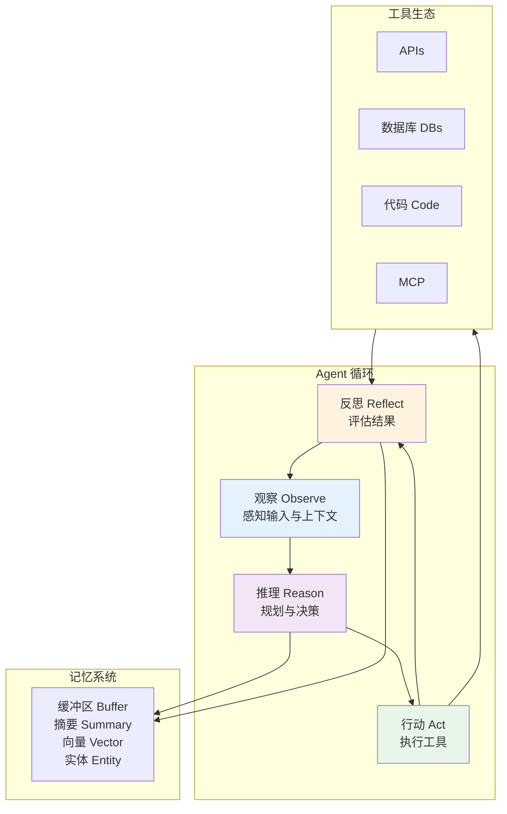
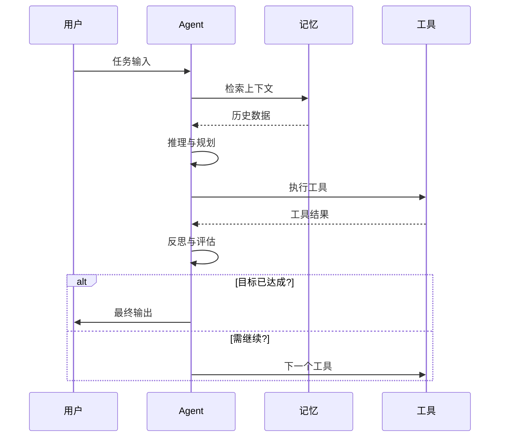
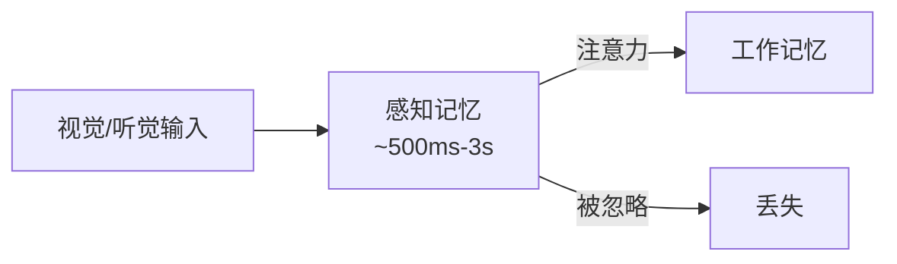
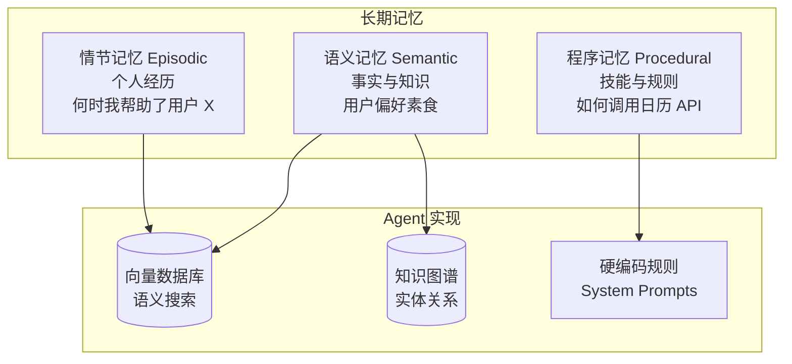
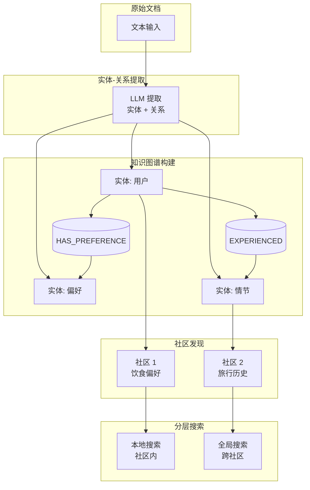
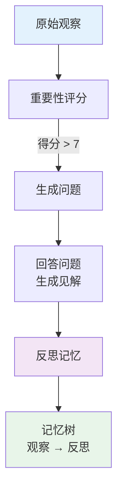
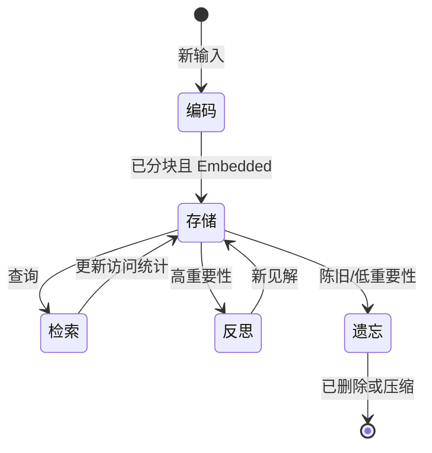
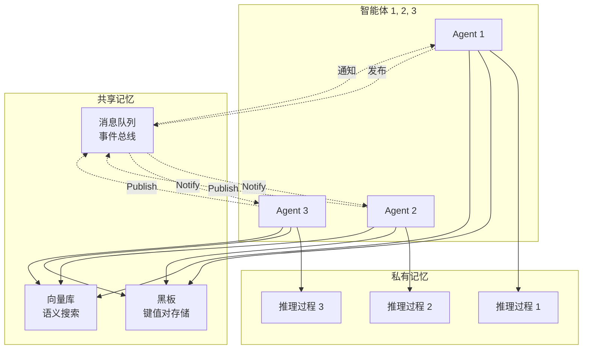

# 2. 核心架构组件

AI Agent 构建在四个基石系统之上：**Agent 循环 (The Agent Loop)**、**记忆 (Memory)**、**工具 (Tools)** 和 **规划 (Planning)**。本节将深入探讨每个组件，解释它们如何协同工作以创建自主、智能的系统。

---

## 2.1 Agent 循环

### 核心机制：观察 → 推理 → 行动 → 观察

Agent 循环是任何智能体系统的“心脏”。它是一个关于感知、推理、行动和反思的持续循环。



### 详细循环执行流程



### 循环变体

| 模式 | 描述 | 最适合 |
|---------|-------------|----------|
| **ReAct** | 推理 → 行动 → 观察 | 通用任务 |
| **Plan-and-Execute** | 规划所有步骤，然后执行 | 定义明确的目标 |
| **Re-planning** | 持续调整 | 动态环境 |
| **Reflection** | 自我批判与修正 | 质量至上的任务 |

---

## 2.2 记忆系统

记忆是区分“无状态聊天机器人”与“智能 Agent”的关键。一个强大的记忆系统使 Agent 能够保持上下文、从经验中学习并做出明智的决策。本节提供从认知科学基础到使用 Spring AI 实现生产级记忆系统的全面指南。

---

### 2.2.1 认知架构层

构建有效的 AI Agent 记忆系统需要理解人类记忆的工作原理。认知科学为设计模拟人类记忆能力的架构提供了蓝图。

#### 人类记忆系统

人类记忆组织在三个相互关联的系统中，每个系统具有不同的特征和时间跨度：

**1. 感知记忆 (Sensory Memory - 瞬时缓冲区)**
- **视觉**：图像记忆（~500ms 保留）
- **听觉**：声像记忆（~3 秒保留）
- **目的**：短暂保留感官输入以供注意力选择
- **Agent 等效物**：原始 Prompt 缓冲区、API 响应缓存



**2. 工作记忆 (Working Memory - 活动处理)**
- **容量**：7±2 个项目（米勒定律 Miller's Law, 1956）
- **持续时间**：不复述的情况下为 15-30 秒
- **组成**：中央执行系统、语音环路、视觉空间模板（Baddeley, 1974）
- **Agent 等效物**：LLM 上下文窗口 (Context Window)
- **关键现象**：“迷失在中间” (Lost in the Middle) —— LLM 难以从长上下文的中间部分检索信息（Liu et al., 2023）

```java
// Spring AI: 将工作记忆视为上下文窗口
@Service
public class WorkingMemoryManager {

    private final int WORKING_MEMORY_CAPACITY = 7; // 米勒定律
    private final Queue<MemoryItem> activeItems = new LinkedList<>();

    public void addToWorkingMemory(MemoryItem item) {
        activeItems.add(item);
        if (activeItems.size() > WORKING_MEMORY_CAPACITY) {
            activeItems.poll(); // FIFO 逐出 - 维持容量限制
        }
    }

    public List<MemoryItem> getActiveContext() {
        return List.copyOf(activeItems);
    }
}
```

**3. 长期记忆 (Long-Term Memory - 持久化存储)**

长期记忆分为三种不同的类型：

| 类型 | 描述 | 持续时间 | Agent 实现 |
|------|-------------|----------|---------------------|
| **情节记忆 (Episodic)** | 具有时间上下文的个人经历（“我去年夏天做了什么”） | 终身 | 对话历史、会话日志 |
| **语义记忆 (Semantic)** | 通用知识和事实（“巴黎是法国的首都”） | 终身 | 向量库、知识库 |
| **程序记忆 (Procedural)** | 技能和习惯（“如何骑自行车”） | 终身 | System Prompt、工具定义、代码 |



#### 认知科学基础

指导 Agent 记忆设计的关键研究成果：

1. **Atkinson-Shiffrin 模型 (1968)**：三阶段记忆流（感知 → 短期 → 长期）
2. **Tulving 的区分 (1972)**：情节记忆与语义记忆具有不同的神经基质
3. **处理深度等级 (Craik & Lockhart, 1972)**：更深的语义编码导致更好的保留
4. **编码特异性原则 (Tulving, 1983)**：检索线索与编码上下文相匹配时效果最佳
5. **间隔效应 (Spacing Effect)**：分散复述可增强长期保留

#### “迷失在中间”现象 (Lost in the Middle)

**关键研究**："Lost in the Middle: How Language Models Use Long Contexts" (Liu et al., 2023)

**核心发现**：
- 对于长上下文中间部分的信息，LLM 的性能会下降 20-30%
- 性能在开头（首因效应 Primacy Effect）和结尾（近因效应 Recency Effect）表现最佳
- 对于大多数模型，超过 8K tokens 后性能会显著下降

**实践建议**：
```java
// 通过策略性上下文放置对抗“迷失在中间”
@Service
public class ContextOptimizer {

    public List<Memory> organizeForOptimalRetrieval(List<Memory> memories) {
        // 策略 1：将关键信息放在开头或结尾
        List<Memory> critical = memories.stream()
            .filter(m -> m.getImportance() > 0.8)
            .toList();

        List<Memory> standard = memories.stream()
            .filter(m -> m.getImportance() <= 0.8)
            .toList();

        // 优化放置：开头放关键信息，中间放普通信息，结尾放摘要
        List<Memory> organized = new ArrayList<>();
        organized.addAll(critical.subList(0, Math.min(3, critical.size())));
        organized.addAll(standard);
        if (critical.size() > 3) {
            organized.addAll(critical.subList(3, critical.size()));
        }

        return organized;
    }

    // 策略 2：针对长上下文的分层摘要
    public String summarizeMiddleSection(List<Message> middleMessages) {
        String prompt = String.format("""
            创建这些消息的简明摘要，保留关键信息：
            %s

            关注点：
            - 讨论的主要话题
            - 做出的重要决策
            - 揭示的用户偏好
            """,
            middleMessages.stream()
                .map(Message::getContent)
                .collect(Collectors.joining("\n"))
        );

        return llm.generate(prompt);
    }
}
```

#### Agent 记忆：认知映射

| 认知组件 | 人类实现 | Agent 实现 | 技术载体 |
|---------------------|---------------------|---------------------|-------------------|
| 感知记忆 | 视觉/听觉缓冲区 | 消息缓冲区 | 对话列表 |
| 工作记忆 | 注意力焦点 | LLM 上下文 | 上下文窗口 |
| 情节记忆 | 自传体事件 | 对话历史 | 向量库 / 数据库 |
| 语义记忆 | 世界知识 | 知识库 | 向量库 / 知识图谱 |
| 程序记忆 | 技能与习惯 | 系统提示词 | 硬编码规则 |

```java
// 完整的认知记忆系统
@Service
public class CognitiveMemorySystem {

    // 感知记忆：瞬时输入缓冲区
    private final Map<String, String> sensoryBuffer = new ConcurrentHashMap<>();

    // 工作记忆：活动处理（LLM 上下文）
    private final WorkingMemoryManager workingMemory;

    // 长期记忆：持久化存储
    private final VectorStore episodicMemory; // 经历
    private final KnowledgeGraph semanticMemory; // 事实与实体
    private final SystemPromptManager proceduralMemory; // 技能

    public MemoryContext buildContext(String userQuery) {
        // 1. 从感知缓冲区加载（即时上下文）
        String immediateContext = sensoryBuffer.get(userQuery);

        // 2. 从工作记忆检索（活动项）
        List<MemoryItem> activeItems = workingMemory.getActiveContext();

        // 3. 从情节记忆回忆（相关经历）
        List<Memory> experiences = episodicMemory.similaritySearch(
            SearchRequest.query(userQuery).withTopK(5)
        );

        // 4. 查询语义记忆（事实与实体）
        List<Entity> entities = semanticMemory.findRelevantEntities(userQuery);

        // 5. 加载程序记忆（技能与规则）
        String systemPrompt = proceduralMemory.getSystemPrompt();

        return MemoryContext.builder()
            .sensory(immediateContext)
            .working(activeItems)
            .episodic(experiences)
            .semantic(entities)
            .procedural(systemPrompt)
            .build();
    }
}
```

---

### 2.2.2 存储与数据结构层

选择正确的存储后端对于记忆系统性能至关重要。不同的存储技术擅长不同的用例。

#### 1. 向量库 (Vector Stores - 语义记忆)

**最适合**：语义相似度搜索、模糊匹配、知识密集型任务

**工作原理**：
1. 文本被转换为密集的向量嵌入 (Vector Embeddings)（例如 OpenAI text-embedding-3-large）
2. 向量使用 HNSW（分层导航小世界）等算法进行索引
3. 使用余弦相似度或欧几里得距离计算相似度

**距离度量**：
- **余弦相似度 (Cosine Similarity)**：`cos(θ) = (A·B) / (||A|| × ||B||)` - 范围 [-1, 1]，衡量向量间的角度
- **欧几里得距离 (Euclidean Distance)**：`||A - B||` - 直线距离
- **点积 (Dot Product)**：`A·B` - 原始相似度（需要归一化向量）

```java
// Spring AI: 生产级向量库配置
@Configuration
public class VectorStoreConfig {

    @Bean
    public VectorStore vectorStore(EmbeddingModel embeddingModel, JdbcTemplate jdbcTemplate) {
        return new PgVectorStore(
            PgVectorStoreConfig.builder()
                .embeddingModel(embeddingModel)
                .jdbcTemplate(jdbcTemplate)
                .initializeSchema(true) // 自动创建表
                .dimensions(3072) // OpenAI text-embedding-3-large
                .distanceType(VectorStore.DistanceType.COSINE_DISTANCE)
                .build()
        );
    }

    @Bean
    public EmbeddingModel embeddingModel(
        @Value("${spring.ai.openai.api-key}") String apiKey
    ) {
        return new OpenAiEmbeddingModel(
            OpenAiEmbeddingOptions.builder()
                .withApiKey(apiKey)
                .withModel("text-embedding-3-large")
                .withDimensions(3072)
                .build()
        );
    }
}

// Service: 存储与检索记忆
@Service
public class SemanticMemoryService {

    private final VectorStore vectorStore;

    public void storeMemory(String content, Map<String, Object> metadata) {
        MemoryDocument doc = MemoryDocument.builder()
            .id(UUID.randomUUID().toString())
            .text(content)
            .metadata(metadata)
            .build();

        vectorStore.add(List.of(doc));
    }

    public List<Memory> retrieveRelevant(String query, int topK) {
        return vectorStore.similaritySearch(
            SearchRequest.query(query)
                .withTopK(topK)
                .withSimilarityThreshold(0.7) // 仅限高质量匹配
        ).stream()
            .map(Memory::fromDocument)
            .toList();
    }
}
```

**生产实现选择**：

| 技术 | 优势 | 最适合 | 成本 |
|------------|-----------|----------|------|
| **Pinecone** | 完全托管，自动缩放 | 生产应用，高流量 | $70-320/月 |
| **Weaviate** | 开源，混合搜索 | 自托管，多模态 | 提供免费层 |
| **Qdrant** | 高性能，支持过滤 | 实时应用 | 提供免费层 |
| **Milvus** | 分布式，支持 10M+ 向量 | 大规模部署 | 开源 |
| **pgvector** | Postgres 扩展 | 简单部署，SQL 查询 | 免费 |

#### 2. 知识图谱 (Knowledge Graphs - 结构化记忆)

**突破性研究**：**GraphRAG** (Microsoft Research, 2024)

GraphRAG 将知识图谱与 RAG 相结合，解决了纯向量搜索的关键局限：
- **多跳推理**：“约翰在 OpenAI 工作 → OpenAI 在旧金山 → 约翰住在旧金山地区”
- **社区发现**：将相关实体分组为社区，进行分层搜索
- **全局上下文**：生成社区摘要以进行跨社区推理

**何时使用 GraphRAG**：
- 跨多个实体的复杂推理
- 关系密集型查询（“还有谁和约翰一起工作？”）
- 多步推断链
- 知识密集型领域（医疗、法律、研究）

```java
// Spring AI + Neo4j: 知识图谱实现
@Configuration
@EnableNeo4jRepositories(basePackages = "com.example.memory.graph")
public class KnowledgeGraphConfig {

    @Bean
    public Neo4jClient neo4jClient(
        @Value("${spring.neo4j.uri}") String uri,
        @Value("${spring.neo4j.authentication.username}") String username,
        @Value("${spring.neo4j.authentication.password}") String password
    ) {
        return Neo4jClient.builder()
            .withDriver(uri, username, password)
            .build();
    }
}

// 领域模型：实体与关系
@Node("Entity")
public class MemoryNode {
    @Id @GeneratedValue
    private Long id;

    @Property("name")
    private String name;

    @Property("type")
    private String type; // 人物、地点、概念等

    @Property("attributes")
    private Map<String, Object> attributes;

    @Relationship("HAS_PREFERENCE")
    private List<Preference> preferences;

    @Relationship("EXPERIENCED")
    private List<Episode> experiences;
}

@Node("Preference")
public class Preference {
    @Id @GeneratedValue
    private Long id;

    @Property("type")
    private String type; // 食物、旅游等

    @Property("value")
    private String value;
}

@RelationshipProperties
public class ExperiencedRelation {
    @Property("timestamp")
    private Instant timestamp;

    @Property("importance")
    private double importance;
}

// Repository: 自定义查询
public interface MemoryGraphRepository extends Neo4jRepository<MemoryNode, Long> {

    @Query("MATCH (u:User {id: $userId})-[:HAS_PREFERENCE]->(p:Preference) RETURN p")
    List<Preference> findUserPreferences(@Param("userId") String userId);

    @Query("MATCH (u:User {id: $userId})-[:EXPERIENCED]->(e:Episode) " +
           "WHERE e.timestamp > $since " +
           "RETURN e ORDER BY e.timestamp DESC LIMIT 10")
    List<Episode> findRecentEpisodes(
        @Param("userId") String userId,
        @Param("since") Instant since
    );

    @Query("MATCH path = shortestPath(" +
           "(start:Entity {name: $entity1})-[*..5]-(end:Entity {name: $entity2})" +
           ") RETURN path")
    List<List<Entity>> findRelationships(
        @Param("entity1") String entity1,
        @Param("entity2") String entity2
    );
}

// Service: GraphRAG 风格的检索
@Service
public class GraphRAGService {

    private final MemoryGraphRepository graphRepository;
    private final ChatModel llm;

    // 1. 从文本中提取实体
    public List<Entity> extractEntities(String text) {
        String prompt = String.format("""
            从这段文本中提取实体和关系：
            %s

            以 JSON 格式响应：
            {
                "entities": [{"name": "...", "type": "..."}],
                "relationships": [{"from": "...", "to": "...", "type": "..."}]
            }
            """, text);

        String response = llm.call(prompt);
        return parseEntities(response);
    }

    // 2. 社区发现（Louvain 算法）
    public List<Community> detectCommunities(List<MemoryNode> nodes) {
        // 从节点构建图
        Graph graph = buildEntityGraph(nodes);

        // 应用 Louvain 社区发现算法
        LouvainAlgorithm louvain = new LouvainAlgorithm();
        List<Set<MemoryNode>> communities = louvain.detect(graph);

        // 生成社区摘要
        return communities.stream()
            .map(this::summarizeCommunity)
            .toList();
    }

    private Community summarizeCommunity(Set<MemoryNode> nodes) {
        String summaryPrompt = String.format("""
            创建该实体社区的摘要：
            实体： %s

            关注点：
            - 共同主题或模式
            - 关键关系
            - 重要见解
            """,
            nodes.stream()
                .map(MemoryNode::getName)
                .collect(Collectors.joining(", "))
        );

        String summary = llm.call(summaryPrompt);

        return Community.builder()
            .entities(nodes)
            .summary(summary)
            .build();
    }

    // 3. 分层检索（本地 + 全局）
    public GraphRAGResult retrieve(String query, List<Community> communities) {
        // 本地搜索：在最相关的社区内
        Community bestCommunity = findMostRelevantCommunity(query, communities);
        List<MemoryNode> localResults = searchWithinCommunity(query, bestCommunity);

        // 全局搜索：横跨所有社区摘要
        List<Community> relevantCommunities = communities.stream()
            .filter(c -> calculateRelevance(query, c.getSummary()) > 0.6)
            .toList();

        return GraphRAGResult.builder()
            .localResults(localResults)
            .globalCommunities(relevantCommunities)
            .build();
    }
}
```

**GraphRAG 架构图**：



**向量库 vs 知识图谱**：

| 维度 | 向量库 | 知识图谱 | 混合 (GraphRAG) |
|--------|-------------|----------------|-------------------|
| **查询类型** | 语义相似度 | 关系查询 | 两者兼有 |
| **推理能力** | 浅层（单步） | 深层（多步） | 自适应 |
| **构建成本** | 低 | 高 | 极高 |
| **维护难度** | 极小 | 显著 | 显著 |
| **最适合** | 关键字搜索, 问答 | 复杂推理 | 知识密集型 |

#### 3. 结构化数据库 (SQL/NoSQL)

**最适合**：精确的业务状态、事务、结构化查询

```java
// Spring AI: JDBC 对话记忆
@Configuration
public class JdbcMemoryConfig {

    @Bean
    public ChatMemoryRepository chatMemoryRepository(JdbcTemplate jdbcTemplate) {
        return new JdbcChatMemoryRepository(jdbcTemplate);
    }
}

// 实体：对话元数据
@Entity
@Table(name = "conversations")
public class ConversationEntity {
    @Id
    @GeneratedValue(strategy = GenerationType.IDENTITY)
    private Long id;

    @Column(unique = true, nullable = false)
    private String conversationId;

    @Column
    private Instant createdAt;

    @ElementCollection
    @MapKeyColumn(name = "key")
    @Column(name = "value")
    @CollectionTable(name = "conversation_metadata")
    private Map<String, String> metadata;
}

// Repository: 自定义查询
@Repository
public interface ChatMemoryRepository extends JpaRepository<ConversationEntity, Long> {

    @Query("SELECT c FROM ConversationEntity c WHERE c.conversationId = :conversationId")
    Optional<ConversationEntity> findByConversationId(
        @Param("conversationId") String conversationId
    );

    @Query("SELECT m FROM MessageEntity m " +
           "WHERE m.conversationId = :conversationId " +
           "ORDER BY m.timestamp DESC")
    List<MessageEntity> findRecentMessages(
        @Param("conversationId") String conversationId,
        Pageable pageable
    );
}

// Service: 管理对话记忆
@Service
public class ConversationMemoryService {

    private final ChatMemoryRepository repository;

    public void addMessage(String conversationId, Message message) {
        ConversationEntity conversation = repository
            .findByConversationId(conversationId)
            .orElseGet(() -> createConversation(conversationId));

        MessageEntity messageEntity = MessageEntity.builder()
            .conversationId(conversationId)
            .role(message.getRole())
            .content(message.getContent())
            .timestamp(Instant.now())
            .build();

        conversation.addMessage(messageEntity);
        repository.save(conversation);
    }

    public List<Message> getRecentMessages(String conversationId, int limit) {
        return repository.findRecentMessages(
            conversationId,
            Pageable.ofSize(limit)
        ).stream()
            .map(this::toDomainMessage)
            .toList();
    }
}
```

**何时使用 SQL/NoSQL**：
- 需要事务一致性（例如订单状态）
- 复杂的 Join 查询
- 法规遵从（数据保留、GDPR）
- 已有的数据库基础设施

#### 4. 分层存储 (分层上下文/虚拟记忆)

**突破性研究**：**MemGPT** (UC Berkeley, 2023/2024) - "将 LLM 视为操作系统"

MemGPT 引入了**虚拟上下文管理**，像管理操作系统内存一样管理 LLM 上下文窗口：

| OS 概念 | MemGPT 等效概念 | 目的 |
|------------|-------------------|---------|
| RAM | 主上下文 (Main Context) | 快速访问，容量有限 |
| 磁盘 | 外部上下文 (External Context) | 海量存储，访问较慢 |
| 缺页中断 | 上下文溢出 (Context Overflow) | 数据移动的触发器 |
| 页面置换 | FIFO/LRU 逐出 | 管理内存压力 |

**核心创新**：Agent 可以通过函数调用主动管理其上下文：
- `page_in()`：将数据从外部加载到主上下文
- `page_out()`：将数据从主上下文移至外部存储

```java
// MemGPT 风格：分层记忆管理
@Service
public class HierarchicalMemoryManager {

    private final int CONTEXT_LIMIT = 8000; // tokens

    // 主上下文：快速访问（相当于 RAM）
    private final List<MemoryBlock> mainContext = new ArrayList<>();

    // 外部上下文：海量存储（相当于磁盘）
    private final Queue<MemoryBlock> externalContext = new LinkedList<>();

    public void addMemory(MemoryBlock block) {
        int currentSize = calculateTokenCount(mainContext);

        if (currentSize + block.getTokenCount() <= CONTEXT_LIMIT) {
            // 主上下文装得下
            mainContext.add(block);
        } else {
            // 溢出：将旧记忆换出（Page out）
            evictToExternalContext(block.getTokenCount());
            mainContext.add(block);
        }
    }

    // 页面置换：LRU 风格逐出
    private void evictToExternalContext(int requiredSpace) {
        List<MemoryBlock> evicted = mainContext.stream()
            .sorted(Comparator.comparing(MemoryBlock::getLastAccessed))
            .collect(Collectors.toList());

        int freedSpace = 0;
        for (MemoryBlock block : evicted) {
            if (freedSpace >= requiredSpace) break;

            mainContext.remove(block);
            externalContext.add(block);
            freedSpace += block.getTokenCount();
        }
    }

    // Page-in: 加载相关记忆
    public List<MemoryBlock> retrieveRelevant(String query) {
        // 1. 在主上下文中搜索
        List<MemoryBlock> mainResults = searchInMainContext(query);

        if (mainResults.size() >= 5) {
            return mainResults;
        }

        // 2. 需要更多：从外部上下文换入（Page in）
        List<MemoryBlock> externalResults = searchInExternalContext(query);

        // 3. 换入顶部结果（可能触发 page-out）
        for (MemoryBlock block : externalResults) {
            addMemory(block); // 自动处理逐出
        }

        return searchInMainContext(query);
    }

    // 供 Agent 调用的 MemGPT 风格函数
    @FunctionCallback(name = "page_in")
    public String pageIn(String memoryId) {
        MemoryBlock block = externalContext.stream()
            .filter(b -> b.getId().equals(memoryId))
            .findFirst()
            .orElseThrow();

        externalContext.remove(block);
        addMemory(block); // 处理容量管理

        return String.format("已换入记忆: %s", block.getId());
    }

    @FunctionCallback(name = "page_out")
    public String pageOut(String memoryId) {
        MemoryBlock block = mainContext.stream()
            .filter(b -> b.getId().equals(memoryId))
            .findFirst()
            .orElseThrow();

        mainContext.remove(block);
        externalContext.add(block);

        return String.format("已换出记忆: %s", block.getId());
    }
}
```

**存储对比表**：

| 存储类型 | 最适合 | 优点 | 缺点 | 生产选择 |
|-------------|----------|------------|---------------|-------------------|
| **向量库** | 语义检索 | 模糊匹配，可扩展 | 精确查询能力差 | Pinecone, Weaviate, Qdrant |
| **知识图谱** | 复杂推理 | 多步推断 | 构建成本高 | Neo4j, GraphRAG |
| **SQL/NoSQL** | 业务状态 | ACID 事务 | 无语义搜索 | PostgreSQL, MongoDB |
| **分层存储** | 长上下文 | 无限上下文 | 复杂度高 | MemGPT, Letta |

---

### 2.2.3 记忆生命周期操作

记忆并非静态存储——它是一个具有四个关键操作的动态系统：**编码 (Encoding)**、**检索 (Retrieval)**、**反思 (Reflection)** 和 **遗忘 (Forgetting)**。每种操作都会转换记忆，使 Agent 能够学习和适应。

#### 1. 编码：从输入到记忆

**编码**是将原始输入转化为存储的记忆表示的过程。编码的质量决定了检索的有效性。

**三种分块 (Chunking) 策略**：

1. **语义分块 (Semantic Chunking)** (LightRAG, 2024)
   - 按主题/主题组聚合相关内容
   - 保持语义连贯性
   - 最适合：对话式智能体、文档 QA

2. **分层分块 (Hierarchical Chunking)** (MemGPT)
   - 创建多级块：文档 → 章节 → 节 → 段落
   - 支持在适当粒度下检索
   - 最适合：长篇文档、技术手册

3. **时间分块 (Temporal Chunking)** (Zep)
   - 按时间窗口分组（小时、天、周）
   - 维持对话流
   - 最适合：聊天记录、情节日志

```java
// Spring AI: 智能分块策略
@Service
public class MemoryChunkingService {

    // 策略 1: 语义分块 (LightRAG 风格)
    public List<MemoryChunk> semanticChunk(String text) {
        // 1. 拆分为句子
        List<String> sentences = splitIntoSentences(text);

        // 2. 为每个句子计算 Embedding
        List<float[]> embeddings = sentences.stream()
            .map(embeddingModel::embed)
            .toList();

        // 3. 按语义相似度聚类
        List<List<String>> clusters = clusterBySimilarity(sentences, embeddings);

        // 4. 每个簇成为一个分块
        return clusters.stream()
            .map(cluster -> MemoryChunk.builder()
                .content(String.join(" ", cluster))
                .type(ChunkType.SEMANTIC)
                .metadata(Map.of(
                    "sentence_count", cluster.size(),
                    "created_at", Instant.now()
                ))
                .build())
            .toList();
    }

    // 策略 2: 分层分块 (MemGPT 风格)
    public HierarchicalChunks hierarchicalChunk(Document doc) {
        return HierarchicalChunks.builder()
            .document(doc.getContent())
            .chapters(extractChapters(doc))    // Level 1
            .sections(extractSections(doc))    // Level 2
            .paragraphs(extractParagraphs(doc)) // Level 3
            .sentences(extractSentences(doc))   // Level 4
            .build();
    }

    // 策略 3: 时间分块 (基于对话)
    public List<MemoryChunk> temporalChunk(List<Message> messages) {
        // 按时间窗口分组 (1 小时)
        Map<LocalDateTime, List<Message>> grouped = messages.stream()
            .collect(Collectors.groupingBy(
                m -> m.getTimestamp().truncatedTo(ChronoUnit.HOURS)
            ));

        return grouped.entrySet().stream()
            .map(e -> {
                String summary = summarizeMessages(e.getValue());
                return MemoryChunk.builder()
                    .content(summary)
                    .type(ChunkType.TEMPORAL)
                    .timeWindow(e.getKey())
                    .messages(e.getValue())
                    .metadata(Map.of(
                        "message_count", e.getValue().size(),
                        "time_range", String.format("%s - %s",
                            e.getValue().get(0).getTimestamp(),
                            e.getValue().get(e.getValue().size() - 1).getTimestamp()
                        )
                    ))
                    .build();
            })
            .toList();
    }

    // 混合策略: 多维分块
    public List<MemoryChunk> hybridChunk(String text, List<Message> conversation) {
        // 1. 内容的语义分块
        List<MemoryChunk> contentChunks = semanticChunk(text);

        // 2. 对话的时间分块
        List<MemoryChunk> timeChunks = temporalChunk(conversation);

        // 3. 合并并去重
        return Stream.concat(contentChunks.stream(), timeChunks.stream())
            .distinct()
            .toList();
    }
}
```

**Embedding 技术对比**：

| 技术 | 描述 | 最适合 |
|-----------|-------------|----------|
| **静态 Embedding** | 一次性编码 | 稳定的文档 |
| **动态 Embedding** | 根据使用情况更新 | 演进中的知识 |
| **混合 Embedding** | 文本 + 元数据 | 丰富的上下文 |
| **多模态** | 文本 + 图像 + 语音 | 多媒体 Agent |

#### 2. 检索：寻找关键信息

**检索**从存储中选择相关记忆。有效的检索结合了多种信号：时效性 (Recency)、重要性 (Importance) 和相关性 (Relevance)。

**多维检索实现**：

```java
// 斯坦福生成式智能体风格：多信号检索
@Service
public class MemoryRetrievalService {

    public List<Memory> retrieve(RetrievalQuery query) {

        // 信号 1: 语义相似度 (向量搜索)
        List<Memory> semanticResults = vectorStore.similaritySearch(
            SearchRequest.query(query.getQuery())
                .withTopK(20)
        );

        // 信号 2: 时间时效性
        List<Memory> recentResults = semanticResults.stream()
            .filter(m -> m.getTimestamp().isAfter(query.getSince()))
            .toList();

        // 信号 3: 重要性评分 (基于 LLM)
        Map<Memory, Double> importanceScores = calculateImportance(recentResults);

        // 信号 4: 合并所有信号
        List<ScoredMemory> scoredMemories = recentResults.stream()
            .map(memory -> {
                // 时效性得分: 指数衰减
                double recencyScore = calculateRecency(memory, query.getCurrentTime());

                // 重要性得分: LLM 评分 (1-10)
                double importanceScore = importanceScores.get(memory);

                // 相关性得分: 向量相似度
                double relevanceScore = memory.getSimilarity();

                // 最终加权得分
                double finalScore =
                    0.3 * recencyScore +
                    0.4 * importanceScore +
                    0.3 * relevanceScore;

                return new ScoredMemory(memory, finalScore);
            })
            .sorted(Comparator.comparing(ScoredMemory::getScore).reversed())
            .map(sm -> sm.getMemory())
            .limit(10)
            .toList();

        return scoredMemories;
    }

    // 时效性: 随时间指数衰减
    private double calculateRecency(Memory memory, Instant currentTime) {
        long daysSince = ChronoUnit.DAYS.between(
            memory.getTimestamp(),
            currentTime
        );
        double lambda = 0.1; // 衰减率
        return Math.exp(-lambda * daysSince);
    }

    // 重要性: 基于 LLM 的评分 (参考斯坦福生成式智能体)
    private Map<Memory, Double> calculateImportance(List<Memory> memories) {
        return memories.stream()
            .collect(Collectors.toMap(
                Function.identity(),
                memory -> {
                    String prompt = String.format("""
                        在 1-10 的范围内，这段记忆对于未来的决策有多重要？

                        记忆： %s

                        考虑因素：
                        - 是否会影响未来的互动？
                        - 是否是一个重大事件？
                        - 是否揭示了关键偏好？

                        仅返回一个数字。
                        """, memory.getContent());

                    String response = llm.call(prompt);
                    return Double.parseDouble(response.trim()) / 10.0;
                }
            ));
    }
}
```

**检索策略对比**：

| 策略 | 公式 | 最适合 | 示例 |
|----------|---------|----------|---------|
| **时效性 (Recency)** | `exp(-λ × Δt)` | 时间敏感型查询 | “我们昨天讨论了什么？” |
| **重要性 (Importance)** | LLM 评分 (1-10) | 长期决策 | “用户的核心偏好” |
| **相关性 (Relevance)** | 余弦相似度 | 语义搜索 | “关于 X 的信息” |
| **混合 (Hybrid)** | `α×时效 + β×重要 + γ×相关` | 平衡检索 | 大多数生产系统 |

#### 3. 反思与整合 (Reflection & Consolidation)

**突破性研究**：**斯坦福生成式智能体 (Stanford Generative Agents)** (Park et al., 2023)

反思使 Agent 能够：
1. **识别模式**：横跨多次经历识别规律
2. **生成高层见解**：从原始观察中提炼见解
3. **构建分层记忆结构**：观察 → 反思

**反思循环图**：



```java
// 斯坦福生成式智能体风格：反思机制实现
@Service
public class ReflectionMemoryService {

    // 双重记忆系统
    private final List<Observation> observationMemory = new ArrayList<>();
    private final List<Reflection> reflectionMemory = new ArrayList<>();

    // 每天凌晨 2 点触发 (或达到重要性阈值时)
    @Scheduled(cron = "0 0 2 * * ?")
    public void triggerReflection() {

        // 1. 获取近期高重要性的观察结果
        List<Observation> recent = getRecentObservations(Duration.ofDays(1));
        List<Observation> importantOnes = recent.stream()
            .filter(obs -> calculateImportance(obs) > 7.0)
            .toList();

        if (importantOnes.isEmpty()) {
            return;
        }

        // 2. 生成反思问题
        List<String> questions = generateReflectionQuestions(importantOnes);

        // 3. 整合见解
        for (String question : questions) {
            Reflection reflection = generateReflection(question, importantOnes);
            reflectionMemory.add(reflection);
        }

        // 4. 构建记忆树 (观察 → 反思)
        buildMemoryTree(importantOnes, reflectionMemory);
    }

    // 步骤 1: 生成反思问题
    private List<String> generateReflectionQuestions(List<Observation> observations) {
        String prompt = String.format("""
            根据这些近期的观察，生成 3-5 个高层问题，
            以帮助识别其中的模式或见解：

            观察结果：
            %s

            问题应该是抽象的，旨在理解潜在的主题。
            """,
            observations.stream()
                .map(Observation::getContent)
                .collect(Collectors.joining("\n"))
        );

        String response = llm.call(prompt);
        return parseQuestions(response);
    }

    // 步骤 2: 执行反思 (回答问题)
    private Reflection generateReflection(String question, List<Observation> observations) {
        String prompt = String.format("""
            问题： %s

            相关观察：
            %s

            针对此问题提供一个高层见解或模式。
            从观察结果中提炼，但要超越观察本身。
            """,
            question,
            observations.stream()
                .map(Observation::getContent)
                .collect(Collectors.joining("\n"))
        );

        String insight = llm.call(prompt);

        return Reflection.builder()
            .question(question)
            .insight(insight)
            .basedOnObservations(observations.stream()
                .map(Observation::getId)
                .toList())
            .timestamp(Instant.now())
            .importance(calculateImportance(insight))
            .build();
    }

    // 步骤 3: 构建记忆树 (分层结构)
    private void buildMemoryTree(List<Observation> observations, List<Reflection> reflections) {
        // 创建链接：观察 → 反思
        for (Reflection reflection : reflections) {
            for (String obsId : reflection.getBasedOnObservations()) {
                Observation obs = findObservation(obsId);
                obs.addHigherLevelReflection(reflection.getId());
            }
        }
    }
}
```

**记忆整合 (Memory Consolidation)**：

随着时间的推移，记忆需要整合以防止冗余和衰减。

```java
@Service
public class MemoryConsolidationService {

    // 每周日凌晨 3 点执行
    @Scheduled(cron = "0 0 3 * * 0")
    public void consolidateMemories() {

        // 1. 检测重复项
        List<Memory> duplicates = detectDuplicateMemories();

        // 2. 合并重复项
        for (List<Memory> group : groupDuplicates(duplicates)) {
            Memory merged = mergeMemories(group);
            deleteMemories(group);
            storeMemory(merged);
        }

        // 3. 压缩旧记忆
        List<Memory> oldMemories = getMemoriesOlderThan(Duration.ofDays(30));
        for (List<Memory> batch : batchMemories(oldMemories, 10)) {
            Memory compressed = compressMemories(batch);
            deleteMemories(batch);
            storeMemory(compressed);
        }
    }

    // 使用语义相似度进行重复检测
    private List<Memory> detectDuplicateMemories() {
        List<Memory> allMemories = getAllMemories();
        List<Memory> duplicates = new ArrayList<>();

        for (int i = 0; i < allMemories.size(); i++) {
            for (int j = i + 1; j < allMemories.size(); j++) {
                double similarity = calculateSimilarity(
                    allMemories.get(i),
                    allMemories.get(j)
                );

                if (similarity > 0.9) { // 近似重复阈值
                    duplicates.add(allMemories.get(j));
                }
            }
        }

        return duplicates;
    }

    // 使用 LLM 进行记忆压缩
    private Memory compressMemories(List<Memory> oldMemories) {
        String prompt = String.format("""
            将这些记忆压缩成一段简明的摘要：
            %s

            保留：
            - 关键信息
            - 重要细节
            - 可操作的见解

            移除：
            - 冗余内容
            - 过时的细节
            - 次要点
            """,
            oldMemories.stream()
                .map(Memory::getContent)
                .collect(Collectors.joining("\n"))
        );

        String summary = llm.call(prompt);

        return Memory.builder()
            .content(summary)
            .isCompressed(true)
            .basedOnMemoryIds(oldMemories.stream()
                .map(Memory::getId)
                .toList())
            .timestamp(Instant.now())
            .build();
    }
}
```

#### 4. 遗忘：管理内存压力

并非所有记忆都应永久保存。智能遗忘可防止记忆膨胀并维持检索性能。

**三种遗忘策略**：

| 策略 | 机制 | 最适合 | 示例 |
|----------|-----------|----------|---------|
| **FIFO (先进先出)** | 最早进来的先出 | 时间敏感型数据 | 新闻流、告警 |
| **LRU + 热度评分** | 最近最少使用 + 访问频率 | 通用场景 | 大多数 Agent |
| **重要性衰减** | 低重要性随时间淡出 | 长期运行的 Agent | 个人助理 |

```java
@Service
public class MemoryForgettingService {

    // 策略 1: 基于热度评分的 LRU
    public void evictLRUWithHeat(List<Memory> memories, int targetSize) {
        if (memories.size() <= targetSize) {
            return;
        }

        // 计算热度：访问频率 × 时效性衰减
        Map<Memory, Double> heatScores = memories.stream()
            .collect(Collectors.toMap(
                Function.identity(),
                memory -> {
                    long daysSinceAccess = ChronoUnit.DAYS.between(
                        memory.getLastAccessed(),
                        Instant.now()
                    );

                    double accessFrequency = memory.getAccessCount() / (daysSinceAccess + 1.0);
                    return accessFrequency * Math.exp(-0.1 * daysSinceAccess);
                }
            ));

        // 逐出最冷（热度最低）的记忆
        List<Memory> toEvict = memories.stream()
            .sorted(Comparator.comparing(heatScores::get))
            .limit(memories.size() - targetSize)
            .toList();

        memories.removeAll(toEvict);
    }

    // 策略 2: 基于重要性的衰减
    public void decayByImportance(List<Memory> memories) {
        memories.forEach(memory -> {
            double age = ChronoUnit.DAYS.between(
                memory.getTimestamp(),
                Instant.now()
            );

            // 重要性随时间呈指数级衰减
            double decayedImportance = memory.getImportance() * Math.exp(-0.05 * age);

            // 将低重要性记忆标记为删除
            if (decayedImportance < 2.0) {
                memory.markForDeletion();
            }
        });

        // 移除已标记的记忆
        memories.removeIf(Memory::isMarkedForDeletion);
    }

    // 策略 3: 遗忘前压缩
    public Memory compressBeforeForgetting(List<Memory> oldMemories) {
        // 在删除前保留精髓
        String prompt = String.format("""
            这些记忆已旧并将被删除。
            创建一个仅保留最核心信息的压缩摘要：

            %s

            关注：
            - 一句话核心
            - 仅关键事实
            """,
            oldMemories.stream()
                .map(Memory::getContent)
                .collect(Collectors.joining("\n"))
        );

        String essence = llm.call(prompt);

        return Memory.builder()
            .content(essence)
            .isCompressed(true)
            .basedOnMemoryIds(oldMemories.stream()
                .map(Memory::getId)
                .toList())
            .build();
    }
}
```

**记忆生命周期状态图**：



---

### 2.2.4 上下文管理策略

如何将海量记忆塞进 LLM 有限的上下文窗口？不同的策略在完整性、连贯性和成本之间进行权衡。

#### 1. 滑动窗口 (Sliding Window - 消息缓冲区)

**最简单的方法**：仅保留最近的 N 条消息。

**优点**：速度快、简单、保持对话连贯性
**缺点**：会丢失早期重要的信息

```java
// Spring AI: 滑动窗口
ChatMemory memory = new MessageWindowChatMemory(10); // 最近 10 条消息
```

#### 2. 摘要法 (Summarization - Token 缓冲区)

**方法**：当上下文超过限制时，将旧消息压缩为摘要。

**优点**：Token 效率高，保留关键信息
**缺点**：丢失细节，可能产生摘要伪影

```java
// Spring AI: 带自定义策略的摘要记忆
@Service
public class CustomSummaryMemory {

    private final List<Message> fullHistory = new ArrayList<>();
    private String summary = "";
    private final int TOKEN_LIMIT = 3000;

    public void addMessage(Message message) {
        fullHistory.add(message);

        // 检查是否需要摘要
        int currentTokens = estimateTokens(summary, fullHistory);
        if (currentTokens > TOKEN_LIMIT) {
            compressOldestMessages();
        }
    }

    public List<Message> getContext() {
        List<Message> context = new ArrayList<>();

        // 在开头添加摘要
        if (!summary.isEmpty()) {
            context.add(Message.builder()
                .role("system")
                .content("[对话摘要]\n" + summary)
                .build());
        }

        // 添加最近消息
        context.addAll(getRecentMessages(10));

        return context;
    }

    private void compressOldestMessages() {
        // 保留最近 10 条，压缩其余部分
        List<Message> toCompress = fullHistory.subList(
            0,
            Math.max(0, fullHistory.size() - 10)
        );

        String prompt = String.format("""
            总结这段对话历史：
            %s

            包括：
            - 讨论的主要话题
            - 做出的重要决策
            - 揭示的用户偏好
            - 交换的关键信息
            """,
            toCompress.stream()
                .map(Message::getContent)
                .collect(Collectors.joining("\n"))
        );

        summary = llm.generate(prompt);
    }
}
```

#### 3. 实体提取 (Entity Extraction - 结构化记忆)

**方法**：提取关键实体和事实，丢弃对话废话。

**优点**：紧凑、结构化、可查询
**缺点**：错过细微的上下文，存在提取错误风险

```java
// Spring AI: 实体提取记忆
@Service
public class EntityExtractionMemory {

    private final Map<String, EntityFact> entityStore = new ConcurrentHashMap<>();

    public void processMessage(Message message) {
        // 使用 LLM 提取实体
        String prompt = String.format("""
            从这条消息中提取关键实体和事实：
            %s

            以 JSON 响应：
            {
                "entities": [
                    {
                        "name": "...",
                        "type": "人物|地点|物品|概念",
                        "attributes": {"key": "value"}
                    }
                ]
            }
            """, message.getContent());

        String response = llm.call(prompt);
        ExtractedEntities entities = parseEntities(response);

        // 存入实体库
        for (Entity entity : entities.getEntities()) {
            entityStore.put(entity.getName(), entity);
        }
    }

    public String retrieveEntityFact(String entityName, String attribute) {
        EntityFact fact = entityStore.get(entityName);
        return fact != null ? fact.getAttribute(attribute) : null;
    }

    public String buildContext() {
        return entityStore.values().stream()
            .map(EntityFact::toString)
            .collect(Collectors.joining("\n"));
    }
}
```

#### 4. 检索增强生成 (RAG)

**方法**：根据当前查询动态检索相关的记忆块。

**优点**：精确、可扩展、内存效率高
**缺点**：存在延迟，需要良好的 Embedding

```java
// RAG: 动态上下文检索
@Service
public class RAGMemoryService {

    private final VectorStore vectorStore;

    public List<Message> buildContext(String query) {
        // 1. 检索相关记忆
        List<Document> relevantDocs = vectorStore.similaritySearch(
            SearchRequest.query(query)
                .withTopK(5)
                .withSimilarityThreshold(0.7)
        );

        // 2. 转换为上下文消息
        return relevantDocs.stream()
            .map(doc -> Message.builder()
                .role("system")
                .content(String.format("[相关记忆]\n%s", doc.getText()))
                .build())
            .toList();
    }

    // 多轮检索优化
    public List<Message> multiTurnContext(List<String> queryHistory) {
        // 1. 使用对话历史扩展查询
        String expandedQuery = expandQuery(queryHistory);

        // 2. 混合搜索 (向量 + 关键字)
        List<Document> vectorResults = vectorStore.similaritySearch(expandedQuery);
        List<Document> keywordResults = keywordSearch(expandedQuery);

        // 3. 倒数排名融合 (RRF)
        List<Document> fused = fuseResults(vectorResults, keywordResults);

        // 4. 使用 LLM 重新排序
        List<Document> reranked = rerank(fused, queryHistory);

        return reranked.stream()
            .map(doc -> Message.builder()
                .role("system")
                .content(doc.getText())
                .build())
            .toList();
    }

    // 使用 LLM 扩展查询
    private String expandQuery(List<String> queryHistory) {
        String prompt = String.format("""
            根据这段对话历史，生成一个扩展的搜索查询，
            以捕获用户的潜在意图：

            对话记录：
            %s

            扩展查询（单句）：
            """,
            String.join("\n", queryHistory)
        );

        return llm.generate(prompt);
    }
}
```

**策略对比表**：

| 策略 | Token 效率 | 连贯性 | 延迟 | 最适合 |
|----------|------------------|-----------|---------|----------|
| **滑动窗口** | 低 | 高 | 极低 | 短期聊天 |
| **摘要法** | 高 | 中 | 低 | 长期对话 |
| **实体提取** | 极高 | 低 | 低 | 个人助理 |
| **RAG** | 高 | 中 | 中 | 知识密集型任务 |

---

### 2.2.5 多智能体共享记忆

当多个 Agent 协作时，它们如何在保持各自视角的同事共享记忆？

#### 1. 私有记忆 (Agent 特有)

每个 Agent 维护私有记忆，用于：
- 中间推理步骤
- 临时变量
- 错误日志与调试信息
- Agent 特有的专业知识

```java
// 私有记忆：线程本地存储
@Component
public class PrivateAgentMemory {

    private final ThreadLocal<AgentState> privateState =
        ThreadLocal.withInitial(AgentState::new);

    public void setThoughtProcess(String thought) {
        privateState.get().setCurrentThought(thought);
    }

    public String getThoughtProcess() {
        return privateState.get().getCurrentThought();
    }

    public void setTemporaryVariable(String key, Object value) {
        privateState.get().setVariable(key, value);
    }

    public Object getTemporaryVariable(String key) {
        return privateState.get().getVariable(key);
    }

    // 清理以防止内存泄漏
    @PreDestroy
    public void cleanup() {
        privateState.remove();
    }
}
```

#### 2. 共享记忆 (团队知识库)

所有 Agent 都可以访问共享记忆：
- 团队公告
- 公共知识库
- 用户偏好
- 项目整体状态

```java
// 共享记忆：黑板模式 (Blackboard Pattern)
@Service
public class SharedAgentMemory {

    // 键值对存储用于快速访问
    private final ConcurrentHashMap<String, Object> blackboard =
        new ConcurrentHashMap<>();

    // 向量库用于语义检索
    private final VectorStore sharedKnowledge;

    // 写入共享记忆
    public void writeSharedMemory(String key, Object value) {
        blackboard.put(key, value);

        // 同时存入向量库以便语义检索
        MemoryDocument doc = MemoryDocument.builder()
            .id(key)
            .text(value.toString())
            .metadata(Map.of(
                "source", "shared",
                "timestamp", Instant.now(),
                "type", value.getClass().getSimpleName()
            ))
            .build();

        sharedKnowledge.add(List.of(doc));
    }

    // 从共享记忆读取
    public Object readSharedMemory(String key) {
        return blackboard.get(key);
    }

    // 在共享记忆中进行语义搜索
    public List<Memory> searchSharedMemory(String query) {
        return sharedKnowledge.similaritySearch(
            SearchRequest.query(query).withTopK(5)
        );
    }
}
```

#### 3. 记忆同步

当一个 Agent 更新记忆时，其他人如何获知？

**三种同步模式**：

| 模式 | 机制 | 最适合 | 复杂度 |
|---------|-----------|----------|------------|
| **发布-订阅 (Pub-Sub)** | 事件总线通知 | 实时更新 | 中 |
| **版本控制** | 冲突检测/解决 | 并发写入 | 高 |
| **轮询 (Polling)** | 定期检查 | 简单配置 | 低 |

```java
// 使用发布-订阅实现记忆同步
@Service
public class MemorySynchronizationService {

    private final List<Agent> subscribedAgents = new ArrayList<>();
    private final EventEmitter eventBus = new EventEmitter();

    // Agent 订阅记忆更新
    public void subscribeToUpdates(Agent agent) {
        subscribedAgents.add(agent);
        eventBus.on("memory:update", (event) -> {
            agent.onMemoryUpdate((MemoryUpdate) event.getData());
        });
    }

    // 发布记忆更新
    @PublishEvent
    public void publishMemoryUpdate(MemoryUpdate update) {
        // 存储更新
        applyUpdate(update);

        // 通知所有订阅者
        eventBus.emit("memory:update", update);

        // 直接通知已订阅的 Agent
        subscribedAgents.forEach(agent -> {
            agent.onMemoryUpdate(update);
        });
    }

    // 冲突解决 (版本控制)
    public Memory resolveConflict(Memory local, Memory remote) {
        if (local.getVersion() == remote.getVersion()) {
            // 无冲突
            return remote;
        }

        // 检测到冲突：使用 LLM 进行合并
        String mergePrompt = String.format("""
            合并这些冲突的记忆版本：

            本地版本 (v%d): %s
            远程版本 (v%d): %s

            生成一个保留最准确和最新信息的合并版本。
            """,
            local.getVersion(), local.getContent(),
            remote.getVersion(), remote.getContent()
        );

        String mergedContent = llm.call(mergePrompt);

        return Memory.builder()
            .content(mergedContent)
            .version(Math.max(local.getVersion(), remote.getVersion()) + 1)
            .build();
    }
}
```

**多智能体记忆架构图**：



---

### 2.2.6 评估指标

我们如何衡量记忆系统是否有效？我们需要涵盖性能、行为和资源利用率的全面指标。

#### 1. 性能指标

**命中率 (Hit Rate)**：成功检索到相关记忆的查询比例。

```java
@Service
public class MemoryEvaluationService {

    public EvaluationMetrics evaluate(List<TestQuery> testQueries) {
        int totalQueries = testQueries.size();
        int hits = 0;
        double sumPrecision = 0.0;
        double sumRecall = 0.0;

        for (TestQuery query : testQueries) {
            List<Memory> retrieved = memoryService.retrieve(query.getQuery(), 10);
            Set<String> relevantIds = query.getRelevantMemoryIds();

            // 命中：至少检索到一个相关记忆
            boolean hit = retrieved.stream()
                .anyMatch(m -> relevantIds.contains(m.getId()));
            if (hit) hits++;

            // Precision@10: 相关已检索 / 总已检索
            long relevantRetrieved = retrieved.stream()
                .filter(m -> relevantIds.contains(m.getId()))
                .count();
            double precision = (double) relevantRetrieved / 10;
            sumPrecision += precision;

            // Recall@10: 相关已检索 / 总相关
            double recall = (double) relevantRetrieved / relevantIds.size();
            sumRecall += recall;
        }

        // F1 得分: 精确率与召回率的调和平均数
        double avgPrecision = sumPrecision / totalQueries;
        double avgRecall = sumRecall / totalQueries;
        double f1Score = 2 * (avgPrecision * avgRecall) / (avgPrecision + avgRecall);

        return EvaluationMetrics.builder()
            .hitRate((double) hits / totalQueries)
            .avgPrecision(avgPrecision)
            .avgRecall(avgRecall)
            .f1Score(f1Score)
            .build();
    }
}
```

**目标指标参考**：

| 指标 | 目标值 | 测量方法 |
|--------|--------|-------------------|
| **命中率** | > 90% | 测试集评估 |
| **Precision@K** | > 0.85 | 带标注的测试查询 |
| **Recall@K** | > 0.80 | 带标注的测试查询 |
| **F1 得分** | > 0.82 | 由 P/R 计算得出 |
| **延迟** | < 100ms | 负载测试 |

#### 2. 行为指标

**连贯性 (Coherence)**：Agent 是否保持了一致的上下文？

```java
// 以 LLM 作为裁判：评估连贯性
@Service
public class BehaviorEvaluationService {

    public double evaluateCoherence(List<Message> conversation) {
        String prompt = String.format("""
            评估这段对话的连贯性：
            %s

            按 1-10 评分：
            - 上下文一致性
            - 逻辑流
            - 矛盾避免

            仅返回一个数字。
            """,
            conversation.stream()
                .map(Message::getContent)
                .collect(Collectors.joining("\n"))
        );

        String response = llm.call(prompt);
        return Double.parseDouble(response.trim()) / 10.0;
    }
}
```

**关键行为指标**：

| 指标 | 目标值 | 评估方法 |
|--------|--------|-------------------|
| **连贯性** | > 0.8 | LLM-as-a-Judge |
| **可信度** | > 4/5 | 人工评分 |
| **适应性** | > 0.7 | 场景测试 |

#### 3. 资源指标

**Token 效率**：对回答有贡献的上下文 Token 百分比。

```java
@Service
public class ResourceEvaluationService {

    public TokenEfficiencyMetrics evaluateTokenEfficiency(
        List<Conversation> conversations
    ) {
        long totalContextTokens = 0;
        long effectiveTokens = 0;

        for (Conversation conv : conversations) {
            for (Turn turn : conv.getTurns()) {
                // 提供的上下文 Token
                long contextTokens = estimateTokens(turn.getContext());
                totalContextTokens += contextTokens;

                // 有效 Token：在回答中被引用的部分
                long referencedTokens = estimateReferencedTokens(
                    turn.getContext(),
                    turn.getResponse()
                );
                effectiveTokens += referencedTokens;
            }
        }

        double efficiency = (double) effectiveTokens / totalContextTokens;

        return TokenEfficiencyMetrics.builder()
            .totalContextTokens(totalContextTokens)
            .effectiveTokens(effectiveTokens)
            .efficiency(efficiency)
            .build();
    }
}
```

**资源目标参考**：

| 指标 | 目标值 | 监控方法 |
|--------|--------|-------------------|
| **Token 效率** | > 80% | Token 分析 |
| **存储利用率** | > 70% | 存储监控指标 |
| **计算成本** | < $0.01/查询 | 成本追踪 |

#### 4. 端到端评估流水线

```java
// 全面的评估系统
@Service
public class MemorySystemEvaluator {

    public EvaluationReport evaluate(
        MemorySystem memorySystem,
        List<TestQuery> testQueries,
        List<Conversation> testConversations
    ) {
        // 1. 性能指标
        EvaluationMetrics performance = performanceEvaluator.evaluate(testQueries);

        // 2. 行为指标
        double avgCoherence = testConversations.stream()
            .mapToDouble(behaviorEvaluator::evaluateCoherence)
            .average()
            .orElse(0.0);

        // 3. 资源指标
        TokenEfficiencyMetrics efficiency = resourceEvaluator.evaluateTokenEfficiency(testConversations);

        // 4. 生成报告
        return EvaluationReport.builder()
            .performance(performance)
            .coherence(avgCoherence)
            .tokenEfficiency(efficiency)
            .overallScore(calculateOverallScore(performance, avgCoherence, efficiency))
            .recommendations(generateRecommendations(performance, avgCoherence, efficiency))
            .build();
    }
}
```

---
