# 3. Agent 设计模式

构建有效的 Agent 需要成熟的模式来结构化 Agent 的思考、行动和协作方式。本节涵盖了最重要的设计模式，从单 Agent 架构到复杂的多 Agent 系统。

---

## 什么是 Agentic 系统？

从核心上讲，**智能体系统 (Agentic System)** 是一个旨在执行以下操作的计算实体：

1. **感知 (Perceive)** 其环境（包括数字环境和潜在的物理环境）
2. **推理 (Reason)** 并根据这些感知以及预定义或学习到的目标做出明智的决策
3. **自主行动 (Act)** 以实现这些目标

与遵循僵化、逐步指令的传统软件不同，Agent 表现出灵活性和主动性。

**传统软件 vs. 智能体系统**

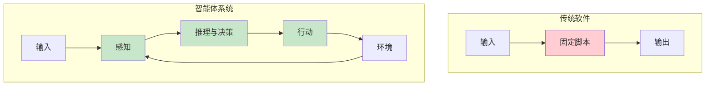

**示例：客户查询管理**

| 传统系统 | 智能体系统 |
|-------------------|----------------|
| 遵循固定脚本 | 感知查询的细微差别 |
| 线性路径 | 动态访问知识库 |
| 无法适应 | 与其他系统（如订单管理）交互 |
| 被动响应 | 主动提出澄清性问题 |
| 反应式 | 预判未来需求 |

**智能体系统的核心特征**

```mermaid
mindmap
  root((智能体系统))
    自主性 Autonomy
      无需人类监督即可行动
      自主执行
    主动性 Proactiveness
      启动朝向目标的行动
      预判需求
    反应性 Reactiveness
      响应环境变化
      动态适应
    目标导向 Goal-Oriented
      不断朝向目标工作
      衡量进度
    工具调用 Tool Use
      与外部 API 交互
      访问数据库和服务
    记忆 Memory
      跨交互保留信息
      从经验中学习
    通信 Communication
      与用户交互
      与其他 Agent 协作
```

**“画布”比喻**

智能体系统在应用程序基础设施的“画布”上运行，利用可用的服务和数据。

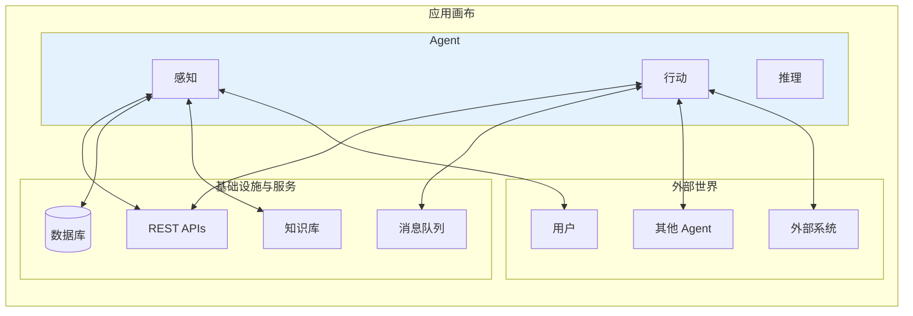

**复杂性挑战**

有效地实现这些特征会带来显著的复杂性：

| 挑战 | 需要解决的问题 |
|-----------|---------------------|
| **状态管理** | Agent 如何跨多个步骤维护状态？ |
| **工具选择** | 它如何决定何时以及如何使用工具？ |
| **Agent 通信** | 不同 Agent 之间的通信如何管理？ |
| **韧性** | 如何处理意外结果或错误？ |
| **目标达成** | Agent 如何知道它何时取得了成功？ |

---

## 为什么模式在 Agent 开发中至关重要

这种复杂性正是**智能体设计模式 (Agentic Design Patterns)** 不可或缺的原因。

**什么是设计模式？**

设计模式**不是僵化的规则**。相反，它们是经过实战检验的模板或蓝图，为智能体领域中的标准设计和实现挑战提供经过验证的方法。

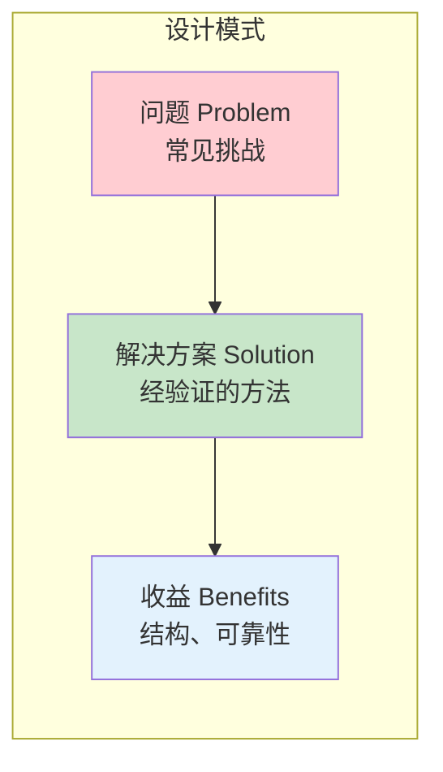

**关键收益**

| 收益 | 对你的 Agent 的影响 |
|---------|----------------------|
| **成熟的方案** | 避免重新发明基础方法 |
| **通用语言** | 与团队沟通更清晰 |
| **结构与清晰度** | 易于理解和维护 |
| **可靠性** | 经过验证的错误处理和状态管理 |
| **开发速度** | 专注于独特方面，而非基础机制 |
| **可维护性** | 他人可识别的既定模式 |

**模式优势**

**没有模式：**
```
每个 Agent = 自定义实现
├── 不同的状态管理方法
├── 不一致的错误处理
├── 独特的通信协议
└── 难以维护和扩展
```

**有了模式：**
```
所有 Agent = 一致的基础
├── 针对常见问题的标准化模式
├── 可预测的行为
├── 易于扩展和修改
└── 可扩展的架构
```

**本章介绍的模式**

本章涵盖了 **10 种基础设计模式**，它们代表了构建复杂 Agent 的核心构建块：

**单 Agent 模式：**
1. 提示词链 Prompt Chaining (流水线)
2. ReAct (推理 + 行动)
3. 规划与解决 Plan-and-Solve
4. 反思 Reflection
5. 自我一致性 Self-Consistency

**多 Agent 模式：**
6. 管理者 Supervisor
7. 层级式 Hierarchical
8. 顺序式 Sequential
9. 辩论式 Debate

**协作模式：**
10. 查询路由 Query Router

### 为什么需要多 Agent 系统？

单 Agent 系统在处理复杂、多方面的问题时存在局限性：

**单 Agent 局限性：**
- **认知过载**：一个 Agent 试图处理复杂任务的所有方面
- **缺乏专业化**：通用 Agent 可能缺乏深厚的领域专长
- **没有协作**：无法利用多种观点或方法
- **顺序瓶颈**：任务必须等待前一个任务完成
- **单点故障**：如果 Agent 失败，整个系统都会失败

**多 Agent 优势：**

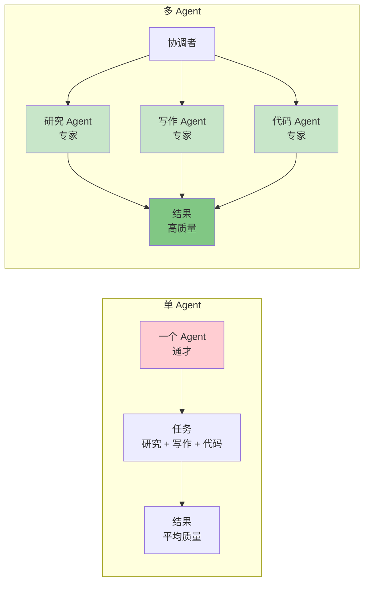

| 收益 | 单 Agent | 多 Agent |
|---------|--------------|-------------|
| **专业化** | ❌ 通用知识 | ✅ 深厚的领域专长 |
| **并行化** | ❌ 仅限顺序 | ✅ 并发执行 |
| **质量** | ⚠️ 波动较大 | ✅ 质量更高 |
| **可靠性** | ❌ 单点故障 | ✅ 容错能力 |
| **扩展性** | ⚠️ 有限 | ✅ 易于扩展 |
| **复杂度** | ✅ 简单 | ⚠️ 较难协调 |

### 多 Agent 架构模式

多 Agent 系统可以通过几种方式组织：

**1. 扁平化协调 (Flat Coordination)**

所有 Agent 都是对等的，由一个中央管理者协调：

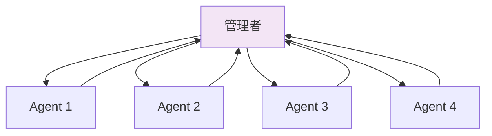

**2. 层级组织 (Hierarchical Organization)**

Agent 被组织在不同的级别，每个级别都有经理：

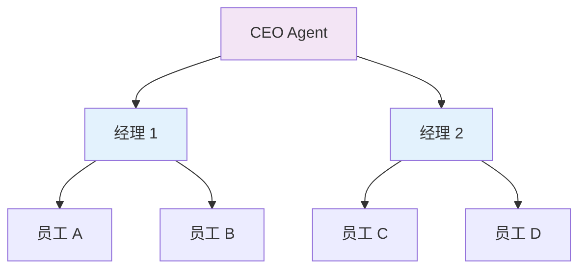

**3. 顺序流水线 (Sequential Pipeline)**

Agent 在流水线中传递工作：

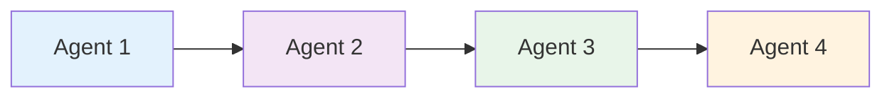

**4. 辩论/审议 (Debate/Deliberation)**

Agent 讨论并对决策进行投票：

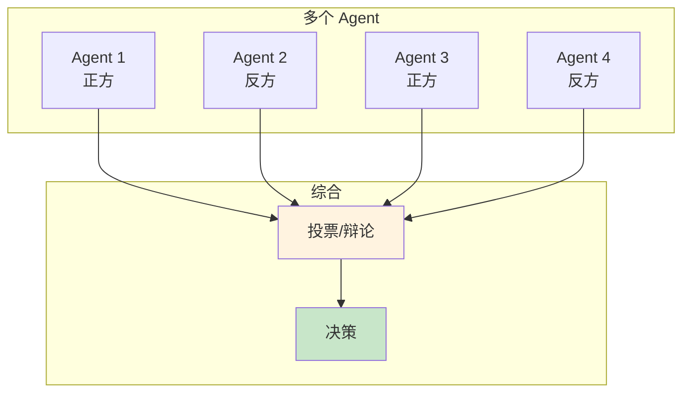

### 多 Agent 核心概念

**1. Agent 角色 (Agent Roles)**

专业化的 Agent 承担特定职责：
- **研究员 (Researcher)**：信息收集与分析
- **撰稿人 (Writer)**：内容创作与草拟
- **程序员 (Coder)**：编程与技术实现
- **评审员 (Reviewer)**：质量保证与验证
- **规划员 (Planner)**：任务分解与调度
- **批评者 (Critic)**：评估与反馈

**2. 通信模式 (Communication Patterns)**

Agent 如何交换信息：
- **直接消息**：点对点通信
- **广播**：一对多通知
- **共享记忆**：公共知识库
- **消息队列**：异步通信
- **黑板模式**：共享工作区

**3. 协调机制 (Coordination Mechanisms)**

Agent 如何协作：
- **集中式**：管理者做出所有决定
- **去中心化**：Agent 之间互相协商
- **层级式**：多层级的指挥链
- **点对点**：通过投票/共识的扁平化组织

**4. 同步策略 (Synchronization Strategies)**

Agent 如何协调其行动：
- **顺序执行**：一次一个 Agent
- **并行执行**：独立 Agent 同时工作
- **流水线执行**：每个 Agent 完成其部分后传递给下一个
- **自适应执行**：基于工作负载的动态分配

### 何时使用多 Agent 系统

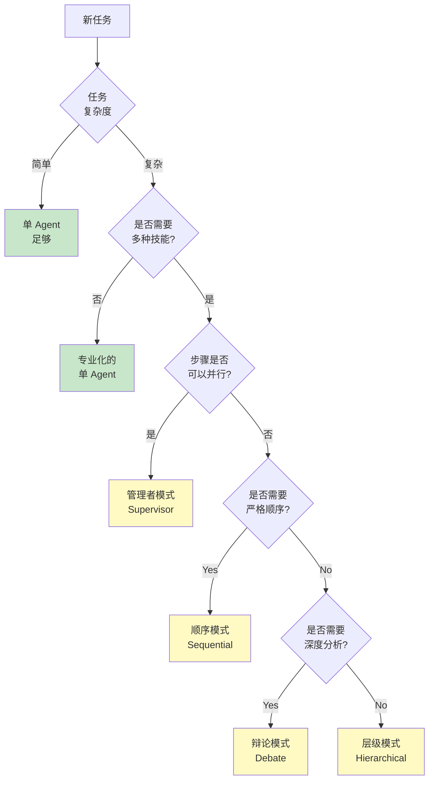

**在以下情况使用多 Agent 系统：**
- ✅ 任务需要多种不同的技能（研究 + 写作 + 编码）
- ✅ 子任务可以并行化以提高性能
- ✅ 质量受益于多个视角
- ✅ 系统需要容错能力和冗余
- ✅ 任务太复杂，单个 Agent 无法很好处理
- ✅ 你需要特定领域的专家知识

**在以下情况坚持使用单 Agent：**
- ❌ 任务简单直接
- ❌ 协调开销不合理
- ❌ 预算限制倾向于最少的 LLM 调用
- ❌ 任务需要步骤间紧密、即时的集成
- ❌ 速度比质量更重要

这些模式提供了一个工具箱，用于构建能够：
- 处理复杂的多步任务
- 与其他 Agent 协调
- 跨交互维护上下文
- 优雅地处理错误
- 从简单工作流扩展到复杂工作流

---

## 模式选择快速参考

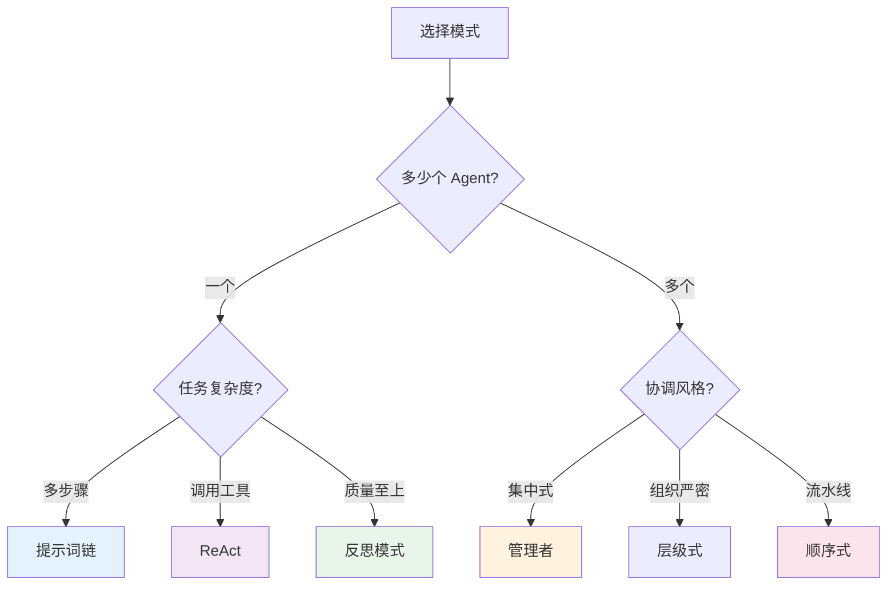

**模式复杂度指南**

| 模式 | 复杂度 | 最适合 | 学习曲线 |
|---------|-----------|----------|----------------|
| **提示词链** | ⭐ | 多步骤工作流 | 低 |
| **ReAct** | ⭐ | 使用工具的 Agent | 低 |
| **顺序模式** | ⭐ | 流水线 | 低 |
| **反思模式** | ⭐⭐ | 质量提升 | 中 |
| **规划并解决** | ⭐⭐ | 目标明确的任务 | 中 |
| **路由模式** | ⭐⭐ | 查询分类 | 中 |
| **自我一致性** | ⭐⭐ | 减少随机性 | 中 |
| **管理者模式** | ⭐⭐⭐ | 复杂工作流 | 高 |
| **辩论模式** | ⭐⭐⭐ | 决策制定 | 高 |
| **层级模式** | ⭐⭐⭐⭐ | 大型系统 | 极高 |

---

**现在让我们深入探讨这些模式，首先从基础的单 Agent 方法开始。**

---

## 3.1 单 Agent 模式

### 模式 1：提示词链 Prompt Chaining (流水线模式)

通过将复杂问题分解为一系列更简单、更易管理的子任务，提示词链为引导大语言模型提供了一个健壮的框架。这种“分而治之”的策略通过一次只专注于模型的一个特定操作，显著增强了输出的可靠性和可控性。

#### 什么是提示词链？

提示词链（有时被称为 **流水线 (Pipeline) 模式**）代表了利用大语言模型 (LLM) 处理错综复杂任务的一种强大范式。提示词链不寄希望于 LLM 在一个单一、庞大的步骤中解决复杂问题，而是提倡一种分而治之的策略。

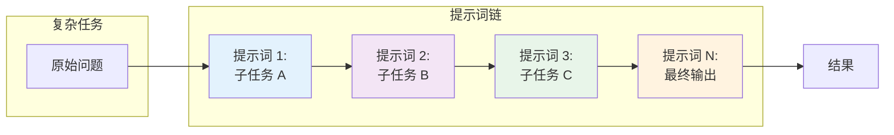

**核心思想：**
- 将原始的、令人畏惧的问题分解为一系列更小、更易处理的子问题
- 每个子问题都通过专门设计的提示词单独解决
- 一个提示词生成的输出被策略性地作为输入喂给链条中的后续提示词
- 这建立了一个依赖链，先前操作的上下文和结果引导后续处理

#### 为什么要使用它？（单一提示词的问题）

对于多方面的任务，对 LLM 使用单一的复杂提示词可能是低效且不可靠的：

| 问题 | 描述 | 示例 |
|-------|-------------|---------|
| **指令忽视** | 模型忽略了提示词的部分内容 | “总结并提取数据并起草邮件” —— 模型可能只做了总结 |
| **上下文漂移** | 模型丢失了初始上下文 | 长的提示词导致模型忘记了早期的指令 |
| **错误传播** | 早期的错误在响应中被放大 | 第一步中的错误分析会影响所有后续步骤 |
| **上下文窗口限制** | 复杂任务的信息不足 | 无法在一个提示词中塞进所有要求 |
| **幻觉增加** | 认知负荷越高 = 错误越多 | 复杂的多步请求会产生错误信息 |

**典型的失败场景：**
```
查询：“分析这份市场研究报告，总结发现，用数据点识别趋势，并向营销团队起草一封电子邮件。”

可能的结果：模型总结得很好，但未能提取特定数据或起草了质量很差的邮件，因为认知负荷太高了。
```

#### 通过顺序分解增强可靠性

提示词链通过将复杂任务分解为专注的、顺序的工作流来解决这些挑战：

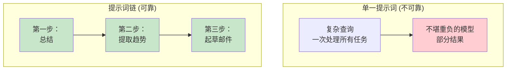

**链式方法示例：**

**第一步：总结**
```
提示词：“总结以下市场研究报告的关键发现：[文本]”
焦点：仅限总结
```

**第二步：趋势识别**
```
提示词：“使用该总结，识别前三大新兴趋势，并提取支持每个趋势的具体数据点：[第一步的输出]”
焦点：数据提取
```

**第三步：邮件撰写**
```
提示词：“向营销团队起草一封简明的邮件，概述以下趋势及其支持数据：[第二步的输出]”
焦点：沟通
```

#### 关键机制

##### 1. 每个阶段的角色分配

为每个阶段分配不同的角色以提高专注度：

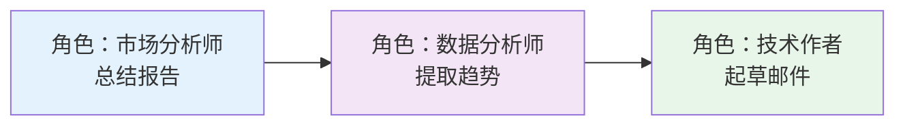

##### 2. 结构化输出

提示词链的可靠性高度依赖于步骤之间传递的数据完整性。**指定结构化输出格式** (JSON, XML) 至关重要。

```java
// 示例：趋势识别的结构化输出
public record TrendData(
    String trendName,
    String supportingData
) {}

// 输出格式
TrendData[] trends = {
    new TrendData(
        "AI 驱动的个性化",
        "73% 的消费者更喜欢使用个人信息进行相关购物的品牌"
    ),
    new TrendData(
        "可持续品牌",
        "ESG 产品销售额增长了 28%，而没有 ESG 声明的产品增长率为 20%"
    )
};
```

这种结构化格式确保数据是机器可读的，并且可以被精确解析并插入到下一个提示词中而不会产生歧义。

#### 实际应用与用例

##### 1. 信息处理工作流

```
提示词 1：从文档中提取文本内容
    ↓
提示词 2：总结清洗后的文本
    ↓
提示词 3：提取特定实体（名称、日期、地点）
    ↓
提示词 4：使用实体搜索知识库
    ↓
提示词 5：生成最终报告
```

**应用**：自动化内容分析、AI 研究助手、复杂报告生成

##### 2. 复杂查询回答

问题：*“1929 年股市崩盘的主要原因是什么，政府政策是如何应对的？”*

```
提示词 1：识别核心子问题（原因、政府应对）
    ↓
提示词 2：研究崩盘的原因
    ↓
提示词 3：研究政府政策应对
    ↓
提示词 4：将信息综合成连贯的回答
```

##### 3. 数据提取与转换

```
提示词 1：从发票中提取字段（姓名、地址、金额）
    ↓
处理：验证所有必填字段是否存在
    ↓
提示词 2 (有条件的)：如果缺失/格式错误，以特定焦点重试
    ↓
处理：再次验证结果
    ↓
输出：结构化、验证后的数据
```

**应用**：OCR 处理、表单数据提取、发票处理

##### 4. 内容生成工作流

```
提示词 1：生成 5 个选题创意
    ↓
处理：用户选择最佳创意
    ↓
提示词 2：生成详细大纲
    ↓
提示词 3-N：编写每个部分（带有前一部分的上下文）
    ↓
最终提示词：评审并细化连贯性和语气
```

**应用**：创意写作、技术文档、博客生成

##### 5. 带有状态的对话式 Agent

```
提示词 1：处理用户话语，识别意图和实体
    ↓
处理：更新对话状态
    ↓
提示词 2：根据状态生成响应并识别接下来需要的信息
    ↓
在随后的轮次中重复...
```

##### 6. 代码生成与优化

```
提示词 1：生成伪代码/大纲
    ↓
提示词 2：编写初始代码草案
    ↓
提示词 3：识别错误和改进点
    ↓
提示词 4：根据问题优化代码
    ↓
提示词 5：添加文档和测试
```

##### 实现：Spring AI 示例

```java
@Service
public class PromptChainingService {

    @Autowired
    private ChatClient chatClient;

    /**
     * 链条：提取 → 转换为 JSON → 验证
     */
    public String processTechnicalSpecs(String inputText) {
        // 第一步：提取信息
        String extracted = extractSpecs(inputText);
        log.info("Step 1 - Extracted: {}", extracted);

        // 第二步：转换为 JSON
        String json = transformToJson(extracted);
        log.info("Step 2 - JSON: {}", json);

        // 第三步：验证
        boolean isValid = validateJson(json);
        if (!isValid) {
            // 重试并细化
            json = refineJson(extracted);
        }

        return json;
    }

    private String extractSpecs(String text) {
        return chatClient.prompt()
            .system("你是一个技术规格提取专家。")
            .user("从以下内容中提取技术规格： {text}")
            .param("text", text)
            .call()
            .content();
    }

    private String transformToJson(String specs) {
        return chatClient.prompt()
            .system("你是一个数据格式化专家。始终返回有效的 JSON。")
            .user("""
                将这些规格转换为包含 'cpu'、'memory' 和 'storage' 键的 JSON 对象：

                {specs}

                仅返回 JSON 对象，不要有额外的文本。
                """.formatted(specs))
            .call()
            .content();
    }

    private boolean validateJson(String json) {
        try {
            ObjectMapper mapper = new ObjectMapper();
            mapper.readTree(json);
            return true;
        } catch (Exception e) {
            return false;
        }
    }

    private String refineJson(String specs) {
        return chatClient.prompt()
            .system("你是一个 JSON 专家。修复无效的 JSON。")
            .user("""
                以下输出不是有效的 JSON。请修复它：

                {specs}

                仅返回有效的 JSON。
                """.formatted(specs))
            .call()
            .content();
    }
}
```

#### 高级模式：并行 + 顺序

复杂操作通常将独立任务的并行处理与依赖步骤的提示词链相结合：

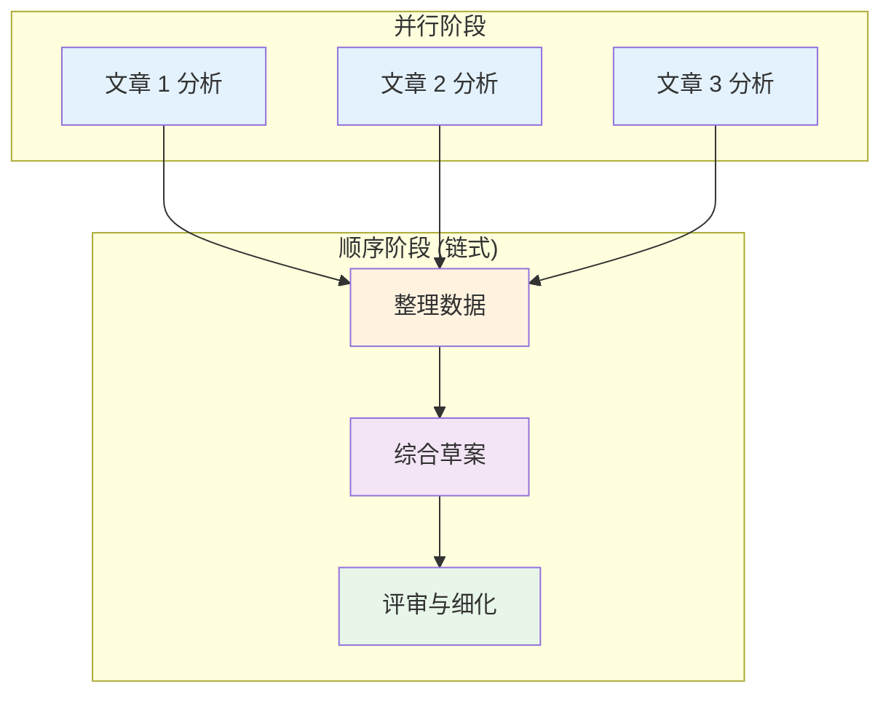

**示例实现**：

```java
@Service
public class ParallelSequentialService {

    @Autowired
    private ChatClient chatClient;

    public String generateComprehensiveReport(List<String> articleUrls) {
        // 并行阶段：同时从所有文章中提取信息
        List<CompletableFuture<ArticleInfo>> futures = articleUrls.stream()
            .map(url -> CompletableFuture.supplyAsync(
                () -> extractArticleInfo(url), executor))
            .toList();

        // 等待所有并行提取完成
        List<ArticleInfo> infos = futures.stream()
            .map(CompletableFuture::join)
            .toList();

        // 顺序阶段：依赖操作链
        String collated = collateData(infos);
        String draft = synthesizeDraft(collated);
        String refined = reviewAndRefine(draft);

        return refined;
    }

    private String collateData(List<ArticleInfo> infos) {
        // 顺序链的第一步
        return chatClient.prompt()
            .user("将这些文章摘要整理成条理清晰的笔记： {infos}")
            .param("infos", infos.toString())
            .call()
            .content();
    }

    private String synthesizeDraft(String collated) {
        // 第二步：使用第一步的输出
        return chatClient.prompt()
            .user("根据以下内容写一份综合报告： {collated}")
            .param("collated", collated)
            .call()
            .content();
    }

    private String reviewAndRefine(String draft) {
        // 第三步：使用第二步的输出
        return chatClient.prompt()
            .user("检查并优化此报告的清晰度和准确性： {draft}")
            .param("draft", draft)
            .call()
            .content();
    }
}
```

#### 局限性

| 局限性 | 描述 | 缓解措施 |
|-----------|-------------|------------|
| **延迟** | 多个顺序 LLM 调用 = 速度较慢 | 在可能的情况下并行化独立步骤 |
| **成本** | 每一步都会消耗 Token | 对中间步骤使用较小的模型 |
| **错误累积** | 早期步骤的错误会影响后续步骤 | 在步骤之间添加验证和重试逻辑 |
| **复杂度** | 更多需要管理的移动部件 | 使用框架（LangChain, LangGraph）进行编排 |
| **状态管理** | 在步骤之间传递状态可能很复杂 | 使用结构化格式并定义清晰的契约 |

#### 与上下文工程的关系

提示词链是一个基础技术，它使 **上下文工程 (Context Engineering)** 成为可能 —— 上下文工程是一门系统地设计并为 AI 模型提供完整信息环境的学科。

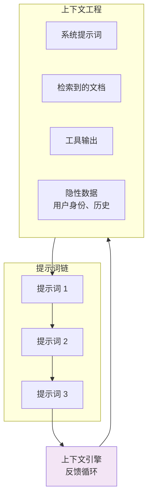

**上下文工程组件：**
- **系统提示词 (System Prompt)**：基础指令（例如“你是一个技术作者”）
- **检索到的文档 (Retrieved Documents)**：从知识库中获取
- **工具输出 (Tool Outputs)**：来自 API 调用或数据库查询的结果
- **隐性数据 (Implicit Data)**：用户身份、交互历史、环境状态

提示词链支持对该上下文进行迭代细化，创建一个反馈循环，其中每一步都为下一步丰富了信息环境。

#### 何时使用提示词链

| 场景 | 使用链式？ | 原因 |
|----------|--------------|--------|
| **简单问答** | ❌ 否 | 单一提示词足够 |
| **多步推理** | ✅ 是 | 每一步都需要专门的焦点 |
| **外部工具集成** | ✅ 是 | 需要处理工具输出 |
| **内容生成流水线** | ✅ 是 | 自然递进（大纲 → 草案 → 细化） |
| **数据提取** | ✅ 是 | 可能需要验证和重试 |
| **实时性要求** | ❌ 视情况而定 | 考虑延迟影响 |

##### 最佳实践

1. **逆向设计**：从最终输出格式开始倒推
2. **步骤间验证**：在传递给下一个提示词之前检查输出
3. **使用结构化格式**：对机器可读的中间输出使用 JSON/XML
4. **分配明确角色**：为每个阶段使用不同的系统提示词
5. **优雅处理失败**：为单个步骤实现重试逻辑
6. **监控 Token 使用**：链条长度会迅速增加成本
7. **记录中间输出**：对于调试和优化至关重要

---

### 模式 2：ReAct Agent (推理 + 行动)

使用工具的 Agent 的基础模式。

#### 工作原理

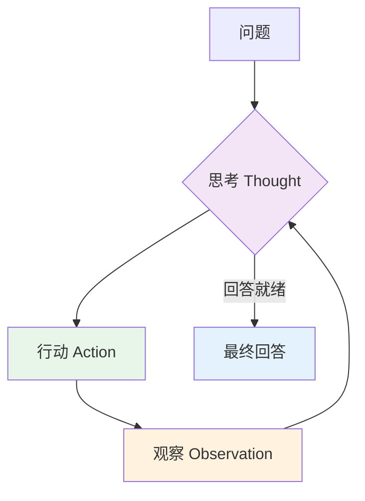

#### 实现步骤

1. **思考 (Thought)**：Agent 推理接下来该做什么
2. **行动 (Action)**：Agent 执行一个工具
3. **观察 (Observation)**：Agent 观察结果
4. **迭代 (Iterate)**：重复直到达成目标

#### 示例：研究 Agent

```java
// Spring AI: ReAct Agent
@Service
public class ReactAgent {

    @Autowired
    private ChatClient chatClient;

    @Autowired
    private ToolService toolService;

    public String execute(String query, int maxIterations) {
        String context = query;
        String thought;
        String action;
        String observation;

        for (int i = 0; i < maxIterations; i++) {
            // 思考
            thought = chatClient.prompt()
                .user(u -> u.text(
                    "问题： " + context + "\n" +
                    "思考：让我一步步思考这个问题。"
                ))
                .call()
                .content();

            // 决定行动
            if (shouldAnswerDirectly(thought)) {
                return extractAnswer(thought);
            }

            // 行动
            action = extractAction(thought);
            observation = toolService.execute(action);

            // 观察并继续
            context = String.format(
                "问题：%s\n思考：%s\n行动：%s\n观察：%s",
                query, thought, action, observation
            );
        }

        return "已达到最大迭代次数";
    }
}
```

##### 最佳实践

- **清晰思考**：明确的推理有助于调试
- **具体动作**：工具应具有明确的用途
- **丰富的观察**：返回详细的工具输出
- **迭代限制**：防止无限循环

---

### 模式 3：工具调用模式 Tool Use (Function Calling)

**工具调用模式**（也称为 **函数调用 Function Calling**）是使 LLM 能够与外部系统交互的基础模式，克服了它们在静态知识和无法执行行动方面的固有局限。此模式对于构建能够在现实世界环境中运行的实用 AI Agent 至关重要。

#### 核心概念：为什么 Agent 需要工具？

**LLM 的局限性**

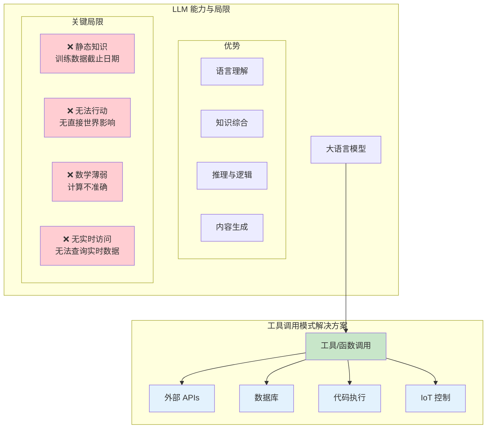

**两个基本问题**

| 问题 | 描述 | 示例 |
|---------|-------------|---------|
| **知识停滞** | 训练数据有截止日期；LLM 无法知道训练之后的事件 | “今天天气怎么样？” —— LLM 不知道今天的天气 |
| **无法行动** | LLM 生成文本但无法直接影响现实世界 | “给约翰发邮件” —— LLM 只能写邮件文本，不能发送 |
| **数学薄弱** | LLM 难以进行精确计算 | “计算 √234.567” —— 可能会产生近似值 |
| **无实时访问** | 无法获取实时信息 | “苹果的股价是多少？” —— 无法访问实时市场 |

**工具调用作为解决方案**

工具调用模式通过以下方式赋予 LLM “手和眼”：
- **连接到外部 API**：实时数据访问
- **执行行动**：修改数据库、发送消息、控制设备
- **精确计算**：使用计算器、Python 或专用工具
- **代码执行**：在沙盒环境中运行代码

**工具调用比喻**

```
┌─────────────────────────────────────────────────────────────┐
│  没有工具： 有了工具：                            │
│                                                             │
│    ┌─────────┐    ┌────────────┐                           │
│    │   LLM    │    │    LLM     │                           │
│    │  (大脑)   │    │   (大脑)    │                           │
│    └────┬────┘    └─────┬──────┘                           │
│         │               │                                     │
│         │               ▼                                     │
│         │        ┌────────────┐                              │
│         │        │  工具调用  │                              │
│         │        │    机制    │                              │
│         │        └──────┬──────┘                              │
│         │               │                                     │
│         ▼               ▼                                     │
│    [生成文本]  [┌──────┐ ┌─────┐ ┌──────┐]      │
│                    │天气  │ │ 数据库│ │ 邮件  │       │
│                    │ API  │ │  API │ │  API │       │
│                    └──────┘ └─────┘ └──────┘       │
└─────────────────────────────────────────────────────────────┘
```

#### 6 步工作流

工具调用遵循一个结构化循环，将自然语言请求转换为具体行动：

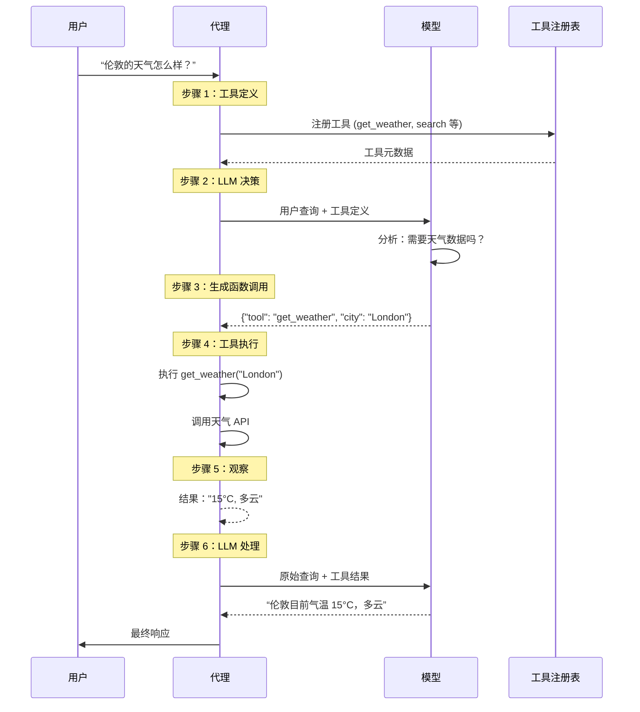

**详细分步解析**

##### 步骤 1：工具定义

开发人员预先定义带有结构化元数据的工具：

```java
@Component
public class WeatherTool {

    // 带有元数据的工具定义
    @FunctionDescription(
        name = "get_weather",
        description = "获取指定地点的当前天气",
        parameters = {
            @FunctionParameter(
                name = "location",
                type = "string",
                description = "城市名称，例如 London, Tokyo"
            ),
            @FunctionParameter(
                name = "unit",
                type = "string",
                description = "温度单位 (celsius 或 fahrenheit)",
                required = false
            )
        }
    )
    public String getWeather(
            String location,
            @DefaultValue("celsius") String unit) {
        // 实际实现
        WeatherService weatherService = new WeatherService();
        return weatherService.getCurrentWeather(location, unit);
    }
}
```

**最佳实践：工具元数据质量**

良好的工具描述对于 LLM 的理解至关重要：

```java
// ❌ 错误：描述模糊
@FunctionDescription(
    name = "get_data",
    description = "获取一些数据"  // 太含糊
)

// ✅ 正确：描述具体
@FunctionDescription(
    name = "get_weather",
    description = """
        获取指定地点的当前天气状况，包括温度、
        湿度、风速和天气描述。返回来自气象
        传感器的实时数据。
        """,
    parameters = {
        @FunctionParameter(
            name = "location",
            type = "string",
            description = """
                城市名称，格式为 "城市, 国家" 或 "城市, 州"。
                例如: "London, UK", "New York, NY", "Tokyo, Japan"
                """
        )
    }
)
```

##### 步骤 2：LLM 决策制定

LLM 分析用户查询并决定是否使用工具：

```java
@Service
public class ToolDecisionAgent {

    @Autowired
    private ChatClient chatClient;

    public ChatResponse decideAndRespond(String userQuery) {
        return chatClient.prompt()
            .user(userQuery)
            .functions(getAvailableTools())  // 提供工具定义
            .call();
    }

    private List<FunctionCallback> getAvailableTools() {
        return List.of(
            FunctionCallback.builder()
                .function("get_weather", this::getWeather)
                .description("获取当前天气")
                .inputType(JsonObjectSchema.builder()
                    .addProperty("location", JsonStringSchema.builder().description("城市名称").build())
                    .build())
                .build(),
            FunctionCallback.builder()
                .function("search_database", this::searchDatabase)
                .description("搜索产品数据库")
                .inputType(JsonObjectSchema.builder()
                    .addProperty("query", JsonStringSchema.builder().description("搜索查询").build())
                    .build())
                .build()
        );
    }
}
```

##### 步骤 3：生成函数调用

当 LLM 决定使用工具时，它会生成结构化输出（通常是 JSON）：

```java
// LLM 生成结构化的函数调用
{
  "tool": "get_weather",
  "city": "London",
  "unit": "celsius"
}
```

##### 步骤 4：工具执行

Agent 框架拦截并执行该函数：

```java
@Service
public class ToolExecutor {

    @Autowired
    private ApplicationContext applicationContext;

    public ToolExecutionResult execute(FunctionCall call) {
        try {
            // 找到工具 Bean
            Object toolBean = applicationContext.getBean(call.toolName());

            // 使用反射调用方法
            Method method = findMethod(toolBean.getClass(), call.toolName());

            // 使用参数执行
            Object result = method.invoke(toolBean, call.parameters());

            return ToolExecutionResult.success(result);

        } catch (Exception e) {
            return ToolExecutionResult.failure(e.getMessage());
        }
    }
}
```

##### 步骤 5：观察 (Observation)

工具结果作为观察结果反馈给 LLM：

```java
public record ToolObservation(
    String toolName,
    Map<String, Object> input,
    Object output,
    long executionTimeMs,
    boolean success
) {}
```

##### 步骤 6：LLM 最终响应

LLM 生成最终的自然语言响应：

```java
// 最终的 LLM 提示词包括：
// - 原始用户查询
// - 所做的工具调用
// - 工具观察结果

LLM Prompt:
"""
用户查询：伦敦的天气怎么样？

工具调用：get_weather(location="London")

观察：15°C，多云，湿度 65%

响应：
"""
```

#### 实际用例

##### 用例 1：实时信息检索

**场景**：天气 Agent

```java
@RestController
@RequestMapping("/api/v1/weather")
public class WeatherAgentController {

    @Autowired
    private ChatClient chatClient;

    @PostMapping("/chat")
    public String chatWeather(@RequestBody String userMessage) {
        return chatClient.prompt()
            .user(userMessage)
            .functions(getWeatherTools())
            .call()
            .content();
    }

    private List<FunctionCallback> getWeatherTools() {
        return List.of(
            FunctionCallback.builder()
                .function("get_current_weather", this::getCurrentWeather)
                .description("获取指定地点的当前天气")
                .inputType(currentWeatherSchema())
                .build(),
            FunctionCallback.builder()
                .function("get_forecast", this::getForecast)
                .description("获取未来 5 天的天气预报")
                .inputType(forecastSchema())
                .build()
        );
    }

    private String getCurrentWeather(String location) {
        // 调用 OpenWeatherMap API
        RestTemplate restTemplate = new RestTemplate();
        String url = String.format(
            "https://api.openweathermap.org/data/2.5/weather?q=%s&appid=%s&units=metric",
            location,
            weatherApiKey
        );
        return restTemplate.getForObject(url, String.class);
    }

    private String getForecast(String location) {
        // 调用预报 API
        RestTemplate restTemplate = new RestTemplate();
        String url = String.format(
            "https://api.openweathermap.org/data/2.5/forecast?q=%s&appid=%s&units=metric",
            location,
            weatherApiKey
        );
        return restTemplate.getForObject(url, String.class);
    }
}
```

**用户体验流**：

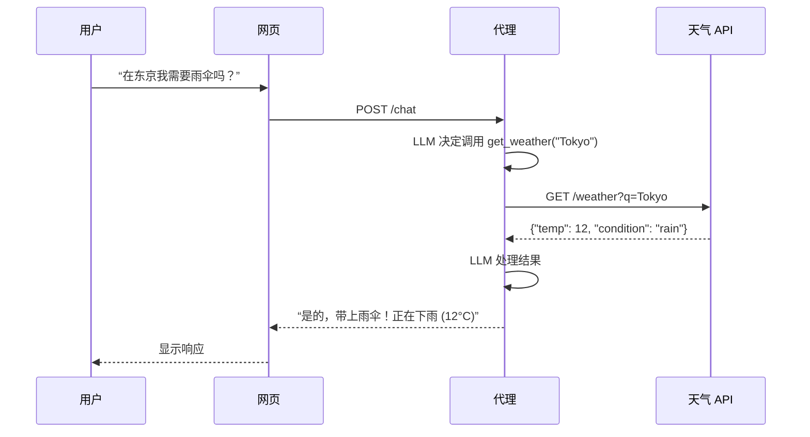

##### 用例 2：数据库/API 交互

**场景**：电商订单状态 Agent

```java
@Service
public class OrderManagementAgent {

    @Autowired
    private ChatClient chatClient;

    @Autowired
    private OrderRepository orderRepository;

    public String handleOrderQuery(String userMessage, Long userId) {
        return chatClient.prompt()
            .system("""
                你是一个客户服务 Agent。帮助用户检查订单状态、
                取消订单或请求退款。始终先验证用户拥有该订单。
                """)
            .user(userMessage)
            .functions(orderFunctions(userId))
            .call()
            .content();
    }

    private List<FunctionCallback> orderFunctions(Long userId) {
        return List.of(
            FunctionCallback.builder()
                .function("check_order_status", order -> checkOrderStatus(order.orderId(), userId))
                .description("检查订单状态")
                .inputType(JsonObjectSchema.builder()
                    .addProperty("orderId", JsonStringSchema.builder().description("订单 ID").build())
                    .build())
                .build(),
            FunctionCallback.builder()
                .function("cancel_order", order -> cancelOrder(order.orderId(), userId))
                .description("取消待处理订单")
                .inputType(JsonObjectSchema.builder()
                    .addProperty("orderId", JsonStringSchema.builder().description("订单 ID").build())
                    .build())
                .build(),
            FunctionCallback.builder()
                .function("request_refund", refund -> requestRefund(refund.orderId(), userId))
                .description("为已交付订单请求退款")
                .inputType(JsonObjectSchema.builder()
                    .addProperty("orderId", JsonStringSchema.builder().description("订单 ID").build())
                    .addProperty("reason", JsonStringSchema.builder().description("退款原因").build())
                    .build())
                .build()
        );
    }

    private OrderStatus checkOrderStatus(String orderId, Long userId) {
        Order order = orderRepository.findByIdAndUserId(Long.parseLong(orderId), userId)
            .orElseThrow(() -> new OrderNotFoundException(orderId));

        return new OrderStatus(
            order.getId(),
            order.getStatus(),
            order.getEstimatedDelivery(),
            order.getItems()
        );
    }

    private boolean cancelOrder(String orderId, Long userId) {
        Order order = orderRepository.findByIdAndUserId(Long.parseLong(orderId), userId)
            .orElseThrow(() -> new OrderNotFoundException(orderId));

        if (!order.getStatus().canCancel()) {
            throw new OrderCannotBeCancelledException(order.getStatus());
        }

        order.setStatus(OrderStatus.CANCELLED);
        orderRepository.save(order);
        return true;
    }

    private String requestRefund(String orderId, Long userId, String reason) {
        // 退款处理逻辑
        RefundResult refund = refundService.processRefund(Long.parseLong(orderId), reason);
        return refund.getReferenceNumber();
    }
}
```

##### 用例 3：计算与分析

**场景**：带 Python 的财务分析 Agent

```java
@Service
public class FinancialAnalysisAgent {

    @Autowired
    private ChatClient chatClient;

    public String analyzeInvestment(String analysisRequest) {
        return chatClient.prompt()
            .system("""
                你是一个财务分析师。使用 Python 计算器工具
                进行精确计算。始终解释你的计算过程。
                """)
            .user(analysisRequest)
            .functions(List.of(
                FunctionCallback.builder()
                    .function("python_calculator", this::executePython)
                    .description("执行 Python 代码进行计算")
                    .inputType(JsonObjectSchema.builder()
                        .addProperty("code", JsonStringSchema.builder().description("要执行的 Python 代码").build())
                        .build())
                    .build()
            ))
            .call()
            .content();
    }

    private String executePython(String code) {
        PythonExecutionResult result = pythonExecutor.execute(code);
        return result.getOutput();
    }

    public record PythonExecutionResult(
        String output,
        String error,
        long executionTimeMs
    ) {}
}
```

##### 用例 4：沟通

**场景**：邮件 Agent

```java
@Service
public class EmailAgent {

    @Autowired
    private ChatClient chatClient;

    @Autowired
    private JavaMailSender mailSender;

    public String handleEmailRequest(String request, String senderEmail) {
        return chatClient.prompt()
            .user(request)
            .functions(List.of(
                FunctionCallback.builder()
                    .function("send_email", email -> sendEmail(
                        email.to(),
                        email.subject(),
                        email.body(),
                        senderEmail
                    ))
                    .description("向收件人发送电子邮件")
                    .inputType(JsonObjectSchema.builder()
                        .addProperty("to", JsonStringSchema.builder().description("收件人邮箱").build())
                        .addProperty("subject", JsonStringSchema.builder().description("邮件主题").build())
                        .addProperty("body", JsonStringSchema.builder().description("邮件正文").build())
                        .build())
                    .build()
            ))
            .call()
            .content();
    }

    private String sendEmail(String to, String subject, String body, String from) {
        try {
            MimeMessage message = mailSender.createMimeMessage();
            message.setFrom(from);
            message.setRecipients(Message.RecipientType.TO, to);
            message.setSubject(subject);
            message.setText(body);

            mailSender.send(message);

            return "邮件成功发送至 " + to;

        } catch (MessagingException e) {
            return "发送邮件失败：" + e.getMessage();
        }
    }
}
```

##### 用例 5：IoT 控制

**场景**：智能家居 Agent

```java
@Service
public class SmartHomeAgent {

    @Autowired
    private ChatClient chatClient;

    @Autowired
    private IoTDeviceController deviceController;

    public String controlHome(String voiceCommand) {
        return chatClient.prompt()
            .user(voiceCommand)
            .functions(homeAutomationFunctions())
            .call()
            .content();
    }

    private List<FunctionCallback> homeAutomationFunctions() {
        return List.of(
            FunctionCallback.builder()
                .function("turn_off_light", cmd -> deviceController.execute(
                    "light",
                    cmd.deviceId(),
                    "turnOff"
                ))
                .description("关灯")
                .inputType(JsonObjectSchema.builder()
                    .addProperty("deviceId", JsonStringSchema.builder().description("灯具设备 ID").build())
                    .build())
                .build(),
            FunctionCallback.builder()
                .function("set_temperature", temp -> deviceController.execute(
                    "thermostat",
                    temp.deviceId(),
                    "setTemperature",
                    Map.of("target", temp.temperature())
                ))
                .description("设置恒温器温度")
                .inputType(JsonObjectSchema.builder()
                    .addProperty("deviceId", JsonStringSchema.builder().description("恒温器 ID").build())
                    .addProperty("temperature", JsonNumberSchema.builder().description("目标温度").build())
                    .build())
                .build()
        );
    }

    public record IoTDeviceController(
        String room,
        String action,
        Map<String, Object> parameters
    ) {}
}
```

#### 生产实现：Spring AI

完整的 Spring AI 工具调用设置：

```java
@Configuration
class ToolConfiguration {

    @Bean
    public ChatClient chatClient(ChatModel chatModel) {
        return ChatClient.builder(chatModel)
            .defaultFunctions(getAllToolFunctions())
            .build();
    }

    @Bean
    public List<FunctionCallback> getAllToolFunctions() {
        return List.of(
            // 天气工具
            weatherFunctions(),
            // 数据库工具
            databaseFunctions(),
            // 沟通工具
            communicationTools(),
            // 计算工具
            computationTools()
        ).stream()
            .flatMap(List::stream)
            .collect(Collectors.toList());
    }

    private List<FunctionCallback> weatherFunctions() {
        return List.of(
            FunctionCallback.builder("get_weather")
                .description("获取当前天气")
                .inputType(schema -> schema.string("location"))
                .builder()
                .method(this::getWeather)
        );
    }
}

@Service
public class ToolUseOrchestrator {

    private final ChatClient chatClient;

    public String processWithTools(String userQuery) {
        // 单个调用，带自动工具执行
        return chatClient.prompt()
            .user(userQuery)
            .functions()  // 自动函数调用
            .call()
            .content();
    }

    // 带工具调用的流式输出
    public Flux<String> processWithToolsStreaming(String userQuery) {
        return chatClient.prompt()
            .user(userQuery)
            .functions()
            .stream()
            .content();
    }
}
```

#### 高级工具调用模式

##### 模式 1：工具链 Tool Chaining

按顺序执行多个工具，其中一个输出作为下一个的输入：

```java
@Service
public class ToolChainingAgent {

    public String chainTools(String researchQuery) {
        // 第 1 步：搜索信息
        String searchResults = executeTool("search", Map.of("query", researchQuery));

        // 第 2 步：从搜索结果中提取实体
        String entities = executeTool("extract_entities", Map.of("text", searchResults));

        // 第 3 步：丰富数据库查询
        String enriched = executeTool("database_lookup", Map.of("entities", entities));

        // 第 4 步：生成摘要
        return generateSummary(researchQuery, searchResults, enriched);
    }
}
```

##### 模式 2：并行工具执行

同时执行多个独立的工具：

```java
@Service
public class ParallelToolAgent {

    @Autowired
    private ExecutorService executor;

    public Map<String, Object> parallelToolExecution(String task) {
        // 识别所需工具
        List<String> requiredTools = identifyTools(task);

        // 并行执行所有工具
        Map<String, CompletableFuture<Object>> futures = requiredTools.stream()
            .collect(Collectors.toMap(
                tool -> tool,
                tool -> CompletableFuture.supplyAsync(
                    () -> executeTool(tool, extractParams(task, tool)),
                    executor
                )
            ));

        // 等待所有任务完成
        CompletableFuture.allOf(futures.values().toArray(new CompletableFuture[0])).join();

        // 收集结果
        return futures.entrySet().stream()
            .collect(Collectors.toMap(
                Map.Entry::getKey,
                entry -> entry.getValue().join()
            ));
    }
}
```

##### 模式 3：动态工具选择

LLM 动态决定使用哪些工具：

```java
@Service
public class DynamicToolAgent {

    public String executeWithDynamicTools(String userQuery) {
        // 让 LLM 决定使用哪些工具
        ToolSelection selection = chatClient.prompt()
            .system("""
                分析用户查询并确定需要哪些工具。
                可用工具：search, calculator, database, email
                返回包含所选工具及参数的 JSON。
                """)
            .user("查询： " + userQuery)
            .call()
            .entity(ToolSelection.class);

        // 执行所选工具
        Map<String, Object> results = new HashMap<>();
        for (ToolCall toolCall : selection.tools()) {
            Object result = executeTool(toolCall.name(), toolCall.parameters());
            results.put(toolCall.name(), result);
        }

        // 生成最终响应
        return chatClient.prompt()
            .user(userQuery)
            .user("工具结果： " + results)
            .call()
            .content();
    }
}
```

#### 最佳实践

##### 1. 工具设计原则

```java
// ✅ 正确：单一用途工具
@FunctionDescription("get_weather")
public String getWeather(String location) { }

// ✅ 正确：清晰、具体的参数
@FunctionDescription("search_products")
public List<Product> searchProducts(
    @JsonProperty("query") String query,
    @JsonProperty("category") String category,
    @JsonProperty("limit") @DefaultValue("10") int limit
) { }

// ❌ 错误：过度复杂的工具
@FunctionDescription("do_everything")
public String doEverything(Object... params) { }
```

##### 2. 错误处理

```java
@Service
public class SafeToolExecutor {

    public ToolResult executeToolSafely(String toolName, Map<String, Object> params) {
        try {
            Object result = executeTool(toolName, params);
            return ToolResult.success(result);

        } catch (ToolNotFoundException e) {
            return ToolResult.error("工具未找到：" + toolName);

        } catch (ToolExecutionException e) {
            return ToolResult.error("执行失败：" + e.getMessage());

        } catch (Exception e) {
            return ToolResult.error("发生意外错误：" + e.getMessage());
        }
    }

    public record ToolResult(
        boolean success,
        Object data,
        String error
    ) {
        public static ToolResult success(Object data) {
            return new ToolResult(true, data, null);
        }

        public static ToolResult error(String error) {
            return new ToolResult(false, null, error);
        }
    }
}
```

##### 3. 工具结果验证

```java
@Component
public class ToolResultValidator {

    public <T> T validateToolResult(
            Object rawResult,
            Class<T> expectedType,
            String toolName) {

        if (rawResult == null) {
            throw new ToolExecutionException(
                toolName + " 返回了空结果"
            );
        }

        try {
            // 验证类型
            if (!expectedType.isInstance(rawResult)) {
                throw new ToolExecutionException(
                    toolName + " 返回了错误类型：" + rawResult.getClass()
                );
            }

            return expectedType.cast(rawResult);

        } catch (Exception e) {
            throw new ToolExecutionException(
                "验证工具结果失败：" + e.getMessage()
            );
        }
    }
}
```

#### 监控与可观测性

```java
@Component
public class ToolMetrics {

    private final MeterRegistry meterRegistry;

    public void recordToolExecution(
            String toolName,
            long durationMs,
            boolean success) {

        // 执行耗时
        meterRegistry.timer("agent.tool.duration",
            "tool", toolName,
            "success", String.valueOf(success)
        ).record(durationMs, TimeUnit.MILLISECONDS);

        // 成功率
        meterRegistry.counter("agent.tool.calls",
            "tool", toolName,
            "status", success ? "success" : "failure"
        ).increment();
    }

    public void recordToolError(String toolName, String errorType) {
        meterRegistry.counter("agent.tool.errors",
            "tool", toolName,
            "error_type", errorType
        ).increment();
    }
}
```

#### 核心要点

1. **工具实现了现实世界交互**：将 LLM 从文本生成器转变为具备行动能力的 Agent
2. **6 步循环**：定义 → 决策 → 调用 → 执行 → 观察 → 响应
3. **结构化元数据**：工具描述对于 LLM 的理解至关重要
4. **错误处理**：始终实现健壮的错误处理和验证
5. **并行执行**：对独立操作使用并发工具执行
6. **安全**：验证工具输入并清洗输出，以防止注入攻击
7. **可观测性**：监控工具的使用情况、性能和错误率

---

### 模式 4：规划模式 Planning Pattern
