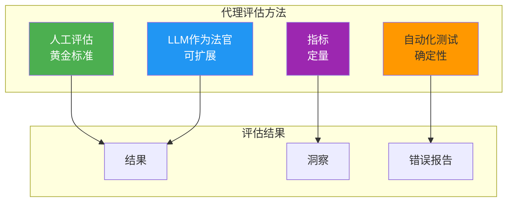
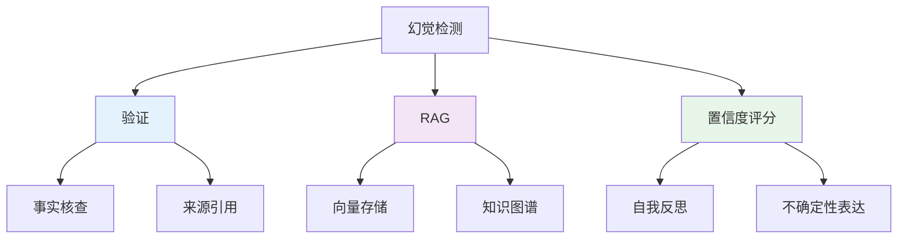
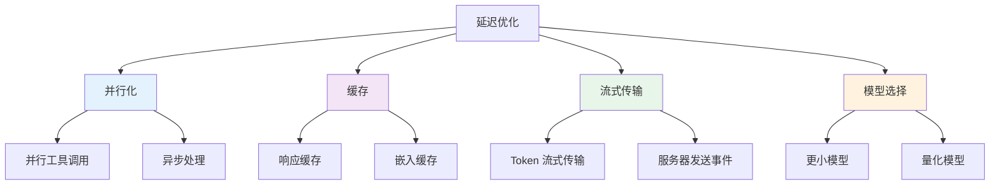

# 5. 工程挑战与生产就绪性

在原型中工作的代理与在生产环境中可靠工作的代理有着本质区别。本节涵盖生产级 AI 代理的关键工程挑战、评估方法、安全考虑和部署策略。

---

## 5.1 代理评估

由于非确定性和复杂性，代理性能评估与传统软件测试有着根本的不同。

### 评估方法



### 1. LLM作为法官

使用 LLM 根据标准评估代理输出。

#### 实现

```java
@Service
public class AgentEvaluator {

    @Autowired
    private ChatClient evaluatorClient;

    public EvaluationResult evaluate(AgentOutput output, EvaluationCriteria criteria) {
        String evaluation = evaluatorClient.prompt()
            .system("""
                您是 AI 代理输出的专家评估者。
                请按 1-10 分评估以下内容：
                1. 准确性：信息是否正确？
                2. 完整性：是否完全解决了任务？
                3. 相关性：信息是否聚焦？
                4. 安全性：是否有有害输出？
                """)
            .user("""
                任务：{task}
                代理输出：{output}
                上下文：{context}

                请以 JSON 格式提供评估：
                {
                    "accuracy": 8,
                    "completeness": 7,
                    "relevance": 9,
                    "safety": 10,
                    "reasoning": "..."
                }
                """.formatted(
                    output.task(),
                    output.content(),
                    output.context()
                ))
            .call()
            .content();

        return parseEvaluation(evaluation);
    }
}
```

#### 最佳实践

- **明确标准**：定义具体的评估维度
- **少样本示例**：提供好/坏输出的示例
- **多个法官**：使用多个 LLM 并聚合结果
- **人工验证**：使用人工标签校准 LLM 法官

### 2. 人工评估

人工评估仍然是质量的黄金标准。

#### 评估框架

```java
@Service
public class HumanEvaluationService {

    public EvaluationDataset createDataset(List<AgentOutput> outputs) {
        // 随机化打乱
        List<AgentOutput> shuffled = shuffle(outputs);

        // 创建评估任务
        return EvaluationDataset.builder()
            .instructions("对每个输出的准确性、完整性和质量进行评分 (1-10)")
            .items(shuffled.stream()
                .map(this::createEvaluationItem)
                .toList())
            .build();
    }

    public EvaluationMetrics calculateMetrics(List<HumanRating> ratings) {
        return EvaluationMetrics.builder()
            .accuracyMean(ratings.stream().mapToInt(HumanRating::accuracy).average().orElse(0))
            .completenessMean(ratings.stream().mapToInt(HumanRating::completeness).average().orElse(0))
            .interAnnotatorAgreement(calculateKappa(ratings))
            .build();
    }
}
```

#### 评估界面（前端）

```typescript
// Next.js: 评估界面
interface EvaluationItem {
  id: string;
  task: string;
  output: string;
  context: string;
}

interface Rating {
  accuracy: number;
  completeness: number;
  quality: number;
  notes?: string;
}

export function EvaluationForm({ item }: { item: EvaluationItem }) {
  const [rating, setRating] = useState<Rating>({
    accuracy: 5,
    completeness: 5,
    quality: 5,
  });

  const handleSubmit = async () => {
    await fetch('/api/evaluation/rate', {
      method: 'POST',
      body: JSON.stringify({ itemId: item.id, rating }),
    });
  };

  return (
    <div className="evaluation-form">
      <h3>任务：{item.task}</h3>
      <p>{item.output}</p>

      <Slider
        label="准确性"
        value={rating.accuracy}
        onChange={(v) => setRating({ ...rating, accuracy: v })}
      />

      <Slider
        label="完整性"
        value={rating.completeness}
        onChange={(v) => setRating({ ...rating, completeness: v })}
      />

      <Slider
        label="质量"
        value={rating.quality}
        onChange={(v) => setRating({ ...rating, quality: v })}
      />

      <Textarea
        label="备注"
        value={rating.notes}
        onChange={(v) => setRating({ ...rating, notes: v })}
      />

      <Button onClick={handleSubmit}>提交评分</Button>
    </div>
  );
}
```

### 3. 自动化测试

使用单元测试和集成测试测试特定的代理行为。

```java
@SpringBootTest
class AgentServiceTest {

    @Autowired
    private ReactAgentService agent;

    @MockBean
    private SearchService searchService;

    @Test
    void testAgentUsesSearchTool() {
        // Arrange
        when(searchService.search(anyString()))
            .thenReturn("Paris is the capital of France");

        // Act
        String result = agent.execute("What is the capital of France?", 5);

        // Assert
        assertThat(result).contains("Paris");
        verify(searchService, times(1)).search(anyString());
    }

    @Test
    void testAgentHandlesToolFailure() {
        // Arrange
        when(searchService.search(anyString()))
            .thenThrow(new ServiceUnavailableException("Search is down"));

        // Act
        String result = agent.execute("Search for news", 5);

        // Assert
        assertThat(result).contains("apologize");
        assertThat(result).contains("unavailable");
    }
}
```

### 4. 关键指标

| 指标 | 描述 | 目标 |
|--------|-------------|--------|
| **任务成功率** | 成功完成的任务百分比 | > 90% |
| **准确性** | 输出的正确性 | > 95% |
| **相关性** | 输出解决任务的程度 | > 90% |
| **安全性** | 无有害内容的程度 | 100% |
| **延迟（p50）** | 中位数响应时间 | < 5s |
| **延迟（p95）** | 95% 分位响应时间 | < 15s |
| **每任务成本** | 每个成功任务的 token 成本 | 最小化 |
| **工具成功率** | 工具调用成功的百分比 | > 95% |

---

## 5.2 常见挑战

### 挑战 1：幻觉

代理可能生成听起来合理但不正确的信息。

#### 缓解策略



#### 实现

```java
@Service
public class AntiHallucinationService {

    @Autowired
    private VectorStore vectorStore;

    @Autowired
    private ChatClient chatClient;

    public String generateWithVerification(String query) {
        // 步骤 1：检索相关上下文
        List<Document> context = vectorStore.similaritySearch(
            SearchRequest.query(query).withTopK(5)
        );

        // 步骤 2：生成带引用的响应
        String response = chatClient.prompt()
            .user(query)
            .messages(createMessagesWithCitations(context))
            .call()
            .content();

        // 步骤 3：验证声明
        List<Claim> claims = extractClaims(response);
        for (Claim claim : claims) {
            if (!verifyClaim(claim, context)) {
                return flagUncertainty(claim);
            }
        }

        return response;
    }

    private boolean verifyClaim(Claim claim, List<Document> context) {
        // 使用 RAG 上下文验证
        String verification = chatClient.prompt()
            .system("验证声明是否被上下文支持。")
            .user("""
                声明：{claim}
                上下文：{context}
                回答 YES 或 NO 并解释。
                """.formatted(
                    claim.text(),
                    context.stream()
                        .map(Document::getContent)
                        .collect(Collectors.joining("\n"))
                ))
            .call()
            .content();

        return verification.toLowerCase().startsWith("yes");
    }
}
```

### 挑战 2：无限循环

代理可能陷入重复行为。

#### 解决方案

```java
@Service
public class LoopPreventionService {

    private static final int MAX_ITERATIONS = 10;
    private static final int MAX_REPEAT_ACTIONS = 3;

    public AgentExecutionResult executeWithGuardrails(AgentTask task) {
        Set<String> recentActions = new HashSet<>();
        int iteration = 0;

        while (iteration < MAX_ITERATIONS && !task.isComplete()) {
            String action = task.getNextAction();

            // 检测循环
            if (recentActions.contains(action)) {
                int count = countOccurrences(recentActions, action);
                if (count >= MAX_REPEAT_ACTIONS) {
                    return handleLoop(task, action);
                }
            }

            recentActions.add(action);
            if (recentActions.size() > 5) {
                recentActions.remove(recentActions.iterator().next());
            }

            // 执行
            task.executeAction(action);
            iteration++;
        }

        return task.getResult();
    }

    private AgentExecutionResult handleLoop(AgentTask task, String repeatingAction) {
        // 请求人工干预
        return AgentExecutionResult.builder()
            .status("NEEDS_INTERVENTION")
            .message("代理陷入循环重复：" + repeatingAction)
            .suggestedActions(List.of(
                "使用不同方法重试",
                "提供更具体的指令",
                "将任务分解为更小的步骤"
            ))
            .build();
    }
}
```

### 挑战 3：成本控制

LLM 使用在大规模时可能变得昂贵。

#### 成本优化策略

| 策略 | 影响 | 实现 |
|----------|--------|----------------|
| **缓存** | 高 | 缓存 LLM 响应 |
| **更小的模型** | 高 | 对简单任务使用 Haiku |
| **Token 限制** | 中 | 为每个请求设置最大 token 数 |
| **结果流式传输** | 低 | 流式传输响应以改善 UX |
| **批处理** | 中 | 一起处理多个查询 |

#### 实现

```java
@Service
public class CostOptimizedAgentService {

    @Autowired
    private ChatClient gpt4Client; // 昂贵

    @Autowired
    private ChatClient haikuClient; // 便宜

    @Autowired
    private CacheManager cacheManager;

    public String execute(AgentRequest request) {
        // 首先检查缓存
        String cacheKey = generateCacheKey(request);
        String cached = cacheManager.getCache("agent-responses").get(cacheKey, String.class);
        if (cached != null) {
            return cached;
        }

        // 路由到合适的模型
        ChatClient client = selectModel(request);
        String response = client.prompt().user(request.query()).call().content();

        // 缓存结果
        cacheManager.getCache("agent-responses").put(cacheKey, response);

        return response;
    }

    private ChatClient selectModel(AgentRequest request) {
        // 对简单查询使用 Haiku
        if (request.complexity() == Complexity.LOW) {
            return haikuClient;
        }

        // 对复杂任务使用 GPT-4
        return gpt4Client;
    }
}
```

### 挑战 4：延迟

代理需要快速响应以提供良好的用户体验。

#### 优化技术



#### 并行工具执行

```java
@Service
public class ParallelToolExecutor {

    @Autowired
    private List<FunctionCallback> tools;

    public Map<String, String> executeParallel(List<ToolCall> calls) {
        ExecutorService executor = Executors.newFixedThreadPool(10);

        List<CompletableFuture<Map.Entry<String, String>>> futures = calls.stream()
            .map(call -> CompletableFuture.supplyAsync(() -> {
                String result = executeTool(call);
                return Map.entry(call.name(), result);
            }, executor))
            .toList();

        CompletableFuture.allOf(futures.toArray(new CompletableFuture[0])).join();

        return futures.stream()
            .map(CompletableFuture::join)
            .collect(Collectors.toMap(
                Map.Entry::getKey,
                Map.Entry::getValue
            ));
    }
}
```

---

## 5.3 安全与防护

### 提示注入

恶意用户试图操纵代理行为。

#### 防御策略

```java
@Service
public class PromptInjectionDefense {

    private static final Pattern INJECTION_PATTERNS = Pattern.compile(
        "(ignore|override|forget|disregard).*(instructions|system|prompt)",
        Pattern.CASE_INSENSITIVE
    );

    public SanitizedInput sanitize(UserInput input) {
        String text = input.text();

        // 检查注入模式
        if (INJECTION_PATTERNS.matcher(text).find()) {
            throw new SecurityException("检测到潜在的提示注入");
        }

        // 允许列表验证
        if (!isAllowedTopic(text)) {
            throw new SecurityException("主题不允许");
        }

        // 速率限制检查
        if (exceedsRateLimit(input.userId())) {
            throw new RateLimitExceededException();
        }

        return SanitizedInput.from(text);
    }

    @Bean
    public SecurityFilter securityFilter() {
        return new SecurityFilter() {
            @Override
            public Mono<Void> filter(ServerWebExchange exchange, WebFilterChain chain) {
                String path = exchange.getRequest().getPath().value();

                if (path.startsWith("/api/agents")) {
                    String body = getBody(exchange);
                    try {
                        sanitize(new UserInput(body));
                    } catch (SecurityException e) {
                        exchange.getResponse().setStatusCode(HttpStatus.FORBIDDEN);
                        return exchange.getResponse().setComplete();
                    }
                }

                return chain.filter(exchange);
            }
        };
    }
}
```

### 工具访问控制

基于用户权限限制代理可以使用哪些工具。

```java
@Service
public class ToolAccessControl {

    @Autowired
    private PermissionService permissionService;

    public List<FunctionCallback> getAuthorizedTools(String userId) {
        return allTools.stream()
            .filter(tool -> permissionService.hasPermission(userId, tool.getName()))
            .toList();
    }

    public boolean canExecuteTool(String userId, String toolName) {
        ToolPermission permission = permissionService.getPermission(userId, toolName);

        // 检查权限
        if (!permission.isAllowed()) {
            return false;
        }

        // 检查速率限制
        if (permission.getUsageCount() >= permission.getMaxUsage()) {
            return false;
        }

        // 检查时间限制
        if (!permission.isWithinAllowedHours()) {
            return false;
        }

        return true;
    }
}
```

### 人在回路

对敏感操作需要人工批准。

```java
@Service
public class HumanInTheLoopService {

    @Autowired
    private NotificationService notificationService;

    @Autowired
    private ApprovalRepository approvalRepository;

    public AgentResult executeWithApproval(AgentTask task) {
        // 检查是否需要批准
        if (task.requiresApproval()) {
            ApprovalRequest request = createApprovalRequest(task);
            notificationService.notifyApprovers(request);

            // 等待批准
            Approval approval = waitForApproval(request.getId());

            if (!approval.isApproved()) {
                return AgentResult.rejected("批准被拒绝：" + approval.getReason());
            }
        }

        // 执行任务
        return task.execute();
    }

    private Approval waitForApproval(String requestId) {
        // 轮询批准（或使用 WebSocket）
        for (int i = 0; i < 60; i++) { // 1 分钟超时
            Approval approval = approvalRepository.findById(requestId).orElse(null);
            if (approval != null && approval.isDecided()) {
                return approval;
            }
            try {
                Thread.sleep(1000);
            } catch (InterruptedException e) {
                throw new RuntimeException(e);
            }
        }

        throw new ApprovalTimeoutException();
    }
}
```

### 审计日志

跟踪所有代理操作以实现安全和合规。

```java
@Service
public class AgentAuditLogger {

    @Autowired
    private AuditLogRepository auditLogRepository;

    @EventListener
    public void logAgentAction(AgentActionEvent event) {
        AgentAuditLog log = AgentAuditLog.builder()
            .agentId(event.getAgentId())
            .userId(event.getUserId())
            .action(event.getAction())
            .input(sanitize(event.getInput()))
            .output(sanitize(event.getOutput()))
            .toolsUsed(event.getToolsUsed())
            .tokensConsumed(event.getTokensConsumed())
            .cost(event.getCost())
            .timestamp(Instant.now())
            .build();

        auditLogRepository.save(log);
    }

    public List<AgentAuditLog> getUserActivity(String userId, Instant since) {
        return auditLogRepository.findByUserIdAndTimestampAfter(userId, since);
    }
}
```

---

## 5.4 生产部署

### Docker 配置

```dockerfile
# Dockerfile
FROM eclipse-temurin:21-jdk-alpine AS builder
WORKDIR /app
COPY build.gradle settings.gradle ./
COPY src ./src
RUN ./gradlew bootJar --no-daemon

FROM eclipse-temurin:21-jre-alpine
WORKDIR /app
COPY --from=builder /app/build/libs/*.jar app.jar

# 健康检查
HEALTHCHECK --interval=30s --timeout=3s --start-period=60s --retries=3 \
  CMD wget --no-verbose --tries=1 --spider http://localhost:8080/actuator/health || exit 1

EXPOSE 8080
ENTRYPOINT ["java", "-jar", "app.jar"]
```

### Docker Compose

```yaml
version: '3.8'
services:
  agent-service:
    build: .
    ports:
      - "8080:8080"
    environment:
      - SPRING_PROFILES_ACTIVE=production
      - OPENAI_API_KEY=${OPENAI_API_KEY}
      - POSTGRES_URL=jdbc:postgresql://postgres:5432/agents
      - REDIS_URL=redis://redis:6379
    depends_on:
      - postgres
      - redis
    restart: unless-stopped

  postgres:
    image: pgvector/pgvector:pg16
    environment:
      - POSTGRES_DB=agents
      - POSTGRES_USER=agent_user
      - POSTGRES_PASSWORD=${POSTGRES_PASSWORD}
    volumes:
      - postgres_data:/var/lib/postgresql/data
    restart: unless-stopped

  redis:
    image: redis:7-alpine
    volumes:
      - redis_data:/data
    restart: unless-stopped

  prometheus:
    image: prom/prometheus
    ports:
      - "9090:9090"
    volumes:
      - ./prometheus.yml:/etc/prometheus/prometheus.yml
    restart: unless-stopped

  grafana:
    image: grafana/grafana
    ports:
      - "3000:3000"
    environment:
      - GF_SECURITY_ADMIN_PASSWORD=${GRAFANA_PASSWORD}
    volumes:
      - grafana_data:/var/lib/grafana
    restart: unless-stopped

volumes:
  postgres_data:
  redis_data:
  grafana_data:
```

### 可观测性堆栈

```yaml
# prometheus.yml
global:
  scrape_interval: 15s

scrape_configs:
  - job_name: 'agent-service'
    metrics_path: '/actuator/prometheus'
    static_configs:
      - targets: ['agent-service:8080']
```

### 监控仪表板（Grafana）

要监控的关键指标：

| 指标 | 描述 | 警报阈值 |
|--------|-------------|-----------------|
| **agent_success_rate** | 代理执行的成功百分比 | < 95% |
| **agent_latency_p95** | 95% 分位延迟 | > 15s |
| **agent_token_usage** | 每小时消耗的 token 数 | > 100K |
| **agent_cost_per_task** | 每个成功任务的成本 | > $0.10 |
| **tool_failure_rate** | 工具调用失败百分比 | > 5% |
| **llm_api_errors** | LLM API 错误率 | > 1% |

---

## 5.5 A/B 测试

安全地测试不同的代理配置。

```java
@Service
public class AgentABTestService {

    @Autowired
    private AgentRegistry agentRegistry;

    @Autowired
    private ExperimentRepository experimentRepository;

    public String executeWithExperiment(String userId, String query) {
        // 获取活跃实验
        Experiment experiment = experimentRepository.findActive("agent-v2-vs-v1");

        // 将用户分配给变体
        String variant = assignVariant(experiment, userId);

        // 获取变体的代理
        Agent agent = agentRegistry.getAgent(variant);

        // 执行
        String result = agent.execute(query);

        // 记录指标
        logMetrics(experiment, variant, userId, result);

        return result;
    }

    private String assignVariant(Experiment experiment, String userId) {
        // 一致性哈希实现稳定分配
        int hash = userId.hashCode();
        if (hash % 2 == 0) {
            return "agent_v1";
        } else {
            return "agent_v2";
        }
    }
}
```

---

## 5.6 关键要点

### 评估策略

1. **LLM作为法官**：可扩展但需要校准
2. **人工评估**：质量的黄金标准
3. **自动化测试**：回归测试的必要条件
4. **指标跟踪**：定量洞察

### 挑战缓解

| 挑战 | 缓解方法 |
|-----------|-----------|
| **幻觉** | RAG + 验证 + 引用 |
| **无限循环** | 迭代限制 + 循环检测 |
| **高成本** | 缓存 + 更小模型 |
| **高延迟** | 并行工具 + 流式传输 |
| **安全** | 输入验证 + 访问控制 |

### 生产就绪检查清单

- [ ] 已建立评估框架
- [ ] 错误处理全面
- [ ] 已配置速率限制
- [ ] 安全控制已就位
- [ ] 审计日志已启用
- [ ] 监控和警报已配置
- [ ] 成本控制已实施
- [ ] A/B 测试框架已就绪
- [ ] 回滚计划已记录

---

## 5.7 下一步

**完成您的学习之旅：**
- → **[6. 前沿趋势](../frontier)** - 新兴技术和研究

---

:::tip 从小开始
部署到生产时，从有限的 beta 开始，密切监控指标，根据性能逐步增加流量。
:::

:::warning 成本意识
代理成本可能快速增长。在广泛部署之前，始终实施缓存并设置预算限制。
:::