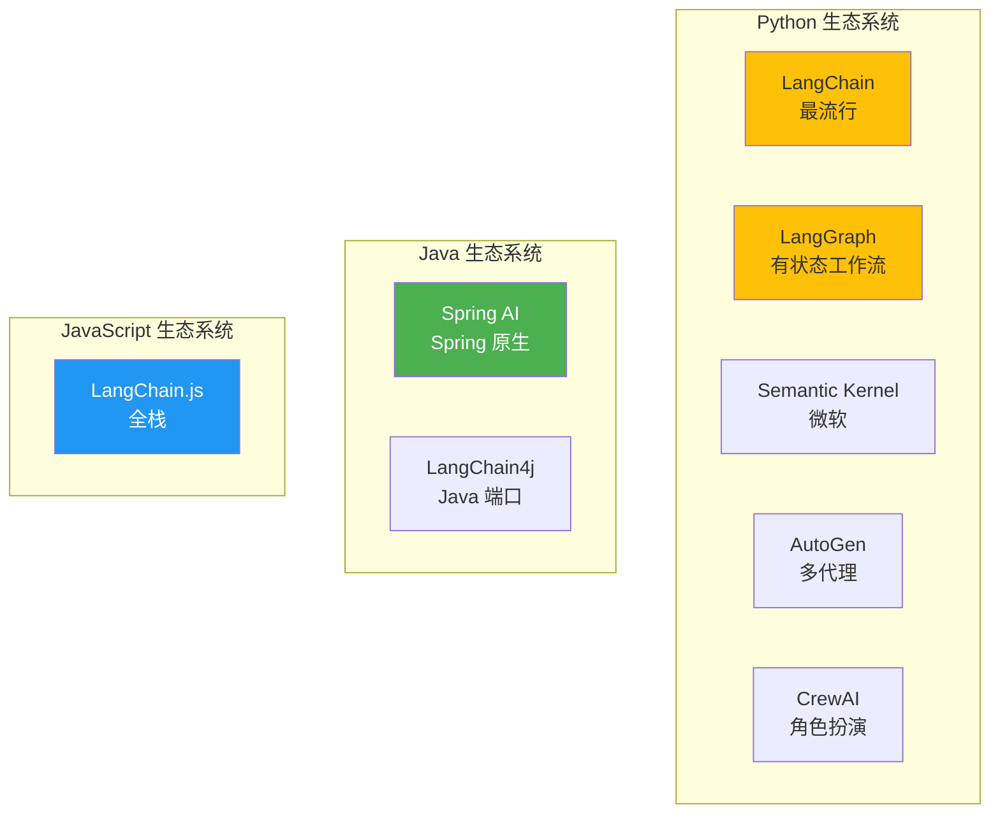
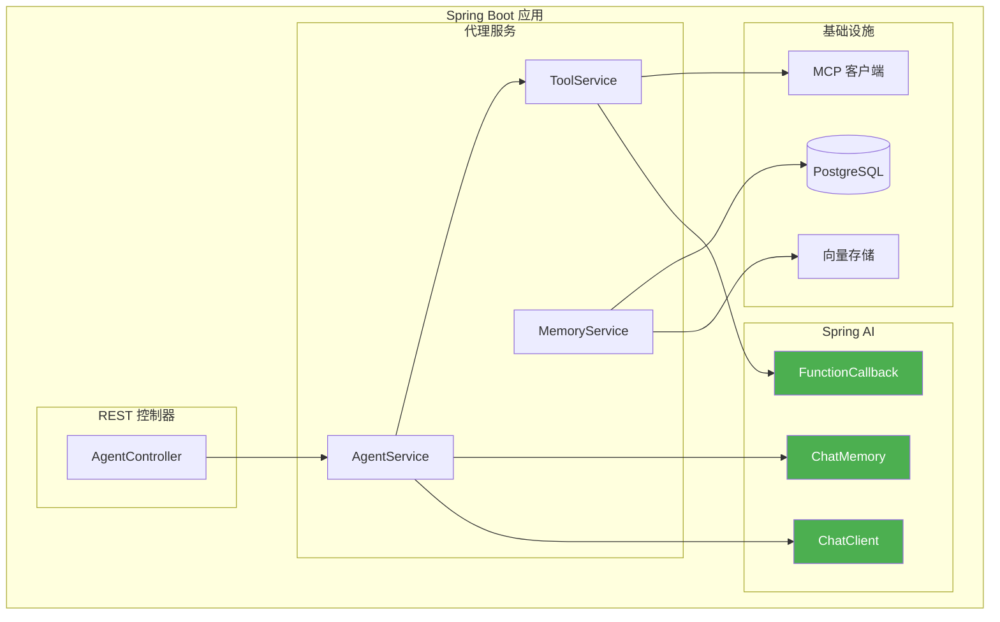

# 4. 框架与技术栈

构建生产级代理需要选择合适的框架并理解如何实现核心模式。本节比较主要框架并为 Java/Spring Boot 开发者提供详细的 Spring AI 实现指南。

---

## 4.1 框架比较

### 主要框架概述



### 比较矩阵

| 框架 | 语言 | 成熟度 | 多代理 | 有状态 | 最佳用途 |
|-----------|----------|----------|-------------|----------|----------|
| **Spring AI** | Java | 增长中 | 基础 | 是 | 企业 Java |
| **LangChain** | Python | 成熟 | 基础 | 有限 | 快速原型开发 |
| **LangGraph** | Python | 增长中 | 优秀 | 是 | 复杂工作流 |
| **Semantic Kernel** | Python/C# | 成熟 | 良好 | 是 | 微软技术栈 |
| **AutoGen** | Python | 成熟 | 优秀 | 是 | 研究 |
| **CrewAI** | Python | 新 | 优秀 | 是 | 基于角色的代理 |
| **LangChain4j** | Java | 增长中 | 基础 | 是 | LangChain 的 Java 端口 |

### 功能比较

| 功能 | Spring AI | LangGraph | Semantic Kernel | AutoGen |
|---------|-----------|-----------|-----------------|---------|
| **工具调用** | ✅ 原生 | ✅ 原生 | ✅ 原生 | ✅ 原生 |
| **内存管理** | ✅ 强大 | ✅ 强大 | ✅ 良好 | ✅ 基础 |
| **多代理** | ⚠️ 基础 | ✅ 优秀 | ✅ 良好 | ✅ 优秀 |
| **状态持久化** | ✅ 是 | ✅ 优秀 | ✅ 良好 | ✅ 基础 |
| **可观测性** | ✅ Spring Boot Actuator | ✅ LangSmith | ✅ 遥测 | ⚠️ 基础 |
| **企业支持** | ✅ 优秀 | ⚠️ 有限 | ✅ 良好 | ⚠️ 有限 |

---

## 4.2 Spring AI 深入讲解

Spring AI 为构建代理系统的 Java/Spring Boot 开发者提供了最无缝的体验。

### 架构



### 项目设置

#### 依赖项 (build.gradle)

```groovy
dependencies {
    // Spring AI OpenAI
    implementation 'org.springframework.ai:spring-ai-openai-spring-boot-starter:1.0.0'

    // Spring AI MCP
    implementation 'org.springframework.ai:spring-ai-mcp-spring-boot-starter:1.0.0'

    // Spring AI Vector Store (PostgreSQL + pgvector)
    implementation 'org.springframework.ai:spring-ai-pgvector-store-spring-boot-starter:1.0.0'

    // Spring Boot
    implementation 'org.springframework.boot:spring-boot-starter-web'
    implementation 'org.springframework.boot:spring-boot-starter-actuator'

    // 环境变量 (Doppler 集成)
    developmentOnly 'io.github.c-d-m:spring-boot-doppler:0.1.0'
}
```

#### 配置 (application.yml)

```yaml
spring:
  ai:
    openai:
      api-key: ${OPENAI_API_KEY}
      chat:
        options:
          model: gpt-4-turbo
          temperature: 0.7

    mcp:
      servers:
        - name: filesystem
          transport:
            type: stdio
            command: npx
            args:
              - -y
              - "@modelcontextprotocol/server-filesystem"
              - /allowed/path

    vectorstore:
      pgvector:
        dimension: 1536
        distance-type: cosine
        index-type: ivfflat

# Actuator 用于可观测性
management:
  endpoints:
    web:
      exposure:
        include: health,metrics,httptrace
  tracing:
    sampling:
      probability: 1.0
```

### 核心组件

#### 1. ChatClient 配置

```java
@Configuration
public class ChatClientConfig {

    @Bean
    public ChatClient chatClient(OpenAiChatModel model) {
        return ChatClient.builder(model)
            .defaultSystem("You are a helpful AI assistant with access to tools.")
            .defaultOptions(OpenAiChatOptions.builder()
                .model("gpt-4-turbo")
                .temperature(0.7)
                .build())
            .build();
    }
}
```

#### 2. 工具定义

```java
@Component
public class AgentTools {

    @Autowired
    private SearchService searchService;

    @Autowired
    private DatabaseService databaseService;

    @Bean
    public FunctionCallback searchTool() {
        return FunctionCallback.builder()
            .function("search_web", this::searchWeb)
            .description("Search the web for current information")
            .inputType(SearchRequest.class)
            .build();
    }

    @Bean
    public FunctionCallback databaseQueryTool() {
        return FunctionCallback.builder()
            .function("query_database", this::queryDatabase)
            .description("Query the database for structured data")
            .inputType(DatabaseQuery.class)
            .build();
    }

    public record SearchRequest(
        @Description("The search query string") String query,
        @Description("Number of results to return") @DefaultValue("5") int numResults
    ) {}

    public String searchWeb(SearchRequest request) {
        return searchService.search(request.query(), request.numResults());
    }

    public record DatabaseQuery(
        @Description("SQL query to execute") String sql
    ) {}

    public String queryDatabase(DatabaseQuery query) {
        return databaseService.executeQuery(query.sql());
    }
}
```

#### 3. 内存配置

```java
@Configuration
public class MemoryConfig {

    @Bean
    public ChatMemory bufferMemory() {
        return new MessageWindowChatMemory(10); // 最后 10 条消息
    }

    @Bean
    public ChatMemory vectorMemory(VectorStore vectorStore) {
        return new VectorStoreChatMemory(vectorStore);
    }

    @Bean
    public VectorStore vectorStore(JdbcTemplate jdbcTemplate, EmbeddingModel embeddingModel) {
        return new PgVectorStore(jdbcTemplate, embeddingModel);
    }
}
```

### 完整代理实现

#### 使用 Spring AI 的 ReAct 代理

```java
@Service
public class ReactAgentService {

    @Autowired
    private ChatClient chatClient;

    @Autowired
    private List<FunctionCallback> tools;

    @Autowired
    private ChatMemory memory;

    public String execute(String query, int maxIterations) {
        AgentContext context = new AgentContext(query, memory);

        for (int i = 0; i < maxIterations; i++) {
            // 生成思考并决定行动
            AgentResponse response = thinkAndAct(context);

            // 检查代理是否想直接回答
            if (response.isFinal()) {
                return response.getContent();
            }

            // 执行工具
            String toolResult = executeTool(response.getToolCall());

            // 添加到上下文
            context.addObservation(toolResult);

            // 更新内存
            memory.add(response.getMessage());
        }

        return "Max iterations reached";
    }

    private AgentResponse thinkAndAct(AgentContext context) {
        return chatClient.prompt()
            .messages(context.getMessages())
            .functions(tools)
            .call()
            .entity(AgentResponse.class);
    }

    private String executeTool(ToolCall call) {
        FunctionCallback tool = findTool(call.name());
        return tool.call(call.arguments());
    }

    private FunctionCallback findTool(String name) {
        return tools.stream()
            .filter(t -> t.getName().equals(name))
            .findFirst()
            .orElseThrow();
    }
}
```

#### REST 控制器

```java
@RestController
@RequestMapping("/api/agents")
public class AgentController {

    @Autowired
    private ReactAgentService reactAgent;

    @PostMapping("/chat")
    public ResponseEntity<ChatResponse> chat(@RequestBody ChatRequest request) {
        String response = reactAgent.execute(
            request.getMessage(),
            request.getMaxIterations()
        );

        return ResponseEntity.ok(new ChatResponse(response));
    }

    @PostMapping("/stream")
    public Flux<String> chatStream(@RequestBody ChatRequest request) {
        return reactAgent.executeStream(request.getMessage())
            .map(chunk -> "data: " + chunk + "\n\n");
    }
}
```

### 多代理实现

#### 使用 Spring AI 的监督者模式

```java
@Service
public class SupervisorAgent {

    @Autowired
    private ChatClient chatClient;

    @Autowired
    private Map<String, WorkerAgent> workers;

    @Autowired
    private ChatMemory memory;

    public String supervise(String task) {
        SupervisorState state = new SupervisorState(task, memory);

        for (int iteration = 0; iteration < 10; iteration++) {
            // 监督者决定下一个工作者和任务
            String decision = chatClient.prompt()
                .messages(state.getMessages())
                .system("""
                    You are a supervisor coordinating specialized workers.
                    Available workers: {workers}

                    Respond in JSON format:
                    {
                        "worker": "worker_name",
                        "task": "specific task for worker",
                        "done": false
                    }
                    """.formatted(
                        workers.keySet().stream().collect(Collectors.joining(", "))
                    ))
                .call()
                .content();

            SupervisorDecision supervisorDecision = parseDecision(decision);

            // 检查是否完成
            if (supervisorDecision.isDone()) {
                return supervisorDecision.getFinalAnswer();
            }

            // 执行工作者
            WorkerAgent worker = workers.get(supervisorDecision.getWorker());
            String result = worker.execute(supervisorDecision.getTask());

            // 更新状态
            state.addWorkerResult(
                supervisorDecision.getWorker(),
                supervisorDecision.getTask(),
                result
            );
        }

        return state.synthesizeFinalAnswer();
    }
}
```

#### 工作者代理

```java
@Component("researcher")
public class ResearcherWorker implements WorkerAgent {

    @Autowired
    private ChatClient chatClient;

    @Autowired
    private SearchService searchService;

    @Override
    public String execute(String task) {
        // 搜索信息
        String searchResults = searchService.search(task);

        // 分析和总结
        return chatClient.prompt()
            .system("You are a research specialist. Analyze search results and provide key findings.")
            .user("""
                Task: {task}
                Search Results: {results}
                """.formatted(task, searchResults))
            .call()
            .content();
    }
}

@Component("writer")
public class WriterWorker implements WorkerAgent {

    @Autowired
    private ChatClient chatClient;

    @Override
    public String execute(String task) {
        return chatClient.prompt()
            .system("You are a professional writer. Create well-structured content.")
            .user(task)
            .call()
            .content();
    }
}

@Component("coder")
public class CoderWorker implements WorkerAgent {

    @Autowired
    private ChatClient chatClient;

    @Override
    public String execute(String task) {
        return chatClient.prompt()
            .system("You are an expert programmer. Write clean, efficient code.")
            .user(task)
            .call()
            .content();
    }
}
```

---

## 4.3 其他框架

### LangGraph (Python)

LangGraph 在构建有状态的多代理应用方面表现出色。

```python
from langgraph.graph import StateGraph, END
from typing import TypedDict

class AgentState(TypedDict):
    messages: list
    next: str

def supervisor_node(state: AgentState):
    # Decide which agent acts next
    return {"next": "researcher"}

def researcher_node(state: AgentState):
    # Research logic
    return {"messages": ["Research results"]}

# Build graph
workflow = StateGraph(AgentState)
workflow.add_node("supervisor", supervisor_node)
workflow.add_node("researcher", researcher_node)

workflow.add_edge("supervisor", "researcher")
workflow.add_edge("researcher", "supervisor")

workflow.set_entry_point("supervisor")
app = workflow.compile()
```

### Semantic Kernel (C#)

微软的 Semantic Kernel 与 .NET 生态系统集成良好。

```csharp
// Build kernel
var kernel = Kernel.CreateBuilder()
    .AddOpenAIChatCompletion("gpt-4", apiKey)
    .Build();

// Add plugin
kernel.ImportPluginFromObject(new WebSearchPlugin());

// Run agent
var result = await kernel.InvokePromptAsync(
    "Search for latest AI news and summarize"
);
```

---

## 4.4 开发工具

### 可观测性与调试

| 工具 | 用途 | 集成 |
|------|---------|-------------|
| **LangSmith** | 调试和跟踪 LangChain | 与 LangGraph 内置 |
| **Spring Boot Actuator** | 指标和跟踪 | 与 Spring AI 原生集成 |
| **Arize Phoenix** | LLM 可观测性 | OpenTelemetry 集成 |
| **PromptLayer** | 提示版本控制 | API 包装器 |

#### Spring Boot Actuator 设置

```yaml
# application.yml
management:
  endpoints:
    web:
      exposure:
        include: health,metrics,prometheus,httptrace
  metrics:
    export:
      prometheus:
        enabled: true
  tracing:
    sampling:
      probability: 1.0
```

#### OpenTelemetry 集成

```java
@Configuration
public class TracingConfig {

    @Bean
    public OpenTelemetry openTelemetry() {
        return OpenTelemetrySdk.builder()
            .setTracerProvider(
                SdkTracerProvider.builder()
                    .addSpanProcessor(BatchSpanProcessor.builder(
                        OtlpGrpcSpanExporter.builder()
                            .setEndpoint("http://localhost:4317")
                            .build()
                    ).build())
                    .build()
            )
            .buildAndRegisterGlobal();
    }
}
```

---

## 4.5 完整示例：研究代理

### 项目结构

```
research-agent/
├── src/main/java/com/portfolio/agent/
│   ├── config/
│   │   ├── ChatClientConfig.java
│   │   ├── MemoryConfig.java
│   │   └── ToolConfig.java
│   ├── controller/
│   │   └── AgentController.java
│   ├── service/
│   │   ├── ReactAgentService.java
│   │   └── SupervisorAgentService.java
│   ├── tools/
│   │   ├── SearchTool.java
│   │   ├── DatabaseTool.java
│   │   └── FileTool.java
│   └── Application.java
├── src/main/resources/
│   └── application.yml
└── build.gradle
```

### 主应用程序

```java
@SpringBootApplication
@EnableScheduling
public class ResearchAgentApplication {

    public static void main(String[] args) {
        SpringApplication.run(ResearchAgentApplication.class, args);
    }
}
```

### 请求/响应 DTO

```java
public record ChatRequest(
    String message,
    @DefaultValue("5") int maxIterations
) {}

public record ChatResponse(
    String response,
    int iterations,
    List<String> toolsUsed
) {}
```

### 测试

```java
@SpringBootTest
@AutoConfigureMockMvc
class AgentControllerTest {

    @Autowired
    private MockMvc mockMvc;

    @Test
    void testChatEndpoint() throws Exception {
        String request = """
            {"message": "What's the latest news about AI?"}
            """;

        mockMvc.perform(post("/api/agents/chat")
                .contentType(MediaType.APPLICATION_JSON)
                .content(request))
            .andExpect(status().isOk())
            .andExpect(jsonPath("$.response").exists());
    }
}
```

---

## 4.6 关键要点

### 框架选择

| 用例 | 推荐框架 |
|----------|---------------------|
| **Java 企业级应用** | Spring AI |
| **Python 原型开发** | LangChain |
| **复杂多代理** | LangGraph |
| **微软技术栈** | Semantic Kernel |
| **研究用途** | AutoGen |

### Spring AI 优势

1. **原生 Spring 集成**：与 Spring Boot 无缝集成
2. **类型安全**：使用 records 强类型
3. **依赖注入**：易于测试和配置
4. **可观测性**：Actuator 内置支持
5. **企业支持**：生产就绪特性

### 最佳实践

1. **环境变量**：使用 Doppler 管理密钥
2. **结构化输出**：使用 records 保证类型安全
3. **内存管理**：选择合适的内存类型
4. **错误处理**：健壮的工具执行
5. **测试**：单元测试时模拟工具

---

## 4.7 下一步

现在您已经掌握了框架知识：

**用于生产环境：**
- → **[5. 工程与生产](../engineering)** - 部署、评估、安全

**用于未来学习：**
- → **[6. 前沿趋势](../frontier)** - 新兴技术

---

:::tip 从 Spring AI 开始
如果您是 Java/Spring Boot 开发者，**Spring AI** 提供了构建生产代理的最平滑路径。请参考上面的完整示例了解实现模式。
:::

:::info 环境管理
请记得使用 **Doppler** 管理所有环境变量。永远不要在代码库中硬编码 API 密钥或密钥。
:::