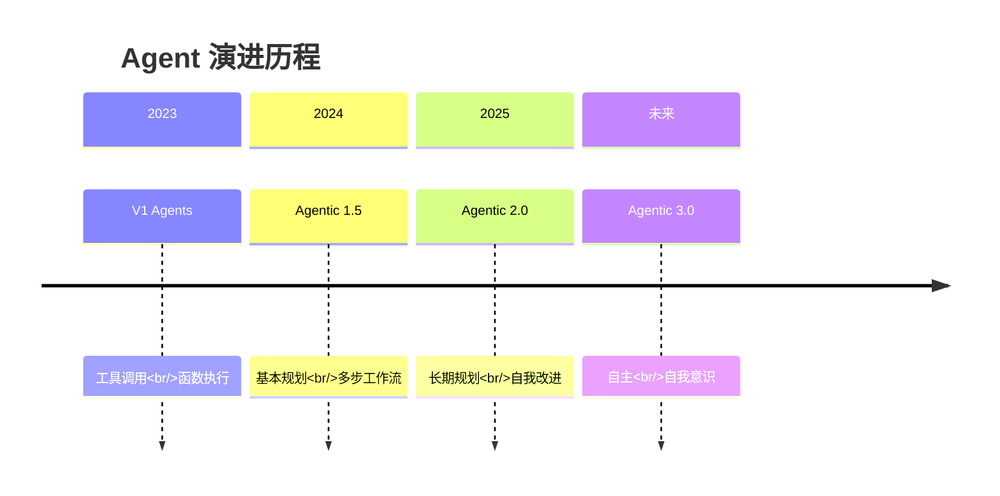
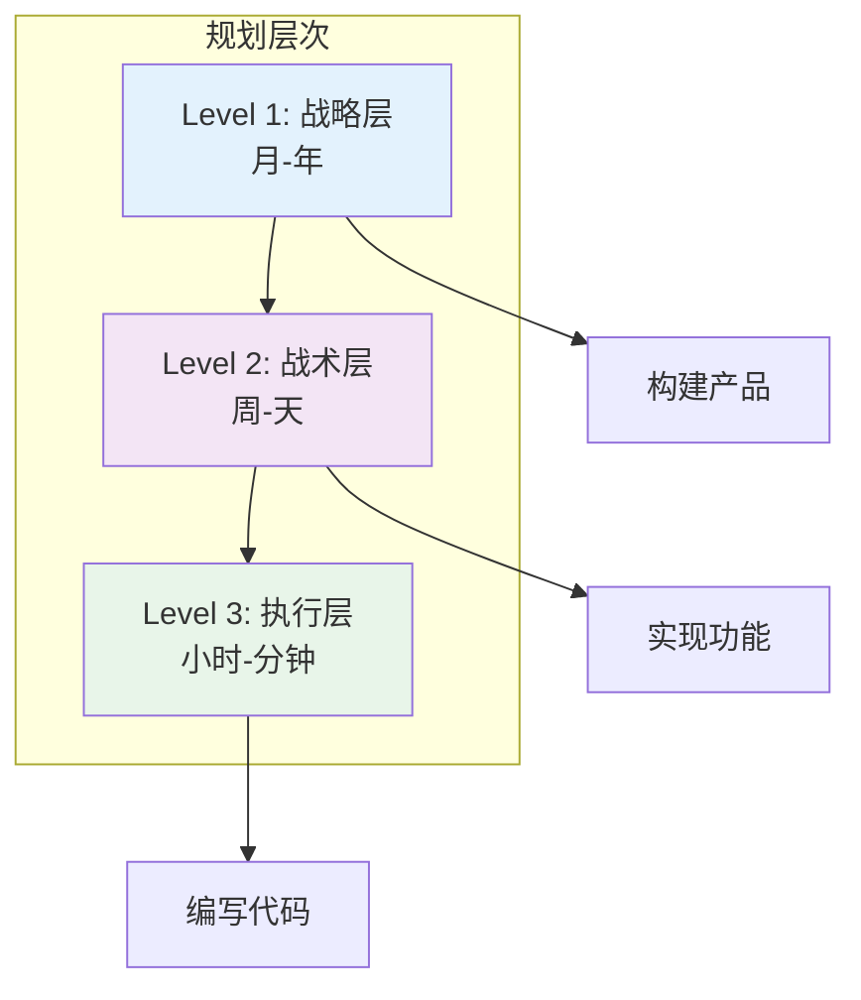
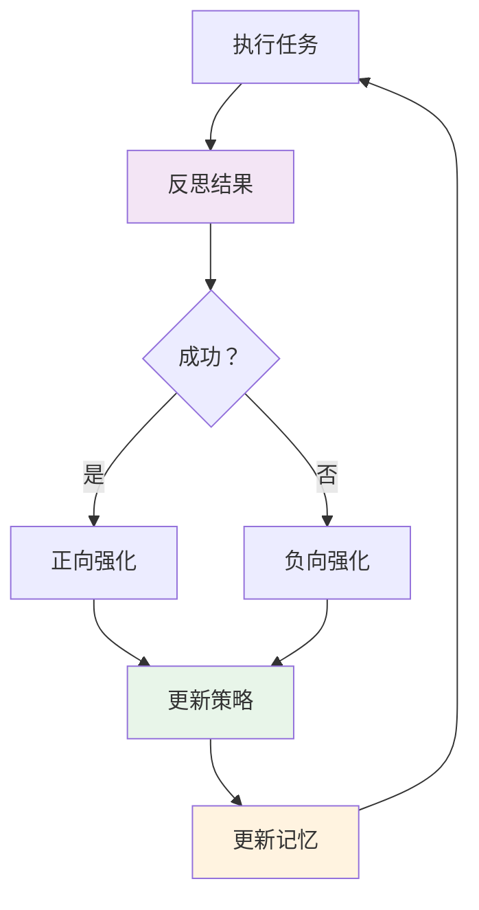
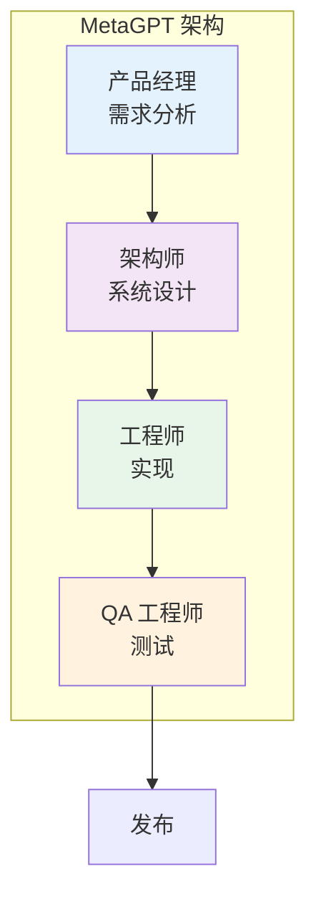
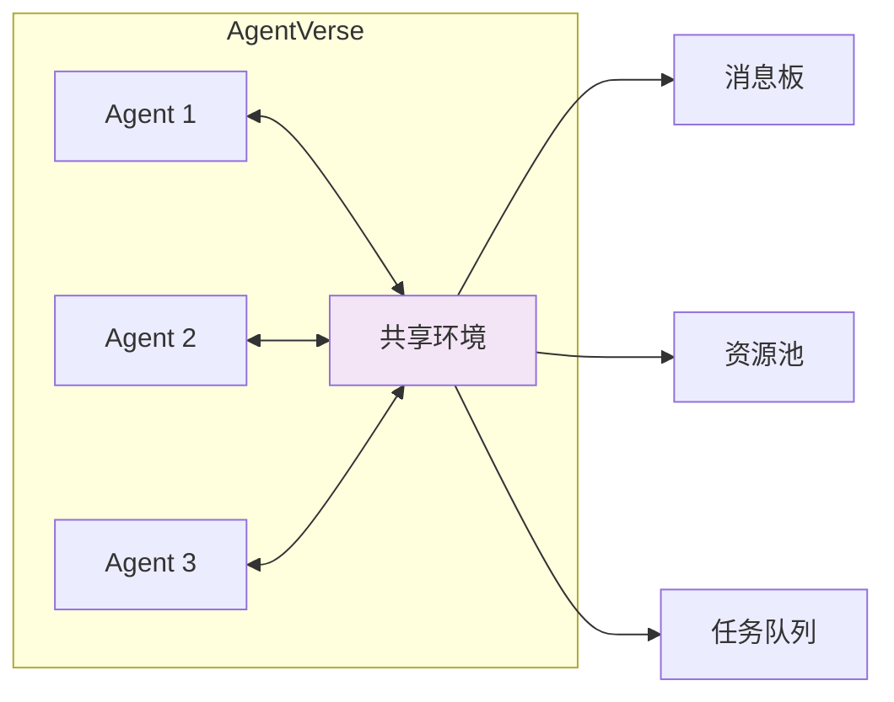
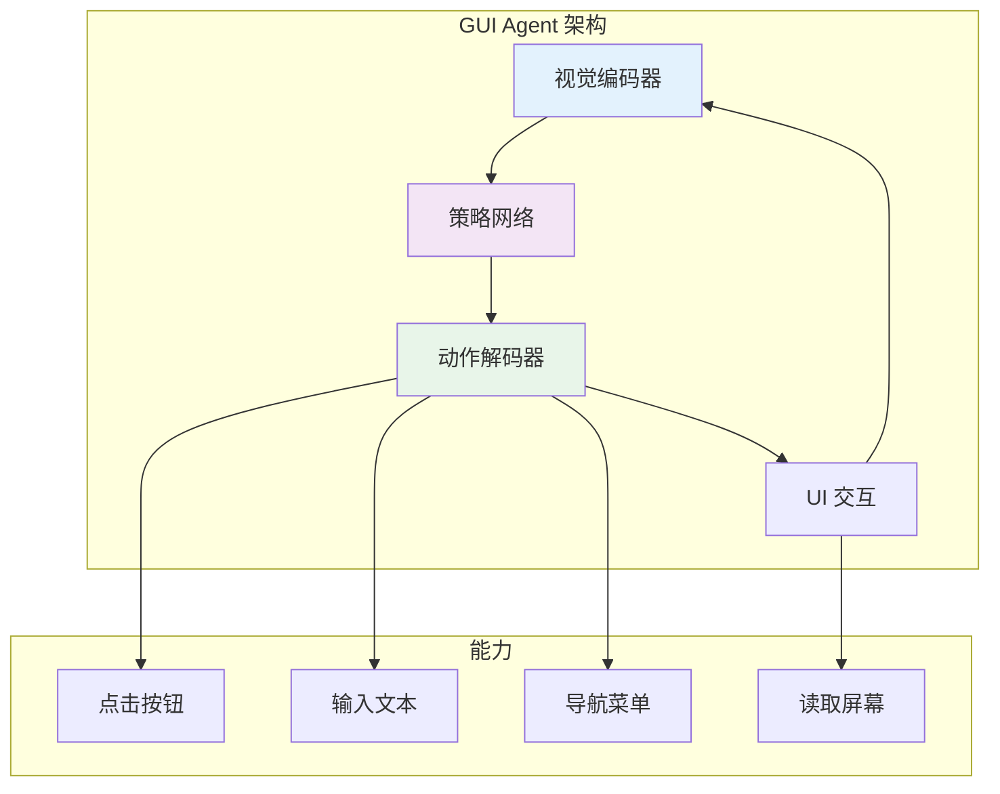
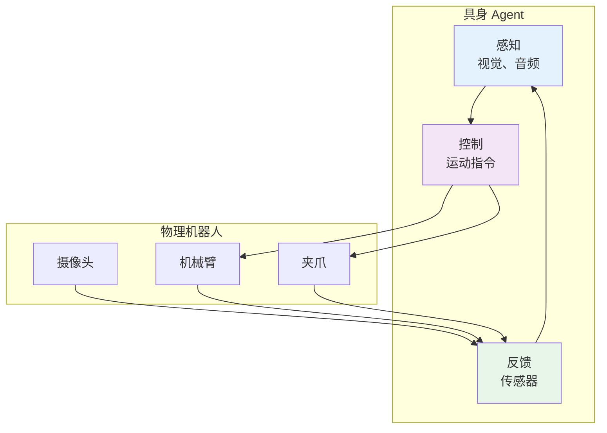
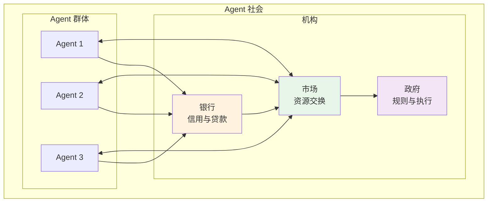
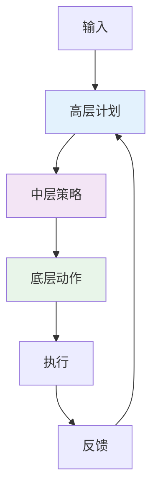
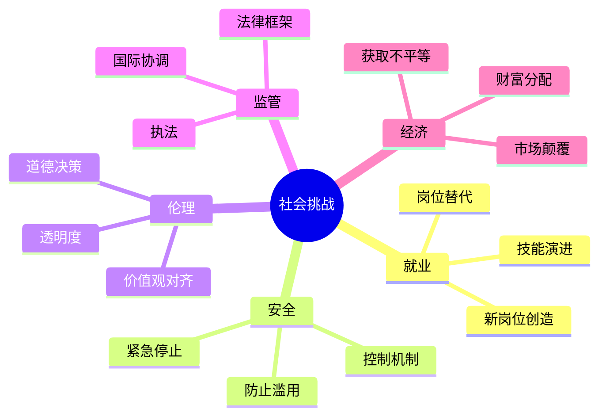

# 前沿趋势与未来方向

AI Agent 技术正在快速演进。本节探讨前沿研究、新兴趋势和 Agentic AI 系统的未来发展方向。

---

## 6.1 Agentic V2：下一代

### 从工具使用到自主性的演进



### V2 能力对比

| 能力 | V1（当前） | V2（新兴） |
|------|-----------|-----------|
| **规划范围** | 即时步骤 | 长期策略 |
| **学习方式** | 固定提示词 | 自我改进 |
| **协作方式** | 结构化模式 | 动态组队 |
| **记忆** | 上下文窗口 | 持久学习 |
| **可靠性** | ~80% 成功率 | >95% 成功率 |
| **自主性** | 人工引导 | 半自主 |

---

## 6.2 长期规划

### 层次化任务网络

将复杂目标分解到多个时间范围。



### 实现概念

```java
// 概念：层次化规划 Agent
public interface HierarchicalPlanner {

    Plan createStrategicPlan(Goal goal);
    Plan createTacticalPlan(StrategicPlan strategic);
    Plan createOperationalPlan(TacticalPlan tactical);

    default Plan execute(Goal goal) {
        // 多层规划
        Plan strategic = createStrategicPlan(goal);
        Plan tactical = createTacticalPlan(strategic);
        Plan operational = createOperationalPlan(tactical);

        // 带持续重规划的执行
        while (!operational.isComplete()) {
            executeStep(operational.nextStep());

            if (shouldReplan()) {
                operational = createOperationalPlan(tactical);
            }
        }

        return operational;
    }
}
```

---

## 6.3 自我改进的 Agent

### 从经验中学习



### 自我改进技术

| 技术 | 描述 | 成熟度 |
|------|------|--------|
| **反思（Reflection）** | 批评并改进自己的输出 | 生产可用 |
| **经验回放** | 从过去的事件中学习 | 研究阶段 |
| **元学习** | 学习如何学习 | 研究阶段 |
| **自我对弈** | 通过练习改进 | 新兴 |
| **进化优化** | 通过选择进行优化 | 研究阶段 |

---

## 6.4 多 Agent 研究前沿

### MetaGPT：软件公司模拟

MetaGPT 为 Agent 分配角色，模拟软件公司的运作。



**核心创新**：标准操作流程（SOPs）
- 为每个角色定义清晰的工作流
- 强制执行通信协议
- 减少协调开销

### ChatDev：软件开发

ChatDev 专注于自动化软件开发。

**阶段**：
1. **设计**：架构和需求
2. **编码**：遵循最佳实践实现
3. **测试**：自动化测试生成
4. **文档**：自动生成文档

**优势**：
- 更快的开发周期
- 一致的代码质量
- 减少人工监督

### AgentVerse：交互式 Agent 环境

创建 Agent 交互和协作的虚拟环境。



---

## 6.5 新兴方向

### GUI Agent

直接与图形用户界面交互的 Agent。



**示例**：
- **Anthropic Computer Use**：Claude 控制桌面
- **Multion**：网页任务的 AI 助手
- **Rabbit R1**：专为自主行动设计的设备

**挑战**：
- UI 理解和鲁棒性
- 错误恢复
- 安全和权限模型

### 具身 Agent

通过机器人与物理世界交互的 Agent。



**应用**：
- 家庭机器人（清洁、烹饪）
- 工业自动化
- 医疗辅助
- 探索（太空、水下）

**关键研究**：
- **RT-2**：Robotic Transformer 2（Google DeepMind）
- **VoxPoser**：用于机器人操作的 LLM
- **Hello Robot**：用于家庭任务的 Stretch

### Agent 社会

具有社会结构和经济系统的多 Agent 系统。



**研究领域**：
- **经济模型**：Token 经济、激励设计
- **治理**：投票、共识、规则制定
- **社会动态**：合作、竞争、涌现行为
- **伦理**：道德框架、价值观对齐

---

## 6.6 技术前沿

### 1. RecG Agent：递归批评与生成

Agent 递归地生成和批评自己的输出。

```
For i in 1...N:
    Output_i = Generator(Feedback_{i-1})
    Critique_i = Critic(Output_i)
    Feedback_i = Refine(Critique_i)

Return Output_N
```

**优势**：
- 自我改进质量
- 减少人工监督
- 处理复杂标准

### 2. 抽象链

在不同抽象层次上进行推理。



### 3. 思维树

并行探索多条推理路径。

```
Root（问题）
├── 分支 1: 方案 A
│   ├── 子分支 1.1
│   └── 子分支 1.2
├── 分支 2: 方案 B
│   ├── 子分支 2.1
│   └── 子分支 2.2
└── 分支 3: 方案 C
    ├── 子分支 3.1
    └── 子分支 3.2

评估所有分支，选择最优。
```

---

## 6.7 挑战与开放问题

### 技术挑战

| 挑战 | 描述 | 当前状态 |
|------|------|---------|
| **长期记忆** | 持久、可扩展的记忆 | 部分解决方案 |
| **因果推理** | 理解因果关系 | 研究阶段 |
| **迁移学习** | 将知识应用到新领域 | 早期进展 |
| **可解释性** | 理解 Agent 的决策 | 活跃研究 |
| **安全保障** | 行为的形式化保证 | 重大开放问题 |

### 社会挑战



---

## 6.8 预测：2025-2030

### 近期（2025-2026）

- **V2 Agent**：长期规划成为常态
- **自我改进**：Agent 从反馈中学习
- **多 Agent 标准**：通用模式出现
- **GUI Agent**：网页任务自动化成熟

### 中期（2027-2028）

- **具身 Agent**：家庭机器人变得实用
- **Agent 社会**：经济系统出现
- **监管**：首批 Agent 专项法律通过
- **安全标准**：行业级协议

### 远期（2029-2030）

- **半自主**：Agent 以最少监督运行
- **递归改进**：Agent 改进其他 Agent
- **通用能力**：Agent 处理多样化任务
- **人机协作**：无缝团队合作

---

## 6.9 如何保持前沿

### 研究来源

| 来源 | 类型 | 更新频率 |
|------|------|---------|
| **arXiv** | 预印本 | 每日 |
| **Papers With Code** | 实现 | 每周 |
| **LangChain Blog** | 行业洞察 | 每月 |
| **Anthropic/Google 博客** | 企业研究 | 不定期 |
| **Agent 研讨会** | 学术会议 | 每季度 |

### 重要会议

- **ICML**：国际机器学习大会
- **NeurIPS**：神经信息处理系统大会
- **ICLR**：国际学习表征大会
- **AAAI**：人工智能促进协会
- **Agent 研讨会**：专门的 Agent 会议

### 开源项目

- **LangChain/LangGraph**：快速演进的框架
- **AutoGen**：微软的多 Agent 框架
- **CrewAI**：角色扮演 Agent
- **MetaGPT**：软件公司模拟

---

## 6.10 关键要点

### 前沿正在快速推进

1. **V2 Agent**：从工具使用到自主规划
2. **自我改进**：Agent 从经验中学习
3. **多 Agent**：丰富的协作模式
4. **新模态**：GUI、具身、社会 Agent

### 挑战依然存在

1. **可靠性**：需要 >95% 的成功率
2. **安全性**：缺乏形式化保证
3. **对齐**：价值观对齐未解决
4. **控制**：需要紧急停止机制

### 为未来做准备

1. **学习基础**：V1 模式适用于 V2
2. **动手实验**：用新框架构建
3. **关注研究**：跟踪最新论文
4. **伦理思考**：考虑社会影响

---

## 6.11 学习路径完成

你已完成 AI Agent 的学习之旅：

✅ **1. 核心概念**：理解 Agent
✅ **2. 架构**：构建模块
✅ **3. 设计模式**：经过验证的解决方案
✅ **4. 框架**：实现工具
✅ **5. 工程实践**：生产就绪
✅ **6. 前沿趋势**：未来方向

### 下一步

1. **动手构建**：创建你自己的 Agent
2. **加入社区**：为开源做贡献
3. **分享知识**：写作和教学
4. **保持好奇**：持续学习和探索

---

:::tip 最佳开始时间
这个领域发展迅速，但你学到的基础知识将持续有效。今天就开始构建 Agent，随技术一起演进。
:::

:::info 继续探索
这只是开始。AI Agent 的前沿每天都在扩展。保持好奇，持续构建，帮助塑造自主 AI 系统的未来。
:::
