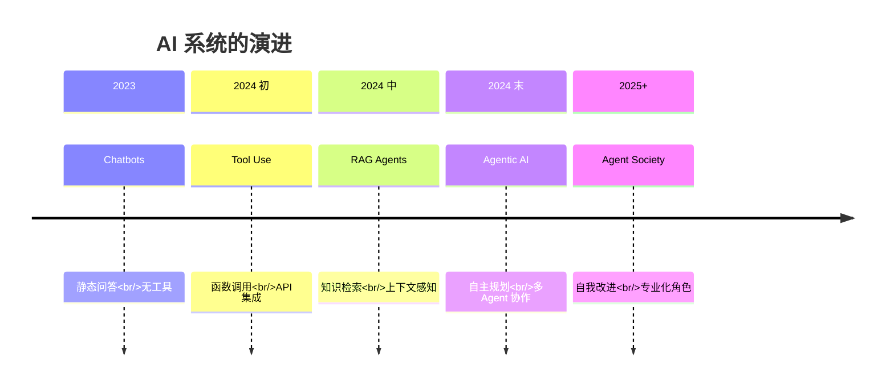
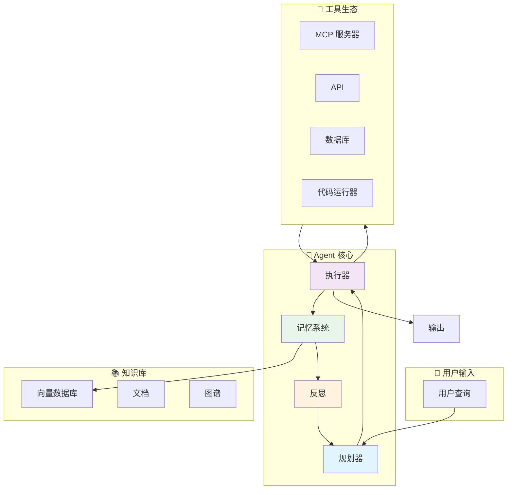

# AI Agent 系统

> **"AI 的未来不仅仅是对话——更是行动。"**

AI Agent 代表了从被动聊天机器人到自主系统的进化，能够推理、规划、使用工具并完成复杂的多步骤任务。本章涵盖从基础概念到生产部署的全部内容。

## 什么是 AI Agent？

| 组件 | 描述 | 示例 |
|-----------|-------------|---------|
| **Model（模型/大脑）** | 核心推理和决策引擎 | GPT-4, Claude 3.5, Llama 3 |
| **Prompt（指令）** | 系统行为和任务引导 | "你是一个有用的研究助手..." |
| **Memory（记忆）** | 上下文、历史和知识检索 | 对话历史、RAG、向量数据库 |
| **Tools（工具）** | 与世界交互的能力 | API、数据库、代码执行 |
| **Planning（规划）** | 将复杂任务分解为步骤 | "搜索 → 分析 → 编写 → 审查" |

### 核心公式

```
Agent = Model（大脑）+ Prompt（指令）+ Memory（RAG/上下文）
         + Tools（MCP）+ Planning（架构）
```

### 为什么 Agent 如此重要

| 传统 LLM | AI Agent |
|----------------|----------|
| **被动**——仅生成文本 | **主动**——在世界中采取行动 |
| **单次**——单次响应 | **多步**——规划和执行工作流 |
| **有限**——仅有训练知识 | **扩展**——通过工具获取实时数据 |
| **静态**——无状态持久化 | **有状态**——记忆和学习 |

---

## 从聊天机器人到 Agent



### Agent 光谱

```
被动对话 → 工具使用 → 任务规划 → 多 Agent → 自主
     ↓           ↓            ↓            ↓          ↓
   仅问答     函数调用     工作流       协作      自驱动
```

---

## Agent 架构概览



---

## 章节路线图

本章结构带你从基础到生产就绪系统：

### 1. [入门介绍](./introduction) - 核心概念
- **什么构成了"Agent"？**
- 从聊天机器人到自主系统的演进
- 核心能力：感知、推理、行动、反思
- 何时使用 Agent vs 传统自动化

### 2. [架构](./architecture) - 构建模块
- **Agent 循环**：观察 → 推理 → 行动 → 观察
- **记忆系统**：缓冲、摘要、向量、实体、情景
- **工具系统**：MCP、函数调用、错误处理
- **规划**：任务分解、重规划、目标导向

### 3. [设计模式](./design-patterns) - 经过验证的解决方案
- **单 Agent 模式**：ReAct、反思、自一致性
- **多 Agent 模式**：监督者、层级式、辩论
- **路由模式**：查询分类和路由
- **案例研究**：实际实现

### 4. [框架](./frameworks) - 技术栈与工具
- **框架对比**：LangChain、LangGraph、Semantic Kernel、AutoGen
- **Spring AI 深入**：用 Java 构建生产级 Agent
- **开发者工具**：LangSmith、Arize Phoenix、PromptLayer
- **完整示例**：端到端 Spring Boot Agent

### 5. [工程化](./engineering) - 生产就绪
- **评估**：LLM-as-a-Judge、指标、测试框架
- **挑战**：幻觉、无限循环、成本控制
- **安全**：Prompt 注入、访问控制、HITL
- **部署**：Docker、可观测性、A/B 测试

### 6. [前沿](./frontier) - 未来趋势
- **Agentic V2**：长期规划、自我改进
- **多 Agent 研究**：MetaGPT、ChatDev、AgentVerse
- **新兴方向**：GUI Agent、具身 Agent
- **挑战与机遇**：未来之路

---

## 快速入门模式

### 模式一：ReAct Agent（推理 + 行动）

```markdown
Question: 日本最大城市的人口是多少？

Thought: 我需要先找到日本最大的城市
Action: Search("日本最大城市")
Observation: 东京是最大的城市

Thought: 现在我需要东京的人口
Action: Search("东京人口 2024")
Observation: 约 1400 万

Thought: 我已获得所有所需信息
Answer: 东京是日本最大的城市，约有 1400 万人口。
```

### 模式二：监督者多 Agent

```
用户请求 → 监督者 Agent
                ↓
    ┌───────────┼───────────┐
    ↓           ↓           ↓
研究员      编写者       审核者
    ↓           ↓           ↓
    └───────────┴───────────┘
                ↓
          监督者
                ↓
          最终输出
```

---

## 关键技术

| 技术 | 角色 | 集成方式 |
|------------|------|-------------|
| **Spring AI** | Java Agent 框架 | `spring-ai-openai-spring-boot-starter` |
| **MCP** | 标准化工具协议 | Model Context Protocol 服务器 |
| **Vector DB** | 语义记忆 | Pinecone, Weaviate, pgvector |
| **LangGraph** | 多 Agent 工作流 | 有状态 Agent 编排 |
| **LangSmith** | 调试和追踪 | Agent 可观测性 |

---

## 何时使用 Agent

### ✅ 适用场景

- **研究与分析师**：多步骤信息收集与综合
- **内容创作**：带有研究、审核和修订周期的写作
- **代码任务**：调试、重构、文档生成
- **数据操作**：ETL 工作流、数据分析、报告
- **客户服务**：需要多个系统的复杂查询

### ❌ 不适用场景

- **简单 CRUD**：传统 API 更快更便宜
- **可预测的工作流**：硬编码逻辑更可靠
- **实时要求**：LLM 延迟太高
- **严格确定性**：Agent 本质上是非确定性的
- **成本敏感**：高 token 用量 vs 简单脚本

---

## 前置条件

在深入学习 Agent 之前，请确保你已掌握：

1. **LLM 基础**（[模块 01](/docs/ai/llm-fundamentals/)）
   - 分词、Embeddings、推理
   - 模型能力和限制

2. **Prompt Engineering**（[模块 02](/docs/ai/prompt-engineering/)）
   - 系统 Prompt、Few-shot 学习
   - 结构化输出、推理模式

3. **RAG**（[模块 03](/docs/ai/rag/)）
   - 向量数据库、检索策略
   - 上下文管理

4. **MCP**（[模块 05](/docs/ai/mcp/)）
   - 工具协议、服务器实现
   - 资源、工具和 Prompt

---

## 学习路径

### Java/Spring Boot 开发者

**路径**：01 → 02 → 04（Spring AI 重点）→ 05

专注于生产级 Spring Boot Agent 与 MCP 集成。

### AI 工程师

**路径**：01 → 02 → 03（设计模式）→ 05 → 06

专注于多 Agent 系统和高级模式。

### 全栈开发者

**路径**：01 → 02 → 04（框架对比）→ 05

专注于 Next.js 前端 + Spring Boot 后端集成。

---

## 常见挑战

| 挑战 | 解决方案 | 涵盖章节 |
|-----------|----------|------------|
| **幻觉** | RAG + 验证 | 架构、工程化 |
| **无限循环** | 最大迭代次数 + HITL | 架构 |
| **高成本** | 缓存 + 小模型 | 工程化 |
| **可靠性差** | 反思 + 自检 | 设计模式 |
| **安全风险** | Prompt 注入防御 | 工程化 |
| **调试困难** | 追踪 + 可观测性 | 框架、工程化 |

---

## 生产清单

部署 Agent 到生产环境之前：

- [ ] 已定义明确的成功/失败标准
- [ ] 全面的错误处理
- [ ] 敏感操作需要人工介入（HITL）
- [ ] 速率限制和成本控制
- [ ] 审计日志已启用
- [ ] 监控和告警已配置
- [ ] 安全审查已完成
- [ ] 负载测试已执行
- [ ] A/B 测试框架就绪
- [ ] 回滚计划已记录

---

:::tip 开始使用
Agent 新手？从 **[01 入门介绍](./introduction)** 开始，了解核心概念和从聊天机器人到自主系统的演进。
:::

:::info Spring Boot 开发者
如果你用 Java 构建 Agent，请跳转到 **[04 框架](./frameworks)** 查看 Spring AI 实现指南和完整代码示例。
:::

:::warning 生产就绪
部署 Agent 到生产环境需要仔细规划。请参阅 **[05 工程化](./engineering)** 了解评估、安全和部署最佳实践。
:::
