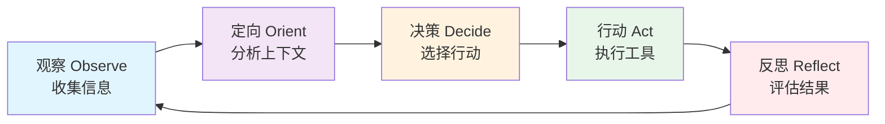
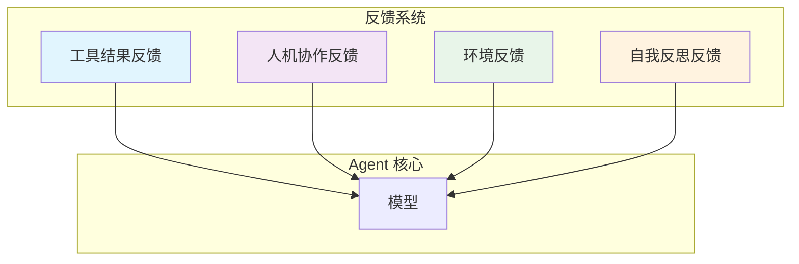
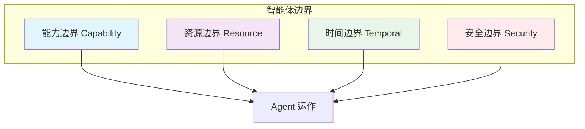

# 1. 核心概念

> **“玩具级 Agent 与生产级 Agent 之间的区别，在于其控制系统的质量。”**

Harness 工程建立在三个核心概念之上：**控制循环 (Control Loops)**、**反馈系统 (Feedback Systems)** 和 **智能体边界 (Agent Boundaries)**。这些概念协同工作，共同打造出可靠、可预测且安全的 Agent 行为。

---

## 1.1 控制循环 (Control Loops)

### 面向 Agent 的 OODA 循环

控制循环是使 Agent 能够在保持目标一致的同时自主运行的基础反馈机制。



#### Observe (感知/观察)

**Agent 感知的内容：**
- 用户输入与意图
- 当前任务状态
- 可用的工具与能力
- 环境上下文（时间、资源、约束条件）

**实现示例：**

```java
@Service
public class ObservationService {

    @Autowired
    private ToolRegistry toolRegistry;

    public AgentObservation observe(AgentContext context) {
        return AgentObservation.builder()
            .userInput(context.getUserInput())
            .currentTask(context.getCurrentTask())
            .availableTools(toolRegistry.getAvailableTools())
            .resourceStatus(checkResources())
            .timeConstraints(getTimeConstraints())
            .build();
    }

    private ResourceStatus checkResources() {
        return ResourceStatus.builder()
            .tokensRemaining(quotas.getRemainingTokens())
            .apiLimits(quotas.getApiLimits())
            .toolAvailability(toolRegistry.checkAvailability())
            .build();
    }
}
```

#### Orient (定向/分析)

**Agent 如何解读观察结果：**
- 将当前状态与目标状态进行对比
- 识别差距与障碍
- 评估风险与约束
- 确定后续行动的优先级

**实现示例：**

```java
@Service
public class OrientationService {

    @Autowired
    private ChatClient chatClient;

    public Orientation orient(AgentObservation observation) {
        String analysis = chatClient.prompt()
            .system("""
                你是一个智能体定向系统。
                请分析当前形势并提供：
                1. 当前状态评估
                2. 差距分析（当前 vs 目标）
                3. 识别出的障碍
                4. 风险评估
                5. 建议的重点关注领域
                """)
            .user("""
                用户输入: {input}
                当前任务: {task}
                可用工具: {tools}
                资源状态: {resources}
                """.formatted(
                    observation.getUserInput(),
                    observation.getCurrentTask(),
                    observation.getAvailableTools(),
                    observation.getResourceStatus()
                ))
            .call()
            .content();

        return parseOrientation(analysis);
    }
}
```

#### Decide (决策)

**选择下一步行动：**
- 选择合适的工具
- 规划执行顺序
- 分配资源
- 设定成功标准

**实现示例：**

```java
@Service
public class DecisionService {

    @Autowired
    private ChatClient chatClient;

    public AgentDecision decide(Orientation orientation) {
        String decision = chatClient.prompt()
            .system("""
                你是一个智能体决策系统。
                请根据定向分析结果决定：
                1. 使用哪些工具
                2. 执行顺序（如果涉及多个工具）
                3. 资源分配
                4. 成功标准
                5. 兜底/降级条件
                """)
            .user("""
                定向分析: {orientation}
                可用工具: {tools}
                """.formatted(
                    orientation,
                    orientation.getAvailableTools()
                ))
            .call()
            .content();

        return parseDecision(decision);
    }
}
```

#### Act (行动)

**执行决策：**
- 调用选定的工具
- 处理工具响应
- 更新状态
- 记录结果

**实现示例：**

```java
@Service
public class ActionService {

    @Autowired
    private ToolExecutor toolExecutor;

    @Autowired
    private StateManager stateManager;

    public ActionResult act(AgentDecision decision) {
        List<ToolResult> results = new ArrayList<>();

        for (ToolCall call : decision.getToolCalls()) {
            try {
                ToolResult result = toolExecutor.execute(call);
                results.add(result);

                // 每次工具调用后更新状态
                stateManager.updateState(result);

            } catch (ToolExecutionException e) {
                return ActionResult.failed(results, e);
            }
        }

        return ActionResult.success(results);
    }
}
```

#### Reflect (反思/评估)

**评估产出：**
- 将结果与成功标准进行对比
- 识别错误或意外结果
- 确定目标是否已达成
- 决定下一轮迭代

**实现示例：**

```java
@Service
public class ReflectionService {

    @Autowired
    private ChatClient chatClient;

    public Reflection reflect(ActionResult result, AgentDecision decision) {
        String reflection = chatClient.prompt()
            .system("""
                你是一个智能体反思系统。
                请评估行动结果：
                1. 我们是否达到了成功标准？
                2. 是否存在任何错误或意外结果？
                3. 目标是否已完成？
                4. 我们下一步该做什么？
                """)
            .user("""
                决策: {decision}
                成功标准: {criteria}
                执行结果: {results}
                """.formatted(
                    decision,
                    decision.getSuccessCriteria(),
                    result.getResults()
                ))
            .call()
            .content();

        return parseReflection(reflection);
    }
}
```

### 完整的控制循环实现

```java
@Service
public class ControlLoopService {

    @Autowired
    private ObservationService observationService;

    @Autowired
    private OrientationService orientationService;

    @Autowired
    private DecisionService decisionService;

    @Autowired
    private ActionService actionService;

    @Autowired
    private ReflectionService reflectionService;

    private static final int MAX_ITERATIONS = 10;

    public AgentResult execute(AgentContext context) {
        for (int i = 0; i < MAX_ITERATIONS; i++) {
            // 观察
            AgentObservation observation = observationService.observe(context);

            // 定向
            Orientation orientation = orientationService.orient(observation);

            // 决策
            AgentDecision decision = decisionService.decide(orientation);

            // 行动
            ActionResult result = actionService.act(decision);

            // 反思
            Reflection reflection = reflectionService.reflect(result, decision);

            // 检查目标是否达成
            if (reflection.isGoalAchieved()) {
                return AgentResult.success(result.getOutput());
            }

            // 更新下一轮迭代的上下文
            context = context.update(result);
        }

        return AgentResult.incomplete("已达到最大迭代次数");
    }
}
```

---

## 1.2 反馈系统 (Feedback Systems)

反馈系统为 Agent 提供了纠正航向和提升性能所需的信息。

### 反馈类型



#### 1. 工具结果反馈

**来自工具执行的即时反馈：**

| 反馈类型 | 描述 | Agent 响应 |
|---------------|-------------|----------------|
| **成功** | 工具执行成功 | 在下一步中使用结果 |
| **部分成功** | 工具返回部分数据 | 决定是否足够或重试 |
| **失败** | 工具错误或超时 | 尝试降级方案或跳过 |
| **异常** | 结果格式不符合预期 | 重新解读或请求人工介入 |

**实现示例：**

```java
@Service
public class ToolFeedbackService {

    public ToolFeedback processFeedback(ToolResult result) {
        ToolFeedback feedback = ToolFeedback.builder()
            .status(result.getStatus())
            .data(result.getData())
            .errors(result.getErrors())
            .metadata(result.getMetadata())
            .build();

        // 分析反馈质量
        if (feedback.hasErrors()) {
            feedback.setRecommendedAction(
                determineRecoveryAction(feedback)
            );
        }

        if (feedback.isPartial()) {
            feedback.setRecommendedAction(
                Action.RETRY_WITH_ADJUSTMENT
            );
        }

        return feedback;
    }

    private Action determineRecoveryAction(ToolFeedback feedback) {
        if (feedback.isTimeout()) {
            return Action.RETRY_WITH_LONGER_TIMEOUT;
        }

        if (feedback.isRateLimited()) {
            return Action.WAIT_AND_RETRY;
        }

        if (feedback.isAuthenticationError()) {
            return Action.REFRESH_CREDENTIALS;
        }

        return Action.SKIP_AND_CONTINUE;
    }
}
```

#### 2. 人机协作反馈 (Human-in-the-Loop)

**引入人类指导：**

```java
@Service
public class HumanFeedbackService {

    @Autowired
    private FeedbackQueue feedbackQueue;

    public Optional<HumanFeedback> requestFeedback(
        AgentContext context,
        FeedbackRequest request
    ) {
        // 检查是否需要人工干预
        if (!requiresHumanFeedback(context, request)) {
            return Optional.empty();
        }

        // 提交反馈请求
        String feedbackId = feedbackQueue.submit(request);

        // 等待响应（带超时机制）
        return feedbackQueue.waitForResponse(feedbackId, Duration.ofMinutes(5));
    }

    private boolean requiresHumanFeedback(
        AgentContext context,
        FeedbackRequest request
    ) {
        // 在以下情况需要反馈：
        // - 敏感操作
        // - 高风险决策
        // - 模糊情境
        // - 连续 N 次失败后

        return context.getSensitivityLevel() == Sensitivity.HIGH
            || context.getFailureCount() >= 3
            || request.getAmbiguityScore() > 0.7;
    }
}
```

**反馈请求 UI 示例：**

```typescript
// Next.js: 人工反馈界面接口
interface FeedbackRequest {
  agentId: string;
  context: string;
  question: string;
  options?: string[];
  urgency: 'low' | 'medium' | 'high';
}

export function FeedbackPanel({ request }: { request: FeedbackRequest }) {
  const [response, setResponse] = useState<string>('');
  const [submitting, setSubmitting] = useState(false);

  const handleSubmit = async () => {
    setSubmitting(true);
    await fetch('/api/agent/feedback', {
      method: 'POST',
      body: JSON.stringify({
        requestId: request.id,
        response,
      }),
    });
    setSubmitting(false);
  };

  return (
    <div className="feedback-panel">
      <h3>Agent 需要您的输入</h3>
      <p>{request.question}</p>

      {request.options ? (
        <div className="feedback-options">
          {request.options.map(option => (
            <button
              key={option}
              onClick={() => setResponse(option)}
              className={response === option ? 'selected' : ''}
            >
              {option}
            </button>
          ))}
        </div>
      ) : (
        <textarea
          value={response}
          onChange={e => setResponse(e.target.value)}
          placeholder="请输入指导意见..."
        />
      )}

      <button
        onClick={handleSubmit}
        disabled={submitting || !response}
      >
        {submitting ? '提交中...' : '提交反馈'}
      </button>
    </div>
  );
}
```

#### 3. 环境反馈

**来自运行环境的信号：**

```java
@Service
public class EnvironmentFeedbackService {

    public EnvironmentFeedback gatherFeedback() {
        return EnvironmentFeedback.builder()
            .systemLoad(getSystemLoad())
            .networkLatency(getNetworkLatency())
            .apiQuotas(getApiQuotas())
            .errorRates(getErrorRates())
            .costAccumulated(getCostAccumulated())
            .build();
    }

    public boolean shouldAdjustStrategy(EnvironmentFeedback feedback) {
        return feedback.getSystemLoad() > 0.8
            || feedback.getErrorRate() > 0.1
            || feedback.getCostAccumulated() > getBudgetThreshold();
    }
}
```

#### 4. 自我反思反馈

**Agent 对自身表现的评估：**

```java
@Service
public class SelfReflectionService {

    @Autowired
    private ChatClient chatClient;

    public SelfReflection reflect(AgentContext context, ActionResult result) {
        String reflection = chatClient.prompt()
            .system("""
                你是一个具备自我反思能力的智能体。
                请分析你的表现：
                1. 是否达成了目标？
                2. 哪些做法效果良好？
                3. 哪些地方可以改进？
                4. 如果重来一次，你会做哪些不同的调整？
                """)
            .user("""
                目标: {goal}
                执行的行动: {actions}
                结果: {results}
                """.formatted(
                    context.getGoal(),
                    context.getActionsTaken(),
                    result.getOutputs()
                ))
            .call()
            .content();

        return SelfReflection.builder()
            .goalAchieved(extractGoalAchieved(reflection))
            .whatWorked(extractWhatWorked(reflection))
            .whatCouldBeImproved(extractWhatCouldBeImproved(reflection))
            .alternativeApproach(extractAlternativeApproach(reflection))
            .build();
    }
}
```

---

## 1.3 智能体边界 (Agent Boundaries)

边界定义了 Agent 能做和不能做的事情，确保其运行的安全性和可预测性。

### 边界类型



#### 1. 能力边界 (Capability Boundaries)

**明确 Agent 的职权范围：**

```java
@Service
public class CapabilityBoundaryService {

    private final Set<String> allowedTools;
    private final Set<String> allowedOperations;

    public CapabilityBoundaryService() {
        this.allowedTools = Set.of(
            "web_search",
            "database_query",
            "file_read",
            "file_write"
        );

        this.allowedOperations = Set.of(
            "read",
            "write",
            "search",
            "analyze"
        );
    }

    public boolean canExecuteTool(String toolName) {
        if (!allowedTools.contains(toolName)) {
            log.warn("工具不在白名单中: {}", toolName);
            return false;
        }
        return true;
    }

    public boolean canPerformOperation(String operation) {
        if (!allowedOperations.contains(operation)) {
            log.warn("操作不被允许: {}", operation);
            return false;
        }
        return true;
    }

    public void validateAction(ToolCall call) {
        if (!canExecuteTool(call.getToolName())) {
            throw new CapabilityBoundaryException(
                "工具不被允许: " + call.getToolName()
            );
        }

        if (!canPerformOperation(call.getOperation())) {
            throw new CapabilityBoundaryException(
                "操作不被允许: " + call.getOperation()
            );
        }
    }
}
```

#### 2. 资源边界 (Resource Boundaries)

**限制资源消耗：**

```java
@Service
public class ResourceBoundaryService {

    private final int maxTokensPerTask;
    private final int maxToolCallsPerTask;
    private final Duration maxExecutionTime;
    private final BigDecimal maxCostPerTask;

    public ResourceBoundary checkLimits(AgentContext context) {
        ResourceBoundary boundary = ResourceBoundary.builder()
            .tokensRemaining(
                maxTokensPerTask - context.getTokensUsed()
            )
            .toolCallsRemaining(
                maxToolCallsPerTask - context.getToolCalls()
            )
            .timeRemaining(
                maxExecutionTime.minus(
                    Duration.between(
                        context.getStartTime(),
                        Instant.now()
                    )
                )
            )
            .costRemaining(
                maxCostPerTask.subtract(context.getCostIncurred())
            )
            .build();

        if (boundary.anyLimitExceeded()) {
            throw new ResourceBoundaryException(
                "超出资源限制: " +
                boundary.getExceededLimits()
            );
        }

        return boundary;
    }
}
```

#### 3. 时间边界 (Temporal Boundaries)

**控制运行时长：**

```java
@Service
public class TemporalBoundaryService {

    private final Duration maxExecutionTime;
    private final Duration maxToolTimeout;
    private final LocalTime workingHoursStart;
    private final LocalTime workingHoursEnd;

    public boolean canExecute(AgentContext context) {
        // 检查最大执行时间
        Duration elapsed = Duration.between(
            context.getStartTime(),
            Instant.now()
        );

        if (elapsed.compareTo(maxExecutionTime) > 0) {
            log.warn("超出最大执行时间");
            return false;
        }

        // 检查工作时间（如果配置了的话）
        if (workingHoursStart != null && workingHoursEnd != null) {
            LocalTime now = LocalTime.now();
            if (now.isBefore(workingHoursStart) ||
                now.isAfter(workingHoursEnd)) {
                log.warn("非工作时间段");
                return false;
            }
        }

        return true;
    }

    public Duration getToolTimeout(String toolName) {
        // 工具特定的超时设置
        if (toolName.equals("web_search")) {
            return Duration.ofSeconds(30);
        } else if (toolName.equals("database_query")) {
            return Duration.ofSeconds(10);
        }
        return maxToolTimeout;
    }
}
```

#### 4. 安全边界 (Security Boundaries)

**执行安全约束：**

```java
@Service
public class SecurityBoundaryService {

    @Autowired
    private PermissionService permissionService;

    @Autowired
    private InputSanitizer inputSanitizer;

    public void validateToolCall(
        String userId,
        ToolCall call
    ) {
        // 检查用户权限
        if (!permissionService.hasPermission(
            userId,
            call.getToolName()
        )) {
            throw new SecurityException(
                "用户无权使用该工具: " +
                call.getToolName()
            );
        }

        // 输入脱敏与校验
        String sanitizedInput = inputSanitizer.sanitize(
            call.getInput()
        );

        if (sanitizedInput == null) {
            throw new SecurityException(
                "输入校验失败"
            );
        }

        // 敏感操作需额外审批
        if (call.isSensitive()) {
            requireApproval(userId, call);
        }
    }

    private void requireApproval(String userId, ToolCall call) {
        ApprovalRequest request = ApprovalRequest.builder()
            .userId(userId)
            .toolName(call.getToolName())
            .operation(call.getOperation())
            .build();

        approvalService.requestApproval(request);
    }
}
```

### 边界强制执行 (Boundary Enforcement)

```java
@Service
public class BoundaryEnforcementService {

    @Autowired
    private CapabilityBoundaryService capabilityBoundary;

    @Autowired
    private ResourceBoundaryService resourceBoundary;

    @Autowired
    private TemporalBoundaryService temporalBoundary;

    @Autowired
    private SecurityBoundaryService securityBoundary;

    public void enforceBoundaries(
        String userId,
        AgentContext context,
        ToolCall call
    ) {
        // 执行前检查所有边界

        // 1. 能力边界
        capabilityBoundary.validateAction(call);

        // 2. 资源边界
        resourceBoundary.checkLimits(context);

        // 3. 时间边界
        if (!temporalBoundary.canExecute(context)) {
            throw new TemporalBoundaryException(
                "超出时间边界限制"
            );
        }

        // 4. 安全边界
        securityBoundary.validateToolCall(userId, call);
    }
}
```

---

## 1.4 核心要点总结

### 控制循环

1. **OODA 循环**：观察 → 定向 → 决策 → 行动 → 反思。
2. **持续反馈**：每一次循环迭代都会优化后续决策。
3. **自我修正**：反思机制使 Agent 能够实现自主调整。

### 反馈系统

| 类型 | 来源 | 目的 |
|------|--------|---------|
| **工具结果** | 工具执行过程 | 即时纠错 |
| **人机协作** | 人类指导意见 | 处理模糊性 |
| **环境反馈** | 系统信号 | 适应环境变化 |
| **自我反思** | Agent 自我评估 | 提升整体表现 |

### 智能体边界

- **能力 (Capability)**：Agent 的职权范围。
- **资源 (Resource)**：消耗上限。
- **时间 (Temporal)**：时间维度约束。
- **安全 (Security)**：访问与审批控制。

### 生产环境模式示例

```java
// 带边界检查的完整控制循环
for (int i = 0; i < MAX_ITERATIONS; i++) {
    // 强制执行边界检查
    boundaryEnforcement.enforceBoundaries(userId, context, action);

    // 执行控制循环
    Observation observation = observe(context);
    Orientation orientation = orient(observation);
    Decision decision = decide(orientation);
    ActionResult result = act(decision);
    Reflection reflection = reflect(result, decision);

    // 检查任务是否完成
    if (reflection.isGoalAchieved()) {
        return result;
    }
}
```

---

## 1.5 下一步行动

**继续您的学习之旅：**
- → **[2. 工具编排](../orchestration)** - 规模化管理工具执行
- → **[3. 状态管理](../state-management)** - 实现 Agent 状态的持久化与恢复

---

:::tip 控制循环是根基
每一个生产级 Agent 都需要一个控制循环。建议从简单的 ReAct 循环开始，随后根据需要逐步添加反馈和边界机制。
:::

:::warning 边界机制不容忽视
缺乏合适的边界，Agent 可能会超出预算、陷入无限循环并带来安全风险。在规模化部署前，请务必实现边界控制。
:::

:::info 反馈质量决定上限
高质量的反馈能带来更明智的决策。建议投资完善全链路追踪和日志记录，以提升反馈信号的质量。
:::
