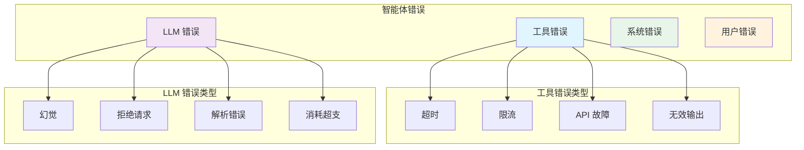

# 4. 错误处理与恢复

> **“在生产环境中，错误不是例外 —— 它们是常态。错误处理的质量直接决定了智能体的可靠性。”**

错误处理是 Harness 工程中最核心的部分。与传统软件视错误为异常不同，智能体系统必须将错误处理视为正常运行的一部分。工具会失效、LLM 会产生幻觉、网络会超时 —— 你的 Harness 系统必须能优雅地处理这一切。

---

## 4.1 错误分类 (Error Classification)

### 错误分类法

### 可恢复 vs 不可恢复错误

我们将错误分为三类：
1. **可恢复 (Recoverable)**：可以使用相同或修改后的输入重试。
2. **条件可恢复 (Conditional)**：需要进行某些调整后方可恢复。
3. **致命 (Fatal)**：无法恢复，任务必须宣告失败。

---

## 4.2 恢复策略 (Recovery Strategies)

### 带退避的重试 (Retry with Backoff)
针对瞬时故障（如网络抖动），采用指数级增加延迟的重试机制，防止对后端系统造成二次冲击。

### 降级机制 (Fallback Mechanisms)
当主要手段（如 Google 搜索）失效时，自动切换到备用方案（如 Bing 搜索或本地知识库）。

### 优雅降级 (Graceful Degradation)
如果核心功能不可用，尝试提供“缩水版”服务，而不是直接完全宕机。

---

## 4.3 死循环预防 (Loop Prevention)

### 无限循环检测
监测智能体的行动历史，如果发现重复执行同一操作或在相似状态间循环，则触发告警并终止。

### 循环恢复逻辑
当检测到死循环时，利用强模型分析成因并制定“脱困计划”，如：添加额外约束、修改当前目标或请求人工介入。

---

## 4.4 熔断器机制 (Circuit Breakers)

### 熔断器模式实现
当外部工具持续报错且达到阈值（如连续 5 次失败）时，熔断器进入“打开”状态，在一段时间内（如 1 分钟）自动拦截所有对该工具的请求，保护系统资源不被浪费。

---

## 4.5 核心要点总结

### 错误处理策略表

| 错误类别 | 恢复性 | 建议行动 |
|----------|---------------|--------|
| **工具超时** | 可恢复 | 带退避的重试 |
| **限流** | 可恢复 | 等待并重试 |
| **API 故障** | 条件可恢复 | 取决于状态码，可能降级 |
| **幻觉** | 可恢复 | 提示词微调并重试 |
| **内存溢出** | 致命 | 立即终止并上报 |

### 生产环境检查清单

- [ ] 建立了统一的错误分类服务。
- [ ] 对网络请求实现了指数退避重试。
- [ ] 为关键操作配置了备用（Fallback）逻辑。
- [ ] 为所有外部依赖启用了熔断保护。
- [ ] 实现了行动历史审计与死循环检测。
- [ ] 建立了错误指标统计与实时报告体系。

---

## 4.6 下一步行动

**继续您的学习之旅：**
- → **[5. 可观测性](../observability)** - 监控与链路追踪
- → **[6. 安全与护栏](../safety-guards)** - 约束与校验机制

---

:::tip 先分类再处理
并非所有错误都值得重试。请先对错误进行精准分类，从而选出最合适的恢复策略。
:::

:::warning 熔断器防止级联崩溃
当一个下游依赖崩溃时，熔断器能有效阻止故障通过依赖链蔓延到整个系统。
:::

:::info 监控错误趋势
错误率的异常波动是系统健康的晴雨表。建议针对错误率激增设置实时告警。
:::
