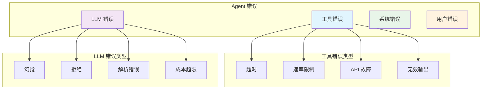

# 4. 错误处理与恢复

> **"在生产环境中，错误不是异常情况——它们是预期中的。错误处理的质量决定了代理的可靠性。"**

错误处理是工程学中最关键的方面。与传统的软件不同，在传统软件中错误是异常的，代理系统必须将错误视为操作的正常部分。工具会失败，LLM 会产生幻觉，网络会超时——你的工程必须优雅地处理所有这些问题。

---

## 4.1 错误分类

### 错误分类法



### 可恢复 vs 不可恢复

```java
public enum ErrorRecoverability {
    RECOVERABLE,      // 可以使用相同或修改后的输入重试
    CONDITIONAL,      // 可以通过更改恢复
    FATAL            // 无法恢复，必须失败
}

public enum ErrorCategory {
    TOOL_TIMEOUT(ErrorRecoverability.RECOVERABLE),
    TOOL_RATE_LIMIT(ErrorRecoverability.RECOVERABLE),
    TOOL_API_FAILURE(ErrorRecoverability.CONDITIONAL),
    TOOL_INVALID_OUTPUT(ErrorRecoverability.CONDITIONAL),

    LLM_HALLUCINATION(ErrorRecoverability.RECOVERABLE),
    LLM_REFUSAL(ErrorRecoverability.CONDITIONAL),
    LLM_PARSE_ERROR(ErrorRecoverability.RECOVERABLE),
    LLM_COST_EXCEEDED(ErrorRecoverability.FATAL),

    SYSTEM_OUT_OF_MEMORY(ErrorRecoverability.FATAL),
    SYSTEM_DISK_FULL(ErrorRecoverability.FATAL),

    USER_INVALID_INPUT(ErrorRecoverability.CONDITIONAL),
    USER_CANCELLED(ErrorRecoverability.FATAL);

    private final ErrorRecoverability recoverability;

    ErrorCategory(ErrorRecoverability recoverability) {
        this.recoverability = recoverability;
    }

    public ErrorRecoverability getRecoverability() {
        return recoverability;
    }
}
```

### 错误分类服务

```java
@Service
public class ErrorClassificationService {

    public ErrorClassification classify(Throwable error) {
        // 工具错误
        if (error instanceof ToolTimeoutException) {
            return ErrorClassification.builder()
                .category(ErrorCategory.TOOL_TIMEOUT)
                .recoverability(ErrorRecoverability.RECOVERABLE)
                .suggestedAction(ErrorAction.RETRY)
                .retryDelay(Duration.ofSeconds(5))
                .build();
        }

        if (error instanceof ToolRateLimitException) {
            return ErrorClassification.builder()
                .category(ErrorCategory.TOOL_RATE_LIMIT)
                .recoverability(ErrorRecoverability.RECOVERABLE)
                .suggestedAction(ErrorAction.WAIT_AND_RETRY)
                .retryDelay(Duration.ofMinutes(1))
                .build();
        }

        if (error instanceof ToolApiException) {
            ToolApiException apiError = (ToolApiException) error;

            if (apiError.getStatusCode() == 500) {
                return ErrorClassification.builder()
                    .category(ErrorCategory.TOOL_API_FAILURE)
                    .recoverability(ErrorRecoverability.RECOVERABLE)
                    .suggestedAction(ErrorAction.RETRY)
                    .retryDelay(Duration.ofSeconds(10))
                    .build();
            }

            if (apiError.getStatusCode() == 401) {
                return ErrorClassification.builder()
                    .category(ErrorCategory.TOOL_API_FAILURE)
                    .recoverability(ErrorRecoverability.FATAL)
                    .suggestedAction(ErrorAction.FAIL)
                    .message("身份验证失败，无法恢复")
                    .build();
            }
        }

        // LLM 错误
        if (error instanceof LLMHallucinationException) {
            return ErrorClassification.builder()
                .category(ErrorCategory.LLM_HALLUCINATION)
                .recoverability(ErrorRecoverability.RECOVERABLE)
                .suggestedAction(ErrorAction.REFINE_AND_RETRY)
                .build();
        }

        if (error instanceof TokenLimitExceededException) {
            return ErrorClassification.builder()
                .category(ErrorCategory.LLM_COST_EXCEEDED)
                .recoverability(ErrorRecoverability.FATAL)
                .suggestedAction(ErrorAction.FAIL)
                .message("Token 预算超限")
                .build();
        }

        // 系统错误
        if (error instanceof OutOfMemoryError) {
            return ErrorClassification.builder()
                .category(ErrorCategory.SYSTEM_OUT_OF_MEMORY)
                .recoverability(ErrorRecoverability.FATAL)
                .suggestedAction(ErrorAction.FAIL)
                .message("系统内存不足")
                .build();
        }

        // 默认
        return ErrorClassification.builder()
            .category(ErrorCategory.UNKNOWN)
            .recoverability(ErrorRecoverability.CONDITIONAL)
            .suggestedAction(ErrorAction.ESCALATE)
            .message("未知错误类型")
            .build();
    }
}
```

---

## 4.2 恢复策略

### 带退避的重试

```java
@Service
public class RetryWithBackoffService {

    private static final int MAX_RETRIES = 3;
    private static final Duration INITIAL_DELAY = Duration.ofSeconds(1);

    public <T> T executeWithRetry(
        Supplier<T> operation,
        ErrorClassification classification
    ) {
        int attempt = 0;
        Duration delay = INITIAL_DELAY;

        while (attempt < MAX_RETRIES) {
            try {
                return operation.get();

            } catch (Exception e) {
                attempt++;

                if (attempt >= MAX_RETRIES) {
                    throw new MaxRetriesExceededException(
                        "最大重试次数超过: " + MAX_RETRIES,
                        e
                    );
                }

                ErrorClassification errorClass = classify(e);

                if (errorClass.getRecoverability() ==
                    ErrorRecoverability.FATAL) {
                    throw e; // 不重试致命错误
                }

                log.warn(
                    "操作失败（尝试 {}/{}），{} 后重试: {}",
                    attempt,
                    MAX_RETRIES,
                    delay,
                    e.getMessage()
                );

                try {
                    Thread.sleep(delay.toMillis());
                } catch (InterruptedException ex) {
                    Thread.currentThread().interrupt();
                    throw new RuntimeException("重试延迟期间被中断", ex);
                }

                // 指数退避
                delay = delay.multipliedBy(2);
            }
        }

        throw new IllegalStateException("不应该到达这里");
    }
}
```

### 后备机制

```java
@Service
public class FallbackService {

    private final Map<String, List<Supplier<Object>>> fallbacks =
        new ConcurrentHashMap<>();

    public void registerFallback(
        String operation,
        List<Supplier<Object>> fallbackProviders
    ) {
        fallbacks.put(operation, fallbackProviders);
    }

    public <T> T executeWithFallback(
        String operation,
        Supplier<T> primary
    ) {
        try {
            return primary.get();

        } catch (Exception e) {
            log.warn("主要操作失败: {}", operation);

            List<Supplier<Object>> providers =
                fallbacks.get(operation);

            if (providers == null || providers.isEmpty()) {
                throw e; // 没有后备可用
            }

            // 按顺序尝试每个后备
            for (Supplier<Object> fallback : providers) {
                try {
                    @SuppressWarnings("unchecked")
                    T result = (T) fallback.get();
                    log.info("后备成功: {}", operation);
                    return result;

                } catch (Exception fallbackError) {
                    log.warn("后备失败: {}", operation, fallbackError);
                }
            }

            throw new AllFallbacksFailedException(
                "所有后备都失败: " + operation,
                e
            );
        }
    }

    // 示例：工具后备
    @PostConstruct
    public void registerToolFallbacks() {
        // Web 搜索后备
        registerFallback("web_search", List.of(
            () -> searchWithBackupProvider(),
            () -> searchWithCachedResults(),
            () -> askUserForClarification()
        ));

        // 数据库后备
        registerFallback("database_query", List.of(
            () -> queryWithReadReplica(),
            () -> queryWithCache(),
            () -> returnEmptyResult()
        ));
    }
}
```

### 优雅降级

```java
@Service
public class GracefulDegradationService {

    public <T> DegradedResult<T> executeWithDegradation(
        Supplier<T> fullOperation,
        Supplier<T> degradedOperation
    ) {
        try {
            // 尝试完整操作
            T result = fullOperation.get();
            return DegradedResult.full(result);

        } catch (Exception e) {
            log.warn("完整操作失败，正在降级: {}", e.getMessage());

            try {
                // 回退到降级操作
                T degradedResult = degradedOperation.get();
                return DegradedResult.degraded(degradedResult);

            } catch (Exception degradedError) {
                log.error("降级操作也失败了", degradedError);
                return DegradedResult.failed(degradedError);
            }
        }
    }

    @Getter
    public static class DegradedResult<T> {
        private final T result;
        private final QualityLevel quality;
        private final Exception error;

        public enum QualityLevel {
            FULL,       // 所有功能可用
            DEGRADED,   // 功能减少
            FAILED      // 操作失败
        }

        private DegradedResult(T result, QualityLevel quality, Exception error) {
            this.result = result;
            this.quality = quality;
            this.error = error;
        }

        public static <T> DegradedResult<T> full(T result) {
            return new DegradedResult<>(result, QualityLevel.FULL, null);
        }

        public static <T> DegradedResult<T> degraded(T result) {
            return new DegradedResult<>(result, QualityLevel.DEGRADED, null);
        }

        public static <T> DegradedResult<T> failed(Exception error) {
            return new DegradedResult<>(null, QualityLevel.FAILED, error);
        }
    }
}
```

---

## 4.3 循环预防

### 无限循环检测

```java
@Service
public class LoopPreventionService {

    private static final int MAX_ITERATIONS = 10;
    private static final int MAX_REPEAT_ACTIONS = 3;

    public boolean isInLoop(
        AgentContext context,
        String currentAction
    ) {
        // 检查迭代次数
        if (context.getIterationCount() >= MAX_ITERATIONS) {
            log.warn("最大迭代次数超过: {}", MAX_ITERATIONS);
            return true;
        }

        // 检查重复操作
        int repeatCount = countRecentOccurrences(
            context.getActionHistory(),
            currentAction,
            MAX_REPEAT_ACTIONS
        );

        if (repeatCount >= MAX_REPEAT_ACTIONS) {
            log.warn("操作重复 {} 次: {}",
                repeatCount, currentAction);
            return true;
        }

        // 检查状态循环
        if (isInStateCycle(context)) {
            log.warn("检测到状态循环");
            return true;
        }

        return false;
    }

    private int countRecentOccurrences(
        List<String> history,
        String action,
        int window
    ) {
        int count = 0;
        int start = Math.max(0, history.size() - window);

        for (int i = start; i < history.size(); i++) {
            if (history.get(i).equals(action)) {
                count++;
            }
        }

        return count;
    }

    private boolean isInStateCycle(AgentContext context) {
        List<String> recentStates = context.getStateHistory()
            .stream()
            .skip(Math.max(0, context.getStateHistory().size() - 5))
            .toList();

        // 检查是否见过这个状态模式
        return recentStates.size() >= 3 &&
               recentStates.get(recentStates.size() - 1)
                   .equals(recentStates.get(recentStates.size() - 3));
    }
}
```

### 循环恢复

```java
@Service
public class LoopRecoveryService {

    @Autowired
    private ChatClient chatClient;

    public RecoveryPlan recoverFromLoop(
        AgentContext context,
        LoopDetection detection
    ) {
        // 询问 LLM 恢复策略
        String recovery = chatClient.prompt()
            .system("""
                你是循环恢复专家。
                代理陷入了循环。建议恢复策略。

                返回 JSON：
                {
                    "strategy": "change_goal | add_constraint | ask_help | abort",
                    "reasoning": "解释",
                    "suggested_action": "下一步做什么"
                }
                """)
            .user("""
                当前任务: {task}
                操作历史: {history}
                循环模式: {pattern}
                """.formatted(
                    context.getCurrentTask(),
                    context.getActionHistory(),
                    detection.getPattern()
                ))
            .call()
            .content();

        return parseRecoveryPlan(recovery);
    }

    public void executeRecovery(
        AgentContext context,
        RecoveryPlan plan
    ) {
        switch (plan.getStrategy()) {
            case CHANGE_GOAL:
                context.setCurrentTask(plan.getSuggestedAction());
                break;

            case ADD_CONSTRAINT:
                context.addConstraint(plan.getSuggestedAction());
                break;

            case ASK_HELP:
                requestHumanAssistance(context, plan);
                break;

            case ABORT:
                context.abort("检测到循环，无法恢复");
                break;
        }
    }

    private void requestHumanAssistance(
        AgentContext context,
        RecoveryPlan plan
    ) {
        HumanInterventionRequest request =
            HumanInterventionRequest.builder()
                .agentId(context.getAgentId())
                .taskId(context.getTaskId())
                .reason("代理陷入循环")
                .context(context.getState())
                .suggestedActions(plan.getSuggestedAction())
                .build();

        humanFeedbackService.requestAssistance(request);
    }
}
```

---

## 4.4 断路器

### 断路器模式

```java
@Service
public class CircuitBreakerService {

    private final Map<String, CircuitBreaker> breakers =
        new ConcurrentHashMap<>();

    public CircuitBreaker getBreaker(String name) {
        return breakers.computeIfAbsent(
            name,
            k -> new CircuitBreaker(
                threshold = 5,
                timeout = Duration.ofMinutes(1),
                halfOpenAttempts = 3
            )
        );
    }

    public <T> T execute(
        String operation,
        Supplier<T> supplier
    ) {
        CircuitBreaker breaker = getBreaker(operation);

        // 检查电路是否打开
        if (breaker.isOpen()) {
            if (breaker.shouldAttemptReset()) {
                breaker.halfOpen();
            } else {
                throw new CircuitOpenException(
                    "操作断路器打开: " + operation
                );
            }
        }

        try {
            T result = supplier.get();
            breaker.recordSuccess();
            return result;

        } catch (Exception e) {
            breaker.recordFailure();

            if (breaker.shouldOpen()) {
                log.warn("操作断路器打开: {}", operation);
            }

            throw e;
        }
    }

    @Data
    public static class CircuitBreaker {
        private final int threshold;
        private final Duration timeout;
        private final int halfOpenAttempts;

        private int failureCount = 0;
        private int successCount = 0;
        private Instant lastFailureTime;
        private State state = State.CLOSED;

        public boolean isOpen() {
            return state == State.OPEN;
        }

        public boolean shouldAttemptReset() {
            if (state != State.OPEN) {
                return false;
            }

            return Duration.between(
                lastFailureTime,
                Instant.now()
            ).compareTo(timeout) > 0;
        }

        public void recordSuccess() {
            failureCount = 0;

            if (state == State.HALF_OPEN) {
                successCount++;
                if (successCount >= halfOpenAttempts) {
                    state = State.CLOSED;
                    log.info("断路器关闭");
                }
            }
        }

        public void recordFailure() {
            failureCount++;
            lastFailureTime = Instant.now();

            if (state == State.HALF_OPEN) {
                state = State.OPEN;
                successCount = 0;
            } else if (failureCount >= threshold) {
                state = State.OPEN;
                log.warn("失败 {} 次后断路器打开",
                    failureCount);
            }
        }

        public boolean shouldOpen() {
            return state == State.OPEN;
        }

        public void halfOpen() {
            state = State.HALF_OPEN;
            successCount = 0;
            log.info("断路器半开");
        }

        enum State {
            CLOSED,    // 正常操作
            OPEN,      // 失败，不调用
            HALF_OPEN  // 尝试重置
        }
    }
}
```

### 断路器配置

```java
@Configuration
public class CircuitBreakerConfig {

    @Bean
    public CircuitBreakerService circuitBreakerService() {
        CircuitBreakerService service = new CircuitBreakerService();

        // 配置特定工具的断路器
        service.getBreaker("web_search")
            .setThreshold(3)
            .setTimeout(Duration.ofSeconds(30));

        service.getBreaker("database_query")
            .setThreshold(5)
            .setTimeout(Duration.ofMinutes(1));

        service.getBreaker("llm_call")
            .setThreshold(10)
            .setTimeout(Duration.ofMinutes(5));

        return service;
    }
}
```

---

## 4.5 错误聚合

### 收集错误指标

```java
@Service
public class ErrorMetricsService {

    @Autowired
    private MeterRegistry meterRegistry;

    public void recordError(
        String operation,
        ErrorClassification classification
    ) {
        // 总错误计数器
        meterRegistry.counter(
            "agent.errors.total",
            "operation", operation,
            "category", classification.getCategory().name(),
            "recoverability", classification.getRecoverability().name()
        ).increment();

        // 错误率仪表盘
        meterRegistry.gauge(
            "agent.errors.rate",
            Tags.of(
                "operation", operation,
                "category", classification.getCategory().name()
            ),
            calculateErrorRate(operation)
        );
    }

    private double calculateErrorRate(String operation) {
        // 计算过去 5 分钟的错误率
        // 实现取决于你的指标存储
        return 0.0;
    }

    public ErrorReport generateErrorReport(
        String operation,
        Duration period
    ) {
        Instant start = Instant.now().minus(period);

        return ErrorReport.builder()
            .operation(operation)
            .period(period)
            .totalErrors(getTotalErrors(operation, start))
            .errorsByCategory(getErrorsByCategory(operation, start))
            .errorsByRecoverability(getErrorsByRecoverability(operation, start))
            .topErrors(getTopErrors(operation, start, 10))
            .errorRate(getErrorRate(operation, period))
            .build();
    }
}
```

---

## 4.6 关键要点

### 错误分类

| 类别 | 可恢复性 | 操作 |
|------|----------|------|
| **工具超时** | 可恢复 | 带退避重试 |
| **速率限制** | 可恢复 | 等待后重试 |
| **API 故障** | 条件性 | 取决于状态码 |
| **幻觉** | 可恢复 | 优化后重试 |
| **内存不足** | 致命 | 立即失败 |

### 恢复策略

1. **带退避的重试**：用于瞬时错误
2. **后备**：替代实现
3. **优雅降级**：减少功能
4. **断路器**：停止调用失败的服务

### 循环预防

- 监控操作历史
- 检测重复模式
- 检查状态循环
- 限制迭代次数

### 生产清单

- [ ] 错误分类服务
- [ ] 带指数退避的重试
- [ ] 后备机制
- [ ] 外部服务的断路器
- [ ] 循环检测和恢复
- [ ] 错误指标和报告

---

## 4.7 下一步

**继续你的旅程：**
- → **[5. 可观察性](../observability)** - 监控和追踪
- → **[6. 安全与防护栏](../safety-guards)** - 约束和验证

---

:::tip 分类后恢复
不是所有错误都应该重试。先分类错误以确定适当的恢复策略。
:::

:::warning 断路器防止级联失败
当依赖项失败时，断路器防止失败在整个系统中蔓延。
:::

:::info 监控错误率
错误率趋势表示系统健康状况。为错误率峰值设置警报。
:::