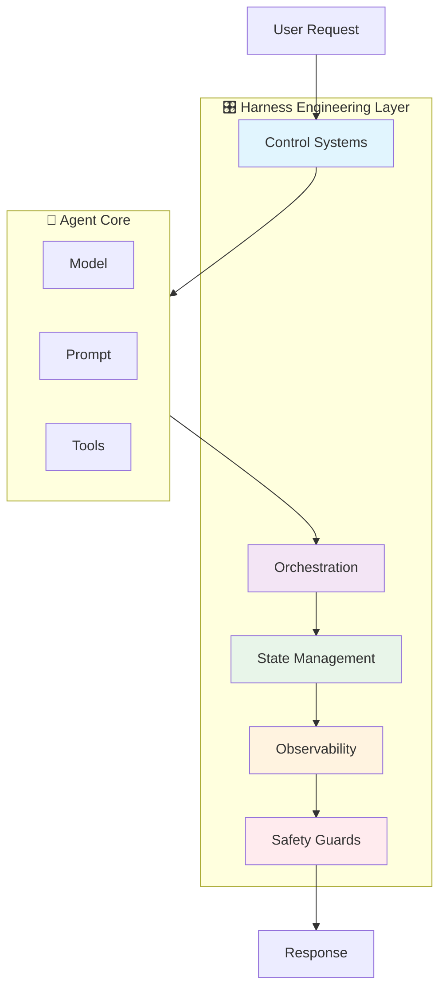
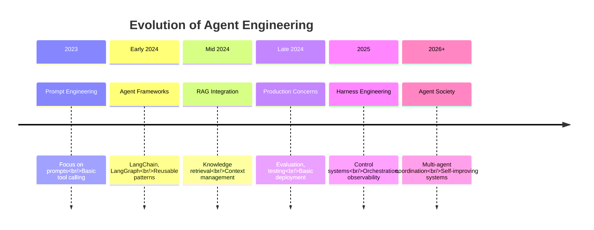

# AI Agent Harness Engineering

> **"决定 AI Agent 能否在生产环境中正常运行的关键架构层。"**

Harness Engineering 是一门新兴学科（2025-2026），专注于围绕 AI Agent 的**控制系统、编排和生产基础设施**。传统的 Agent 开发聚焦于提示词和工具，而 Harness 工程则确保 Agent 在大规模运行时具备可靠性、安全性和可观测性。

---

## 什么是 Harness Engineering？

### 定义

**Harness Engineering** 涵盖 Agent 周围的整个系统：

| 组件 | 描述 | 示例 |
|------|------|------|
| **控制系统** | 引导 Agent 行为的反馈循环 | 工具结果验证、反思循环 |
| **工具编排** | 大规模管理工具执行 | 并行执行、错误恢复、重试逻辑 |
| **状态管理** | 跨工作流处理 Agent 状态 | 检查点、持久化、恢复 |
| **可观测性** | 监控和调试 Agent | 链路追踪、日志、指标 |
| **安全护栏** | 约束和边界 | 速率限制、权限检查、输出验证 |

### Harness 与 Agent 的关系



**Agent**（大脑）：
- 模型推理
- 工具选择
- 计划生成

**Harness**（控制系统）：
- 验证工具输出
- 管理执行流程
- 处理错误和重试
- 跟踪状态和进度
- 执行安全约束
- 提供可观测性

---

## 为什么 Harness Engineering 很重要

### 从原型到生产的差距

| 方面 | 原型 | 生产环境 |
|------|------|---------|
| **可靠性** | 大部分时间能工作 | 99.9%+ 时间正常工作 |
| **错误处理** | 基本的 try-catch | 全面的恢复策略 |
| **可观测性** | 控制台日志 | 完整的链路追踪和监控 |
| **安全** | 人工审查 | 自动化护栏 |
| **状态** | 内存中 | 持久化且可恢复 |
| **规模** | 单用户 | 数千并发用户 |

### 实际影响

没有适当的 Harness 工程，生产环境中的 Agent 会面临：

- **级联故障**：一个工具失败导致整个工作流崩溃
- **无限循环**：Agent 陷入重复相同操作的死循环
- **静默失败**：错误发生但未被记录或监控
- **安全漏洞**：缺乏输入验证和访问控制
- **高成本**：低效的工具使用和缺少缓存
- **糟糕的用户体验**：长延迟和不清晰的错误信息

有 Harness 工程时：

- **弹性运行**：自动从故障中恢复
- **可预测行为**：明确的边界和约束
- **完全可见**：每个决策的完整追踪
- **安全部署**：多层安全检查
- **优化性能**：高效的资源使用
- **更好的用户体验**：快速、可靠、清晰的交互

---

## Agent 工程的演进



### 关键里程碑

**2023 - 提示词工程时代**
- 聚焦于编写更好的提示词
- 简单的函数调用
- 没有系统化的错误处理方法

**2024 - Agent 框架兴起**
- LangChain、LangGraph、AutoGen 相继出现
- 可复用的模式和组件
- 基本的 RAG 集成

**2024 年末 - 生产关注点**
- 评估框架（LLM-as-a-Judge）
- 测试策略
- 安全意识

**2025 - Harness 工程兴起**
- 控制系统和反馈循环
- 复杂的编排
- 全面的可观测性
- 安全护栏

**2026+ - Agent 社会**
- 多 Agent 协调
- 自我改进系统
- 自治组织

---

## 核心组件

### 1. 控制系统

引导 Agent 行为的反馈机制：

```
Observe → Orient → Decide → Act → Observe
```

**关键模式：**
- 带验证的 ReAct
- 反思与自我修正
- Human-in-the-loop 反馈
- 基于环境的反馈

### 2. 工具编排

在生产规模下管理工具执行：

| 模式 | 描述 | 使用场景 |
|------|------|---------|
| **顺序执行** | 工具一个接一个执行 | 有依赖关系的操作 |
| **并行执行** | 多个工具同时执行 | 独立操作 |
| **条件执行** | 基于条件选择工具 | 动态工作流 |
| **组合执行** | 工具链式连接 | 复杂流水线 |

### 3. 状态管理

跨长时间运行的工作流处理 Agent 状态：

**状态类型：**
- 对话状态（对话历史）
- 任务状态（当前进度）
- 记忆状态（已学信息）
- 环境状态（外部系统）

**持久化策略：**
- 检查点（定期保存）
- 事件溯源（事件日志）
- 快照（完整状态转储）

### 4. 可观测性

对 Agent 操作的完整可见性：

```
Metrics → Monitoring → Alerting → Action
  ↓         ↓           ↓         ↓
Counters   Dashboards  Alarms   Remediation
Gauges     Queries     Notifs   Auto-fix
Histograms
```

**关键指标：**
- 成功率（任务完成）
- 延迟（响应时间）
- 成本（Token 使用量）
- 工具性能（成功/失败率）

### 5. 安全护栏

多层保护：

**执行前：**
- 输入验证
- 权限检查
- 资源可用性

**运行时：**
- Token 限制
- 时间限制
- 工具使用限制

**执行后：**
- 输出清洗
- 结果验证
- 安全检查

---

## Harness 工程与传统工程对比

| 方面 | 传统软件 | Agent Harness 工程 |
|------|---------|-------------------|
| **确定性** | 高 — 相同输入 → 相同输出 | 低 — LLM 具有非确定性 |
| **测试** | 单元测试、集成测试 | 评估框架、LLM-as-a-Judge |
| **调试** | 堆栈跟踪、断点 | 链路追踪、日志、回放 |
| **错误** | 异常、错误码 | 工具失败、幻觉、循环 |
| **状态** | 数据库、缓存 | 记忆、上下文、工具 |
| **监控** | 指标、日志 | Agent 追踪、工具追踪、LLM 追踪 |
| **安全** | 认证、授权 | 提示词注入、工具访问控制 |

---

## 何时需要 Harness 工程？

### 必需场景：

- **生产 Agent**：服务真实用户的 Agent
- **长时间运行的任务**：需要数分钟到数小时的工作流
- **多工具工作流**：使用 3 个以上工具的 Agent
- **高并发量**：数千并发请求
- **敏感操作**：Agent 访问关键系统
- **合规要求**：审计、日志、安全

### 非关键场景：

- **原型**：早期探索阶段
- **简单工具**：使用 1-2 个工具的 Agent
- **低并发量**：小用户群测试
- **内部工具**：风险暴露有限

---

## 关键技术

| 技术 | 角色 | 集成方式 |
|------|------|---------|
| **Spring AI** | Java Agent 框架 | `spring-ai-openai-spring-boot-starter` |
| **MCP** | 标准化工具协议 | Model Context Protocol 服务器 |
| **LangGraph** | Agent 编排 | 有状态工作流 |
| **LangSmith** | 可观测性平台 | 链路追踪和调试 |
| **Redis** | 状态持久化 | 缓存和会话存储 |
| **PostgreSQL** | 持久存储 | pgvector 用于嵌入 |
| **Prometheus** | 指标收集 | 时序数据 |
| **Grafana** | 监控仪表板 | 可视化 |

---

## 前置知识

深入学习 Harness 工程之前，请确保你了解：

1. **AI Agent 基础** ([模块 04](/docs/ai/agents/))
   - Agent 架构和组件
   - ReAct 模式
   - 工具集成
   - 设计模式

2. **MCP 协议** ([模块 05](/docs/ai/mcp/))
   - 工具定义
   - 服务器实现
   - 集成模式

3. **生产工程** ([模块 04.5](/docs/ai/agents/engineering))
   - 评估策略
   - 安全考量
   - 部署模式

---

## 学习路径

### Java/Spring Boot 开发者

**路径**：概览 → 核心概念 → 编排 → 状态管理 → 模式

聚焦于使用 Spring AI 和 MCP 构建生产级 Harness。

### AI 工程师

**路径**：概览 → 核心概念 → 可观测性 → 模式 → 安全护栏

聚焦于控制系统和监控。

### DevOps 工程师

**路径**：概览 → 可观测性 → 错误处理 → 模式

聚焦于部署、监控和可靠性。

---

## 常见挑战

| 挑战 | 解决方案 | 覆盖章节 |
|------|---------|---------|
| **Agent 陷入循环** | 循环检测 + 迭代限制 | 错误处理 |
| **工具故障级联** | 熔断器 + 重试 | 编排 |
| **重启后状态丢失** | 检查点 + 持久化 | 状态管理 |
| **无法调试 Agent 行为** | 全面的链路追踪 | 可观测性 |
| **Agent 超出预算** | 成本控制 + 限制 | 安全护栏 |
| **安全漏洞** | 输入验证 + 访问控制 | 安全护栏 |

---

## 生产环境检查清单

部署带有生产 Harness 的 Agent 之前：

- [ ] 控制循环已实现（observe → decide → act）
- [ ] 工具编排带错误处理
- [ ] 状态持久化和恢复
- [ ] 全面的监控和追踪
- [ ] 各层安全护栏
- [ ] 速率限制和成本控制
- [ ] 敏感操作的 Human-in-the-loop
- [ ] 审计日志已启用
- [ ] 负载测试已完成
- [ ] 回滚计划已文档化

---

## 核心要点

### 核心概念

1. **Harness ≠ Agent**
   - Agent：模型 + 工具 + 规划
   - Harness：控制 + 编排 + 可观测性 + 安全

2. **控制系统是基础**
   - 反馈循环引导 Agent 行为
   - 每一步都有验证
   - 通过反思实现自我修正

3. **可观测性不可妥协**
   - 你无法修复你看不见的问题
   - 追踪每个决策和操作
   - 监控关键指标

### 生产思维

```
Prototype: "It works!"
Production: "It works, fails gracefully, and we know why it failed."
```

### Harness 工程箴言

> **"先构建 Harness，再扩展 Agent。"**

---

:::tip 入门指南
Harness 工程新手？从 **[1. 核心概念](./core-concepts)** 开始，了解控制系统和反馈循环。
:::

:::info Java 开发者注意
如果你使用 Spring Boot 构建，请特别关注 **[2. 工具编排](./orchestration)** 和 **[3. 状态管理](./state-management)** 中的 Spring AI 模式。
:::

:::warning 生产就绪
Harness 工程对生产 Agent 至关重要。没有它，Agent 将不可预测地失败、产生高成本并带来安全风险。
:::
