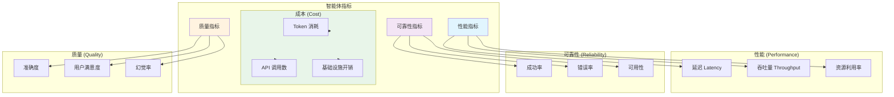
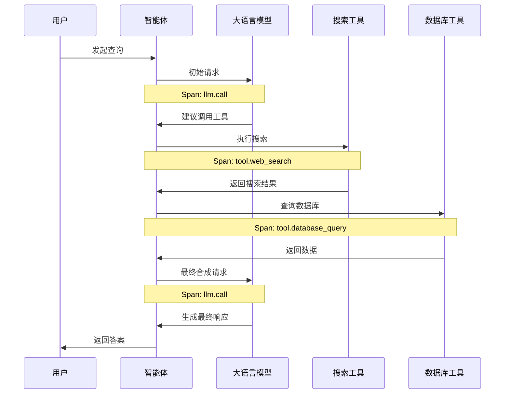

# 5. 可观测性

> **“你无法修复你看不见的东西。可观测性是构建可靠智能体系统的基石。”**

可观测性让你能够深入洞察智能体系统内部发生的每件事。它不仅关乎日志记录，更在于追踪每一次决策、度量每一次操作，并对复杂的工作流进行调试。

---

## 5.1 监控 (Monitoring)

### 关键指标



### 指标收集实现

```java
@Service
public class AgentMetricsService {

    @Autowired
    private MeterRegistry meterRegistry;

    // 性能指标：记录操作延迟
    public void recordLatency(String operation, Duration latency) {
        meterRegistry.timer("agent.latency", "operation", operation).record(latency);
    }

    // 成本指标：记录 Token 使用情况
    public void recordTokenUsage(String model, int promptTokens, int completionTokens) {
        meterRegistry.counter("agent.tokens.prompt", "model", model).increment(promptTokens);
        meterRegistry.counter("agent.tokens.completion", "model", model).increment(completionTokens);
    }

    // 质量指标：记录幻觉率或准确度
    public void recordAccuracy(String operation, double accuracy) {
        meterRegistry.gauge("agent.quality.accuracy", Tags.of("operation", operation), accuracy);
    }
}
```

---

## 5.2 链路追踪 (Tracing)

### 分布式追踪

追踪智能体从接收请求、调用 LLM、执行工具到返回答案的全过程。



---

## 5.3 日志记录 (Logging)

### 结构化日志

使用 JSON 格式记录日志，以便于 ELK 或 Loki 等系统进行分析。

| 日志级别 | 适用场景 | 示例 |
|-------|-------------|----------|
| **ERROR** | 系统级故障 | 工具执行失败、LLM API 超时、代码异常 |
| **WARN** | 潜在风险点 | 延迟过高、Token 用量接近上限 |
| **INFO** | 关键里程碑 | 任务开始、任务圆满完成、状态切换 |
| **DEBUG** | 详细执行流 | 原始 Tool Call 参数、LLM 原始响应 |
| **TRACE** | 极详尽信息 | 内部变量状态的微小变化 |

---

## 5.4 调试与告警

### 调试工具集成
- **LangSmith**: 用于 LLM 链路的深度追踪与版本对比。
- **自定义调试面板**: 在前端展示 Agent 的“思考过程”和每一步的输入输出。

### 告警配置建议
1. **成功率告警**: 当成功率低于 95% 时触发。
2. **延迟告警**: 当 P95 延迟超过 15 秒时触发。
3. **成本告警**: 当单日 Token 消耗超出预算时触发。

---

## 5.5 核心要点总结

### 可观测性的三大支柱

| 支柱 | 目的 | 推荐工具 |
|--------|---------|-------|
| **指标 (Metrics)** | 定量分析 | Prometheus, Grafana |
| **追踪 (Tracing)** | 流程还原 | OpenTelemetry, Jaeger, LangSmith |
| **日志 (Logging)** | 细节查证 | ELK Stack, Loki |

### 生产环境检查清单

- [ ] 对所有 LLM 调用和工具执行均实现了指标收集。
- [ ] 开启了分布式链路追踪。
- [ ] 采用结构化日志记录，并设置了合理的日志级别。
- [ ] 实现了 PII（个人隐私信息）的日志脱敏。
- [ ] 配置了关键指标的告警触发器。
- [ ] 建立了可视化仪表板（Dashboard）。

---

## 5.6 下一步行动

**继续您的学习之旅：**
- → **[6. 安全与护栏](../safety-guards)** - 约束与校验机制
- → **[7. 生产环境模式](../patterns)** - 真实世界的实现模式

---

:::tip 指标先行
请先实现指标监控，它们是所有可观测性的基础。随后根据排障需求逐步添加追踪和详尽日志。
:::

:::warning 保护隐私数据
在存储日志和追踪信息前，请务必进行脱敏处理。日志中的 PII 信息是一个严重的安全隐患。
:::

:::info 调试面板能救命
一个直观的调试面板能将排障时间从数小时缩短至数分钟。建议在开发初期就进行投入。
:::
