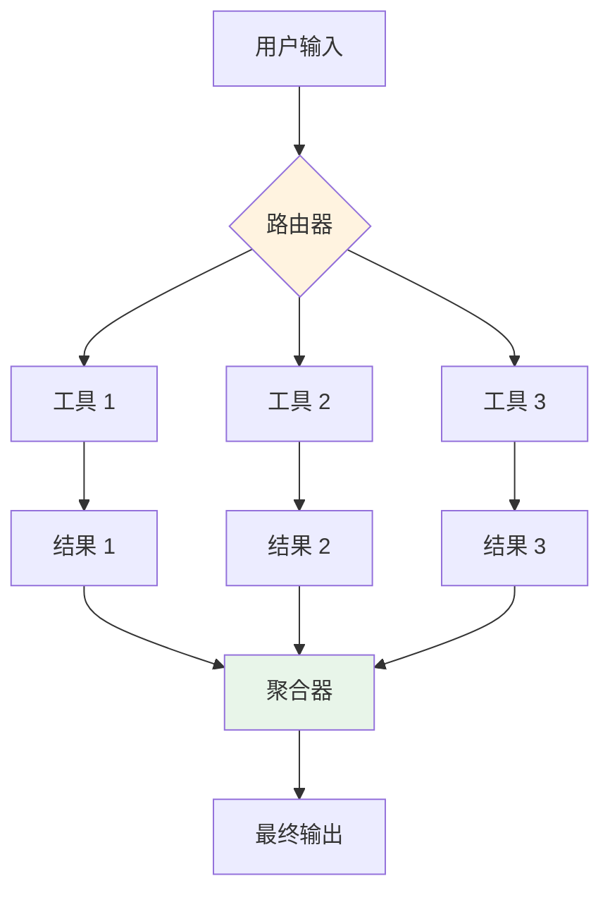
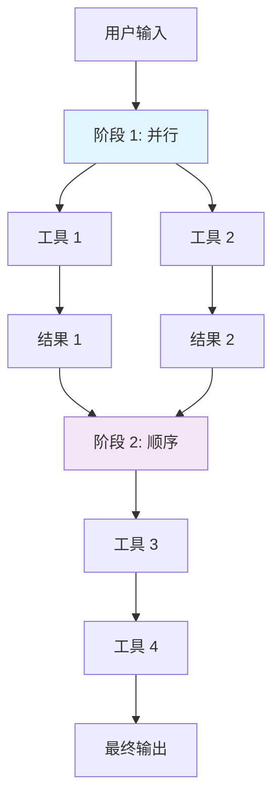

# 2. 工具编排

> **"工具编排的质量决定了代理的可靠性，而非模型的质量。"**

工具编排是管理生产环境中工具执行的艺术与科学。这不只是调用工具——而是管理失败、优化性能、处理错误和组合复杂的工作流。

---

## 2.1 工具调用模式

### 顺序执行

工具一个接一个地执行，每个工具的输出为下一个工具提供信息。


**何时使用：**
- 工具依赖彼此的输出
- 操作顺序很重要
- 早期结果为后续决策提供信息

**实现：**

```java
@Service
public class SequentialOrchestrator {

    @Autowired
    private ToolExecutor toolExecutor;

    public List<ToolResult> execute(
        List<ToolCall> calls,
        AgentContext context
    ) {
        List<ToolResult> results = new ArrayList<>();

        for (ToolCall call : calls) {
            try {
                // 检查是否应该继续
                if (shouldStop(context, results)) {
                    break;
                }

                // 执行工具
                ToolResult result = toolExecutor.execute(call);
                results.add(result);

                // 用结果更新上下文
                context = context.update(result);

                // 检查错误
                if (result.hasError()) {
                    handleSequentialError(call, result, context);
                    if (context.isFatalError()) {
                        break;
                    }
                }

            } catch (ToolExecutionException e) {
                ToolResult errorResult = ToolResult.error(
                    call,
                    e.getMessage()
                );
                results.add(errorResult);

                if (shouldFailFast(e)) {
                    break;
                }
            }
        }

        return results;
    }

    private boolean shouldStop(
        AgentContext context,
        List<ToolResult> results
    ) {
        // 如果目标达成则停止
        if (context.isGoalAchieved()) {
            return true;
        }

        // 如果是致命错误则停止
        if (context.isFatalError()) {
            return true;
        }

        // 如果超过资源限制则停止
        if (context.hasExceededLimits()) {
            return true;
        }

        return false;
    }

    private void handleSequentialError(
        ToolCall call,
        ToolResult result,
        AgentContext context
    ) {
        // 记录错误
        log.error("工具 {} 失败: {}",
            call.getToolName(),
            result.getErrorMessage()
        );

        // 决定继续还是失败
        if (call.isCritical()) {
            context.markFatalError(result.getErrorMessage());
        } else {
            context.markNonCriticalError(result.getErrorMessage());
        }
    }
}
```

### 并行执行

多个工具同时执行，减少延迟。



**何时使用：**
- 工具相互独立
- 性能至关重要
- 工具具有相似的延迟

**实现：**

```java
@Service
public class ParallelOrchestrator {

    @Autowired
    private ToolExecutor toolExecutor;

    @Value("${agent.parallel.thread-pool-size:10}")
    private int threadPoolSize;

    private ExecutorService executorService;

    @PostConstruct
    public void init() {
        this.executorService = Executors.newFixedThreadPool(
            threadPoolSize
        );
    }

    public Map<String, ToolResult> executeParallel(
        List<ToolCall> calls,
        Duration timeout
    ) {
        // 为所有调用创建 futures
        List<CompletableFuture<ToolResult>> futures = calls.stream()
            .map(call -> CompletableFuture.supplyAsync(
                () -> executeWithRetry(call),
                executorService
            ))
            .toList();

        // 等待所有完成（带超时）
        CompletableFuture<Void> allFutures = CompletableFuture.allOf(
            futures.toArray(new CompletableFuture[0])
        );

        try {
            allFutures.get(timeout.toMillis(), TimeUnit.MILLISECONDS);

        } catch (TimeoutException e) {
            log.warn("并行执行超时");
            futures.forEach(future -> future.cancel(true));

        } catch (Exception e) {
            log.error("并行执行失败", e);
        }

        // 收集结果
        return futures.stream()
            .filter(future -> future.isDone() && !future.isCompletedExceptionally())
            .map(CompletableFuture::join)
            .collect(Collectors.toMap(
                result -> result.getToolCall().getToolName(),
                result -> result
            ));
    }

    private ToolResult executeWithRetry(ToolCall call) {
        int maxRetries = 3;
        int retryDelay = 1000; // 毫秒

        for (int i = 0; i < maxRetries; i++) {
            try {
                return toolExecutor.execute(call);

            } catch (ToolExecutionException e) {
                if (i == maxRetries - 1) {
                    return ToolResult.error(call, e.getMessage());
                }

                try {
                    Thread.sleep(retryDelay * (i + 1));
                } catch (InterruptedException ex) {
                    Thread.currentThread().interrupt();
                    return ToolResult.error(call, "中断");
                }
            }
        }

        return ToolResult.error(call, "超过最大重试次数");
    }
}
```

### 混合格成编排

结合顺序和并行执行以获得最佳性能。



**实现：**

```java
@Service
public class HybridOrchestrator {

    @Autowired
    private SequentialOrchestrator sequentialOrchestrator;

    @Autowired
    private ParallelOrchestrator parallelOrchestrator;

    public List<ToolResult> executeHybrid(
        OrchestrationPlan plan,
        AgentContext context
    ) {
        List<ToolResult> allResults = new ArrayList<>();

        for (OrchestrationPhase phase : plan.getPhases()) {
            List<ToolResult> phaseResults;

            if (phase.getType() == PhaseType.PARALLEL) {
                Map<String, ToolResult> parallelResults =
                    parallelOrchestrator.executeParallel(
                        phase.getToolCalls(),
                        phase.getTimeout()
                    );
                phaseResults = new ArrayList<>(parallelResults.values());

            } else {
                phaseResults = sequentialOrchestrator.execute(
                    phase.getToolCalls(),
                    context
                );
            }

            allResults.addAll(phaseResults);

            // 检查是否应该停止
            if (shouldStopAfterPhase(phase, phaseResults, context)) {
                break;
            }

            // 更新上下文
            context = context.update(phaseResults);
        }

        return allResults;
    }

    private boolean shouldStopAfterPhase(
        OrchestrationPhase phase,
        List<ToolResult> results,
        AgentContext context
    ) {
        // 如果阶段有致命错误则停止
        if (results.stream().anyMatch(ToolResult::hasFatalError)) {
            return true;
        }

        // 如果目标达成则停止
        if (context.isGoalAchieved()) {
            return true;
        }

        // 检查阶段退出条件
        if (phase.getExitCondition().isPresent()) {
            return phase.getExitCondition().get().test(results);
        }

        return false;
    }
}
```

---

## 2.2 工具结果处理

### 结果验证

在使用之前验证工具输出。

```java
@Service
public class ToolResultValidator {

    @Autowired
    private ChatClient chatClient;

    public ValidationResult validate(
        ToolCall call,
        ToolResult result
    ) {
        // 基本验证
        if (result == null) {
            return ValidationResult.failed("结果为空");
        }

        if (result.hasError()) {
            return ValidationResult.failed(
                "工具返回错误: " + result.getErrorMessage()
            );
        }

        // 架构验证（如果定义）
        if (call.getOutputSchema().isPresent()) {
            JsonSchema schema = call.getOutputSchema().get();
            if (!schema.validate(result.getData())) {
                return ValidationResult.failed(
                    "输出不符合预期的架构"
                );
            }
        }

        // 语义验证（使用 LLM）
        if (call.requiresSemanticValidation()) {
            return semanticValidation(call, result);
        }

        return ValidationResult.success();
    }

    private ValidationResult semanticValidation(
        ToolCall call,
        ToolResult result
    ) {
        String validation = chatClient.prompt()
            .system("""
                你是一个工具结果验证器。
                检查结果对工具调用是否有意义：
                1. 结果是否相关？
                2. 结果是否完整？
                3. 是否有明显的错误？

                返回 JSON：
                {
                    "valid": true/false,
                    "reason": "解释"
                }
                """)
            .user("""
                工具: {tool}
                输入: {input}
                输出: {output}
                """.formatted(
                    call.getToolName(),
                    call.getInput(),
                    result.getData()
                ))
            .call()
            .content();

        return parseValidation(validation);
    }
}
```

### 结果解析

解析和规范化工具输出。

```java
@Service
public class ToolResultParser {

    public ParsedResult parse(ToolResult result) {
        Object data = result.getData();

        // JSON 解析
        if (data instanceof String) {
            try {
                return parseJson((String) data);
            } catch (JsonProcessingException e) {
                return ParsedResult.raw(data);
            }
        }

        // 已结构化
        if (data instanceof Map || data instanceof List) {
            return ParsedResult.structured(data);
        }

        // 原始值
        return ParsedResult.raw(data);
    }

    private ParsedResult parseJson(String json) {
        ObjectMapper mapper = new ObjectMapper();
        Object parsed = mapper.readValue(json, Object.class);
        return ParsedResult.structured(parsed);
    }

    public <T> T parseAs(
        ToolResult result,
        Class<T> type
    ) {
        ParsedResult parsed = parse(result);

        if (parsed.isStructured()) {
            ObjectMapper mapper = new ObjectMapper();
            return mapper.convertValue(
                parsed.getData(),
                type
            );
        }

        throw new IllegalArgumentException(
            "无法将结果转换为类型: " + type
        );
    }
}
```

### 按工具的错误处理

不同的工具需要不同的错误处理策略。

```java
@Service
public class ToolSpecificErrorHandler {

    private final Map<String, ErrorHandler> handlers;

    public ToolSpecificErrorHandler() {
        this.handlers = Map.of(
            "web_search", new WebSearchErrorHandler(),
            "database_query", new DatabaseQueryErrorHandler(),
            "file_operation", new FileOperationErrorHandler(),
            "api_call", new ApiCallErrorHandler()
        );
    }

    public ErrorHandlingResult handle(
        ToolCall call,
        ToolExecutionException error
    ) {
        ErrorHandler handler = handlers.get(call.getToolName());

        if (handler != null) {
            return handler.handle(call, error);
        }

        // 默认处理器
        return defaultHandler(call, error);
    }

    private ErrorHandlingResult defaultHandler(
        ToolCall call,
        ToolExecutionException error
    ) {
        return ErrorHandlingResult.builder()
            .action(ErrorAction.FAIL)
            .message("工具执行失败: " + error.getMessage())
            .retryable(false)
            .build();
    }

    // 示例：Web 搜索错误处理器
    private static class WebSearchErrorHandler implements ErrorHandler {
        @Override
        public ErrorHandlingResult handle(
            ToolCall call,
            ToolExecutionException error
        ) {
            if (error.isTimeout()) {
                return ErrorHandlingResult.builder()
                    .action(ErrorAction.RETRY)
                    .retryDelay(Duration.ofSeconds(5))
                    .message("搜索超时，正在重试...")
                    .build();
            }

            if (error.isRateLimit()) {
                return ErrorHandlingResult.builder()
                    .action(ErrorAction.WAIT_AND_RETRY)
                    .retryDelay(Duration.ofMinutes(1))
                    .message("受到速率限制，等待中...")
                    .build();
            }

            if (error.isNoResults()) {
                return ErrorHandlingResult.builder()
                    .action(ErrorAction.CONTINUE)
                    .message("未找到结果，继续执行...")
                    .build();
            }

            return ErrorHandlingResult.builder()
                .action(ErrorAction.FAIL)
                .message("搜索失败: " + error.getMessage())
                .build();
        }
    }
}
```

---

## 2.3 重试策略

### 指数退避

逐渐增加重试延迟。

```java
@Service
public class ExponentialBackoffRetryService {

    public ToolResult executeWithRetry(
        ToolCall call,
        int maxRetries,
        Duration initialDelay
    ) {
        int attempt = 0;
        Duration delay = initialDelay;

        while (attempt < maxRetries) {
            try {
                return toolExecutor.execute(call);

            } catch (ToolExecutionException e) {
                attempt++;

                if (attempt >= maxRetries) {
                    return ToolResult.error(call, "超过最大重试次数");
                }

                log.warn(
                    "工具执行失败（尝试 {}/{}），{} 后重试",
                    attempt,
                    maxRetries,
                    delay
                );

                try {
                    Thread.sleep(delay.toMillis());
                } catch (InterruptedException ex) {
                    Thread.currentThread().interrupt();
                    return ToolResult.error(call, "中断");
                }

                // 指数退避
                delay = delay.multipliedBy(2);
            }
        }

        return ToolResult.error(call, "超过最大重试次数");
    }
}
```

### 熔断器模式

临时停止调用失败的工具。

```java
@Service
public class CircuitBreakerService {

    private final Map<String, CircuitBreaker> breakers = new ConcurrentHashMap<>();

    public ToolResult execute(ToolCall call) {
        CircuitBreaker breaker = getBreaker(call.getToolName());

        // 检查电路是否开启
        if (breaker.isOpen()) {
            if (breaker.shouldAttemptReset()) {
                breaker.halfOpen();
            } else {
                return ToolResult.error(
                    call,
                    "工具的熔断器已开启: " +
                    call.getToolName()
                );
            }
        }

        try {
            ToolResult result = toolExecutor.execute(call);

            if (result.isSuccess()) {
                breaker.recordSuccess();
            } else {
                breaker.recordFailure();
            }

            return result;

        } catch (ToolExecutionException e) {
            breaker.recordFailure();
            return ToolResult.error(call, e.getMessage());
        }
    }

    private CircuitBreaker getBreaker(String toolName) {
        return breakers.computeIfAbsent(
            toolName,
            k -> new CircuitBreaker(
                threshold = 5,      // 5 次失败后开启
                timeout = Duration.ofMinutes(1)  // 1 分钟后重置
            )
        );
    }

    private static class CircuitBreaker {
        private final int threshold;
        private final Duration timeout;
        private int failureCount = 0;
        private Instant lastFailureTime;
        private State state = State.CLOSED;

        public boolean isOpen() {
            return state == State.OPEN;
        }

        public boolean shouldAttemptReset() {
            if (state != State.OPEN) {
                return false;
            }

            return Duration.between(
                lastFailureTime,
                Instant.now()
            ).compareTo(timeout) > 0;
        }

        public void recordFailure() {
            failureCount++;
            lastFailureTime = Instant.now();

            if (failureCount >= threshold) {
                state = State.OPEN;
                log.warn("经过 {} 次失败后熔断器开启",
                    failureCount);
            }
        }

        public void recordSuccess() {
            failureCount = 0;
            state = State.CLOSED;
        }

        public void halfOpen() {
            state = State.HALF_OPEN;
        }

        enum State {
            CLOSED,   // 正常操作
            OPEN,     // 失败，不调用
            HALF_OPEN // 尝试重置
        }
    }
}
```

---

## 2.4 MCP 集成

### MCP 服务器管理

在生产环境中管理 MCP 服务器。

```java
@Service
public class MCPServerManager {

    private final Map<String, MCPServerClient> servers =
        new ConcurrentHashMap<>();

    @Autowired
    private MCPServerFactory serverFactory;

    @PostConstruct
    public void init() {
        // 从配置初始化 MCP 服务器
        List<MCPServerConfig> configs =
            mcpConfigLoader.loadConfigs();

        for (MCPServerConfig config : configs) {
            try {
                MCPServerClient client = serverFactory.create(config);
                servers.put(config.getName(), client);
                log.info("MCP 服务器已初始化: {}",
                    config.getName());

            } catch (Exception e) {
                log.error("MCP 服务器初始化失败: {}",
                    config.getName(), e);
            }
        }
    }

    public MCPServerClient getServer(String serverName) {
        MCPServerClient client = servers.get(serverName);

        if (client == null) {
            throw new IllegalArgumentException(
                "未找到 MCP 服务器: " + serverName
            );
        }

        return client;
    }

    public List<MCPServerClient> getAllServers() {
        return new ArrayList<>(servers.values());
    }

    public void checkHealth() {
        for (Map.Entry<String, MCPServerClient> entry :
             servers.entrySet()) {
            try {
                entry.getValue().ping();
                log.debug("MCP 服务器健康: {}",
                    entry.getKey());

            } catch (Exception e) {
                log.error("MCP 服务器不健康: {}",
                    entry.getKey(), e);
            }
        }
    }

    @Scheduled(fixedRate = 60000) // 每分钟
    public void scheduledHealthCheck() {
        checkHealth();
    }
}
```

### MCP 工具调用

使用适当的错误处理调用 MCP 工具。

```java
@Service
public class MCPToolInvoker {

    @Autowired
    private MCPServerManager serverManager;

    public ToolResult invoke(MCPToolCall call) {
        try {
            // 获取服务器
            MCPServerClient server = serverManager.getServer(
                call.getServerName()
            );

            // 检查工具可用性
            if (!server.hasTool(call.getToolName())) {
                return ToolResult.error(
                    call,
                    "服务器上没有此工具: " +
                    call.getToolName()
                );
            }

            // 调用工具
            MCPResponse response = server.callTool(
                call.getToolName(),
                call.getArguments()
            );

            // 检查响应
            if (response.hasError()) {
                return ToolResult.error(
                    call,
                    response.getErrorMessage()
                );
            }

            return ToolResult.success(
                call,
                response.getResult()
            );

        } catch (MCPException e) {
            return ToolResult.error(
                call,
                "MCP 调用失败: " + e.getMessage()
            );
        }
    }

    public List<ToolDefinition> listTools(String serverName) {
        MCPServerClient server = serverManager.getServer(serverName);
        return server.listTools();
    }
}
```

---

## 2.5 工具组合

### 工具链

将工具链接在一起，每个工具的输出馈送到下一个工具。

```java
@Service
public class ToolChainService {

    public ToolResult executeChain(
        ToolChain chain,
        Map<String, Object> initialInput
    ) {
        Map<String, Object> currentData = new HashMap<>(initialInput);
        ToolResult lastResult = null;

        for (ToolChainLink link : chain.getLinks()) {
            // 从当前数据准备输入
            ToolCall call = prepareCall(link, currentData);

            // 执行工具
            lastResult = toolExecutor.execute(call);

            if (lastResult.hasError()) {
                if (link.isStopOnError()) {
                    return lastResult;
                }
                continue;
            }

            // 用结果更新数据
            currentData.put(
                link.getOutputKey(),
                lastResult.getData()
            );
        }

        return lastResult;
    }

    private ToolCall prepareCall(
        ToolChainLink link,
        Map<String, Object> data
    ) {
        // 替换工具参数中的变量
        Map<String, Object> args = substituteVariables(
            link.getArguments(),
            data
        );

        return ToolCall.builder()
            .toolName(link.getToolName())
            .arguments(args)
            .build();
    }

    private Map<String, Object> substituteVariables(
        Map<String, Object> args,
        Map<String, Object> data
    ) {
        Map<String, Object> result = new HashMap<>();

        for (Map.Entry<String, Object> entry : args.entrySet()) {
            Object value = entry.getValue();

            if (value instanceof String) {
                // 将 ${variable} 替换为实际值
                String strValue = (String) value;
                for (Map.Entry<String, Object> dataEntry :
                     data.entrySet()) {
                    strValue = strValue.replace(
                        "${" + dataEntry.getKey() + "}",
                        String.valueOf(dataEntry.getValue())
                    );
                }
                result.put(entry.getKey(), strValue);

            } else {
                result.put(entry.getKey(), value);
            }
        }

        return result;
    }
}
```

### 工具管道

创建可重用的工具管道。

```java
@Service
public class ToolPipelineRegistry {

    private final Map<String, ToolPipeline> pipelines =
        new ConcurrentHashMap<>();

    @PostConstruct
    public void init() {
        // 注册常用管道

        // 研究管道
        registerPipeline("research", ToolPipeline.builder()
            .name("research")
            .addLink(ToolChainLink.builder()
                .toolName("web_search")
                .outputKey("search_results")
                .build())
            .addLink(ToolChainLink.builder()
                .toolName("extract_content")
                .outputKey("content")
                .build())
            .addLink(ToolChainLink.builder()
                .toolName("summarize")
                .outputKey("summary")
                .build())
            .build());

        // 数据分析管道
        registerPipeline("analyze_data", ToolPipeline.builder()
            .name("analyze_data")
            .addLink(ToolChainLink.builder()
                .toolName("database_query")
                .outputKey("query_results")
                .build())
            .addLink(ToolChainLink.builder()
                .toolName("transform_data")
                .outputKey("transformed_data")
                .build())
            .addLink(ToolChainLink.builder()
                .toolName("generate_report")
                .outputKey("report")
                .build())
            .build());
    }

    public void registerPipeline(
        String name,
        ToolPipeline pipeline
    ) {
        pipelines.put(name, pipeline);
    }

    public ToolResult executePipeline(
        String name,
        Map<String, Object> input
    ) {
        ToolPipeline pipeline = pipelines.get(name);

        if (pipeline == null) {
            throw new IllegalArgumentException(
                "管道未找到: " + name
            );
        }

        return toolChainService.executeChain(pipeline, input);
    }
}
```

---

## 2.6 关键要点

### 编排模式

| 模式 | 延迟 | 复杂度 | 使用场景 |
|---------|---------|------------|----------|
| **顺序** | 高 | 低 | 依赖性工具 |
| **并行** | 低 | 中等 | 独立工具 |
| **混合** | 中等 | 高 | 混合依赖性 |

### 错误处理

1. **验证**：使用前检查工具输出
2. **重试**：对瞬时错误使用指数退避
3. **熔断器**：停止调用失败的工具
4. **回退**：提供备选路径

### MCP 集成

- **服务器管理**：健康检查和监控
- **工具发现**：动态工具列表
- **错误处理**：MCP 特定的错误代码

### 生产清单

- [ ] 顺序执行和早期停止
- [ ] 并行执行和超时
- [ ] 结果验证和解析
- [ ] 指数退避重试
- [ ] 失败工具的熔断器
- [ ] MCP 服务器健康监控
- [ ] 工具链和管道

---

## 2.7 下一步

**继续你的旅程：**
- → **[3. 状态管理](../state-management)** - 持久化和恢复代理状态
- → **[4. 错误处理与恢复](../error-handling)** - 高级错误策略

---

:::tip 从简单开始
从顺序编排开始。一旦错误处理正常工作，再添加并行执行。
:::

:::warning 监控工具性能
工具是代理中的主要故障点。监控它们的性能并设置降级警报。
:::

:::info 熔断器节省资源
当工具失败时，熔断器防止在重复失败上浪费资源。在生产环境中始终使用熔断器。
:::