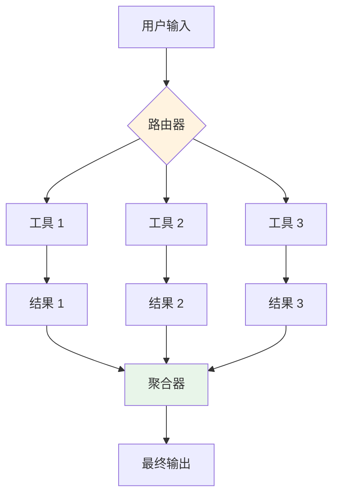

# 2. 工具编排

> **“工具编排的质量，比模型本身的质量更能决定智能体的可靠性。”**

工具编排是在生产级智能体中管理工具执行的艺术与科学。它不仅仅是调用工具，更关乎管理故障、优化性能、处理错误以及构建复杂的自动化工作流。

---

## 2.1 工具调用模式 (Tool Calling Patterns)

### 顺序执行 (Sequential Execution)

工具按顺序一个接一个地执行，每个工具的输出都可能成为下一个工具的输入。


**适用场景：**
- 工具之间存在依赖关系（如：先搜索 URL，再提取内容）。
- 执行顺序至关重要。
- 前期结果会直接影响后期的决策。

### 并行执行 (Parallel Execution)

同时执行多个独立的工具，以显著降低整体延迟。



**适用场景：**
- 工具之间相互独立。
- 响应性能是核心指标。
- 工具的预期延迟较为接近。

### 混合编排 (Hybrid Orchestration)

结合顺序与并行执行，以达到最优性能与逻辑严密性的平衡。

---

## 2.2 工具结果处理

### 结果校验 (Result Validation)

在使用工具输出之前，必须对其进行严格的有效性校验。

```java
@Service
public class ToolResultValidator {
    // 基础校验：非空检查、错误码检查
    // Schema 校验：确保返回数据符合预定义的 JSON 结构
    // 语义校验：利用 LLM 检查结果是否逻辑自洽且与问题相关
}
```

### 结果解析与归一化

将不同工具返回的多样化格式统一转换为智能体可理解的结构化数据。

---

## 2.3 重试策略 (Retry Strategies)

### 指数退避 (Exponential Backoff)

针对瞬时故障（如网络抖动、限流），采用逐步增加延迟的重试机制。

### 熔断器模式 (Circuit Breaker Pattern)

当某个工具持续报错时，暂时停止对其调用，防止系统资源被无效尝试耗尽，并给外部服务留出恢复时间。

---

## 2.4 MCP 集成

### MCP 服务管理
在生产环境中动态发现、初始化并监控基于 Model Context Protocol (MCP) 标准的工具集。

### MCP 工具调用
实现带有一致性错误处理机制的 MCP 工具远程过程调用 (RPC)。

---

## 2.5 工具组合 (Tool Composition)

### 工具链 (Tool Chains)
将多个工具逻辑绑定，形成可复用的执行单元。

### 工具流水线 (Tool Pipelines)
定义标准化的处理流程，如：研究流水线（搜索→提取→总结）、数据分析流水线（查询→转换→报告）。

---

## 2.6 核心要点总结

### 编排模式对比

| 模式 | 延迟 | 复杂度 | 典型用例 |
|---------|---------|------------|----------|
| **顺序执行** | 较高 | 较低 | 存在逻辑依赖的步骤 |
| **并行执行** | 极低 | 中等 | 独立的任务分发 |
| **混合编排** | 中等 | 较高 | 复杂的企业级流程 |

### 生产环境检查清单

- [ ] 对顺序执行实现了“失败即停”机制。
- [ ] 对并行执行配置了超时保护。
- [ ] 建立了统一的结果校验与解析层。
- [ ] 配置了带指数退避的重试逻辑。
- [ ] 为关键工具启用了熔断保护。
- [ ] 实现了 MCP 服务健康检查。
- [ ] 封装了常用的工具流水线。

---

## 2.7 下一步行动

**继续您的学习之旅：**
- → **[3. 状态管理](../state-management)** - 实现 Agent 状态的持久化与恢复
- → **[4. 错误处理与恢复](../error-handling)** - 高阶异常处理策略

---

:::tip 从简单顺序执行开始
建议先实现严谨的顺序执行逻辑，待错误处理机制完善后，再引入并行执行以提升性能。
:::

:::warning 监控工具性能
工具调用往往是 Agent 系统中最脆弱的一环。请务必监控各工具的成功率与响应时间，并设置性能退化告警。
:::

:::info 熔断器是资源防火墙
在工具不可用时，熔断器能有效避免无谓的资源浪费和延迟堆积。它是生产环境的必备组件。
:::
