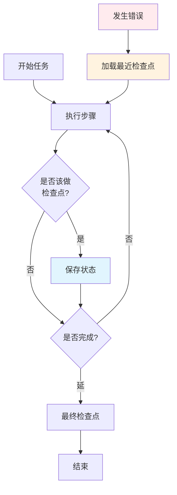

# 7. 生产环境模式

> **“生产级智能体需要能够扩展、恢复和协作的模式。这些模式源自真实世界的部署实践。”**

本节涵盖了构建可靠智能体系统且经过生产验证的模式。这些模式在实际部署中经受了考验，代表了 Harness 工程的最佳实践。

---

## 7.1 长时运行智能体模式 (Long-Running Agent Patterns)

### 检查点/恢复模式 (Checkpoint/Resume Pattern)

定期保存状态，并在故障后从检查点恢复，避免重复执行已完成的工作。



### 定期持久化模式 (Periodic Persistence Pattern)

不仅在检查点，还要以固定的时间间隔持久化状态，以将数据丢失风险降至最低。

### 事件驱动模式 (Event-Driven Agent Pattern)

智能体通过响应事件而不是轮询来运行，从而降低延迟并提高资源利用率。

---

## 7.2 多智能体协作 (Multi-Agent Coordination)

### 通信协议 (Communication Protocol)

为智能体间的交互定义标准化的消息格式。

```java
@Document(collection = "agent_messages")
public class AgentMessage {
    private String fromAgentId;
    private String toAgentId;
    private String messageType; // 消息类型，如 REQUEST, RESPONSE, ERROR
    private Map<String, Object> payload;
    private String correlationId; // 关联 ID，用于匹配请求与响应
}
```

### 共享上下文管理 (Shared Context Management)

在多个智能体实例之间协调全局状态，确保信息的一致性。

### 冲突解决 (Conflict Resolution)

当多个智能体试图同时修改共享状态时，采取预定义的解决策略：
- **先写者胜 (First-Write-Wins)**
- **后写者胜 (Last-Write-Wins)**
- **自动合并 (Merge)**
- **投票共识 (Vote)**
- **人工干预 (Escalate to Human)**

---

## 7.3 扩展模式 (Scaling Patterns)

### 水平扩展 (Horizontal Scaling)

在负载均衡器后运行多个智能体实例，以应对高并发请求。

### 负载均衡策略

- **轮询 (Round Robin)**
- **最少连接 (Least Connections)**
- **最短响应时间 (Least Response Time)**
- **一致性哈希 (Consistent Hashing)**：确保特定任务始终由同一实例处理。

---

## 7.4 案例研究 (Case Studies)

### 案例 1：研究智能体 (Research Agent)

**挑战**：构建一个能跨多个源（Google, arXiv, Wikipedia）研究课题并合成调查结果的智能体。
**方案**：采用管道式编排，并行执行网页搜索。
**成果**：将研究时间从 30 分钟缩短至 2 分钟，显著提升了信息合成的广度与质量。

### 案例 2：代码审查智能体 (Code Review Agent)

**挑战**：构建一个能审查 Pull Request 并提供反馈的智能体。
**方案**：针对长时运行的分析任务实现基于检查点的机制，逐个文件进行处理。
**成果**：成功处理包含 100+ 文件的复杂 PR，支持在故障后断点续传。

### 案例 3：客户服务智能体 (Customer Service Agent)

**挑战**：构建一个能跨多个系统处理客户查询的智能体。
**方案**：实现由协调员引导的多智能体系统，分发任务给专业子智能体（退款专家、订单专家等）。
**成果**：每日处理 50,000+ 查询，首跳解决率达到 95%，减少了 70% 的人工工作量。

---

## 7.5 核心要点总结

### 模式速查表

| 模式 | 适用场景 | 核心收益 |
|---------|----------|---------|
| **检查点/恢复** | 复杂且耗时的任务 | 故障后可恢复，不丢进度 |
| **定期持久化** | 有状态的智能体 | 防止内存意外丢失数据 |
| **事件驱动** | 响应式任务 | 降低延迟，提高并发 |

### 生产环境检查清单

- [ ] 对长任务实现了检查点/恢复机制。
- [ ] 采用事件驱动架构。
- [ ] 建立了多智能体间的标准通信协议。
- [ ] 具备冲突解决逻辑。
- [ ] 支持水平扩展与合理的负载均衡。

---

## 7.6 资源链接

### 推荐阅读
- [Anthropic: 构建高效智能体](https://www.anthropic.com/research/building-effective-agents)
- [OpenAI: Harness 工程实践](https://openai.com/index/harness-engineering/)
- [LangGraph 官方文档](https://langchain-ai.github.io/langgraph/)

---

:::tip 从简单起步
不要试图一次实现所有模式。先从检查点/恢复开始，随着业务复杂度的增加再引入更多协作模式。
:::

:::warning 重视大规模测试
在 10 个智能体下运行良好的模式，在 100 个时可能会崩溃。请务必按照预期的规模进行压力测试。
:::

:::info 监控是一切的基础
你无法优化你感知不到的东西。对于生产环境，全方位的监控与链路追踪是必不可少的。
:::
