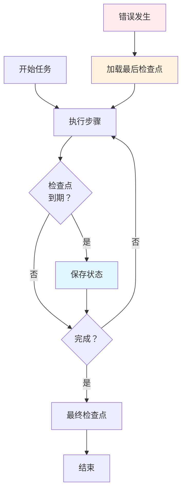

# 7. 生产模式

> **"生产代理需要可扩展、可恢复和可协调的模式。这些模式来自真实的部署实践。"**

本节涵盖经过生产测试的构建可靠代理系统的模式。这些模式已在真实部署中经过实战检验，代表了工程学的最佳实践。

---

## 7.1 长时间运行代理模式

### 检查点/恢复模式

定期保存状态，在失败后从检查点恢复。



```java
@Service
public class CheckpointResumePattern {

    @Autowired
    private CheckpointService checkpointService;

    public <T> T executeWithCheckpointing(
        String taskId,
        Function<CheckpointContext, T> task
    ) {
        // 尝试从检查点恢复
        Optional<Checkpoint> lastCheckpoint =
            checkpointService.loadLastCheckpoint(taskId);

        CheckpointContext context = lastCheckpoint
            .map(CheckpointContext::restore)
            .orElseGet(() -> new CheckpointContext(taskId));

        Instant lastCheckpointTime = Instant.now();

        try {
            T result = task.apply(context);

            // 最终检查点
            checkpointService.saveCheckpoint(
                context.createCheckpoint()
            );

            return result;

        } catch (Exception e) {
            // 失败前保存检查点
            checkpointService.saveCheckpoint(
                context.createCheckpointWithError(e)
            );
            throw e;

        } finally {
            // 定期检查点
            Duration elapsed = Duration.between(
                lastCheckpointTime,
                Instant.now()
            );

            if (elapsed.compareTo(Duration.ofMinutes(5)) > 0) {
                checkpointService.saveCheckpoint(
                    context.createCheckpoint()
                );
            }
        }
    }
}
```

### 定期持久化模式

定期持久化状态，而不仅仅是在检查点时。

```java
@Service
public class PeriodicPersistencePattern {

    @Autowired
    private StatePersistenceService persistenceService;

    @Scheduled(fixedRate = 60000) // 每分钟
    public void persistAllActiveStates() {
        List<AgentTask> activeTasks =
            taskRepository.findActiveTasks();

        for (AgentTask task : activeTasks) {
            try {
                AgentState state = stateManager.getState(task.getId());

                if (state != null) {
                    persistenceService.persist(state);
                    log.debug("持久化任务状态: {}", task.getId());
                }

            } catch (Exception e) {
                log.error("持久化任务状态失败: {}",
                    task.getId(), e);
            }
        }
    }
}
```

### 事件驱动代理模式

代理响应事件而不是轮询。

```java
@Service
public class EventDrivenAgentPattern {

    @Autowired
    private EventPublisher eventPublisher;

    @Autowired
    private AgentEventHandler eventHandler;

    public void executeEventDriven(
        String agentId,
        AgentTask task
    ) {
        // 订阅相关事件
        eventPublisher.subscribe(
            "agent." + agentId,
            event -> {
                try {
                    eventHandler.handleEvent(agentId, event);
                } catch (Exception e) {
                    log.error("事件处理程序失败", e);

                    // 发布错误事件
                    eventPublisher.publish(
                        "agent." + agentId + ".error",
                        AgentErrorEvent.builder()
                            .agentId(agentId)
                            .error(e)
                            .timestamp(Instant.now())
                            .build()
                    );
                }
            }
        );

        // 启动任务
        taskService.startTask(agentId, task);

        // 发布启动事件
        eventPublisher.publish(
            "agent." + agentId + ".started",
            AgentStartedEvent.builder()
                .agentId(agentId)
                .taskId(task.getId())
                .timestamp(Instant.now())
                .build()
        );
    }

    @Component
    public static class AgentEventHandler {

        @Autowired
        private TaskExecutor taskExecutor;

        public void handleEvent(
            String agentId,
            Event event
        ) {
            switch (event.getType()) {
                case "data_available":
                    taskExecutor.processData(agentId, event.getData());
                    break;

                case "tool_completed":
                    taskExecutor.continueFromTool(agentId, event.getResult());
                    break;

                case "human_feedback":
                    taskExecutor.incorporateFeedback(agentId, event.getFeedback());
                    break;

                case "shutdown":
                    taskExecutor.gracefulShutdown(agentId);
                    break;
            }
        }
    }
}
```

---

## 7.2 多代理协调

### 通信协议

代理通信的标准化消息格式。

```java
@Document(collection = "agent_messages")
public class AgentMessage {
    @Id
    private String id;

    private String fromAgentId;
    private String toAgentId;
    private String messageType;

    private Map<String, Object> payload;
    private Map<String, Object> metadata;

    private Instant timestamp;
    private String correlationId;
    private String replyTo;

    @Getter
    @Setter
    @Builder
    public static class Builder {
        // Builder 实现
    }
}

@Service
public class AgentCommunicationService {

    @Autowired
    private MessageBroker messageBroker;

    public void send(
        String fromAgentId,
        String toAgentId,
        String messageType,
        Map<String, Object> payload
    ) {
        AgentMessage message = AgentMessage.builder()
            .id(UUID.randomUUID().toString())
            .fromAgentId(fromAgentId)
            .toAgentId(toAgentId)
            .messageType(messageType)
            .payload(payload)
            .timestamp(Instant.now())
            .correlationId(UUID.randomUUID().toString())
            .build();

        messageBroker.publish("agent." + toAgentId, message);
    }

    public void sendAndAwaitResponse(
        String fromAgentId,
        String toAgentId,
        String messageType,
        Map<String, Object> payload,
        Duration timeout
    ) {
        String replyTo = "agent." + fromAgentId + ".responses";

        AgentMessage message = AgentMessage.builder()
            .id(UUID.randomUUID().toString())
            .fromAgentId(fromAgentId)
            .toAgentId(toAgentId)
            .messageType(messageType)
            .payload(payload)
            .replyTo(replyTo)
            .timestamp(Instant.now())
            .correlationId(UUID.randomUUID().toString())
            .build();

        // 发送消息
        messageBroker.publish("agent." + toAgentId, message);

        // 等待响应
        return messageBroker.waitForResponse(
            replyTo,
            message.getCorrelationId(),
            timeout
        );
    }

    public void subscribe(
        String agentId,
        Consumer<AgentMessage> handler
    ) {
        messageBroker.subscribe(
            "agent." + agentId,
            handler
        );
    }
}
```

### 共享上下文管理

跨多个代理协调状态。

```java
@Service
public class SharedContextService {

    @Autowired
    private RedisTemplate<String, Object> redisTemplate;

    public void put(
        String contextId,
        String key,
        Object value
    ) {
        String contextKey = "context:" + contextId;
        redisTemplate.opsForHash().put(contextKey, key, value);
    }

    public <T> T get(
        String contextId,
        String key,
        Class<T> type
    ) {
        String contextKey = "context:" + contextId;
        Object value = redisTemplate.opsForHash().get(contextKey, key);

        if (value != null) {
            return type.cast(value);
        }

        return null;
    }

    public Map<String, Object> getAll(String contextId) {
        String contextKey = "context:" + contextId;
        return redisTemplate.opsForHash().entries(contextKey);
    }

    public void watch(
        String contextId,
        String key,
        Consumer<Object> onChange
    ) {
        // 实现 Redis pub/sub 用于变更通知
        String channel = "context:" + contextId + ":" + key;

        redisTemplate.getConnectionFactory()
            .getConnection()
            .subscribe(new MessageListener() {
                @Override
                public void onMessage(Message message, byte[] pattern) {
                    String newValue = new String(message.getBody());
                    onChange.accept(newValue);
                }
            }, channel);
    }
}
```

### 冲突解决

处理多个代理想要修改共享状态时的冲突。

```java
@Service
public class ConflictResolutionService {

    public enum ConflictStrategy {
        FIRST_WRITE_WINS,
        LAST_WRITE_WINS,
        MERGE,
        VOTE,
        ESCALATE_TO_HUMAN
    }

    public <T> T resolveConflict(
        String contextId,
        String key,
        List<T> conflictingValues,
        ConflictStrategy strategy
    ) {
        switch (strategy) {
            case FIRST_WRITE_WINS:
                return conflictingValues.get(0);

            case LAST_WRITE_WINS:
                return conflictingValues.get(conflictingValues.size() - 1);

            case MERGE:
                return mergeValues(conflictingValues);

            case VOTE:
                return voteOnValue(conflictingValues);

            case ESCALATE_TO_HUMAN:
                return escalateToHuman(contextId, key, conflictingValues);

            default:
                throw new IllegalArgumentException(
                    "未知冲突策略: " + strategy
                );
        }
    }

    private <T> T mergeValues(List<T> values) {
        // 根据值类型实现合并逻辑
        // 这是简化示例
        if (values.get(0) instanceof Map) {
            Map<String, Object> merged = new HashMap<>();

            for (T value : values) {
                merged.putAll((Map<String, Object>) value);
            }

            return (T) merged;
        }

        // 默认：返回第一个值
        return values.get(0);
    }

    private <T> T voteOnValue(List<T> values) {
        // 找出最常见的值
        Map<T, Integer> counts = new HashMap<>();

        for (T value : values) {
            counts.merge(value, 1, Integer::sum);
        }

        return counts.entrySet().stream()
            .max(Map.Entry.comparingByValue())
            .map(Map.Entry::getKey)
            .orElse(values.get(0));
    }

    private <T> T escalateToHuman(
        String contextId,
        String key,
        List<T> conflictingValues
    ) {
        // 请求人工干预
        HumanInterventionRequest request =
            HumanInterventionRequest.builder()
                .type("CONFLICT_RESOLUTION")
                .context(Map.of(
                    "contextId", contextId,
                    "key", key,
                    "conflictingValues", conflictingValues
                ))
                .build();

        return humanInterventionService.requestResolution(request);
    }
}
```

---

## 7.3 扩展模式

### 水平扩展

在负载均衡器后运行多个代理实例。

```java
@Service
public class HorizontalScalingPattern {

    @Autowired
    private AgentInstanceManager instanceManager;

    @Autowired
    private LoadBalancer loadBalancer;

    public void scaleHorizontally(
        String agentType,
        int targetInstances
    ) {
        List<AgentInstance> currentInstances =
            instanceManager.getInstances(agentType);

        int currentCount = currentInstances.size();

        if (currentCount < targetInstances) {
            // 扩容
            int toAdd = targetInstances - currentCount;

            for (int i = 0; i < toAdd; i++) {
                AgentInstance instance =
                    instanceManager.spawnInstance(agentType);

                loadBalancer.register(instance);
            }

        } else if (currentCount > targetInstances) {
            // 缩容
            int toRemove = currentCount - targetInstances;

            for (int i = 0; i < toRemove; i++) {
                AgentInstance instance =
                    selectInstanceToRemove(currentInstances);

                loadBalancer.deregister(instance);
                instanceManager.shutdown(instance);
            }
        }
    }

    private AgentInstance selectInstanceToRemove(
        List<AgentInstance> instances
    ) {
        // 选择负载最小的实例
        return instances.stream()
            .min(Comparator.comparing(AgentInstance::getLoad))
            .orElse(instances.get(0));
    }
}
```

### 负载均衡策略

```java
@Service
public class AgentLoadBalancer {

    private enum LoadBalancingStrategy {
        ROUND_ROBIN,
        LEAST_CONNECTIONS,
        LEAST_RESPONSE_TIME,
        CONSISTENT_HASHING
    }

    public AgentInstance selectInstance(
        List<AgentInstance> instances,
        LoadBalancingStrategy strategy,
        String taskId
    ) {
        return switch (strategy) {
            case ROUND_ROBIN -> roundRobinSelect(instances);

            case LEAST_CONNECTIONS ->
                leastConnectionsSelect(instances);

            case LEAST_RESPONSE_TIME ->
                leastResponseTimeSelect(instances);

            case CONSISTENT_HASHING ->
                consistentHashingSelect(instances, taskId);
        };
    }

    private AgentInstance roundRobinSelect(List<AgentInstance> instances) {
        AtomicInteger counter = new AtomicInteger(0);
        int index = counter.getAndIncrement() % instances.size();
        return instances.get(index);
    }

    private AgentInstance leastConnectionsSelect(
        List<AgentInstance> instances
    ) {
        return instances.stream()
            .min(Comparator.comparing(AgentInstance::getConnections))
            .orElse(instances.get(0));
    }

    private AgentInstance leastResponseTimeSelect(
        List<AgentInstance> instances
    ) {
        return instances.stream()
            .min(Comparator.comparing(AgentInstance::getAverageResponseTime))
            .orElse(instances.get(0));
    }

    private AgentInstance consistentHashingSelect(
        List<AgentInstance> instances,
        String taskId
    ) {
        // 哈希任务 ID 以选择实例
        int hash = taskId.hashCode();
        int index = Math.abs(hash) % instances.size();
        return instances.get(index);
    }
}
```

### 资源优化

跨代理实例优化资源使用。

```java
@Service
public class ResourceOptimizationService {

    @Autowired
    private MetricsCollector metricsCollector;

    @Scheduled(fixedRate = 60000) // 每分钟
    public void optimizeResources() {
        // 从所有实例收集指标
        List<InstanceMetrics> metrics =
            metricsCollector.collectMetrics();

        // 识别未充分利用的实例
        List<AgentInstance> underutilized =
            findUnderutilizedInstances(metrics);

        // 识别过载的实例
        List<AgentInstance> overloaded =
            findOverloadedInstances(metrics);

        // 做扩缩容决策
        if (!overloaded.isEmpty()) {
            log.info("因过载实例而扩容");
            scaleUp(overloaded.size());
        }

        if (!underutilized.isEmpty() &&
            canScaleDown(underutilized.size())) {
            log.info("因未充分利用实例而缩容");
            scaleDown(underutilized.size());
        }
    }

    private List<AgentInstance> findUnderutilizedInstances(
        List<InstanceMetrics> metrics
    ) {
        return metrics.stream()
            .filter(m -> m.getCpuUsage() < 0.2)
            .filter(m -> m.getMemoryUsage() < 0.3)
            .filter(m -> m.getTaskQueueSize() < 5)
            .map(InstanceMetrics::getInstance)
            .toList();
    }

    private List<AgentInstance> findOverloadedInstances(
        List<InstanceMetrics> metrics
    ) {
        return metrics.stream()
            .filter(m -> m.getCpuUsage() > 0.8)
            .filter(m -> m.getTaskQueueSize() > 50)
            .map(InstanceMetrics::getInstance)
            .toList();
    }
}
```

---

## 7.4 案例研究

### 案例 1：研究代理

**挑战**：构建一个能够跨多个来源研究主题并综合发现的代理。

**解决方案**：实现了带有并行网络搜索的管道式编排。

```java
@Service
public class ResearchAgent {

    public ResearchResult research(String topic) {
        // 第 1 阶段：跨多个来源并行搜索
        List<ToolCall> searchCalls = List.of(
            ToolCall.builder()
                .toolName("web_search")
                .arg("query", topic)
                .arg("source", "google")
                .build(),
            ToolCall.builder()
                .toolName("web_search")
                .arg("query", topic)
                .arg("source", "arxiv")
                .build(),
            ToolCall.builder()
                .toolName("web_search")
                .arg("query", topic)
                .arg("source", "wikipedia")
                .build()
        );

        Map<String, ToolResult> searchResults =
            parallelOrchestrator.executeParallel(
                searchCalls,
                Duration.ofSeconds(30)
            );

        // 第 2 阶段：从每个来源提取内容
        List<ToolCall> extractCalls = searchResults.values().stream()
            .map(result -> ToolCall.builder()
                .toolName("extract_content")
                .arg("url", result.getData())
                .build())
            .toList();

        List<ToolResult> extractedContent =
            sequentialOrchestrator.execute(
                extractCalls,
                context
            );

        // 第 3 阶段：综合发现
        String synthesis = llmClient.generate("""
            综合以下研究发现：
            {content}

            提供全面摘要，包含：
            1. 关键主题
            2. 重要发现
            3. 矛盾信息
            4. 引用的来源
            """.formatted(
                "content",
                extractedContent.stream()
                    .map(ToolResult::getData)
                    .collect(Collectors.joining("\n\n"))
            )
        );

        return ResearchResult.builder()
            .topic(topic)
            .synthesis(synthesis)
            .sources(searchResults)
            .build();
    }
}
```

**结果**：
- 将研究时间从 30 分钟减少到 2 分钟
- 通过多个来源提高了综合质量
- 成功处理了 10,000+ 个研究查询

### 案例 2：代码审查代理

**挑战**：构建一个能够审查拉取请求并提供反馈的代理。

**解决方案**：为长时间分析实现了基于检查点的方法。

```java
@Service
public class CodeReviewAgent {

    public ReviewResult review(String prUrl) {
        return checkpointService.executeWithCheckpointing(
            prUrl,
            context -> {
                // 第 1 步：获取 PR 差异
                String diff = fetchDiff(prUrl, context);

                // 第 2 步：分析每个文件
                List<FileAnalysis> analyses = new ArrayList<>();
                List<String> files = parseFiles(diff);

                for (String file : files) {
                    FileAnalysis analysis = analyzeFile(file, context);
                    analyses.add(analysis);

                    // 每个文件后检查点
                    if (context.shouldCheckpoint()) {
                        context.checkpoint();
                    }
                }

                // 第 3 步：生成整体审查
                Review review = generateReview(analyses);

                return ReviewResult.builder()
                    .prUrl(prUrl)
                    .review(review)
                    .fileAnalyses(analyses)
                    .build();
            }
        );
    }

    private FileAnalysis analyzeFile(
        String file,
        CheckpointContext context
    ) {
        // 检查是否已分析
        if (context.hasCompleted(file)) {
            return context.getResult(file);
        }

        // 分析文件
        FileAnalysis analysis = performAnalysis(file);

        context.markCompleted(file, analysis);
        return analysis;
    }
}
```

**结果**：
- 处理了包含 100+ 文件的 PR
- 从故障中恢复而不丢失进度
- 将审查时间减少了 60%

### 案例 3：客户服务代理

**挑战**：构建一个能够跨多个系统处理客户查询的代理。

**解决方案**：实现了带有专业子代理的多代理系统。

```java
@Service
public class CustomerServiceAgent {

    @Autowired
    private AgentCommunicationService commService;

    public CustomerResponse handleQuery(CustomerQuery query) {
        // 路由到适当的专家
        String specialistType = routeQuery(query);

        AgentMessage response = commService.sendAndAwaitResponse(
            "coordinator",
            specialistType,
            "handle_customer_query",
            Map.of(
                "query", query,
                "customerId", query.getCustomerId()
            ),
            Duration.ofMinutes(5)
        );

        return parseResponse(response);
    }

    private String routeQuery(CustomerQuery query) {
        // 简单的路由逻辑
        if (query.getText().toLowerCase().contains("refund")) {
            return "refund_specialist";
        } else if (query.getText().toLowerCase().contains("order")) {
            return "order_specialist";
        } else if (query.getText().toLowerCase().contains("account")) {
            return "account_specialist";
        } else {
            return "general_specialist";
        }
    }
}

@Service
public class RefundSpecialistAgent {

    @Autowired
    private AgentCommunicationService commService;

    @PostConstruct
    public void init() {
        // 订阅消息
        commService.subscribe("refund_specialist", this::handleMessage);
    }

    private void handleMessage(AgentMessage message) {
        if ("handle_customer_query".equals(message.getMessageType())) {
            CustomerQuery query = (CustomerQuery) message.getPayload().get("query");

            // 处理退款请求
            RefundResult result = processRefund(query);

            // 发送响应
            commService.send(
                "refund_specialist",
                message.getFromAgentId(),
                "refund_response",
                Map.of(
                    "result", result,
                    "correlationId", message.getCorrelationId()
                )
            );
        }
    }

    private RefundResult processRefund(CustomerQuery query) {
        // 检查退款资格
        if (!checkEligibility(query)) {
            return RefundResult.denied("不符合退款条件");
        }

        // 计算退款金额
        BigDecimal amount = calculateRefund(query);

        // 处理退款（超过阈值需要批准）
        if (amount.compareTo(new BigDecimal("100")) > 0) {
            return requestApproval(query, amount);
        }

        return executeRefund(query, amount);
    }
}
```

**结果**：
- 每天处理 50,000+ 个查询
- 95% 首次接触解决率
- 将人工代理工作量减少了 70%

---

## 7.5 关键要点

### 长时间运行代理

| 模式 | 用途 | 优势 |
|------|------|------|
| **检查点/恢复** | 复杂任务 | 从故障中恢复 |
| **定期持久化** | 有状态代理 | 防止数据丢失 |
| **事件驱动** | 反应式代理 | 减少延迟 |

### 多代理协调

- **标准化协议**：清晰的消息格式
- **共享上下文**：协调的状态
- **冲突解决**：处理竞争性操作

### 扩展

- **水平扩展**：添加更多实例
- **负载均衡**：分配工作
- **资源优化**：正确调整部署规模

### 生产清单

- [ ] 长任务的检查点/恢复
- [ ] 事件驱动架构
- [ ] 多代理通信
- [ ] 冲突解决
- [ ] 水平扩展
- [ ] 负载均衡
- [ ] 资源优化

---

## 7.6 资源

### 学习更多

- [Anthropic 的构建有效代理](https://www.anthropic.com/research/building-effective-agents)
- [OpenAI 的工程学](https://openai.com/index/harness-engineering/)
- [LangGraph 文档](https://langchain-ai.github.io/langgraph/)
- [代理协议规范](https://agentprotocol.ai/)

### 工具与框架

- **LangGraph**：多代理编排
- **LangSmith**：代理可观察性
- **Spring AI**：Java 代理框架
- **MCP**：标准化工具协议

---

:::tip 从简单开始
不要一次性实现所有模式。先从检查点/恢复开始，然后根据需要添加复杂性。
:::

:::warning 规模测试
适用于 10 个代理的模式可能在 100 个代理时失败。始终在预期规模上测试。
:::

:::info 监控一切
你无法优化你测量的东西。全面监控对生产代理至关重要。
:::