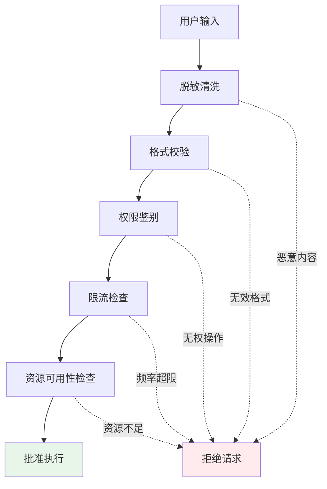

# 6. 安全与护栏

> **“信任源于安全。护栏是区分实验性智能体与生产级系统的关键标志。”**

安全护栏是防止智能体造成伤害的多层保护体系。它们贯穿执行的每一个阶段 —— 之前、期间和之后 —— 以确保智能体始终在定义的边界内运行。

---

## 6.1 执行前校验 (Pre-execution Checks)

### 输入验证流

### 核心检查项
- **输入脱敏**：移除个人敏感信息 (PII) 和潜在的提示词注入 (Prompt Injection) 代码。
- **权限校验**：确保用户有权执行特定的智能体操作或调用特定的工具。
- **资源可用性**：检查当前 Token 配额、API 限流状态及后端服务的健康状况。

---

## 6.2 运行时约束 (Runtime Constraints)

### 严格的资源配额
- **Token 限制**：为每个任务、甚至每次工具调用设置硬性的 Token 消耗上限。
- **时间限制**：设置任务最大运行总时长，防止智能体因陷入逻辑死循环而无休止运行。
- **工具调用频率**：限制在单位时间内调用特定昂贵工具（如搜索、深度推理模型）的次数。

---

## 6.3 执行后验证 (Post-execution Validation)

### 输出清洗
在答案返回给用户前，再次扫描输出内容，移除任何意外生成的敏感数据或恶意链接。

### 结果核实 (Result Verification)
利用比执行模型更强的 LLM（作为裁判）对生成的答案进行一致性与合规性检查，确保回答没有偏离原始指令。

---

## 6.4 人工监督 (Human Oversight)

### 审批工作流
对于高风险操作（如删除数据库记录、发送真实邮件），必须触发人工审批流程，由人类管理员在后台确认后方可执行。

### 紧急制动 (Emergency Stop)
建立全局的“红按钮”机制，在发现异常行为时，运维人员能瞬间终止所有或特定智能体的执行任务。

---

## 6.5 核心要点总结

### 多层防御体系

| 层次 | 目的 | 示例 |
|-------|---------|---------|
| **执行前** | 防患于未然 | 提示词注入检测、权限审计 |
| **运行时** | 控制损耗 | 步数上限、Token 预算控制 |
| **执行后** | 确保质量 | 幻觉检测、结果正确性验证 |
| **人工层** | 最终屏障 | 关键操作双人审批、紧急制动 |

### 生产环境检查清单

- [ ] 实现了输入端的 PII 脱敏与注入过滤。
- [ ] 建立了基于角色的智能体访问控制 (RBAC)。
- [ ] 为所有异步任务配置了超时与重试上限。
- [ ] 引入了执行后结果校验逻辑。
- [ ] 对敏感操作集成了人工审批界面。
- [ ] 具备一键终止运行任务的能力。

---

## 6.6 下一步行动

**继续您的学习之旅：**
- → **[7. 生产环境模式](../patterns)** - 真实世界的实现模式

---

:::tip 深度防御
采用多层保护机制。每一层都应该能够独立运作，形成互补的防御矩阵。
:::

:::warning 假定防御会被突破
设计系统时要假定任何一层防御都可能失效。如果验证环节漏掉了一个恶意请求，后续的运行时约束能否兜底？
:::

:::info 人工监督不可或缺
即使自动化护栏再完善，人工监督仍然是生产级系统不可或缺的最后一道防线。
:::
