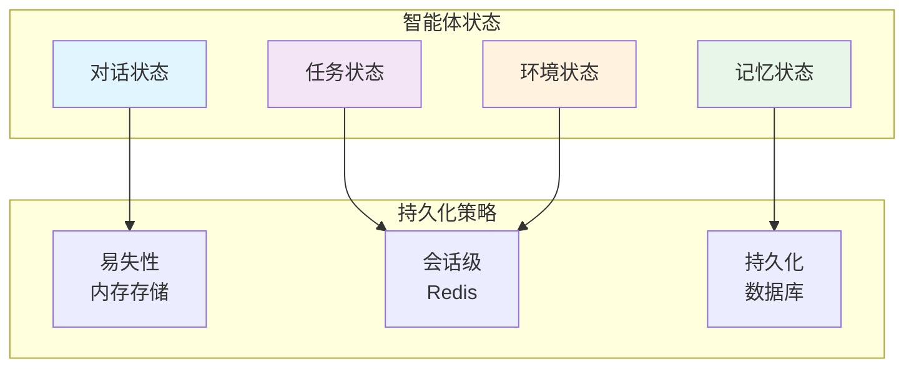
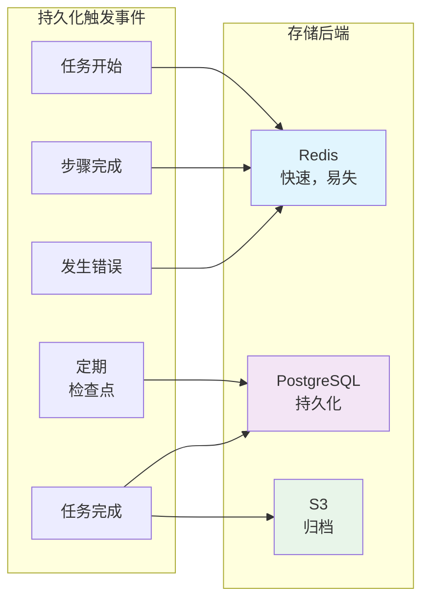

# 3. 状态管理

> **“状态是智能体的记忆。没有完善的状态管理，智能体就无法学习、恢复或持续改进。”**

状态管理是指在执行过程中捕获、持久化和恢复智能体状态的实践。它使智能体能够从故障中恢复，在长时运行的工作流中保持上下文，并在多个智能体实例之间进行协作。

---

## 3.1 智能体状态类型

### 状态分类法



### 对话状态 (Conversation State)

记录对话历史与上下文。

```java
@Document(collection = "conversation_state")
public class ConversationState {
    @Id
    private String id;

    private String agentId;
    private String userId;
    private String sessionId;

    private List<Message> messages;
    private Map<String, Object> context;
    private Map<String, Object> metadata;

    private Instant createdAt;
    private Instant updatedAt;

    @Getter
    @Setter
    public static class Message {
        private String role;      // user, assistant, system, tool
        private String content;
        private Instant timestamp;
        private Map<String, Object> metadata;
    }
}
```

### 任务状态 (Task State)

记录任务的当前进度与状态。

```java
@Document(collection = "task_state")
public class TaskState {
    @Id
    private String id;

    private String agentId;
    private String taskId;
    private String userId;

    private TaskStatus status;
    private String currentStep;
    private List<String> completedSteps;

    private Map<String, Object> inputData;
    private Map<String, Object> outputData;
    private Map<String, Object> intermediateData;

    private ErrorInfo lastError;
    private int retryCount;

    public enum TaskStatus {
        PENDING,       // 待处理
        IN_PROGRESS,   // 进行中
        BLOCKED,       // 已阻塞
        COMPLETED,     // 已完成
        FAILED,        // 已失败
        CANCELLED      // 已取消
    }
}
```

### 记忆状态 (Memory State)

记录习得的信息与知识。

```java
@Document(collection = "memory_state")
public class MemoryState {
    @Id
    private String id;

    private String agentId;
    private String userId;

    private Map<String, Object> facts;           // 实体记忆（事实）
    private List<Memory> episodicMemories;       // 情节记忆（过往经历）
    private Map<String, Object> semanticMemory;  // 语义记忆（知识）

    @Getter
    @Setter
    public static class Memory {
        private String id;
        private String type;
        private String content;
        private Map<String, Object> metadata;
        private Instant timestamp;
        private double importance;  // 重要程度评分 0-1
    }
}
```

---

## 3.2 持久化策略

### 何时进行持久化



---

## 3.3 状态恢复 (State Recovery)

### 检查点机制 (Checkpointing)

在长时间运行的任务中定期保存状态。

```java
@Service
public class CheckpointService {
    // 定期保存任务快照，以便在系统崩溃后能从最近的断点恢复，而不是从头开始
    private static final Duration CHECKPOINT_INTERVAL = Duration.ofMinutes(5);

    public void saveCheckpoint(CheckpointContext context) {
        // 将状态保存至 Redis 实现极速恢复，同时定期备份至 DB 保证持久性
    }
}
```

### 故障恢复 (Resume from Failure)

在发生错误后自动恢复状态并继续执行。

```java
@Service
public class StateRecoveryService {
    // 检查任务状态，如果是 FAILED 且未超过最大重试次数，则加载最近的检查点并尝试重新启动
    public AgentResult resumeOrExecute(String taskId, Supplier<AgentResult> task) {
        // 恢复逻辑实现...
    }
}
```

---

## 3.4 分布式状态 (Distributed State)

### 多智能体协作

在多个智能体实例之间共享状态。

```java
@Service
public class DistributedStateService {
    // 使用 Redis Pub/Sub 发布状态更新，确保所有相关智能体都能感知全局变化
    public void publishStateUpdate(String agentId, String key, Object value) {
        // 发布逻辑...
    }
}
```

### 分布式锁 (Distributed Locks)

在多智能体竞争资源的场景下防止竞态条件。

```java
@Service
public class DistributedLockService {
    // 使用 Redis 实现分布式锁，确保同一时间只有一个智能体能操作特定的关键资源
    public Optional<Lock> acquireLock(String resourceId, Duration timeout) {
        // 加锁逻辑...
    }
}
```

---

## 3.5 核心要点总结

### 状态类型对比

| 类型 | 用途 | 存储介质 | 存续时长 |
|------|---------|---------|----------|
| **对话状态** | 交流历史 | Redis | 数小时 |
| **任务状态** | 任务进度 | PostgreSQL | 数天 |
| **记忆状态** | 习得知识 | PostgreSQL | 永久 |

### 持久化建议

- **Redis**: 适用于追求极速响应、会话级的易失性状态。
- **PostgreSQL**: 适用于需要强一致性保证、长期留存的任务与记忆。
- **S3**: 适用于已完成任务的日志归档与冷数据存储。

### 恢复模式

```
执行 (Execute) → 设点 (Checkpoint) → 出错 (Error) → 还原 (Restore) → 续传 (Resume)
```

---

## 3.6 下一步行动

**继续您的学习之旅：**
- → **[4. 错误处理与恢复](../error-handling)** - 高级异常处理策略
- → **[5. 可观测性](../observability)** - 监控与链路追踪

---

:::tip 勤做检查点
检查点做得越勤，故障时丢失的工作量就越少。请在检查点频率与系统开销之间寻找平衡。
:::

:::warning 务必测试恢复流程
不要假设状态恢复机制一定是有效的。建议定期通过在执行中途杀掉进程的方式来实战测试。
:::

:::info 善用过期时间 (TTL)
为易失性状态设置 TTL，防止内存泄露。并非所有的状态都需要永久保存。
:::
