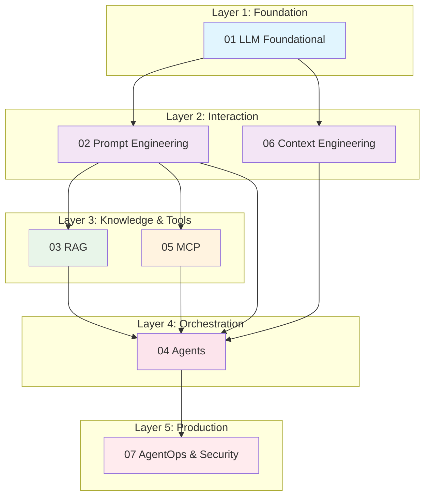

# AI Agent 工程手册

> **"最优秀的 AI 工程师既理解模型，也理解工程。"**

本知识库构建了从 LLM 基础到生产级 AI Agent 系统的完整技术闭环。

## 核心公式

```
Agent = Model（大脑）+ Prompt（指令）+ Memory（RAG/上下文）+ Tools（MCP）+ Planning（架构）
```

---

## 1. 系统架构概览

下图展示了 7 个模块之间的逻辑依赖关系：



**模块之间的连接关系：**

- **LLM 基础**提供计算和推理基础
- **Prompt 与 Context**是与模型交互的媒介
- **RAG**为模型提供静态知识支持
- **MCP**为模型提供动态工具支持
- **Agents**编排和协调以上所有组件
- **Ops 与安全**贯穿整个生命周期

---

## 2. 模块概要

| ID | 模块 | 一句话定义 | 关键技术与关键词 |
|----|--------|---------------------|----------------------------|
| **01** | LLM 基础 | 理解"大脑"机制、训练流程和物理限制 | Transformer、Attention、预训练、RLHF、Tokenization、推理参数（Temp/Top-P）|
| **02** | Prompt Engineering | 编写"指令代码"以引导推理和标准化输出格式 | Chain-of-Thought（CoT）、Few-shot、ReAct、XML/JSON 输出、Persona |
| **03** | RAG | 用外部"图书馆"增强模型，解决幻觉并注入私有数据 | 向量数据库、Embeddings、Chunking、混合搜索、Grounding、Self-Querying |
| **04** | Agents | 从"对话"进化为"行动"，具备规划、反思和工具使用能力 | 编排、循环控制、反思、路由器、多 Agent（监督者/层级式）|
| **05** | MCP | Model Context Protocol——标准化 AI 连接（USB-C），解耦模型与工具 | Host/Client/Server、Resources、Tools、Prompts、JSON-RPC、Stdio/SSE |
| **06** | Context Engineering | 管理模型"注意力"窗口和长期/短期记忆，防止过载 | KV Cache、Context Window、短期/长期记忆、信息压缩 |
| **07** | AgentOps 与安全 | 将 Demo 转化为生产应用，确保安全性、可观测性和评估 | Eval（LLM-as-a-Judge）、Prompt 注入、Docker 部署、Tracing |

---

## 3. 学习路径

根据你的开发目标选择路径。

### 实践者路径（开发者）

**目标：** 快速构建一个能访问网络和查询数据库的 Java AI Agent。

**推荐顺序：**

1. **05 MCP**：先理解如何编写一个工具（Server）
2. **04 Agents**：学习如何让模型调用这个工具
3. **02 Prompt**：优化指令以获得更准确的调用
4. **07 Ops**：部署到 Docker（参考 Brave Search 案例）

**重点：** 快速迭代、可运行代码、生产部署

### 架构师路径（架构师/研究者）

**目标：** 设计复杂的企业级多 Agent 系统。

**推荐顺序：**

1. **01 基础**：理解模型能力边界
2. **04 Agents**：设计多 Agent 协作模式
3. **06 Context**：设计支持长工作流的记忆系统
4. **03 RAG**：规划企业知识库集成

**重点：** 系统设计、可扩展性模式、架构权衡

---

## 4. 快速参考

常见任务的必备资源——无需深入文档。

### 标准 Agent 系统 Prompt 模板

[查看模板指南](./prompt-engineering/)

### MCP Server 标准代码结构（Java/Spring）

[查看 Java 实现指南](./spring-ai/)

### RAG 分块策略速查表

[查看 RAG 优化指南](./rag/)

### 推荐 LLM 参数

| 参数 | 保守型 | 创意型 | 编程型 |
|-----------|-------------|----------|--------|
| **Temperature** | 0.0 - 0.3 | 0.7 - 1.0 | 0.1 - 0.2 |
| **Top-P** | 0.9 | 0.95 | 0.9 |
| **Max Tokens** | 1024 | 2048 | 4096 |
| **Frequency Penalty** | 0.0 | 0.3 | 0.0 |

---

## 5. 导航指南

### 核心模块

- **[LLM 基础](./llm-fundamentals/)** - Transformer 架构、训练、推理、限制
- **[Prompt Engineering](./prompt-engineering/)** - CoT、Few-shot、ReAct 模式、输出格式化
- **[RAG](./rag/)** - 向量数据库、Embeddings、检索策略、Grounding
- **[Agents](./agents/)** - 编排、多 Agent 系统、规划、反思
- **[MCP](./mcp/)** - 协议规范、Server 实现、工具、资源
- **[Context Engineering](./context-engineering/)** - 上下文窗口、记忆系统、优化
- **[AgentOps 与安全](./agentops-security/)** - 部署、监控、安全、事件响应

### 附加资源

- **[Java & AI 实习指南](./internship/)** - 职业发展、实践技能

---

## 6. 关键概念速览

### Token 经济学

- **1 个 token** ≈ 0.75 个英文单词 ≈ 4 个字符
- **Context window（上下文窗口）** = 每次请求的最大 token 数（因模型而异）
- **KV cache** = 缓存之前的 token 以加速生成

### RAG 流水线

```
Query -> Embedding -> 向量搜索 -> 上下文组装 -> LLM -> 响应
```

### Agent 决策循环

```
观察 -> 推理 -> 行动 -> 观察 -> 推理 -> 行动 ...
```

### MCP 连接模型

```
Host（应用）<-> Client（协议）<-> Server（工具/数据）
```

---

## 7. 常见模式

### 模式一：ReAct Agent

```
Thought: [分析情况]
Action: [调用工具]
Observation: [查看结果]
Thought: [规划下一步]
Action: [继续或结束]
```

### 模式二：路由 Agent

```
分类查询 -> 路由到专家 Agent -> 聚合结果
```

### 模式三：层级式 Agent

```
主管 Agent -> 工作 Agent -> 汇报 -> 综合
```

---

## 8. 生产清单

部署到生产环境之前：

- [ ] 所有工具都有适当的错误处理
- [ ] 敏感操作需要人工审批
- [ ] 已启用全面的审计日志
- [ ] 已实现并测试了紧急停止开关
- [ ] 已配置速率限制
- [ ] 已设置成本控制
- [ ] 监控仪表板已激活
- [ ] 已记录事件响应流程
- [ ] 安全审查已完成
- [ ] 已进行负载测试

---

:::tip 开始使用
AI 工程新手？从 **[LLM 基础](./llm-fundamentals/)** 开始理解模型工作原理，然后进入 **[Prompt Engineering](./prompt-engineering/)** 学习有效的提示模式。
:::

:::info Java 开发者
如果你使用 Spring Boot 构建 AI 应用，请查看 **[MCP](./mcp/)** 了解标准化工具集成，以及 **[AgentOps](./agentops-security/)** 了解生产部署模式。
:::
