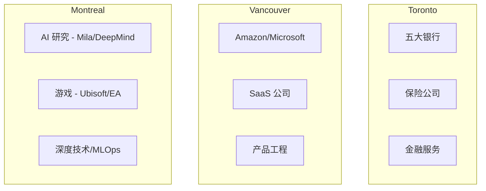
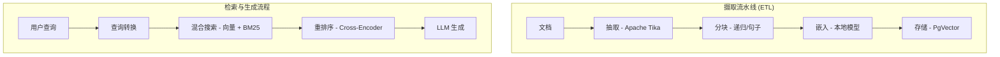
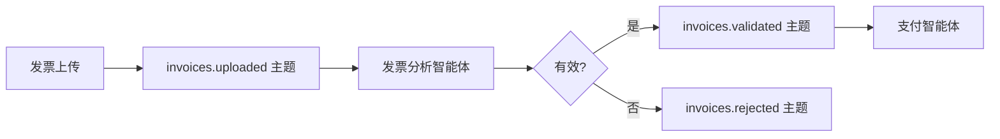

# 战略技术职业路线图：2026 年加拿大 Java & AI 实习全景

> **"通用技能的时代已经结束。掌握企业级 Java 与智能体 AI 的交汇点。"**

---

## 1. 宏观战略环境：加拿大 2026 年科技劳动力市场

加拿大科技行业在 2026 年已从投机增长定义的阶段成熟为以工程效率和合规监管为特征的阶段。对于国际计算机科学本科生而言，环境呈现两极分化：虽然对通才型初级开发者的总体需求因自动化和经济整合而有所减弱，但对 **"AI 原生后端工程师"**——能够将大语言模型（LLM）编织到企业级 Java 系统刚性框架中的人才——的需求已达到极度稀缺的拐点。

本报告对这个细分领域提供深度分析。它超越通用职业建议，提供一个细粒度、基于证据的路线图，帮助你在加拿大移民政策、企业架构和不断演变的技术面试考验的交汇点中导航。

### 1.1 移民与工作授权悖论

2026 年国际学生面临的最大非技术障碍是由加拿大移民、难民和公民部（IRCC）管理的不断演变的监管框架。在 2024 年引入的招生上限和 2026-2028 年移民水平计划的固化下，学习许可的绝对数量有所减少，2026 年稳定在约 **408,000 份** 许可。

雇主，尤其是大型跨国公司之外的雇主，常常在招聘国际学生的行政负担方面存在模糊认识。一个普遍的误解是将"国际学生"等同于"LMIA（劳动力市场影响评估）责任"。然而，**Co-op 实习明确豁免** 于此要求。

:::tip 工作授权筛选的战略话术
清晰表达 LMIA 要求和 Co-op 豁免之间的区别与技术能力同等重要。
:::

#### 表 1：工作授权筛选的战略话术

| 雇主关注 / 问题 | "高摩擦"回答（避免） | "零风险"战略回答（推荐） |
|-----------------|---------------------|------------------------|
| **"你在加拿大有合法工作授权吗？"** | "没有，但我可以申请许可。"<br/><br/>*暗示：不确定、延迟、HR 行政工作。* | "是的。我持有有效的学习许可，符合 Co-op 工作许可的资格。这是一份与大学课程挂钩的开放式工作许可，您的组织无需提供任何担保或 LMIA。" |
| **"未来需要雇主担保吗？"** | "是的，我希望能最终拿到 PR。"<br/><br/>*暗示：候选人有流失风险或未来的法律费用。* | "在整个实习期间和随后的三年毕业工签（PGWP）期间，我拥有完全独立的工作授权。我不需要雇主担保即可开始或维持就业。" |
| **"你的工作时间有限制吗？"** | "我觉得可以每周工作 20 小时，暑假可以全职？"<br/><br/>*暗示：候选人对法律不确定，产生合规风险。* | "作为注册的 Co-op 学生，我已被 IRCC 授权在指定实习期间全职工作（每周 40+ 小时）。在此期间我不受任何限制。" |

:::info 推荐资源
- IRCC 官方 "Work as a co-op student or intern" 页面
- 不列颠哥伦比亚大学国际学生指南
- 关注学习许可和工签之间转换的 "maintained status" 条款更新
:::

### 1.2 区域招聘动态："三大"中心

Java 和 AI 技能的需求在加拿大地理上并非均匀分布。市场分为三个不同的集群，每个都有独特的产业个性。



#### 多伦多：企业堡垒

多伦多仍然是无可争议的金融中心，拥有"五大银行"（RBC、TD、Scotiabank、BMO、CIBC）和主要保险公司（Sun Life、Manulife）的总部。

| 方面 | 详情 |
|------|------|
| **技术画像** | "安全创新者"——优先使用 Java（Spring Boot）以确保类型安全、成熟生态和安全特性 |
| **AI 实施** | 用于内部知识管理的 RAG 系统；强烈抵触将 PII 发送到公共 LLM |
| **招聘量** | 高——银行已正式化"技术与运营"招聘通道 |
| **目标公司** | RBC、TD、Scotiabank、Sun Life、Rogers、Telus |

#### 温哥华：产品与扩展中心

温哥华的生态系统受美国西海岸影响深远，拥有 Amazon、Microsoft 的大型工程办公室以及 Clio、Hootsuite 等活跃的 SaaS 公司层。

| 方面 | 详情 |
|------|------|
| **技术画像** | "产品工程师"——重视速度和用户体验；多语言环境 |
| **AI 实施** | 智能体工作流——AI 为用户执行工作的功能 |
| **招聘量** | 中到高，竞争激烈 |
| **目标公司** | Amazon、Clio、SAP、Hootsuite、Unbounce |

#### 蒙特利尔：深度技术与研究中心

蒙特利尔在 AI 研究（Mila、Google DeepMind）和游戏产业（Ubisoft、EA）方面是全球重量级选手。

| 方面 | 详情 |
|------|------|
| **技术画像** | "系统优化者"——C++ 和 Python 用于研究，Java/Go 用于产品化 |
| **AI 实施** | 高复杂度——优化推理延迟、管理大规模数据集 |
| **文化特点** | 双语是加分项；对法语感兴趣是重要的文化信号 |
| **目标公司** | Ubisoft、Autodesk、Morgan Stanley、CAE |

#### 表 2：区域技能优先级矩阵

| 城市 | 主要产业 | 主导技术栈 | AI 重点领域 |
|------|---------|-----------|------------|
| **多伦多** | 金融、保险、电信 | Java 21、Spring Boot、微服务、Angular | 内部 RAG、欺诈检测、合规机器人 |
| **温哥华** | SaaS、电商、云 | Java、Python、AWS、React、Kafka | 客户智能体、自动化工作流、个性化 |
| **蒙特利尔** | 游戏、航天、AI 研究 | C++、Python、Java（MLOps）| 深度学习、强化学习、仿真 |

---

## 2. 框架之争：Spring AI vs LangChain4j

2026 年 Java 开发者面临的最关键的技术决策是编排框架的选择。行业已经超越了向 OpenAI API 写原生 HTTP 请求的阶段；现代智能体的复杂性——管理记忆、上下文窗口、工具和 RAG 流水线——需要一个健壮的框架。

### 2.1 Spring AI：企业标准

Spring AI 是 Spring 团队的官方项目，旨在让 AI 集成在 Spring 生态中感觉"原生"。

| 方面 | 详情 |
|------|------|
| **架构理念** | "可移植性与抽象"——将应用代码与特定模型提供商解耦 |
| **核心组件** | **Advisors API**——类似 Spring AOP，允许透明拦截聊天请求/响应流 |
| **目标受众** | 多伦多的金融机构和大型企业 |

```java
ChatClient.builder(chatModel)
   .defaultAdvisors(new MessageChatMemoryAdvisor(chatMemory))
   .build()
   .prompt("What is my balance?")
   .call();
```

### 2.2 LangChain4j：敏捷创新者

LangChain4j 是流行的 Python LangChain 库的 Java 移植版。它由社区驱动，发展极快，经常在 Spring AI 出现之前数月就实现了前沿研究论文。

| 方面 | 详情 |
|------|------|
| **架构理念** | "功能对等与表现力"——将"智能体"革命的完整力量带入 Java |
| **核心组件** | **@AiService**——使用 Java Proxy 模式的高级声明式 API |
| **目标受众** | 温哥华和蒙特利尔的初创公司和扩展期公司 |

```java
@AiService
public interface BankingAssistant {
    @SystemMessage("You are a helpful bank teller. If the request is about fraud, use the FraudTool.")
    @UserMessage("Check the status of transaction {{transactionId}}")
    TransactionStatus checkStatus(String transactionId);
}
```

### 表 3：面试中的框架选择指南

| 特性 | Spring AI | LangChain4j | 面试策略 |
|------|-----------|-------------|---------|
| **集成** | 原生（Starters、Actuator）| 良好（Quarkus/Spring Starters）| "我在微服务中使用 Spring AI，因为可观测性和标准配置至关重要。" |
| **简洁性** | 高（有主见）| 中等（灵活）| "我使用 LangChain4j 进行快速原型开发，需要 ReAct 等高级智能体模式时。" |
| **智能体支持** | 增长中（Function Calling）| 成熟（ReAct、Plan-and-Execute）| 面试聚焦自主智能体时突出 LangChain4j 经验 |
| **RAG** | 标准（Advisors）| 高级（混合搜索、重排序）| 复杂 RAG 角色中讨论 LangChain4j 的摄取流水线 |

---

## 3. AI 智能体系统设计：2026 架构

实习生的"系统设计"面试已经演变。2026 年，候选人需要理解 LLM 应用的架构。

### 3.1 高级 RAG 架构（Java 实现）

检索增强生成（RAG）是解决"幻觉"问题的标准方案。生产实现需要精密的流水线。



#### 摄取流水线（ETL）

| 阶段 | 描述 | 最佳实践 |
|------|------|---------|
| **抽取** | 使用 Apache Tika 解析 PDF、Word 文档、HTML | 处理编码问题 |
| **分块** | 将文档分割以进行嵌入 | 使用 Recursive Character Splitter，50 token 重叠 |
| **嵌入** | 将文本转换为向量 | 优先使用本地模型（ONNX）以保护隐私 |
| **存储** | 向量数据库 | PgVector（PostgreSQL）用于企业合规 |

#### 检索与生成流程（在线）

1. **查询转换**——重写模糊查询以获得更好的搜索意图
2. **混合搜索**——向量 + BM25/关键词用于精确匹配
3. **重排序**——Cross-encoder 模型在将前 5 个发送给 LLM 前提高精度

### 3.2 事件驱动智能体架构（Kafka + AI）

2026 年架构的前沿是事件驱动智能体。智能体通过 Apache Kafka 异步通信，而非同步 HTTP。



:::info 为什么这很重要
这种架构允许大规模扩展。你可以运行 50 个发票智能体实例来处理流量高峰，而不会压垮支付智能体。完美契合微服务理念。
:::

---

## 4. 面试考验：银行 vs 初创公司

### 4.1 "五大银行"面试（TD、RBC、BMO、CIBC、Scotiabank）

| 方面 | 详情 |
|------|------|
| **主要筛选** | 风险与合规——"这个人会破坏构建、泄露数据或造成合规事故吗？" |
| **平台** | HackerRank 或 Codility |
| **语言** | 通常锁定 Java |
| **主题** | 字符串操作、数组、HashMap |
| **陷阱** | 未能处理"边界情况"（null 输入、空文件） |

**技术知识重点：**
- Spring Boot：依赖注入、作用域、@Transactional
- 安全：API key 处理、PII 脱敏
- 测试：JUnit 和 Mockito（面试中写测试 = 前 10%）

### 4.2 初创/扩展期公司面试（Clio、Wealthsimple、Cohere）

| 方面 | 详情 |
|------|------|
| **主要筛选** | 速度与产品感——"这个人能端到端独立构建功能吗？" |
| **平台** | CoderPad（实时结对编程）或 Take-Home 项目 |
| **语言** | 允许多语言，后端优先 Java/Kotlin |
| **风格** | 实际应用——"调用天气 API、解析 JSON、缓存结果" |
| **陷阱** | 过度工程——先构建 MVP，再优化 |

**系统设计重点：**
- 延迟和用户体验——"如何流式传输 LLM 响应？"（答案：SSE）
- 成本——"如何防止 LLM 预算燃烧？"（答案：Token 限制、Redis 缓存）

### 表 4：面试准备矩阵

| 指标 | 银行策略 | 初创公司策略 |
|------|---------|------------|
| **代码风格** | 详尽、企业模式（DTO、Service 层）| 简洁、函数式风格 |
| **核心概念** | ACID 合规、线程安全、PII 保护 | 最终一致性、API 延迟、UX |
| **行为面试** | 严格 STAR 方法。聚焦"冲突解决"和"流程" | 对话式。聚焦"主人翁精神"、"学习"和"热情" |
| **工具** | Eclipse/IntelliJ（社区版）、Maven | IntelliJ（旗舰版）、Docker、Gradle |

---

## 5. 战略性作品集开发：简历与项目

在充斥着通用"Chat with PDF"教程的市场中，你的作品集必须展示企业级复杂度。

### 5.1 简历关键词优化

申请人追踪系统（ATS）扫描特定的技能"集群"。

**"Java AI 工程师"关键词集群：**
- **核心：** Java 21、Spring Boot 3、REST API、微服务、Hibernate/JPA、Maven、JUnit 5
- **AI/LLM：** RAG、向量数据库（PgVector、Milvus）、Embeddings、提示词工程、Function Calling、LangChain4j、Spring AI
- **基础设施：** Docker、Kubernetes、Kafka、Redis、PostgreSQL、Git、CI/CD（GitHub Actions）

:::tip 洞察
不要列出"AI"或"Machine Learning"等通用术语。要具体："使用 Spring AI 和 PgVector 实现了 RAG 流水线。"
:::

### 5.2 三个独特的"Java + AI"毕业项目

#### 项目 1："FinAgent"——事务性银行助手

**目标公司：** 银行（TD、RBC）

**概念：** 一个不仅聊天，还能执行操作的安全银行助手。"转账 $50 给 Alice。"

**技术栈：** Java 21、Spring Boot、Spring AI、PostgreSQL

**核心功能：** 带 OAuth2 护栏的工具调用
```java
@Tool
public TransferResult transferMoney(String to, BigDecimal amount) {
    // 执行前检查 SCOPE_WRITE 权限
    // 超过 $100 的转账需要 Human-in-the-Loop 确认
}
```

**面试故事：** "我构建了一个执行金融交易的智能体，但我实现了 'Human-in-the-Loop' 确认步骤，任何超过 $100 的转账都需要确认，以防止 AI 幻觉耗尽账户。"

#### 项目 2："EventFlow"——事件驱动客户支持机器人

**目标公司：** 扩展期公司（Shopify、Clio）

**技术栈：** Java、LangChain4j、Apache Kafka、Redis

**架构：**
- 服务 A（摄取）→ tickets.new 主题
- 服务 B（分诊智能体）→ 分析情感，路由到 tickets.urgent 或 tickets.routine
- 服务 C（自动回复）→ 生成草稿回复

**面试故事：** "展示如何启动 10 个分诊智能体实例来处理流量突发。这证明你理解分布式系统。"

#### 项目 3："CodeGraph"——面向开发者的语义代码搜索

**目标公司：** 开发者工具公司 / 深度技术

**技术栈：** Java、Spring Boot、Neo4j（图数据库）

**核心功能：** GraphRAG——使用知识图谱映射类和方法之间的关系

**面试故事：** "标准向量搜索无法理解代码的继承层次结构，所以我使用 Neo4j 实现了 GraphRAG 方法来捕获结构关系。"

---

## 6. 综合准备大纲（4 周集训营）

### 表 5：4 周执行计划

| 周次 | 重点领域 | 每日任务与里程碑 | 推荐工具/教材 |
|------|---------|----------------|-------------|
| **第 1 周** | 企业 Java 核心 | 周一-周二：Java 21 特性（Records、Pattern Matching、Virtual Threads）<br/>周三-周四：Spring Boot 3（DI、AOP、事务管理）<br/>周五-周日：构建项目 1（FinAgent）骨架 | "Modern Java in Action"（Manning）<br/>Spring Academy（免费课程）<br/>IntelliJ IDEA Community |
| **第 2 周** | AI 工程与框架 | 周一-周二：Spring AI 深入学习。实现 Advisors<br/>周三-周四：RAG 实现。搭建 PgVector<br/>周五-周日：LeetCode "Top 75"（数组与字符串）| Spring AI 参考文档<br/>DeepLearning.AI "Building Systems with LLMs"<br/>Ollama（本地 LLM 测试）|
| **第 3 周** | 系统设计与架构 | 周一-周二：Kafka 基础（Producer、Consumer、Group）<br/>周三-周四：构建项目 2（EventFlow）<br/>周五-周日：系统设计练习 | "System Design Interview Vol 2"（Alex Xu）<br/>"Kafka: The Definitive Guide"<br/>Excalidraw（画图）|
| **第 4 周** | 面试打磨与申请 | 周一：简历定稿<br/>周二：行为面试准备（5 个 STAR 故事）<br/>周三：模拟面试<br/>周四-周五：申请 20 个职位<br/>周末：LeetCode "Blind 75" 复习 | "Cracking the Coding Interview"<br/>Levels.fyi（薪资/面试数据）<br/>LinkedIn（人脉网络）|

---

## 6.1 结论

2026 年实习市场是一个熔炉，将"码农"与"工程师"区分开来。通用技能的时代已经结束。通过掌握企业级 Java 与智能体 AI 的交汇点，并以战略精准度导航移民环境，国际学生将从被动申请者转变为高价值资产。

对这一特定技能组合的需求——构建可靠、安全和智能系统的能力——是未来十年加拿大科技行业的决定性特征。

:::success 核心要点
以这份架构蓝图为指导驱动你的准备，成果自然随之而来。
:::
