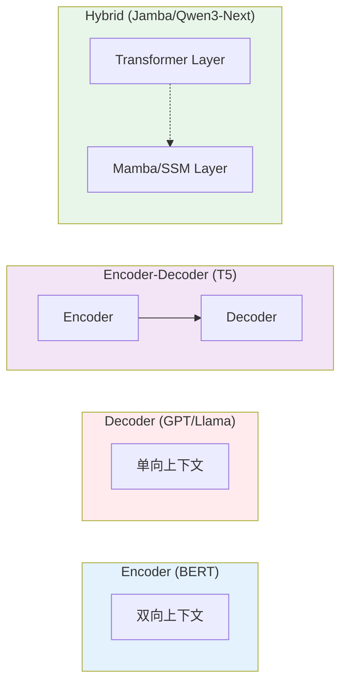

# 大语言模型导论

> **"LLM 不仅仅是文本预测器；它们是世界知识的压缩表示，通过自然语言即可访问。"**

大语言模型（LLM）代表了人工智能的范式转变，从特定任务模型转向通用推理引擎。对于软件工程师和 AI 从业者来说，理解 LLM 需要看透炒作，把握驱动它们的底层统计和架构原理。

---

## 什么是 LLM？

从本质上讲，LLM 是一个基于先前上下文预测下一个 token 的概率引擎。虽然数学公式涉及条件概率，但对工程师来说，理解 **LLM 能做什么** 比理解底层数学更有用。

### 现代 LLM 能力

LLM 已经从简单的文本补全演变为精密的推理引擎：

- **代码生成**：跨多种语言编写、调试和解释代码
- **文档分析**：从技术文档、研究论文和合同中提取洞察
- **对话系统**：在多轮对话中保持上下文和记忆
- **工具使用**：与 API、数据库和外部系统交互
- **多步推理**：将复杂问题分解为中间步骤

### 工程视角

对于生产系统，可以将 LLM 视为 **文本到文本的转换器**：

```java
// 概念视图：LLM 作为文本处理器
Input: "Summarize this document: [content]"
Processing: Model traverses layers of attention and feed-forward networks
Output: "[summary]"
```

关键洞察：LLM 从训练数据中学习模式并在推理时应用。它们并非人类意义上的"知道"事实——它们看到了能够复现的统计相关性。

---

## Spring AI 集成配置

Spring AI 提供了在 Spring Boot 应用中使用 LLM 的统一抽象层。这简化了在模型和提供商之间切换，同时保持一致的 API。

### 基本 ChatClient 配置

```java
// application.properties（使用 Doppler 管理环境变量）
spring.ai.openai.api-key=${OPENAI_API_KEY}
spring.ai.anthropic.api-key=${ANTHROPIC_API_KEY}

// 或使用推荐的 Doppler 注入模式：
// spring.ai.openai.api-key=${doppler.OPENAI_API_KEY}
```

```java
// LLM 交互的服务层
@Service
public class LLMChatService {
    private final ChatClient chatClient;

    public LLMChatService(ChatModel chatModel) {
        this.chatClient = ChatClient.builder(chatModel).build();
    }

    public String chat(String userMessage) {
        return chatClient.prompt()
            .user(userMessage)
            .call()
            .content();
    }

    // 实时应用的流式响应
    public Flux<String> chatStream(String userMessage) {
        return chatClient.prompt()
            .user(userMessage)
            .stream()
            .content();
    }
}
```

### 模型选择指南

选择合适的模型取决于你的使用场景、预算和性能需求：

| 使用场景 | 推荐模型 | 原因 |
|---------|---------|------|
| **代码生成与调试** | Claude 3.5/4 Sonnet | SWE-Bench 最高分（72.5%），擅长重构 |
| **通用对话** | GPT-4o 或 Llama 3.1 405B | 性能均衡，推理能力好 |
| **长文档分析** | Gemini 2.5 Pro | 1M-2M token 上下文窗口 |
| **成本敏感应用** | GPT-4o-mini 或 Llama 3.1 8B | 便宜 10-20 倍，简单任务足够 |
| **本地部署** | Llama 3.1 405B 或 Mixtral 8x22B | 开源，与闭源模型性能相当 |
| **多语言应用** | Qwen2.5 72B | 非英语表现强劲 |
| **复杂推理** | OpenAI o1 或 Claude 3.5 Sonnet | 显式推理链，数学/科学任务 |

### 配置示例

```java
@Configuration
public class LLMConfiguration {

    @Bean
    public ChatModel chatModel(OpenAiApi openAiApi) {
        return OpenAiChatModel.builder()
            .openAiApi(openAiApi)
            .options(OpenAiChatOptions.builder()
                .model("gpt-4")
                .temperature(0.7)
                .maxTokens(2000)
                // 理解这些参数：
                // - temperature: 控制随机性（0.0 = 确定性，1.0 = 创造性）
                // - maxTokens: 限制响应长度
                // - topP: 核采样（0.9 = 保留 90% 概率质量）
                // - presencePenalty: 减少重复
                .build())
            .build();
    }

    // 长上下文使用场景
    @Bean
    public ChatModel longContextModel() {
        return OpenAiChatModel.builder()
            .options(OpenAiChatOptions.builder()
                .model("gpt-4-turbo")  // 128K 上下文
                .maxTokens(4000)
                .build())
            .build();
    }
}
```

---

## 模型架构："三大" + 现代演进

2017 年，"Attention Is All You Need" 论文引入了 Transformer。此后，架构分化为三个不同的家族和混合变体。面试中你 **必须** 知道它们之间的区别。

### 1. 仅编码器（自编码）
- **机制**：破坏输入（遮盖词语），使用双向上下文（同时查看左右上下文）尝试重建。
- **核心能力**："理解"和分类。这些模型创建丰富的文本向量表示。
- **使用场景**：情感分析、命名实体识别（NER）、搜索/嵌入。
- **示例**：BERT、RoBERTa、DistilBERT。

### 2. 仅解码器（自回归）
- **机制**：*仅*基于先前 token 预测下一个 token（因果遮盖）。无法"看到"未来。
- **核心能力**：生成任务。
- **使用场景**：聊天机器人、代码生成、故事创作。
- **示例**：GPT-3/4、Llama 3/4、Claude、Gemini。
- **注意**：这是现代"生成式 AI"的主导架构，出现了 Mixture-of-Experts（MoE）变体。

### 3. 编码器-解码器（Seq2Seq）
- **机制**：编码器将输入处理为上下文向量，解码器生成输出。
- **核心能力**：将一个序列转换为另一个序列。
- **使用场景**：翻译（英语 → 法语）、摘要（长文 → 摘要）。
- **示例**：T5、BART。

### 4. 混合架构（2024+）
**最新前沿**：将 Transformer 块与状态空间模型（SSM）如 Mamba 结合。

- **机制**：交替使用 Transformer 注意力层和线性复杂度的 SSM 层。
- **优势**：
  - **O(n) 复杂度** 而非注意力的 O(n²)
  - **更好的长上下文建模** 不会内存爆炸
  - **在基准测试中保持强劲性能**
- **示例**：
  - **Jamba**（AI21 Labs）：Transformer + Mamba 混合
  - **RecurrentGemma**（Google）：Griffin 架构，混合注意力和线性递归
  - **Qwen3-Next**：使用 Gated DeltaNets 实现线性注意力
  - **Nemotron 3**（NVIDIA）：集成 Mamba-2 层
- **性能**：研究表明这些混合模型通常优于纯 Transformer 或纯 SSM 模型。



---

## 前沿模型（2025）

截至 2025 年，LLM 领域已收敛为几个具有独特优势的关键参与者：

### 闭源模型

| 模型 | 参数量 | 上下文窗口 | 核心优势 | 最佳用途 |
|------|--------|-----------|---------|---------|
| **Claude 3.5/4 Sonnet** | ~175B | 200K tokens | 编程（72.5% SWE-Bench）、复杂推理、长篇自主 | 软件开发、深度分析、扩展对话 |
| **GPT-4o** | ~200B（估计）| 128K tokens | 通用性能、多模态（文本/图像/音频）、创意写作 | 日常任务、营销内容、多模态应用 |
| **Gemini 2.5 Pro** | ~500B（估计）| **1M-2M tokens** | 海量上下文、多模态、Google 生态集成 | 长文档分析、企业工作流、复杂推理 |
| **OpenAI o1/o3 系列** | 未知 | 中等 | **显式推理链**、高级数学/问题解决 | 科学推理、复杂数学、研究任务 |

### 开源模型

| 模型 | 参数量 | 上下文窗口 | 核心优势 | 最佳用途 |
|------|--------|-----------|---------|---------|
| **Llama 3.1 405B** | 405B | 128K tokens | **与闭源模型性能相当**（87.3% MMLU）、优秀数学/编程 | 服务端部署、高性价比替代 |
| **Llama 4** | TBD (MoE) | 128K tokens | 与 GPT-4/Gemini 2.0 竞争，改进的推理 | 前沿模型的开源替代 |
| **Mixtral 8x22B** | 141B (MoE) | 32K-64K tokens | **混合专家效率**、快速推理 | 高效部署、良好性价比 |
| **Qwen2.5** | 72B | 32K tokens | 强编程/数学、多语言支持 | 亚洲语言、技术任务 |

### 2025 年关键洞察

1. **混合专家（MoE）成为新标准**：MoE 模型不再为每个 token 激活所有参数，而是将 token 路由到专门的"专家"子网络。这使得模型可以非常大（405B+ 参数），而每次前向传播只激活一小部分（如 8B）。

2. **上下文窗口军备竞赛**：
   - 标准：32K-128K tokens
   - 长上下文：200K-1M tokens（Claude、Gemini）
   - 前沿：2M+ tokens（Gemini 2.0 Pro）
   - **技术**：Ring Attention、线性注意力和 Forgetting Transformers（FoX）

3. **推理能力**：OpenAI 的 o1 和 Anthropic 的 Claude 3.5 等模型展示了"思考"模式，表明正在从纯下一个 token 预测转向显式推理。

4. **差距正在缩小**：开源模型（Llama 3.1 405B）现在在许多基准测试上匹配或超越闭源模型，使开源在企业部署中变得可行。

---

## 关键术语

### 参数
神经网络的权重和偏置。
- **7B 参数**：可在消费级硬件上运行（MacBook M3、带 GPU 的游戏 PC）。
- **13B-70B 参数**：生产使用需要不错的 GPU（A40/A100）。
- **100B+ 参数**：需要企业级 GPU（H100 集群）或高效 MoE 架构。
- **万亿级**：前沿模型（推测 GPT-4、Gemini Ultra）使用 MoE 有效达到此规模。

### 上下文窗口
模型一次能"记住"的文本量（以 token 计）。
- **标准**：8k - 32k tokens（约 30-120 页）。
- **长上下文**：128k（GPT-4o、Llama 3.1）、200k（Claude）。
- **超大上下文**：1M-2M（Gemini 2.0 Pro）— 相当于多本书或整个代码库。
- **权衡**：更长的上下文传统上需要 O(n²) 的注意力计算，但 **Ring Attention**、**Linear Attention** 和 **Forgetting Transformers** 将其降至 O(n)。

### 混合专家（MoE）
一种在不按比例增加计算的情况下扩展模型容量的技术。
- **工作原理**：每个 token 被路由到一部分"专家"子网络（如 224 个专家中的 8 个）。
- **优势**：模型可以有巨大的总参数（405B+），但每个 token 只激活一小部分（如 21B 活跃）。
- **示例**：Mixtral 8x22B、Llama 4、GPT-4（传闻）。

### 训练阶段
1. **预训练**：最昂贵的部分。从互联网规模的数据（万亿 token）中学习语言模式。
   - **结果**：基础模型（能补全文本但不遵循指令）
   - **成本**：数百万美元、数千 GPU、数周训练

2. **监督微调（SFT）**：使用高质量问答数据集教模型遵循指令。
   - **结果**：聊天/指令模型（理解对话意图）
   - **数据**：数百万指令-响应对，通常由人工策划

3. **对齐（RLHF/DPO/GRPO）**：优化行为使其有用、无害和诚实。
   - **RLHF**：基于人类反馈的强化学习（GPT 风格）
   - **DPO**：直接偏好优化（更简单、更稳定）
   - **GRPO**：组相对策略优化（更新、更高效；来自 DeepSeek R1）
   - **结果**：对齐模型，拒绝有害请求并遵循用户意图

---

## 面试 FAQ

<details>
<summary><strong>Q：为什么 Transformer 取代了 RNN/LSTM？</strong></summary>

**A：** 两个主要原因：
1. **并行化**：RNN 逐词顺序处理（$t_1, t_2, ...$），在 GPU 上训练效率低。Transformer 使用矩阵运算一次处理整个序列。
2. **长期依赖**：RNN 由于梯度消失问题在长序列上"遗忘"信息。注意力机制直接连接 *每个* token 到 *每个其他* token，使任何两个词之间的"距离"实际上为 1。

**2025 更新**：然而，Transformer 有 O(n²) 复杂度。新的混合模型（Transformer + Mamba/SSM）结合了两者的优势：并行训练和高效的 O(n) 长上下文推理。
</details>

<details>
<summary><strong>Q：基础模型和指令模型有什么区别？</strong></summary>

**A：** **基础模型**（如 Llama-3-Base）仅训练预测下一个 token。如果你问它"法国的首都是什么？"，它可能回答"德国的首都是什么？"因为它认为自己在补全一组测验题。

**指令模型**（如 Llama-3-Instruct）经过了 **SFT（监督微调）**，使用指令-响应对训练。它理解查询的 *意图* 并知道如何作为助手行动。

**关键洞察**：面向用户的应用始终使用 Instruct/Chat 模型。基础模型仅用于继续预训练或研究。
</details>

<details>
<summary><strong>Q：LLM 能在推理时学习新知识吗？</strong></summary>

**A：** 不能，模型的权重在训练后是固定的。它可以通过 **上下文学习**（将信息放在提示词中）*临时* 学习，但一旦关闭上下文窗口，知识就消失了。

要"教" LLM 新知识，你有三个选择：
1. **微调**：在新数据上更新模型权重（昂贵，需要专业知识）
2. **RAG（检索增强生成）**：检索相关文档并包含在提示词中（最常见）
3. **提示词工程**：直接在系统提示词或用户消息中提供知识（适用于小型、静态知识）
</details>

<details>
<summary><strong>Q：什么是混合专家（MoE），为什么重要？</strong></summary>

**A：** MoE 是一种将模型大小与计算成本解耦的架构创新。MoE 模型不再为每个 token 激活所有参数（如密集模型），而是将每个 token 路由到一小部分专门的"专家"子网络。

**示例**：Mixtral 8x22B 有 141B 总参数，但每个 token 只激活约 39B（8 个专家 × 约 5B 每个）。

**优势**：
- **规模**：可以构建巨大模型（400B+）而推理成本不成比例增加
- **专业化**：不同专家可以在不同领域专精（编程、数学、创意写作）
- **效率**：比同等密集模型推理更快、内存更低

**权衡**：
- **训练复杂性**：需要仔细的负载均衡以确保所有专家被利用
- **实现复杂性**：需要实现路由逻辑和专家选择

**2025 现状**：大多数前沿模型（GPT-4、Llama 4、Gemini）据信使用 MoE 来实现其规模。
</details>

<details>
<summary><strong>Q：长上下文模型（1M+ tokens）如何避免内存耗尽？</strong></summary>

**A：** 传统注意力有 O(n²) 复杂度，意味着 1M token 上下文需要每个注意力层约 1 万亿次操作。现代模型使用多种技术：

1. **Ring Attention**：将序列分布到多个 GPU，每个计算一部分子集的注意力。像环形一样在设备间传递"边界"信息。

2. **Linear Attention**：用线性复杂度替代替代二次 softmax 注意力（如 Mamba、Gated DeltaNets）。实现 O(n) 复杂度。

3. **滑动窗口/局部注意力**：只关注附近的 token，使用全局"缓存"存储远处的重要信息。

4. **Forgetting Transformers（FoX）**：选择性地"遗忘"不太相关的信息，维护有界的内存状态。

**权衡**：其中一些方法为实际效率牺牲了理论建模能力。然而，混合模型（Transformer + SSM）通常能以一小部分成本达到 Transformer 质量的 95%+。
</details>

<details>
<summary><strong>Q：RLHF、DPO 和 GRPO 有什么区别？</strong></summary>

**A：** 这是对齐 LLM 与人类偏好的三种方法：

**RLHF（基于人类反馈的强化学习）**：
- **过程**：在人类偏好数据上训练奖励模型 → 使用 PPO（近端策略优化）优化 LLM
- **优点**：成熟、效果强
- **缺点**：复杂、需要训练单独的奖励模型、不稳定

**DPO（直接偏好优化）**：
- **过程**：直接使用偏好对优化策略，无需奖励模型
- **优点**：更简单、更稳定、更容易实现
- **缺点**：可能不如 RLHF 样本高效

**GRPO（组相对策略优化）**：
- **过程**：更新的方法（来自 DeepSeek R1），相对彼此优化输出组
- **优点**：比 RLHF 更高效、更适合推理任务、包含主动采样和 token 级损失等改进
- **缺点**：更新、实战验证较少

**2025 现状**：GRPO 和 DPO 由于简单和稳定正成为传统 RLHF 的首选。许多前沿模型（DeepSeek、Llama 4）使用这些新方法。
</details>

---

## 面试总结

1. **LLM 是概率性的下一个 token 预测器**，在大规模下展现出涌现推理能力。
2. **Transformer 架构**（2017）实现了并行训练和长程依赖，但 **混合模型**（2024+）正在提升效率。
3. **三种主要架构**：仅编码器（BERT）、仅解码器（GPT、Llama）、编码器-解码器（T5）。**仅解码器主导** 生成式 AI。
4. **2025 前沿**：Claude 3.5/4（编程/推理）、GPT-4o（多模态）、Gemini 2.5（1M+ 上下文）、Llama 3.1/4（开源平价）。
5. **混合专家（MoE）** 是高效扩展超过 100B 参数模型的关键。
6. **训练流水线**：预训练 → SFT → 对齐（RLHF/DPO/GRPO）。
7. **上下文学习 ≠ 学习**：权重是固定的；使用 RAG 获取外部知识。
8. **长上下文已成主流**：128K-1M tokens 通过 Ring Attention、线性注意力和混合架构实现。

:::tip 延伸阅读
- [The State of LLMs 2025](https://magazine.sebastianraschka.com/p/state-of-llms-2025) - 2024-2025 进展的综合分析
- [Hybrid Architectures for Language Models](https://arxiv.org/html/2510.04800v1) - Transformer + SSM 混合模型的系统分析
- [Attention Is All You Need (2017)](https://arxiv.org/abs/1706.03762) - 原始 Transformer 论文
:::
