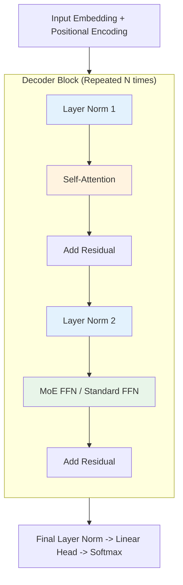
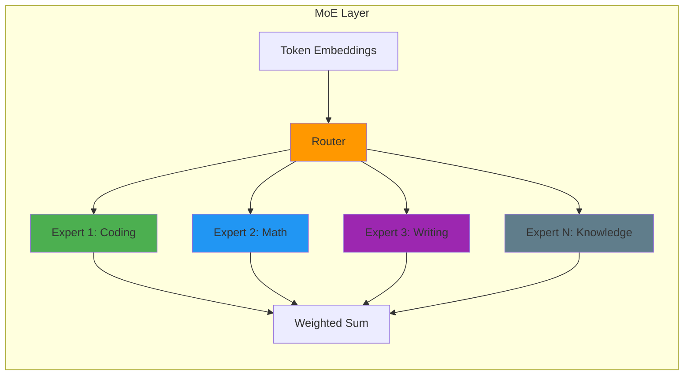

# Transformer 架构：LLM 的引擎

> **"Transformer 是第一个完全依赖注意力机制的序列转导模型。"** — Vaswani 等人 (2017)

要通过 LLM 面试，仅仅知道"它使用了注意力机制"是不够的。你必须理解*为什么*做出特定的设计选择（Pre-Norm vs Post-Norm、SwiGLU vs ReLU、GQA vs MHA、MoE vs Dense）以及块内部的数学运算。

---

## 1. 整体架构概览

现代的 Decoder-Only Transformer（如 GPT-4 或 Llama 3）由一堆相同的块组成。每个块有两个主要子层：
1. **多头自注意力（MHA）**：在 token 之间混合信息。
2. **前馈网络（FFN）**：在每个 token 内独立处理信息。

关键是，它们被**残差连接**和**层归一化**包裹。



**2025 年演进**：
- **FFN → MoE**：许多模型现在在前馈层使用混合专家（Mixture-of-Experts）
- **MHA → GQA**：分组查询注意力减少 KV 缓存内存
- **标准 → 混合**：一些模型混合使用 Transformer 和状态空间模型（Mamba）

---

## 2. Self-Attention： "路由"层

注意力机制允许 token 之间相互"对话"。它提出特定的问题来构建上下文。

### Query、Key、Value 直觉
每个 token 产生三个向量：
- **Query (Q)**："我在寻找什么？"（例如，一个名词在寻找它的形容词）。
- **Key (K)**："我包含什么？"（例如，我是一个形容词）。
- **Value (V)**："如果你关注我，这是我的信息。"

### 工程视角

自注意力通过以下步骤计算 token 之间的关系：
1. **相似度**：计算每对 token 的分数（QK^T）
2. **缩放**：防止点积爆炸，否则会导致梯度消失
3. **归一化**：将分数转换为概率（softmax）
4. **聚合**：值向量的加权和

### 为什么需要多头？
一个头可能关注**语法**（名词-动词一致性）。另一个可能关注**语义**（同义词）。还有一个可能关注**位置**（前一个词）。

| 模型 | 头数 | 头维度 | 总维度 |
|-------|-------|----------------|-----------------|
| **Llama 3 8B** | 32 | 128 | 4,096 |
| **Llama 3 70B** | 64 | 128 | 8,192 |
| **GPT-4** | 96+（估计） | 128 | 12,288 |

---

## 3. 分组查询注意力（GQA）- **2025 年标准**

随着上下文窗口的增长（8k → 128k → 1M+），**KV 缓存**成为内存瓶颈。为每个头存储 Key 和 Value 矩阵代价高昂。

### 谱系：MHA → GQA → MQA

| 机制 | Query 头数 | KV 头数 | KV 缓存大小 | 质量 | 速度 |
|-----------|-------------|-----------|----------------|---------|-------|
| **MHA**（多头） | H | H | 100% | 最佳 | 最慢 |
| **GQA**（分组查询） | H | G（其中 G < H） | ~1/G | 接近最佳 | 更快 |
| **MQA**（多查询） | H | 1 | 1/H | 较低 | 最快 |

### GQA 如何工作

不再每个头有自己的 K/V 投影，而是查询头组共享 K/V：

```python
# MHA: 32 个头，32 个 KV 对
q_heads = 32
kv_heads = 32

# GQA: 32 个查询头，8 个 KV 对（4 个一组）
q_heads = 32
kv_heads = 8  # 每个 KV 对服务 4 个查询头
```

**优势**：
- **内存减少**：GQA-8 减少 8 倍 KV 缓存
- **带宽减少**：推理时减少内存传输
- **质量保持**：GQA-8 达到 MHA 质量的约 98-99%

**采用情况**：
- **Llama 3 70B**：使用 GQA 进行高效推理
- **T5-XXL**：GQA-8 用于生产部署
- **Gemini 2.5**：使用 GQA 变体处理长上下文

### 2025：加权 GQA（WGQA）

**创新**：每个 K/V 头的可学习参数在微调期间实现加权平均。

**优势**：
- 比标准 GQA 平均提升 0.53%
- 在无推理开销的情况下收敛到 MHA 质量
- 模型在训练期间学习最优分组

---

## 4. 混合专家（MoE）- **扩展革命**

MoE 不使用一个庞大的前馈网络，而是使用多个专门的"专家"网络。每个 token 被路由到最相关的专家。

### 架构



### 关键组件

1. **Router（路由器）**：为每个 token 选择 top-k 专家的门控网络
2. **Experts（专家）**：专门的 FFN 网络（通常每层 8-64 个）
3. **负载均衡**：辅助损失确保所有专家都被利用

### 2025 年 MoE 模型

| 模型 | 总参数量 | 活跃参数量 | 专家数 | Top-K | 备注 |
|-------|-------------|---------------|---------|-------|-------|
| **Mixtral 8x7B** | 46.7B | 13B | 8 | 2 | 开源，匹敌 Llama 2 70B |
| **Llama 4** | 待定 | 待定 | 待定 | 待定 | 传闻有 MoE 变体 |
| **DeepSeek-V3** | 671B | 37B | 256 | 8 | 共享专家，多样化路由 |
| **GPT-4** | ~1.7T（估计） | ~220B（估计） | ~128（估计） | 待定 | 普遍猜测使用 MoE |
| **Switch Transformer** | 1.6T | 待定 | 2048 | 1 | 研究里程碑 |
| **GLaM** | 1.2T | 待定 | 64 | 2 | Google 的万亿参数模型 |

### 为什么 MoE 重要

**训练效率**：
- 以 **1/3 的计算量** 达到与稠密模型相同的质量（GLaM 结果）
- 允许扩展到万亿参数
- **碳足迹**：比稠密模型减少最多 10 倍

**推理效率**：
- 每个 token 仅激活相关专家
- **70B 参数，13B 活跃** = 8B 模型速度，70B 质量
- 在消费级硬件上运行超大规模模型（配合量化）

**训练稳定性（2025 年进展）**：
- **Router Z-loss**：惩罚大的路由器 logits，稳定训练
- **共享专家**：减少冗余，增加多样性
- **Sigmoid 门控**：比 softmax 更稳定地选择专家

### MoE vs 稠密 FFN

| 方面 | 稠密 FFN | MoE |
|--------|-----------|-----|
| **参数** | 每层固定 | 随专家数扩展 |
| **计算** | 始终激活 | 稀疏激活 |
| **质量** | 基线 | 相同或更好 |
| **推理** | 可预测 | 可变（取决于路由） |
| **训练** | 稳定 | 需要技巧（Z-loss、辅助损失） |

---

## 5. Pre-Norm vs. Post-Norm

### Post-Norm（原始 Transformer、BERT）
LayerNorm 应用在残差连接*之后*。
- **问题**：初始化时梯度在输出层附近可能爆炸，需要"预热"阶段。

### Pre-Norm（GPT-2、Llama、PaLM）
LayerNorm 应用在子层*之前*。
- **优势**：梯度通过"残差高速公路"（加法路径）不受干扰地流动。大规模训练更加稳定。
- **权衡**：理论上可能略微降低表达能力（存在争议），但稳定性对 LLM 更重要。

**2025 年共识**：Pre-Norm 在 decoder-only LLM 中是通用的。Post-Norm 仍用于一些 encoder-decoder 模型（T5）。

---

## 6. 前馈网络（FFN）与 MoE： "知识"层

如果说注意力是"路由"信息，那么 FFN（或 MoE）就是"处理"信息。一些研究人员认为 FFN 充当**键值记忆**来存储事实知识。

### 激活函数的演进
1. **ReLU**（原始）：修正线性单元。问题："死亡神经元"（梯度为零）。
2. **GELU**（GPT-2/3）：高斯误差线性单元。更平滑、概率化。
3. **SwiGLU**（PaLM、Llama）：Swish 门控线性单元。

### 什么是 SwiGLU？
它为 FFN 添加了一个"门"。不再只是传递数据，而是计算两条路径并将它们相乘。这需要 3 次矩阵乘法而不是 2 次，但在相同计算预算下始终产生更好的性能。

### MoE 作为 FFN 替代

**标准 Transformer 块**：
```
Attention → Dense FFN → Output
```

**MoE Transformer 块**：
```
Attention → Router → Selected Experts → Combined Output
```

每个专家是一个专门的 FFN：
- 专家 1：专门处理编程模式
- 专家 2：专门处理数学推理
- 专家 3：专门处理事实知识
- 专家 4-8：其他专业化领域

---

## 7. 线性注意力与混合架构

### 线性注意力（2020+）

**问题**：标准注意力由于 QK^T 矩阵计算具有 O(N²) 复杂度。

**解决方案**：使用核函数来近似注意力，无需显式的 N × N 矩阵。

**优势**：
- **O(N) 复杂度** 而非 O(N²)
- 实现真正的大规模上下文窗口（1M+ token）
- **权衡**：轻微的质量下降

**采用情况**：
- **RWKV**：具有线性注意力的循环架构
- **Mamba/状态空间模型**：设计上具有线性复杂度
- **混合模型**：混合 Transformer 和线性注意力层

### 2025：高阶注意力（Nexus）

**创新**：Query 和 Key 向量是嵌套自注意力循环的输出。

**优势**：
- 在单层中捕获多跳关系
- 比标准一阶注意力更具表达力
- 无需深层堆栈即可实现复杂推理

**状态**：研究阶段，尚未在主要 LLM 中投入生产。

---

## 8. 位置编码再探讨

### RoPE（旋转位置嵌入）- **黄金标准**

被 **Llama 2/3/4、PaLM、Mistral、GPT-NeoX** 使用。

- **直觉**：通过在空间中**旋转**向量来编码位置。
- **机制**：
    - 位置 $m$ 处的 token 旋转角度 $m\theta$。
    - 两个 token 之间的点积（相似度）仅取决于它们的相对距离（$m-n$）。
- **为什么胜出**：
    - **衰减**：随着 token 距离增大，注意力自然衰减（长程依赖管理）。
    - **外推**：比绝对嵌入更好地处理超出训练数据的上下文长度。

### 2025：PaTH Attention

**创新**：将中间词视为数据相关变换（Householder 反射）的路径。

**优势**：
- **位置记忆**：跟踪序列中的状态变化
- **更好的顺序推理**：改进的代码执行跟踪
- **选择性遗忘**：与 Forgetting Transformers（FoX）结合来降低旧信息的权重

**状态**：前沿研究，尚未在生产模型中使用。

---

## 9. 面试常见问题

<details>
<summary><strong>Q：Self-Attention 的计算复杂度是多少？</strong></summary>

**A:** $O(N^2)$，其中 $N$ 是序列长度。
- 计算 $QK^T$ 产生一个 $N \times N$ 矩阵。
- 这就是为什么长上下文（100k+）很困难；上下文翻倍，计算量翻四倍。
- **2025 年解决方案**：
  - **FlashAttention-2**：优化 IO 但数学上仍然是 $O(N^2)$
  - **线性注意力**：$O(N)$ 复杂度，轻微的质量权衡
  - **Ring Attention**：跨 GPU 分布式，实现 1M+ 上下文
  - **滑动窗口**：仅关注附近的 token + 全局缓存
</details>

<details>
<summary><strong>Q：为什么需要层归一化？</strong></summary>

**A:** 为了稳定深度网络中激活值的分布，确保没有单个特征在量级上占主导地位。没有它，在 100+ 层的网络中梯度会爆炸或消失。

**2025 年更新**：RMSNorm（均方根归一化）正在许多模型（Llama、Gemma）中取代 LayerNorm，因为它更简单、更快：
- 用均方根而非均值和方差进行归一化
- 比 LayerNorm 计算效率更高
- 对非常深的网络有更好的稳定性
</details>

<details>
<summary><strong>Q：Decoder-only 模型在训练时如何防止"作弊"？</strong></summary>

**A:** 通过**因果掩码（Causal Masking）**。在自注意力步骤中，我们将所有未来 token（位置 $j > i$）的注意力分数设为 $-\infty$。通过 softmax 后，这些变为 0，确保 token $i$ 只能关注 $0...i$。

**实现**：
```python
# 创建因果掩码
mask = torch.triu(torch.ones(seq_len, seq_len), diagonal=1)
# 应用到注意力分数
scores = scores.masked_fill(mask.bool(), float('-inf'))
```
</details>

<details>
<summary><strong>Q：残差（跳跃）连接的目的是什么？</strong></summary>

**A:** 它缓解了梯度消失问题。通过允许梯度通过加法（$x + f(x)$）直接流过网络，误差可以从最后一层反向传播到第一层，而不会因多次乘法步骤而衰减。

**2025 年洞察**：残差连接还支持**梯度检查点**，在训练中用计算换内存。
</details>

<details>
<summary><strong>Q：何时应该使用 GQA vs MHA vs MQA？</strong></summary>

**A:**

**使用 MHA** 当：
- 质量至关重要（研究、基准测试）
- 上下文窗口短（< 8k token）
- 内存不是限制因素

**使用 GQA** 当：
- **2025 年生产 LLM 的默认选择**
- 长上下文（32k-128k token）
- 内存受限的部署
- 想要接近 MHA 质量但更快的推理

**使用 MQA** 当：
- 需要最大吞吐量
- 可以接受 5-10% 的质量下降
- 非常大批量推理（如 API 服务）

**2025 年结论**：GQA-8 或 GQA-4 是大多数应用的最佳平衡点。
</details>

<details>
<summary><strong>Q：MoE 模型训练不稳定的原因是什么？</strong></summary>

**A:** 三个主要问题：

1. **路由器坍塌**：所有 token 路由到同一个专家，导致其他专家闲置
   - **修复**：辅助负载均衡损失、专家容量因子

2. **专家溢出**：专家接收的 token 超过其容量因子允许的范围
   - **修复**：丢弃 token 或路由到下一层

3. **梯度不平衡**：某些专家接收到比其他专家大得多的梯度
   - **修复**：Router Z-loss、归一化专家损失

**2025 年解决方案**：
- **共享专家**：减少冗余，改善负载均衡
- **Sigmoid 门控**：比 softmax 更稳定地选择专家
- **稳定 MoE 训练**：预热期、渐进式专家激活
</details>

<details>
<summary><strong>Q：RoPE 与绝对位置嵌入有什么不同？</strong></summary>

**A:** **绝对嵌入**基于位置向每个 token 添加一个固定向量。位置被编码为 token 的固定属性。

**RoPE** 使用旋转矩阵基于位置旋转 query 和 key 向量。query 和 key 之间的点积仅取决于它们的相对距离，而非绝对位置。

**优势**：
- 更好地外推到更长的序列
- 注意力随距离自然衰减
- 无需学习的位置参数

**2025 年主导地位**：RoPE 被几乎所有 decoder-only LLM 使用（Llama、GPT-4、PaLM、Mistral）。
</details>

---

## Spring AI 模型配置

Spring AI 为不同的 LLM 提供商提供统一配置，具有一致的参数调优选项。

### 基本模型配置

```java
// Spring AI 模型配置
@Configuration
public class LLMConfiguration {

    @Bean
    public ChatModel chatModel(OpenAiApi openAiApi) {
        return OpenAiChatModel.builder()
            .openAiApi(openAiApi)
            .options(OpenAiChatOptions.builder()
                .model("gpt-4")
                .temperature(0.7)
                .maxTokens(2000)
                // 理解这些参数：
                // - temperature: 控制随机性 (0.0 = 确定性, 1.0 = 创造性)
                // - maxTokens: 限制响应长度
                // - topP: 核采样 (0.9 = 保留 90% 概率质量)
                // - presencePenalty: 减少重复
                .build())
            .build();
    }

    // 需要特定注意力设置的模型
    @Bean
    public ChatModel longContextModel() {
        return OpenAiChatModel.builder()
            .options(OpenAiChatOptions.builder()
                .model("gpt-4-turbo")  // 128K 上下文
                // 何时使用长上下文：
                // - 文档分析 > 50 页
                // - 代码库审查
                // - 多文档综合
                .build())
            .build();
    }
}
```

### 参数调优指南

不同任务需要不同的参数设置以获得最佳结果：

```java
// 采样参数的效果
@Service
public class ParameterTuningService {
    private final ChatClient chatClient;

    // 代码生成：低温度以保持一致性
    public String generateCode(String description) {
        return chatClient.prompt()
            .user("Write code to: " + description)
            .options(OpenAiChatOptions.builder()
                .temperature(0.2)  // 低 = 更确定性
                .maxTokens(1500)
                .topP(0.95)
                .build())
            .call()
            .content();
    }

    // 创意写作：更高温度
    public String generateStory(String prompt) {
        return chatClient.prompt()
            .user("Write a story about: " + prompt)
            .options(OpenAiChatOptions.builder()
                .temperature(0.9)  // 高 = 更有创意
                .maxTokens(2000)
                .topP(0.9)
                .build())
            .call()
            .content();
    }

    // 技术文档：平衡设置
    public String generateDocs(String code) {
        return chatClient.prompt()
            .user("Generate documentation for:\n" + code)
            .options(OpenAiChatOptions.builder()
                .temperature(0.5)  // 平衡
                .maxTokens(1000)
                .presencePenalty(0.3)  // 减少重复
                .build())
            .call()
            .content();
    }
}
```

### 选择合适的模型

```java
// 基于任务的模型选择服务
@Service
public class ModelSelectionService {

    public String chooseModel(String task) {
        return switch (task.toLowerCase()) {
            case "code", "debug", "refactor" -> "gpt-4",  // 最佳编码性能
            case "chat", "general", "qa" -> "gpt-3.5-turbo",  // 成本效益高
            case "analysis", "document", "long" -> "gpt-4-turbo",  // 128K 上下文
            case "creative", "story", "poem" -> "gpt-4",  // 更好的创意
            case "simple", "classification" -> "gpt-3.5-turbo",  // 更快、更便宜
            default -> "gpt-3.5-turbo"  // 默认使用成本效益高的
        };
    }

    public ChatOptions getOptionsForTask(String task) {
        return switch (task.toLowerCase()) {
            case "code" -> OpenAiChatOptions.builder()
                .temperature(0.2)
                .maxTokens(2000)
                .build();
            case "creative" -> OpenAiChatOptions.builder()
                .temperature(0.9)
                .maxTokens(1500)
                .presencePenalty(0.5)
                .build();
            case "analysis" -> OpenAiChatOptions.builder()
                .temperature(0.3)
                .maxTokens(3000)
                .topP(0.95)
                .build();
            default -> OpenAiChatOptions.builder()
                .temperature(0.7)
                .maxTokens(1000)
                .build();
        };
    }
}
```

### 架构选择指南

| 使用场景 | 推荐架构 | 原因 |
|----------|------------------------|-----|
| **聊天机器人** | Decoder-only（GPT、Llama） | 生成式、对话式 |
| **分类** | Encoder-only（BERT） | 更好的理解、双向上下文 |
| **翻译** | Encoder-Decoder（T5） | 序列到序列转换 |
| **代码生成** | 带 MoE 的 Decoder-only | 编程模式的专门专家 |
| **长文档** | 混合（Transformer + SSM） | 高效的长上下文建模 |
| **成本敏感** | 稠密小模型 | 可预测的推理成本 |
| **质量优先** | 大型 MoE 模型 | 稀疏激活下的最佳性能 |

---

## 面试总结

1. **Transformer 块**由多头注意力 + FFN 组成，包裹在残差连接和归一化中。
2. **自注意力**通过 QK^T 计算所有 token 对之间的相似度，除以 key 维度的平方根进行缩放。
3. **多头注意力**允许不同的头关注不同方面（语法、语义、位置）。
4. **Pre-norm**（子层之前的 LayerNorm）是 decoder-only LLM 的标准；比 post-norm 更稳定。
5. **GQA**（分组查询注意力）是 2025 年标准：以最小的质量损失减少 4-8 倍 KV 缓存。
6. **MoE**（混合专家）通过仅激活每个 token 的相关专家，实现扩展到万亿参数。
7. **RoPE**（旋转位置嵌入）主导位置编码；支持更好的长上下文外推。
8. **SwiGLU** 激活函数在 LLM 中优于 ReLU/GELU；为 FFN 添加门控机制。
9. **线性注意力**变体实现 O(N) 复杂度用于 1M+ token 上下文；在混合模型中使用。
10. **2025 年架构趋势**：MoE 用于扩展、GQA 用于效率、RoPE 用于位置编码、混合（Transformer + SSM）用于长上下文。

:::tip 实践资源
动手练习：

**1. 学习 GQA 实现**：
- [Llama 3 架构](https://llama.meta.com/)
- [分组查询注意力论文](https://arxiv.org/abs/2305.13245)

**2. 探索 MoE 模型**：
- [Mixtral 8x7B (Hugging Face)](https://huggingface.co/mistralai/Mixtral-8x7B-v0.1)
- [Switch Transformer](https://arxiv.org/abs/2101.03961)

**3. 通过注意力可视化建立直觉**：
- [BertViz](https://github.com/jessevig/bertviz) - 注意力可视化
- [Transformer Explainer](https://poloclub.github.io/transformer-explainer/) - 交互式注意力数学

**4. 实验 RoPE**：
- [RoPE 的 PyTorch 实现](https://github.com/facebookresearch/llama/blob/main/llama/model.py#L360)
:::
