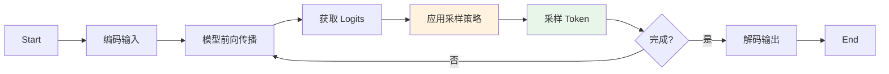
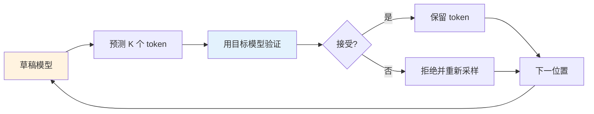
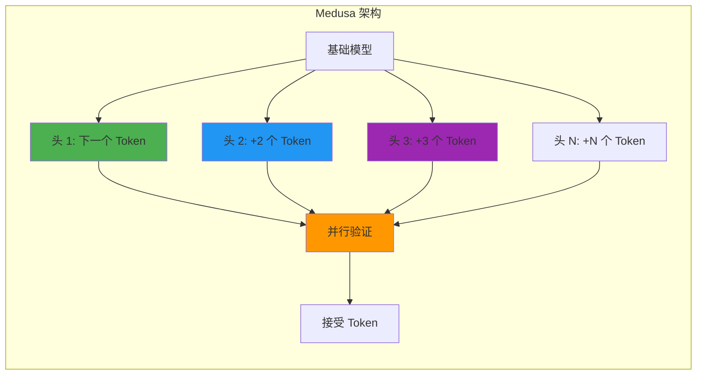
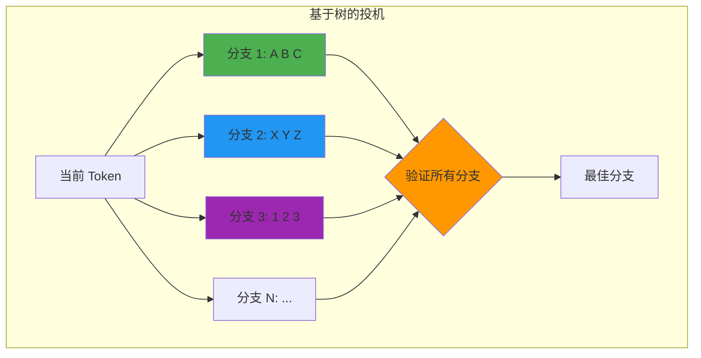

# Inference - 控制输出质量

> **"推理通过策略性的 token 选择，将概率分布转化为连贯的文本。"**

训练构建了模型，但推理决定了它的输出。理解解码策略、采样参数和优化技术对于在生产环境中控制模型行为至关重要。本文档涵盖自回归生成、解码算法、采样参数以及大规模部署 LLM 的性能优化技术。

---

## 自回归生成

### 生成循环

LLM 以自回归方式生成文本——一次一个 token，每个新 token 以所有先前 token 为条件。



### 基本实现

```python
import torch
import torch.nn.functional as F

def generate_autoregressive(
    model,
    input_ids: torch.Tensor,
    max_new_tokens: int = 100,
    temperature: float = 1.0,
    top_k: int = None,
    top_p: float = 1.0,
    eos_token_id: int = None
) -> torch.Tensor:
    """
    自回归生成 token。

    Args:
        model: 语言模型
        input_ids: 输入 token ID (batch, seq_len)
        max_new_tokens: 最大生成 token 数
        temperature: 采样温度
        top_k: 保留前 k 个 token
        top_p: 核采样阈值
        eos_token_id: 序列结束 token ID
    """
    batch_size, seq_len = input_ids.shape
    current_ids = input_ids.clone()

    for step in range(max_new_tokens):
        # 前向传播
        with torch.no_grad():
            outputs = model(current_ids)
            logits = outputs.logits[:, -1, :]  # (batch, vocab_size)

        # 应用温度
        logits = logits / temperature

        # 应用 top-k 过滤
        if top_k is not None:
            top_k_logits, top_k_indices = torch.topk(logits, top_k)
            logits = torch.full_like(logits, float('-inf'))
            logits.scatter_(1, top_k_indices, top_k_logits)

        # 应用 top-p（核采样）过滤
        if top_p < 1.0:
            sorted_logits, sorted_indices = torch.sort(logits, descending=True)
            cumulative_probs = torch.cumsum(F.softmax(sorted_logits, dim=-1), dim=-1)

            # 移除累积概率超过阈值的 token
            sorted_indices_to_remove = cumulative_probs > top_p
            sorted_indices_to_remove[..., 1:] = sorted_indices_to_remove[..., :-1].clone()
            sorted_indices_to_remove[..., 0] = False

            indices_to_remove = sorted_indices_to_remove.scatter(1, sorted_indices, sorted_indices_to_remove)
            logits[indices_to_remove] = float('-inf')

        # 采样 token
        probs = F.softmax(logits, dim=-1)
        next_token = torch.multinomial(probs, num_samples=1)  # (batch, 1)

        # 追加到序列
        current_ids = torch.cat([current_ids, next_token], dim=1)

        # 检查 EOS
        if eos_token_id is not None and (next_token == eos_token_id).all():
            break

    return current_ids

# 使用示例
input_text = "The future of AI is"
input_ids = tokenizer.encode(input_text, return_tensors="pt")
output_ids = generate_autoregressive(model, input_ids, max_new_tokens=50, temperature=0.8)
output_text = tokenizer.decode(output_ids[0], skip_special_tokens=True)
print(output_text)
```

---

## 解码策略

### 策略对比

| 策略 | 描述 | 速度 | 质量 | 多样性 | 适用场景 |
|----------|-------------|-------|---------|-----------|----------|
| **贪心搜索** | 始终选择最高概率 | 最快 | 适合事实性任务 | 无 | 事实问答、代码 |
| **束搜索** | 保留前 k 个假设 | 慢 | 高质量 | 低 | 翻译、摘要 |
| **采样** | 从概率分布中采样 | 快 | 可变 | 高 | 创意写作 |
| **核采样 (Top-p)** | 从最小顶部概率质量中采样 | 快 | 好 | 高 | 通用聊天、助手 |
| **Top-k** | 从前 k 个 token 中采样 | 快 | 好 | 中高 | 平衡生成 |
| **对比搜索** | 平衡概率 + 退化惩罚 | 中 | 很高 | 中 | 长文本内容 |
| **MCTS** | 带前瞻的树搜索 | 很慢 | 最佳 | 中 | 复杂推理 |

### 贪心搜索

```python
def greedy_search(model, input_ids: torch.Tensor, max_new_tokens: int) -> torch.Tensor:
    """
    贪心解码：始终选择最可能的 token。
    """
    current_ids = input_ids.clone()

    for _ in range(max_new_tokens):
        outputs = model(current_ids)
        next_token = outputs.logits[:, -1, :].argmax(dim=-1, keepdim=True)
        current_ids = torch.cat([current_ids, next_token], dim=1)

    return current_ids

# 示例：贪心搜索可能重复 "The the the the..." 如果陷入循环
```

### 束搜索

```python
def beam_search(
    model,
    input_ids: torch.Tensor,
    max_new_tokens: int,
    num_beams: int = 4,
    length_penalty: float = 1.0
) -> torch.Tensor:
    """
    束搜索：在每一步保留前 k 个假设。

    Args:
        model: 语言模型
        input_ids: 输入 token ID
        max_new_tokens: 最大生成 token 数
        num_beams: 跟踪的束数量
        length_penalty: 惩罚短序列（1.0 = 无惩罚）
    """
    batch_size = input_ids.shape[0]
    input_ids = input_ids.repeat_interleave(num_beams, dim=0)

    # 初始化束
    beam_scores = torch.zeros(batch_size * num_beams, device=input_ids.device)
    beam_scores[1::num_beams] = float('-inf')  # 只有第一个束有效

    for step in range(max_new_tokens):
        outputs = model(input_ids)
        next_token_logits = outputs.logits[:, -1, :]
        next_token_scores = F.log_softmax(next_token_logits, dim=-1)

        # 添加束分数
        vocab_size = next_token_scores.shape[-1]
        next_scores = beam_scores.unsqueeze(-1) + next_token_scores

        # 重塑以进行 top-k 选择
        next_scores = next_scores.view(batch_size, num_beams * vocab_size)
        next_scores, next_tokens = torch.topk(next_scores, k=num_beams, dim=-1)

        # 将扁平索引转换为 (束, token) 对
        beam_indices = next_tokens // vocab_size
        token_indices = next_tokens % vocab_size

        # 更新束
        input_ids = input_ids.view(batch_size, num_beams, -1)
        input_ids = input_ids[torch.arange(batch_size).unsqueeze(-1), beam_indices]
        input_ids = input_ids.reshape(batch_size * num_beams, -1)

        next_token_ids = token_indices.view(-1, 1)
        input_ids = torch.cat([input_ids, next_token_ids], dim=-1)

        beam_scores = next_scores.view(-1)

    # 选择最佳束
    input_ids = input_ids.view(batch_size, num_beams, -1)
    best_beam_indices = beam_scores.view(batch_size, num_beams).argmax(dim=-1)
    output_ids = input_ids[torch.arange(batch_size), best_beam_indices]

    return output_ids

# 使用示例
output = beam_search(model, input_ids, max_new_tokens=50, num_beams=4)
```

### 对比搜索

对比搜索将概率建模与退化惩罚相结合：

```python
def contrastive_search(
    model,
    input_ids: torch.Tensor,
    max_new_tokens: int,
    top_k: int = 5,
    alpha: float = 0.6,
    momentum: float = 0.5
) -> torch.Tensor:
    """
    对比搜索：平衡概率和与上下文的相似度。

    Args:
        model: 语言模型
        input_ids: 输入 token
        max_new_tokens: 最大生成 token 数
        top_k: 候选 token 数量
        alpha: 重复惩罚（0 = 纯采样，1 = 纯退化惩罚）
        momentum: 更新累积概率的权重

    参考:
        Su, J., et al. (2022). "A Contrastive Framework for Neural Text Generation"
        https://arxiv.org/abs/2202.01855
    """
    current_ids = input_ids.clone()
    cumulative_probs = None

    for _ in range(max_new_tokens):
        # 前向传播
        with torch.no_grad():
            outputs = model(current_ids)
            logits = outputs.logits[:, -1, :]
            hidden_states = outputs.hidden_states[-1][:, -1, :]  # 最后一层隐藏状态

        # 获取 top-k 候选
        top_k_logits, top_k_indices = torch.topk(logits, top_k)
        top_k_probs = F.softmax(top_k_logits, dim=-1)

        # 计算模型置信度（概率质量）
        model_confidence = top_k_probs.max(dim=-1)[0]

        # 计算退化惩罚（与之前 token 的相似度）
        # 使用当前隐藏状态和之前状态的余弦相似度
        prev_hidden = outputs.hidden_states[-1][:, :-1, :]  # 所有之前的隐藏状态

        # 与最近的 token 计算相似度
        if prev_hidden.size(1) > 0:
            # 与最后几个 token 的相似度（局部上下文）
            recent_hidden = prev_hidden[:, -min(5, prev_hidden.size(1)):, :]
            similarities = F.cosine_similarity(
                hidden_states.unsqueeze(1),
                recent_hidden,
                dim=-1
            ).max(dim=1)[0]
            degeneration_penalty = similarities.max()
        else:
            degeneration_penalty = torch.tensor(0.0)

        # 更新累积概率
        if cumulative_probs is None:
            cumulative_probs = model_confidence
        else:
            cumulative_probs = momentum * cumulative_probs + (1 - momentum) * model_confidence

        # 选择最大化以下目标的 token：(1-alpha) * 概率 - alpha * 退化
        scores = (1 - alpha) * top_k_probs - alpha * degeneration_penalty

        # 选择最佳 token
        best_idx = scores.argmax(dim=-1)
        next_token = top_k_indices[range(len(best_idx)), best_idx].unsqueeze(-1)

        current_ids = torch.cat([current_ids, next_token], dim=1)

    return current_ids
```

### MCTS（蒙特卡洛树搜索）解码

适用于需要更深层前瞻的任务：

```python
class MCTSNode:
    """蒙特卡洛树搜索解码的节点。"""
    def __init__(self, token_id: int, parent=None):
        self.token_id = token_id
        self.parent = parent
        self.children = []
        self.visits = 0
        self.total_value = 0.0
        self.prior_prob = 0.0

    def ucb_score(self, c_puct: float = 1.0) -> float:
        """选择的上置信界。"""
        if self.visits == 0:
            return float('inf')

        exploitation = self.total_value / self.visits
        exploration = c_puct * math.sqrt(math.log(self.parent.visits) / self.visits) if self.parent else 0

        return exploitation + exploration

def mcts_decode(
    model,
    input_ids: torch.Tensor,
    max_new_tokens: int,
    num_simulations: int = 50,
    c_puct: float = 1.0,
    temperature: float = 1.0
) -> torch.Tensor:
    """
    用于前瞻解码的蒙特卡洛树搜索。

    代价更高但可以为复杂任务找到更好的序列。
    """
    current_ids = input_ids.clone()

    for step in range(max_new_tokens):
        # 构建搜索树
        root = MCTSNode(token_id=None)

        # 运行模拟
        for _ in range(num_simulations):
            # 选择：使用 UCB 遍历树
            node = root
            path = []

            while node.children:
                # 选择 UCB 分数最高的子节点
                node = max(node.children, key=lambda n: n.ucb_score(c_puct))
                path.append(node)

            # 扩展：如果不是终止节点则添加新子节点
            if len(path) < 5:  # 限制深度
                # 获取模型预测
                with torch.no_grad():
                    outputs = model(current_ids)
                    logits = outputs.logits[:, -1, :] / temperature
                    probs = F.softmax(logits, dim=-1)

                # 采样候选 token
                token = torch.multinomial(probs, num_samples=1).item()
                child = MCTSNode(token, parent=node)
                node.children.append(child)
                node.prior_prob = probs[0, token].item()
                path.append(child)

            # 评估：使用模型估计价值
            with torch.no_grad():
                # 构建完整序列进行评估
                eval_ids = current_ids.clone()
                for node in path[1:]:
                    eval_ids = torch.cat([eval_ids, torch.tensor([[node.token_id]])], dim=1)

                outputs = model(eval_ids)
                # 价值 = 负损失（越高越好）
                value = -outputs.loss.item() if hasattr(outputs, 'loss') else 0.0

            # 反向传播：更新价值
            for node in path:
                node.visits += 1
                node.total_value += value

        # 模拟后选择最佳子节点
        if root.children:
            best_child = max(root.children, key=lambda n: n.visits)
            next_token = torch.tensor([[best_child.token_id]])
            current_ids = torch.cat([current_ids, next_token], dim=1)
        else:
            break

    return current_ids
```

### 带温度的采样

```python
def sample_with_temperature(
    model,
    input_ids: torch.Tensor,
    max_new_tokens: int,
    temperature: float = 1.0
) -> torch.Tensor:
    """
    带温度缩放的概率分布采样。
    """
    current_ids = input_ids.clone()

    for _ in range(max_new_tokens):
        outputs = model(current_ids)
        logits = outputs.logits[:, -1, :] / temperature

        # 从 softmax 分布采样
        probs = F.softmax(logits, dim=-1)
        next_token = torch.multinomial(probs, num_samples=1)

        current_ids = torch.cat([current_ids, next_token], dim=1)

    return current_ids

# 温度效果
# T=0.1: 非常确定性，几乎等于贪心
# T=0.5: 集中，主要是高概率 token
# T=1.0: 标准采样
# T=1.5: 更有创意，包含低概率 token
# T=2.0+: 非常随机，通常不连贯
```

---

## 采样参数

### 温度

控制采样中的随机性：

```python
def apply_temperature(logits: torch.Tensor, temperature: float) -> torch.Tensor:
    """
    对 logits 应用温度缩放。

    较低温度 -> 更尖锐的分布
    较高温度 -> 更平坦的分布
    """
    return logits / temperature

# 温度对概率分布的影响
logits = torch.tensor([2.0, 1.0, 0.0, -1.0, -2.0])

print("温度效果:")
for temp in [0.1, 0.5, 1.0, 2.0]:
    scaled = apply_temperature(logits, temp)
    probs = F.softmax(scaled, dim=0)
    print(f"  T={temp:.1f}: {probs.tolist()}")
```

**输出：**
```
温度效果:
  T=0.1: [0.97, 0.03, 0.00, 0.00, 0.00]  # 非常尖锐
  T=0.5: [0.67, 0.24, 0.07, 0.01, 0.00]  # 集中
  T=1.0: [0.50, 0.27, 0.12, 0.07, 0.04]  # 平衡
  T=2.0: [0.39, 0.32, 0.16, 0.09, 0.05]  # 平坦
```

### Top-K vs Top-P（核采样）

```python
def apply_top_k(logits: torch.Tensor, top_k: int) -> torch.Tensor:
    """
    过滤保留前 k 个 token。
    """
    top_k_logits, top_k_indices = torch.topk(logits, top_k)
    filtered = torch.full_like(logits, float('-inf'))
    filtered.scatter_(0, top_k_indices, top_k_logits)
    return filtered

def apply_top_p(logits: torch.Tensor, top_p: float) -> torch.Tensor:
    """
    核采样：保留累积概率质量 >= top_p 的最小顶部集合。
    """
    sorted_logits, sorted_indices = torch.sort(logits, descending=True)
    cumulative_probs = torch.cumsum(F.softmax(sorted_logits, dim=-1), dim=-1)

    # 找到要移除的索引
    sorted_indices_to_remove = cumulative_probs > top_p
    sorted_indices_to_remove[1:] = sorted_indices_to_remove[:-1].clone()
    sorted_indices_to_remove[0] = False

    # 散射回原始顺序
    indices_to_remove = sorted_indices_to_remove.scatter(0, sorted_indices, sorted_indices_to_remove)
    logits[indices_to_remove] = float('-inf')

    return logits

# 示例：Top-k vs Top-p
logits = torch.randn(50000)  # 大词汇表

# Top-k：始终保留恰好 k 个 token
top_k_filtered = apply_top_k(logits, top_k=50)

# Top-p：保留可变数量的 token
top_p_filtered = apply_top_p(logits, top_p=0.9)
num_kept = (top_p_filtered != float('-inf')).sum()
print(f"Top-p=0.9 保留了 {num_kept} 个 token")
```

### 频率和存在惩罚

```python
def apply_frequency_penalty(
    logits: torch.Tensor,
    token_ids: torch.Tensor,
    frequency_penalty: float = 0.0,
    presence_penalty: float = 0.0
) -> torch.Tensor:
    """
    应用频率和存在惩罚。

    Args:
        logits: 模型 logits (vocab_size,)
        token_ids: 之前生成的 token ID
        frequency_penalty: 基于频率的惩罚（越高 = 重复越少）
        presence_penalty: 基于存在的惩罚（二值）
    """
    # 统计 token 频率
    unique_tokens, counts = torch.unique(token_ids, return_counts=True)

    # 应用惩罚
    for token, count in zip(unique_tokens, counts):
        # 频率惩罚：与计数成正比
        logits[token] -= frequency_penalty * count

        # 存在惩罚：二值（存在或不存在）
        logits[token] -= presence_penalty

    return logits

# 示例
generated_tokens = torch.tensor([10, 20, 10, 30, 10, 20])  # 10: 3次, 20: 2次, 30: 1次
logits = torch.randn(50000)

# 带惩罚时，token 10 和 20 被更重地惩罚
logits_penalized = apply_frequency_penalty(
    logits.clone(),
    generated_tokens,
    frequency_penalty=0.5,
    presence_penalty=0.1
)
```

### 参数参考表

| 参数 | 范围 | 效果 | 使用场景 |
|-----------|-------|--------|----------|
| **temperature** | 0.0 - 2.0 | 随机性 | 0.2: 编码、事实 / 0.8: 聊天 / 1.2: 创意 |
| **top_k** | 1 - 100 | 多样性 | 1: 贪心 / 40-50: 平衡 / 100: 非常多样 |
| **top_p** | 0.1 - 1.0 | 质量过滤 | 0.5: 集中 / 0.9: 标准 / 1.0: 无过滤 |
| **frequency_penalty** | 0.0 - 2.0 | 减少重复 | 0.0: 无 / 0.5: 适度 / 1.0: 强 |
| **presence_penalty** | 0.0 - 2.0 | 鼓励多样性 | 0.0: 无 / 0.5: 适度 / 1.0: 强 |

---

## 性能优化

### KV 缓存

Key-Value 缓存存储之前 token 的注意力键和值，避免重复计算。


**复杂度对比：**
- 无缓存：每步 O(N²)
- 有缓存：每步 O(N)

```python
class KVCache:
    """
    用于高效自回归生成的 Key-Value 缓存。
    """
    def __init__(self, batch_size: int, num_layers: int, num_heads: int, head_dim: int, max_len: int = 2048):
        self.batch_size = batch_size
        self.num_layers = num_layers
        self.num_heads = num_heads
        self.head_dim = head_dim
        self.max_len = max_len

        # 预分配缓存
        # 形状：(num_layers, batch_size, num_heads, max_len, head_dim)
        self.keys = torch.zeros(num_layers, batch_size, num_heads, max_len, head_dim)
        self.values = torch.zeros(num_layers, batch_size, num_heads, max_len, head_dim)
        self.current_len = 0

    def update(self, layer_idx: int, keys: torch.Tensor, values: torch.Tensor):
        """
        更新特定层的缓存。

        Args:
            layer_idx: 层索引
            keys: 新的键 (batch, num_heads, seq_len, head_dim)
            values: 新的值 (batch, num_heads, seq_len, head_dim)
        """
        seq_len = keys.size(2)
        if self.current_len + seq_len > self.max_len:
            raise ValueError(f"缓存溢出: {self.current_len + seq_len} > {self.max_len}")

        # 存储键和值
        self.keys[layer_idx, :, :, self.current_len:self.current_len+seq_len, :] = keys
        self.values[layer_idx, :, :, self.current_len:self.current_len+seq_len, :] = values

    def get(self, layer_idx: int) -> tuple[torch.Tensor, torch.Tensor]:
        """
        获取某层的缓存键和值。

        Returns:
            keys: (batch, num_heads, current_len, head_dim)
            values: (batch, num_heads, current_len, head_dim)
        """
        return (
            self.keys[layer_idx, :, :, :self.current_len, :],
            self.values[layer_idx, :, :, :self.current_len, :]
        )

    def increment(self, n: int):
        """增加当前长度。"""
        self.current_len += n

# 带 KV 缓存的修改版注意力
def attention_with_cache(
    q: torch.Tensor,
    k: torch.Tensor,
    v: torch.Tensor,
    cache: KVCache,
    layer_idx: int,
    use_cache: bool = True
) -> tuple[torch.Tensor, tuple[torch.Tensor, torch.Tensor]]:
    """
    带 KV 缓存的注意力计算。

    Args:
        q: Query (batch, num_heads, seq_len, head_dim)
        k: Key (batch, num_heads, seq_len, head_dim)
        v: Value (batch, num_heads, seq_len, head_dim)
        cache: KV 缓存
        layer_idx: 当前层索引
        use_cache: 是否使用/更新缓存

    Returns:
        output: 注意力输出 (batch, num_heads, seq_len, head_dim)
        (k, v): 用于缓存的键和值
    """
    if use_cache:
        # 用新的键和值更新缓存
        cache.update(layer_idx, k, v)

        # 获取所有键和值（缓存 + 新的）
        k_all, v_all = cache.get(layer_idx)
    else:
        k_all, v_all = k, v

    # 计算注意力分数
    scores = torch.matmul(q, k_all.transpose(-2, -1)) / math.sqrt(q.size(-1))
    attn_weights = F.softmax(scores, dim=-1)
    output = torch.matmul(attn_weights, v_all)

    return output, (k, v)
```

### 投机解码

使用较小的草稿模型预测 token，然后用较大模型验证。



```python
def speculative_decode(
    draft_model,
    target_model,
    input_ids: torch.Tensor,
    max_new_tokens: int,
    spec_len: int = 4
) -> torch.Tensor:
    """
    使用草稿模型的投机解码。

    Args:
        draft_model: 更小、更快的模型
        target_model: 更大、更好的模型
        input_ids: 输入 token
        max_new_tokens: 最大生成 token 数
        spec_len: 投机前瞻的 token 数
    """
    current_ids = input_ids.clone()

    while current_ids.size(1) < input_ids.size(1) + max_new_tokens:
        # 步骤 1：草稿模型预测 spec_len 个 token
        draft_tokens = []
        draft_probs = []

        draft_input = current_ids
        for _ in range(spec_len):
            with torch.no_grad():
                draft_outputs = draft_model(draft_input)
                draft_logits = draft_outputs.logits[:, -1, :]
                draft_prob = F.softmax(draft_logits, dim=-1)

            # 采样 token
            draft_token = torch.multinomial(draft_prob, num_samples=1)
            draft_tokens.append(draft_token)
            draft_probs.append(draft_prob)

            draft_input = torch.cat([draft_input, draft_token], dim=1)

        draft_tokens = torch.cat(draft_tokens, dim=1)

        # 步骤 2：目标模型验证草稿 token
        with torch.no_grad():
            target_outputs = target_model(current_ids)
            target_logits = target_outputs.logits[:, -1:, :]  # 单个 token
            target_prob = F.softmax(target_logits, dim=-1)

        # 步骤 3：接受或拒绝每个草稿 token
        accepted_tokens = []

        for i, (token, draft_p) in enumerate(zip(draft_tokens.T, draft_probs)):
            # 获取该 token 的目标概率
            target_p = target_prob[0, :, token]

            # 以概率 target_p / draft_p 接受
            accept_prob = target_p / draft_p[0, token]

            if torch.rand(1) < accept_prob:
                accepted_tokens.append(token)
                current_ids = torch.cat([current_ids, token.unsqueeze(0)], dim=1)

                # 更新目标模型用于下一次验证
                with torch.no_grad():
                    target_outputs = target_model(current_ids)
                    target_logits = target_outputs.logits[:, -1:, :]
                    target_prob = F.softmax(target_logits, dim=-1)
            else:
                # 拒绝：从目标分布重新采样
                resampled = torch.multinomial(target_prob[0], num_samples=1)
                accepted_tokens.append(resampled)
                current_ids = torch.cat([current_ids, resampled.unsqueeze(0)], dim=1)
                break  # 停止投机，重新同步

    return current_ids

# 加速：10 倍模型大小比例时为 2-3 倍
```

### 2025：Medusa - 多头投机解码

**Medusa**（2024）通过向基础模型添加多个解码头来消除对单独草稿模型的需求。



**工作原理：**
1. **训练**：向基础模型添加轻量级预测头
2. **推理**：所有头并行预测 token
3. **验证**：基础模型同时验证所有预测
4. **加速**：2.2-3.6 倍，质量损失极小

**相比草稿模型方法的优势：**
- 无需单独的草稿模型
- 更好的质量（头在同一模型上训练）
- 更容易部署（单个模型）
- 随模型大小扩展

**性能对比：**

| 方法 | 加速 | 草稿模型 | 质量 | 设置 |
|--------|---------|-------------|---------|-------|
| **传统投机** | 2-3x | 需要 | ~99% | 复杂（2 个模型） |
| **Medusa-1** | 2.2x | 不需要 | ~99% | 简单（1 个模型 + 头） |
| **Medusa-2** | 3.6x | 不需要 | ~98.5% | 简单（1 个模型 + 头） |

### 2025：QuantSpec - 量化 KV 投机解码

**QuantSpec**（2024）将投机解码与量化 KV 缓存相结合，实现自我投机。

**关键创新：**
1. **分层 KV 量化**：不同 token 使用不同精度级别
2. **自我投机**：无需单独的草稿模型
3. **4 位 KV 缓存**：减少 75% 内存
4. **2.5 倍加速**：质量下降极小

### 2025：EAGLE - Ngram 投机解码

**EAGLE**（2024）使用基于 ngram 的草稿，无需训练单独的草稿模型。

**关键方法：**
- **Ngram 模式**：利用频繁的 token 序列
- **无需训练**：适用于任何基础模型
- **2-3 倍加速**：适用于重复性文本

### 量化

降低精度以加速计算和减少内存。

```python
def quantize_int8(weight: torch.Tensor) -> tuple[torch.Tensor, float, float]:
    """
    将权重量化为 8 位整数。

    Args:
        weight: FP32 权重张量

    Returns:
        int8_weight: 量化后的权重
        scale: 缩放因子
        zero_point: 零点
    """
    # 计算缩放和零点
    qmin, qmax = -128, 127
    fp_min = weight.min().item()
    fp_max = weight.max().item()

    scale = (fp_max - fp_min) / (qmax - qmin)
    zero_point = qmin - fp_min / scale

    # 量化
    int8_weight = torch.round(weight / scale + zero_point).clamp(qmin, qmax).to(torch.int8)

    return int8_weight, scale, zero_point

def dequantize_int8(int8_weight: torch.Tensor, scale: float, zero_point: float) -> torch.Tensor:
    """将 INT8 权重反量化回 FP32。"""
    return scale * (int8_weight.float() - zero_point)

# 量化格式
quantization_formats = {
    "FP32": {"bits": 32, "range": "全精度", "speed": "1x"},
    "FP16": {"bits": 16, "range": "半精度", "speed": "2x"},
    "BF16": {"bits": 16, "range": "Brain float", "speed": "2x"},
    "INT8": {"bits": 8, "range": "整数量化", "speed": "4x"},
    "INT4": {"bits": 4, "range": "激进量化", "speed": "6x"},
}

# 权衡：INT8/INT4 损失质量但获得速度
# 典型退化：INT8 (~1-2%), INT4 (~5-10%)
```

### 2025：KV 缓存量化

**KV 缓存是长上下文推理的内存瓶颈**。量化缓存可大幅减少内存。

**最先进技术：**

| 技术 | 策略 | 内存减少 | 质量影响 |
|-----------|----------|------------------|----------------|
| **CommVQ** | 交换向量量化 | 8-16x | ~1-2% |
| **ShadowKV** | 带选择性量化的影子表示 | 4-8x | `<1%` |
| **KV Quant** | 按通道量化 | 4x | ~2% |
| **QuantSpec** | 分层量化 | 4-16x | ~2% |

### 2025：基于树的投机

**STree**、**SpecInfer** 和 **TreeAttention** 使用树结构进行并行投机。

**关键概念：** 不再顺序投机，而是并行投机多个分支并一起验证。



**性能对比：**

| 方法 | 并行度 | 加速 | 使用场景 |
|--------|-------------|---------|----------|
| **顺序投机** | 1 个分支 | 2-3x | 通用文本 |
| **基于树** | 4-8 个分支 | 3-5x | 多样化输出 |
| **STree** | 自适应 | 4-6x | 混合 SSM-Transformer |

---

## 交互式参数演示

```python
def compare_decoding_strategies(
    model,
    tokenizer,
    prompt: str,
    strategies: list[dict]
) -> dict[str, str]:
    """
    在同一提示上比较不同的解码策略。

    Args:
        model: 语言模型
        tokenizer: 分词器
        prompt: 输入提示
        strategies: 策略配置列表

    Returns:
        策略名称到输出的映射字典
    """
    input_ids = tokenizer.encode(prompt, return_tensors="pt")
    results = {}

    for config in strategies:
        name = config.pop('name', 'unknown')

        output_ids = generate_autoregressive(
            model,
            input_ids,
            max_new_tokens=100,
            **config
        )

        output_text = tokenizer.decode(output_ids[0], skip_special_tokens=True)
        results[name] = output_text

        # 重置配置用于下一次迭代
        config['name'] = name

    return results

# 示例比较
prompt = "Once upon a time"
strategies = [
    {"name": "贪心", "temperature": 0.0},
    {"name": "集中", "temperature": 0.3, "top_p": 0.9},
    {"name": "平衡", "temperature": 0.8, "top_p": 0.9},
    {"name": "创意", "temperature": 1.2, "top_k": 50},
    {"name": "狂放", "temperature": 1.5, "top_k": 100},
]

results = compare_decoding_strategies(model, tokenizer, prompt, strategies)

for name, output in results.items():
    print(f"\n{name.upper()}:")
    print(output)
```

---

## 关键要点

1. **解码策略**决定输出质量和多样性
2. **温度控制**随机性与确定性
3. **Top-k 和 Top-p** 平衡多样性和连贯性
4. **KV 缓存**对高效生成至关重要
5. **量化**以质量换取速度和内存
6. **2025 推理优化**：
   - **Medusa**：多头投机（2.2-3.6 倍加速，无需草稿模型）
   - **QuantSpec**：量化 KV + 自我投机（2.5 倍加速，75% 内存减少）
   - **KV 缓存量化**：CommVQ/ShadowKV（4-16 倍内存减少）
   - **基于树的投机**：并行分支验证（3-5 倍加速）

---

## 2025 推理优化常见问题

<details>
<summary><strong>Q：何时应该使用 Medusa 而非传统投机解码？</strong></summary>

**A:** **使用 Medusa** 当：
- 你想要单模型部署（无草稿模型管理）
- 有训练预算（需要训练 Medusa 头）
- 想要跨任务一致的 2.2-3.6 倍加速
- 优先考虑更简单的部署

**使用传统投机解码** 当：
- 你已有可用的草稿模型
- 无训练预算（使用预训练模型）
- 需要与现有基础设施的最大兼容性
- 能管理双模型部署

**2025 年结论**：Medusa 正在成为新部署的默认选择，因为其简单性和竞争力性能。
</details>

<details>
<summary><strong>Q：什么导致 KV 缓存成为瓶颈？</strong></summary>

**A:** KV 缓存内存**随序列长度线性增长**：
- 内存 = `2 × num_layers × num_heads × seq_len × head_dim × bytes_per_value`
- 对于 Llama 3 70B（80 层, 64 头, 128 维, FP16）：
  - 8k token：每批次约 2 GB
  - 128k token：每批次约 32 GB
  - 1M token：每批次约 256 GB（单 GPU 不可能）

**2025 年解决方案：**
1. **GQA（分组查询注意力）**：4-8 倍减少（Llama 3 已使用）
2. **KV 量化**：额外 4-16 倍减少（CommVQ、ShadowKV）
3. **Ring Attention**：跨多 GPU 分布

**经验法则**：对于 32k+ 上下文，始终使用 KV 量化。
</details>

<details>
<summary><strong>Q：如何选择正确的量化策略？</strong></summary>

**A:** 决策框架：

**使用 FP16/BF16** 当：
- 质量至关重要（基准测试、研究）
- 内存不受限（A100/H100）
- 短上下文（< 8k token）

**使用 INT8** 当：
- 生产部署，可接受 1-2% 的质量损失
- 消费级 GPU（RTX 4090 等）
- 标准上下文（8k-32k token）

**使用 INT4** 当：
- 需要最大吞吐量
- 边缘部署或移动端
- 可接受 5-10% 的质量下降
- 长上下文（32k+ token）

**使用分层量化**（QuantSpec）当：
- 超长上下文（100k+ token）
- 需要平衡内存和质量
- 最近的 token 需要高精度，旧的 token 可以压缩

**2025 年最佳实践**：从 INT8 开始，仅在内存受限时使用 INT4。100k+ 上下文考虑 QuantSpec。
</details>

<details>
<summary><strong>Q：采样参数对推理速度有什么影响？</strong></summary>

**A:** 采样参数通过以下方式影响速度：

**温度：**
- **低（0.1-0.3）**：更快（类似贪心），较少多样性
- **高（1.0-1.5）**：更慢（更多计算），更多多样性
- 影响：约 10-20% 的速度差异

**Top-k：**
- **小（1-10）**：计算 softmax 更快
- **大（50-100）**：需要考虑更多 token
- 影响：约 5-10% 的速度差异

**投机兼容性：**
- **贪心/temp=0**：完美适合投机（80-90% 接受率）
- **高温**：较低接受率（50-60%）

**2025 年优化提示：** 使用投机实现最大速度时，使用 temperature=0.3-0.5, top_k=40。这平衡了速度和质量。
</details>

---

## Spring AI 流式实现

Spring AI 使用 Server-Sent Events (SSE) 和响应式编程提供实时 LLM 响应的流式支持。

### SSE 流式传输

```java
// Spring AI SSE 流式传输
@RestController
@RequestMapping("/api/chat")
public class ChatController {
    private final ChatClient chatClient;

    @GetMapping(value = "/stream", produces = MediaType.TEXT_EVENT_STREAM_VALUE)
    public Flux<String> streamChat(@RequestParam String message) {
        return chatClient.prompt()
            .user(message)
            .stream()
            .content();  // 返回 Flux<String> 用于流式传输
    }
}
```

### 响应式流式服务

```java
// 流式 LLM 响应服务
@Service
public class StreamingChatService {
    private final ChatClient chatClient;

    // 流式响应到前端
    public Flux<String> streamResponse(String userMessage) {
        return chatClient.prompt()
            .user(userMessage)
            .stream()
            .content()
            .doOnNext(token -> log.debug("收到 token: {}", token))
            .doOnComplete(() -> log.info("流完成"))
            .doOnError(error -> log.error("流错误", error));
    }

    // 带进度跟踪的流式传输
    public Flux<StreamingResponse> streamWithProgress(String userMessage) {
        AtomicInteger tokenCount = new AtomicInteger(0);

        return chatClient.prompt()
            .user(userMessage)
            .stream()
            .content()
            .map(token -> {
                int count = tokenCount.incrementAndGet();
                return new StreamingResponse(token, count, false);
            })
            .concatWithValues(StreamingResponse.done());
    }

    // 流式响应记录
    public record StreamingResponse(
        String token,
        int tokenCount,
        boolean isDone
    ) {
        public static StreamingResponse done() {
            return new StreamingResponse("", 0, true);
        }
    }
}
```

### 参数对比示例

```java
// 采样参数对输出的影响
@Service
public class ParameterComparisonService {
    private final ChatClient chatClient;

    // 代码生成：低温度以保持一致性
    public String generateCode(String description) {
        return chatClient.prompt()
            .user("Write code to: " + description)
            .options(OpenAiChatOptions.builder()
                .temperature(0.2)  // 低 = 更确定性
                .topP(0.95)
                .maxTokens(1500)
                .build())
            .call()
            .content();
    }

    // 创意写作：更高温度
    public String generateStory(String prompt) {
        return chatClient.prompt()
            .user("Write a story about: " + prompt)
            .options(OpenAiChatOptions.builder()
                .temperature(0.9)  // 高 = 更有创意
                .topP(0.9)
                .maxTokens(2000)
                .presencePenalty(0.5)  // 鼓励新想法
                .build())
            .call()
            .content();
    }

    // 摘要：低温度，集中
    public String summarize(String text) {
        return chatClient.prompt()
            .user("Summarize: " + text)
            .options(OpenAiChatOptions.builder()
                .temperature(0.3)  // 集中
                .topP(1.0)  // 考虑所有 token
                .maxTokens(500)
                .build())
            .call()
            .content();
    }
}
```

### 带背压的流式传输

```java
// 为慢速客户端处理背压
@Service
public class BackpressureStreamingService {
    private final ChatClient chatClient;

    public Flux<String> streamWithBackpressure(String message, int bufferSize) {
        return chatClient.prompt()
            .user(message)
            .stream()
            .content()
            .onBackpressureBuffer(BufferOverflowStrategy.DROP_OLDEST)
            .doOnNext(token -> log.debug("发送 token: {}", token));
    }

    // 限速流式传输
    public Flux<String> streamRateLimited(String message, int tokensPerSecond) {
        Duration delay = Duration.ofMillis(1000 / tokensPerSecond);

        return chatClient.prompt()
            .user(message)
            .stream()
            .content()
            .delayElements(delay);
    }
}
```

### WebSocket 流式传输

```java
// 用于双向通信的 WebSocket 流式传输
@Controller
public class WebSocketChatController {
    private final StreamingChatService chatService;

    @MessageMapping("/chat")
    public Flux<String> handleChatMessage(String message) {
        return chatService.streamResponse(message)
            .doOnNext(token -> log.debug("发送 token: {}", token));
    }
}
```

---

## 参考文献

**Radford, A., Wu, J., Child, R., et al. (2019).** "Language Models are Unsupervised Multitask Learners." *OpenAI technical report*.

**链接：** [https://d4mucfpksywv.cloudfront.net/better-language-models/language-models.pdf](https://d4mucfpksywv.cloudfront.net/better-language-models/language-models.pdf)

**GPT-2 论文，引入核采样和解码策略。**

---

**Holtzman, A., Buys, J., Du, L., et al. (2020).** "The Curious Case of Neural Text Degeneration." *ACL 2020*.

**链接：** [arXiv:1904.09751](https://arxiv.org/abs/1904.09751)

**分析神经文本生成中的重复和退化问题。**

---

**Levi, D., Khashabi, D., & Roth, D. (2023).** "Speculative Decoding: Accelerating LLM Inference." *arXiv preprint*.

**链接：** [arXiv:2211.17192](https://arxiv.org/abs/2211.17192)

**引入投机解码以加速推理。**

---

**Dettmers, T., Pagnoni, A., Holtzman, A., & Zettlemoyer, L. (2024).** "QLoRA: Efficient Finetuning of Quantized LLMs." *ICLR 2024*.

**链接：** [arXiv:2305.14314](https://arxiv.org/abs/2305.14314)

**量化感知训练用于大型语言模型。**
