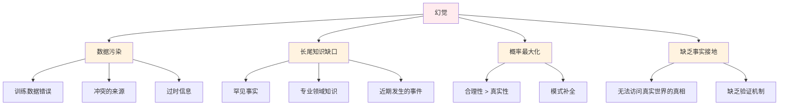

# 认知局限 - 理解模型边界

> **“理解模型不能做什么与理解它们能做什么同样重要。”**

大语言模型 (LLM) 拥有令人印象深刻的能力，但它们也存在根植于其架构和训练方式的根本性局限。理解这些边界对于构建可靠的 AI 系统至关重要。本文档涵盖了幻觉、上下文窗口限制、推理缺陷、分词局限以及规避这些约束的实用缓解策略。

---

## 智能体失败的根源：基础原理

### 预测范式

LLM 本质上是“下一个 Token 预测器”，而非推理引擎：

```
LLM(输入) = argmax P(token | 输入 tokens, 训练数据)
```

这造成了几个固有的局限：

| 局限项 | 根本原因 | 示例 |
|------------|------------|---------|
| **缺乏世界模型** | 仅基于文本预测 | 无法模拟物理现实 |
| **缺乏接地 (Grounding)** | 符号间无实体引用 | “草莓”与水果实体之间没有语义连接 |
| **无因果推理** | 统计相关性 | 无法区分因果关系与偶然巧合 |
| **无持久状态** | 无状态推理 | 每一个 Prompt 都是独立的 |

### 概率本质

```python
# 模型实际计算的过程
def llm_forward(input_text):
    # 1. 分词 (Tokenize)
    tokens = tokenizer.encode(input_text)

    # 2. 查找 Embedding
    embeddings = embedding_layer(tokens)

    # 3. 应用 Transformer 层
    hidden = transformer(embeddings)

    # 4. 投影到词汇表
    logits = output_layer(hidden)

    # 5. 返回概率分布
    probs = softmax(logits)
    return probs  # 注意：这不是推理步骤！

# 模型并不“思考” —— 它计算的是条件概率
```

---

## 幻觉 (Hallucination)

### 什么是幻觉？

幻觉是指模型生成了听起来合理但事实不正确的内容。

| 类型 | 描述 | 示例 |
|------|-------------|---------|
| **事实错误** | 信息错误 | “巴黎是德国的首都” |
| **逻辑错误** | 推理无效 | “如果 A 蕴含 B，那么 B 蕴含 A” |
| **胡编乱造** | 虚构事实 | 伪造引用、虚构人物 |
| **自我矛盾** | 陈述不一致 | 前文说“X 是真的”，后文说“X 是假的” |

### 2025：新的幻觉分类法

研究识别出了更细微的幻觉类型：

| 类型 | 描述 | 2025 典型示例 |
|------|-------------|---------------|
| **时空混乱** | 混淆时间段 | 将 2024 年的事件归因于 2022 年 |
| **来源混淆** | 揉杂多个来源 | 将来自不同论文的引用合并在一起 |
| **工具伪造** | 臆造工具输出 | 声称网页搜索返回了其实并不存在的信息 |
| **智能体循环错误** | 多步骤中的错误累积 | 错误答案 → 错误的下一步 → 级联失效 |
| **过度自信** | 对错误答案报以高置信度 | 对虚假事实表示“100% 确定” |

**2025 年幻觉现状：**
- **GPT-4o**: 事实性问答幻觉率约 ~2-5%
- **Claude 3.5 Sonnet**: 约 ~1-3%（更好的自我修正能力）
- **Llama 3.1 405B**: 约 ~3-7%（在某些任务上达到开源顶尖水平）
- **Gemini 2.5**: 约 ~2-4%（在 100 万上下文验证中表现更佳）

### 根本原因



### 缓解策略

| 策略 | 实现方式 | 有效性 | 2025 现状 |
|----------|----------------|---------------|--------------|
| **RAG** | 检索相关的上下文 | 事实查询效果极佳 | 行业标准做法 |
| **自我验证** | 要求模型检查其输出 | 中等 | 在 o1/o3 中得到增强 |
| **引用要求** | 要求输出中标注来源 | 高 | 被广泛采用 |
| **不确定性信号** | 模型指示其低置信度 | 中等 | Claude 3.5 中有显著改进 |
| **人工审计** | 评审关键输出 | 极高 | 仍然不可或缺 |
| **监督链 (Chain of Oversight)** | 多模型交叉验证 | 高 | 2025 年的突破性进展 |

---

## 上下文窗口限制

### 物理内存限制

注意力机制对于序列长度 N 需要 $O(N^2)$ 的内存：

```python
# 注意力机制的内存复杂度
def attention_memory(seq_len, d_model, num_heads):
    """
    计算注意力机制的内存需求。
    """
    # KV Cache 存储：(batch, num_heads, seq_len, head_dim)
    head_dim = d_model // num_heads
    kv_cache_size = 2 * num_heads * seq_len * head_dim * 4  # float32 为 4 字节

    # 注意力分数：(batch, num_heads, seq_len, seq_len)
    attention_scores = num_heads * seq_len * seq_len * 4

    return kv_cache_size + attention_scores

# 上下文窗口 vs 内存
# 长度 128,000: 需要超过 256 GB 显存 (单 GPU 几乎不可能)
```

### “迷失在中间”现象 (Lost in the Middle)

模型很难利用位于长上下文中间位置的信息。

**典型 U 型曲线性能**：
- 开头位置：~95% 召回率
- 中间位置：~40-60% 召回率
- 结尾位置：~92% 召回率

---

## 推理缺陷

### 反转诅咒 (The Reversal Curse)

模型很难理解它们以单一方向学习到的反向关系。
- 学习到：“A 是 B 的母亲”
- 无法推断出：“B 是 A 的儿子”

### 算术能力局限

模型无法进行精确的算术运算：
- **原因**：分词 (Tokenization) 将数字拆分为次优的分块。例如 “12345” 可能被拆分为 `["12", "345"]`，破坏了数位的权值关系。

---

## 2025：智能体失败模式

### 智能体循环累积错误

当智能体在多步工作流中使用工具时，错误会发生级联：
1. **规划阶段**：遗漏了关键需求。
2. **执行第一步**：基于错误的规划得到错误结果。
3. **执行第二步**：错误进一步叠加。
4. **最终综合**：产生了一个看似自信但完全错误的答案。

---

## 分词局限 (Tokenization)

### 字符级盲区

LLM 处理的是 Token 而非字符，这导致了特定的失败模式：
- **“Strawberry” 问题**：模型经常数错单词中的字符（如“草莓里有几个 r？”），因为它看到的是 `["straw", "berry"]` 两个 Token。

---

## 缓解策略总结

| 问题 | RAG 方案 | MCP 工具方案 |
|---------|--------------|--------------|
| **幻觉** | 将回答基于检索到的文档 | 查询事实核查服务 |
| **过时知识** | 检索最新的实时信息 | 连接外部搜索引擎 API |
| **长尾缺口** | 包含专业化的领域文档 | 使用专用工具（如计算器）|
| **无持久状态** | - | 使用内存存储工具 |

---

## 实践指南：何时信任 LLM？

| 任务类型 | 信任级别 | 理由 |
|------|-------------|-----------|
| **创意写作** | 高 | 没有标准答案 |
| **内容总结** | 高 | 输入约束了输出 |
| **代码生成** | 中 | 语法可测试，但逻辑可能有 Bug |
| **事实性问答** | 低-中 | 存在幻觉风险 |
| **数学/逻辑** | 低 | 缺乏计算引擎 |

---

## 总结

1. **幻觉是本质特性而非 Bug**：模型最大化的是概率，而非真相。
2. **上下文窗口限制**带来了检索挑战（如“迷失在中间”）。
3. **推理缺陷**源于缺乏世界模型和因果理解。
4. **缓解策略**（RAG、工具、多模型验证）对于生产级应用至关重要。
5. **明确边界**：发挥模型的长处，通过外部系统弥补其短板。
