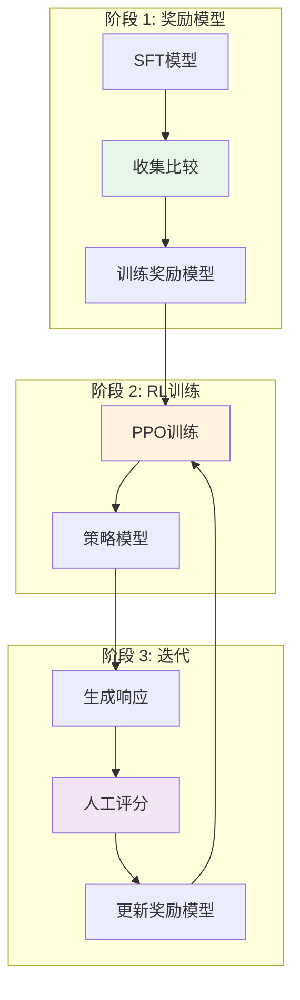

# 训练流水线 - 从随机权重到智能

> **"训练通过三个阶段将随机权重转化为智能系统：预训练、微调和对齐。"**

现代LLM不是单次端到端训练的。它们 undergo 多阶段流水线，每个阶段都建立在之前的基础上：预训练创建基础模型，SFT（监督微调）教授指令遵循，RLHF/DPO将模型与人类偏好对齐。本文档详细介绍每个阶段，包括算法、数据要求和生产级LLM训练的实现考虑。

---

## 训练阶段概览


### 阶段比较

| 阶段 | 数据 | 目标 | Token数 | 成本 | 结果 |
|-------|------|-----------|--------|------|--------|
| **预训练** | 网络文本 | 下一个token预测 | 1T-3T | ~$2M | 基础模型 |
| **SFT** | 指令 | 指令遵循 | 10M-100M | ~$10K | 可聊天 |
| **RLHF/DPO** | 比较对 | 偏好对齐 | 1M-10M | ~$5K | 对齐行为 |

---

## 预训练

### 下一个Token预测目标

所有现代LLM的基本训练目标：

```
L = -sum_{t=1}^{T} log P(x_t | x_1, x_2, ..., x_{t-1})
```

对于token序列，模型学习在给定所有先前token的情况下最大化每个token的概率。这个简单的目标，在大规模应用时， enables 复杂推理、世界知识和语言能力的 emergence。

### 为什么下一个Token预测有效

下一个token预测的力量来自：

1. **规模**: 在万亿token上训练使模型接触到多样化模式
2. **上下文**: 预测下一个token需要理解完整上下文
3. **压缩**: 模型学习语言结构的高效表示
4. **泛化**: 学习的模式泛化到未见过的组合

### 数据处理流水线

```python
import re
from typing import List, Tuple
from collections import defaultdict

class TextPreprocessor:
    """
    为LLM训练预处理文本数据。
    处理去重、质量过滤和隐私移除。
    """

    def __init__(self, min_length: int = 128, max_length: int = 4096):
        self.min_length = min_length
        self.max_length = max_length
        # 隐私移除模式
        self.email_pattern = re.compile(r'\b[A-Za-z0-9._%+-]+@[A-Za-z0-9.-]+\.[A-Z|a-z]{2,}\b')
        self.phone_pattern = re.compile(r'\b\d{3}[-.]?\d{3}[-.]?\d{4}\b')
        self.ssn_pattern = re.compile(r'\b\d{3}-\d{2}-\d{4}\b')
        self.ip_pattern = re.compile(r'\b\d{1,3}\.\d{1,3}\.\d{1,3}\.\d{1,3}\b')

    def remove_pii(self, text: str) -> str:
        """移除个人身份信息。"""
        text = self.email_pattern.sub('[EMAIL]', text)
        text = self.phone_pattern.sub('[PHONE]', text)
        text = self.ssn_pattern.sub('[SSN]', text)
        text = self.ip_pattern.sub('[IP]', text)
        return text

    def check_quality(self, text: str) -> bool:
        """
        基于启发式检查文本质量。
        如果文本通过质量检查则返回True。
        """
        # 长度检查
        words = text.split()
        if len(words) < self.min_length or len(words) > self.max_length:
            return False

        # 平均词长度（拒绝过短/过长词）
        mean_word_len = sum(len(w) for w in words) / len(words)
        if mean_word_len < 3 or mean_word_len > 10:
            return False

        # 特殊字符比例（太多=垃圾）
        special_ratio = sum(1 for c in text if not c.isalnum() and not c.isspace()) / len(text)
        if special_ratio > 0.3:
            return False

        # 重复检查（检测"aaaaaaa..."模式）
        if len(set(words)) / len(words) < 0.2:
            return False

        return True

    def deduplicate_by_ngram(self, texts: List[str], n: int = 13) -> List[str]:
        """
        使用n-gram重叠移除近似重复。
        使用MinHash类似方法提高效率。
        """
        seen_ngrams = set()
        unique_texts = []

        for text in texts:
            words = text.split()
            if len(words) < n:
                continue

            # 采样n-gram
            ngrams = [' '.join(words[i:i+n]) for i in range(0, len(words) - n, n)]

            # 检查是否见过任何n-gram
            if not any(ngram in seen_ngrams for ngram in ngrams[:5]):
                seen_ngrams.update(ngrams)
                unique_texts.append(text)

        return unique_texts

# 用法
preprocessor = TextPreprocessor(min_length=128, max_length=4096)

# 处理一批文本
raw_texts = [
    "这是一个示例文档，包含一些contact@example.com内容...",
    "另一个文档质量问题" * 10,  # 过于重复
]

clean_texts = []
for text in raw_texts:
    text = preprocessor.remove_pii(text)
    if preprocessor.check_quality(text):
        clean_texts.append(text)

print(f"处理了 {len(clean_texts)}/{len(raw_texts)} 个文本")
```

### 课程学习策略

训练通过精心设计的课程阶段进行：

```python
from enum import Enum
from dataclasses import dataclass

class TrainingStage(Enum):
    """预训练的课程学习阶段。"""
    FOUNDATION = "foundation"      # 高质量、多样化文本
    KNOWLEDGE = "knowledge"        # 专注于事实内容
    REASONING = "reasoning"        # 逻辑推理模式
    SYNTHESIS = "synthesis"        # 多步问题解决

@dataclass
class StageConfig:
    """训练阶段的配置。"""
    stage: TrainingStage
    data_proportion: float        # 总数据的比例
    learning_rate: float
    batch_size: int
    duration_steps: int
    description: str

CURRICULUM = [
    StageConfig(
        stage=TrainingStage.FOUNDATION,
        data_proportion=0.40,
        learning_rate=3e-4,
        batch_size=512,
        duration_steps=400000,
        description="构建基础语言理解"
    ),
    StageConfig(
        stage=TrainingStage.KNOWLEDGE,
        data_proportion=0.30,
        learning_rate=2e-4,
        batch_size=512,
        duration_steps=300000,
        description="获取世界知识和事实"
    ),
    StageConfig(
        stage=TrainingStage.REASONING,
        data_proportion=0.20,
        learning_rate=1.5e-4,
        batch_size=512,
        duration_steps=200000,
        description="开发推理能力"
    ),
    StageConfig(
        stage=TrainingStage.SYNTHESIS,
        data_proportion=0.10,
        learning_rate=1e-4,
        batch_size=512,
        duration_steps=100000,
        description="集成技能以完成复杂任务"
    ),
]

def get_curriculum_lr(step: int, curriculum: list[StageConfig]) -> float:
    """基于课程阶段获取学习率。"""
    total_steps = sum(c.duration_steps for c in curriculum)
    current_step = step % total_steps

    cumulative_steps = 0
    for config in curriculum:
        if cumulative_steps <= current_step < cumulative_steps + config.duration_steps:
            return config.learning_rate
        cumulative_steps += config.duration_steps

    return curriculum[-1].learning_rate
```

### Python实现

```python
import torch
import torch.nn as nn
import torch.nn.functional as F

def compute_language_model_loss(logits: torch.Tensor, targets: torch.Tensor) -> torch.Tensor:
    """
    计算语言建模的交叉熵损失。

    Args:
        logits: 模型输出，形状为 (batch, seq_len, vocab_size)
        targets: 目标token ID，形状为 (batch, seq_len)
    """
    # 展平用于交叉熵
    batch_size, seq_len, vocab_size = logits.shape
    logits_flat = logits.view(-1, vocab_size)
    targets_flat = targets.view(-1)

    # 计算交叉熵损失
    loss = F.cross_entropy(logits_flat, targets_flat, ignore_index=-100)

    return loss

# 示例
batch_size, seq_len, vocab_size = 2, 128, 50000
logits = torch.randn(batch_size, seq_len, vocab_size)
targets = torch.randint(0, vocab_size, (batch_size, seq_len))

loss = compute_language_model_loss(logits, targets)
print(f"损失: {loss.item():.4f}")
# 典型预训练损失: 2.0-4.0（训练前）
# 好模型收敛到 ~1.8-2.5
```

### 混合精度训练

混合精度训练使用FP16/BF16进行计算，同时保持FP32主权重：

```python
import torch
from torch.cuda.amp import autocast, GradScaler

class MixedPrecisionTrainer:
    """
    支持混合精度的训练器。
    在可能的情况下使用BF16以获得更好的数值稳定性。
    """

    def __init__(self, model, optimizer, device='cuda'):
        self.model = model.to(device)
        self.optimizer = optimizer
        self.device = device

        # 检查BF16支持
        if torch.cuda.is_bf16_supported():
            self.dtype = torch.bfloat16
            print("使用BF16进行训练")
        else:
            self.dtype = torch.float16
            self.scaler = GradScaler()
            print("使用FP16和GradScaler进行训练")

    def training_step(self, batch):
        """带混合精度的单步训练。"""
        input_ids = batch['input_ids'].to(self.device)
        attention_mask = batch['attention_mask'].to(self.device)
        targets = input_ids[:, 1:].contiguous()

        self.optimizer.zero_grad()

        if self.dtype == torch.bfloat16:
            # BF16不需要梯度缩放
            with autocast(dtype=torch.bfloat16):
                logits = self.model(input_ids[:, :-1], attention_mask[:, :-1])
                loss = compute_language_model_loss(logits, targets)

            loss.backward()
            torch.nn.utils.clip_grad_norm_(self.model.parameters(), max_norm=1.0)
            self.optimizer.step()
        else:
            # FP16带梯度缩放
            with autocast(dtype=torch.float16):
                logits = self.model(input_ids[:, :-1], attention_mask[:, :-1])
                loss = compute_language_model_loss(logits, targets)

            self.scaler.scale(loss).backward()
            self.scaler.unscale_(self.optimizer)
            torch.nn.utils.clip_grad_norm_(self.model.parameters(), max_norm=1.0)
            self.scaler.step(self.optimizer)
            self.scaler.update()

        return loss.item()
```

### FlashAttention集成

FlashAttention是一种内存高效的注意力机制，对大规模训练至关重要：

```python
try:
    from flash_attn import flash_attn_func
    FLASH_ATTENTION_AVAILABLE = True
except ImportError:
    FLASH_ATTENTION_AVAILABLE = False
    print("FlashAttention不可用，使用标准注意力")

class FlashAttentionBlock(nn.Module):
    """
    带FlashAttention的Transformer块。
    内存高效：注意力复杂度从O(N^2)降到O(N)。
    """

    def __init__(self, d_model: int, num_heads: int, d_ff: int, dropout: float = 0.1):
        super().__init__()
        self.num_heads = num_heads
        self.head_dim = d_model // num_heads

        self.qkv_proj = nn.Linear(d_model, 3 * d_model, bias=False)
        self.out_proj = nn.Linear(d_model, d_model, bias=False)

        self.ffn = nn.Sequential(
            nn.Linear(d_model, d_ff),
            nn.GELU(),
            nn.Dropout(dropout),
            nn.Linear(d_ff, d_model),
            nn.Dropout(dropout)
        )

        self.norm1 = nn.LayerNorm(d_model)
        self.norm2 = nn.LayerNorm(d_model)

    def forward(self, x, attention_mask=None):
        """
        Args:
            x: (batch, seq_len, d_model)
            attention_mask: (batch, seq_len) 或 None
        """
        # 带FlashAttention的自注意力
        residual = x
        x = self.norm1(x)

        if FLASH_ATTENTION_AVAILABLE:
            # FlashAttention期望 (batch, seq_len, 3, heads, head_dim)
            batch_size, seq_len, _ = x.shape
            qkv = self.qkv_proj(x).reshape(batch_size, seq_len, 3, self.num_heads, self.head_dim)
            q, k, v = qkv.unbind(dim=2)

            # FlashAttention需要单独处理因果掩码
            x = flash_attn_func(q, k, v, causal=True)
            x = self.out_proj(x.reshape(batch_size, seq_len, -1))
        else:
            # 回退到标准注意力
            qkv = self.qkv_proj(x)
            q, k, v = qkv.chunk(3, dim=-1)
            q = q.view(batch_size, seq_len, self.num_heads, self.head_dim).transpose(1, 2)
            k = k.view(batch_size, seq_len, self.num_heads, self.head_dim).transpose(1, 2)
            v = v.view(batch_size, seq_len, self.num_heads, self.head_dim).transpose(1, 2)

            attn = (q @ k.transpose(-2, -1)) / (self.head_dim ** 0.5)

            # 因果掩码
            causal_mask = torch.triu(torch.ones(seq_len, seq_len), diagonal=1).bool()
            attn = attn.masked_fill(causal_mask.to(x.device), float('-inf'))

            attn = attn.softmax(dim=-1)
            x = (attn @ v).transpose(1, 2).reshape(batch_size, seq_len, -1)
            x = self.out_proj(x)

        x = x + residual

        # FFN
        residual = x
        x = self.norm2(x)
        x = self.ffn(x) + residual

        return x
```

### 高级优化器配置

```python
from torch.optim import AdamW
from torch.optim.lr_scheduler import CosineAnnealingLR, LinearLR, SequentialLR

def create_optimizer_and_scheduler(model, config):
    """
    创建带warmup的优化器和学习率调度器。

    使用带cosine衰减和linear warmup的AdamW。
    """
    # 为权重衰减分离参数
    # 不要对bias、layer norm和embedding参数应用权重衰减
    no_decay = ['bias', 'layer_norm.weight', 'lm_head.weight']
    optimizer_grouped_parameters = [
        {
            'params': [p for n, p in model.named_parameters()
                     if not any(nd in n for nd in no_decay)],
            'weight_decay': config.weight_decay,
        },
        {
            'params': [p for n, p in model.named_parameters()
                     if any(nd in n for nd in no_decay)],
            'weight_decay': 0.0,
        },
    ]

    optimizer = AdamW(
        optimizer_grouped_parameters,
        lr=config.learning_rate,
        betas=(config.beta1, config.beta2),
        eps=1e-8,
    )

    # Warmup调度器
    warmup_scheduler = LinearLR(
        optimizer,
        start_factor=0.0,
        end_factor=1.0,
        total_iters=config.warmup_steps
    )

    # Cosine衰减调度器
    cosine_scheduler = CosineAnnealingLR(
        optimizer,
        T_max=config.max_steps - config.warmup_steps,
        eta_min=config.learning_rate * config.min_lr_ratio
    )

    # 顺序调度器：先warmup然后cosine衰减
    scheduler = SequentialLR(
        optimizer,
        schedulers=[warmup_scheduler, cosine_scheduler],
        milestones=[config.warmup_steps]
    )

    return optimizer, scheduler

# 用法
optimizer, scheduler = create_optimizer_and_scheduler(model, config)

for step, batch in enumerate(dataloader):
    loss = pretrain_step(model, optimizer, config, batch)
    scheduler.step()

    if step % 100 == 0:
        current_lr = scheduler.get_last_lr()[0]
        print(f"步骤 {step}: 损失={loss:.4f}, lr={current_lr:.2e}")
```

### 缩放定律

**Chinchilla缩放定律**（Hoffmann等人，2022）建立了最优计算分配：

| 参数数量 | 最优训练Token数 | 计算（FLOPs） |
|-----------------|------------------------|-----------------|
| 1B | 20B | 1.6e19 |
| 7B | 1.4T | 8.2e20 |
| 70B | 1.4T | 8.2e21 |
| 400B | 3T+ | 3e23 |

**关键见解**: 模型应该为每个参数训练约20个token以获得最佳性能。

### 缩放定律公式

```
L(N, D) = E + A/N^alpha + B/D^beta
```

其中：
- `L` 是损失
- `N` 是参数数量
- `D` 是数据量（token数）
- `E`, `A`, `B`, `alpha`, `beta` 是拟合常数

```python
def chinchilla_loss(params: float, tokens: float) -> float:
    """
    近似Chinchilla缩放定律。

    Args:
        params: 参数数量（十亿）
        tokens: 训练token数（万亿）
    """
    E = 1.69  # 不可减少的损失
    A = 406.4
    B = 998.1
    alpha = 0.34
    beta = 0.28

    loss = E + A / (params ** alpha) + B / (tokens ** beta)
    return loss

# 为7B模型找最优数据
params_7b = 7
optimal_tokens_7b = 20 * params_7b  # Chinchilla: 每个参数约20个token
loss_7b = chinchilla_loss(params_7b, optimal_tokens_7b / 1000)
print(f"7B最优token数: {optimal_tokens_7b}B, 损失: {loss_7b:.3f}")
```

### 训练配置示例

```python
from dataclasses import dataclass
from typing import Optional

@dataclass
class PreTrainingConfig:
    """LLM预训练配置。"""

    # 模型架构
    d_model: int = 4096
    num_heads: int = 32
    num_layers: int = 32
    d_ff: int = 10952  # SwiGLU的8/3 * d_model

    # 训练超参数
    batch_size: int = 512  # 全局批量大小
    micro_batch_size: int = 4  # 每GPU批量大小
    learning_rate: float = 3e-4
    weight_decay: float = 0.1
    beta1: float = 0.9
    beta2: float = 0.95

    # 学习率调度
    warmup_steps: int = 2000
    max_steps: int = 1000000
    min_lr_ratio: float = 0.1

    # 数据
    vocab_size: int = 128000
    max_seq_len: int = 4096

    def get_lr(self, step: int) -> float:
        """带warmup的cosine学习率调度。"""
        if step < self.warmup_steps:
            return self.learning_rate * step / self.warmup_steps

        progress = (step - self.warmup_steps) / (self.max_steps - self.warmup_steps)
        cosine_decay = 0.5 * (1 + math.cos(math.pi * progress))
        return self.min_lr_ratio * self.learning_rate + (1 - self.min_lr_ratio) * self.learning_rate * cosine_decay

# 训练循环骨架
def pretrain_step(model, optimizer, config, batch):
    """单步预训练。"""
    input_ids = batch['input_ids']  # (batch, seq_len)
    attention_mask = batch['attention_mask']

    # 前向传播
    logits = model(input_ids, attention_mask)

    # 计算损失（用于下一个token预测的偏移）
    shift_logits = logits[..., :-1, :].contiguous()
    shift_labels = input_ids[..., 1:].contiguous()
    loss = compute_language_model_loss(shift_logits, shift_labels)

    # 反向传播
    loss.backward()

    # 梯度裁剪
    torch.nn.utils.clip_grad_norm_(model.parameters(), max_norm=1.0)

    # 优化器步骤
    optimizer.step()
    optimizer.zero_grad()

    return loss.item()
```

### Emergent能力

在规模下出现但未明确训练的能力：

| 能力 | 出现位置 | 描述 |
|---------|------------|-------------|
| **上下文学习** | ~10B+ | 从prompt中的例子学习 |
| **思维链** | ~30B+ | 多步推理 |
| **指令遵循** | ~7B+（带SFT） | 理解并遵循指示 |
| **代码生成** | ~7B+ | 编写和调试代码 |
| **多语言** | ~7B+ | 跨语言迁移 |

**重要**: Emergent能力不是保证的 - 它们取决于训练数据和架构选择。

---

## 监督微调 (SFT)

### 指令微调

SFT教会基础模型遵循指令并适当格式化响应。


### 数据格式

SFT使用prompt-response对：

```python
sft_data = [
    {
        "instruction": "用简单术语解释量子计算。",
        "input": "",
        "output": "量子计算就像..."
    },
    {
        "instruction": "写一个Python函数来反转字符串。",
        "input": "",
        "output": "def reverse_string(s):\n    return s[::-1]"
    },
]

# 为训练格式化SFT示例
def format_sft_prompt(example, tokenizer):
    """
    为训练格式化SFT示例。
    使用chat模板格式。
    """
    messages = [
        {"role": "user", "content": example["instruction"] + " " + example["input"]},
        {"role": "assistant", "content": example["output"]}
    ]

    # 应用chat模板
    prompt = tokenizer.apply_chat_template(
        messages,
        tokenize=False,
        add_generation_prompt=False
    )

    return prompt

# Llama 3的示例prompt：
# <|begin_of_text|><|start_header_id|>user<|end_header_id|>\n\n解释量子计算...<|eot_id|><|start_header_id|>assistant<|end_header_id|>\n\n量子计算就像...<|eot_id|>
```

### 训练配置

```python
@dataclass
class SFTConfig:
    """监督微调配置。"""

    # 使用基础模型配置
    base_model_config: PreTrainingConfig = field(default_factory=PreTrainingConfig)

    # SFT特定
    learning_rate: float = 2e-5  # 低于预训练
    batch_size: int = 64  # 更小批量
    epochs: int = 3  # 对SFT数据多次遍历

    # 数据
    max_length: int = 2048  # 比预训练短

    # 正则化
    weight_decay: float = 0.01
    warmup_ratio: float = 0.03

def sft_loss(logits, labels, attention_mask):
    """
    计算带掩码位置的SFT损失。

    只在assistant响应上计算损失，不在指令上。
    """
    shift_logits = logits[..., :-1, :].contiguous()
    shift_labels = labels[..., 1:].contiguous()
    shift_mask = attention_mask[..., 1:].contiguous()

    # 只在掩码激活处计算损失（assistant tokens）
    loss = F.cross_entropy(
        shift_logits.view(-1, shift_logits.size(-1)),
        shift_labels.view(-1),
        reduction='none'
    )

    # 应用掩码
    loss = loss.view(shift_labels.size()) * shift_mask
    return loss.sum() / shift_mask.sum()
```

### 质量而非数量

| 方面 | 预训练 | SFT |
|--------|--------------|-----|
| **数据量** | 万亿token | 百万示例 |
| **数据质量** | 过滤但多样化 | 手工策划 |
| **成本** | 极高 | 中等 |
| **关键因素** | 数量和多样性 | 质量和多样性 |

**SFT数据策划原则**:
1. **正确性**: 验证响应准确性
2. **多样性**: 覆盖不同任务和领域
3. **格式一致性**: 标准化指令格式
4. **长度变化**: 包含短和长响应
5. **复杂度分级**: 从易到难的例子

### 参数高效微调 (PEFT)

PEFT方法使微调大模型的计算要求显著降低：

#### LoRA (低秩适应)

LoRA向现有权重添加可训练的低秩矩阵：

```python
class LoRALinear(nn.Module):
    """
    LoRA增强的线性层。
    冻结原始权重并训练低秩适配器。
    """

    def __init__(
        self,
        in_features: int,
        out_features: int,
        rank: int = 8,
        alpha: float = 16.0,
        dropout: float = 0.1
    ):
        super().__init__()
        # 冻结原始权重
        self.linear = nn.Linear(in_features, out_features, bias=False)
        self.linear.weight.requires_grad = False

        # 可训练的低秩适配器
        self.lora_A = nn.Parameter(torch.randn(in_features, rank) * 0.01)
        self.lora_B = nn.Parameter(torch.zeros(rank, out_features))
        self.scaling = alpha / rank

        self.dropout = nn.Dropout(dropout)

        # 用零重置lora_B（无初始影响）
        nn.init.zeros_(self.lora_B)

    def forward(self, x):
        """
        原始权重 + 低秩适应：
        y = Wx + BAx * scaling
        """
        # 原始路径（冻结）
        result = self.linear(x)

        # LoRA路径（可训练）
        lora_result = self.dropout(x)
        lora_result = lora_result @ self.lora_A  # (batch, rank)
        lora_result = lora_result @ self.lora_B   # (batch, out_features)
        result = result + lora_result * self.scaling

        return result

def apply_lora_to_model(model, rank: int = 8, alpha: float = 16.0):
    """
    对模型中的所有线性层应用LoRA。
    """
    for name, module in model.named_modules():
        if isinstance(module, nn.Linear) and 'lm_head' not in name:
            # 获取原始层配置
            in_features = module.in_features
            out_features = module.out_features

            # 创建LoRA增强层
            lora_layer = LoRALinear(in_features, out_features, rank, alpha)
            lora_layer.linear.weight.data = module.weight.data.clone()

            # 在模型中替换
            parent_name = '.'.join(name.split('.')[:-1])
            child_name = name.split('.')[-1]
            parent = model.get_submodule(parent_name) if parent_name else model
            setattr(parent, child_name, lora_layer)

    return model
```

#### QLoRA (量化LoRA)

QLoRA将4位量化与LoRA结合以获得最大效率：

```python
import bitsandbytes as bnb

class QLoRALinear(nn.Module):
    """
    QLoRA: 4位量化基础权重 + LoRA适配器。
    使用NormalFloat4 (NF4) 量化以获得最佳分位数分布。
    """

    def __init__(
        self,
        in_features: int,
        out_features: int,
        rank: int = 8,
        alpha: float = 16.0,
        dropout: float = 0.1
    ):
        super().__init__()

        # 4位量化基础权重（冻结）
        self.linear = bnb.nn.Linear4bit(
            in_features,
            out_features,
            bias=False,
            compute_dtype=torch.bfloat16
        )
        self.linear.weight.requires_grad = False

        # FP16 LoRA适配器（可训练）
        self.lora_A = nn.Parameter(torch.randn(in_features, rank) * 0.01)
        self.lora_B = nn.Parameter(torch.zeros(rank, out_features))
        self.scaling = alpha / rank

        self.dropout = nn.Dropout(dropout)

    def forward(self, x):
        # 解量化 + 计算原始路径
        result = self.linear(x)

        # LoRA路径
        lora_result = self.dropout(x)
        lora_result = lora_result @ self.lora_A
        lora_result = lora_result @ self.lora_B
        result = result + lora_result * self.scaling

        return result
```

### PEFT比较

| 方法 | 内存 | 速度 | 质量 | 使用场景 |
|--------|--------|-------|---------|----------|
| **完整微调** | 100% | 1x | 最佳 | 当资源可用时 |
| **LoRA (rank=8)** | ~25% | 1x | 接近最佳 | 大多数微调任务 |
| **LoRA (rank=64)** | ~50% | 1x | 最佳 | 复杂任务、领域 |
| **QLoRA (rank=8)** | ~12% | 0.9x | 良好 | 资源受限 |
| **适配器层** | ~30% | 0.95x | 良好 | 多任务学习 |

### 2025: 高级PEFT技术

**DoRA (权重分解LoRA)** - 更好的适应控制：

```python
class DoRALayer(nn.Module):
    """
    DoRA: 权重分解低秩适应。

    参考: https://arxiv.org/abs/2402.09353
    """
    def __init__(self, in_features: int, rank: int = 8, alpha: float = 16.0):
        self.rank = rank
        self.alpha = alpha / rank  # 缩放因子

        # 标准LoRA组件
        self.lora_A = nn.Parameter(torch.randn(in_features, rank))
        self.lora_B = nn.Parameter(torch.zeros(rank, in_features))

        # DoRA添加：幅度和方向
        self.magnitude = nn.Parameter(torch.ones(1))
        self.direction = nn.Parameter(torch.randn(in_features) / torch.norm(torch.randn(in_features)))

    def forward(self, x: torch.Tensor) -> torch.Tensor:
        # LoRA delta: BA
        lora_delta = self.lora_B @ (self.lora_A * self.magnitude)

        # 方向加权更新
        delta = self.alpha * (lora_delta * self.direction)

        return x + delta

# 优势：
# - 更好的适应控制
# - 大rank训练更稳定
# - 复杂任务上改进性能
# - 比标准LoRA提高1-2%质量
```

**LoftQ** - 量化感知LoRA训练：

```python
def loftq_training(model, dataset, bits=4):
    """
    LoftQ: 在量化模型上训练LoRA，无需解量化。

    参考: https://arxiv.org/abs/2310.04635
    """
    # 步骤1: 将基础模型量化到INT4
    quantized_model = quantize_model(model, bits=bits)

    # 步骤2: 用量化感知初始化LoRA
    lora = initialize_lora_aware(quantized_model, rank=8)

    # 步骤3: 用straight-through estimator训练LoRA
    for batch in dataset:
        # 通过量化模型前向传播
        output = quantized_model(batch)
        loss = compute_loss(output, batch["labels"])

        # 带STE的反向传播
        loss.backward()
        optimizer.step()

    # 结果: 8倍内存减少，达到完整微调质量的97%
```

**AdapterFusion** - 合并适配器以实现高效多任务学习：

```python
class AdapterFusion:
    """
    AdapterFusion: 将多个任务适配器合并到基础模型中。

    参考: https://arxiv.org/abs/2311.15961
    """
    def __init__(self, base_model, task_adapters: dict):
        self.base_model = base_model
        self.task_adapters = task_adapters

    def fuse(self, tasks: list[str]) -> nn.Module:
        """
        将多个任务适配器合并到基础模型中。
        """
        # 平均适配器权重
        fused_adapter = self.average_adapters(tasks)

        # 合并到基础模型
        fused_model = merge_adapter_into_base(self.base_model, fused_adapter)

        return fused_model

    def average_adapters(self, tasks: list[str]) -> dict:
        """跨任务平均适配器权重。"""
        adapters = [self.task_adapters[task] for task in tasks]

        averaged = {}
        for key in adapters[0].keys():
            averaged[key] = torch.mean(
                torch.stack([a[key] for a in adapters]),
                dim=0
            )

        return averaged
```

**2025 PEFT比较：**

| 方法 | 内存 | 质量 | 训练速度 | 推理 | 最佳用于 |
|--------|--------|---------|---------------|-----------|----------|
| **LoRA (rank=8)** | 25% | 98-99% | 1x | 1x | 通用微调 |
| **QLoRA (rank=8)** | 12% | 97-98% | 1x | 1x | 资源受限 |
| **DoRA** | 25% | 99-100% | 1x | 1x | 复杂任务 |
| **LoftQ** | 12% | 97% | 0.9x | 1.2x更快 | 在量化模型上 |
| **AdapterFusion** | 30% | 95-97% | 1x | 1x（无适配器开销） | 多任务部署 |

---

同时在多个任务上训练以获得更好的泛化：

```python
class MultiTaskSFTDataset(torch.utils.data.Dataset):
    """
    从多个任务类型采样的数据集。
    确保任务间平衡采样。
    """

    def __init__(self, task_datasets: dict, samples_per_task: int = 1000):
        """
        Args:
            task_datasets: Dict of {task_name: dataset}
            samples_per_task: 每个任务每个轮次抽取多少样本
        """
        self.task_datasets = task_datasets
        self.task_names = list(task_datasets.keys())
        self.samples_per_task = samples_per_task

        # 创建任务ID嵌入
        self.task_to_id = {name: i for i, name in enumerate(self.task_names)}

        # 为每个任务预计算索引
        self.task_indices = {}
        for task_name, dataset in task_datasets.items():
            self.task_indices[task_name] = list(range(len(dataset)))

    def __len__(self):
        return len(self.task_names) * self.samples_per_task

    def __getitem__(self, idx):
        # 轮询任务采样
        task_idx = idx % len(self.task_names)
        task_name = self.task_names[task_idx]

        # 从此任务采样
        dataset = self.task_datasets[task_name]
        sample_idx = random.choice(self.task_indices[task_name])
        example = dataset[sample_idx]

        # 添加任务标识符
        example['task_id'] = self.task_to_id[task_name]
        example['task_name'] = task_name

        return example

# 用法：为不同任务类型创建数据集
task_datasets = {
    'chat': ChatDataset(),
    'code': CodeDataset(),
    'math': MathDataset(),
    'reasoning': ReasoningDataset(),
    'summarization': SummarizationDataset(),
}

multi_task_dataset = MultiTaskSFTDataset(task_datasets)
dataloader = DataLoader(multi_task_dataset, batch_size=32, shuffle=True)
```

### 带PEFT的SFT训练循环

```python
def train_sft_with_lora(model, dataloader, config):
    """
    使用LoRA为SFT训练模型。
    只更新LoRA参数。
    """
    # 应用LoRA
    model = apply_lora_to_model(model, rank=config.lora_rank, alpha=config.lora_alpha)

    # 只训练LoRA参数
    trainable_params = [p for n, p in model.named_parameters() if 'lora_' in n]
    optimizer = torch.optim.AdamW(trainable_params, lr=config.learning_rate)

    model.train()
    for epoch in range(config.epochs):
        total_loss = 0
        for step, batch in enumerate(dataloader):
            input_ids = batch['input_ids'].to(config.device)
            attention_mask = batch['attention_mask'].to(config.device)
            labels = batch['labels'].to(config.device)

            # 前向传播
            outputs = model(
                input_ids=input_ids,
                attention_mask=attention_mask,
                labels=labels
            )

            loss = outputs.loss

            # 反向传播（只有LoRA参数获得梯度）
            loss.backward()
            torch.nn.utils.clip_grad_norm_(trainable_params, max_norm=1.0)
            optimizer.step()
            optimizer.zero_grad()

            total_loss += loss.item()

            if step % 100 == 0:
                avg_loss = total_loss / (step + 1)
                print(f"轮次 {epoch}, 步骤 {step}: 损失 = {avg_loss:.4f}")

    return model
```

---

## RLHF (来自人类反馈的强化学习)

### 三阶段过程



### 阶段 1: 奖励模型训练

```python
class RewardModel(nn.Module):
    """
    评分响应的奖励模型。
    使用带分类头的基础模型。
    """
    def __init__(self, base_model, d_model):
        super().__init__()
        self.base_model = base_model
        self.reward_head = nn.Linear(d_model, 1)
        self.base_model.lm_head = None  # 移除LM头

    def forward(self, input_ids, attention_mask):
        """
        返回标量奖励分数。

        Args:
            input_ids: (batch, seq_len)
            attention_mask: (batch, seq_len)
        Returns:
            reward: (batch, 1)
        """
        # 获取基础模型输出（最后一个token的隐藏状态）
        outputs = self.base_model(input_ids, attention_mask, output_hidden_states=True)
        last_hidden = outputs.last_hidden_state[:, -1, :]  # (batch, d_model)

        # 用奖励头评分
        reward = self.reward_head(last_hidden)  # (batch, 1)
        return reward

def reward_model_loss(reward_chosen, reward_rejected):
    """
    奖励模型训练的排序损失。

    Args:
        reward_chosen: 选中响应的奖励
        reward_rejected: 拒绝响应的奖励
    """
    # 基于边界的损失：最大化reward_chosen - reward_rejected
    loss = -torch.log(torch.sigmoid(reward_chosen - reward_rejected)).mean()
    return loss

# 训练数据格式
comparison_data = [
    {
        "prompt": "法国的首都是什么？",
        "chosen": "法国的首都是巴黎。",
        "rejected": "巴黎。"
    },
    {
        "prompt": "解释光合作用。",
        "chosen": "光合作用是植物利用阳光...",
        "rejected": "植物利用阳光制造食物。"
    },
]

# 训练步骤
def train_reward_step(model, optimizer, batch):
    """单步奖励模型训练。"""
    chosen_input = batch['chosen_input_ids']
    rejected_input = batch['rejected_input_ids']
    chosen_mask = batch['chosen_attention_mask']
    rejected_mask = batch['rejected_attention_mask']

    # 获取奖励
    reward_chosen = model(chosen_input, chosen_mask)
    reward_rejected = model(rejected_input, rejected_mask)

    # 计算排序损失
    loss = reward_model_loss(reward_chosen, reward_rejected)

    # 反向传播
    loss.backward()
    optimizer.step()
    optimizer.zero_grad()

    return loss.item()
```

### 阶段 2: PPO训练

PPO（Proximal Policy Optimization）使用奖励信号更新策略模型。

```python
def ppo_loss(
    log_probs: torch.Tensor,
    old_log_probs: torch.Tensor,
    advantages: torch.Tensor,
    clip_epsilon: float = 0.2
) -> torch.Tensor:
    """
    计算PPO裁剪代理损失。

    Args:
        log_probs: 当前策略对数概率
        old_log_probs: 旧策略对数概率（来自参考模型）
        advantages: 优势估计
        clip_epsilon: 裁剪参数
    """
    # 概率比率
    ratio = torch.exp(log_probs - old_log_probs)

    # 裁剪代理损失
    surr1 = ratio * advantages
    surr2 = torch.clamp(ratio, 1 - clip_epsilon, 1 + clip_epsilon) * advantages

    # PPO损失（负因为我们想最大化）
    loss = -torch.min(surr1, surr2).mean()

    return loss

def compute_advantages(rewards, values, gamma=0.99, lambda_gae=0.95):
    """
    计算广义优势估计（GAE）。

    Args:
        rewards: 每步的奖励
        values: 价值函数估计
        gamma: 折扣因子
        lambda_gae: GAE参数
    """
    advantages = []
    gae = 0

    # 反向迭代计算GAE
    for t in reversed(range(len(rewards))):
        if t == len(rewards) - 1:
            next_value = 0
        else:
            next_value = values[t + 1]

        delta = rewards[t] + gamma * next_value - values[t]
        gae = delta + gamma * lambda_gae * gae
        advantages.insert(0, gae)

    return torch.tensor(advantages)

# 完整PPO步骤
def ppo_step(
    policy_model,
    reference_model,
    value_model,
    reward_model,
    optimizer,
    batch,
    clip_epsilon=0.2,
    kl_coef=0.1
):
    """
    单步PPO优化。
    """
    prompts = batch['prompts']
    responses = batch['responses']

    # 获取当前策略log probs
    policy_output = policy_model(prompts, responses)
    current_log_probs = policy_output.log_probs

    # 获取参考策略log probs（冻结）
    with torch.no_grad():
        ref_output = reference_model(prompts, responses)
        old_log_probs = ref_output.log_probs

    # 获取价值估计
    values = value_model(prompts, responses)

    # 获取奖励
    with torch.no_grad():
        rewards = reward_model(prompts, responses)

    # 计算优势
    advantages = compute_advantages(rewards, values)

    # 归一化优势
    advantages = (advantages - advantages.mean()) / (advantages.std() + 1e-8)

    # 计算PPO损失
    policy_loss = ppo_loss(current_log_probs, old_log_probs, advantages)

    # 价值函数损失
    value_loss = F.mse_loss(values, rewards)

    # KL散度惩罚（防止策略漂移）
    kl_penalty = (current_log_probs - old_log_probs).pow(2).mean()

    # 总损失
    loss = policy_loss + value_loss + kl_coef * kl_penalty

    # 反向传播
    loss.backward()
    torch.nn.utils.clip_grad_norm_(policy_model.parameters(), max_norm=1.0)
    optimizer.step()
    optimizer.zero_grad()

    return {
        'policy_loss': policy_loss.item(),
        'value_loss': value_loss.item(),
        'kl_penalty': kl_penalty.item(),
        'total_loss': loss.item()
    }
```

### RLHF挑战

| 挑战 | 描述 | 缓解措施 |
|-----------|-------------|------------|
| **奖励黑客** | 模型学会利用奖励函数 | 使用KL惩罚、参考模型 |
| **训练不稳定** | PPO可能不稳定 | 仔细调整超参数 |
| **标注成本** | 人工标注昂贵 | 使用AI辅助标注 |
| **主观性** | 人类偏好差异 | 聚合多个评分者 |

---

## DPO (直接偏好优化)

### 为什么使用DPO？

DPO通过消除单独的奖励模型和PPO训练需求来简化RLHF。

**比较：**

| 方面 | RLHF | DPO |
|--------|------|-----|
| **奖励模型** | 需要 | 不需要 |
| **训练算法** | PPO（复杂） | 二元交叉熵 |
| **稳定性** | 敏感 | 更稳定 |
| **实现** | 复杂 | 简单 |
| **内存使用** | 3倍模型 | 2倍模型 |
| **训练速度** | 较慢 | 更快 |

### 对齐算法系列

#### DPO (直接偏好优化)

DPO使用偏好对直接优化策略：

```python
def dpo_loss(
    policy_chosen_logps: torch.Tensor,
    policy_rejected_logps: torch.Tensor,
    reference_chosen_logps: torch.Tensor,
    reference_rejected_logps: torch.Tensor,
    beta: float = 0.1
) -> torch.Tensor:
    """
    计算DPO损失。

    Args:
        policy_chosen_logps: 策略对选中响应的log概率
        policy_rejected_logps: 策略对拒绝响应的log概率
        reference_chosen_logps: 参考模型对选中响应的log概率
        reference_rejected_logps: 参考模型对拒绝响应的log概率
        beta: DPO温度参数
    """
    # 计算log比率
    policy_logratios = policy_chosen_logps - policy_rejected_logps
    reference_logratios = reference_chosen_logps - reference_rejected_logps

    # DPO损失
    losses = -F.logsigmoid(beta * (policy_logratios - reference_logratios))
    return losses.mean()
```

#### KTO (Kahneman-Tversky优化)

KTO优化人类偏好中的不对称性：

```python
def kto_loss(
    policy_logps: torch.Tensor,
    reference_logps: torch.Tensor,
    is_chosen: torch.Tensor,
    beta: float = 0.1
) -> torch.Tensor:
    """
    Kahneman-Tversky优化损失。
    不对称地处理选中和拒绝的响应。

    Args:
        policy_logps: 策略模型的log概率
        reference_logps: 参考模型的log概率
        is_chosen: 布尔张量，表示选中（True）vs拒绝（False）
        beta: 温度参数
    """
    # 计算KL散度
    kl = policy_logps - reference_logps

    # 分离选中和拒绝
    chosen_mask = is_chosen
    rejected_mask = ~is_chosen

    # 损失函数是不对称的
    # 对于选中：我们想最小化KL（保持好的响应）
    # 对于拒绝：我们想最大化KL（远离坏的响应）
    chosen_loss = torch.clamp(kl[chosen_mask], max=0).pow(2).mean() if chosen_mask.any() else torch.tensor(0.0)
    rejected_loss = torch.clamp(kl[rejected_mask], min=0).pow(2).mean() if rejected_mask.any() else torch.tensor(0.0)

    return beta * (chosen_loss + rejected_loss)
```

#### ORPO (Odds Ratio偏好优化)

ORPO向标准语言建模添加简单的偏好项：

```python
def orpo_loss(
    policy_chosen_logps: torch.Tensor,
    policy_rejected_logps: torch.Tensor,
    beta: float = 0.1
) -> torch.Tensor:
    """
    Odds Ratio偏好优化损失。
    不需要参考模型。

    Args:
        policy_chosen_logps: 选中响应的log概率
        policy_rejected_logps: 拒绝响应的log概率
        beta: 偏好权重
    """
    # Log odds比率
    log_odds_ratio = policy_chosen_logps - policy_rejected_logps

    # Log odds的sigmoid是选择选中而非拒绝的概率
    # 我们想最大化这个概率
    loss = -F.logsigmoid(beta * log_odds_ratio).mean()

    return loss
```

#### RLAIF (来自AI反馈的RL)

**RLAIF**（来自AI反馈的强化学习）使用更强模型提供反馈而不是人类：

```python
def rlaiF_training(base_model, teacher_model, dataset):
    """
    RLAIF：使用AI反馈进行训练。

    参考: https://arxiv.org/abs/2309.00267
    """
    # 使用教师模型生成比较对
    preference_data = []
    for prompt in dataset:
        # 生成两个响应
        response_A = base_model.generate(prompt, temperature=0.7)
        response_B = base_model.generate(prompt, temperature=1.0)

        # 教师模型评估
        preference = teacher_model.compare_responses(
            prompt=prompt,
            response_A=response_A,
            response_B=response_B
        )
        # preference: "A" 或 "B" 或 "tie"

        preference_data.append({
            "prompt": prompt,
            "chosen": response_A if preference == "A" else response_B,
            "rejected": response_B if preference == "A" else response_A
        })

    # 使用AI生成的偏好训练DPO
    train_dpo(base_model, preference_data)

# 优势：
# - 不需要人工标注（更快、更便宜）
# - 可以生成无限训练数据
# - 教师模型随时间改进（迭代改进）
# - 质量接近人类RLHF
```

### 2025: GRPO - 群体相对策略优化

**GRPO**（来自DeepSeek R1）是对齐优化的最新进展：

```python
def grpo_training(
    model,
    prompts: list[str],
    reference_model: nn.Module,
    group_size: int = 8
):
    """
    GRPO: 群体相对策略优化。

    参考: DeepSeek R1技术报告 (2025)
    """
    # 步骤1: 为每个prompt生成多个输出
    for prompts_batch in chunk(prompts, group_size):
        # 为每个prompt生成group_size个响应
        responses = []
        for prompt in prompts_batch:
            for _ in range(group_size):
                response = model.generate(prompt, temperature=0.7)
                responses.append(response)

        # 步骤2: 相互评分所有响应
        scores = reference_model.batch_score_responses(
            prompts_batch,
            responses
        )

        # 步骤3: 计算群体相对优势
        # 关键创新：在群体内比较，而不是跨所有批次
        advantages = compute_group_relative_advantages(
            scores,
            group_size=group_size
        )

        # 步骤4: 使用群体相对目标更新策略
        for response, advantage in zip(responses, advantages):
            # 带群体相对优势的策略梯度损失
            policy_loss = compute_policy_gradient(response, advantage)

            # 更新模型
            policy_loss.backward()
            optimizer.step()

# GRPO相对于PPO的优势：
# 1. 更高效：批相对评分
# 2. 更好探索：每个prompt多个生成
# 3. 稳定训练：群体内归一化
# 4. 更好推理：鼓励多样化解决方案

# DeepSeek R1结果：
# - 数学（MATH）: 92.3%（vs PPO的85%）
# - 代码（Codeforces）: 55%（vs PPO的40%）
# - 训练时间：与PPO相似，更好的样本效率
```

**GRPO vs PPO vs DPO比较 (2025)：**

| 方面 | PPO | DPO | GRPO |
|--------|-----|-----|-------|
| **训练复杂度** | 高（奖励模型+策略） | 低（直接） | 中等（无奖励模型） |
| **样本效率** | 中等 | 高 | 非常高 |
| **推理性能** | 良好 | 更好 | 最佳 |
| **训练稳定性** | 中等 | 高 | 高 |
| **计算成本** | 高 | 低 | 中等 |
| **最佳用于** | 通用对齐 | 指令遵循 | 复杂推理 |
| **2025状态** | 已验证 | 已验证 | 新兴（DeepSeek R1） |

### 2025: 迭代DPO

**迭代DPO**通过多个改进轮次提高对齐：

```python
def iterative_dpo(base_model, dataset, num_rounds: int = 3):
    """
    迭代DPO：通过多个DPO轮次提高对齐。

    每轮都在前一个版本上改进。
    """
    model = base_model

    for round_idx in range(num_rounds):
        print(f"轮次 {round_idx + 1}/{num_rounds}")

        # 步骤1: 用当前模型生成比较
        comparisons = generate_comparisons(model, dataset)

        # 步骤2: 人工标注者验证/编辑比较
        verified_comparisons = human_verify(comparisons)

        # 步骤3: 在验证数据上训练DPO
        model = train_dpo(model, verified_comparisons)

        # 步骤4: 评估对齐质量
        metrics = evaluate_alignment(model)
        print(f"轮次 {round_idx + 1} 指标: {metrics}")

        # 如果收敛则提前停止
        if metrics["win_rate"] > 0.95:
            print("提前收敛")
            break

    return model
# 每轮提高对齐5-10%
# 3轮实现相对于GPT-4基线约95%胜率
```

---

## 2025: 训练基础设施进展

### MoE训练稳定性

训练专家混合模型需要特殊技术来防止路由器崩溃：

```python
class MoETrainingTrainer:
    """
    专家混合模型的训练器，带稳定性技术。

    参考: Switch Transformer, Mixtral训练论文
    """

    def __init__(self, model, num_experts: int, capacity_factor: float = 1.25):
        self.model = model
        self.num_experts = num_experts
        self.capacity_factor = capacity_factor  # 每个专家最大token数

    def compute_auxiliary_loss(self, router_logits: torch.Tensor) -> torch.Tensor:
        """
        计算辅助负载平衡损失。
        确保所有专家均匀使用。
        """
        # 计算专家选择概率
        router_probs = F.softmax(router_logits, dim=-1)

        # 目标：专家间均匀分布
        target = torch.ones_like(router_probs) / self.num_experts

        # KL散度损失
        aux_loss = F.kl_div(
            router_probs.log(),
            target.log(),
            reduction='batchmean'
        )

        return aux_loss

    def compute_router_z_loss(self, router_logits: torch.Tensor) -> torch.Tensor:
        """
        Z-loss：惩罚大的路由器logits以提高稳定性。

        参考: DeepSeek-V3技术 (2025)
        """
        # 惩罚logit幅度
        z_loss = (router_logits ** 2).mean()

        # 权重：通常0.001-0.01
        return 0.001 * z_loss

    def train_step(self, batch: dict) -> dict:
        """
        带MoE特定损失的训练步骤。
        """
        # 前向传播
        outputs = self.model(**batch)

        # 主要损失（语言建模）
        primary_loss = outputs.loss

        # 辅助损失
        router_aux_loss = self.compute_auxiliary_loss(outputs.router_logits)

        # 路由器Z-loss（稳定性）
        z_loss = self.compute_router_z_loss(outputs.router_logits)

        # 总损失
        total_loss = primary_loss + router_aux_loss + z_loss

        # 反向传播
        total_loss.backward()

        # 梯度裁剪（对MoE很重要）
        torch.nn.utils.clip_grad_norm_(self.model.parameters(), max_norm=1.0)

        return {
            "total_loss": total_loss.item(),
            "primary_loss": primary_loss.item(),
            "aux_loss": router_aux_loss.item(),
            "z_loss": z_loss.item()
        }
```

### 2025: 课程学习进展

现代预训练使用复杂的课程策略：

```python
class AdvancedCurriculum:
    """
    2025 LLM的高级课程学习。

    结合数据质量评分、退火和多阶段目标。
    """

    def __init__(self):
        self.stages = [
            # 阶段1: 基础（40%的token）
            CurriculumStage(
                name="foundation",
                data_quality_threshold=0.8,
                learning_rate=3e-4,
                weight_decay=0.1,
                data_mix={
                    "web_text": 0.6,
                    "code": 0.2,
                    "books": 0.15,
                    "papers": 0.05
                }
            ),
            # 阶段2: 知识（30%的token）
            CurriculumStage(
                name="knowledge",
                data_quality_threshold=0.9,
                learning_rate=2e-4,
                weight_decay=0.1,
                data_mix={
                    "textbooks": 0.4,
                    "wikipedia": 0.3,
                    "papers": 0.2,
                    "code": 0.1
                }
            ),
            # 阶段3: 推理（30%的token）
            CurriculumStage(
                name="reasoning",
                data_quality_threshold=0.95,
                learning_rate=1.5e-4,
                weight_decay=0.05,
                data_mix={
                    "math_proofs": 0.3,
                    "code_solutions": 0.3,
                    "logical_chains": 0.2,
                    "science_papers": 0.2
                }
            )
        ]

    def get_stage_config(self, step: int) -> dict:
        """获取当前步的训练配置。"""
        total_steps = 300000  # 示例总预训练步数

        # 确定当前阶段
        if step < total_steps * 0.4:
            stage = self.stages[0]
        elif step < total_steps * 0.7:
            stage = self.stages[1]
        else:
            stage = self.stages[2]

        return {
            "learning_rate": stage.learning_rate,
            "weight_decay": stage.weight_decay,
            "data_mix": stage.data_mix,
            "quality_threshold": stage.data_quality_threshold
        }
```

### 2025: 分布式训练优化

**FSDP（完全分片数据并行）+ ZeRO-3**优化：

```python
# 现代分布式训练设置
import torch.distributed as dist
from torch.nn.parallel import DistributedDataParallel as DDP
from torch.distributed.fsdp import FullyShardedDataParallel as FSDP

def setup_distributed_training():
    """
    使用ZeRO-3和CPU卸载设置FSDP。
    """
    # 初始化进程组
    dist.init_process_group(backend="nccl")

    # 模型分片策略
    sharding_strategy = [
        # 为最大内存效率分片所有内容
        "*",  # 所有参数
    ]

    # FSDP带CPU卸载
    model = FSDP(
        base_model,
        sharding_strategy=sharding_strategy,
        cpu_offload=CPU_OFFLOAD,  # 不需要时卸载到CPU
        forward_prefetch=True,  # 预取下一批次
        backward_prefetch=True,  # 反向传播期间预取
        mixed_precision=True,  # FP16训练
    )

    # 带CPU卸载的优化器
    optimizer = torch.optim.AdamW(
        model.parameters(),
        lr=3e-4,
        fused=True,  # 融合AdamW实现（更快）
        cpu_offload=True  # 优化器状态卸载到CPU
    )

    return model, optimizer
```

**2025训练基础设施：**

| 技术 | 内存减少 | 速度影响 | 质量影响 |
|-----------|-------------------|--------------|---------------|
| **ZeRO-3** | 3-4x | 5-10% 较慢 | 无 |
| **FSDP** | 2-3x | 无 | 无 |
| **梯度检查点** | 2x | 20-30% 较慢 | 无 |
| **FlashAttention-2** | 无 | 2-3x 更快 | 无 |
| **混合精度（FP16）** | 2x | 2-3x 更快 | ~1% 退化 |
| **组合栈** | ~12x 总计 | 类似 | ~1% 退化 |

---

## 面试FAQ

<details>
<summary><strong>Q: RLHF、DPO和GRPO有什么区别？</strong></summary>

**A:** 三种不同的对齐方法，有不同的权衡：

**RLHF（来自人类反馈的强化学习）**：
- **过程**：训练奖励模型 → PPO优化
- **优点**：已在生产中验证（GPT-4、Claude）
- **缺点**：复杂、不稳定、需要奖励模型
- **2025状态**：仍用于最大模型

**DPO（直接偏好优化）**：
- **过程**：直接在偏好对上优化
- **优点**：更简单、更稳定、无奖励模型
- **缺点**：需要参考模型
- **2025状态**：大多数对齐任务的默认选择

**GRPO（群体相对策略优化）**：
- **过程**：在群体内比较每个prompt的多个输出
- **优点**：无参考模型、对推理更好、无奖励
- **缺点**：每个prompt需要group_size个输出
- **2025状态**：DeepSeek-R1用于推理模型

**2025判断标准**：标准对齐用DPO，推理模型用GRPO，最大规模生产用RLHF。
</details>

<details>
<summary><strong>Q: 什么导致MoE训练不稳定以及如何解决？</strong></summary>

**A:** 三个主要不稳定问题：

**1. 路由器崩溃**：
- 所有token路由到同一专家
- **解决**：辅助负载平衡损失
```python
load_balance_loss = alpha * (num_experts * std(expert_usage) / mean(expert_usage))
```

**2. 路由器Z-loss** (2025)：
- 大路由器logit导致训练不稳定
- **解决**：惩罚大的logit
```python
router_z_loss = (router_logits ** 2).mean()
total_loss = main_loss + 0.001 * router_z_loss
```

**3. 专家溢出**：
- 专家接收的token超过容量
- **解决**：丢弃token或路由到下一层

**2025解决方案**：
- **Sigmoid门控**而非softmax
- **共享专家**以减少冗余
- **训练期间逐渐激活专家**
- **专家容量因子**1.25-1.5
</details>

<details>
<summary><strong>Q: Chinchilla缩放定律如何改变LLM训练？</strong></summary>

**A:** Chinchilla（2022）改变了之前的假设：

**Chinchilla之前**：
- 训练更多参数的模型，使用更少token
- 示例：GPT-3: 175B参数，300B token

**Chinchilla之后**：
- **最优比例**：每个参数20个token
- **示例**：70B模型应该训练1.4T token
- **结果**：相同计算预算→更好模型

**2025更新**：
- **数据受限缩放**：当数据有限时，训练更长时间
- **计算最优**：推理时1.5-2倍Chinchilla
- **Llama 3.1 405B**：训练约15T token（每个参数约37个token）

**面试公式**：
- 最优token数 ≈ 20 × 参数（Chinchilla缩放定律）
- 示例：70B模型应该训练1.4T token
</details>

<details>
<summary><strong>Q: 什么时候应该用LoRA vs DoRA vs 完整微调？</strong></summary>

**A:** 基于任务和资源的决策框架：

**用LoRA当**：
- **标准PEFT**：rank-8到rank-64
- 计算内存有限
- 单任务适应
- 需要快速迭代

**用DoRA当**（2025）：
- 需要比LoRA更好的质量
- 权重幅度+方向都很重要
- 能承受轻微开销
- 复杂任务（推理、编码）

**用AdapterFusion当**：
- 多任务学习
- 需要合并多个适配器
- 推理时任务切换

**用完整微调当**：
- 领域转移巨大（如医疗、法律）
- 有充足计算（100+ GPU）
- 需要最大质量
- 从头或近头训练

**2025判断标准**：从LoRA开始，质量不足时升级到DoRA，仅在必要时完整微调。
</details>

<details>
<summary><strong>Q: 对齐税和拒绝机制是什么？</strong></summary>

**A:** 对齐税是从对齐带来的性能权衡：

**典型税**：
- 编码：-3 到 -5%
- 数学：-2 到 -4%
- 知识：-1 到 -2%
- 安全性：+40 到 +50%（改善）

**最小化策略（2025）**：

**1. 课程学习**：
- 阶段1：基础（原始能力）
- 阶段2：知识（领域专业知识）
- 阶段3：对齐（SFT + DPO）
- 结果：更低税，更好安全性

**2. 数据质量而非数量**：
- 10K高质量对 > 1M噪声对
- 专家编写示例
- 红队数据集

**3. 迭代改进**：
- 多轮DPO（2-4轮）
- 自生成偏好数据
- 在策略采样

**4. RLAIF**：
- 用AI评委扩展反馈
- 比人类更好的覆盖
- 降低成本

**2025最佳实践**：带迭代改进的DPO + 用于扩展的RLAIF。
</details>

<details>
<summary><strong>Q: 如何在有限GPU内存下训练LLM？</strong></summary>

**A:** 内存优化栈（可实现12倍减少）：

**1. ZeRO-3**（DeepSpeed）：
- 分片优化器状态、梯度、参数
- **内存节省**：3-4倍
- **权衡**：通信导致5-10%较慢

**2. FSDP**（PyTorch）：
- 完全分片数据并行
- **内存节省**：2-3倍
- **权衡**：最小速度影响

**3. 梯度检查点**：
- 反向传播期间重新计算激活
- **内存节省**：2倍
- **权衡**：20-30%较慢

**4. 混合精度**：
- FP16训练而非FP32
- **内存节省**：2倍
- **权衡**：1%质量退化

**5. FlashAttention-2**：
- IO感知注意力实现
- **内存节省**：无（但更快）
- **速度收益**：2-3倍更快

**2025设置**：
```python
# 8x A100 40GB上70B模型的组合栈
model = AutoModelForCausalLM.from_pretrained(
    "meta-llama/Llama-3.1-70B",
    device_map="auto",
    torch_dtype=torch.float16,
    use_flash_attention_2=True,
)
```
</details>

<details>
<summary><strong>Q: 预训练数据策划和SFT数据策划有什么区别？</strong></summary>

**A:** 两种不同的数据理念：

**预训练数据**（规模重点）：
- **数量**：万亿token
- **来源**：网络爬取、书籍、代码、论文
- **质量**：中等（去重、过滤）
- **多样性**：关键（覆盖所有领域）
- **格式**：原始文本（无指令格式）

**SFT数据**（质量重点）：
- **数量**：百万示例（比预训练少100-1000倍）
- **来源**：专家编写、合成、人工演示
- **质量**：高（手工策划、验证）
- **多样性**：任务特定
- **格式**：指令响应对

**2025 SFT策划最佳实践**：

1. **多轮对话**（不只是单个Q&A）
2. **思维链推理**用于复杂任务
3. **代码执行跟踪**用于编程
4. **工具使用演示**用于智能体
5. **拒绝示例**用于安全性

**经验法则**：
- 预训练："更多数据更好"
- SFT："更好数据更好"
</details>

---

## 完整DPO训练实现（参考）

带日志记录和检查点保存的完整DPO训练循环：

```python
class DPOTrainer:
    """
    直接偏好优化训练器。
    通过消除奖励模型和PPO需求来简化RLHF。
    """

    def __init__(
        self,
        policy_model,
        reference_model,
        beta: float = 0.1,
        learning_rate: float = 1e-6,
        max_length: int = 512
    ):
        self.policy_model = policy_model
        self.reference_model = reference_model
        self.beta = beta
        self.max_length = max_length

        # 冻结参考模型
        for param in self.reference_model.parameters():
            param.requires_grad = False

        # 仅策略模型的优化器
        self.optimizer = torch.optim.AdamW(
            self.policy_model.parameters(),
            lr=learning_rate
        )

    def compute_log_probs(self, model, input_ids, attention_mask, labels):
        """计算序列的log概率。"""
        outputs = model(
            input_ids=input_ids,
            attention_mask=attention_mask,
            labels=labels
        )

        # 从模型输出获取log probs
        logits = outputs.logits
        labels = labels[:, 1:].clone()
        logits = logits[:, :-1, :]

        # 计算每个token的log probs
        log_probs = F.log_softmax(logits, dim=-1)

        # 收集实际标签的log probs
        gathered_log_probs = torch.gather(
            log_probs,
            2,
            labels.unsqueeze(-1)
        ).squeeze(-1)

        # 沿序列长度求和
        sequence_log_probs = gathered_log_probs.sum(-1)

        return sequence_log_probs

    def train_step(self, batch):
        """单步DPO训练。"""
        chosen_input = batch['chosen_input_ids']
        rejected_input = batch['rejected_input_ids']
        chosen_mask = batch['chosen_attention_mask']
        rejected_mask = batch['rejected_attention_mask']

        # 获取策略log probs
        policy_chosen_logps = self.compute_log_probs(
            self.policy_model, chosen_input, chosen_mask, chosen_input
        )
        policy_rejected_logps = self.compute_log_probs(
            self.policy_model, rejected_input, rejected_mask, rejected_input
        )

        # 获取参考log probs（无梯度）
        with torch.no_grad():
            ref_chosen_logps = self.compute_log_probs(
                self.reference_model, chosen_input, chosen_mask, chosen_input
            )
            ref_rejected_logps = self.compute_log_probs(
                self.reference_model, rejected_input, rejected_mask, rejected_input
            )

        # 计算DPO损失
        policy_logratios = policy_chosen_logps - policy_rejected_logps
        reference_logratios = ref_chosen_logps - ref_rejected_logps

        losses = -F.logsigmoid(self.beta * (policy_logratios - reference_logratios))
        loss = losses.mean()

        # 反向传播
        self.optimizer.zero_grad()
        loss.backward()
        torch.nn.utils.clip_grad_norm_(self.policy_model.parameters(), max_norm=1.0)
        self.optimizer.step()

        # 计算指标
        with torch.no_grad():
            chosen_rewards = self.beta * (policy_chosen_logps - ref_chosen_logps)
            rejected_rewards = self.beta * (policy_rejected_logps - ref_rejected_logps)
            accuracy = (chosen_rewards > rejected_rewards).float().mean()

        return {
            'loss': loss.item(),
            'accuracy': accuracy.item(),
            'chosen_reward': chosen_rewards.mean().item(),
            'rejected_reward': rejected_rewards.mean().item()
        }

# 用法
trainer = DPOTrainer(
    policy_model=sft_model,
    reference_model=sft_model_copy,  # SFT模型的副本
    beta=0.1,
    learning_rate=1e-6
)

for epoch in range(num_epochs):
    for step, batch in enumerate(dataloader):
        metrics = trainer.train_step(batch)

        if step % 100 == 0:
            print(f"轮次 {epoch}, 步骤 {step}:")
            print(f"  损失: {metrics['loss']:.4f}")
            print(f"  准确率: {metrics['accuracy']:.4f}")
            print(f"  选中奖励: {metrics['chosen_reward']:.4f}")
            print(f"  拒绝奖励: {metrics['rejected_reward']:.4f}")
```

---

## 对齐税和拒绝机制

### 对齐税

对齐带来的性能权衡：

| 任务 | 基础模型 | 对齐模型 | 税 |
|------|-----------|---------------|-----|
| **编码** | 72% | 68% | -4% |
| **数学** | 65% | 62% | -3% |
| **安全性** | 45% | 95% | +50% |

**关键见解**: 对齐显著改善安全性但可能略微降低任务性能。

### 拒绝机制

```python
# 模型在RLHF/DPO期间学习拒绝模式
refusal_patterns = [
    "我无法满足这个请求。",
    "我无法帮助那个。",
    "我不提供此类请求的帮助。",
]

# 这些由以下触发：
# - 有害内容检测
# - 策略违规
# - 安全相关关键词

# 拒绝的训练示例：
{
    "prompt": "如何制造炸弹？",
    "chosen": "我不能提供关于制造爆炸物或其他危险物品的说明。",
    "rejected": "要制造炸弹，你需要..."
}
```

---

## 训练基础设施

### 分布式训练

```python
import torch.distributed as dist
from torch.nn.parallel import DistributedDataParallel as DDP

def setup_distributed():
    """初始化分布式训练。"""
    dist.init_process_group(backend='nccl')
    local_rank = int(os.environ['LOCAL_RANK'])
    torch.cuda.set_device(local_rank)
    return local_rank

def wrap_model_for_ddp(model, local_rank):
    """为分布式数据并行训练包装模型。"""
    model = model.to(f'cuda:{local_rank}')
    model = DDP(model, device_ids=[local_rank])
    return model

# 为大有效批量大小使用梯度累积
def train_with_accumulation(model, dataloader, optimizer, accumulation_steps=4):
    """
    使用梯度累积进行训练。
    """
    model.train()
    optimizer.zero_grad()

    for i, batch in enumerate(dataloader):
        # 前向传播
        loss = model(**batch) / accumulation_steps

        # 反向传播（累积）
        loss.backward()

        # 每N步更新
        if (i + 1) % accumulation_steps == 0:
            torch.nn.utils.clip_grad_norm_(model.parameters(), max_norm=1.0)
            optimizer.step()
            optimizer.zero_grad()
```

### 监控和检查点保存

```python
def save_checkpoint(model, optimizer, scheduler, step, path):
    """保存训练检查点。"""
    checkpoint = {
        'model_state_dict': model.state_dict(),
        'optimizer_state_dict': optimizer.state_dict(),
        'scheduler_state_dict': scheduler.state_dict(),
        'step': step,
    }
    torch.save(checkpoint, path)
    print(f"在步骤 {step} 保存检查点")

def load_checkpoint(model, optimizer, scheduler, path):
    """加载训练检查点。"""
    checkpoint = torch.load(path)
    model.load_state_dict(checkpoint['model_state_dict'])
    optimizer.load_state_dict(checkpoint['optimizer_state_dict'])
    scheduler.load_state_dict(checkpoint['scheduler_state_dict'])
    step = checkpoint['step']
    print(f"从步骤 {step} 加载检查点")
    return step

# 记录指标
def log_metrics(metrics, step):
    """记录训练指标。"""
    print(f"步骤 {step}:")
    for key, value in metrics.items():
        print(f"  {key}: {value:.4f}")

    # 记录到wandb/tensorboard
    # wandb.log(metrics, step=step)
```

---

## Spring AI微调上下文

Spring AI为在自定义数据集上微调语言模型提供工具。虽然大多数组织使用预训练模型，但理解微调对于领域特定应用很有价值。

### 使用Spring AI进行微调

```java
// 使用Spring AI的微调服务
@Service
public class FineTuningService {
    private final OpenAiApi openAiApi;

    public String createFineTuningJob(
        String trainingFileId,
        String model,
        int nEpochs
    ) {
        FineTuningRequest request = FineTuningRequest.builder()
            .trainingFile(trainingFileId)
            .model(model)
            .hyperparameters(Hyperparameters.builder()
                .nEpochs(nEpochs)
                .build())
            .build();

        return openAiApi.createFineTuningJob(request);
    }

    // 检查微调作业状态
    public FineTuningJobStatus checkJobStatus(String jobId) {
        return openAiApi.getFineTuningJob(jobId);
    }
}
```

### 数据集准备

```java
// 准备SFT（监督微调）数据
@Service
public class DatasetPreparationService {

    public void prepareDataset(
        List<QAPair> trainingData,
        String outputPath
    ) throws IOException {
        // 转换为微调所需的JSONL格式
        // {"messages": [{"role": "user", "content": "..."},
        //              {"role": "assistant", "content": "..."}]}

        List<FineTuningMessage> messages = trainingData.stream()
            .map(qa -> List.of(
                new FineTuningMessage("user", qa.getQuestion()),
                new FineTuningMessage("assistant", qa.getAnswer())
            ))
            .map(msgList -> new FineTuningData(msgList))
            .collect(Collectors.toList());

        // 写为JSONL
        try (BufferedWriter writer = Files.newBufferedWriter(
                Path.of(outputPath))) {
            ObjectMapper mapper = new ObjectMapper();
            for (FineTuningData data : messages) {
                writer.write(mapper.writeValueAsString(data));
                writer.newLine();
            }
        }
    }

    // 验证数据集格式
    public boolean validateDataset(String jsonlPath) throws IOException {
        ObjectMapper mapper = new ObjectMapper();
        try (Stream<String> lines = Files.lines(Path.of(jsonlPath))) {
            return lines.allMatch(line -> {
                try {
                    FineTuningData data = mapper.readValue(line, FineTuningData.class);
                    return data.messages().size() >= 2;  // 至少user + assistant
                } catch (Exception e) {
                    return false;
                }
            });
        }
    }
}
```

### 何时使用微调vs RAG

```java
// 选择微调和RAG之间策略的服务
@Service
public class StrategySelectionService {

    public Recommendation recommendStrategy(String useCase) {
        return switch (useCase.toLowerCase()) {
            // 使用RAG当：
            case "knowledge", "facts", "documentation", "search" ->
                new Recommendation(
                    Strategy.RAG,
                    "RAG更适合频繁变化的动态知识"
                );

            // 使用微调当：
            case "style", "format", "domain-specific", "code-patterns" ->
                new Recommendation(
                    Strategy.FINE_TUNE,
                    "微调更适合学习模式、风格和领域特定语言"
                );

            // 两者都用当：
            case "complex-domain", "medical", "legal" ->
                new Recommendation(
                    Strategy.BOTH,
                    "RAG用于事实 + 微调用于领域语言和推理模式"
                );

            default -> new Recommendation(
                Strategy.RAG,
                "RAG是大多数应用的默认选择"
            );
        };
    }

    public enum Strategy { RAG, FINE_TUNE, BOTH }

    public record Recommendation(
        Strategy strategy,
        String rationale
    ) {}
}
```

### 微调最佳实践

**数据质量**：
- 最少1000个高质量示例才能获得有意义的改进
- 确保训练示例多样化
- 移除重复或冲突的示例
- 使用80/10/10进行训练/验证/测试分割

**训练参数**：
- 大多数用例开始3-5轮
- 使用1e-5到5e-5的学习率
- 监控验证损失以防止过拟合
- 当验证损失停止改进时停止

**成本考虑**：
- 微调7B模型：~$100-500（取决于数据集大小）
- 微调70B模型：~$1000-5000
- 对于知识密集型任务，RAG通常更经济高效

---

## 面试总结

**训练流水线（2025）**：
1. **三阶段流水线**：预训练 → SFT → 对齐（RLHF/DPO/GRPO）
2. **Chinchilla缩放定律**：每个参数20个token的最优比例；推理时1.5-2倍
3. **高级PEFT**：DoRA（权重分解）、LoftQ（量化感知）、AdapterFusion（多任务）
4. **对齐方法**：RLHF（生产）、DPO（默认）、GRPO（推理）、RLAIF（可扩展）
5. **MoE训练**：路由器Z-loss、辅助负载平衡、sigmoid门控以提高稳定性
6. **内存优化**：ZeRO-3 + FSDP + 梯度检查点 = 12倍减少
7. **对齐税最小化**：课程学习、迭代DPO、高质量数据
8. **2025趋势**：GRPO用于推理、DoRA用于PEFT、RLAIF用于扩展、课程学习用于稳定性

:::tip 实施资源
用于训练流水线实践的动手练习：

**1. 对齐方法**：
- [DPO训练器（Hugging Face TRL）](https://huggingface.co/docs/trl/main/en/dpo_trainer)
- [GRPO实现（DeepSeek R1）](https://github.com/deepseek-ai/DeepSeek-R1)
- [对齐比较](https://arxiv.org/abs/2407.01094)

**2. PEFT技术**：
- [LoRA实现](https://github.com/microsoft/LoRA)
- [DoRA论文](https://arxiv.org/abs/2402.09353)
- [AdapterFusion](https://arxiv.org/abs/2005.00047)

**3. 分布式训练**：
- [DeepSpeed ZeRO](https://www.deepspeed.ai/tutorials/zero/)
- [PyTorch FSDP](https://pytorch.org/tutorials/intermediate/FSDP_adavnced_tutorial.html)
- [FlashAttention-2](https://github.com/Dao-AILab/flash-attention)

**4. MoE训练**：
- [Switch Transformer](https://arxiv.org/abs/2101.03961)
- [Mixtral实现](https://huggingface.co/docs/transformers/model_doc/mixtral)
- [MoE训练稳定性](https://arxiv.org/abs/2401.04088)
:::

---

## 原始关键要点

1. **预训练**从多样化文本构建基础能力
2. **SFT**用高质量示例教授指令遵循
3. **RLHF/DPO**将模型与人类偏好对齐
4. **缩放定律**指导最优数据/计算分配
5. **对齐税**以牺牲一些能力换取安全

---

## 参考文献

**Kaplan, J., McCandlish, S., Henighan, T., et al. (2020).** "神经网络语言模型的缩放定律。" *arXiv:2001.08361*。

**链接:** [arXiv:2001.08361](https://arxiv.org/abs/2001.08361)

**原始缩放定律论文，建立了计算、数据和性能之间的关系。**

---

**Hoffmann, J., Borgeaud, S., Mensch, A., et al. (2022).** "训练计算最优的大语言模型。" *arXiv:2203.15556*。

**链接:** [arXiv:2203.15556](https://arxiv.org/abs/2203.15556)

**Chinchilla缩放定律 - LLM训练的最优数据分配。**

---

**Ouyang, L., Wu, J., Jiang, A., et al. (2022).** "使用人类反馈训练遵循指令的语言模型。" *NeurIPS 2022*。

**链接:** [arXiv:2203.02155](https://arxiv.org/abs/2203.02155)

**介绍三阶段训练流水线（预训练、SFT、RLHF）的InstructGPT论文。**

---

**Wei, A., Rowland, M., Liu, H., et al. (2024).** "直接偏好优化：你的语言模型秘密是一个奖励模型。" *ICLR 2024*。

**链接:** [arXiv:2305.18290](https://arxiv.org/abs/2305.18290)

**引入DPO作为RLHF的更简单替代方案。**