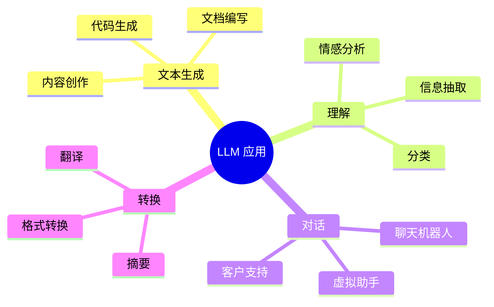

# LLM 基础

大语言模型（LLM）代表了机器理解和生成人类语言方式的范式转变。本节提供 LLM 架构、训练和实际部署的全面基础。

## 概览

### 什么是 LLM？

**大语言模型**是在海量文本数据上训练的神经网络，用于理解、生成和操作人类语言。它们基于 **Transformer 架构**构建，能够以卓越的效率和准确性处理文本序列。

核心特性：
- **规模**：在数十亿到数万亿 token 上训练
- **泛化能力**：无需特定任务训练即可处理多样任务
- **生成能力**：产生连贯、上下文相关的文本
- **理解能力**：展现出涌现的推理和理解能力

### 为什么 LLM 基础很重要

| 方面 | 对开发的影响 |
|------|-------------|
| **架构知识** | 理解 token 限制、上下文窗口和模型约束 |
| **训练过程** | 了解模型如何学习有助于提示词工程和微调 |
| **推理行为** | 预期模型输出、延迟和资源需求 |
| **局限性认知** | 识别和缓解幻觉、偏见和失败模式 |

## 核心组件

### 1. 分词（Tokenization）

分词是 LLM 处理的第一步——将文本分解为更小的单元，称为 **token**。

**核心概念：**
- Token 可以是词、子词或字符
- 不同的分词策略（BPE、WordPiece、SentencePiece）
- 对模型性能和多语言支持的影响
- Token 限制和上下文窗口约束

**为什么重要：**
```
Text: "Artificial Intelligence is transforming the world"
Tokens: ["Art", "ificial", " Int", "elligence", " is", " trans", "form", "ing", " the", " world"]

Token 数量影响：
- API 成本（按 token 计费）
- 上下文容量
- 处理速度
```

### 2. 嵌入（Embeddings）

嵌入将 token 转换为捕获语义信息的密集**向量表示**。

**核心概念：**
- 高维向量空间（768、1024、1536+ 维）
- 通过余弦距离衡量语义相似性
- 上下文嵌入 vs 静态嵌入
- 向量数据库用于语义搜索

**应用：**
```java
// Spring AI: Embedding 生成
EmbeddingResponse response = embeddingModel.embed(
    List.of("Hello world", "Hi there")
);

// 比较相似度
double similarity = CosineSimilarity.between(
    response.getResults().get(0).getOutput(),
    response.getResults().get(1).getOutput()
);
```

### 3. Transformer 架构

**Transformer** 是驱动现代 LLM 的神经网络架构。

**核心组件：**
- **Self-Attention**：理解 token 关系的机制
- **Multi-Head Attention**：并行注意力机制
- **位置编码**：保持序列顺序
- **前馈网络**：处理被注意的信息
- **层归一化**：稳定训练

**架构影响：**
```
Input Text → Tokenization → Embedding + Positional Encoding
    → Multiple Transformer Layers
        → Each Layer: Multi-Head Attention + Feed-Forward
    → Output Projection → Probability Distribution
```

### 4. 推理（Inference）

推理是从训练模型生成输出的过程。

**核心概念：**
- **解码策略**：贪心、束搜索、采样
- **Temperature**：控制随机性
- **Top-k / Top-p**：核采样
- **Token 流式传输**：实时响应生成

**实际考虑：**
```java
// Spring AI: 推理配置
ChatResponse response = chatClient.prompt()
    .user("Explain quantum computing")
    .options(OpenAiChatOptions.builder()
        .temperature(0.7)        // 创造性
        .topP(0.9)              // 核采样
        .maxTokens(1000)         // 响应长度
        .build())
    .call()
    .chatResponse();
```

### 5. 训练流水线

理解 LLM 如何被训练有助于有效的使用和微调策略。

**训练阶段：**
1. **预训练**：从无标签文本数据学习（自监督）
2. **微调**：适配特定任务（监督）
3. **对齐**：确保安全、有用的输出（RLHF、DPO）

**训练考量：**
| 阶段 | 数据 | 目标 | 计算量 |
|------|------|------|--------|
| **预训练** | 互联网文本 | 预测下一个 token | 海量（数千 GPU） |
| **微调** | 特定任务数据 | 学习任务模式 | 中等 |
| **对齐** | 人类反馈 | 匹配偏好 | 可变 |

### 6. 认知局限

LLM 有重要的局限性，开发者必须理解并加以缓解。

**主要局限：**
- **幻觉**：生成看似合理但虚假的信息
- **上下文窗口**：对话历史记忆有限
- **时间盲区**：不知道训练后发生的事件
- **推理缺陷**：在多步逻辑推理中存在困难
- **数学与精度**：天生不擅长计算

**缓解策略：**
```
幻觉 → RAG（检索增强生成）
上下文限制 → 记忆系统、摘要
时间问题 → 工具使用（Web 搜索、API）
推理 → 思维链提示
数学 → 计算器工具、代码解释
```

## 学习路径

### 推荐顺序

1. **引言** → 理解 LLM 是什么及其演进
2. **分词** → 掌握文本如何变为模型输入
3. **嵌入** → 学习语义表示
4. **Transformer 架构** → 理解模型内部
5. **推理** → 学习如何有效使用模型
6. **训练流水线** → 了解模型如何被创建
7. **局限性** → 认识并绕过约束

### 不同角色的侧重

| 角色 | 侧重领域 |
|------|----------|
| **ML 工程师** | 训练流水线、Transformer 架构 |
| **应用开发者** | 分词、推理、局限性 |
| **数据科学家** | 嵌入、训练、微调 |
| **产品经理** | 局限性、能力、用例 |

## 实际应用

### 常见用例



### 集成模式

**Spring Boot + LLM：**
```java
@Service
public class LLMService {

    @Autowired
    private ChatModel chatModel;

    public String analyzeSentiment(String text) {
        return chatClient.prompt()
            .user("Analyze sentiment: " + text)
            .call()
            .content();
    }
}
```

**Next.js + LLM：**
```typescript
import { OpenAI } from 'openai';

const openai = new OpenAI();

export async function analyzeSentiment(text: string) {
  const response = await openai.chat.completions.create({
    model: 'gpt-4',
    messages: [{ role: 'user', content: `Analyze sentiment: ${text}` }]
  });

  return response.choices[0].message.content;
}
```

## 核心要点

### 必备知识

1. **Token 是货币**：理解分词以优化成本和性能
2. **上下文窗口限制记忆**：为有限的对话上下文做规划
3. **嵌入驱动语义搜索**：向量相似性是 RAG 和检索的基础
4. **训练决定能力**：预训练 vs 微调 vs 对齐
5. **推理参数控制输出**：Temperature、top-p 和 max tokens 塑造响应
6. **局限性需要缓解**：使用工具、RAG 和谨慎的提示词

### 开发最佳实践

1. **从简单开始**：先使用基本提示词，再尝试高级技术
2. **衡量 token**：跟踪输入/输出成本和上下文使用量
3. **优雅处理错误**：LLM 可能失败或超时
4. **缓存响应**：减少冗余 API 调用
5. **使用流式传输**：为长生成提供实时反馈
6. **验证输出**：不要假设 LLM 响应是正确的

---

## 下一步

**继续你的 LLM 之旅：**

1. **→ [1. 引言](./introduction)** - 从 GPT 到当前模型的演进
2. **→ [2. 分词](./tokenization)** - 理解文本处理
3. **→ [3. 嵌入](./embeddings)** - 语义向量表示
4. **→ [4. Transformer 架构](./transformer-architecture)** - 模型内部
5. **→ [5. 推理](./inference)** - 生成输出
6. **→ [6. 训练流水线](./training-pipeline)** - 模型如何学习
7. **→ [7. 认知局限](./limitations)** - 与约束共处

---

:::tip 从这里开始
刚接触 LLM？从 **[引言](./introduction)** 开始，在深入技术细节之前了解演进和核心概念。
:::

:::info 实践导向
每个章节都包含 **Spring AI** 和 **Next.js** 代码示例，展示如何在真实应用中应用这些概念。
:::
