# 1. RAG 基础

本章建立了对检索增强生成 (Retrieval-Augmented Generation, RAG) 系统的基础理解，重点关注核心概念、理论原理和架构直觉。我们将从第一性原理出发，理解 RAG 为何有效，它如何融入 AI 生态系统，以及为什么它是生产级 AI 系统中必不可少的模式。

---

## 1.1 定义与直觉

### 1.1.1 标准定义

**检索增强生成 (RAG)** 是一种 AI 架构模式，它通过从外部知识库检索相关的上下文来增强大语言模型 (LLM) 的能力。该模式由 Facebook AI Research（现 Meta AI）在 2020 年首次提出，核心思想是将**信息检索**与**文本生成**相结合，使 LLM 在生成答案时能够访问实时、准确的外部知识。

RAG 由三个核心组件组成：

1. **检索器 (Retriever)**：根据查询从知识库中检索相关内容
2. **知识源 (Knowledge Source)**：外部数据存储（结构化或非结构化）
3. **生成器 (Generator)**：基于检索到的上下文生成最终答案

**标准工作流**：
```
用户查询 → 检索文档 → 注入 Prompt → LLM 生成答案
```

### 1.1.2 核心比喻：从“闭卷”到“开卷”考试

理解 RAG 价值最直观的方式是考试比喻：

**不带 RAG 的 LLM = 闭卷考试**

想象一下参加闭卷考试：
- 你只能依靠大脑中记住的知识
- 如果考到了你从未学过的内容，你只能靠猜或胡编乱造
- 你的知识冻结在你结束学习的那一天（训练数据截止日期）
- 你可能从未见过某些冷僻的知识点

**带有 RAG 的 LLM = 开卷考试**

现在想象同样的考试，但允许你查阅教科书：
- 你可以查找相关章节以准确回答问题
- 即使是新知识，只要书里有，你就能回答
- 你可以引用出处，展示你回答的依据
- 压力大大降低，回答更准确、可靠

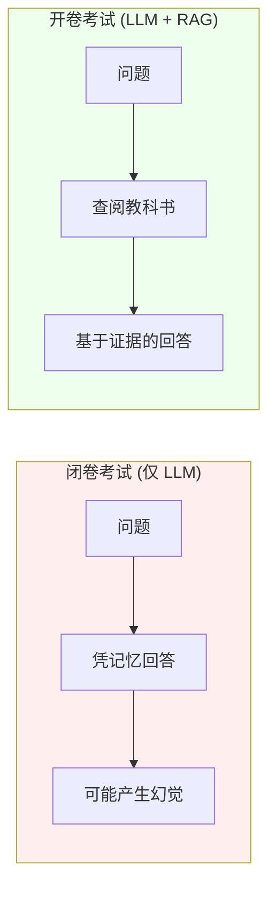

**关键洞察**：RAG 本质上是赋予了 LLM 一个“参考图书馆”，将其从“闭卷”转为“开卷”，极大地提高了回答的准确性和可信度。

### 1.1.3 第一性原理：RAG 是信息传递，而非学习

从第一性原理的角度来看，RAG 解决的核心问题是：**如何在不改变模型参数的情况下，让 LLM 能够访问外部知识？**

**RAG 不是学习**：
- 微调 (Fine-tuning) 是学习：通过修改模型权重来内化知识
- RAG 不是学习：模型参数保持不变，知识是通过 Prompt 临时注入的

**RAG 是信息传递 (信息检索 + 上下文注入)**：

```
核心等式：

答案 = LLM(上下文(查询) + 查询)

其中：
- 上下文(查询) = 从知识库检索出的 Top-K 相关片段
- 语义距离通过向量相似度衡量
- 知识不存储在模型中，而是按需检索
```

**第一性原理分解**：

1. **语义映射**：文本 → 向量（将人类语言映射到数学空间）
2. **距离计算**：计算查询向量与文档向量之间的相似度
3. **信息传递**：将最相关的文本片段注入到 LLM 的上下文窗口
4. **生成综合**：LLM 基于注入的上下文生成答案

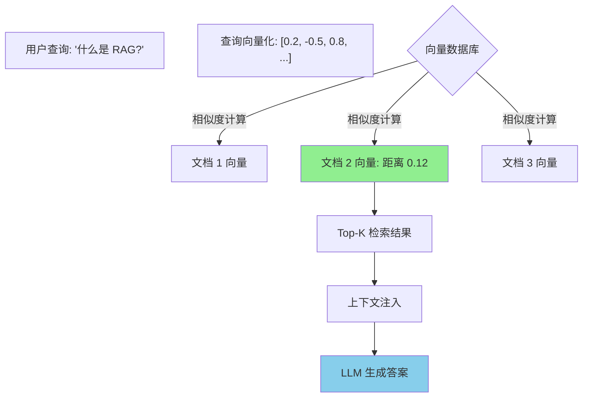

**与微调的本质区别**：

| 维度 | RAG | 微调 (Fine-tuning) |
|-----------|-----|-------------|
| 知识存储 | 外部向量数据库 | 模型参数权重 |
| 更新方式 | 增加文档即可 | 需要重新训练 |
| 知识时效 | 无限制（实时更新） | 训练数据截止日期 |
| 成本 | 低（存储成本） | 高（计算成本） |
| 可解释性 | 高（可追溯来源） | 低（黑盒） |

---

## 1.2 为什么需要 RAG？

### 1.2.1 LLM 的局限性：幻觉、知识截止与长尾知识缺口

尽管 LLM 在文本生成方面表现出色，但它们存在几个根本性的局限，限制了它们在生产环境中的直接应用。

**局限 1：幻觉 (Hallucinations)**

**什么是幻觉？**
LLM 有时会“胡编乱造”出听起来很有道理但完全错误的信息。这不是因为模型在“撒谎”，而是因为它的训练目标是“生成像样的文本”，而非“保证事实准确性”。

**幻觉的根源**：
- LLM 是概率模型，基于统计模式预测下一个 token
- 当知识不足时，它们会根据语言模式“补全”答案
- 模型无法区分“我记得的”和“我猜的”

**幻觉的表现**：
```
用户: "告诉我 2024 年诺贝尔物理学奖得主"
LLM: "2024 年诺贝尔物理学奖授予了史密斯博士，
      表彰他在量子引力方面的贡献。"
      ← 完全伪造（可能是 2023 年得主的混淆）
```

**局限 2：知识截止日期 (Knowledge Cutoff)**

**什么是知识截止？**
LLM 的知识受限于训练数据的时段。例如，GPT-4 的训练数据截止到 2023 年，因此它无法“知道”在那之后发生的事件。

**为什么存在知识截止？**
- 训练数据快照：模型在某个点停止更新
- 重新训练昂贵：无法频繁更新知识
- 世界不断变化：新事件和新知识不断涌现

**知识截止的影响**：
```
用户: "最新的 TypeScript 版本是多少？"
LLM: "据我所知，TypeScript 5.0 在 2023 年发布。"
      ← 实际上可能是 5.4 或更高
```

**局限 3：长尾知识缺失**

**什么是长尾知识？**
在训练数据中极少出现的知识点：
- 企业内部文档
- 个人笔记
- 冷门领域的专业知识
- 私有数据集

**为什么 LLM 无法访问长尾知识？**
- 训练数据采样偏差：互联网数据 ≠ 人类所有知识
- 数据不可获取：私有数据未公开
- 频率惩罚：罕见知识在训练中被“稀释”

**局限 4：无来源归因**

LLM 无法告诉你答案的来源，这在需要引用的场景中是致命的：
- 学术研究需要引用出处
- 企业应用需要证据支撑
- 法律场景需要法规依据

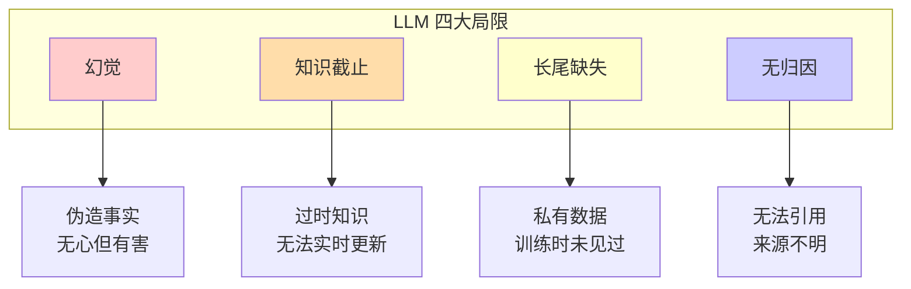

### 1.2.2 RAG 的核心价值：数据接地、实时更新与隐私保护

RAG 通过引入外部知识库，系统性地解决了上述 LLM 的局限。

**价值 1：数据接地 (Data Grounding)**

**什么是接地？**
让 LLM 的回答基于检索到的事实，而非“猜测”或“记忆”。

**接地机制**：


**接地的效果**：
- 事实性回答：基于检索出的文档
- 减少幻觉：模型“看到”了证据
- 可验证性：可以核对原文

**价值 2：实时更新**

**无需重新训练**：
- 增加新文档到知识库 → 立即可以被检索
- 更新现有文档 → 下次查询即生效
- 删除过期文档 → 停止检索

**与传统方式对比**：

| 方式 | 知识更新 | 时间成本 | 金钱成本 |
|--------|-----------------|-----------|---------------|
| 微调 | 重新训练 | 数天至数周 | 高 (GPU 耗时) |
| 提示词工程 | 手动更新 Prompt | 实时 | 低 (但容量有限) |
| **RAG** | 增删文档即可 | 实时 | 极低 |

**实时更新场景**：
- 新闻网站：每天增加新闻稿
- 法律合规：新规发布后立即加入
- 产品文档：新功能上线后同步更新

**价值 3：隐私保护**

**数据留在你的控制之下**：
- 敏感文档存储在本地向量库
- 检索过程发生在你自己的基础设施上
- 仅将查询到的片段发送给 LLM (可使用私有化 LLM)

**隐私保护优势**：
```
企业场景：
财务报表 + RAG → 基于真实数据回答
            ↓
文档从未离开企业内网
            ↓
符合数据合规要求 (GDPR, SOC2)
```

**价值 4：成本效率**

**RAG + 小模型 > 仅使用大模型**：

| 方案 | 模型规模 | 知识质量 | 成本 |
|----------|------------|-------------------|------|
| 仅大模型 (GPT-4) | 1.8T 参数 | 取决于训练数据 | 高 |
| **RAG + 小模型** (Llama-3-8B) | 8B 参数 | 实时外部知识 | 低 |

**经济学原理**：
- 小模型 + RAG：检索出准确知识 + 廉价的推理
- 大模型：内化了所有知识 → 昂贵的训练 + 昂贵的推理

**价值 5：可追溯性 (Attribution)**

**来源引用**：
```
用户: "公司的退款政策是什么？"
RAG 回答:
"根据《退款政策文档》(来源: docs/refund-policy.pdf)，
    我们的退款政策是..."

优势：
✓ 用户可以验证答案
✓ 可以阅读原文
✓ 建立信任感
```

### 1.2.3 关键技术决策：RAG 与微调的区别与边界

RAG 和微调 (Fine-tuning) 是互补技术，而非互斥。理解它们的适用边界是架构设计的关键。

**RAG vs. 微调：本质对比**：

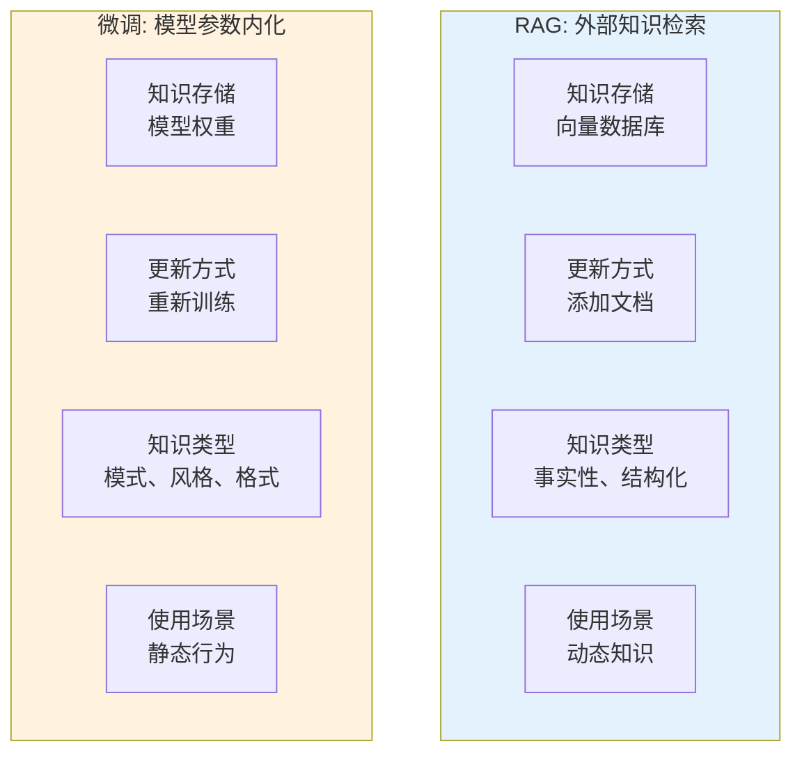

**决策矩阵：何时使用哪种技术？**

| 场景 | 推荐方案 | 原因 |
|----------|---------------------|--------|
| 企业知识库（实时更新） | **RAG** | 文档更新快，需要时效性 |
| 医疗诊断（高度专业化） | **RAG + 微调** | 微调学习诊断模式，RAG 提供最新研究 |
| 代码生成（特定框架） | **微调** | 需要内化框架的代码模式 |
| 客服助手（公司政策） | **RAG** | 政策经常变，需要追溯性 |
| 创意写作（特定风格） | **微调** | 需要学习风格模式，而非事实 |
| 法律合规（法规查询） | **RAG** | 必须准确引用原文 |
| 个性化推荐（用户偏好） | **微调 + RAG** | 微调学习偏好，RAG 提供实时内容 |

**RAG 的适用边界**：

**RAG 最擅长的场景**：
- 知识频繁变化（新闻、规定、文档）
- 需要准确度证明（法律、医疗、金融）
- 数据隐私要求高（企业内部数据）
- 成本敏感（需要高效推理）

**RAG 不够理想的场景**：
- 需要学习复杂的模式（代码风格、写作风格）
- 知识极其稳定（历史事实、基础科学）
- 对延迟极其敏感（检索会增加 50-200ms）
- 知识已经完全包含在模型权重中（常识性问题）

**组合策略**：

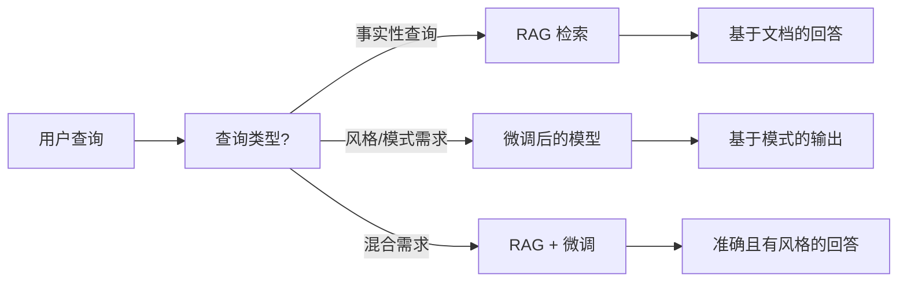

**实践建议**：
- 从 RAG 开始（风险低、成本低）
- 评估是否需要微调补充
- 优先考虑 RAG + 小模型，而非单用大模型
- 记录成本效益比，指导未来的决策

---

## 1.3 核心技术概念与原理

### 1.3.1 向量空间模型：语义的高维几何表示

**什么是向量空间？**

直观地理解，向量空间是一个多维坐标系，但它的维度远超我们的日常三维体验：
- 文本向量通常有 512, 1024, 2048 或 3072 维
- 每一维代表一个“语义特征”
- 类似于 RGB 颜色空间，但维度多得多

**高维几何的核心洞察**：

在向量空间中，**语义关系 = 几何关系**：
- **距离** = 语义差异
- **方向** = 语义关系
- **聚类** = 主题相似性

**为什么需要高维？**

人类语言极其复杂：
- 词汇量：数万到数十万
- 语义关系：同义、反义、包含、因果...
- 上下文依赖：同一个词在不同句子中意义不同

**维度与表达能力对比**：

| 维度 | 表达能力 | 典型用途 |
|------------|-----------------|-------------|
| 128-256 | 基础语义 | 简单分类、去重 |
| 512-768 | 中等语义 | 文档检索、相似度计算 |
| 1024-1536 | 高级语义 | 复杂检索、语义搜索 |
| 2048-3072 | 精细语义 | 多语言、跨模态、专业领域 |

**向量空间的几何直觉**：

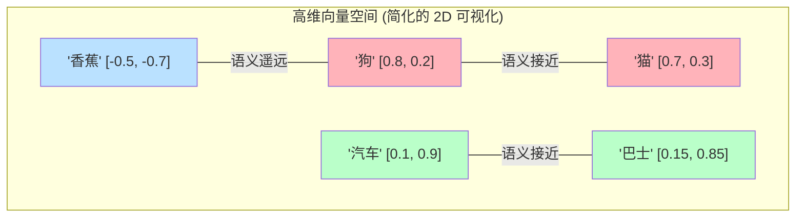

**在向量空间中**：
- “狗”和“猫”靠在一起（都是宠物）
- “汽车”和“巴士”靠在一起（都是交通工具）
- “香蕉”距离两者都很远（不同类别）

**向量空间中的聚类现象**：

语义相近的词会自动聚集成簇：
```
动物簇：
  狗, 猫, 鸟, fish... [密集的语义区域]

交通工具簇：
  汽车, 飞机, 火车, 轮船... [另一个语义区域]

科技簇：
  电脑, 手机, AI, 芯片... [独立的区域]
```

**为什么聚类很重要？**

RAG 的核心原理就是：**查询语句在向量空间中寻找最近的语义簇，然后从这些簇中提取文档**。

```
查询: "如何训练机器学习模型？"
      ↓
向量化后，落在了“机器学习”语义簇附近
      ↓
检索该簇中的相关文档
      ↓
返回关于模型训练的文档
```

### 1.3.2 Embedding：将非结构化文本映射为数学向量

**什么是 Embedding？**

Embedding（嵌入）是将人类符号（文本、图像、音频）映射到数学空间（向量）的技术。Embedding 模型的目标是：**让语义相近的内容在向量空间中距离更近**。

**Embedding 的本质 = 从意义到数字的翻译**：

```
文本 (人类可读)
    ↓ Embedding 模型
向量 (机器可算)

示例：
"我非常开心"  → [0.5, -0.2, 0.8, 0.1, ...]
"我很高兴"   → [0.48, -0.18, 0.82, 0.12, ...]
              ↑ 距离很近，因为语义相似
```

**良好 Embedding 的核心属性**：

**属性 1：语义相似性保持 (Semantic Similarity Preservation)**

语义相似的内容 → 向量距离更近

```
示例：
"苹果" vs "橙子" → 距离 0.3 (都是水果)
"苹果" vs "汽车" → 距离 1.2 (不同类别)
"苹果" vs "Apple" → 距离 0.15 (同一个实体，不同语言)
```

**属性 2：类比推理能力 (Analogical Reasoning)**

Embedding 空间支持向量算术运算：

```
经典示例 (Word2Vec):
  国王 - 男人 + 女人 = 女王

直觉理解：
  "国王" - "男性特征" + "女性特征" = "女王"

数学表现：
  (国王向量) - (男人向量) + (女人向量)
  ≈ 女王向量
```

**属性 3：上下文感知 (Context Awareness)**

现代 Embedding 模型（如 BERT, GPT embeddings）会考虑上下文：

```
句子 1: "我去银行存钱"
         ↓
      "银行" (金融机构) 向量

句子 2: "我走在河岸边"
         ↓
      "河岸" (River bank) 向量

结果：同一个词，上下文不同 → 向量不同
```

**Embedding 的训练目标（直观理解）**：

现代 Embedding 模型使用**对比学习 (Contrastive Learning)**：

**核心思想**：
- 正样本对（相近的文本） → 拉近距离
- 负样本对（不相关的文本） → 推开距离

**训练过程**：
```
查询: "什么是机器学习？"

正样本: "机器学习是 AI 的一个分支..."
        ↓ 拉近

负样本: "今天天气不错，适合散步..."
        ↓ 推开

目标：查询-正样本距离 << 查询-负样本距离
```

**为什么这个目标有效？**

通过数百万次的对比学习，模型逐渐掌握了：
- 什么是相似的（语义、主题、意图）
- 什么是无关的（噪音、无关内容）
- 如何将这种相似性编码进向量中

**Embedding 模型选择参考**：

| 模型 | 维度 | 特点 | 适用场景 |
|-------|------------|------------------|----------|
| text-embedding-3-small | 1536 | 速度快，成本极低 | 通用检索 |
| text-embedding-3-large | 3072 | 质量极高，支持多语言 | 复杂语义、跨语言 |
| bge-base-zh | 768 | 中文优化效果好 | 纯中文应用 |
| e5-large-v2 | 1024 | 开源界标杆，表现平衡 | 成本敏感型场景 |
| bge-m3 | 1024 | 多语言、多功能 | 国际化应用 |

### 1.3.3 相似度度量：余弦相似度与距离计算

在向量空间中，我们需要数学方法来衡量两个向量之间的“相似度”。三种常用的度量方式各有其适用场景。

**余弦相似度 (Cosine Similarity)**

**定义**：衡量两个向量之间的角度，而非绝对距离。

**直观理解**：
- 关注方向，而非长度。
- 相似度在 [-1, 1] 之间，1 表示方向完全相同，0 表示正交，-1 表示方向相反。
- 对文本长度不敏感。

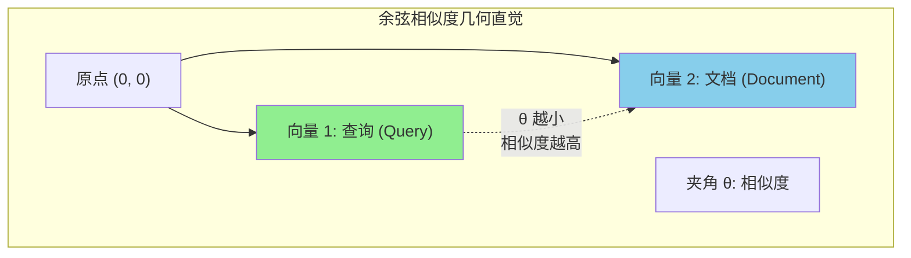

**为什么文本检索常用余弦相似度？**

```
示例：
文本 1: "机器学习"
      向量: [1.0, 2.0, 1.5]

文本 2: "机器学习是人工智能的一个分支"
      向量: [2.0, 4.0, 3.0] (长度翻倍，但方向相同)

余弦相似度: 1.0 (方向完全一致，长度被忽略)
直觉: 语义上它们说的是一回事，尽管篇幅不同。
```

**实践意义**：
- 长文档不会因为词数多而“霸占”搜索结果。
- 关注的是“是不是在说同一件事”，而非“说了多少”。

**欧几里得距离 (Euclidean Distance)**

**定义**：两点之间的直线距离（我们日常理解的“距离”）。

**公式直觉**：
```
距离 = √[(x1-x2)² + (y1-y2)² + ...]

比喻：3D 空间中两点间的直线连线长度
```

**何时使用？**
- 需要考虑向量模长（长度）的场景。
- 图像 Embedding（像素强度有意义）。
- 某些特定的专门 Embedding 模型。

**点积 (Dot Product)**

**定义**：分量相乘后的总和。

**与余弦相似度的关系**：
```
点积 = 余弦相似度 × 向量长度乘积

如果向量都经过了归一化 (长度为 1)：
  点积 = 余弦相似度
```

**为什么点积快？**
- 现代硬件 (GPU, TPU) 对矩阵乘法有极高的优化。
- 向量数据库常用点积来加速检索。

**三种指标对比表**：

| 指标 | 范围 | 关注点 | 运算速度 | 常用领域 |
|--------|-------|-------|-------|------------|
| **余弦相似度** | [-1, 1] | 方向（语义） | 中 | 文本检索（默认首选） |
| **欧几里得距离** | [0, ∞] | 绝对距离 | 慢 | 图像、对大小敏感的场景 |
| **点积** | (-∞, ∞) | 方向 × 长度 | 快 | 归一化后等同于余弦 |

**相似度阈值的选取**：

在实践中，如何判断“多近才算相似”？

```
余弦相似度阈值参考：

≥ 0.95: 几乎完全相同 (重复文档、改写)
≥ 0.85: 高度相关 (同一个话题，不同表达)
≥ 0.70: 中度相关 (有联系，但不完全匹配)
≥ 0.50: 弱相关 (可能有参考价值，需人工判断)
< 0.50: 不相关 (通常应过滤掉)
```

**实际检索案例**：

```
查询: "如何训练机器学习模型？"

检索结果：
1. "机器学习模型训练指南"     → 相似度 0.92 ✓
2. "深度学习训练技巧"         → 相似度 0.88 ✓
3. "机器学习算法原理"         → 相似度 0.76 ✓
4. "如何训练宠物狗"           → 相似度 0.35 ✗
5. "今天天气不错"             → 相似度 0.12 ✗

Top-3 选取: 前三个文档
```

---

## 1.4 标准架构与数据生命周期

### 1.4.1 第一阶段：索引 (Indexing)

索引是 RAG 系统的“学习”阶段，将原始文档转换为可检索的向量表示。

**完整索引流程**：


**步骤 1：文档解析**

**支持的数据源**：
- 文本文件：Markdown, TXT, CSV
- Office 文档：PDF, DOCX, PPTX
- 网页：HTML, 抓取的 Markdown
- 代码：各种编程语言的源代码
- 结构化数据：JSON, XML, 数据库

**解析挑战**：
- PDF 解析：处理多栏、表格、图像
- 网页清洗：移除导航、广告、页脚
- 代码解析：保留语法结构、注释

**步骤 2：文本清洗**

**清洗操作示例**：
```
原始文本:
  "   你好！！！   \n\n   请访问我们的网站 https://example.com  "

清洗后:
  "你好 请访问我们的网站"

操作:
- 移除多余空格
- 移除特殊字符
- 处理 URL、邮箱（可选）
- 统一标点符号
- 转换为小写（视情况而定）
```

**为什么需要清洗？**
- 减少噪音，提高检索质量
- 统一格式，避免重复
- 减少 Token 消耗

**步骤 3：分块策略 (Chunking Strategy)**

**为什么需要分块？**
- LLM 上下文窗口有限 (4K-128K tokens)
- Embedding 模型有长度限制 (512-8192 tokens)
- 细粒度检索更准确

**三种主要分块策略**：

**策略 1：固定大小分块 (Fixed-size Chunking)**

```
原理：按字符数或 Token 数拆分

示例：
chunk_size = 500
overlap = 50

文档: "这是一篇很长的文章..." (2000 字符)

分块:
块 1: 0-500 字符
块 2: 450-950 字符 (50 字符重叠)
块 3: 900-1400 字符
块 4: 1350-1850 字符

优点：简单、快速、可预测
缺点：可能切断语义单元
```

**策略 2：语义分块 (Semantic Chunking)**

```
原理：按语义边界（段落、章节）拆分

示例：
文档: "第一章 绪论...\n\n第二章 方法...\n\n"

分块:
块 1: "第一章 绪论..." (完整章节)
块 2: "第二章 方法..." (完整章节)

优点：语义完整，上下文连贯
缺点：需要文档结构，处理慢
```

**策略 3：递归分块 (Recursive Chunking)**

```
原理：多层级粒度，从粗到细

示例：
1 级：章节级分块
2 级：段落级分块
3 级：句子级分块

检索过程：
  粗粒度检索 → 细粒度精确定位

优点：平衡速度与质量
缺点：复杂度较高
```

**分块策略选择指南**：

| 场景 | 推荐策略 | chunk_size | overlap |
|----------|---------------------|-----------|---------|
| 普通文档 | 固定大小 | 500-1000 | 50-100 |
| 学术论文 | 语义分块 | 无 | 无 |
| 源代码 | 语义（函数级） | 无 | 无 |
| 长篇文档 | 递归分块 | 多级层级 | 视情况而定 |
| 问答/对话 | 固定大小 | 200-400 | 0-50 |

**步骤 4：向量化 (Vectorization)**

```
每个文本块 → Embedding 模型 → 向量

示例：
文本块: "机器学习是 AI 的一个分支..."

Embedding 模型: text-embedding-3-small

输出向量: [0.2, -0.5, 0.8, 0.1, ...] (1536 维)
```

**批量处理优化**：
- 批量向量化（例如一次 100 条）
- GPU/TPU 加速
- 异步处理（针对大规模数据）

**步骤 5：向量存储与索引**

**向量数据库选择参考**：

| 数据库 | 特点 | 使用场景 |
|----------|------|----------|
| Pinecone | 托管服务，简单易用 | 快速原型、小团队 |
| Weaviate | 开源、模块化 | 私有化部署、定制化需求 |
| Qdrant | 高性能、Rust 开发 | 大规模、低延迟 |
| Chroma | 轻量级、嵌入式 | 本地开发、测试 |
| pgvector | PostgreSQL 扩展 | 已有 PG 基础设施 |

**索引算法 (ANN - 近似最近邻)**：

```
精确搜索 (暴力破解):
  计算查询与所有文档的距离
  复杂度: O(N) - N 为文档数

近似搜索 (ANN):
  利用索引结构快速找到近似的最近邻
  复杂度: O(log N) 或更快
  牺牲极小精度换取巨大速度提升
```

**常用 ANN 算法**：
- HNSW (层级导航小世界): 精度高，速度快
- IVF (倒排文件索引): 平衡精度与速度
- PQ (乘积量化): 压缩向量，节省内存

**索引完成后的状态**：

```
原始文档:
  ├── doc1.pdf
  ├── doc2.md
  └── doc3.html

          ↓ 索引完成

向量数据库:
  ├── [
  │    id: "chunk-1",
  │    vector: [0.2, -0.5, ...],
  │    metadata: {source: "doc1.pdf", page: 1}
  │  ],
  ├── [chunk-2, ...],
  └── [chunk-3, ...]

就绪，等待检索 ✓
```

### 1.4.2 第二阶段：检索 (Retrieval)

检索是 RAG 的“查询”阶段，根据用户问题找到最相关的文档片段。

**检索工作流**：

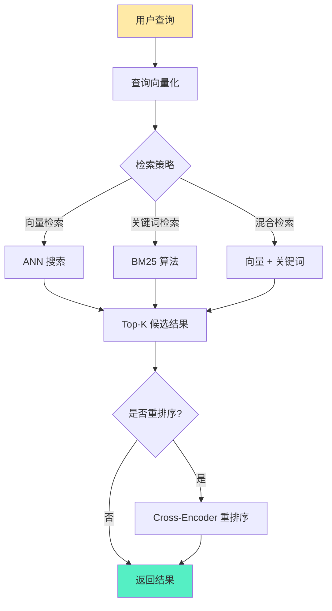

**步骤 1：查询向量化**

```
用户查询: "如何用 Spring Boot 实现 REST API?"
            ↓
查询向量化: [0.3, -0.1, 0.9, ...] (与文档向量维度相同)
            ↓
用于相似度计算
```

**查询优化技术**：

**查询扩展 (Query Expansion)**：
```
原始查询: "机器学习"

扩展后: "机器学习 OR 深度学习 OR 神经网络 OR ML OR DL"

提升: 召回率（覆盖更多相关文档）
```

**查询重写 (Query Rewriting)**：
```
用户: "怎么做？"
     ↓ LLM 重写
"如何实现机器学习模型的训练？"

提升: 明确查询意图
```

**步骤 2：向量检索**

**ANN 搜索过程**：
```
1. 计算查询向量与索引中所有向量的相似度
2. 利用索引结构快速找到 Top-K 个最近邻
3. 返回 K 个最相似的文档块

参数:
  - top_k: 返回多少个结果 (通常为 5-20)
  - score_threshold: 相似度阈值 (如 0.7)
```

**检索结果示例**：
```
查询: "RAG 系统是如何工作的？"

Top-5 结果:
1. "RAG 系统包含检索和生成两个阶段..." (相似度: 0.92)
2. "检索增强生成 (RAG) 是一种..."      (相似度: 0.89)
3. "RAG 与微调的主要区别..."          (相似度: 0.76)
4. "向量数据库的选择..."             (相似度: 0.65)
5. "今天天气真不错..."               (相似度: 0.12)

经过过滤 (threshold=0.7):
  结果 1, 2, 3
```

**步骤 3：混合检索 (Hybrid Retrieval)**

**为什么需要混合检索？**

向量检索的局限：
- 对精确匹配（专有名词、ID 编号）较弱
- 可能错过关键词

关键词检索（传统搜索）的优势：
- 精确匹配能力强
- 与向量检索互补

**混合策略**：

```
向量检索: Top-20 结果
关键词检索: Top-20 结果
      ↓
合并并去重: Top-30 唯一结果
      ↓
重排序: 最终 Top-10
```

**分数融合 (Score Fusion)**：
```
最终分数 = α × 向量分数 + (1-α) × 关键词分数

典型的 α 取值:
  0.5: 向量与关键词同等重要
  0.7: 向量为主，关键词为辅
  0.3: 关键词为主，向量为辅
```

**步骤 4：重排序 (Reranking)**

**为什么需要重排序？**

检索阶段优先考虑“快”，可能牺牲了“准”。重排序使用更复杂的模型对结果进行精确排序。

**Cross-Encoder 重排序**：
```
第一阶段 (检索):
  快速模型: Bi-Encoder
  返回: Top-20 候选结果

第二阶段 (重排序):
  精确模型: Cross-Encoder
  输入: (查询, 文档) 对
  输出: 精确相似度分数
  返回: Top-5 最终结果

成本: 重排 20 个 vs 检索 10000 个
收益: 精度大幅提升
```

**重排序模型选择**：

| 模型 | 特点 | 速度 | 精度 |
|-------|----------------|-------|-----------|
| bge-reranker-large | 中文优化好 | 中 | 高 |
| cohere-rerank-v3 | 多语言支持 | 快 | 高 |
| cross-encoder-ms-marco | 英文优化好 | 慢 | 极高 |

### 1.4.3 第三阶段：生成 (Generation)

生成是 RAG 的“回答”阶段，LLM 基于检索到的上下文生成最终答案。

**生成工作流**：

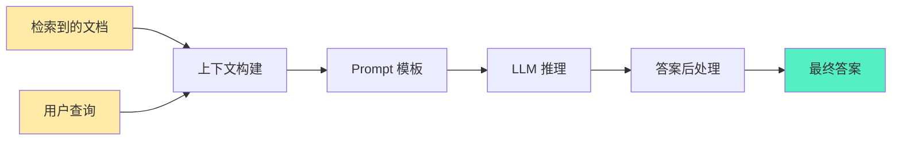

**步骤 1：上下文构建**

**上下文注入策略**：

**策略 1：全部注入**
```
检索到 5 篇文档，全部塞入

优点：信息完整
缺点：可能超出上下文窗口，成本高
```

**策略 2：选择性注入**
```
仅注入相似度 > 0.8 的文档

优点：质量高，节省 Token
缺点：可能遗漏有用信息
```

**策略 3：压缩注入**
```
文档: "这是一篇关于 RAG 的长文，详细描述了..." (1000 tokens)
      ↓ LLM 压缩
摘要: "文章主要讨论了 RAG 的原理..." (200 tokens)

优点：保留关键信息，节省 Token
缺点：压缩过程可能丢失细节
```

**上下文长度管理**：
```
LLM 上下文窗口: 8K tokens
查询语句: 100 tokens
系统提示词: 500 tokens
      ↓
可用空间: 7400 tokens

文档分配:
  文档 1: 2000 tokens
  文档 2: 1800 tokens
  文档 3: 1500 tokens
  文档 4: 2100 tokens ← 超出！
      ↓
截断或舍弃文档 4
```

**步骤 2：Prompt 模板**

**标准 RAG Prompt 模板示例**：

```
你是一个得力的助手。请根据以下提供的上下文回答用户的问题。

上下文：
{context}

问题：{question}

答案：
```

**填充后的实际 Prompt**：
```
你是一个得力的助手。请根据以下提供的上下文回答用户的问题。

上下文：
[文档 1]: RAG 是检索增强生成的缩写，它结合了信息检索与文本生成...
[文档 2]: RAG 系统由三个主要组件组成：检索器、知识源和生成器...
[文档 3]: RAG 的优势包括实时更新、数据接地和隐私保护...

问题：RAG 系统由哪些组件组成？

答案：
```

**Prompt 优化技巧**：

**技巧 1：明确指令**
```
❌ 差: "根据上下文回答问题"
✓ 好: "请仅根据以下提供的上下文回答问题。如果在上下文中找不到相关信息，
        请明确说明'在上下文中找不到相关信息'，不要编造答案。"
```

**技巧 2：来源引用**
```
上下文：
[文档 1 - 来源: rag-intro.pdf]: RAG 是检索增强生成的缩写...
[文档 2 - 来源: rag-components.md]: RAG 系统由...组成...

问题：RAG 有哪些优势？

答案：根据 rag-intro.pdf，RAG 的优势包括...
      同时根据 rag-components.md，RAG 的组件包含...
```

**技巧 3：多步推理**
```
上下文: {context}

问题: {question}

请按照以下步骤回答：
1. 理解问题的核心意图
2. 从上下文中提取相关信息
3. 综合多个信息源
4. 给出清晰的回答
```

**步骤 3：LLM 推理**

**模型选择参考**：

| 场景 | 推荐模型 | 原因 |
|----------|------------------|--------|
| 简单问答 | GPT-3.5 / Llama-3-8B | 成本低、速度快 |
| 复杂推理 | GPT-4 / Claude-3.5 | 推理能力强 |
| 中文优化 | Qwen / Yi / DeepSeek | 中文表现好 |
| 私有化部署 | Llama-3-70B / Mistral | 数据隐私 |

**推理参数调优**：

```
temperature = 0.0-0.2
  低温：回答更确定，更忠实于上下文
  适用场景：事实性问答

top_p = 0.9-1.0
  核采样：控制多样性
  RAG 场景通常设为 1.0

max_tokens = 视需求而定
  短回答: 100-300
  长回答: 500-1000
  总结型: 200-500
```

**步骤 4：答案后处理**

**后处理任务**：

**任务 1：来源提取**
```
LLM 输出: "根据文档 1，RAG 是..."
         ↓
后处理: 提取出来源引用
结果: "根据 rag-intro.pdf，RAG 是..."
```

**任务 2：置信度评分**
```
方式 1: 基于 LLM 输出
  "我很确定答案是..." → 高置信度

方式 2: 基于检索分数
  平均相似度 > 0.85 → 高置信度
  平均相似度 < 0.7 → 低置信度

方式 3: 专门的置信度模型
  额外的分类器判断回答质量
```

**任务 3：格式转换**
```
需求: 输出 JSON, Markdown, 纯文本...

转换:
  LLM 输出 → 目标格式

示例:
  "答案是：RAG 是..." → {"answer": "RAG 是..."}
```

**完整的 RAG 流水线示例**：

```
用户查询: "RAG 与微调的主要区别是什么？"

第一阶段 - 检索:
  向量化: [0.1, -0.3, 0.8, ...]
  检索: Top-5 相关文档
  重排序: 精选出 Top-3

第二阶段 - 上下文构建:
  注入: 文档 1 (2000 tokens) + 文档 2 (1800 tokens)

第三阶段 - 生成:
  Prompt: "根据以下上下文回答..."
  LLM: GPT-4, temperature=0.1
  输出: "RAG 与微调的主要区别在于..."

最终答案:
  "RAG 与微调的主要区别在于知识存储方式。RAG 将知识存储在外部向量数据库中，
   支持实时更新；而微调将知识内化到模型权重中，需要重新训练。

   来源: rag-vs-finetune.md, rag-fundamentals.pdf"
```

---

## 1.5 演进范式

### 1.5.1 基础 RAG (Naive RAG)：基本三阶段流水线及其局限

**基础 RAG** 是 RAG 的最简单形式，直接采用线性的“检索-生成”流程。

**基础 RAG 架构**：


**标准工作流**：

```
1. 用户输入问题
2. 问题向量化
3. 向量数据库检索 Top-K 文档
4. 将文档注入 Prompt
5. LLM 生成答案
```

**基础 RAG 的局限性**：

**局限 1：查询质量问题**
```
用户查询: "怎么做？"
问题: 模糊、缺乏上下文
结果: 检索不准确
```

**局限 2：检索方式单一**
```
仅靠向量检索:
  - 精确匹配（专有名词）能力弱
  - 可能错过关键词
  - 无法处理结构化查询
```

**局限 3：缺乏重排序**
```
检索结果:
  文档 1: 相似度 0.75 (其实不相关)
  文档 2: 相似度 0.73 (其实高度相关)

基础 RAG: 直接使用文档 1
应该: 经过重排后选取文档 2
```

**局限 4：上下文窗口限制**
```
检索到 10 篇文档，共 15000 tokens
LLM 上下文窗口: 8000 tokens
      ↓
必须截断或丢弃文档
可能丢失关键信息
```

**局限 5：检索失败无法挽救**
```
检索失败 → 上下文为空或不相关
      ↓
LLM 仍尝试回答 → 产生幻觉
基础 RAG 没有任何检测机制
```

**适用场景**：
- 简单问答（问题明确）
- 小规模文档库（小于 1 万份文档）
- 预算有限（实现简单）
- 原型验证（快速迭代）

### 1.5.2 进阶 RAG (Advanced RAG)：查询重写、混合检索与重排序

**进阶 RAG** 在基础 RAG 之上增加了多个优化层，显著提升了检索质量和生成效果。

**进阶 RAG 架构**：

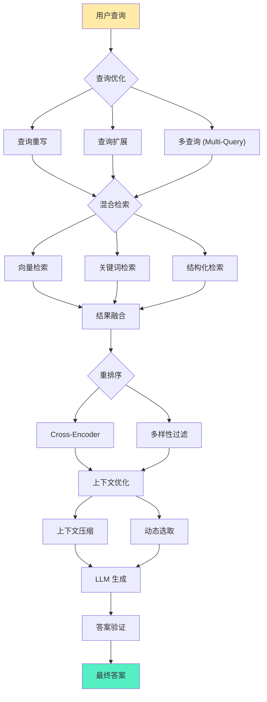

**优化点 1：查询重写 (Query Rewriting)**

**目标**：将模糊、不完整的查询转换为明确、可执行的查询。

**LLM 查询重写**：
```
原始查询: "怎么做？"
      ↓ LLM 重写
优化查询: "如何用 Spring Boot 实现 REST API？"
      ↓
检索质量大幅提升
```

**查询重写技巧**：
```
1. 意图识别: 用户到底想要什么？
2. 上下文补全: 补充隐含信息
3. 专业术语转换: 口语 → 专业术语
4. 多语言统一: 中文 → 英文 (如果文档库以英文为主)
```

**优化点 2：查询扩展 (Query Expansion)**

**目标**：生成多个相关查询，提高召回率。

**查询扩展方法**：

**方法 1：同义词扩展**
```
原始: "机器学习"
扩展: "机器学习 OR 深度学习 OR 神经网络 OR ML OR DL"
```

**方法 2：LLM 生成子查询**
```
原始: "如何提升 RAG 系统的性能？"
      ↓ LLM 生成
子查询 1: "RAG 系统索引优化方法"
子查询 2: "RAG 检索算法对比"
子查询 3: "RAG 生成阶段优化技巧"
      ↓
并行检索多个子查询
```

**方法 3：假设性文档扩展 (HyDE)**
```
查询: "RAG 系统的工作原理"
      ↓ LLM 生成假设性答案
假设文档: "RAG 系统通过检索外部知识库来增强 LLM。它包含索引、检索、生成三个阶段..."
      ↓ 对假设文档进行向量化
      ↓ 检索与假设文档相似的真实文档
```

**优化点 3：混合检索 (Hybrid Retrieval)**

**向量 + 关键词融合**：

```
向量检索 (Top-20):
  语义相似度高
  精确匹配弱

关键词检索 (Top-20):
  精确匹配强
  语义理解弱

融合方式:
  结果 = α × 向量分数 + (1-α) × 关键词分数
  典型 α = 0.7 (以向量为主)

输出: Top-20 混合结果
```

**优化点 4：重排序 (Reranking)**

**两阶段检索策略**：
```
第一阶段 - 召回:
  快速检索: Bi-Encoder + ANN
  返回: Top-50 候选
  成本: 低

第二阶段 - 精排:
  精确重排: Cross-Encoder
  输入: (查询, 文档) 对
  返回: Top-10 最终结果
  成本: 中 (但仅针对 50 份文档)

整体效果: 又快又准
```

**重排序优化**：
```
多样性过滤:
  在 Top-10 结果中，避免过度相似
  示例：不要选同一篇文档的 5 个片段

新颖性检测:
  对与已选结果太相似的文档进行降权

置信度阈值:
  过滤掉低置信度结果 (< 0.6)
```

**优化点 5：上下文压缩 (Context Compression)**

**问题**：检索到的文档 may be long, wasting tokens.

**解决方案**：

**方式 1: LLM 压缩**
```
原始文档: "这是一篇关于 RAG 的长文，详细描述了..." (2000 tokens)
          ↓ LLM 提取关键信息
压缩后: "RAG 包含索引、检索、生成三个阶段。优势是实时更新..." (300 tokens)

节省: 1700 tokens
```

**方式 2: 仅提取相关句子**
```
查询: "RAG 索引阶段包括哪些步骤？"

文档: "RAG 是一种 AI 架构...
       索引阶段包括文档解析、文本清洗、分块和向量化...
       生成阶段是 LLM 基于上下文生成答案..."

提取: 仅保留 "索引阶段包括..." 这一句
舍弃: 其他无关句子
```

**优化点 6：递归检索 (Recursive Retrieval)**

**问题**：有时需要多次检索才能搜集足够信息。

**递归检索流**：
```
第一轮检索:
  查询: "什么是 RAG？"
  结果: "RAG 是检索增强生成..."

第二轮检索 (基于第一轮结果):
  查询: "RAG 的核心组件有哪些？"
  结果: "包含检索器、知识源和生成器..."

第三轮检索 (深挖):
  查询: "检索器是如何工作的？"
  结果: "检索器利用向量相似度..."

最终: 综合多轮信息给出回答
```

**进阶 RAG vs 基础 RAG 对比表**：

| 维度 | 基础 RAG | 进阶 RAG |
|-----------|-----------|--------------|
| 查询处理 | 直接使用 | 重写、扩展、多查询 |
| 检索方式 | 仅向量 | 混合检索 (向量 + 关键词) |
| 重排序 | 无 | Cross-Encoder 精排 |
| 上下文优化 | 直接注入 | 压缩、筛选、去重 |
| 检索轮数 | 单次 | 支持多轮递归 |
| 准确度 | 中 | 高 |
| 延迟 | 低 (50-200ms) | 中 (200-500ms) |
| 成本 | 低 | 中 |
| 适用场景 | 简单问答 | 复杂、专业性问答 |

### 1.5.3 模块化 RAG (Modular RAG)：动态路由、智能体与多模态趋势

**模块化 RAG** 代表了 RAG 架构的下一代进化，它引入了模块化设计、动态路由和智能体 (Agent) 能力，实现更智能、更灵活的知识检索与生成。

**模块化 RAG 的核心哲学**：

不再将 RAG 视为一个固定的流水线，而是将其视为一系列可组合的模块集合，根据查询类型动态选择最佳路径。

**模块化 RAG 架构图**：

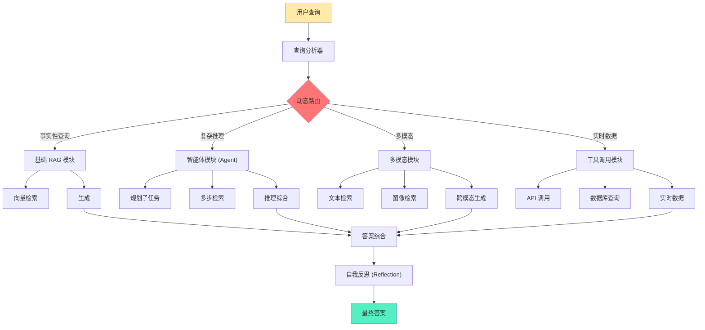

**模块 1：动态路由 (Dynamic Routing)**

**核心思想**：根据查询类型，自动选择最佳的处理路径。

**路由策略**：

**策略 1：基于查询分类**
```
查询分析器识别查询类型:

类型 1: 简单事实查询
  → 基础 RAG (向量检索 + 生成)

类型 2: 复杂推理查询
  → 智能体 RAG (多步检索 + 推理)

类型 3: 实时数据查询
  → 工具调用 (API + 数据库查询)

类型 4: 多模态查询
  → 多模态模块 (文本 + 图像)
```

**策略 2：基于置信度**
```
第一轮 RAG:
  检索置信度高 (> 0.9)
    → 直接返回答案

  检索置信度中 (0.7-0.9)
    → 查询扩展 + 重试

  检索置信度低 (< 0.7)
    → 切换到其他模块 (如 Agent)
```

**模块 2：智能体 RAG (Agentic RAG)**

**核心思想**：将 LLM 作为智能体，主动规划检索策略，而非被动检索。

**智能体 RAG 工作流示例**：
```
用户查询: "对比企业应用中 RAG 与微调的成本效益"

智能体规划:
  第一步：检索关于 RAG 成本的信息
  第二步：检索关于微调成本的信息
  第三步：检索企业级应用案例
  第四步：综合对比分析

执行过程:
  第一步 → 检索 → "RAG 的成本主要在向量数据库存储..."
  第二步 → 检索 → "微调需要 GPU 训练成本..."
  第三步 → 检索 → "企业案例..."
  第四步 → 推理 → "综合以上信息..."

最终答案:
  "根据检索到的信息，RAG 在企业应用中的成本优势体现在..."
```

**智能体能力**：

**能力 1：工具调用 (Tool Use)**
```
可用工具:
  - 向量检索 (搜索文档库)
  - 网页搜索 (获取实时信息)
  - 计算器 (数值计算)
  - SQL 查询 (结构化数据)

智能体自动选择工具:
  "查询成本数据" → 使用 SQL 查询
  "查询最新新闻" → 使用网页搜索
  "查询内部文档" → 使用向量检索
```

**能力 2：多步推理**
```
查询: "为什么 RAG 适合实时更新场景？"

智能体推理链:
  思考 1: 先理解 RAG 的更新机制
    → 检索 "RAG 更新机制"
    → 得知: "只需增删文档"

  思考 2: 理解微调的更新机制
    → 检索 "微调更新流程"
    → 得知: "需重新训练"

  思考 3: 对比两者的更新速度
    → 推理: "增删文档 << 重新训练"

  思考 4: 总结
    → "RAG 适合实时更新，因为更新成本低"
```

**模块 3：多模态 RAG (Multimodal RAG)**

**核心思想**：将 RAG 扩展到文本以外，支持图像、音频、视频等多种模态。

**多模态 RAG 架构**：
```
用户查询: "这张图片里显示的是什么架构？"
      ↓
图像 Embedding 模型:
  图像 → 图像向量
      ↓
跨模态检索:
  查询向量与图像向量数据库匹配
      ↓
检索结果: 找到相似的架构图
      ↓
多模态 LLM (如 GPT-4V):
  输入: 查询 + 图像
  输出: "这是一个典型的 RAG 架构图，包含..."
```

**多模态应用场景**：

**场景 1：图文检索**
```
查询: "显示 Kubernetes 部署的架构图"
检索: 向量库中的架构图片
生成: "这张图展示了 Kubernetes 的部署架构..."
```

**场景 2：视频 RAG**
```
查询: "视频里 15:30 讨论了什么？"
检索: 视频字幕 + 时间戳
生成: "在 15:30，讲师介绍了 RAG 的索引阶段..."
```

**场景 3：音频 RAG**
```
查询: "播客中关于 RAG 成本的部分"
检索: 播客转录文本
生成: "在 播客第 23 分钟，嘉宾提到..."
```

**模块 4：自我反思 RAG (Self-Reflective RAG)**

**核心思想**：RAG 系统自我评估回答质量，必要时进行修正。

**自我反思循环**：
```
第一轮生成:
  查询: "RAG 的优势有哪些？"
  检索: Top-3 文档
  生成: "RAG 的优势包括实时更新..."
      ↓
自我评估 (Self Evaluation):
  评估: 这个回答完整吗？
  检查:
    - 是否涵盖了所有主要优势？
    - 是否有遗漏？
    - 是否准确？
      ↓
如果不足:
  → 触发第二轮检索
  → 补充更多信息
      ↓
最终生成:
  "RAG 的优势包括：1. 实时更新 2. 数据接地 3. 隐私保护..."
```

**自我反思技术**：

**技术 1：答案验证**
```
LLM 检查：
  "这个答案是否基于检索出的上下文？
   是否有编造的信息？
   是否涵盖了所有相关点？"

如果发现幻觉：
  → 标记问题
  → 重新生成
```

**技术 2：知识图谱验证**
```
生成答案后：
  → 提取关键事实
  → 与知识图谱进行对比
  → 检查一致性

如果发现矛盾：
  → 修正答案或标记为不确定
```

**模块 5：自适应 RAG (Adaptive RAG)**

**核心思想**：根据用户反馈，持续优化 RAG 系统。

**反馈循环**：
```
用户使用 RAG 系统
      ↓
搜集反馈:
  - 点赞/点踩
  - 回答质量评分
  - 点击了哪些来源
      ↓
分析反馈:
  - 哪些检索策略效果好？
  - 哪些类型的查询失败率高？
  - 哪些文档质量高？
      ↓
自动优化:
  - 调整检索参数
  - 重新调整文档权重
  - 优化 Prompt 模板
```

**RAG 演进时间轴**：

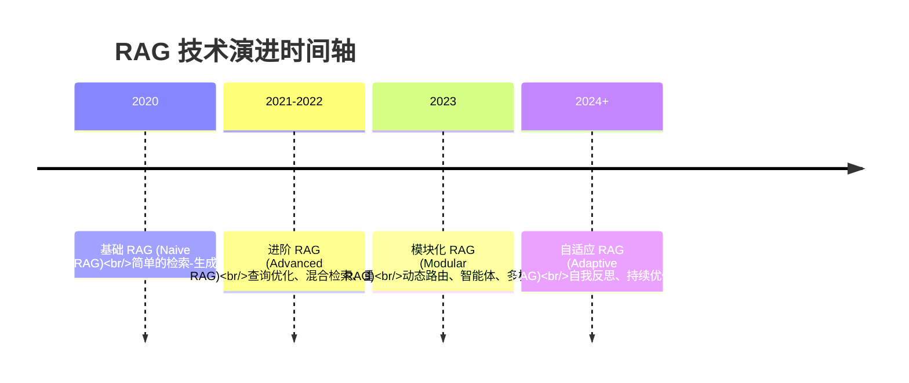

**三代 RAG 对比总结表**：

| 维度 | 基础 RAG | 进阶 RAG | 模块化 RAG |
|-----------|-----------|--------------|-------------|
| **查询处理** | 直接使用 | 重写、扩展 | 动态路由 |
| **检索方式** | 单一向量 | 混合检索 | 工具调用、多模态 |
| **重排序** | 无 | Cross-Encoder | 自适应 |
| **推理能力** | 无 | 有限 | 智能体多步推理 |
| **模态支持** | 仅文本 | 仅文本 | 多模态 |
| **自我改进** | 无 | 无 | 自我反思、反馈优化 |
| **复杂度** | 低 | 中 | 高 |
| **成本** | 低 | 中 | 高 |
| **适用场景** | 简单问答 | 复杂问答 | 企业级智能系统 |

**未来趋势**：

**趋势 1：深度 RAG + Agent 融合**
- Agent 作为 RAG 的“大脑”，主动规划检索策略
- RAG 作为 Agent 的“知识库”，提供实时信息

**趋势 2：多模态 RAG 的普及**
- 图像、视频、音频检索成为标配能力
- 跨模态的理解与生成

**趋势 3：自我进化的 RAG**
- 系统自动优化检索策略
- 基于用户反馈的持续改进

**趋势 4：垂直领域专用 RAG**
- 医疗 RAG（医疗知识库）
- 法律 RAG（法规数据库）
- 金融 RAG（市场数据）

---

## 总结

本章建立了对 RAG 系统的理论基础和架构理解，涵盖了以下核心内容：

**核心概念**：
- RAG 是一种通过检索外部知识库来增强 LLM 的架构模式。
- 本质是“开卷考试”，将 LLM 从“闭卷”转变为“带参考书”。
- 核心原理是基于语义距离的信息传递，而非学习。

**为什么需要 RAG**：
- LLM 的局限：幻觉、知识截止、长尾缺失、无归因。
- RAG 的核心价值：数据接地、实时更新、隐私保护、成本效率、可追溯性。
- RAG vs 微调：互补技术，各有适用边界。

**核心技术**：
- 向量空间模型：语义的高维几何表示。
- Embedding：文本到向量的映射，保持语义相似性。
- 相似度度量：余弦相似度（默认首选）、欧几里得距离、点积。

**标准架构**：
- 第一阶段：索引 (解析、清洗、分块、向量化、存储)。
- 第二阶段：检索 (查询优化、向量检索、混合检索、重排序)。
- 第三阶段：生成 (上下文构建、Prompt 模板、LLM 推理、后处理)。

**演进范式**：
- 基础 RAG：基本三阶段，简单但有局限。
- 进阶 RAG：增加查询优化、混合检索与重排，大幅提升质量。
- 模块化 RAG：动态路由、智能体、多模态、自我反思，下一代架构。

**下一步**：
在理解了 RAG 的基础理论与架构后，下一章将深入探讨 **数据处理 (Data Processing)** 的工程实现，包括如何高效地解析、清洗、分块和向量化各种类型的文档。
