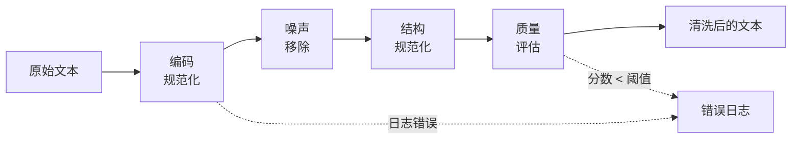
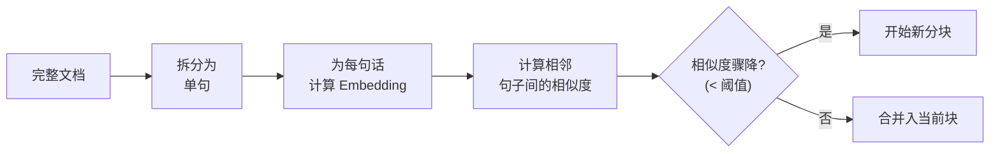
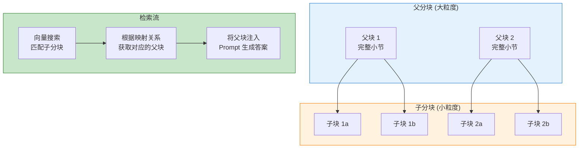

# 2. 数据处理流水线

> **"数据质量是 RAG 系统性能的基石。 垃圾进，垃圾出。"** — 机器学习基本原理

本章探讨 RAG 系统的完整数据处理流水线，重点关注处理逻辑、问题解决方法和架构决策，而非实现细节。

---

## 2.1 数据处理流水线简介

### 为什么数据处理很重要

在实际的 RAG 应用中，**80% 的开发工作量花在数据处理上**，只有 20% 花在检索和生成上。这是因为：

1. **原始数据是杂乱的**：真实文档格式多样、包含噪声、缺乏结构
2. **检索质量取决于分块**：糟糕的分块会导致不相关或碎片化的上下文
3. **元数据实现高效过滤**：没有适当的元数据，每个查询都需要昂贵的向量搜索
4. **Embedding 成本会累积**：处理数百万文档需要优化策略

### 端到端流水线

```mermaid
flowchart TB
    subgraph Input["原始文档 (多种来源)"]
        PDF[PDF 文件]
        HTML[HTML 页面]
        MD[Markdown]
        DOCX[Word 文档]
        API[API 数据]
    end

    subgraph Pipeline["处理流水线"]
        LOAD[文档加载]
        CLEAN[数据清洗]
        CHUNK[分块策略]
        META[元数据增强]
        EMBED[向量化 (Embedding)]
    end

    subgraph Output["输出：带元数据的分块"]
        OUT1["分块 1<br/>+ 元数据"]
        OUT2["分块 2<br/>+ 元数据"]
        OUT3["分块 3<br/>+ 元数据"]
    end

    Input --> Pipeline --> Output
```

---

## 2.2 文档加载 (Document Loading)

### 多格式支持

**Spring AI Reader 架构**：

Spring AI 提供了一个统一的 `DocumentReader` 接口，并针对不同格式提供了多种实现：

```java
public interface DocumentReader {
    List<Document> read(String resource);
}
```

| 格式 | 阅读器 (Reader) | 优点 | 缺点 | 最适合 |
|------|--------|------|------|----------|
| **PDF** | PagePdfDocumentReader | 表格提取效果好 | 复杂布局解析较差 | 学术论文、报告 |
| **Markdown** | MarkdownDocumentReader | 结构保留完整 | 过于简单 | 技术文档、博客 |
| **HTML** | JsoupDocumentReader | 标签清理能力强 | 可能丢失语义信息 | 网页、博客 |
| **DOCX** | ApacheTikaDocumentReader | 格式覆盖全面 | 需要额外依赖 | Word 文档 |
| **JSON** | JsonDocumentReader | 结构化程度高 | 仅限 JSON 格式 | API 响应、配置文件 |
| **TXT** | TextDocumentReader | 实现简单 | 缺乏结构化信息 | 纯文本日志 |

### Spring AI 实现示例

```java
@Service
public class DocumentLoadingService {

    private final PagePdfDocumentReader pdfReader;
    private final MarkdownDocumentReader markdownReader;
    private final JsonDocumentReader jsonReader;

    public DocumentLoadingService(
            PagePdfDocumentReader pdfReader,
            MarkdownDocumentReader markdownReader,
            JsonDocumentReader jsonReader
    ) {
        this.pdfReader = pdfReader;
        this.markdownReader = markdownReader;
        this.jsonReader = jsonReader;
    }

    public List<Document> loadDocuments(String path) {
        String extension = getFileExtension(path);

        return switch (extension.toLowerCase()) {
            case "pdf" -> pdfReader.read(path);
            case "md", "markdown" -> markdownReader.read(path);
            case "json" -> jsonReader.read(path);
            default -> throw new UnsupportedOperationException(
                "不支持的格式: " + extension);
        };
    }

    private String getFileExtension(String path) {
        return path.substring(path.lastIndexOf(".") + 1);
    }
}
```

---

## 2.3 数据清洗 (Data Cleaning)

### 噪声类型与清洗策略

| 噪声类型 | 描述 | 影响 | 解决方案 |
|-----------|------|------|----------|
| **编码错误** | 特殊符号显示为乱码 | 导致 Token 破碎 | 编码规范化（统一使用 UTF-8） |
| **HTML 标签残留** | 未被清理干净的 HTML 标签 | 降低语义质量 | 正则表达式或专门解析器清理 |
| **特殊字符** | ASCII 0-31 中的不可见控制字符 | 影响 Token 化过程 | 正则过滤移除 |
| **冗余空白** | 过多的连续空格或制表符 | 影响分块质量 | 空白字符规范化 |
| **样板文本** | "Copyright 2024..." 等重复免责声明 | 干扰嵌入向量质量 | 基于模式匹配的自动移除 |
| **格式不一致** | 日期格式、度量衡缩写不统一 | 阻碍元数据过滤性能 | 格式规范化预处理 |

### 清洗流水线架构



```java
@Service
public class DataCleaningService {

    private final List<TextCleaner> cleaners;

    public DataCleaningService(List<TextCleaner> cleaners) {
        this.cleaners = cleaners;
    }

    public CleanResult clean(String rawText) {
        String cleaned = rawText;
        List<String> operations = new ArrayList<>();

        for (TextCleaner cleaner : cleaners) {
            CleanStep step = cleaner.clean(cleaned);
            cleaned = step.result();
            operations.add(step.description());
        }

        return new CleanResult(cleaned, operations);
    }

    public record CleanResult(String text, List<String> operations) {}
    public record CleanStep(String result, String description) {}
}
```

### 通用清洗器实现

```java
@Component
public class EncodingNormalizer implements TextCleaner {
    @Override
    public CleanStep clean(String text) {
        String normalized = text
            .replace("\u00A0", " ")   // 不换行空格
            .replace("\u200B", " ")   // 零宽空格
            .replace("\uFEFF", "-")   // 软连字符
            .replaceAll("[^\\x20-\\x7E]", "?"); // 替换其他异常字符
        return new CleanStep(normalized, "编码规范化");
    }
}

@Component
public class HtmlTagRemover implements TextCleaner {
    private static final Pattern HTML_TAG = Pattern.compile("<[^>]+>");

    @Override
    public CleanStep clean(String text) {
        String cleaned = HTML_TAG.matcher(text).replaceAll("");
        return new CleanStep(cleaned, "HTML 标签移除");
    }
}

@Component
public class WhitespaceNormalizer implements TextCleaner {
    @Override
    public CleanStep clean(String text) {
        String normalized = text
            .replaceAll("\\s+", " ")      // 多个空格合并为一个
            .replaceAll("\\n{3,}", "\\n\\n") // 超过两个的换行符缩减为两个
            .trim();
        return new CleanStep(normalized, "空白字符规范化");
    }
}
```

---

## 2.4 智能分块策略

### 为什么分块很重要

**核心洞察**：分块大小（Chunk Size）直接决定了检索精度和生成的上下文质量。

```
分块过小 (100 tokens):
  "该模型使用注意力机制来"  ← 信息残缺
  问题: 丢失了关键上下文

分块过大 (2000 tokens):
  "本篇文档详细描述了 Transformer 模型的完整架构，包括多头注意力、
   前馈网络、层规范化、位置编码以及整个训练流程..."  ← 信息过载
  问题: 检索精度降低，关键信息被无关细节稀释

分块恰到好处 (500 tokens):
  "Transformer 模型使用多头注意力机制来处理输入序列。
   每个注意力头独立计算查询、键、值向量..."  ← 聚焦且完整
  收益: 信息完整，且与查询高度匹配
```

### 分块方法对比

| 策略 | 原理 | 最佳分块大小 | 优点 | 缺点 | 适用场景 |
|------|------|-------------|------|------|----------|
| **固定大小** | 按字符/Token 数硬切 | 500-1000 | 简单高效、可预测 | 可能截断语义单元 | 通用文档 |
| **递归字符** | 按分隔符层级（段、句）切分 | 自适应 | 尊重句子和段落边界 | 仍可能意外切分段落 | 结构化文档 |
| **语义分块** | 基于 Embedding 相似度切分 | 自适应 | 保持最高的语义完整性 | 需调用模型、处理慢 | 技术手册、专业文档 |
| **文档结构** | 按标题、章节目录切分 | 自适应 | 完美契合文档逻辑 | 块大小可能极度不均 | 结构极其良好的文档 |
| **句子级** | 以单句为单位切分 | 100-300 | 极细粒度检索 | 严重缺乏上下文信息 | FAQ、短文本问答 |

### 语义分块详解 (Semantic Chunking)

**问题**：固定大小分块经常在句子中途截断，导致语义丢失。

**解决方案**：利用 Embedding 相似度识别自然语义边界。



```java
@Service
public class SemanticChunkingService {

    private final EmbeddingModel embeddingModel;
    private static final double SIMILARITY_THRESHOLD = 0.5;

    public List<Document> chunk(String text) {
        // 步骤 1: 拆分为句子
        List<String> sentences = splitIntoSentences(text);

        // 步骤 2: 为每句话生成 Embedding
        List<float[]> embeddings = sentences.stream()
            .map(embeddingModel::embed)
            .toList();

        // 步骤 3: 计算相邻句子之间的相似度
        List<Double> similarities = new ArrayList<>();
        for (int i = 0; i < embeddings.size() - 1; i++) {
            double similarity = cosineSimilarity(
                embeddings.get(i), embeddings.get(i + 1));
            similarities.add(similarity);
        }

        // 步骤 4: 找到相似度下降的断点
        List<Integer> breakpoints = new ArrayList<>();
        for (int i = 0; i < similarities.size(); i++) {
            if (similarities.get(i) < SIMILARITY_THRESHOLD) {
                breakpoints.add(i + 1); // 新分块从下一句开始
            }
        }

        // 步骤 5: 根据断点创建文档块
        return createChunks(sentences, breakpoints);
    }

    private List<String> splitIntoSentences(String text) {
        return Arrays.asList(text.split("(?<=[.!?])\\s+"));
    }

    private double cosineSimilarity(float[] a, float[] b) {
        // 向量余弦相似度计算逻辑
        // ... (此处省略具体实现)
        return 0.85; 
    }

    private List<Document> createChunks(List<String> sentences, List<Integer> breakpoints) {
        List<Document> chunks = new ArrayList<>();
        int start = 0;

        for (int bp : breakpoints) {
            String chunkContent = String.join(" ", sentences.subList(start, bp));
            chunks.add(new Document(chunkContent));
            start = bp;
        }

        // 添加剩余部分
        if (start < sentences.size()) {
            String chunkContent = String.join(" ", sentences.subList(start, sentences.size()));
            chunks.add(new Document(chunkContent));
        }

        return chunks;
    }
}
```

### 递归字符分块 (Recursive Character Chunking)

**问题**：需要一种无需调用模型且能尊重文档物理结构的分块方法。

**解决方案**：定义一组带优先级的层级分隔符进行递归拆分。

```java
@Service
public class RecursiveChunkingService {

    private static final List<String> SEPARATORS = List.of(
        "\\n# ",      // 一级标题
        "\\n## ",     // 二级标题
        "\\n### ",    // 三级标题
        "\\n\\n",     // 段落
        ". ",         // 句子
        " "           // 单词（最后的手段）
    );

    private final int maxChunkSize; // 最大块长度
    private final int overlapSize;  // 重叠部分长度

    public RecursiveChunkingService(int maxChunkSize, int overlapSize) {
        this.maxChunkSize = maxChunkSize;
        this.overlapSize = overlapSize;
    }

    public List<Document> chunk(String text) {
        return recursiveSplit(text, 0);
    }

    private List<Document> recursiveSplit(String text, int separatorIndex) {
        if (separatorIndex >= SEPARATORS.size()) {
            return List.of(new Document(text));
        }

        List<Document> chunks = new ArrayList<>();
        String[] parts = text.split(SEPARATORS.get(separatorIndex));

        for (String part : parts) {
            if (part.length() <= maxChunkSize) {
                chunks.add(new Document(part));
            } else {
                // 如果当前部分仍太大，使用下一个更细粒度的分隔符进行拆分
                chunks.addAll(recursiveSplit(part, separatorIndex + 1));
            }
        }

        return chunks;
    }
}
```

### 父子分块（高级模式 - Parent-Child Chunking）

**问题**：小分块虽然检索精度高，但生成时容易缺乏背景；大分块背景丰富，但检索不精确。

**解决方案**：利用小分块进行语义检索，命中后返回其对应的父文档块（大分块）供 LLM 生成。



```java
@Service
public class ParentChildChunkingService {

    private final VectorStore vectorStore;
    private static final int PARENT_SIZE = 2000;
    private static final int CHILD_SIZE = 300;

    public void indexDocuments(List<Document> documents) {
        for (Document doc : documents) {
            // 步骤 1: 创建大的父分块
            List<Document> parents = splitBySize(doc.getContent(), PARENT_SIZE);

            for (Document parent : parents) {
                // 步骤 2: 在父块内部拆分出小的子分块
                List<Document> children = createChildChunks(parent);

                // 步骤 3: 为子块添加父块引用信息
                for (Document child : children) {
                    child.getMetadata().put("parent_id", parent.getId());
                    child.getMetadata().put("parent_content", parent.getContent());
                }

                // 步骤 4: 仅将子块存入向量索引
                vectorStore.add(children);
            }
        }
    }

    private List<Document> splitBySize(String text, int size) {
        List<Document> chunks = new ArrayList<>();
        int overlap = size / 10;
        for (int i = 0; i < text.length(); i += size - overlap) {
            int end = Math.min(i + size, text.length());
            chunks.add(new Document(text.substring(i, end)));
        }
        return chunks;
    }

    private List<Document> createChildChunks(Document parent) {
        return splitBySize(parent.getContent(), CHILD_SIZE);
    }
}
```

---

## 2.5 元数据增强 (Metadata Enrichment)

### 元数据为何重要

元数据使得**“先过滤，后搜索”**成为可能，大幅减小了向量搜索的计算范围并降低了成本。

```
方案 A (无过滤):
  查询: "展示 2024 年的 Python 日志指南"
  → 在 100 万份文档中进行全量向量搜索
  → 速度慢 + 成本高 + 精度受限

方案 B (元数据过滤):
  查询: "展示 2024 年的 Python 日志指南"
  → 先行过滤: language=python AND year=2024
  → 仅匹配出 5000 份文档
  → 在这 5000 份中进行向量搜索
  → 极速 + 廉价 + 高精度
```

### 自动提取的元数据类型

| 元数据项 | 提取方法 | 示例值 | 主要用途 |
|-----------|----------|------|------|
| **文件类型** | 文件扩展名解析 | pdf, md, html | 格式过滤与路由 |
| **源文件** | 文件路径/URL 映射 | docs/guide.pdf | 来源追溯与归属 |
| **创建日期** | 文件系统时间戳 | 2024-01-15 | 时间范围过滤 |
| **语言** | 语种检测模型 | en, zh, ja | 语言分区检索 |
| **层级结构** | 文档目录树解析 | 第三章, 第 15 页 | 精准定位 |
| **内容统计** | 字数/Token 统计 | 2,450 字符 | 过滤掉极短的噪音块 |
| **关键实体** | 传统 NLP 提取 (NER) | ["OpenAI", "Spring"] | 业务实体过滤 |

### LLM 增强元数据

```java
@Service
public class MetadataEnrichmentService {

    private final ChatModel llm;

    public Document enrichMetadata(Document document) {
        String prompt = """
            分析以下文本并提取元数据。
            
            文本内容: %s
            
            请以 JSON 格式返回以下字段：
            - title: 文档标题或本节的主题
            - summary: 2-3 句话的简要总结
            - keywords: 5-10 个核心关键词
            - category: 类型归类，选其一 [技术, 业务, 法律, 人事, 通用]
            - language: 识别出的语言代码
            """.formatted(document.getContent().substring(0, 2000));

        String response = llm.call(prompt);
        
        // 解析 JSON 并填充至元数据
        JsonNode metadata = objectMapper.readTree(response);
        document.getMetadata().put("llm_title", metadata.get("title").asText());
        document.getMetadata().put("llm_summary", metadata.get("summary").asText());
        document.getMetadata().put("llm_keywords", metadata.get("keywords").toString());
        document.getMetadata().put("llm_category", metadata.get("category").asText());
        document.getMetadata().put("llm_language", metadata.get("language").asText());

        return document;
    }
}
```

---

## 2.6 批量向量化 (Batch Embedding Generation)

### 为什么批量处理至关重要

```
方案 1: 逐个处理 (Naive)
  100 万文档 × 每次调用 $0.0001 = $100
  耗时: 100 万 × 100ms = 28 小时

方案 2: 批量处理 (Optimized)
  每批次处理 100 条文档
  1 万个批次 × 每次调用 $0.0001 × 100 = $10 (注：API 成本可能相同，但网络开销骤降)
  耗时: 1 万次调用 × 2s = 5.5 小时

节省效果: 显著的时间成本和系统开销降低
```

### Spring AI 批量向量化实现

```java
@Service
public class BatchEmbeddingService {

    private final EmbeddingModel embeddingModel;
    private static final int BATCH_SIZE = 100;

    public void batchEmbed(List<Document> documents) {
        List<List<Document>> batches = partition(documents, BATCH_SIZE);

        for (List<Document> batch : batches) {
            List<String> texts = batch.stream()
                .map(Document::getContent)
                .toList();

            // 批量调用向量模型 API
            List<float[]> embeddings = embeddingModel.embed(texts);

            // 将生成的向量关联回对应文档
            for (int i = 0; i < batch.size(); i++) {
                batch.get(i).setEmbedding(embeddings.get(i));
            }
        }
    }

    private <T> List<List<T>> partition(List<T> list, int size) {
        List<List<T>> partitions = new ArrayList<>();
        for (int i = 0; i < list.size(); i += size) {
            partitions.add(list.subList(i, Math.min(i + size, list.size())));
        }
        return partitions;
    }
}
```

### Embedding 缓存策略

```java
@Service
public class EmbeddingCacheService {

    private final EmbeddingModel embeddingModel;
    private final Cache<String, float[]> cache; // 例如使用 Redis 或 Caffeine

    public float[] embedWithCache(String text) {
        // 使用文本的哈希值作为缓存 Key
        String cacheKey = DigestUtils.sha256Hex(text);

        float[] cached = cache.getIfPresent(cacheKey);
        if (cached != null) {
            return cached; // 命中缓存，避免重复 API 调用
        }

        float[] embedding = embeddingModel.embed(text);
        cache.put(cacheKey, embedding);

        return embedding;
    }
}
```

---

## 总结

### 核心要点

**1. 文档加载**:
- 利用 Spring AI 的 `DocumentReader` 接口实现多格式支持。
- 自动化路由机制确保不同文件类型得到正确处理。

**2. 数据清洗**:
- 涵盖编码规范化、噪声移除、格式统一等关键步骤。
- 模块化的链式清洗模式（Chain of Cleaners）提升了可维护性。

**3. 分块策略**:
- 语义分块（Semantic Chunking）优先保证上下文完整。
- 递归字符分块（Recursive）更经济且兼顾物理结构。
- 父子分块（Parent-Child）是平衡高精度检索与丰富生成背景的最佳实践。

**4. 元数据增强**:
- 自动提取基础信息以支持高效的物理过滤。
- LLM 增强元数据为文档提供了深度的语义标签和摘要。

**5. 性能优化**:
- 批量处理显著提升了处理效率并降低了延迟。
- 缓存机制有效避免了重复的内容向量化支出。

---

**下一步**:
- 深入 [向量索引与存储](/docs/ai/rag/vector-indexing) 了解索引核心算法。
- 探索 [检索策略](/docs/ai/rag/retrieval) 学习如何在大海中捞出最准确的针。
