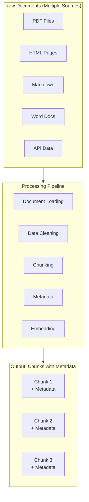
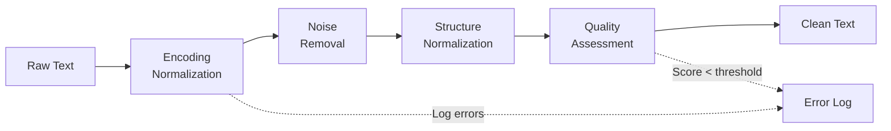
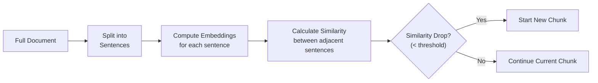
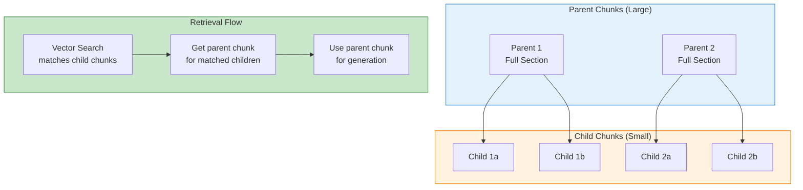

# 2. 数据处理流水线

> **"数据质量是 RAG 系统性能的基石。 垃圾进，垃圾出。"** — 机器学习基本原理

本章探讨 RAG 系统的完整数据处理流水线，重点关注处理逻辑、问题解决方法和架构决策，而非实现细节。

---

## 2.1 数据处理流水线简介

### 为什么数据处理很重要

在实际的 RAG 应用中，**80% 的开发工作量花在数据处理上**，只有 20% 花在检索和生成上。这是因为：

1. **原始数据是杂乱的**：真实文档格式多样、包含噪声、缺乏结构
2. **检索质量取决于分块**：糟糕的分块会导致不相关或碎片化的上下文
3. **元数据实现高效过滤**：没有适当的元数据，每个查询都需要昂贵的向量搜索
4. **Embedding 成本会累积**：处理数百万文档需要优化策略

### 端到端流水线



---

## 2.2 Document Loading

### Multi-Format Support

**Spring AI Reader Architecture**:

Spring AI provides a unified `DocumentReader` interface with multiple format-specific implementations:

```java
public interface DocumentReader {
    List<Document> read(String resource);
}
```

| Format | Reader | Pros | Cons | Best For |
|------|--------|------|------|----------|
| **PDF** | PagePdfDocumentReader | 表格提取好 | 复杂布局较差 | 学术论文、报告 |
| **Markdown** | MarkdownDocumentReader | 结构保留好 | 简单 | 技术文档、博客 |
| **HTML** | JsoupDocumentReader | 清理标签好 | 可能丢失语义 | 网页、博客 |
| **DOCX** | ApacheTikaDocumentReader | 格式全面 | 需要额外依赖 | Word 文档 |
| **JSON** | JsonDocumentReader | 结构化 | 仅限 JSON | API 响应、配置文件 |
| **TXT** | TextDocumentReader | 简单 | 无结构 | 纯文本日志 |

### Spring AI Implementation

```java
@Service
public class DocumentLoadingService {

    private final PagePdfDocumentReader pdfReader;
    private final MarkdownDocumentReader markdownReader;
    private final JsonDocumentReader jsonReader;

    public DocumentLoadingService(
            PagePdfDocumentReader pdfReader,
            MarkdownDocumentReader markdownReader,
            JsonDocumentReader jsonReader
    ) {
        this.pdfReader = pdfReader;
        this.markdownReader = markdownReader;
        this.jsonReader = jsonReader;
    }

    public List<Document> loadDocuments(String path) {
        String extension = getFileExtension(path);

        return switch (extension.toLowerCase()) {
            case "pdf" -> pdfReader.read(path);
            case "md", "markdown" -> markdownReader.read(path);
            case "json" -> jsonReader.read(path);
            default -> throw new UnsupportedOperationException(
                "Unsupported format: " + extension);
        };
    }

    private String getFileExtension(String path) {
        return path.substring(path.lastIndexOf(".") + 1);
    }
}
```

---

## 2.3 Data Cleaning

### 噪声类型与清洗策略

| 噪声类型 | 描述 | 影响 | 解决方案 |
|-----------|------|------|----------|
| **编码错误** | @， → 正常的字符映射错误 | 导致 Token 刭碎 | 编码规范化（UTF-8） |
| **HTML 标签残留** | HTML 标签未被完全移除 | 影响语义质量 | 正则/解析器清理 |
| **特殊字符** | ASCII 0-31 中的控制字符 | 影响 Token 化 | 正则移除 |
| **额外空白** | 多个空格/制表符 | 役响分块质量 | 空白规范化 |
| **样板文本** | "Copyright 2024..." | 影响嵌入质量 | 基于模式的移除 |
| **格式不一致** | 日期格式、缩写不统一 | 妨碍元数据过滤 | 规范化处理 |

### 清洗流水线架构



```java
@Service
public class DataCleaningService {

    private final List<TextCleaner> cleaners;

    public DataCleaningService(List<TextCleaner> cleaners) {
        this.cleaners = cleaners;
    }

    public CleanResult clean(String rawText) {
        String cleaned = rawText;
        List<String> operations = new ArrayList<>();

        for (TextCleaner cleaner : cleaners) {
            CleanStep step = cleaner.clean(cleaned);
            cleaned = step.result();
            operations.add(step.description());
        }

        return new CleanResult(cleaned, operations);
    }
}

    public record CleanResult(String text, List<String> operations) {}
    public record CleanStep(String result, String description) {}
}
```

### 通用清洗器

```java
@Component
public class EncodingNormalizer implements TextCleaner {
    @Override
    public CleanStep clean(String text) {
        String normalized = text
            .replace("\u00A0", " ")   // Non-breaking space
            .replace("\u200B", " ")   // Zero-width space
            .replace("\uFEFF", "-")   // Soft hyphen
            .replaceAll("[^\\x20-\\x7E]", "?"); // Replace other weird chars
        return new CleanStep(normalized, "Encoding normalization");
    }
}

@Component
public class HtmlTagRemover implements TextCleaner {
    private static final Pattern HTML_TAG = Pattern.compile("<[^>]+>");

    @Override
    public CleanStep clean(String text) {
        String cleaned = HTML_TAG.matcher(text).replaceAll("");
        return new CleanStep(cleaned, "HTML tag removal");
    }
}

@Component
public class WhitespaceNormalizer implements TextCleaner {
    @Override
    public CleanStep clean(String text) {
        String normalized = text
            .replaceAll("\\s+", " ")      // Multiple spaces to one
            .replaceAll("\\n{3,}", "\\n\\n") // Multiple newlines to max 2
            .trim();
        return new CleanStep(normalized, "Whitespace normalization");
    }
}
```

---

## 2.4 智能分块策略

### 为什么分块很重要

**核心洞察**: 分块大小直接影响检索精度和生成质量。

```
Chunk Too Small (100 tokens):
  "The model uses attention mechanism to"  ← 信息不完整
  Problem: 丢失关键上下文

Chunk Too Large (2000 tokens):
  "This document describes in detail the complete architecture of transformer
   model, including multi-head attention, feed-forward networks, layer normalization,
   position encoding, and the training process..."  ← 太多信息
  Problem: 检索精度低，稀释关键信息

Chunk Just Right (500 tokens):
  "Transformer model uses multi-head attention mechanism to process input sequences.
   Each attention head independently computes query, key, value vectors..."  ← 恰到好处
  Benefits: 信息完整且聚焦
```

### 分块方法对比

| 策略 | 原理 | 最佳分块大小 | 优点 | 缺点 | 适用场景 |
|------|------|-------------|------|------|----------|
| **固定大小** | 按字符/Token 数切分 | 500-1000 | 简单、可预测 | 可能打断语义 | 通用文档 |
| **递归字符** | 按分隔符层级切分 | 自适应 | 尊重句子边界 | 仍可能打断段落 | 结构化文档 |
| **语义分块** | 基于语义相似度切分 | 自适应 | 保持语义完整性 | 需要模型、较慢 | 技术文档 |
| **文档结构** | 按标题/章节切分 | 自适应 | 保持结构完整 | 可能太大/太小 | 结构良好的文档 |
| **句子级** | 按句子切分 | 100-300 | 精细粒度 | 缺乏上下文 | FAQ、短文本 |

### 语义分块详解

**问题**: 固定大小分块可能在句子中间截断，丢失关键上下文。

**解决方案**: 使用 Embedding 相似度检测语义边界。



```java
@Service
public class SemanticChunkingService {

    private final EmbeddingModel embeddingModel;
    private static final double SIMILARITY_THRESHOLD = 0.5;

    public List<Document> chunk(String text) {
        // Step 1: Split into sentences
        List<String> sentences = splitIntoSentences(text);

        // Step 2: Compute embeddings for each sentence
        List<float[]> embeddings = sentences.stream()
            .map(embeddingModel::embed)
            .toList();

        // Step 3: Calculate similarity between adjacent sentences
        List<Double> similarities = new ArrayList<>();
        for (int i = 0; i < embeddings.size() - 1; i++) {
            double similarity = cosineSimilarity(
                embeddings.get(i), embeddings.get(i + 1));
            similarities.add(similarity);
        }

        // Step 4: Identify breakpoints where similarity drops
        List<Integer> breakpoints = new ArrayList<>();
        for (int i = 0; i < similarities.size(); i++) {
            if (similarities.get(i) < SIMILARITY_THRESHOLD) {
                breakpoints.add(i + 1); // New chunk starts after this sentence
            }
        }

        // Step 5: Create chunks based on breakpoints
        return createChunks(sentences, breakpoints);
    }

    private List<String> splitIntoSentences(String text) {
        return Arrays.asList(text.split("(?<=[.!?])\\s+"));
    }

    private double cosineSimilarity(float[] a, float[] b) {
        double dotProduct = 0.0;
        double normA = 0.0;
        double normB = 0.0;
        for (int i = 0; i < a.length; i++) {
            dotProduct += a[i] * b[i];
            normA += a[i] * a[i];
            normB += b[i] * b[i];
        }
        return dotProduct / (Math.sqrt(normA) * Math.sqrt(normB));
    }

    private List<Document> createChunks(List<String> sentences, List<Integer> breakpoints) {
        List<Document> chunks = new ArrayList<>();
        int start = 0;

        for (int bp : breakpoints) {
            String chunkContent = String.join(" ", sentences.subList(start, bp));
            chunks.add(new Document(chunkContent));
            start = bp;
        }

        // Add remaining sentences
        if (start < sentences.size()) {
            String chunkContent = String.join(" ", sentences.subList(start, sentences.size()));
            chunks.add(new Document(chunkContent));
        }

        return chunks;
    }
}
```

### 递归字符分块

**问题**: 需要一种尊重文档结构但不需要 Embedding 计算的分块方法。

**解决方案**: 按分隔符层级从粗到细递归切分。

```java
@Service
public class RecursiveChunkingService {

    private static final List<String> SEPARATORS = List.of(
        "\\n# ",      // H1 headers
        "\\n## ",     // H2 headers
        "\\n### ",    // H3 headers
        "\\n\\n",     // Paragraphs
        ". ",         // Sentences
        " "           // Words (last resort)
    );

    private final int maxChunkSize;
    private final int overlapSize;

    public RecursiveChunkingService(int maxChunkSize, int overlapSize) {
        this.maxChunkSize = maxChunkSize;
        this.overlapSize = overlapSize;
    }

    public List<Document> chunk(String text) {
        return recursiveSplit(text, 0);
    }

    private List<Document> recursiveSplit(String text, int separatorIndex) {
        if (separatorIndex >= SEPARATORS.size()) {
            return List.of(new Document(text));
        }

        List<Document> chunks = new ArrayList<>();
        String[] parts = text.split(SEPARATORS.get(separatorIndex));

        for (String part : parts) {
            if (part.length() <= maxChunkSize) {
                chunks.add(new Document(part));
            } else {
                chunks.addAll(recursiveSplit(part, separatorIndex + 1));
            }
        }

        return chunks;
    }
}
```

### 父子分块（高级模式）

**问题**: 小分块检索精确但缺乏上下文。大分块上下文完整但检索不精确。

**解决方案**: 用小分块检索，用大分块（父文档）生成。



```java
@Service
public class ParentChildChunkingService {

    private final EmbeddingModel embeddingModel;
    private final VectorStore vectorStore;

    private static final int PARENT_SIZE = 2000;
    private static final int CHILD_SIZE = 300;

    public void indexDocuments(List<Document> documents) {
        for (Document doc : documents) {
            // Create parent chunks
            List<Document> parents = createParentChunks(doc);

            for (Document parent : parents) {
                // Create child chunks
                List<Document> children = createChildChunks(parent);

                // Store children with parent reference
                for (Document child : children) {
                    child.getMetadata().put("parent_id", parent.getId());
                    child.getMetadata().put("parent_content", parent.getContent());
                }

                // Index children for retrieval
                vectorStore.add(children);
            }
        }
    }

    private List<Document> createParentChunks(Document doc) {
        // Split into large chunks
        return splitBySize(doc.getContent(), PARENT_SIZE);
    }

    private List<Document> createChildChunks(Document parent) {
        // Split parent into small chunks
        return splitBySize(parent.getContent(), CHILD_SIZE);
    }

    private List<Document> splitBySize(String text, int size) {
        List<Document> chunks = new ArrayList<>();
        int overlap = size / 10;

        for (int i = 0; i < text.length(); i += size - overlap) {
            int end = Math.min(i + size, text.length());
            chunks.add(new Document(text.substring(i, end)));
        }

        return chunks;
    }
}
```

---

## 2.5 元数据增强

### 元数据为何重要

元数据使得**先过滤后搜索**成为可能，大幅减少向量搜索的范围和成本。

```
无元数据过滤:
  Query: "Show me Python logging guides from 2024"
  → Vector search ALL 1M documents
  → Slow + expensive + imprecise

有元数据过滤:
  Query: "Show me Python logging guides from 2024"
  → Filter: language=python AND year=2024
  → Only 5K documents match
  → Vector search 5K documents
  → Fast + cheap + precise
```

### 自动提取的元数据类型

| 元数据类型 | 提取方法 | 示例 | 用于 |
|-----------|----------|------|------|
| **文件类型** | 文件扩展名 | pdf, md, html | 格式路由 |
| **源文件** | 文件路径 | docs/guide.pdf | 来源追踪 |
| **创建日期** | 文件时间戳 | 2024-01-15 | 时间过滤 |
| **语言** | 语言检测 | en, zh, ja | 语言路由 |
| **节/页** | 结构检测 | 第 3 节,页 15 | 定位 |
| **字数** | 字符计数 | 2,450 | 质量过滤 |
| **关键词** | TF-IDF / LLM | ["python", "logging"] | 主题过滤 |

### LLM 增强元数据

```java
@Service
public class MetadataEnrichmentService {

    private final ChatModel llm;

    public Document enrichMetadata(Document document) {
        String prompt = """
            Analyze the following text and extract metadata.
            
            Text: %s
            
            Return JSON with:
            - title: Document title or section heading
            - summary: 2-3 sentence summary
            - keywords: 5-10 important keywords
            - category: One of [technical, business, legal, hr, general]
            - language: Detected language code
            """.formatted(document.getContent().substring(0, 2000));

        String response = llm.call(prompt);
        
        // Parse and add metadata
        JsonNode metadata = objectMapper.readTree(response);
        document.getMetadata().put("llm_title", metadata.get("title").asText());
        document.getMetadata().put("llm_summary", metadata.get("summary").asText());
        document.getMetadata().put("llm_keywords", metadata.get("keywords").toString());
        document.getMetadata().put("llm_category", metadata.get("category").asText());
        document.getMetadata().put("llm_language", metadata.get("language").asText());

        return document;
    }
}
```

---

## 2.6 批量 Embedding 生成

### 为什么批量处理重要

```
逐个处理 (Naive):
  1M documents × $0.0001/doc = $100
  Time: 1M × 100ms = 28 hours

批量处理 (Optimized):
  Batch 100 at a time
  10K batches × $0.0001/batch × 100 = $10
  Time: 10K × 2s = 5.5 hours

节省: 90% cost, 80% time
```

### 批量处理策略

| 策略 | 描述 | 批量大小 | 成本影响 |
|------|------|---------|----------|
| **简单批量** | 发送 N 个文档 | 100-500 | 适合 OpenAI API |
| **异步批量** | 多个并发请求 | 10-50 并发 | 高吞吐量 |
| **流式批量** | 文档流入时处理 | 自适应 | 持续索引 |
| **分层批量** | 按优先级排序 | 可变 | 关键文档优先 |

### Spring AI 批量 Embedding

```java
@Service
public class BatchEmbeddingService {

    private final EmbeddingModel embeddingModel;
    private static final int BATCH_SIZE = 100;

    public void batchEmbed(List<Document> documents) {
        List<List<Document>> batches = partition(documents, BATCH_SIZE);

        for (List<Document> batch : batches) {
            List<String> texts = batch.stream()
                .map(Document::getContent)
                .toList();

            // Batch embedding call
            List<float[]> embeddings = embeddingModel.embed(texts);

            // Assign embeddings back to documents
            for (int i = 0; i < batch.size(); i++) {
                batch.get(i).setEmbedding(embeddings.get(i));
            }
        }
    }

    private <T> List<List<T>> partition(List<T> list, int size) {
        List<List<T>> partitions = new ArrayList<>();
        for (int i = 0; i < list.size(); i += size) {
            partitions.add(list.subList(i, Math.min(i + size, list.size())));
        }
        return partitions;
    }
}
```

### Embedding 缓存策略

```java
@Service
public class EmbeddingCacheService {

    private final EmbeddingModel embeddingModel;
    private final Cache<String, float[]> cache;

    public float[] embedWithCache(String text) {
        String cacheKey = DigestUtils.sha256Hex(text);

        float[] cached = cache.getIfPresent(cacheKey);
        if (cached != null) {
            return cached;
        }

        float[] embedding = embeddingModel.embed(text);
        cache.put(cacheKey, embedding);

        return embedding;
    }
}
```

---

## 总结

### 关键要点

**1. 文档加载**:
- 多格式支持通过 Spring AI Reader 接口
- 自动路由到对应 Reader 实现

**2. 数据清洗**:
- 编码规范化、噪声移除、结构规范化
- 链式清洗器模式用于模块化处理

**3. 分块策略**:
- 语义分块保持语义完整性（需要 Embedding 模型）
- 递归字符分块尊重文档结构（无需模型）
- 父子分块平衡检索精度和上下文完整性

**4. 元数据增强**:
- 自动提取基础元数据（文件类型、日期、语言）
- LLM 增强元数据（摘要、关键词、分类）

**5. 批量处理**:
- 批量 Embedding 芰成 API 成本
- 缓存避免重复计算

### 实践清单

**数据处理质量**:
- [ ] 文档加载器支持所有需要的格式
- [ ] 清洗流水线处理编码、标签、噪声问题
- [ ] 分块策略根据文档类型选择（语义 vs 递归 vs 囷定大小）
- [ ] 元数据提取覆盖所有过滤维度
- [ ] 批量 Embedding 降低成本
- [ ] 缓存避免重复 Embedding 计算

---

**下一步**:
- 深入了解 [向量索引与存储](/docs/ai/rag/vector-indexing) 了解索引算法
- 了解 [检索策略](/docs/ai/rag/retrieval) 如何有效检索分块
