# 3. 向量索引与存储

> **“Embedding 是文本与向量搜索之间的桥梁。存储优化是生产级 RAG 系统的关键。”** —— RAG 基础设施原则

本章涵盖 Embedding 模型选择、批量生成策略、缓存技术、索引算法原理、高级索引策略、向量数据库架构以及 RAG 系统的生产环境优化。

---

## 3.1 理解 RAG 中的 Embedding

### Embedding 的角色

**Embedding (嵌入)** 是连接文本与向量搜索的桥梁。它们将语义含义转换为数值向量，从而可以进行数学上的比较。

**核心概念**：

1. **向量空间**：相似的概念在高维空间中彼此接近
2. **维度**：更高的维度能捕获更多细微差别，但成本更高
3. **模型选择**：不同的模型针对不同的用例进行了优化
4. **批量处理**：成批生成 Embedding 以减少 API 调用
5. **缓存**：缓存 Embedding 以避免重复计算

### 为什么向量索引很重要

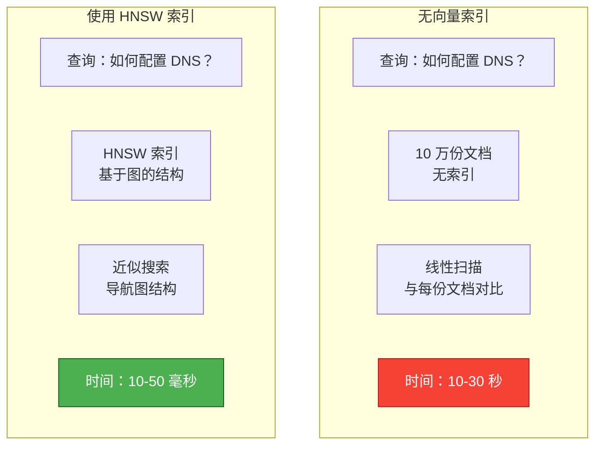

**索引的优势对比**：

| 方法 | 搜索时间 | 准确度 | 内存占用 | 适用场景 |
|----------|-------------|----------|---------|----------|
| **线性扫描** | 10-30s | 100% | 低 | < 1K 文档 |
| **IVF (倒排文件)** | 100-500ms | 95% | 中 | 1K-100K 文档 |
| **HNSW (分层小世界)** | 10-50ms | 98% | 高 | 100K-10M 文档 |
| **量化 (Quantization)** | 5-20ms | 90% | 极低 | 10M+ 文档 |

---

## 3.2 索引基础

### 3.2.1 什么是索引？

**索引 (Index)** 是一种通过避免全表扫描来加速数据检索的数据结构。

**书籍索引比喻**：
- **无索引**：阅读每一页来寻找“机器学习”
- **有索引**：在索引中查找“机器学习” → 直接跳转到第 42, 87, 134 页
- **结果**：查询速度提升 100 倍

**数据库索引 vs. 向量索引**：

| 维度 | 传统数据库 (B-tree) | 向量索引 (HNSW/IVF) |
|--------|------------------------------|-------------------------|
| **查询类型** | 精确匹配 (WHERE id = 42) | 相似度 (最近的向量) |
| **结构** | 平衡树 | 图或聚类 |
| **复杂度** | O(log n) 查找 | O(log n) 近似搜索 |
| **用例** | 结构化数据 | 非结构化语义搜索 |

### 3.2.2 向量搜索的挑战

**维度灾难 (The Curse of Dimensionality)**：

随着维度的增加，距离度量会失去意义，搜索在计算上变得难以处理。

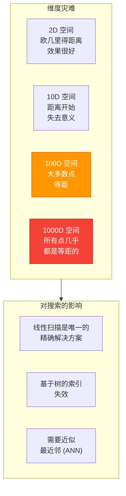

**为什么传统索引对向量失效**：

1. **B-tree 不支持相似度搜索**：B-tree 按排序键组织数据，而非空间接近度
2. **高维度空间是稀疏的**：随着维度增加，树状结构变得极低效
3. **距离计算开销大**：在 1536 维上计算余弦相似度的成本很高

**解决方案**：近似最近邻 (ANN) 算法通过牺牲极小的准确性来换取巨大的速度提升。

### 3.2.3 向量索引类型

**精确搜索 vs. 近似搜索**：

| 索引类型 | 搜索方法 | 时间复杂度 | 准确度 | 适用场景 |
|------------|--------------|-----------------|----------|-------------|
| **Flat (线性扫描)** | 将查询与每个向量对比 | O(n × d) | 100% | < 1K 文档 |
| **IVF (倒排文件)** | 仅搜索相关的 Voronoi 单元 | O(√n × d) | 92-95% | 1K-100K 文档 |
| **HNSW (小世界图)** | 在概率图中导航 | O(log n × d) | 97-99% | 100K-10M 文档 |
| **量化索引** | 压缩向量 + ANN | O(log n × d/4) | 90-95% | 10M+ 文档 |

**准确度与速度的权衡**：

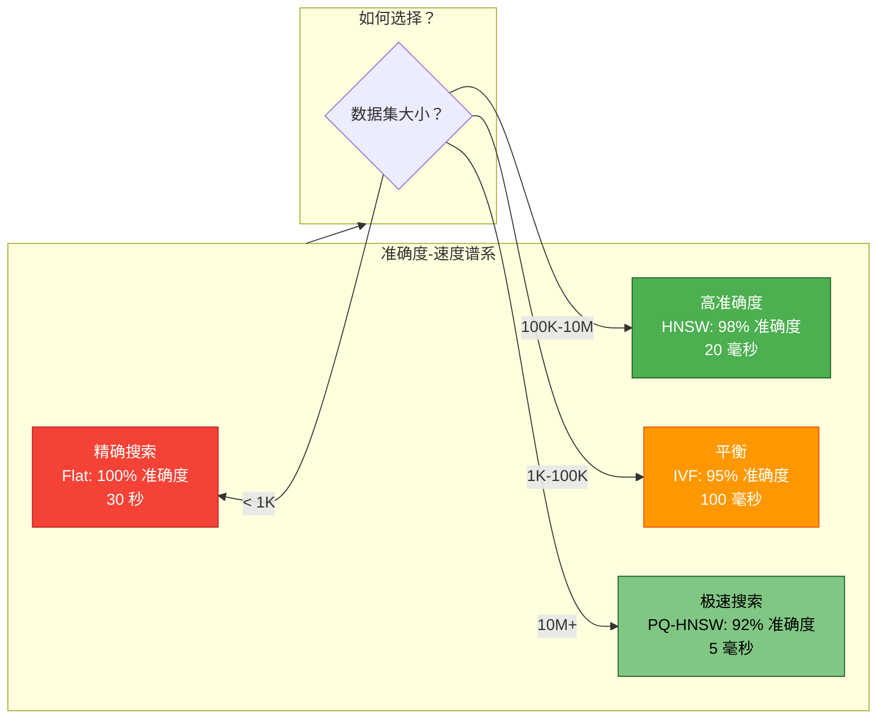

---

## 3.3 索引算法原理

### 3.3.1 线性扫描 (Flat Index)

**工作原理**：

将查询向量与数据集中的每个向量进行比较，返回距离最近的前 K 个结果。

```
对于数据库中的每个文档：
    距离 = cosine_similarity(query, document.embedding)
    如果距离 < 当前最佳距离：
        加入结果集
返回前 K 个结果
```

**特点**：

| 属性 | 数值 |
|----------|-------|
| **构建时间** | 0s (无索引结构) |
| **搜索时间** | O(n × d)，n=文档数，d=维度 |
| **内存开销** | 0% (仅存储向量本身) |
| **准确度** | 100% (精确搜索) |
| **最适合** | < 1K 文档 |

**何时使用线性扫描效果最好**：

1. **小数据集**：少于 1K 份文档，索引开销不值得
2. **准确度至上的应用**：法律、医疗、金融等无法容忍 2% 误差的领域
3. **动态数据**：频繁更新导致索引维护成本过高
4. **批量处理**：对速度不敏感的离线索引任务

**性能示例**：

- 1K 文档 × 1536 维度
- 搜索时间：~10ms
- 内存：仅向量占用 6 MB
- 无构建时间

### 3.3.2 IVF (倒排文件)

**IVF 如何工作**：

IVF 通过聚类（通常是 k-means）将向量空间划分为 **Voronoi 单元 (Voronoi cells)**。

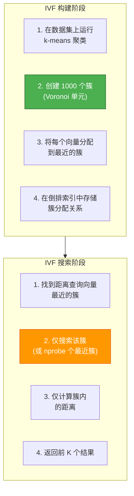

**Voronoi 单元图解**：

```
    簇 1            簇 2            簇 3
   (质心 C1)       (质心 C2)       (质心 C3)

  *   *   *           *   *   *           *   *   *
    * * * *             * * * *             * * * *
  *   *   *           *   *   *           *   *   *

查询 Q 距离 C2 最近 → 仅搜索簇 2
```

**IVF 参数**：

| 参数 | 描述 | 默认值 | 影响 |
|-----------|-------------|---------|--------|
| **nlist** | 簇的数量 | 1000 | 越高 = 精度越好，搜索越慢 |
| **nprobe** | 搜索的簇数 | 10 | 越高 = 召回率越好，搜索越慢 |

**特点**：

| 属性 | 数值 |
|----------|-------|
| **构建时间** | 数分钟 (需要聚类训练) |
| **搜索时间** | O(√n × d)，nprobe=10 时 |
| **内存开销** | 中 (存储簇分配关系) |
| **准确度** | 92-95% 召回率 |
| **最适合** | 1K-100K 文档 |

**何时使用 IVF 效果最好**：

1. **中型数据集**：1K-100K 文档
2. **内存受限**：内存开销低于 HNSW
3. **批量更新**：可以定期重建索引

**局限性**：

1. **需要训练**：索引前需要运行 k-means
2. **对动态数据支持差**：更新索引成本高
3. **簇边界问题**：簇边缘附近的文档可能会被遗漏

### 3.3.3 HNSW (分层导航小世界)

**HNSW 如何工作**：

HNSW 构建了一个**概率跳表 (Probabilistic skip list)**（分层图结构），以实现对数级时间的搜索。

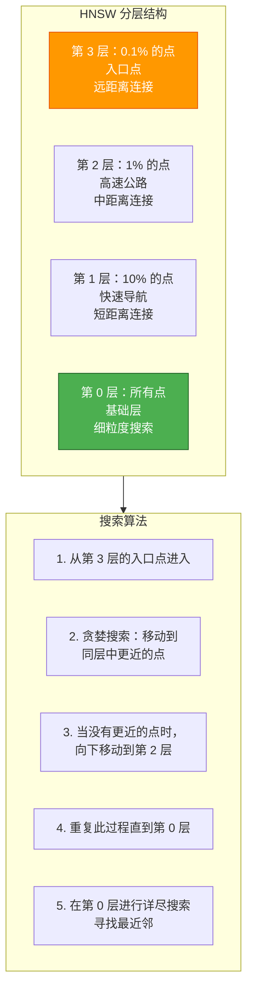

**图构建算法**：

```
对于每个新加入的点：
    1. 确定该点的层级（基于概率）
       - 第 0 层：100% 的点
       - 第 1 层：10% 的点
       - 第 2 层：1% 的点
       - 第 3 层及以上：0.1% 的点

    2. 找到入口点（顶层的点）

    3. 从顶层向下逐层处理：
        a. 在该层贪婪搜索最近邻
        b. 基于 ef_construction 参数选择 M 个邻居
        c. 在点之间建立双向连接

    4. 在基础层 (第 0 层)：
        a. 找到 M 个最近邻
        b. 创建双向边
```

**HNSW 参数**：

| 参数 | 描述 | 默认值 | 范围 | 影响 |
|-----------|-------------|---------|-------|--------|
| **M** | 每个节点的最大连接数 | 16 | 8-64 | 越高 = 召回率越好，内存占用越多 |
| **ef_construction** | 索引构建质量 | 100 | 50-200 | 越高 = 索引质量越好，构建越慢 |
| **ef_search** | 搜索候选数 | 50 | 10-100 | 越高 = 召回率越好，搜索越慢 |

**特点**：

| 属性 | 数值 |
|----------|-------|
| **构建时间** | 数分钟 (支持增量构建) |
| **搜索时间** | O(log n × d) |
| **内存开销** | 高 (图结构占用多) |
| **准确度** | 97-99% 召回率 |
| **最适合** | 100K-10M 文档 |

**何时使用 HNSW 效果最好**：

1. **大型数据集**：100K-10M 文档
2. **实时搜索**：延迟低于 50ms 的查询
3. **动态数据**：支持增量更新
4. **高召回率要求**：可接受 97-99% 的准确度

**为什么 HNSW 这么快**：

1. **对数搜索**：跳表结构实现了 O(log n) 的搜索复杂度
2. **贪婪导航**：始终朝着目标移动
3. **分层方法**：由粗到细的搜索减少了距离计算次数
4. **概率采样**：高层级仅保留极少比例的点

### 3.3.4 算法对比总结

**综合对比表**：

| 算法 | 构建时间 | 搜索时间 | 内存占用 | 准确度 | 最适合 | 局限性 |
|-----------|------------|-------------|---------|----------|----------|-------------|
| **Flat** | 0s | 10-30s | 低 | 100% | < 1K 文档，精度至上 | 无法扩展 |
| **IVF** | 分钟级 | 100-500ms | 中 | 92-95% | 1K-100K 文档 | 对动态数据支持差 |
| **HNSW** | 分钟级 | 10-50ms | 高 | 97-99% | 100K-10M 文档 | 内存开销大 |
| **PQ-HNSW**| 小时级 | 5-20ms | 中 | 90-95% | 1000 万+ 文档 | 有精度损失，设置复杂 |

**决策树摘要**：

```
数据集大小？
├─ < 1K → Flat (无索引开销，100% 准确)
├─ 1K-100K → IVF (平衡速度与准确度，比 HNSW 简单)
├─ 100K-10M → HNSW (性能最佳，行业标准)
└─ 10M+ → PQ-HNSW (使用量化提升内存效率)

内存受限吗？
├─ 是 → IVF 或 PQ-HNSW
└─ 否 → HNSW (追求极致性能)

是动态数据吗 (频繁更新)？
├─ 是 → HNSW (支持增量更新)
└─ 否 → IVF (更简单，适合批处理工作负载)

准确度至上吗 (如医疗/法律)？
├─ 是 → Flat (100% 准确) 或高 ef 值的 HNSW
└─ 否 → IVF 或 HNSW (用准确度换取速度)
```

---

## 3.4 Embedding 模型选择

### 模型对比

| 模型 | 维度 | 速度 | 质量 | 成本 | 最适合 |
|-------|------------|-------|---------|------|----------|
| **OpenAI text-embedding-3-small** | 1536 | 快 | ⭐⭐⭐⭐⭐ | $0.02/1M tokens | 通用场景、成本敏感 |
| **OpenAI text-embedding-3-large** | 3072 | 中 | ⭐⭐⭐⭐⭐ | $0.13/1M tokens | 高精度需求 |
| **BGE-M3** | 1024 | 快 | ⭐⭐⭐⭐ | 免费 (自托管) | 中文、多语言、成本敏感 |
| **BGE-Large-EN** | 1024 | 快 | ⭐⭐⭐⭐ | 免费 (自托管) | 纯英文、成本敏感 |
| **Cohere embed-v3** | 1024 | 快 | ⭐⭐⭐⭐⭐ | $0.10/1M tokens | 混合检索、重排序 |

### 选择指南

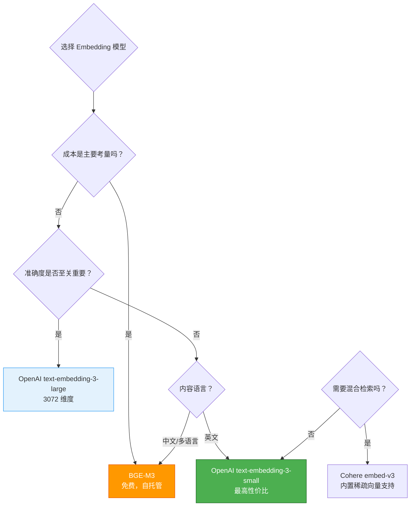

**决策树细节**：

```
成本是主要关注点吗？
├─ 是 → 使用 BGE-M3 (免费，自托管)
└─ 否 → 准确度是否至关重要？
    ├─ 是 → 使用 OpenAI text-embedding-3-large
    └─ 否 → 使用 OpenAI text-embedding-3-small (性价比之选)

是中文或多语言内容吗？
├─ 是 → 使用 BGE-M3 (针对多语言优化)
└─ 否 → 使用 OpenAI 模型 (英文表现更佳)

需要混合检索（稠密 + 稀疏）吗？
├─ 是 → 使用 Cohere embed-v3 (内置稀疏 Embedding)
└─ 否 → 使用 OpenAI 或 BGE 模型
```

### 维度权衡

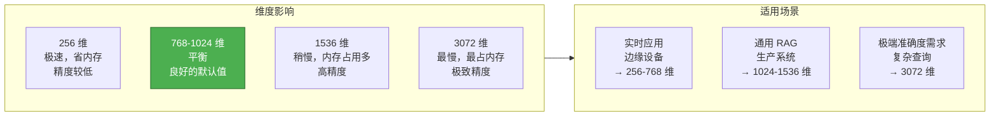

**成本分析** (以 100 万份文档，每份 500 tokens 为例)：

| 维度 | 存储空间 (GB) | 运行内存 (GB) | 搜索时间 | 估算成本 |
|------------|--------------|-------------|-------------|------|
| **256** | 1 GB | 2 GB | ~5ms | $2.50 |
| **768** | 3 GB | 6 GB | ~10ms | $5.00 |
| **1536** | 6 GB | 12 GB | ~20ms | $10.00 |
| **3072** | 12 GB | 24 GB | ~40ms | $65.00 |

---

## 3.5 高级索引策略

### 3.5.1 乘积量化 (Product Quantization, PQ)

**什么是乘积量化？**

PQ 通过将高维空间划分为多个低维子空间的笛卡尔积，并将每个子空间单独进行量化，从而将高维向量压缩为短代码。

**PQ 如何工作**：

```
1. 将向量划分为子向量 (例如 1536 维 → 8 个 192 维的子向量)

2. 在每个子向量上进行 k-means 训练 (通常每个子空间 256 个簇)

3. 对于每个向量：
   - 将每个子向量分配到最近的簇中心
   - 仅存储簇 ID (8 bits)，而非完整的子向量

4. 结果：1536 维向量 (6 KB) → 8 字节代码 (99.9% 压缩率)
```

**PQ 参数**：

| 参数 | 描述 | 典型值 | 影响 |
|-----------|-------------|---------------|--------|
| **M** | 子向量的数量 | 8-64 | 越高 = 精度越好，搜索越慢 |
| **nbits** | 每个子向量的位数 | 8 | 越高 = 簇越多，精度越高 |

**特点**：

| 属性 | 数值 |
|----------|-------|
| **压缩比** | 90-99% |
| **内存节省** | 10-100 倍 |
| **精度损失** | 2-5% |
| **构建时间** | 数小时 (需要训练过程) |
| **最适合** | 1000 万+ 文档，内存极度受限 |

**何时使用 PQ**：

1. **超大规模数据集**：内存无法装下完整向量的千万级数据量
2. **内存受限环境**：边缘计算设备、小型服务器
3. **成本敏感型**：显著降低云存储成本

**权衡分析**：

| 优点 | 缺点 |
|-----|-----|
| 10-100 倍内存降幅 | 2-5% 的精度损失 |
| 搜索更快 (加载数据更少) | 复杂的训练过程 |
| 极低的存储成本 | 构建索引时间较长 |

### 3.5.2 DiskANN (磁盘索引)

**什么是 DiskANN？**

DiskANN 是一种允许在超过内存大小的数据集上进行向量搜索的技术，它将索引存储在 SSD 上并按需加载数据页。

**DiskANN 如何工作**：

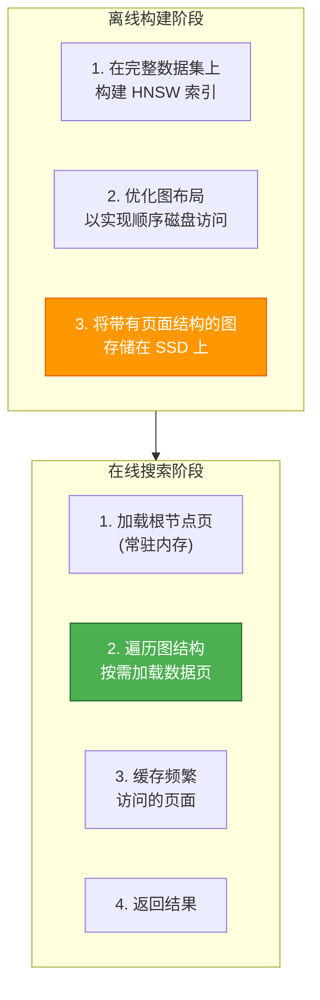

**特点**：

| 属性 | 数值 |
|----------|-------|
| **最大数据量** | 数十亿级 (受磁盘限制，而非内存) |
| **搜索时间** | 100-500ms (受磁盘 I/O 瓶颈影响) |
| **内存需求** | 数据集大小的 10-20% (用于缓存) |
| **准确度** | 90-95% |
| **最适合** | 1 亿+ 文档量的超大规模收藏 |

**何时使用 DiskANN**：

1. **海量数据集**：超过单机或集群内存容量的一亿级数据
2. **档案搜索**：对延迟有一定的容忍度 (100-500ms 可接受)
3. **成本优化**：SSD 比 RAM 廉价得多

**权衡分析**：

| 优点 | 缺点 |
|-----|-----|
| 扩展至数十亿个向量 | 比纯内存搜索慢 10-100 倍 |
| 硬件成本极低 (SSD vs RAM) | 设置和优化过程复杂 |
| 水平扩展性强 | SSD 磨损考量 |

### 3.5.3 复合索引 (Composite Indexes)

**什么是复合索引？**

复合索引将针对文档不同方面（语义、关键词、元数据）的多个索引结合在一起。

**架构图**：

```mermaid
flowchart TB
    subgraph Composite["复合索引架构"]
        direction TB

        subgraph Semantic["语义索引"]
            S1["HNSW 索引<br/>Embeddings"]
        end

        subgraph Keyword["关键词索引"]
            K1["BM25 索引<br/>分词/Tokens"]
        end

        subgraph Metadata["元数据索引"]
            M1["B-tree 索引<br/>过滤器/字段"]
        end
    end

    subgraph Query["查询处理"]
        Q1["1. 解析查询意图"]
        Q2["2. 分发到相关索引"]
        Q3["3. 执行并行搜索"]
        Q4["4. 融合：合并并排序结果"]
    end

    Composite --> Query

    style S1 fill:#4caf50,stroke:#1b5e20,color:#fff
    style K1 fill:#ff9800,stroke:#e65100,color:#fff
    style M1 fill:#2196f3,stroke:#0d47a1,color:#fff
```

**融合策略**：

| 策略 | 描述 | 适用场景 |
|----------|-------------|-------------|
| **倒数排名融合 (RRF)** | 结合多个排名列表 | 通用场景 |
| **加权融合** | 对语义和关键词赋予权重 | 已知最佳权重的情况 |
| **级联过滤** | 关键词过滤 → 语义重排 | 关键词密集的查询 |
| **学习型融合** | 使用 ML 模型组合结果 | 大规模生产环境 |

**收益**：

1. **更高的召回率**：同时捕获语义和词汇匹配
2. **带过滤的搜索**：支持在向量搜索中加入硬性的元数据过滤
3. **灵活性**：可以独立优化各个索引组件

### 3.5.4 多向量索引 (Multi-Vector Indexing)

**什么是多向量索引？**

为每份文档存储多个向量表示，以应对不同类型的查询。

**示例架构**：

```
文档: "使用 TensorFlow 进行机器学习"

存储的向量：
├─ 稠密 Embedding (1536 维): 语义含义
├─ 稀疏 Embedding (1万 维): 关键词、实体
├─ 摘要 Embedding (1536 维): 文档概览
├─ 标题 Embedding (1536 维): 针对标题
└─ 章节 Embedding (N × 1536): 针对每个章节
```

**查询处理流**：

```
查询: "如何将 TensorFlow 用于机器学习？"

1. 生成查询的 Embedding
2. 并行搜索所有向量类型
3. 结果融合：
   - 标题匹配：2.0x 权重 (高相关性)
   - 摘要匹配：1.5x 权重 (良好的概览)
   - 章节匹配：1.2x 权重 (特定细节)
   - 稠密匹配：1.0x 权重 (基础语义)
   - 稀疏匹配：0.8x 权重 (词汇匹配)
4. 返回融合排序后的结果
```

**收益**：

| 收益 | 描述 |
|---------|-------------|
| **更高的召回率** | 捕获相关性的不同维度 |
| **查询类型感知** | 针对不同查询模式进行优化 |
| **更细粒度的搜索** | 支持标题、内容、章节级别的精准搜索 |

---

## 3.6 索引优化技术

### 3.6.1 量化方法 (Quantization)

**标量量化 (Scalar Quantization)**

将 float32 向量转换为 int8 整数，通过将每个分量除以一个常数实现。

```
Float32 向量: [0.234, -0.567, 0.891, ...]
量化因子: 0.01
Int8 向量: [23, -57, 89, ...]

内存减少: 75% (4 字节 → 1 字节每分量)
精度损失: 1-3%
```

**标量量化参数**：

| 参数 | 描述 | 影响 |
|-----------|-------------|--------|
| **量化范围** | 参与量化的最小值/最大值 | 范围越大 = 精度损失越多 |
| **均匀 vs. 非均匀** | 量化层级的间距 | 非均匀更适合偏斜数据 |

**乘积量化 (PQ)**

通过维度划分和聚类来压缩向量（详见 3.5.1）。

**方法对比**：

| 方法 | 内存降幅 | 精度损失 | 速度提升 | 复杂度 |
|--------|-----------------|---------------|-------|------------|
| **标量 (int8)** | 75% | 1-3% | 2 倍 | 低 |
| **乘积 (PQ)** | 90%+ | 2-5% | 4 倍 | 高 |
| **二进制 (Binary)** | 97% | 5-10% | 10 倍 | 中 |

**如何选择**：

```
数据集大小？
├─ < 1000 万 → 标量量化 (最佳平衡)
├─ 1000 万-1 亿 → 乘积量化 (极致省内存)
└─ 1 亿+ → 二进制 + PQ (极端压缩)

对准确度敏感吗？
├─ 高 → 标量量化 (损失微乎其微)
├─ 中 → PQ (可接受的损失)
└─ 低 → 二进制 (追求最大压缩)
```

### 3.6.2 索引分区策略

**基于类别的分区 (Category-Based)**

为不同类别的文档创建独立的索引。

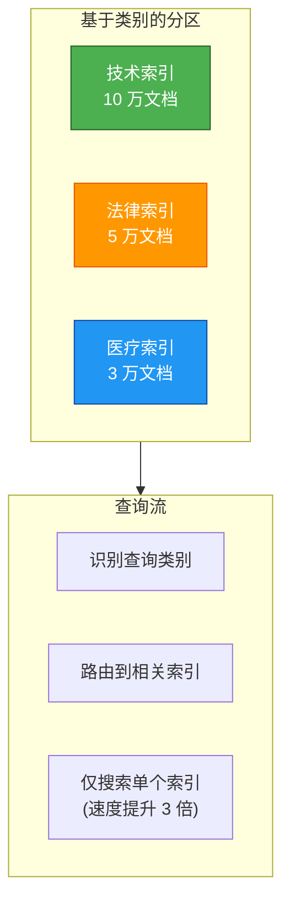

**收益**：

- 带过滤搜索快 3-10 倍（仅搜索相关分区）
- 并行索引（独立构建各分区）
- 维护更方便（只需重建单个分区）

**基于时间的分区 (Time-Based)**

按时间段（天、周、月）创建索引。

```
索引结构：
├─ 2024-01 索引 (2024 年 1 月文档)
├─ 2024-02 索引 (2024 年 2 月文档)
├─ ...
└─ 2024-12 索引 (2024 年 12 月文档)

查询: "关于 AI 的最新新闻"
→ 仅搜索最近 3 个分区 (速度提升 3 倍)
```

**收益**：

- 最近文档搜索更快（大多数查询针对近期内容）
- 时空查询支持（搜索特定时间段）
- 归档更容易（直接删除旧分区）

**分片 (Sharding)**

将索引分布在多台服务器上。

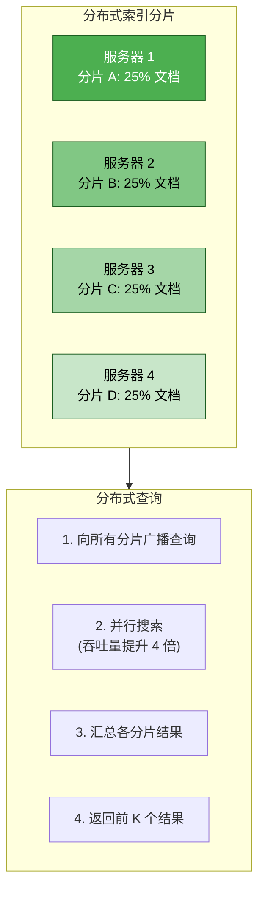

### 3.6.3 索引维护

**增量更新**

在不完全重建索引的情况下，将新文档添加到现有索引中。

| 方式 | 描述 | 适用场景 |
|----------|-------------|-------------|
| **HNSW 增量** | 向图中添加点 | 动态数据，日增量 < 10% |
| **IVF 追加** | 添加到现有簇 | 批量更新，日增量 < 5% |
| **全量重建** | 从零开始重构 | 变动极剧烈，日增量 > 10% |

**索引重建策略**

通过定期全量重建来维持索引质量。

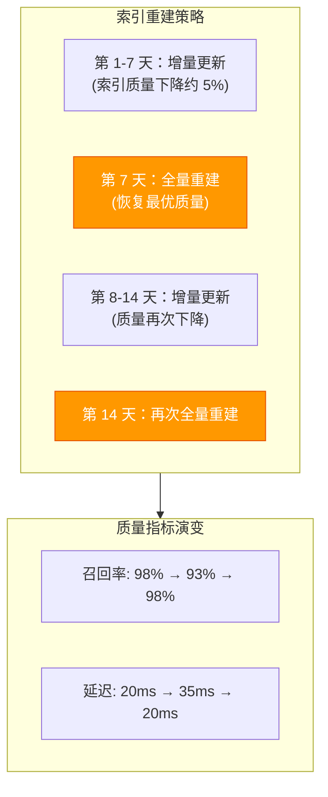

**删除策略**

| 策略 | 描述 | 速度 | 一致性 | 适用场景 |
|----------|-------------|-------|-------------|----------|
| **延迟删除** | 标记删除，稍后重建 | 快 | 最终一致性 | 高频变动的数据集 |
| **立即删除** | 从索引中实时移除 | 慢 | 强一致性 | 低频变动的数据集 |
| **软删除** | 保留墓碑，查询时过滤 | 快 | 查询时一致 | 合规、审计需求 |

---

## 3.7 向量数据库架构

### 3.7.1 核心组件

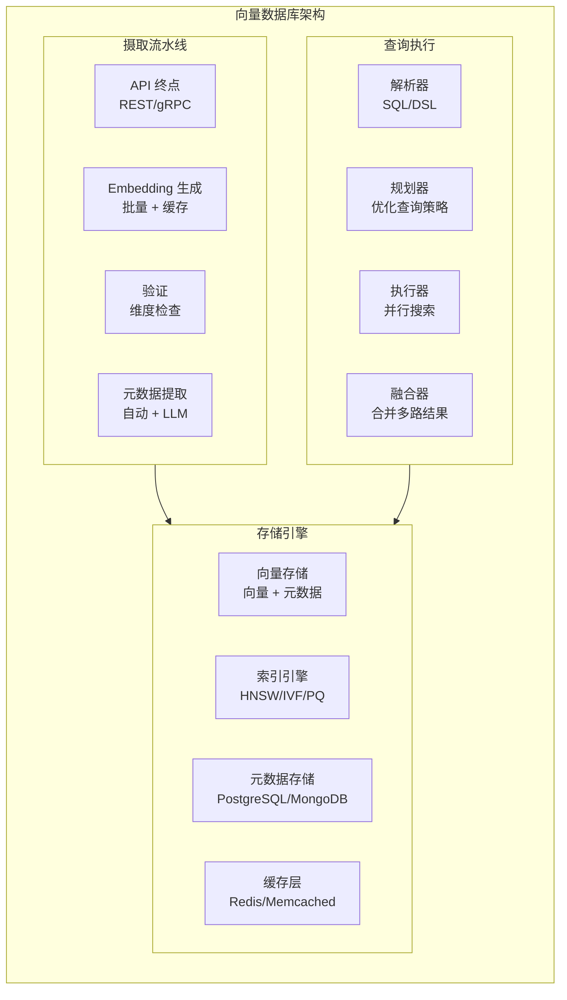

### 3.7.2 存储引擎对比

| 数据库 | 存储引擎 | 索引支持 | ACID | 元数据支持 | 最佳场景 |
|----------|---------------|--------------|------|----------|----------|
| **PgVector** | PostgreSQL | HNSW, IVF | ✅ | 原生 SQL | < 1000 万文档，强 SQL 依赖 |
| **Milvus** | etcdKV + MinIO/S3 | HNSW, IVF, DiskANN | ❌ | 内置 | 100 万+ 文档，高扩展性需求 |
| **Pinecone** | 私有 | HNSW, PQ | ❌ | 有限 | 生产环境，托管服务首选 |
| **Qdrant** | Rust + etcd | HNSW, 混合 | ✅ | 原生 | 混合搜索，实时性要求高 |
| **Weaviate** | Go + BoltDB | HNSW | ❌ | 基于图 | GraphQL API 偏好者 |

### 3.7.3 查询执行流

```
用户查询: "如何为生产环境配置 Redis？"
    ↓
查询解析器: 解析 DSL/SQL
    ├─ 提取关键词: "配置", "Redis", "生产环境"
    ├─ 自动分类: 属于“技术”类别
    └─ 检测意图: 偏向关键词的查询
    ↓
查询规划器: 优化搜索策略
    ├─ 元数据过滤条件: category='tech', year>=2023
    ├─ 索引选择:
    │   ├─ 关键词索引 (BM25): 用于精确匹配
    │   ├─ 语义索引 (HNSW): 用于语义搜索
    │   └─ 元数据索引 (B-tree): 用于快速过滤
    └─ 并行执行计划:
        ├─ 线程 1: 搜索关键词索引
        ├─ 线程 2: 搜索语义索引
        └─ 线程 3: 应用元数据过滤
    ↓
执行器: 并行搜索
    ├─ 线程 1 (关键词): 返回 [doc42, doc87, doc153, ...]
    ├─ 线程 2 (语义): 返回 [doc87, doc153, doc291, ...]
    └─ 线程 3 (元数据): 筛选出 2023 年后的技术文档
    ↓
结果融合: 倒数排名融合 (RRF)
    ├─ doc87: 1/1 + 1/1 + 1/1 = 3.0 (排名第一)
    ├─ doc153: 1/2 + 1/2 + 1/2 = 1.5 (排名第二)
    └─ doc291: 1/3 + 1/3 + 1/1 = 1.1 (排名第三)
    ↓
向用户返回 Top-10 文档
```

---

## 3.8 批量生成与缓存

### 3.8.1 批量处理优化

**问题**：逐条生成 Embedding 成本高且速度慢。

| 方法 | API 调用次数 | 耗时 | 成本 (10 万文档) |
|----------|-----------|------|-------------------|
| **逐条处理** | 100,000 | ~14 小时 | $10.00 |
| **批量 (100 条)** | 1,000 | ~10 分钟 | $10.00 |
| **批量 (1000 条)** | 100 | ~2 分钟 | $10.00 |

**关键洞察**：批量处理虽不直接降低 Token 费用，但能减少网络开销，将速度提升 50-100 倍。

### 3.8.2 Embedding 缓存

缓存 Embedding 以避免为相同或相似的文本重复计算：

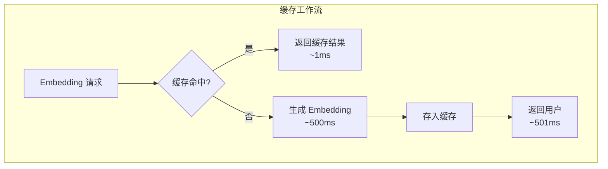

---

## 3.9 面试 Q&A

<details>
<summary><strong>Q1: 请解释维度灾难 (Curse of Dimensionality)</strong></summary>

维度灾难是指在高维空间中，传统的距离度量逐渐失去意义的现象。

**核心要点**：
1. **距离集中**：在高维空间中，几乎所有点之间的距离都趋于相等，难以区分。
2. **空间空洞**：随着维度增加，空间体积呈指数级增长，导致数据变得极其稀疏。
3. **索引失效**：传统的基于树（如 B-tree）的索引在处理高维数据时效率极低。
4. **解决方案**：引入近似最近邻 (ANN) 算法，通过牺牲极小的精度换取巨大的搜索速度提升。

</details>

<details>
<summary><strong>Q2: HNSW 算法的工作原理是什么？</strong></summary>

HNSW (分层导航小世界) 通过构建一个分层的图结构来实现对数级时间的近似搜索。

**工作流程**：
1. **分层结构**：类似于跳表，顶层包含少量远距离连接的点，底层包含所有点和近距离连接。
2. **图构建**：每个新点被随机分配一个最高层级，并在每一层与其最近的 M 个邻居相连。
3. **搜索过程**：从顶层入口点开始，执行贪婪搜索移动到最近的点；当在该层找不到更近的点时，下移一层；最终在底层找到 Top-K 个候选。
4. **优势**：查询性能极其出色，且支持增量更新。

</details>

---

## 总结

### 核心要点

**1. 索引基础**：
- 索引通过避免全量扫描来加速搜索。
- 维度灾难使得高维搜索极具挑战，需要 ANN 算法。

**2. 索引算法**：
- **Flat**: 100% 准确，适合小规模 (< 1K)。
- **IVF**: 平衡准确度与速度，适合中等规模 (1K-100K)。
- **HNSW**: 行业标准，速度快、召回率高，适合大规模 (100K-10M)。
- **PQ-HNSW**: 内存效率最高，适合海量数据 (10M+)。

**3. 存储与架构**：
- 向量数据库由摄取、存储和查询三个核心引擎组成。
- 标量量化 (int8) 可节省 75% 内存且精度损失极小。
- 批量生成和缓存是降低延迟与成本的关键手段。

**4. 生产实践**：
- 对平衡系统建议设置 HNSW 参数为 M=16, ef_search=50。
- 始终实现带有指数退避重试逻辑的批量生成流程。
- 监控 P95 延迟、召回率和 API 成本，并设置警报。

---

**下一步**：
- 📖 阅读 [检索策略](/docs/ai/rag/retrieval) 学习如何进一步优化搜索。
- 📖 阅读 [数据处理](/docs/ai/rag/data-processing) 了解分块策略。
- 💻 为你的向量索引设置性能监控。
