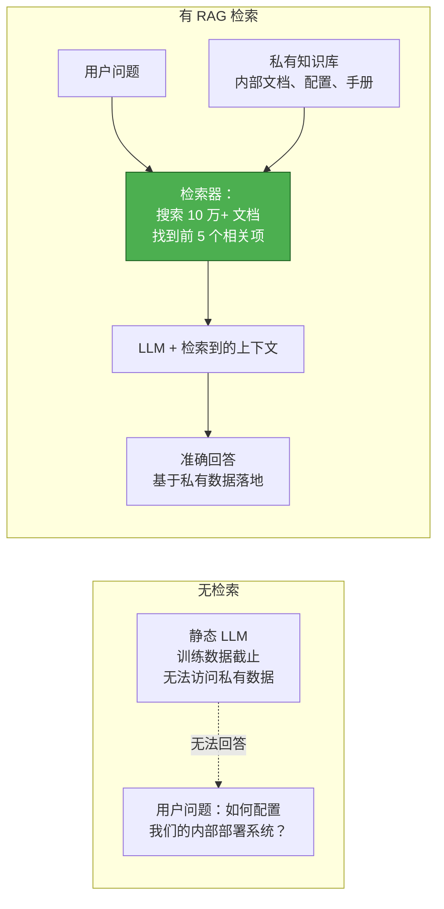
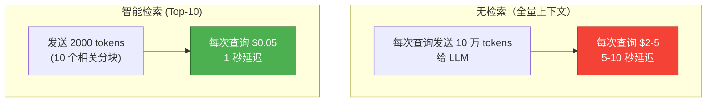
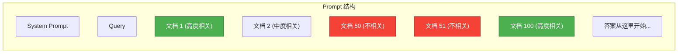
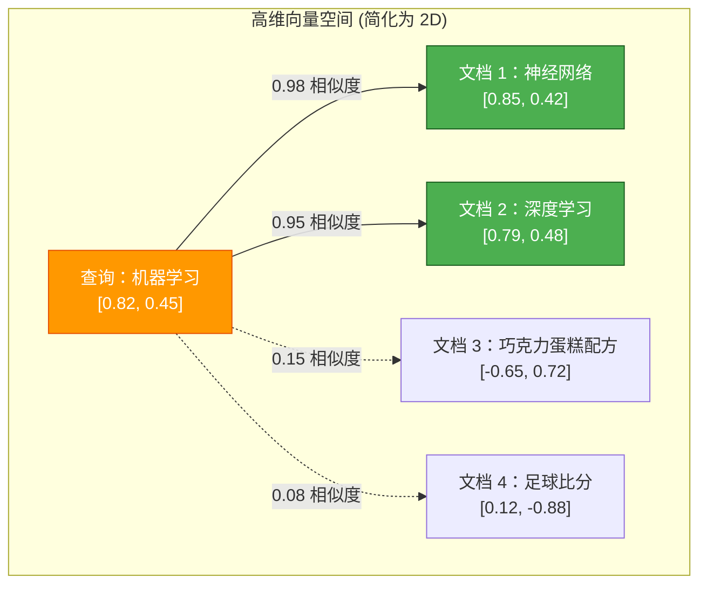
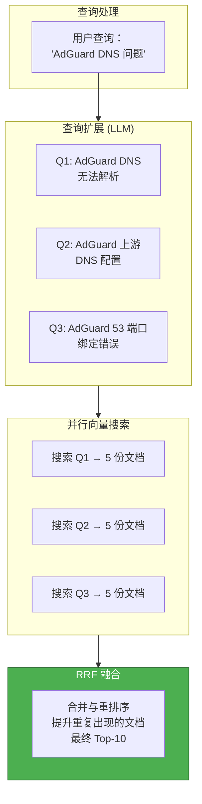
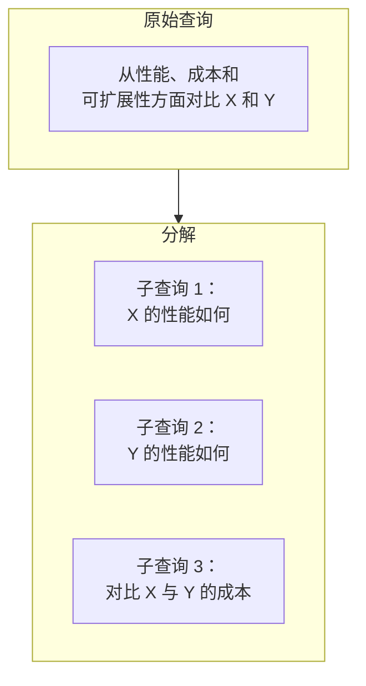
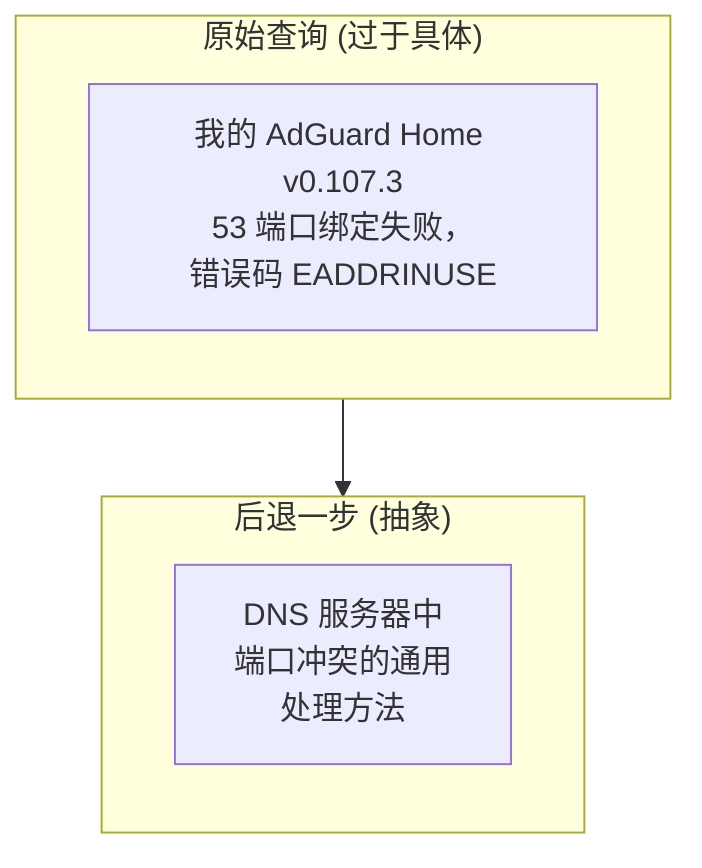
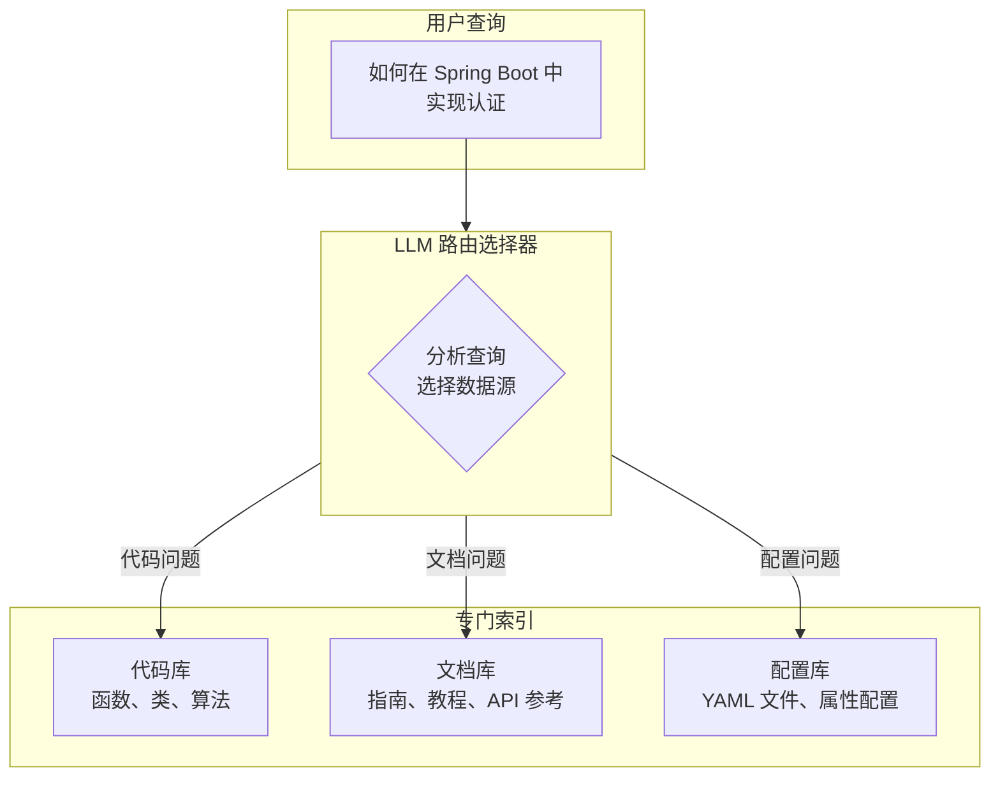
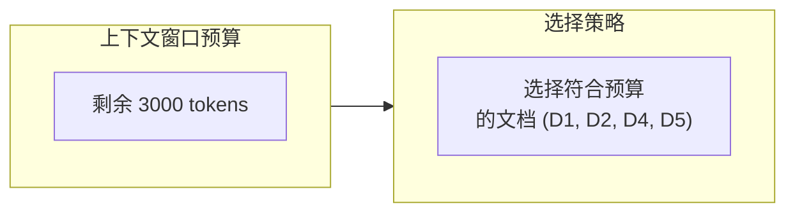
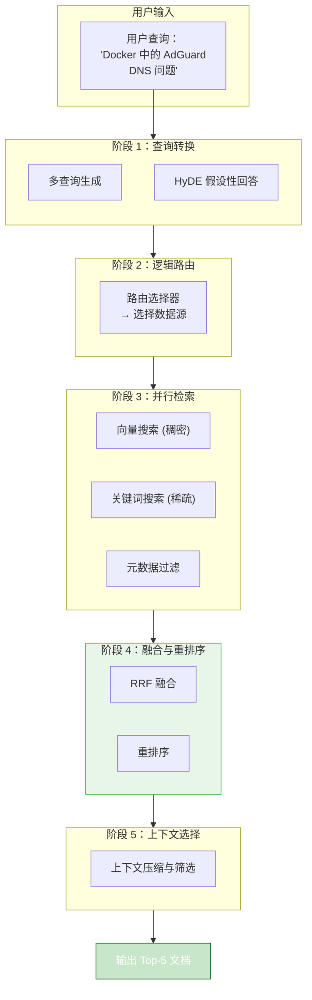

# 4. 检索策略

> **“检索是 LLM 知识与私有数据之间的桥梁。”** —— RAG 基础原则

本章涵盖检索基础知识、查询转换、路由策略以及后检索优化技术，这些技术将原始向量搜索转变为生产级 RAG 系统。

---

## 4.1 背景与基础

### 4.1.1 什么是检索？

**检索 (Retrieval)** 是根据查询的语义意图，从海量语料库中高效筛选相关信息的过程。在 RAG 系统中，检索充当了 LLM 静态训练知识与动态私有数据之间的关键桥梁。



**核心洞察**：可以将检索视为 LLM 的“外部硬盘读取器”。LLM 负责生成最终答案，而检索则提供相关的原材料。没有检索，LLM 将受限于：
- 训练截止日期前的知识
- 无法访问私有/内部信息
- 回答超出其知识范围时产生幻觉

### 4.1.2 为什么需要检索？上下文窗口问题

即使现代 LLM 支持 128K+ token 的上下文窗口，检索仍然必不可少，原因在于三个根本限制：

#### 限制 1：上下文窗口总量有限

虽然 128K token 听起来很多，但企业知识库通常包含数百万份文档：

```
典型企业知识库：
- 10,000 份技术文档 × 每份 2,000 tokens = 2,000 万 tokens
- 即使是 128K 的上下文也 < 总知识量的 1%
- 需要检索来找到与当前查询相关的那 1%
```

#### 限制 2：成本与延迟



**经济账**：
- GPT-4：每百万输入 token 约为 $10-15
- 每次查询发送 10 万 token ≈ 1.5 美元
- 检索将其减少到 ~2000 token ≈ 0.02 美元
- **成本降低 50-75 倍**

#### 限制 3：信噪比（迷失在中间）

研究表明，LLM 很难利用埋藏在长上下文中间的信息，这种现象被称为 **“迷失在中间” (Lost in the Middle)**：



**结论**：LLM 对上下文**开头和结尾**的信息关注度最高，中间部分的性能会显著下降。

**解决方案**：检索确保只包含高度相关的文档（Top 5-10），从而在整个上下文中维持极高的信噪比。

### 4.1.3 向量空间模型

现代检索的基础是**向量空间模型 (Vector Space Model)**，它将所有文本映射到高维几何空间中。

#### 核心原理

```
向量空间中的距离 = 语义相似度

如果 向量(A) 接近 向量(B)：
→ A 和 B 具有相似的含义
→ LLM Embedding 在训练中习得了这种关联
→ 支持“类比推理”
```

#### 数学基础

给定查询 $q$ 和文档 $d_1, d_2, ..., d_n$：

1. **Embedding (嵌入)**：将所有文本转换为向量
   - $v_q = \text{embed}(q)$
   - $v_i = \text{embed}(d_i)$

2. **比较**：计算相似度分数
   - $\text{sim}(q, d_i) = \text{cosine}(v_q, v_i)$

3. **排序**：按相似度排序，返回前 K 个结果



**关键特性**：向量距离捕捉到了关键词搜索无法识别的语义关系：
- “机器学习” ≈ “神经网络”（向量接近）
- “机器学习” ≈ “ML”（向量接近）
- “机器学习” ≈ “配方”（向量遥远）

### 4.1.4 稠密向量 vs 稀疏向量

检索系统使用两种根本不同的向量表示：

#### 稠密向量 (Dense Vectors / Embeddings)

**形式**：固定长度的数组，其中**大多数维度非零**。

```python
# 示例：1024 维稠密向量
dense_vector = [
    0.12, -0.98, 0.05, 0.33, -0.44,  # 所有位置都有数值
    0.67, -0.21, 0.88, 0.03, -0.56,
    # ... 还有 1014 个维度
]
```

**特点**：

| 维度 | 描述 |
|--------|-------------|
| **维度数** | 固定：384-3072 维 |
| **数值** | 所有位置均非零（稠密） |
| **含义** | 每个维度 = 潜在语义特征 |
| **示例** | 第 156 维可能编码了“技术复杂度” |
| **存储** | 每维度 4 字节 (float32) |

**优点**：
- ✅ **语义理解**：“苹果手机”匹配“iPhone”
- ✅ **跨语言**：英文查询能找到中文文档
- ✅ **概念匹配**：“错误”匹配“异常”、“Bug”、“问题”

**缺点**：
- ❌ **精确匹配弱**：像 “X1000” 这样的型号可能无法精确匹配
- ❌ **黑盒化**：无法解释为什么两份文档相似
- ❌ **计算开销**：需要经过 Embedding 模型的推理计算

#### 稀疏向量 (Sparse Vectors / Lexical)

**形式**：极长的数组（等于词汇表大小），其中**大多数维度为零**。

```python
# 示例：10 万维稀疏向量 (词汇表大小)
sparse_vector = [
    0, 0, 0, 1, 0, ..., 0,  # 仅 “error” 出现
    0, ..., 5, 0, ..., 0,  # “code” 出现了 5 次
    0, ..., 0, 2, 0        # “exception” 出现了 2 次
]
```

**特点**：

| 维度 | 描述 |
|--------|-------------|
| **维度数** | 词汇表大小：5万-50万 |
| **数值** | 大多数为零（稀疏） |
| **含义** | 每个维度 = 特定的单词/Token |
| **存储** | 高效的稀疏矩阵存储 |

**优点**：
- ✅ **精确匹配**：“错误码 E5001” 能精准匹配
- ✅ **高效**：TF-IDF/BM25 计算速度极快
- ✅ **可解释**：确切知道是哪些词导致了匹配

**缺点**：
- ❌ **无同义词理解**：“狗”找不到“小狗”
- ❌ **语言限制**：英文查询只能找到英文文档
- ❌ **词汇依赖**：无法找到词汇表以外的术语

#### 稠密与稀疏对比

| 技术 | 适用场景 | 匹配示例 | 未能匹配示例 |
|-----------|----------|---------------|--------------|
| **稠密 (Embedding)** | 语义搜索 | “轿车” → “汽车” | “X1000” → “X1000” |
| **稀疏 (BM25)** | 关键词搜索 | “E5001” → “错误 E5001” | “轿车” → “汽车” |
| **混合检索** | 生产环境系统 | 语义 + 精确匹配均可 | 两者均失效 |

**最佳实践**：生产系统应使用**混合检索 (Hybrid Retrieval)**（稠密 + 稀疏 + 重排序），以结合两者的优势。

---

## 4.2 查询转换与增强

**目标**：弥合“用户表达问题的方式”与“文档中知识编写的方式”之间的语义鸿沟。

现实中的问题：用户查询通常表现为：
- 过于模糊（“它不工作”）
- 术语错误（混淆“Bug”与“功能”）
- 缺乏上下文（“那个配置文件”）
- 过于具体（“AdGuard Home v0.107.3 53 端口绑定失败”）

查询转换技术将原始查询转化为优化后的搜索请求。

### 4.2.1 多查询 (Multi-Query) 与 RAG-Fusion

#### 概念

单一查询往往不足以捕获所有相关信息。多查询技术生成多个搜索变体并合并结果。



#### RRF (倒数排名融合) 算法

RAG-Fusion 的关键创新在于 **RRF**，它能合并多个排序列表：

```python
# 伪代码：RRF 融合算法
def rrf_fusion(query, result_lists, k=60):
    """
    使用倒数排名融合合并多个搜索结果列表

    参数：
        query: 原始用户查询
        result_lists: 来自不同查询的搜索结果列表集合
        k: 常数（通常为 60-100），防止高排名文档占据过大主导地位

    返回：
        重新排序并合并后的结果
    """
    scores = {}

    # 处理每个结果列表
    for results in result_lists:
        for rank, doc in enumerate(results):
            # RRF 评分公式：1 / (k + rank)
            score = 1 / (k + rank + 1)

            # 为同一文档累加分数
            scores[doc.id] = scores.get(doc.id, 0) + score

    # 按合并分数排序（从高到低）
    sorted_results = sorted(scores.items(), key=lambda x: x[1], reverse=True)

    return sorted_results
```

### 4.2.2 查询分解 (Decomposition)

#### 概念

将复杂的、包含多个部分的问题分解为简单的子查询，顺序执行并合并结果。



### 4.2.3 后退一步 (Step-Back) 提示词

#### 概念

有时用户的提问**过于具体**，导致无法匹配到好的结果。后退一步提示词生成一个更抽象的问题，以检索更广泛的背景。



---

## 4.3 路由与构建 (Routing & Construction)

**目标**：精准控制“去哪里搜索”（哪些数据源）以及“如何搜索”（查询结构与过滤器）。

### 4.3.1 逻辑路由 (Logical Routing)

#### 概念

并非所有查询都应搜索相同的数据。关于代码的问题应搜索代码库，关于价格的问题应搜索产品文档。路由将查询导向合适的专门索引。



### 4.3.2 语义路由 (Semantic Routing)

#### 概念

**语义路由**利用 **查询嵌入向量的相似度** 来进行路由，而非依赖 LLM 文本分类。它将查询向量与预先计算好的“路由描述”向量进行对比，找到最佳匹配项。

### 4.3.3 查询构建与元数据过滤

#### 概念：自查询 (Self-Querying)

向量搜索是**语义化**的，而非**精确**的。它在处理以下内容时较弱：
- 数字：“2024” 可能会匹配到 “2023”（语义上接近的年份）
- 布尔值：“enabled” ≈ “disabled”（两者都是配置状态）
- 日期：“上周” 是模糊的

**解决方案**：使用**元数据过滤**，在进行向量搜索前应用精确的约束条件。

---

## 4.4 后检索优化 (Post-Retrieval)

**目标**：从粗略排序的检索结果中提取最相关的信息，并修复“语义偏移”问题。

### 4.4.1 重排序策略 (Reranking)

重排序是 RAG 系统的**精度优化层**。在初始检索产生候选集（50-100 份文档）后，重排序会对这些文档进行精细化的二次排序。

#### 重排序方法概览

| 方法 | 类型 | 延迟 | 准确度 | 成本 | 最佳场景 |
|--------|------|---------|----------|------|----------|
| **RRF** | 融合 | ~5ms | 🟡 中 | 🆓 低 | 混合检索，合并多路列表 |
| **RankLLM** | 基于 LLM | ~2-5s | 🟢 极高 | 💰💰 高 | 复杂查询、深度推理 |
| **Cross-Encoder**| 神经模型 | ~500ms | 🟢 高 | 🟡 中 | 生产环境，平衡质量与性能 |
| **FlashRank** | 轻量化 | ~50ms | 🟢 高 | 🆓 低 | 边缘部署，实时响应 |

#### Cross-Encoder 重排序原理

Cross-Encoder 同时接收 **(查询, 文档) 对** 作为输入，并输出一个相关性分数。与 Bi-Encoder（向量检索）不同，它能看到查询与文档之间的细微交互。

### 4.4.2 上下文选择与压缩

#### 问题：上下文窗口预算

检索完成后，你可能会得到 N 份相关文档，但 LLM 的上下文窗口是有限的：



#### 策略 1：Token 限制截断

**优点**：简单、确定性强。
**缺点**：可能会切断关键信息。

#### 策略 2：基于 LLM 的过滤

利用 LLM 智能筛选最相关的文档片段。

#### 策略 3：MMR (最大边界相关性)

平衡**相关性**与**多样性**，避免引入重复内容。

---

## 4.5 混合检索架构

### 端到端流水线

将所有技术整合为一个生产级的检索系统：



---

## 总结

### 核心要点

1. **检索基础**：检索桥接了 LLM 的知识与你的私有数据。混合搜索（稠密 + 稀疏 + 重排序）是当前的最优解。
2. **查询转换**：
    - **Multi-Query**: 生成变体，通过 RRF 融合。
    - **Decomposition**: 将复杂问题分解为子任务。
    - **Step-Back**: 将具体问题抽象化以寻找通用原理。
    - **HyDE**: 使用假设性答案的向量进行搜索。
3. **路由与构建**：
    - **逻辑路由**: 将查询导向专门的数据库。
    - **元数据过滤**: 处理数字、日期等精确匹配需求。
4. **后检索优化**：
    - **重排序**: 利用 Cross-Encoder 大幅提升 Top-K 的准确度。
    - **上下文选择**: 在有限的 Token 预算内选择最有价值的信息。

---

**下一步**：
- 📖 阅读 [生成与合成策略](/docs/ai/rag/generation) 了解如何将检索到的信息转化为完美的答案。
- 💻 实现混合检索：从向量 + 关键词开始，逐步引入重排序器。
- 🔧 针对你的特定用例实验不同的查询转换技术。
