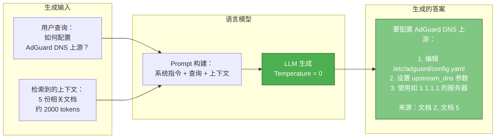
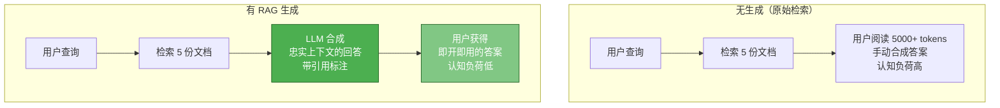
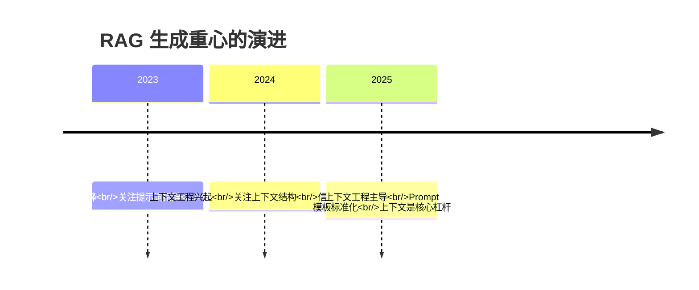
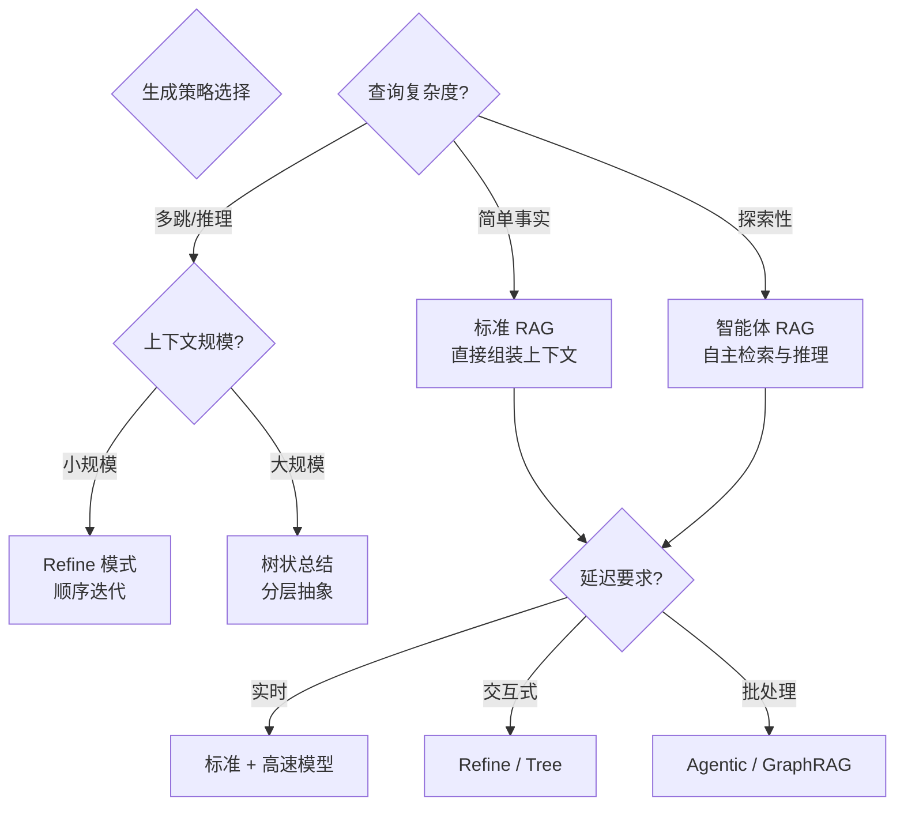

# 5. 生成与合成策略

> **“生成阶段是将检索到的知识转化为可操作智能的关键环节。”** —— RAG 基础原则

本章涵盖生成基础知识、提示词构建策略、上下文组装优化、生成控制参数、框架对比以及包括 Refine、树状总结 (Tree Summarize) 和智能体 RAG (Agentic RAG) 在内的高级模式。

---

## 5.1 生成基础

### 5.1.1 什么是生成？

RAG 系统中的**生成 (Generation)** 是指通过结合用户查询与检索到的上下文文档，合成一个连贯、自然的语言答案的过程。它是原始检索信息与可操作智能之间的关键桥梁。



**生成鸿沟 (The Generation Gap)**：检索到的文档并非最终答案，它们只是原材料，必须经过：

- **合成 (Synthesized)**：将多份文档合并为连贯的回复。
- **解释 (Explained)**：将技术术语转化为用户易懂的语言。
- **上下文关联 (Contextualized)**：将信息置于用户的具体场景中。
- **校验 (Validated)**：协调或确认冲突的信息。

### 5.1.2 为什么生成环节至关重要

如果没有有效的生成，检索系统提供的只是原始文档，用户必须手动解析和合成。生成环节将信息转化为了智能：



**忠实度挑战 (The Faithfulness Challenge)**：RAG 生成的核心挑战在于平衡以下维度：

| 维度 | 目标 | 冲突点 |
|-----------|------|---------|
| **忠实度** | 答案基于检索到的上下文 | LLM 的预训练知识可能与上下文冲突 |
| **有用性** | 答案解决了用户需求 | 过于死板的忠实度可能显得不够友好 |
| **流畅性** | 自然、连贯的语言 | 过度润色可能引入幻觉 |
| **简洁性** | 高效的信息传递 | 过于简短可能遗漏重要细节 |

**2025 趋势：上下文工程 > 提示词工程**

研究表明，**提示词工程 (Prompt Engineering) 在 2023 年达到巅峰**，其边际效用正在下降。目前的主流方法是**上下文工程 (Context Engineering)**：



---

## 5.2 提示词构建策略 (Prompt Construction)

### 5.2.1 标准 RAG 模板

有效 RAG 生成的基础是一个设计良好的提示词模板，它结构化了查询、上下文与 LLM 之间的交互。

```python
# 伪代码：标准 RAG 提示词模板
def build_rag_prompt(query, retrieved_docs, system_message=None):
    # 默认系统消息（关注忠实度）
    if system_message is None:
        system_message = """
        你是一个得力的助手，请根据提供的上下文回答问题。
        遵循以下准则：
        - 仅使用提供的上下文进行回答
        - 如果上下文中不包含答案，请说“我没有足够的信息来回答这个问题”
        - 使用 [Doc N] 符号标注来源
        - 不要产生幻觉或编造信息
        """

    # 格式化检索到的文档
    context_parts = []
    for i, doc in enumerate(retrieved_docs, start=1):
        context_parts.append(f"""
        [Doc {i}] 来源: {doc.metadata['source']}
        {doc.content}
        """)

    context_str = "\n".join(context_parts)

    # 构建最终提示词
    prompt = f"""
    {system_message}

    上下文内容：
    {context_str}

    用户问题：{query}

    答案：
    """

    return prompt
```

### 5.2.2 防御性提示词 (防幻觉)

**防御性提示词 (Defensive Prompting)** 明确指示 LLM 避免产生幻觉，并将忠实度置于首位。

```python
# 伪代码：防御性 RAG 提示词
def build_defensive_prompt(query, retrieved_docs):
    system_message = """
    你是一个实事求是的助手，严格根据提供的上下文回答问题。

    核心规则：
    1. 只有在上下文包含相关信息时才回答。
    2. 如果上下文不足，请回复：“根据现有文档，我没有足够的信息来完整回答这个问题。”
    3. 每一条主张都必须使用 [Doc N] 进行标注。
    4. 不要使用你自身训练知识中超出上下文的部分。
    """
    # ...
```

### 5.2.3 上下文工程最佳实践

**上下文排序策略 (Context Ordering)**

向 LLM 展示检索文档的顺序会显著影响答案质量：

- **相关性优先 (Default)**：将最匹配的分块放在最前面。
- **U 型曲线排列**：将最相关的文档分列在开头和结尾，对抗“迷失在中间”现象。
- **时间顺序**：针对时效性强的查询，按日期降序排列。

---

## 5.3 上下文组装与优化 (Context Assembly)

### 5.3.1 Token 预算管理

有效的 RAG 生成需要精细的 Token 预算管理，以平衡上下文的完整性与模型限制。

### 5.3.2 对抗“迷失在中间” (Lost in the Middle)

**研究发现**：LLM 在处理长上下文时表现出 **U 型性能曲线**。开头和结尾的信息召回率最高，而中间位置的信息往往被忽略。

### 5.3.3 上下文窗口优化技术

**元数据注入 (Metadata Injection)**：通过在文档正文前注入元数据（如标题、日期、作者），可以显著提升 LLM 的理解能力。

---

## 5.4 生成控制参数

### 5.4.1 温度设置 (Temperature)

**Temperature** 控制生成文本的随机性。对于 RAG 系统，通常建议使用较低的温度以确保忠实度。

| 用例 | 建议温度 | 理由 |
|----------|-------------|-----------|
| **事实问答** | 0 | 最大化忠实度，减少幻觉 |
| **技术文档总结** | 0 - 0.2 | 获得精确、可复现的答案 |
| **多文档综合** | 0 - 0.3 | 在整合信息与准确性间取得平衡 |
| **创意/脑暴** | 0.7 - 1.0 | 需要发散思维时 |

### 5.4.2 Top-p (核采样) 与 Top-k

- **Top-p**: 仅从累积概率超过 p 的最小 Token 集中采样。
- **Top-k**: 仅从概率最高的前 k 个 Token 中采样。

### 5.4.3 引用与来源归因

清晰的引用标注能帮助用户验证信息并建立信任：
- **行内引用**: “根据文档 [1]，配置路径为...”
- **脚注**: 在答案末尾列出详细来源列表。
- **超链接**: 直接链接到原始文档或 URL。

---

## 5.5 框架对比

### 5.5.1 LangChain 生成方法
**设计哲学**：通过灵活的链 (Chains) 和模板实现**快速原型开发**。

### 5.5.2 LlamaIndex 生成方法
**设计哲学**：**针对生产优化**的 RAG，内置高效的响应合成器。

### 5.5.3 Haystack 生成方法
**设计哲学**：**企业级就绪**，采用基于流水线 (Pipeline) 的架构。

### 5.5.4 DSPy 生成方法
**设计哲学**：**程序化提示词**，通过可训练、可复现的组件优化生成的 Prompt。

---

## 5.6 高级生成模式

### 5.6.1 Refine (迭代优化)
逐个处理检索到的分块，根据新分块的内容不断修正和完善答案。适用于对准确度要求极高的场景。

### 5.6.2 树状总结 (Tree Summarize)
构建分层的摘要树，先对分块进行分组总结，再对总结进行总结。适用于处理海量上下文。

### 5.6.3 智能体 RAG (Agentic RAG)
LLM 作为自主代理，决定是直接回答、检索更多信息还是优化查询语句。具备自我修正能力。

### 5.6.4 RAPTOR (递归抽象处理)
构建摘要的分层树状结构，支持在不同抽象层级上进行检索，适合跨文档的主题分析。

### 5.6.5 GraphRAG (基于图的生成)
从实体中构建知识图谱，检测社区并生成社区摘要，从而实现全局视角的上下文生成。

---

## 5.7 生成策略选型指南

### 5.7.1 决策框架

根据查询特性和约束选择最佳生成策略：



---

## 总结

### 核心要点
1. **生成本质**：将检索到的原始资料合成为忠实、有用且流畅的答案。
2. **重心转移**：2025 年的趋势是从单纯的提示词工程转向深度的上下文工程。
3. **安全第一**：通过防御性提示词和强制引用标注来消除幻觉。
4. **灵活策略**：根据任务复杂度选择标准 RAG、Refine 或是更高级的 Agentic 模式。

---

**下一步**：
- 📖 阅读 [评估策略](/docs/ai/rag/evaluation) 学习如何量化生成的质量。
- 💻 在你的系统中实现标准的 RAG 模板并加入引用标注逻辑。
- 🔧 尝试调整 Temperature 和 Top-p 参数以观察对回答忠实度的影响。
