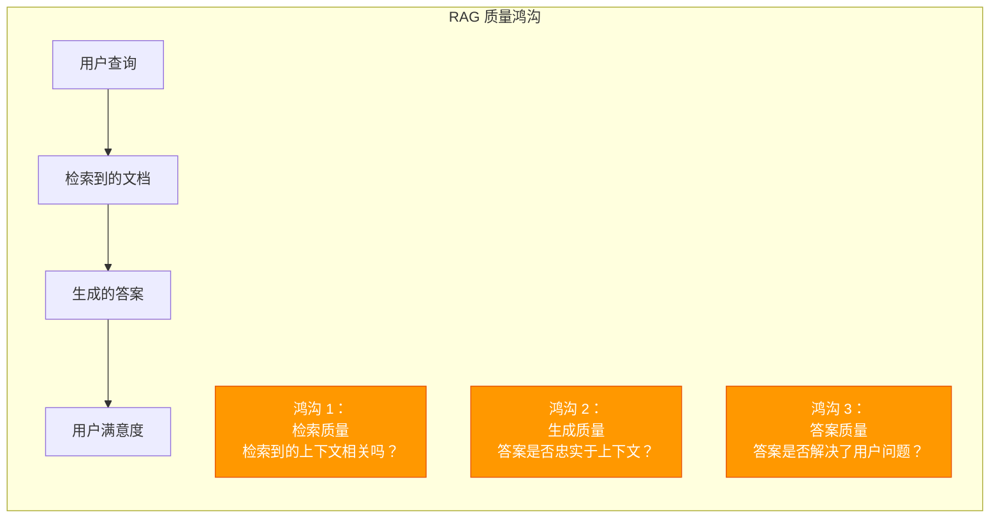

# 6. 评估策略

> **“没有评估的优化只是盲目的猜测。”** —— RAG 评估原则

本章涵盖 RAG 三元组评估框架、检索与生成指标、评估方法论（黄金数据集、合成数据、LLM 作为裁判）以及生产环境的可观测性工具。

---

## 6.1 为什么评估至关重要？

### 6.1.1 RAG 质量鸿沟

**根本问题**：检索到的文档并非最终答案，生成的答案也可能并不忠实于上下文或不相关。没有评估，你就无法衡量或改进 RAG 系统的质量。



**三个质量鸿沟**：

1. **上下文相关性鸿沟**：检索到的分块可能包含无关信息。
   - 症状：LLM 接收到含噪声的上下文。
   - 原因：Embedding 相似度不佳，查询理解薄弱。
   - 影响：垃圾进，垃圾出。

2. **忠实度鸿沟**：生成的答案可能产生超出检索上下文的幻觉。
   - 症状：答案包含源文档中不存在的事实。
   - 原因：LLM 依赖预训练知识而非上下文。
   - 影响：丧失信任，事实错误。

3. **答案相关性鸿沟**：答案可能忠实于原文，但未能切中用户意图。
   - 症状：技术正确但无用的答案。
   - 原因：查询理解偏差，检索不完整。
   - 影响：用户不满意，系统被弃用。

### 6.1.2 生产 vs 开发

**RAG 系统的性能会随时间推移而下降**。在开发阶段表现良好的系统到了生产环境往往会失败，原因包括：

| 因素 | 开发阶段 | 生产环境 | 影响 |
|--------|-------------|------------|--------|
| **查询分布** | 精选的测试查询 | 随机、不可预测的查询 | 未知的边缘案例 |
| **数据新鲜度** | 静态文档集 | 持续更新 | Embedding 过时 |
| **负载** | 低并发 | 高并发 | 延迟与质量的权衡 |
| **用户反馈** | 手动测试 | 真实用户行为 | 意想不到的使用模式 |

---

## 6.2 RAG 三元组 (核心框架)

### 6.2.1 上下文相关性 (Context Relevance)

**定义**：检索到的分块对于回答用户查询是否真的有用？

**评估逻辑**（0-1 量程）：
```python
# 逻辑：利用 LLM 作为裁判提取相关句子
# 1. 提示词：提取上下文中对回答查询有用的句子。
# 2. 相关分数 = 相关句子数量 / 总句子数量
```

### 6.2.2 忠实度 (Faithfulness)

**定义**：生成的答案是否基于检索到的上下文，还是产生了幻觉？

**评分逻辑**（0-1 量程）：
```python
# 逻辑：原子断言提取 + 验证
# 1. 从答案中提取原子化的事实断言。
# 2. 针对每一个断言，在上下文中验证其是否有据可依。
# 3. 忠实度分数 = 验证通过的断言数 / 总断言数
```

**2025 洞察：忠实度是核心**
研究表明，忠实度是用户对 RAG 系统信任度的最强预判指标。用户宁愿听到“我不知道”，也不愿听到自信的幻觉。

### 6.2.3 答案相关性 (Answer Relevance)

**定义**：生成的答案是否真正解决了用户的问题？

**评分逻辑**：通常利用强模型（如 GPT-4o）根据 1-5 分的标准进行评分，并要求提供评分理由。

---

## 6.3 检索指标 (Retrieval Metrics)

### 6.3.1 命中率 (Hit Rate / Recall@K)

**定义**：在检索到的前 K 个文档中，是否出现了至少一个相关文档？

**公式**：
$$
\text{命中率} = \frac{\text{前 K 个结果中包含至少一个相关文档的查询数}}{\text{总查询数}}
$$

### 6.3.2 MRR (平均倒数排名)

**定义**：衡量第一个相关文档出现位置的平均水平。

**意义**：MRR 对排名靠前的结果非常敏感。在 RAG 中，高 MRR 意味着核心证据更有可能被置于上下文的开头，从而获得 LLM 更多的关注。

### 6.3.3 NDCG (归一化折损累计增益)

**定义**：一种综合考虑文档**相关性等级**和**排名位置**的指标，归一化到 0-1 之间。

---

## 6.4 生成指标 (Generation Metrics)

### 6.4.1 幻觉率 (Hallucination Rate)

**定义**：生成的答案中，未得到检索上下文支持的断言所占的比例。

**2025 生产标准**：
- **核心领域**（医疗、法律、金融）：幻觉率需 < 5%。
- **通用场景**：幻觉率 < 10% 可接受。

### 6.4.2 正确性 (Correctness / 事实准确度)

**定义**：生成的答案与“标准答案”之间的语义相似度。推荐工具：**BERTScore**。

---

## 6.5 评估方法论

### 6.5.1 黄金数据集 (Golden Dataset)
由领域专家手动编写的“问题-上下文-答案”三元组。这是评估的最高标准，但构建成本高。

### 6.5.2 合成数据生成 (Synthetic Data)
利用 LLM 自动从文档中提取并生成问题和答案。优点是速度快、可扩展，适合快速迭代。

### 6.5.3 LLM 作为裁判 (LLM-as-a-Judge)
使用比目标模型更强的模型（如 GPT-4o 或 Claude 3.5）来评价回答质量。

---

## 6.6 工具与可观测性

- **Ragas**: RAG 评估的行业标准框架，实现了三元组指标。
- **DeepEval**: PyTest 风格的 LLM 测试框架，易于集成到 CI/CD。
- **TruLens**: 聚焦于全链路追踪和反馈函数的评估工具。
- **LangSmith**: 生产环境监控、追踪和 A/B 测试。

---

## 总结

### 核心要点
1. **量化质量**：通过 RAG 三元组（上下文相关性、忠实度、答案相关性）实现对 RAG 质量的全面量化。
2. **混合指标**：结合传统的检索指标（Hit Rate, MRR）与现代的生成指标（幻觉率、BERTScore）。
3. **闭环改进**：利用评估结果指导分块策略、检索算法和 Prompt 的持续优化。

---

**下一步**：
- 📖 阅读 [高级 RAG 技术](/docs/ai/rag/advanced-rag) 了解如何处理更复杂的检索场景。
- 💻 在你的开发环境集成 Ragas 或 DeepEval。
- 📊 为你的核心业务流程构建一个包含至少 50 个案例的黄金数据集。
