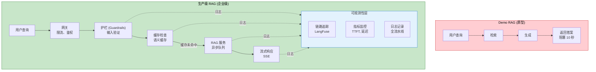

# 8. 生产级工程化

> **“演示 Demo 与生产系统之间的差距，是用可靠性、延迟、可观测性和成本控制来衡量的，而非单纯的准确度。”** —— LLMOps 原则

本章涵盖了将 RAG 从原型转化为企业级应用所需的工程基础设施：支持流式输出的服务架构、性能优化方案、安全护栏、可观测性追踪以及持续改进闭环。

---

## 8.1 生产架构概览

### 8.1.1 从 Demo 到生产

**Demo 版 RAG** 侧重于准确度：
- 单线程执行
- 同步响应
- 缺乏错误处理
- 资源使用无限制

**生产级 RAG** 强调可靠性：
- 高并发服务能力
- 流式响应 (Streaming)
- 容错机制
- 成本优化
- 全链路可观测性

---

## 8.2 服务架构与部署

### 8.2.1 LLM 推理服务框架

**问题**：直接使用原生模型库对于生产环境来说太慢且资源利用率低。

**解决方案**：使用经过优化的专用推理框架。

- **vLLM**（行业标准）：通过 **PagedAttention** 技术高效管理 KV 缓存，支持**连续批处理 (Continuous Batching)**，吞吐量比原生实现高出 10-20 倍。
- **TGI (Text Generation Inference)**：HuggingFace 出品，支持 Flash Attention 和量化加速，生产环境极其稳健。

### 8.2.2 基于 SSE 的流式响应

**问题**：用户等待完整答案需要 10 秒以上，体验极差。

**解决方案**：使用 **服务器发送事件 (Server-Sent Events, SSE)** 实现逐 Token 输出。

**收益**：
- **降低体感延迟**：TTFT (首字时间) 缩短至数百毫秒。
- **渐进式渲染**：用户可以看到答案实时生成的过程。

---

## 8.3 性能优化

### 8.3.1 语义缓存 (Semantic Caching)

**核心思想**：如果用户的提问在语义上与之前的查询高度相似（相似度 > 0.95），直接返回缓存的答案。

**收益**：
- 延迟从 3s 降至 0.1s。
- API 成本降低 100 倍。

### 8.3.2 向量检索优化

- **预热索引 (Warmup)**：在服务启动前将 HNSW 索引加载至内存。
- **二进制量化**：将 FP32 向量压缩为二进制，节省 30 倍内存并大幅提升检索速度。

### 8.3.3 提示词压缩 (Prompt Compression)

利用 **LLMLingua** 等技术，在不丢失核心信息的前提下，将 10k+ 的长上下文压缩 50% 以上，显著降低 Token 消耗和推理延迟。

---

## 8.4 安全护栏 (Guardrails)

### 8.4.1 输入护栏
- **提示词注入检测**：防止用户恶意绕过系统指令。
- **PII 脱敏**：使用 Microsoft Presidio 检测并屏蔽姓名、电话、邮箱等个人敏感信息。

### 8.4.2 输出护栏
- **幻觉检测**：实时校验生成的答案是否真正得到了上下文的支持。
- **有害内容过滤**：确保回答不包含攻击性、暴力或非法内容。

---

## 8.5 可观测性与持续改进

### 8.5.1 全链路追踪 (Tracing)
使用 **LangFuse** 或 **LangSmith** 追踪从查询解析、向量检索到模型生成的每一个步骤。当系统出错时，能迅速定位是检索出了错还是生成出了错。

### 8.5.2 持续反馈闭环
- **用户反馈采集**：通过 👍/👎 收集真实用户的满意度。
- **坏方案分析 (Bad Case Analysis)**：针对负面反馈，利用更强的 LLM 自动分析失败根因（如：文档缺失、分块不当、检索微弱）。

---

## 总结

### 生产环境检查清单 (Production Checklist)

1. **服务化**：配置好 vLLM/TGI 推理服务，并实现 SSE 流式输出。
2. **性能**：部署语义缓存，并完成全链路负载测试。
3. **安全**：启用输入/输出双向护栏。
4. **监控**：配置 LangFuse 追踪，并在 Grafana 中设置 TTFT 和成功率告警。
5. **改进**：建立每周一次的坏案例评审机制。

---

**下一步**：
- 📖 阅读 [最佳实践](/docs/ai/rag/best-practices) 了解更多架构设计模式。
- 🔧 为你的 LLM 搭建 vLLM 推理后端。
- 💻 实现基础的语义缓存逻辑。
- 🛡️ 部署 PII 脱敏护栏保护用户隐私。
