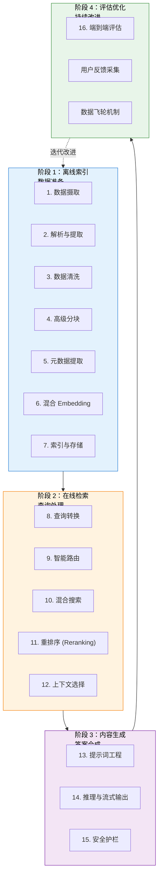

# 9. 最佳实践

> **“生产级 RAG 不仅仅是单个组件的堆砌，而是将 4 个阶段的 16 个步骤编排成一个可靠、可观测且持续进化的系统。”** —— RAG 生产原则

本章提供了一份以生产为导向的全方位指南，涵盖了 RAG 工作流的 4 个阶段及 16 个具体步骤。我们强调实战落地、工具选型指导以及生产就绪的设计模式。

---

## 9.1 四阶段 RAG 工作流概览

生产级 RAG 系统需要协同多个组件。每个阶段都旨在解决特定的挑战，并需要精细的工具选择与实现。

### 四大阶段

---

## 9.2 阶段 1：离线索引 / 数据准备

离线阶段将各种来源的原始数据转化为待查询的向量索引。这一阶段决定了检索质量的上限——“垃圾进，垃圾出”。

### 关键步骤要点：
1. **数据摄取**：建立模块化的连接器架构（PDF, Notion, SQL, Web），确保数据流的统一规范化。
2. **解析与提取**：使用具备布局感知能力的解析器（如 LlamaParse），保留表格和文档结构。
3. **数据清洗**：系统性移除页眉页脚、乱码及冗余空白。
4. **高级分块**：采用“父子分块”或语义分块，平衡检索精度与生成上下文的完整性。
5. **元数据提取**：自动化提取标题、摘要、关键词和分类，为后续的精确过滤打下基础。
6. **混合 Embedding**：结合稠密向量（语义）与稀疏向量（关键词），不漏掉任何匹配可能。
7. **索引存储**：利用 HNSW 索引实现海量向量的高性能检索。

---

## 9.3 阶段 2：在线检索 / 查询处理

在线阶段处理用户的实时请求，并将其转化为最优的生成上下文。

### 关键步骤要点：
1. **查询转换**：利用多查询 (Multi-Query) 或 HyDE 技术，弥合用户语言与文档语言之间的鸿沟。
2. **智能路由**：根据查询意图将任务导向最合适的路径（向量检索、网页搜索或直接回答）。
3. **混合搜索**：通过 RRF（倒数排名融合）算法完美结合语义和关键词匹配。
4. **重排序 (Reranking)**：使用 Cross-Encoder 模型对召回结果进行二次精排，大幅提升 Top-K 准确度。
5. **上下文选择**：应用 MMR（最大边界相关性）确保选中的文档既相关又具备多样性。

---

## 9.4 阶段 3：内容生成 / 答案合成

这一阶段的任务是将检索到的原始资料合成为忠实、自然且带引用标注的答案。

### 关键步骤要点：
1. **提示词工程**：使用结构化的 Prompt 模板，明确回复准则和来源归因要求。
2. **推理与流式输出**：集成 vLLM/TGI 服务，并通过 SSE 实现逐 Token 的流式响应，降低用户的感官延迟。
3. **安全护栏**：在输入端拦截注入攻击，在输出端校验幻觉和有害内容。

---

## 9.5 阶段 4：评估与优化

评估是 RAG 系统从“玩具”走向“产品”的必经之路。

### 关键步骤要点：
1. **RAG 三元组指标**：利用 Ragas 框架量化上下文相关性、忠实度和答案相关性。
2. **用户反馈**：采集 👍/👎 等显式反馈，以及查询改写等隐式信号。
3. **数据飞轮**：建立“生产数据反馈 → 坏案例分析 → 针对性优化 → 回归测试 → 重新部署”的自动化改进闭环。

---

## 9.6 工具选型框架

### 核心建议：
- **向量数据库**：大规模首选 **Milvus**，快速上手选 **Pinecone**，已有 SQL 选 **pgvector**。
- **Embedding 模型**：追求质量选 **OpenAI**，追求性价比和自托管选 **BGE** 系列。
- **LLM**：核心业务选 **GPT-4o** 或 **Claude 3.5 Sonnet**，降本增效选 **GPT-4o-mini** 或 **Llama 3.1**。

---

## 9.7 生产环境检查清单 (部分)

### 部署前验证：
- [ ] 所有的解析流水线是否支持边缘案例？
- [ ] 检索延迟（P95）是否低于 500ms？
- [ ] 是否已启用首字延迟（TTFT）监控？
- [ ] 是否实现了 PII 个人敏感信息脱敏？
- [ ] 针对核心流程是否准备了至少 50 个黄金案例进行评估？

---

## 总结

### 核心要点
1. **工程化思维**：RAG 的成功不在于模型多强，而在于数据流和流程编排的严谨性。
2. **上下文至上**：2025 年的趋势是精细化的上下文工程，而非单纯的提示词调优。
3. **闭环致胜**：建立可量化的评估体系和数据飞轮，是系统持续领先的关键。

---

**下一步**：
- 📖 阅读 [高级 RAG 技术](/docs/ai/rag/advanced-rag) 深入研究特定模块的优化。
- 💻 为你的 RAG 系统集成全链路追踪工具（如 LangFuse）。
- 📈 开启你的第一个数据飞轮迭代周期。
