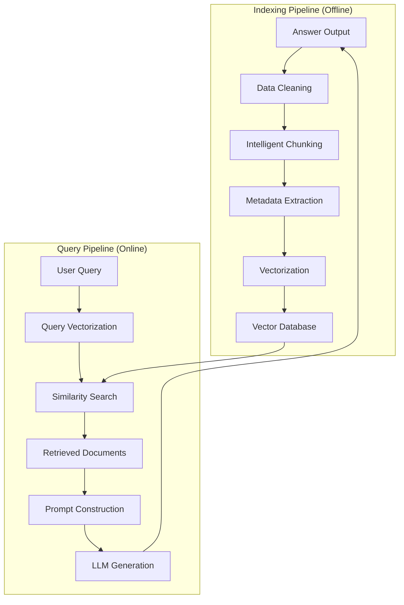

# RAG Systems: 完整指南

> **"RAG 架起了静态 LLM 知识与动态、领域特定信息之间的桥梁。"**

检索增强生成（Retrieval-Augmented Generation，RAG）通过从外部知识库中检索相关上下文来增强 LLM 的能力，使 AI 能够访问实时的、准确的企业私有数据。

---

## 为什么需要 RAG？

| LLM 局限 | RAG 解决方案 |
|-----------|-------------|
| 知识截止日期 | 提供最新信息 |
| 幻觉问题 | 基于事实生成回答 |
| 无法访问私有数据 | 访问内部文档 |
| 微调成本高昂 | 无需模型训练 |

---

## RAG 架构概览



---

## 核心概念概览

### 1. 数据处理流水线
- **文档加载**：多格式支持（PDF、HTML、Markdown、DOCX）
- **智能分块**：基于语义的结构化拆分
- **元数据提取**：自动提取与 LLM 增强的元数据
- **批量向量化**：优化 API 调用成本

### 2. 向量索引
- **Embedding 模型**：OpenAI、BGE、Cohere 模型选择
- **索引算法**：HNSW 图索引、IVF、PQ 压缩
- **存储优化**：缓存策略、批量操作
- **性能调优**：搜索速度与召回率的权衡

### 3. 检索策略
- **向量搜索**：语义相似度匹配
- **混合检索**：关键词搜索与向量搜索结合
- **查询变换**：Multi-Query、Decomposition、HyDE
- **智能路由**：基于查询类型的动态策略选择
- **重排序**：Cross-Encoder 精度提升

### 4. 生成增强
- **Prompt Engineering**：上下文注入策略
- **参数调优**：Temperature、Top-P、Top-K
- **生成模式**：Refine、Tree Summarize、Multi-hop
- **引用生成**：答案溯源与可信度

### 5. 评估框架
- **RAG 三元组**：Faithfulness、Answer Relevance、Context Precision
- **检索指标**：Recall、Precision、MRR、NDCG
- **生成指标**：BLEU、ROUGE、BERTScore
- **评估方法**：Golden Dataset、LLM-as-a-Judge

---

## Spring AI 快速开始

```java
@Service
public class RAGService {

    private final ChatClient chatClient;
    private final VectorStore vectorStore;

    public String query(String userQuestion) {
        return chatClient.prompt()
            .user(userQuestion)
            .advisors(new QuestionAnswerAdvisor(vectorStore))
            .call()
            .content();
    }
}
```

---

## 技术栈

### 向量数据库

| 数据库 | 类型 | 使用场景 |
|--------|------|----------|
| **PgVector** | PostgreSQL 扩展 | 中等规模，已有 PostgreSQL 基础设施 |
| **Milvus** | 分布式 | 大规模生产环境 |
| **Pinecone** | 托管服务 | 快速原型开发 |
| **Chroma** | 本地 | 开发和测试 |

### Embedding 模型

| 模型 | 维度 | 质量 | 成本 |
|------|------|------|------|
| **OpenAI text-embedding-3-small** | 1536 | 优秀 | $0.02/1M tokens |
| **OpenAI text-embedding-3-large** | 3072 | 优秀 | $0.13/1M tokens |
| **BGE-M3** | 1024 | 很好 | 免费（自托管） |
| **Cohere embed-v3** | 1024 | 优秀 | $0.10/1M tokens |

---

## 学习路径（完整 9 章教程）

### 第一阶段：基础建设

**1. [RAG 基础](/docs/ai/rag/introduction)** - 从这里开始
- RAG 核心定义与直觉
- 向量空间数学基础
- RAG 分类（Naive/Advanced/Modular/GraphRAG）
- Spring AI 架构深入解析
- 完整实现指南

**2. [数据处理流水线](/docs/ai/rag/data-processing)**
- 多格式文档加载（PDF/HTML/MD/DOCX/API）
- 数据清洗与质量评估
- 智能分块策略（Semantic/Recursive/Parent-Child）
- 自动元数据提取与 LLM 增强
- Spring AI Reader 实战实现

**3. [向量索引与存储](/docs/ai/rag/vector-indexing)**
- Embedding 模型选择与对比
- 批量生成优化与缓存
- HNSW 索引原理与调优
- 向量存储架构设计
- 生产环境优化策略

### 第二阶段：检索与生成

**4. [检索策略](/docs/ai/rag/retrieval)**
- 相似度搜索基础
- 查询变换（Multi-Query/HyDE/Decomposition）
- 智能路由与查询分类
- 混合检索（BM25 + Vector）
- 重排序优化（Cross-Encoder/Cohere Rerank）

**5. [生成策略](/docs/ai/rag/generation)**
- Prompt Engineering 最佳实践
- 上下文组装与优化
- 生成参数控制（Temperature/Top-P）
- 高级模式（Refine/Tree Summarize）
- Agentic RAG 入门

**6. [评估策略](/docs/ai/rag/evaluation)**
- RAG 三元组评估框架
- 检索指标（Recall/Precision/MRR）
- 生成指标（Faithfulness/Relevance）
- 评估方法（Golden Dataset/LLM-as-a-Judge）
- 可观测性工具（Arize/TruLens）

### 第三阶段：高级技术

**7. [高级 RAG 技术](/docs/ai/rag/advanced-rag)**
- 模块化 RAG 架构
- 知识图谱集成（GraphRAG）
- 自适应检索系统（Self-RAG/CRAG）
- 微调融合（RAFT/Domain Adaptation）
- 性能优化（Caching/Quantization）

### 第四阶段：生产实践

**8. [生产工程](/docs/ai/rag/production)**
- 服务架构设计（Streaming/Concurrency）
- 性能优化（Latency/Throughput）
- 安全护栏（Content filtering/Safety）
- 可观测性（Tracing/Metrics/Logging）
- 持续改进循环

**9. [最佳实践](/docs/ai/rag/best-practices)**
- 完整工作流（16 步 × 4 阶段）
- 工具选择决策树
- 设计模式与反模式
- 测试策略
- 常见陷阱与解决方案

---

## 生产注意事项

:::tip 关键生产注意事项

1. **分块大小很重要** - 太小会丢失上下文，太大会降低精度
2. **优先使用元数据过滤** - 在可能的情况下，先使用元数据过滤器再进行向量搜索
3. **监控检索质量** - 跟踪检索到的文本块的相关性
4. **缓存 Embedding** - 避免对相同查询重复计算
5. **处理边界情况** - 无相关文档时的回退策略
6. **流式响应** - 大上下文场景下的用户体验
7. **安全护栏** - 提示注入和敏感信息过滤
8. **成本控制** - Token 用量和 API 调用优化

:::

---

## 推荐学习顺序

### 初学者路径（4 天）
```
第 1 天：第 1-2 章（基础 + 数据处理）
第 2 天：第 3-4 章（向量索引 + 检索）
第 3 天：第 5-6 章（生成 + 评估）
第 4 天：第 9 章（最佳实践）
```

### 进阶路径（3 天）
```
第 1 天：第 7 章（高级 RAG）
第 2 天：第 8 章（生产工程）
第 3 天：第 9 章实战项目
```

### 全栈工程师路径（1 周）
```
按顺序完成全部 9 章，每章包含：
- 理论基础
- Spring AI 代码示例
- 生产最佳实践
- 练习项目
```

---

## 更多资源

**研究论文**：
- [Retrieval-Augmented Generation for Knowledge-Intensive NLP Tasks](https://arxiv.org/abs/2005.11401)（Lewis et al., 2020）- RAG 原始论文
- [GraphRAG: Knowledge-Augmented Generation](https://www.microsoft.com/en-us/research/project/graphrag/)（Microsoft Research, 2024）
- [Modular RAG](https://arxiv.org/abs/2407.01319)（ACM 2024）- 模块化架构
- [RAFT: Adapting RAG](https://arxiv.org/abs/2403.10131）- 微调融合方法

**官方文档**：
- [Spring AI Reference](https://docs.spring.io/spring-ai/reference/)
- [LangChain RAG Tutorial](https://python.langchain.com/docs/use_cases/question_answering/)
- [LlamaIndex Documentation](https://docs.llamaindex.ai/)

**评估框架**：
- [RAGAS Evaluation Framework](https://docs.ragas.io/)
- [TruLens (TruEra)](https://www.trulens.org/trulens_eval)
- [Arize Phoenix](https://docs.arize.com/phoenix/)

**教程与课程**：
- [DataWhale All-in-RAG](https://datawhalechina.github.io/all-in-rag/) - 中文 RAG 教程
- [Pinecone Learning Center](https://www.pinecone.io/learn)
- [DeepLearning.AI RAG Course](https://www.deeplearning.ai/short-courses/building-evaluating-advanced-rag/)

---

## 开始学习

选择你的起点：

- **快速原型**：从[第 2 章](/docs/ai/rag/data-processing)开始，使用现成的文档加载器
- **深入理解**：从[第 1 章](/docs/ai/rag/introduction)开始，学习理论基础
- **生产就绪**：直接跳到[第 8 章](/docs/ai/rag/production)和[第 9 章](/docs/ai/rag/best-practices)

:::info 需要帮助？

本文档网站配备了 **AI 聊天助手** - 点击右下角的聊天图标即可提问关于 RAG 的任何问题！

:::
