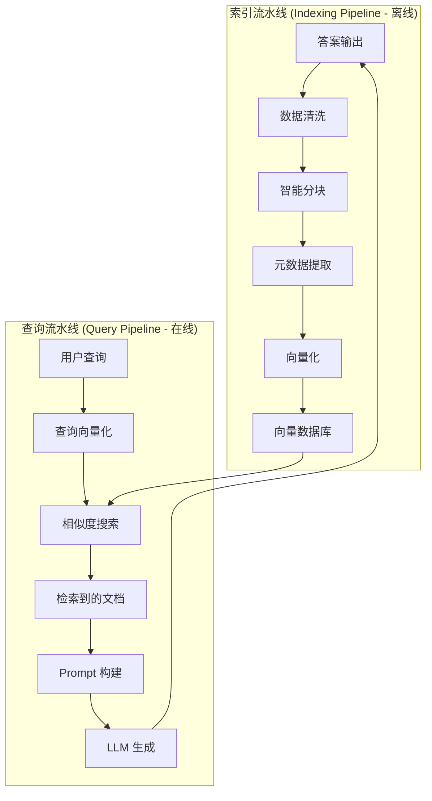

# RAG 系统：完整指南

> **“RAG 弥合了 LLM 的静态知识与动态、特定领域信息之间的鸿沟。”**

检索增强生成 (Retrieval-Augmented Generation, RAG) 通过从外部知识库检索相关的上下文来增强 LLM 的能力，使 AI 能够访问实时、准确的企业私有数据。

---

## 为什么需要 RAG？

| LLM 局限性 | RAG 解决方案 |
|----------------|--------------|
| 知识截止日期 (Knowledge cutoff) | 提供最新信息 |
| 幻觉 (Hallucinations) | 使响应基于事实 |
| 无法访问私有数据 | 访问内部文档 |
| 昂贵的微调 | 无需模型训练 |

---

## RAG 架构概览



---

## 核心概念概览

### 1. 数据处理流水线
- **文档加载**：多格式支持 (PDF, HTML, Markdown, DOCX)
- **智能分块**：基于语义的结构化拆分
- **元数据提取**：自动及 LLM 增强的元数据
- **批量向量化**：优化 API 调用成本

### 2. 向量索引
- **Embedding 模型**：OpenAI, BGE, Cohere 模型选择
- **索引算法**：HNSW 图索引、IVF、PQ 压缩
- **存储优化**：缓存策略、批量操作
- **性能调优**：搜索速度与召回率的权衡

### 3. 检索策略
- **向量搜索**：语义相似度匹配
- **混合检索**：结合关键词和向量搜索
- **查询转换**：多查询 (Multi-Query)、分解 (Decomposition)、HyDE
- **智能路由**：根据查询类型动态选择策略
- **重排序 (Re-ranking)**：Cross-Encoder 精度提升

### 4. 生成增强
- **提示词工程**：上下文注入策略
- **参数调优**：Temperature, Top-P, Top-K
- **生成模式**：Refine, Tree Summarize, 多跳 (Multi-hop)
- **引用生成**：答案溯源与可信度

### 5. 评估框架
- **RAG 三元组**：忠实度 (Faithfulness)、回答相关性、上下文精度
- **检索指标**：召回率 (Recall)、精确率 (Precision)、MRR、NDCG
- **生成指标**：BLEU, ROUGE, BERTScore
- **评估方法**：黄金数据集 (Golden Dataset)、LLM-as-a-Judge

---

## 使用 Spring AI 快速开始

```java
@Service
public class RAGService {

    private final ChatClient chatClient;
    private final VectorStore vectorStore;

    public String query(String userQuestion) {
        return chatClient.prompt()
            .user(userQuestion)
            .advisors(new QuestionAnswerAdvisor(vectorStore))
            .call()
            .content();
    }
}
```

---

## 技术栈选择

### 向量数据库

| 数据库 | 类型 | 使用场景 |
|----------|------|----------|
| **PgVector** | PostgreSQL 扩展 | 中等规模，已有的 PostgreSQL 基础设施 |
| **Milvus** | 分布式 | 大规模生产环境 |
| **Pinecone** | 托管服务 | 快速原型开发 |
| **Chroma** | 本地存储 | 开发与测试 |

### Embedding 模型

| 模型 | 维度 | 质量 | 成本 |
|-------|------------|---------|------|
| **OpenAI text-embedding-3-small** | 1536 | 极佳 | $0.02/1M tokens |
| **OpenAI text-embedding-3-large** | 3072 | 极佳 | $0.13/1M tokens |
| **BGE-M3** | 1024 | 优秀 | 免费 (自托管) |
| **Cohere embed-v3** | 1024 | 极佳 | $0.10/1M tokens |

---

## 学习路线 (完整 9 章教程)

### 第一阶段：夯实基础

**1. [RAG 基础](/docs/ai/rag/introduction)** - 从这里开始
- RAG 核心定义与直觉
- 向量空间数学基础
- RAG 分类 (基础/进阶/模块化/GraphRAG)
- Spring AI 架构深度剖析
- 完整实现指南

**2. [数据处理流水线](/docs/ai/rag/data-processing)**
- 多格式文档加载 (PDF/HTML/MD/DOCX/API)
- 数据清洗与质量评估
- 智能分块策略 (语义/递归/父子分块)
- 自动元数据提取与 LLM 增强
- Spring AI Reader 实战实现

**3. [向量索引与存储](/docs/ai/rag/vector-indexing)**
- Embedding 模型选择与对比
- 批量生成优化与缓存
- HNSW 索引原理与调优
- 向量存储架构设计
- 生产环境优化策略

### 第二阶段：检索与生成

**4. [检索策略](/docs/ai/rag/retrieval)**
- 相似度搜索基础
- 查询转换 (Multi-Query/HyDE/分解)
- 智能路由与查询分类
- 混合检索 (BM25 + 向量)
- 重排序优化 (Cross-Encoder/Cohere Rerank)

**5. [生成策略](/docs/ai/rag/generation)**
- 提示词工程最佳实践
- 上下文组装与优化
- 生成参数控制 (Temperature/Top-P)
- 高级模式 (Refine/Tree Summarize)
- 智能体 RAG (Agentic RAG) 简介

**6. [评估策略](/docs/ai/rag/evaluation)**
- RAG 三元组评估框架
- 检索指标 (Recall/Precision/MRR)
- 生成指标 (Faithfulness/Relevance)
- 评估方法 (黄金数据集/LLM-as-a-Judge)
- 可观测性工具 (Arize/TruLens)

### 第三阶段：进阶技术

**7. [高级 RAG 技术](/docs/ai/rag/advanced-rag)**
- 模块化 RAG 架构
- 知识图谱集成 (GraphRAG)
- 自适应检索系统 (Self-RAG/CRAG)
- 微调融合 (RAFT/领域适配)
- 性能优化 (缓存/量化)

### 第四阶段：生产实践

**8. [生产级工程化](/docs/ai/rag/production)**
- 服务架构设计 (流式/并发)
- 性能优化 (延迟/吞吐量)
- 安全护栏 (内容过滤/安全)
- 可观测性 (追踪/指标/日志)
- 持续改进闭环

**9. [最佳实践](/docs/ai/rag/best-practices)**
- 完整工作流 (16 步 × 4 阶段)
- 工具选择决策树
- 设计模式与反模式
- 测试策略
- 常见陷阱与解决方案

---

## 生产环境考量

:::tip 生产环境关键要点

1. **分块大小至关重要** - 太小丢失上下文，太大降低精度
2. **先进行元数据过滤** - 尽可能在向量搜索前使用元数据过滤器
3. **监控检索质量** - 跟踪检索分块的相关性
4. **缓存 Embedding** - 避免为相同的查询重复计算
5. **处理边缘情况** - 未找到相关文档时的兜底策略
6. **流式响应** - 提升大上下文场景下的用户体验
7. **安全护栏** - 提示词注入与敏感信息过滤
8. **成本控制** - Token 使用与 API 调用优化

:::

---

## 推荐学习顺序

### 初学者路径 (4 天)
```
第 1 天: 第 1-2 章 (基础 + 数据处理)
第 2 天: 第 3-4 章 (向量索引 + 检索)
第 3 天: 第 5-6 章 (生成 + 评估)
第 4 天: 第 9 章 (最佳实践)
```

### 进阶路径 (3 天)
```
第 1 天: 第 7 章 (高级 RAG)
第 2 天: 第 8 章 (生产工程化)
第 3 天: 第 9 章实战项目
```

### 全栈工程师路径 (1 周)
```
按顺序完成所有 9 章，每章包含：
- 理论基础
- Spring AI 代码示例
- 生产最佳实践
- 练习项目
```

---

## 附加资源

**研究论文**：
- [Retrieval-Augmented Generation for Knowledge-Intensive NLP Tasks](https://arxiv.org/abs/2005.11401) (Lewis et al., 2020) - 原始 RAG 论文
- [GraphRAG: Knowledge-Augmented Generation](https://www.microsoft.com/en-us/research/project/graphrag/) (Microsoft Research, 2024)
- [Modular RAG](https://arxiv.org/abs/2407.01319) (ACM 2024) - 模块化架构
- [RAFT: Adapting RAG](https://arxiv.org/abs/2403.10131) - 微调融合方法

**官方文档**：
- [Spring AI 参考指南](https://docs.spring.io/spring-ai/reference/)
- [LangChain RAG 教程](https://python.langchain.com/docs/use_cases/question_answering/)
- [LlamaIndex 文档](https://docs.llamaindex.ai/)

**评估框架**：
- [RAGAS 评估框架](https://docs.ragas.io/)
- [TruLens (TruEra)](https://www.trulens.org/trulens_eval)
- [Arize Phoenix](https://docs.arize.com/phoenix/)

**教程与课程**：
- [DataWhale All-in-RAG](https://datawhalechina.github.io/all-in-rag/) - 中文 RAG 教程
- [Pinecone 学习中心](https://www.pinecone.io/learn)
- [DeepLearning.AI RAG 课程](https://www.deeplearning.ai/short-courses/building-evaluating-advanced-rag/)

---

## 开始学习

选择你的起点：

- **快速原型开发**：从 [第 2 章](/docs/ai/rag/data-processing) 开始，使用开箱即用的文档加载器
- **深度理解**：从 [第 1 章](/docs/ai/rag/introduction) 开始，学习理论基础
- **生产就绪**：直接跳转到 [第 8 章](/docs/ai/rag/production) 和 [第 9 章](/docs/ai/rag/best-practices)

:::info 需要帮助？

本站配有 **AI 聊天助手** —— 点击右下角的聊天图标，即可询问任何关于 RAG 的问题！

:::
