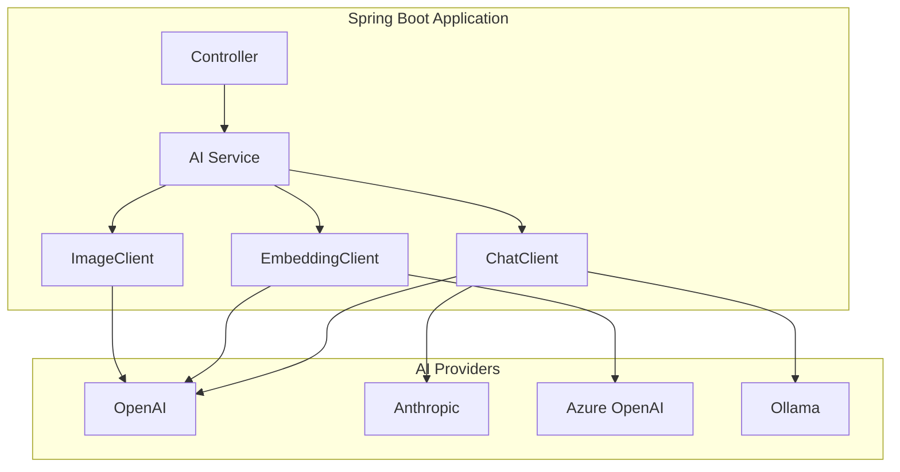

# 🍃 Spring AI

> **"将 AI 的力量引入企业 Java 生态系统。"**

Spring AI 提供了一致性的抽象层，用于将 AI 能力集成到 Spring Boot 应用中，通过统一 API 支持多个 AI 提供商。

---

## 🎯 为什么选择 Spring AI？

| 优势 | 说明 |
|------|------|
| **熟悉的模式** | Spring 约定、依赖注入 |
| **提供商无关** | 在 OpenAI、Anthropic、Ollama 等之间自由切换 |
| **生产就绪** | 内置重试、熔断器、可观测性 |
| **类型安全** | Java/Kotlin 类型安全，无需手动处理 JSON |

---

## 🏗️ 架构



---

## 🚀 快速开始

### 依赖配置

```xml
<!-- Spring AI BOM -->
<dependencyManagement>
    <dependencies>
        <dependency>
            <groupId>org.springframework.ai</groupId>
            <artifactId>spring-ai-bom</artifactId>
            <version>1.0.0-M4</version>
            <type>pom</type>
            <scope>import</scope>
        </dependency>
    </dependencies>
</dependencyManagement>

<!-- OpenAI Starter -->
<dependency>
    <groupId>org.springframework.ai</groupId>
    <artifactId>spring-ai-openai-spring-boot-starter</artifactId>
</dependency>
```

### 配置

```yaml
# application.yml
spring:
  ai:
    openai:
      api-key: ${OPENAI_API_KEY}
      chat:
        options:
          model: gpt-4o
          temperature: 0.7
```

---

## 💬 Chat Client

### 基本用法

```java
@Service
public class ChatService {
    
    private final ChatClient chatClient;
    
    public ChatService(ChatClient.Builder builder) {
        this.chatClient = builder.build();
    }
    
    public String chat(String userMessage) {
        return chatClient.prompt()
            .user(userMessage)
            .call()
            .content();
    }
}
```

### 带系统提示词

```java
public String chatWithContext(String userMessage) {
    return chatClient.prompt()
        .system("You are a helpful assistant specialized in Java programming.")
        .user(userMessage)
        .call()
        .content();
}
```

### 流式响应

```java
public Flux<String> streamChat(String userMessage) {
    return chatClient.prompt()
        .user(userMessage)
        .stream()
        .content();
}
```

---

## 📝 输出解析

### 结构化输出

```java
// Define response structure
public record MovieRecommendation(
    String title,
    int year,
    String genre,
    String reason
) {}

// Parse LLM output to Java object
public MovieRecommendation getRecommendation(String preferences) {
    return chatClient.prompt()
        .user("Recommend a movie for someone who likes: " + preferences)
        .call()
        .entity(MovieRecommendation.class);
}
```

### 列表输出

```java
public List<MovieRecommendation> getRecommendations(String preferences) {
    return chatClient.prompt()
        .user("Recommend 3 movies for: " + preferences)
        .call()
        .entity(new ParameterizedTypeReference<List<MovieRecommendation>>() {});
}
```

---

## 🔧 Function Calling

### 定义函数

```java
@Configuration
public class FunctionConfig {
    
    @Bean
    @Description("Get current weather for a location")
    public Function<WeatherRequest, WeatherResponse> currentWeather() {
        return request -> {
            // Call weather API
            return new WeatherResponse(
                request.city(),
                72.0,
                "Sunny"
            );
        };
    }
}

record WeatherRequest(String city, String unit) {}
record WeatherResponse(String city, double temperature, String condition) {}
```

### 在对话中使用函数

```java
public String chatWithWeather(String userMessage) {
    return chatClient.prompt()
        .user(userMessage)
        .functions("currentWeather")  // Enable the function
        .call()
        .content();
}

// 用户: "What's the weather in Seattle?"
// Agent: 调用 currentWeather("Seattle")
// 响应: "It's currently 72°F and sunny in Seattle."
```

---

## 🔢 Embeddings

### 生成 Embedding 向量

```java
@Service
public class EmbeddingService {
    
    private final EmbeddingModel embeddingModel;
    
    public EmbeddingService(EmbeddingModel embeddingModel) {
        this.embeddingModel = embeddingModel;
    }
    
    public float[] embed(String text) {
        EmbeddingResponse response = embeddingModel.embedForResponse(
            List.of(text)
        );
        return response.getResult().getOutput();
    }
    
    public List<float[]> embedBatch(List<String> texts) {
        return embeddingModel.embed(texts);
    }
}
```

---

## 📚 使用 Spring AI 实现 RAG

### Vector Store 集成

```java
@Configuration
public class VectorStoreConfig {
    
    @Bean
    public VectorStore vectorStore(EmbeddingModel embeddingModel) {
        return new PgVectorStore(
            jdbcTemplate,
            embeddingModel,
            PgVectorStore.Options.builder()
                .dimensions(1536)
                .distanceType(DistanceType.COSINE)
                .build()
        );
    }
}
```

### RAG 服务

```java
@Service
public class RAGService {
    
    private final VectorStore vectorStore;
    private final ChatClient chatClient;
    
    public String askWithContext(String question) {
        // 1. 检索相关文档
        List<Document> documents = vectorStore
            .similaritySearch(question);
        
        // 2. 构建上下文
        String context = documents.stream()
            .map(Document::getContent)
            .collect(Collectors.joining("\n\n"));
        
        // 3. 基于上下文生成响应
        return chatClient.prompt()
            .system("""
                Answer questions based on the provided context.
                If the answer is not in the context, say so.
                
                Context:
                """ + context)
            .user(question)
            .call()
            .content();
    }
}
```

---

## 📝 详细主题

- [多提供商配置](/docs/ai/spring-ai/providers)
- [Advisors 与中间件](/docs/ai/spring-ai/advisors)
- [可观测性与链路追踪](/docs/ai/spring-ai/observability)
- [测试 AI 组件](/docs/ai/spring-ai/testing)
- [生产最佳实践](/docs/ai/spring-ai/production)

---

:::tip Spring AI 最佳实践
1. **使用 ChatClient.Builder** - 更便于测试和配置
2. **外部化 API 密钥** - 永远不要硬编码，使用环境变量
3. **实现重试机制** - AI API 有速率限制和失败可能
4. **监控 Token 用量** - 跟踪使用情况以控制成本
5. **缓存响应** - 对确定性查询适当使用缓存
:::
