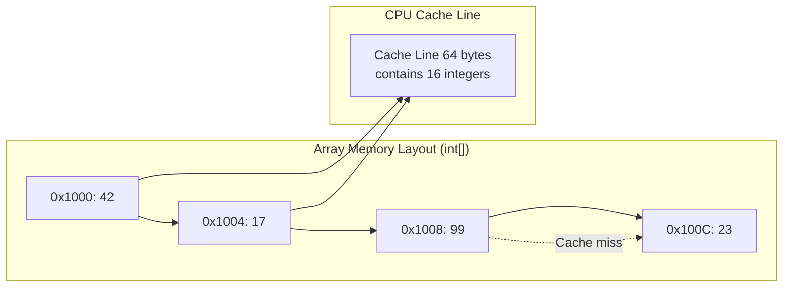
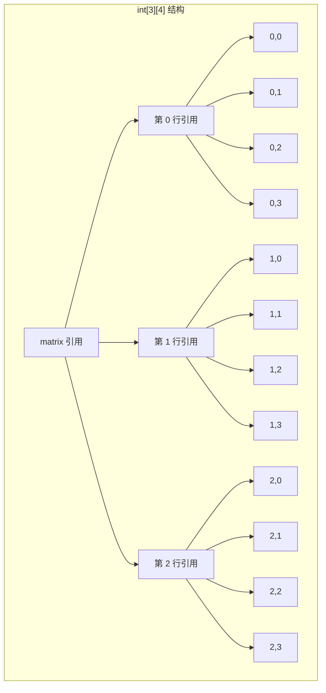

# Arrays & Strings

## 为什么数组与字符串很重要

数组和字符串是后端系统中高效数据处理的基础：

- **内存效率**：数组提供 O(1) 访问，开销极低——对高性能缓存层至关重要
- **缓存局部性**：顺序内存访问利用 CPU 缓存行，处理速度比链式结构快 10-100 倍
- **字符串处理**：每个 HTTP 请求、JSON 负载和数据库查询都涉及字符串操作
- **面试频率**：80%+ 的编程面试以数组/字符串题目开场

**实际影响**：处理每秒 10K 请求的后端 API，通过优化字符串拼接可以节省每个请求 200ms——相当于同一硬件可以多处理 2,000 个并发请求。

## 核心概念

### 内存布局与访问模式

数组是连续的内存块，每个元素占用相同大小。这种布局实现了：

- **O(1) 随机访问**：`arr[i]` 的地址计算为 `base_address + i * element_size`
- **CPU 缓存优化**：加载一个缓存行（64 字节）会获取多个相邻元素
- **可预测的迭代**：顺序访问最大化缓存命中率



### Java 中的 Array 与 ArrayList

| 操作 | Array (`int[]`) | `ArrayList<Integer>` | 说明 |
|-----------|----------------|--------------------|-------|
| **访问** | O(1) | O(1) | 两者都使用直接索引 |
| **插入（末尾）** | 不适用 | O(1) 摊销 | ArrayList 动态增长 |
| **插入（中间）** | O(n) 移动 | O(n) 移动 | 两者都需要移动元素 |
| **内存** | 每个 int 4 字节 | 每个 Integer 16+ 字节 | 对象开销 + 引用 |
| **基本类型支持** | 是 | 否（包装对象） | `int[]` vs `Integer[]` |

**何时使用哪种**：
- **基本类型数组**：数值计算、性能关键代码、内存受限环境
- **ArrayList**：需要动态调整大小、频繁插入/删除、存储对象

### String 不可变性

Java 字符串是不可变的——一旦创建，其值不能改变。这个设计选择有深远的影响：

```java
String s1 = "hello";  // 字符串池
String s2 = "hello";  // 复用池中的实例 (s1 == s2)
String s3 = new String("hello");  // 新对象 (s1 != s3)

// 拼接会创建新对象
String s4 = s1 + " world";  // 创建 "hello world" 对象
// s1 仍然是 "hello"
```

**优势**：
- **线程安全**：字符串访问无需同步
- **哈希缓存**：`hashCode()` 只计算一次并缓存
- **字符串池**：JVM 通过复用字符串字面量来优化内存

**劣势**：
- **内存开销**：每次拼接都创建新对象
- **性能代价**：每次拼接 O(n)（需要复制整个字符串）

### StringBuilder 与 StringBuffer

对于可变字符串操作，使用 `StringBuilder`（非同步）或 `StringBuffer`（同步）：

```java
// ❌ 错误：循环中使用字符串拼接 - O(n²)
public String badConcat(String[] words) {
    String result = "";
    for (String word : words) {
        result += word;  // 每次迭代都创建新对象
    }
    return result;  // 1 万个单词：约创建 5000 万个对象
}

// ✅ 正确：使用 StringBuilder - O(n)
public String goodConcat(String[] words) {
    StringBuilder sb = new StringBuilder();
    for (String word : words) {
        sb.append(word);  // 修改内部缓冲区
    }
    return sb.toString();  // 只创建一个对象
}
```

**性能对比**（10,000 次拼接）：
- 字符串拼接：约 1,200ms
- StringBuilder：约 2ms
- **快 600 倍**

### 二维数组

Java 中的二维数组是数组的数组——**不是**连续的内存块：

```java
int[][] matrix = new int[3][4];  // 3 行 4 列

// 不规则数组（每行可以有不同的长度）
int[][] ragged = new int[3][];
ragged[0] = new int[2];  // 第 0 行：2 列
ragged[1] = new int[5];  // 第 1 行：5 列
ragged[2] = new int[3];  // 第 2 行：3 列
```



**内存布局影响**：行主序（Java、C）意味着 `matrix[i][j]` 和 `matrix[i][j+1]` 相邻，但 `matrix[i][j]` 和 `matrix[i+1][j]` 可能相距很远。逐行迭代以获得缓存效率。

## 深入理解

### 数组扩容策略

ArrayList 使用以下策略增长：

```java
int oldCapacity = elementData.length;
int newCapacity = oldCapacity + (oldCapacity >> 1);  // 1.5 倍增长

// 为什么是 1.5 倍而不是 2 倍？
// - 平衡内存浪费与扩容频率
// - 2 倍对大数组会浪费内存
// - 1.5 倍仍然提供摊销 O(1) 的插入
```

**摊销分析**：扩容发生在增长的幂次处（1, 1.5, 2.25, 3.375...）。n 次插入的总开销为 O(n)，因此每次插入的平均开销为 O(1)。

### 字符串池优化

```java
// 编译时常量进入字符串池
String s1 = "hello" + " world";  // 单个池化字符串
String s2 = "hello world";  // 复用同一个池条目
System.out.println(s1 == s2);  // true

// 运行时拼接创建新对象
String s3 = "hello";
String s4 = s3 + " world";  // 未池化
String s5 = "hello world";
System.out.println(s4 == s5);  // false

// 显式 intern
String s6 = s4.intern();  // 添加到字符串池
System.out.println(s6 == s5);  // true
```

**后端启示**：对于频繁使用的字符串（HTTP 头、配置键），谨慎使用 `intern()`——它会增加 GC 压力。

### 常见陷阱

#### ❌ 使用 == 比较字符串

```java
String userInput = getUserInput();  // 运行时值
String constant = "admin";

if (userInput == constant) {  // BUG：比较的是引用
    // 极少成功！
}
```

#### ✅ 始终使用 .equals()

```java
if (userInput.equals(constant)) {  // 比较内容
    // 正确的比较方式
}

// 或使用 Objects.equals() 实现空值安全
if (Objects.equals(userInput, constant)) {
    // 即使 userInput 为 null 也安全
}
```

#### ❌ 数组迭代中的越界错误

```java
int[] arr = {1, 2, 3, 4, 5};
for (int i = 0; i <= arr.length; i++) {  // BUG：ArrayIndexOutOfBoundsException
    System.out.println(arr[i]);
}
```

#### ✅ 使用 `<` 而非 `<=`

```java
for (int i = 0; i < arr.length; i++) {  // 正确
    System.out.println(arr[i]);
}

// 或使用增强 for 循环（无需索引）
for (int val : arr) {
    System.out.println(val);
}
```

#### ❌ 迭代时修改数组

```java
String[] names = {"Alice", "Bob", "Charlie"};
for (String name : names) {
    if (name.equals("Bob")) {
        names[1] = "Robert";  // 迭代期间修改
    }
}
```

#### ✅ 创建单独的结果数组

```java
String[] result = new String[names.length];
for (int i = 0; i < names.length; i++) {
    result[i] = names[i].equals("Bob") ? "Robert" : names[i];
}
```

### 高级字符串操作

#### 子串搜索（KMP 算法）

```java
public int strStr(String haystack, String needle) {
    if (needle.isEmpty()) return 0;

    // 构建 LPS（最长公共前后缀）数组
    int[] lps = buildLPS(needle);

    int i = 0;  // haystack 索引
    int j = 0;  // needle 索引

    while (i < haystack.length()) {
        if (haystack.charAt(i) == needle.charAt(j)) {
            i++;
            j++;
            if (j == needle.length()) {
                return i - j;  // 找到匹配
            }
        } else {
            if (j != 0) {
                j = lps[j - 1];  // 在模式串中回退
            } else {
                i++;  // 在 haystack 中前进
            }
        }
    }
    return -1;  // 未找到
}

private int[] buildLPS(String pattern) {
    int[] lps = new int[pattern.length()];
    int len = 0;
    int i = 1;

    while (i < pattern.length()) {
        if (pattern.charAt(i) == pattern.charAt(len)) {
            len++;
            lps[i] = len;
            i++;
        } else {
            if (len != 0) {
                len = lps[len - 1];
            } else {
                lps[i] = 0;
                i++;
            }
        }
    }
    return lps;
}
```

**复杂度**：O(n + m) 时间，O(m) 空间
**使用场景**：在大文本中搜索模式（日志文件、文档索引）

#### 最长公共前缀

```java
public String longestCommonPrefix(String[] strs) {
    if (strs == null || strs.length == 0) return "";

    String prefix = strs[0];
    for (int i = 1; i < strs.length; i++) {
        while (strs[i].indexOf(prefix) != 0) {
            prefix = prefix.substring(0, prefix.length() - 1);
            if (prefix.isEmpty()) return "";
        }
    }
    return prefix;
}
```

**策略**：逐步缩短前缀，直到匹配所有字符串

### 矩阵旋转

```java
// 原地顺时针旋转 90 度
public void rotate(int[][] matrix) {
    int n = matrix.length;

    // 第一步：转置（交换 matrix[i][j] 和 matrix[j][i]）
    for (int i = 0; i < n; i++) {
        for (int j = i; j < n; j++) {
            int temp = matrix[i][j];
            matrix[i][j] = matrix[j][i];
            matrix[j][i] = temp;
        }
    }

    // 第二步：反转每行
    for (int i = 0; i < n; i++) {
        int left = 0, right = n - 1;
        while (left < right) {
            int temp = matrix[i][left];
            matrix[i][left] = matrix[i][right];
            matrix[i][right] = temp;
            left++;
            right--;
        }
    }
}
```

**可视化**：
```
Original:     Transpose:    Reverse rows:
1 2 3         1 4 7         7 4 1
4 5 6    →    2 5 8    →    8 5 2
7 8 9         3 6 9         9 6 3
```

### 稀疏矩阵表示

对于含大量零的矩阵（稀疏矩阵），使用坐标列表（COO）或压缩稀疏行（CSR）：

```java
// COO 表示
class SparseMatrix {
    List<int[]> entries;  // [行, 列, 值]
    int rows, cols;

    public SparseMatrix(int[][] dense) {
        this.rows = dense.length;
        this.cols = dense[0].length;
        this.entries = new ArrayList<>();

        for (int i = 0; i < rows; i++) {
            for (int j = 0; j < cols; j++) {
                if (dense[i][j] != 0) {
                    entries.add(new int[]{i, j, dense[i][j]});
                }
            }
        }
    }

    public int get(int row, int col) {
        for (int[] entry : entries) {
            if (entry[0] == row && entry[1] == col) {
                return entry[2];
            }
        }
        return 0;
    }
}
```

**内存节省**：100 万元素但只有 1 万个非零值的矩阵可节省约 90% 的内存。

## 实际应用

### HTTP 请求解析

```java
public class QueryParser {
    public Map<String, String> parseQuery(String queryString) {
        Map<String, String> params = new HashMap<>();

        if (queryString == null || queryString.isEmpty()) {
            return params;
        }

        String[] pairs = queryString.split("&");
        for (String pair : pairs) {
            String[] keyValue = pair.split("=", 2);
            if (keyValue.length == 2) {
                try {
                    String key = URLDecoder.decode(keyValue[0], "UTF-8");
                    String value = URLDecoder.decode(keyValue[1], "UTF-8");
                    params.put(key, value);
                } catch (UnsupportedEncodingException e) {
                    // 跳过无效编码
                }
            }
        }
        return params;
    }
}

// 输入: "name=John+Doe&age=30&city=New+York"
// 输出: {name: "John Doe", age: "30", city: "New York"}
```

### CSV 数据处理

```java
public List<String[]> parseCSV(String csvData) {
    List<String[]> rows = new ArrayList<>();
    String[] lines = csvData.split("\n");

    for (String line : lines) {
        // 处理包含逗号的引号值
        List<String> values = new ArrayList<>();
        StringBuilder current = new StringBuilder();
        boolean inQuotes = false;

        for (int i = 0; i < line.length(); i++) {
            char c = line.charAt(i);

            if (c == '"') {
                inQuotes = !inQuotes;
            } else if (c == ',' && !inQuotes) {
                values.add(current.toString());
                current = new StringBuilder();
            } else {
                current.append(c);
            }
        }
        values.add(current.toString());
        rows.add(values.toArray(new String[0]));
    }
    return rows;
}
```

### 滑动窗口限流器

```java
public class RateLimiter {
    private final long[] timestamps;  // 环形缓冲区
    private final int windowSize;
    private final int maxRequests;
    private int index = 0;
    private int count = 0;

    public RateLimiter(int maxRequests, int windowSeconds) {
        this.maxRequests = maxRequests;
        this.windowSize = windowSeconds;
        this.timestamps = new long[maxRequests];
        Arrays.fill(timestamps, 0);
    }

    public synchronized boolean allowRequest(long currentTime) {
        // 移除过期条目
        while (count > 0 &&
               currentTime - timestamps[index] >= windowSize) {
            index = (index + 1) % maxRequests;
            count--;
        }

        if (count < maxRequests) {
            int insertIndex = (index + count) % maxRequests;
            timestamps[insertIndex] = currentTime;
            count++;
            return true;
        }
        return false;
    }
}
```

### 内存缓存数组

```java
public class LRUCache {
    private final int[] keys;
    private final String[] values;
    private final boolean[] used;
    private final int capacity;
    private int size = 0;

    public LRUCache(int capacity) {
        this.capacity = capacity;
        this.keys = new int[capacity];
        this.values = new String[capacity];
        this.used = new boolean[capacity];
    }

    public String get(int key) {
        for (int i = 0; i < size; i++) {
            if (used[i] && keys[i] == key) {
                // 移到末尾（标记为最近使用）
                String value = values[i];
                if (i != size - 1) {
                    shiftLeft(i);
                    keys[size - 1] = key;
                    values[size - 1] = value;
                }
                return value;
            }
        }
        return null;
    }

    public void put(int key, String value) {
        // 检查键是否存在
        for (int i = 0; i < size; i++) {
            if (used[i] && keys[i] == key) {
                values[i] = value;
                if (i != size - 1) {
                    shiftLeft(i);
                    keys[size - 1] = key;
                    values[size - 1] = value;
                }
                return;
            }
        }

        // 满时淘汰 LRU
        if (size == capacity) {
            shiftLeft(0);  // 移除第一个元素
            size--;
        }

        // 添加新条目
        keys[size] = key;
        values[size] = value;
        used[size] = true;
        size++;
    }

    private void shiftLeft(int fromIndex) {
        for (int i = fromIndex; i < size - 1; i++) {
            keys[i] = keys[i + 1];
            values[i] = values[i + 1];
        }
    }
}
```

### 字符串模板引擎

```java
public class TemplateEngine {
    private static final Pattern PLACEHOLDER_PATTERN =
        Pattern.compile("\\{\\{(\\w+)\\}\\}");

    public String render(String template, Map<String, Object> context) {
        Matcher matcher = PLACEHOLDER_PATTERN.matcher(template);
        StringBuffer result = new StringBuffer();

        while (matcher.find()) {
            String key = matcher.group(1);
            Object value = context.get(key);
            matcher.appendReplacement(result,
                value != null ? value.toString() : "");
        }
        matcher.appendTail(result);
        return result.toString();
    }
}

// 使用示例:
// 模板: "Hello {{name}}, you have {{count}} new messages"
// 上下文: {name: "Alice", count: 5}
// 输出: "Hello Alice, you have 5 new messages"
```

## 面试题

### Q1：Two Sum（简单）

**题目**：给定整数数组 `nums` 和整数 `target`，返回相加等于 `target` 的两个数的索引。

**思路**：
1. 使用 HashMap 存储值到索引的映射
2. 对每个数，检查 `target - num` 是否在 map 中
3. 如果找到，返回两个索引

**复杂度**：O(n) 时间，O(n) 空间

```java
public int[] twoSum(int[] nums, int target) {
    Map<Integer, Integer> numToIndex = new HashMap<>();

    for (int i = 0; i < nums.length; i++) {
        int complement = target - nums[i];

        if (numToIndex.containsKey(complement)) {
            return new int[]{numToIndex.get(complement), i};
        }

        numToIndex.put(nums[i], i);
    }

    throw new IllegalArgumentException("No two sum solution");
}
```

### Q2：买卖股票的最佳时机（简单）

**题目**：找到单次买卖的最大利润。

**思路**：
1. 跟踪迄今为止的最低价格
2. 跟踪最大利润（当前价格 - 最低价格）

**复杂度**：O(n) 时间，O(1) 空间

```java
public int maxProfit(int[] prices) {
    if (prices == null || prices.length < 2) return 0;

    int minPrice = prices[0];
    int maxProfit = 0;

    for (int price : prices) {
        minPrice = Math.min(minPrice, price);
        maxProfit = Math.max(maxProfit, price - minPrice);
    }

    return maxProfit;
}
```

### Q3：包含重复元素（简单）

**题目**：如果数组包含任何重复元素，返回 true。

**思路**：使用 HashSet 跟踪已见过的数字

**复杂度**：O(n) 时间，O(n) 空间

```java
public boolean containsDuplicate(int[] nums) {
    Set<Integer> seen = new HashSet<>();

    for (int num : nums) {
        if (!seen.add(num)) {  // add() 在元素已存在时返回 false
            return true;
        }
    }
    return false;
}
```

### Q4：除自身以外的数组乘积（中等）

**题目**：返回数组，其中 `output[i]` 等于除 `nums[i]` 以外所有元素的乘积。必须在 O(n) 内完成，不能使用除法。

**思路**：
1. 第一次遍历：计算左侧乘积（左边所有元素的乘积）
2. 第二次遍历：乘以右侧乘积（右边所有元素的乘积）

**复杂度**：O(n) 时间，O(1) 额外空间（输出数组不计入）

```java
public int[] productExceptSelf(int[] nums) {
    int n = nums.length;
    int[] result = new int[n];

    // 用 1 初始化结果数组
    Arrays.fill(result, 1);

    // 计算左侧乘积
    int leftProduct = 1;
    for (int i = 0; i < n; i++) {
        result[i] = leftProduct;
        leftProduct *= nums[i];
    }

    // 计算右侧乘积并相乘
    int rightProduct = 1;
    for (int i = n - 1; i >= 0; i--) {
        result[i] *= rightProduct;
        rightProduct *= nums[i];
    }

    return result;
}
```

### Q5：最长连续序列（中等）

**题目**：在无序数组中找到最长连续元素序列的长度。

**思路**：
1. 将所有数字加入 HashSet
2. 对每个数字，只有当它是序列起点时（不存在 `num-1`）才开始计数
3. 向上计算连续数字

**复杂度**：O(n) 时间，O(n) 空间

```java
public int longestConsecutive(int[] nums) {
    if (nums == null || nums.length == 0) return 0;

    Set<Integer> numSet = new HashSet<>();
    for (int num : nums) {
        numSet.add(num);
    }

    int longestStreak = 0;

    for (int num : numSet) {
        // 只有当这是序列开头时才开始
        if (!numSet.contains(num - 1)) {
            int currentNum = num;
            int currentStreak = 1;

            while (numSet.contains(currentNum + 1)) {
                currentNum++;
                currentStreak++;
            }

            longestStreak = Math.max(longestStreak, currentStreak);
        }
    }

    return longestStreak;
}
```

### Q6：3Sum（中等）

**题目**：找到数组中所有和为零的唯一三元组。

**思路**：
1. 排序数组
2. 固定一个元素，用双指针处理剩余两个
3. 跳过重复元素以避免重复三元组

**复杂度**：O(n²) 时间，O(1) 空间（不含输出）

```java
public List<List<Integer>> threeSum(int[] nums) {
    List<List<Integer>> result = new ArrayList<>();
    Arrays.sort(nums);

    for (int i = 0; i < nums.length - 2; i++) {
        // 跳过重复元素
        if (i > 0 && nums[i] == nums[i - 1]) continue;

        int left = i + 1;
        int right = nums.length - 1;

        while (left < right) {
            int sum = nums[i] + nums[left] + nums[right];

            if (sum == 0) {
                result.add(Arrays.asList(nums[i], nums[left], nums[right]));

                // 跳过重复元素
                while (left < right && nums[left] == nums[left + 1]) left++;
                while (left < right && nums[right] == nums[right - 1]) right--;

                left++;
                right--;
            } else if (sum < 0) {
                left++;
            } else {
                right--;
            }
        }
    }

    return result;
}
```

### Q7：盛最多水的容器（中等）

**题目**：找到两条线，使它们与 x 轴构成的容器盛水最多。

**思路**：
1. 从两端开始的双指针（最宽的容器）
2. 向内移动较短的线（唯一可能增大面积的方法）
3. 记录最大面积

**复杂度**：O(n) 时间，O(1) 空间

```java
public int maxArea(int[] height) {
    int left = 0;
    int right = height.length - 1;
    int maxArea = 0;

    while (left < right) {
        int width = right - left;
        int containerHeight = Math.min(height[left], height[right]);
        int area = width * containerHeight;

        maxArea = Math.max(maxArea, area);

        // 移动较短的线
        if (height[left] < height[right]) {
            left++;
        } else {
            right--;
        }
    }

    return maxArea;
}
```

## 延伸阅读

- **链表**：理解基于指针的数据结构以作对比
- **双指针**：掌握数组/字符串题目的模式
- **HashMap**：深入理解基于哈希的查找
- **LeetCode**：[Arrays](https://leetcode.com/tag/array/) | [Strings](https://leetcode.com/tag/string/)
