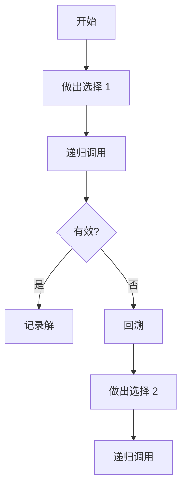

# 回溯算法

## 为什么回溯算法很重要

回溯通过逐步构建解并放弃不可能产生有效解的部分解，系统地探索所有可能性：

- **组合问题**：生成所有排列/组合
- **约束满足**：数独、N 皇后、填字游戏
- **路径搜索**：迷宫求解、图遍历
- **优化**：从众多可能性中找到最优解

**实际影响**：
- N 皇后用回溯：N=8 时 2 秒
- 暴力检查所有位置：N=8 时 4 小时
- **加速 7,200 倍**

## 核心概念

### 回溯模板

```java
void backtrack(state, parameters) {
    if (isSolution(state)) {
        recordSolution(state);
        return;
    }

    for (choice in generateChoices(state)) {
        if (isValid(choice)) {
            makeChoice(choice);
            backtrack(state, parameters);
            undoChoice(choice);  // 回溯
        }
    }
}
```



### 回溯 vs 递归

| 方面 | 回溯 | 递归 |
|------|------|------|
| **搜索空间** | 系统性探索 | 分治法 |
| **剪枝** | 激进（提前终止） | 通常无剪枝 |
| **用例** | 约束满足 | 问题分解 |
| **状态管理** | 做出/撤销选择 | 无需状态回滚 |

## 深入理解

### 全排列

生成所有可能的排列：

```java
public List<List<Integer>> permute(int[] nums) {
    List<List<Integer>> result = new ArrayList<>();
    backtrack(result, new ArrayList<>(), new boolean[nums.length], nums);
    return result;
}

private void backtrack(List<List<Integer>> result, List<Integer> current,
                      boolean[] used, int[] nums) {
    if (current.size() == nums.length) {
        result.add(new ArrayList<>(current));
        return;
    }

    for (int i = 0; i < nums.length; i++) {
        if (used[i]) continue;

        current.add(nums[i]);
        used[i] = true;

        backtrack(result, current, used, nums);

        current.remove(current.size() - 1);  // 回溯
        used[i] = false;
    }
}
```

### 组合

生成所有 k 元素组合：

```java
public List<List<Integer>> combine(int n, int k) {
    List<List<Integer>> result = new ArrayList<>();
    backtrack(result, new ArrayList<>(), 1, n, k);
    return result;
}

private void backtrack(List<List<Integer>> result, List<Integer> current,
                      int start, int n, int k) {
    if (current.size() == k) {
        result.add(new ArrayList<>(current));
        return;
    }

    for (int i = start; i <= n; i++) {
        current.add(i);
        backtrack(result, current, i + 1, n, k);  // 注意：i + 1 而非 start
        current.remove(current.size() - 1);  // 回溯
    }
}
```

### 剪枝策略

#### 排列中去重

```java
public List<List<Integer>> permuteUnique(int[] nums) {
    List<List<Integer>> result = new ArrayList<>();
    Arrays.sort(nums);  // 排序以将重复元素分组
    backtrack(result, new ArrayList<>(), new boolean[nums.length], nums);
    return result;
}

private void backtrack(List<List<Integer>> result, List<Integer> current,
                      boolean[] used, int[] nums) {
    if (current.size() == nums.length) {
        result.add(new ArrayList<>(current));
        return;
    }

    for (int i = 0; i < nums.length; i++) {
        if (used[i]) continue;

        // 跳过重复：只使用重复数字的第一次出现
        if (i > 0 && nums[i] == nums[i - 1] && !used[i - 1]) continue;

        current.add(nums[i]);
        used[i] = true;

        backtrack(result, current, used, nums);

        current.remove(current.size() - 1);
        used[i] = false;
    }
}
```

### 常见错误

#### ❌ 添加前未复制解

```java
if (current.size() == k) {
    result.add(current);  // 错误：添加了引用！
}
```

#### ✅ 创建新副本

```java
if (current.size() == k) {
    result.add(new ArrayList<>(current));  // 复制
}
```

#### ❌ 未撤销选择

```java
for (int i = 0; i < n; i++) {
    current.add(i);
    backtrack(current);
    // 忘记移除！
}
```

#### ✅ 始终回溯

```java
for (int i = 0; i < n; i++) {
    current.add(i);
    backtrack(current);
    current.remove(current.size() - 1);  // 移除
}
```

## 实际应用

### N 皇后

```java
public List<List<String>> solveNQueens(int n) {
    List<List<String>> result = new ArrayList<>();
    char[][] board = new char[n][n];

    for (int i = 0; i < n; i++) {
        Arrays.fill(board[i], '.');
    }

    backtrack(result, board, 0);
    return result;
}

private void backtrack(List<List<String>> result, char[][] board, int row) {
    int n = board.length;

    if (row == n) {
        result.add(constructBoard(board));
        return;
    }

    for (int col = 0; col < n; col++) {
        if (isValid(board, row, col)) {
            board[row][col] = 'Q';
            backtrack(result, board, row + 1);
            board[row][col] = '.';  // 回溯
        }
    }
}

private boolean isValid(char[][] board, int row, int col) {
    int n = board.length;

    // 检查列
    for (int i = 0; i < row; i++) {
        if (board[i][col] == 'Q') return false;
    }

    // 检查左上对角线
    for (int i = row - 1, j = col - 1; i >= 0 && j >= 0; i--, j--) {
        if (board[i][j] == 'Q') return false;
    }

    // 检查右上对角线
    for (int i = row - 1, j = col + 1; i >= 0 && j < n; i--, j++) {
        if (board[i][j] == 'Q') return false;
    }

    return true;
}
```

## 面试题

### Q1：子集（中等）

**问题**：生成所有子集。

**方法**：包含/排除每个元素

**复杂度**：O(2ⁿ) 时间

```java
public List<List<Integer>> subsets(int[] nums) {
    List<List<Integer>> result = new ArrayList<>();
    backtrack(result, new ArrayList<>(), nums, 0);
    return result;
}

private void backtrack(List<List<Integer>> result, List<Integer> current,
                      int[] nums, int start) {
    result.add(new ArrayList<>(current));

    for (int i = start; i < nums.length; i++) {
        current.add(nums[i]);
        backtrack(result, current, nums, i + 1);
        current.remove(current.size() - 1);
    }
}
```

### Q2：组合总和（中等）

**问题**：找出所有和为目标的组合（允许重复使用）。

**方法**：通过递减目标值回溯

**复杂度**：O(N^(T/M+1)) 时间

```java
public List<List<Integer>> combinationSum(int[] candidates, int target) {
    List<List<Integer>> result = new ArrayList<>();
    Arrays.sort(candidates);  // 启用提前终止
    backtrack(result, new ArrayList<>(), candidates, target, 0);
    return result;
}

private void backtrack(List<List<Integer>> result, List<Integer> current,
                      int[] nums, int remain, int start) {
    if (remain == 0) {
        result.add(new ArrayList<>(current));
        return;
    }

    for (int i = start; i < nums.length; i++) {
        if (nums[i] > remain) break;  // 提前终止

        current.add(nums[i]);
        backtrack(result, current, nums, remain - nums[i], i);  // 非 i+1（允许重复使用）
        current.remove(current.size() - 1);
    }
}
```

## 延伸阅读

- **动态规划**：用于优化子问题
- **递归**：回溯的基础
- **DFS**：图遍历使用回溯
- **LeetCode**：[回溯问题](https://leetcode.com/tag/backtracking/)
