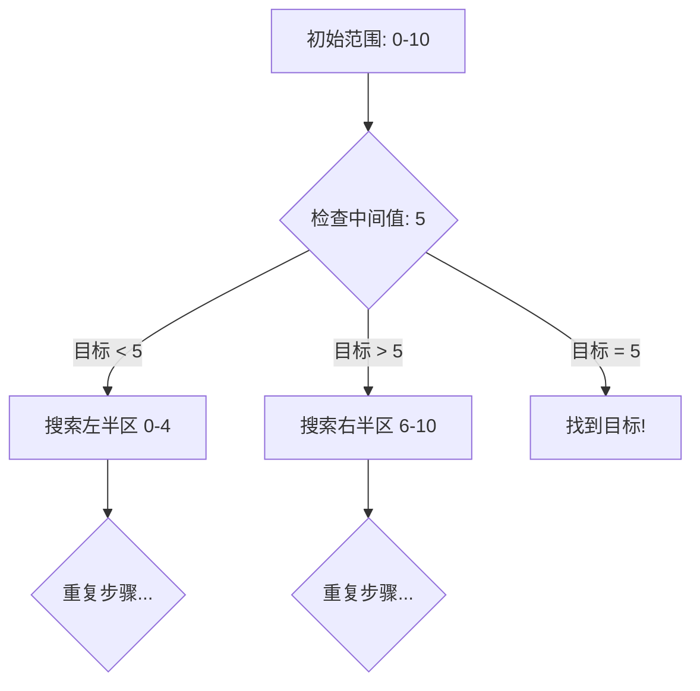

# 二分查找

## 为什么二分查找很重要

二分查找将搜索时间从 O(n) 降低到 O(log n) —— 这种提升是指数级的：

- **数据库索引**：B+ 树利用二分思想在对数时间内定位键值。
- **版本控制**：`git bisect` 利用二分法在海量提交中极速定位 Bug。
- **答案空间搜索**：在无法直接求解时，通过二分可能的结果来寻找最优解。

**实际影响**：在 10 亿个有序元素中查找：
- 线性搜索：平均比较 5 亿次（约 5 秒）。
- 二分查找：约 30 次比较（约 0.000003 秒）。
- **效率提升 1.6 亿倍**。

---

## 核心概念

### 标准二分查找



**前提条件**：数组必须是有序的。

```java
public int binarySearch(int[] nums, int target) {
    int left = 0, right = nums.length - 1;

    while (left <= right) {
        // 使用这种写法防止 (left + right) 导致的整型溢出
        int mid = left + (right - left) / 2;

        if (nums[mid] == target) {
            return mid;
        } else if (nums[mid] < target) {
            left = mid + 1; // 目标在右侧
        } else {
            right = mid - 1; // 目标在左侧
        }
    }
    return -1; // 未找到
}
```

---

## 三大常用模板

### 1. 查找精确值 (Standard)
使用 `while (left <= right)`。退出循环后 `left > right`。

### 2. 查找左边界 (Lower Bound)
寻找第一个 $\ge$ 目标值的索引。
```java
while (left < right) {
    int mid = left + (right - left) / 2;
    if (nums[mid] < target) left = mid + 1;
    else right = mid;
}
return left;
```

### 3. 查找右边界 (Upper Bound)
寻找第一个 $>$ 目标值的索引。
```java
while (left < right) {
    int mid = left + (right - left) / 2;
    if (nums[mid] <= target) left = mid + 1;
    else right = mid;
}
return left;
```

---

## 深入理解

### 在“答案空间”进行二分
当问题具有**单调性**（即如果 $x$ 满足条件，那么所有 $> x$ 的值也都满足或都不满足）时，即使没有显式的数组，也可以通过二分查找来寻找最优解。

**典型场景**：
- **仓库运送问题**：在 $D$ 天内运完所有货物，求最低运载能力。
- **分割数组最大值**：将数组分为 $k$ 段，求每段和最大值的最小值。

### 旋转排序数组查找
即便数组在某个点被旋转了（如 `[4,5,6,7,0,1,2]`），其中也必有一半是有序的。
- 逻辑：先判断 `mid` 落在左段还是右段，再判断 `target` 是否在有序的那一半区间内。

---

## 常见陷阱与规避

1. **整型溢出**：永远使用 `mid = left + (right - left) / 2`。
2. **死循环**：在 `left < right` 模板中，若更新逻辑为 `left = mid` 而非 `mid + 1`，且 `left` 与 `right` 相邻时，`mid` 会始终等于 `left`，导致无法跳出循环。
   - **对策**：始终确保搜索区间在每一轮都在缩小。

---

## 面试高频题

### Q1: 第一个错误版本 (简单)
**思路**：典型的二分查找答案空间。寻找满足 `isBadVersion(mid)` 的最小索引。

### Q2: 寻找峰值 (中等)
**思路**：即使数组无序，只要相邻元素不相等，必有峰值。通过比较 `nums[mid]` 和 `nums[mid+1]` 确定上坡方向，峰值一定在坡顶方向。

### Q3: 搜索 2D 矩阵 (中等)
**思路**：将 2D 矩阵逻辑上拉平为 1D 数组。索引转换公式：`matrix[mid / n][mid % n]`。

---

## 延伸阅读

- **二分查找进阶**：理解多维空间的二分查找。
- **排序算法**：作为二分查找的预置步骤，了解快排与归并的权衡。
- **LeetCode**：[二分查找标签题目](https://leetcode.com/tag/binary-search/)
