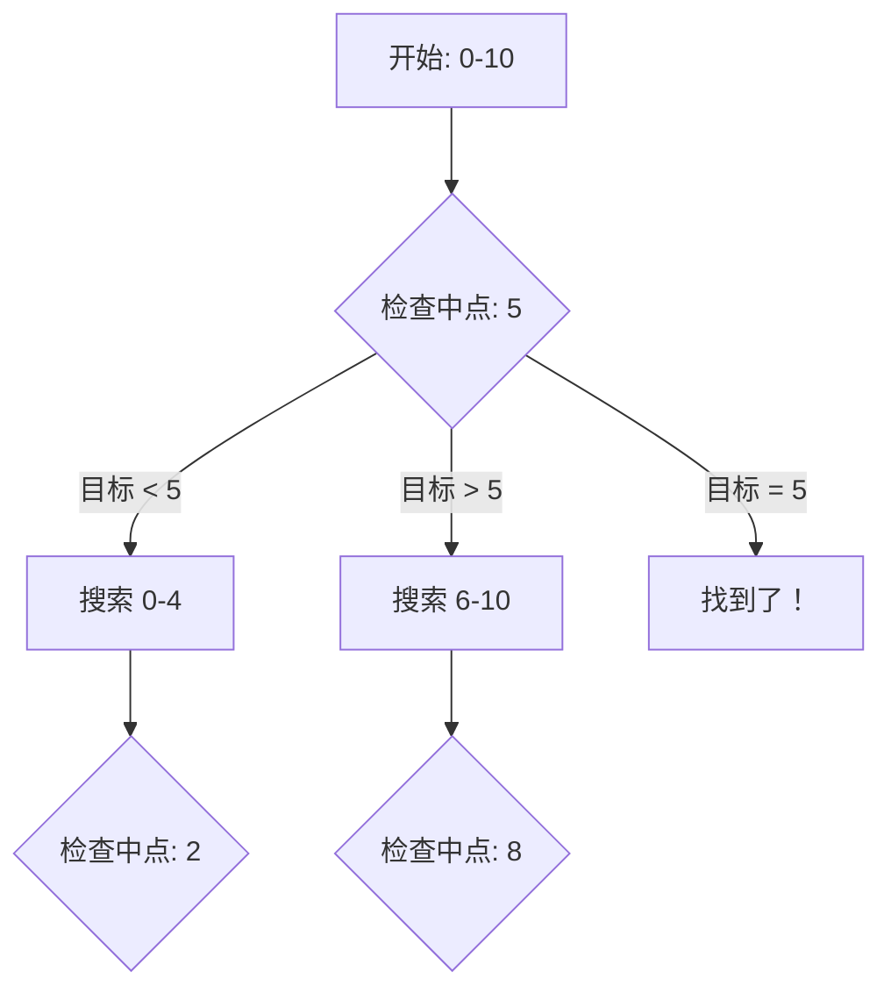

# 二分查找

## 为什么二分查找很重要

二分查找将搜索时间从 O(n) 降低到 O(log n)——指数级加速：

- **数据库索引**：B+ 树使用二分查找进行键查找
- **版本控制系统**：Git bisect 在对数时间内定位 bug
- **API 分页**：在有序结果集中二分搜索
- **优化问题**：对答案空间进行二分搜索

**实际影响**：在 10 亿个有序元素中搜索：
- 线性搜索：约 5 亿次比较（5 秒）
- 二分搜索：约 30 次比较（0.000003 秒）
- **快 16 亿倍**

## 核心概念

### 标准二分查找



**前提条件**：数组必须有序

```java
public int binarySearch(int[] nums, int target) {
    int left = 0;
    int right = nums.length - 1;

    while (left <= right) {
        int mid = left + (right - left) / 2;  // 防止溢出

        if (nums[mid] == target) {
            return mid;  // 找到
        } else if (nums[mid] < target) {
            left = mid + 1;  // 搜索右半部分
        } else {
            right = mid - 1;  // 搜索左半部分
        }
    }

    return -1;  // 未找到
}
```

**为什么用 `left + (right - left) / 2` 而不是 `(left + right) / 2`？**
- `(left + right)` 对于大值可能溢出
- `left + (right - left) / 2` 等效但安全

**复杂度**：O(log n) 时间，O(1) 空间

### 模板模式

#### 模板 1：标准（left ≤ right）

用于精确匹配搜索：

```java
public int binarySearch(int[] nums, int target) {
    int left = 0, right = nums.length - 1;

    while (left <= right) {
        int mid = left + (right - left) / 2;

        if (nums[mid] == target) return mid;
        if (nums[mid] < target) left = mid + 1;
        else right = mid - 1;
    }

    return -1;  // 未找到
}
```

**后置条件**：`left = right + 1`，搜索空间为空

#### 模板 2：下界（left < right）

用于找到满足条件的第一个位置：

```java
public int lowerBound(int[] nums, int target) {
    int left = 0, right = nums.length;

    while (left < right) {
        int mid = left + (right - left) / 2;

        if (nums[mid] < target) {
            left = mid + 1;
        } else {
            right = mid;
        }
    }

    return left;  // 第一个满足 nums[index] >= target 的索引
}
```

**后置条件**：`left == right`，指向第一个有效位置

#### 模板 3：上界（left < right）

用于找到第一个大于 target 的元素：

```java
public int upperBound(int[] nums, int target) {
    int left = 0, right = nums.length;

    while (left < right) {
        int mid = left + (right - left) / 2;

        if (nums[mid] <= target) {
            left = mid + 1;
        } else {
            right = mid;
        }
    }

    return left;  // 第一个满足 nums[index] > target 的索引
}
```

## 深入理解

### 二分答案

当答案空间具有单调性时（如果 x 满足条件，则所有 > x 的值也满足）：

```java
// 问题：找到满足 f(x) 为 true 的最小 x
public int binarySearchOnAnswer(int min, int max) {
    int left = min, right = max;
    int result = -1;

    while (left <= right) {
        int mid = left + (right - left) / 2;

        if (check(mid)) {  // f(mid) 为 true
            result = mid;   // 保存有效答案
            right = mid - 1;  // 尝试更小的值
        } else {
            left = mid + 1;  // 需要更大的值
        }
    }

    return result;
}

abstract boolean check(int x);  // 判定函数
```

**使用场景**：
- 寻找最小充分值
- 寻找最大可行值
- 分割数组的最大和（LeetCode 410）
- 运输包裹的容量（LeetCode 1011）

### 搜索旋转有序数组

数组原本有序，然后在未知枢轴点旋转：

```
原始: [0, 1, 2, 4, 5, 6, 7]
旋转后: [4, 5, 6, 7, 0, 1, 2]
                  ↑
               枢轴点
```

```java
public int searchRotated(int[] nums, int target) {
    int left = 0, right = nums.length - 1;

    while (left <= right) {
        int mid = left + (right - left) / 2;

        if (nums[mid] == target) return mid;

        // 左半部分有序
        if (nums[left] <= nums[mid]) {
            if (target >= nums[left] && target < nums[mid]) {
                right = mid - 1;  // 目标在左半部分
            } else {
                left = mid + 1;  // 目标在右半部分
            }
        }
        // 右半部分有序
        else {
            if (target > nums[mid] && target <= nums[right]) {
                left = mid + 1;  // 目标在右半部分
            } else {
                right = mid - 1;  // 目标在左半部分
            }
        }
    }

    return -1;  // 未找到
}
```

**关键洞察**：至少有一半（左或右）始终是有序的

### 在旋转有序数组中找最小值

```java
public int findMin(int[] nums) {
    int left = 0, right = nums.length - 1;

    while (left < right) {
        int mid = left + (right - left) / 2;

        if (nums[mid] > nums[right]) {
            // 最小值在右半部分
            left = mid + 1;
        } else {
            // 最小值在左半部分（包含 mid）
            right = mid;
        }
    }

    return nums[left];
}
```

### 常见陷阱

#### ❌ 差一错误

```java
while (left < right) {  // BUG：遗漏最后一个元素
    int mid = left + (right - left) / 2;
    if (nums[mid] == target) return mid;
    if (nums[mid] < target) left = mid;  // 应该是 mid + 1
    else right = mid;  // 应该是 mid - 1
}
```

#### ✅ 使用正确的边界

```java
while (left <= right) {
    int mid = left + (right - left) / 2;
    if (nums[mid] == target) return mid;
    if (nums[mid] < target) left = mid + 1;
    else right = mid - 1;
}
```

#### ❌ 整数溢出

```java
int mid = (left + right) / 2;  // 可能溢出！
```

#### ✅ 安全计算

```java
int mid = left + (right - left) / 2;  // 不会溢出
// 或 Java 9+:
int mid = Math.addExact(left, right) / 2;
```

#### ❌ 错误更新导致无限循环

```java
while (left < right) {
    int mid = left + (right - left) / 2;
    if (condition(mid)) {
        right = mid;  // 可能不前进！
    } else {
        left = mid;  // 可能不前进！
    }
}
```

#### ✅ 确保前进

```java
while (left < right) {
    int mid = left + (right - left) / 2;
    if (condition(mid)) {
        right = mid;  // 缩小到 [left, mid]
    } else {
        left = mid + 1;  // 缩小到 [mid+1, right]
    }
}
```

## 实际应用

### 元素的第一个和最后一个位置

```java
public int[] searchRange(int[] nums, int target) {
    int[] result = new int[]{-1, -1};

    // 找第一次出现
    result[0] = findFirst(nums, target);

    // 找最后一次出现
    result[1] = findLast(nums, target);

    return result;
}

private int findFirst(int[] nums, int target) {
    int left = 0, right = nums.length - 1;
    int first = -1;

    while (left <= right) {
        int mid = left + (right - left) / 2;

        if (nums[mid] == target) {
            first = mid;
            right = mid - 1;  // 继续向左搜索
        } else if (nums[mid] < target) {
            left = mid + 1;
        } else {
            right = mid - 1;
        }
    }

    return first;
}

private int findLast(int[] nums, int target) {
    int left = 0, right = nums.length - 1;
    int last = -1;

    while (left <= right) {
        int mid = left + (right - left) / 2;

        if (nums[mid] == target) {
            last = mid;
            left = mid + 1;  // 继续向右搜索
        } else if (nums[mid] < target) {
            left = mid + 1;
        } else {
            right = mid - 1;
        }
    }

    return last;
}
```

### 搜索插入位置

```java
public int searchInsert(int[] nums, int target) {
    int left = 0, right = nums.length;

    while (left < right) {
        int mid = left + (right - left) / 2;

        if (nums[mid] < target) {
            left = mid + 1;
        } else {
            right = mid;
        }
    }

    return left;
}
```

### 平方根（二分答案）

```java
public int mySqrt(int x) {
    if (x < 2) return x;

    int left = 2, right = x / 2;
    int result = 0;

    while (left <= right) {
        int mid = left + (right - left) / 2;
        long square = (long) mid * mid;

        if (square == x) {
            return mid;
        } else if (square < x) {
            result = mid;
            left = mid + 1;
        } else {
            right = mid - 1;
        }
    }

    return result;
}
```

### 搜索二维矩阵

每行有序，且每行第一个元素大于前一行最后一个元素的矩阵：

```java
public boolean searchMatrix(int[][] matrix, int target) {
    if (matrix == null || matrix.length == 0) return false;

    int m = matrix.length, n = matrix[0].length;
    int left = 0, right = m * n - 1;

    while (left <= right) {
        int mid = left + (right - left) / 2;
        int midValue = matrix[mid / n][mid % n];

        if (midValue == target) return true;
        if (midValue < target) {
            left = mid + 1;
        } else {
            right = mid - 1;
        }
    }

    return false;
}
```

**优化**：将二维数组视为一维数组

## 面试题

### Q1：二分查找（简单）

**题目**：在有序数组中进行经典二分查找。

**方法**：标准模板

**复杂度**：O(log n) 时间，O(1) 空间

```java
public int search(int[] nums, int target) {
    int left = 0, right = nums.length - 1;

    while (left <= right) {
        int mid = left + (right - left) / 2;

        if (nums[mid] == target) return mid;
        if (nums[mid] < target) left = mid + 1;
        else right = mid - 1;
    }

    return -1;
}
```

### Q2：搜索插入位置（简单）

**题目**：找到 target 应该插入的位置索引。

**方法**：下界搜索

**复杂度**：O(log n) 时间，O(1) 空间

```java
public int searchInsert(int[] nums, int target) {
    int left = 0, right = nums.length;

    while (left < right) {
        int mid = left + (right - left) / 2;

        if (nums[mid] < target) {
            left = mid + 1;
        } else {
            right = mid;
        }
    }

    return left;
}
```

### Q3：第一个错误版本（简单）

**题目**：找到第一个错误版本（通过 API 调用检测）。

**方法**：二分答案

**复杂度**：O(log n) 时间，O(1) 空间

```java
public int firstBadVersion(int n) {
    int left = 1, right = n;

    while (left < right) {
        int mid = left + (right - left) / 2;

        if (isBadVersion(mid)) {
            right = mid;
        } else {
            left = mid + 1;
        }
    }

    return left;
}
```

### Q4：搜索旋转数组（中等）

**题目**：在旋转有序数组中搜索目标值。

**方法**：修改的二分查找，检查哪一半有序

**复杂度**：O(log n) 时间，O(1) 空间

```java
public int search(int[] nums, int target) {
    int left = 0, right = nums.length - 1;

    while (left <= right) {
        int mid = left + (right - left) / 2;

        if (nums[mid] == target) return mid;

        if (nums[left] <= nums[mid]) {
            if (target >= nums[left] && target < nums[mid]) {
                right = mid - 1;
            } else {
                left = mid + 1;
            }
        } else {
            if (target > nums[mid] && target <= nums[right]) {
                left = mid + 1;
            } else {
                right = mid - 1;
            }
        }
    }

    return -1;
}
```

### Q5：旋转数组中找最小值（中等）

**题目**：在旋转有序数组中找到最小元素。

**方法**：二分查找，比较 mid 和 right

**复杂度**：O(log n) 时间，O(1) 空间

```java
public int findMin(int[] nums) {
    int left = 0, right = nums.length - 1;

    while (left < right) {
        int mid = left + (right - left) / 2;

        if (nums[mid] > nums[right]) {
            left = mid + 1;
        } else {
            right = mid;
        }
    }

    return nums[left];
}
```

### Q6：搜索二维矩阵（中等）

**题目**：在行列均有排序的二维矩阵中搜索。

**方法**：从右上角或左下角开始

**复杂度**：O(m + n) 时间，O(1) 空间

```java
public boolean searchMatrix(int[][] matrix, int target) {
    if (matrix == null || matrix.length == 0) return false;

    int m = matrix.length, n = matrix[0].length;
    int row = 0, col = n - 1;  // 从右上角开始

    while (row < m && col >= 0) {
        if (matrix[row][col] == target) return true;
        if (matrix[row][col] > target) {
            col--;  // 向左移动
        } else {
            row++;  // 向下移动
        }
    }

    return false;
}
```

### Q7：寻找峰值元素（中等）

**题目**：找到一个峰值元素（大于相邻元素）。

**方法**：二分查找，比较 mid 和 mid+1

**复杂度**：O(log n) 时间，O(1) 空间

```java
public int findPeakElement(int[] nums) {
    int left = 0, right = nums.length - 1;

    while (left < right) {
        int mid = left + (right - left) / 2;

        if (nums[mid] < nums[mid + 1]) {
            // 峰值在右边
            left = mid + 1;
        } else {
            // 峰值在左边（包含 mid）
            right = mid;
        }
    }

    return left;
}
```

## 延伸阅读

- **双指针**：常与二分查找结合使用
- **滑动窗口**：用于范围查询
- **排序**：二分查找的前提条件
- **LeetCode**：[二分查找题目](https://leetcode.com/tag/binary-search/)
