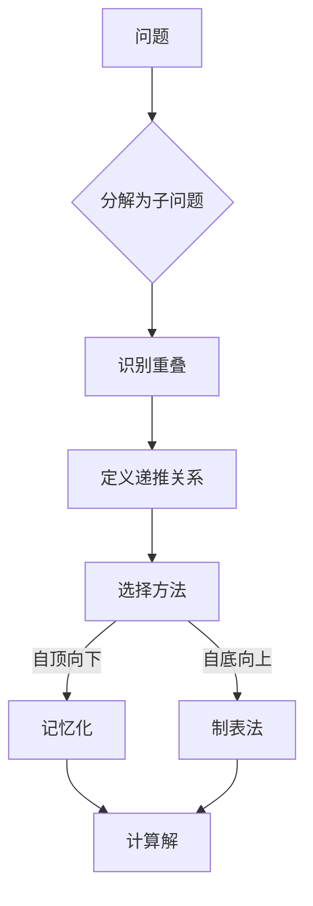

# 动态规划

## 为什么动态规划很重要

DP 通过将优化问题分解为重叠子问题来求解——避免重复计算：

- **优化问题**：求最大/最小值
- **计数问题**：计算方案数/排列数
- **字符串匹配**：编辑距离、LCS
- **资源分配**：背包问题、分割问题

**实际影响**：
- 计算 Fibonacci(50)：
  - 朴素递归：2⁵⁰ ≈ 10¹⁵ 次运算（数小时）
  - DP 记忆化：50 次运算（瞬间完成）
  - **快 10 万亿倍**
- 生物信息学中的序列比对（DNA 比较）使用 DP

## 核心概念

### DP 解题套路

1. **定义子问题**：什么更小的问题能构建解？
2. **状态定义**：哪些参数标识子问题？
3. **递推关系**：如何组合子问题的解？
4. **基本情况**：最小可解的子问题
5. **计算顺序**：自底向上（制表法）还是自顶向下（记忆化）？



### 自顶向下 vs 自底向上

| 方面 | 自顶向下（记忆化） | 自底向上（制表法） |
|------|-------------------|-------------------|
| **方法** | 递归 + 缓存 | 迭代，填充表格 |
| **内存** | O(递归深度) | O(表大小) |
| **速度** | 递归开销 | 通常更快 |
| **难度** | 从递推关系自然得出 | 需要考虑计算顺序 |

### 何时使用 DP

**特征**：
1. **最优子结构**：最优解包含最优子解
2. **重叠子问题**：相同子问题重复出现
3. **选择**：问题涉及做决策

**红旗**（考虑其他方法）：
- 输入规模 > 200（DP 可能太慢）
- 需要输出实际方案，而非仅计数
- 存在贪心选择性质

## 深入分析

### 一维 DP 示例

#### 爬楼梯

```java
public int climbStairs(int n) {
    if (n <= 2) return n;

    int prev2 = 1, prev1 = 2, current = 0;

    for (int i = 3; i <= n; i++) {
        current = prev1 + prev2;
        prev2 = prev1;
        prev1 = current;
    }

    return current;
}
```

**递推关系**：`dp[i] = dp[i-1] + dp[i-2]`（从第 i-1 或 i-2 步到达第 i 步的方案数）

#### 打家劫舍

```java
public int rob(int[] nums) {
    if (nums.length == 0) return 0;
    if (nums.length == 1) return nums[0];

    int prev2 = 0, prev1 = 0, current = 0;

    for (int num : nums) {
        current = Math.max(prev1, prev2 + num);
        prev2 = prev1;
        prev1 = current;
    }

    return current;
}
```

**状态**：`dp[i]` = 从 houses[0...i] 能获得的最大金额
**递推关系**：`dp[i] = max(dp[i-1], dp[i-2] + nums[i])`

### 二维 DP 示例

#### 不同路径

```java
public int uniquePaths(int m, int n) {
    int[][] dp = new int[m][n];

    // 第一行/第一列只有一种到达方式
    for (int i = 0; i < m; i++) dp[i][0] = 1;
    for (int j = 0; j < n; j++) dp[0][j] = 1;

    for (int i = 1; i < m; i++) {
        for (int j = 1; j < n; j++) {
            dp[i][j] = dp[i-1][j] + dp[i][j-1];
        }
    }

    return dp[m-1][n-1];
}
```

**递推关系**：`dp[i][j] = dp[i-1][j] + dp[i][j-1]`（从上方来的路径 + 从左方来的路径）

#### 最长公共子序列

```java
public int longestCommonSubsequence(String text1, String text2) {
    int m = text1.length(), n = text2.length();
    int[][] dp = new int[m + 1][n + 1];

    for (int i = 1; i <= m; i++) {
        for (int j = 1; j <= n; j++) {
            if (text1.charAt(i - 1) == text2.charAt(j - 1)) {
                dp[i][j] = dp[i - 1][j - 1] + 1;
            } else {
                dp[i][j] = Math.max(dp[i - 1][j], dp[i][j - 1]);
            }
        }
    }

    return dp[m][n];
}
```

**递推关系**：
- 如果字符匹配：`dp[i][j] = dp[i-1][j-1] + 1`
- 否则：`dp[i][j] = max(dp[i-1][j], dp[i][j-1])`

### 常见陷阱

#### ❌ 未处理边界情况

```java
public int badRob(int[] nums) {
    int[] dp = new int[nums.length];
    // BUG: 如果 nums.length < 2，ArrayIndexOutOfBounds
    dp[1] = Math.max(nums[0], nums[1]);
}
```

#### ✅ 正确处理边界情况

```java
public int goodRob(int[] nums) {
    if (nums.length == 0) return 0;
    if (nums.length == 1) return nums[0];
    if (nums.length == 2) return Math.max(nums[0], nums[1]);

    // 现在安全使用 dp[i-2]
    int[] dp = new int[nums.length];
    dp[1] = Math.max(nums[0], nums[1]);
}
```

#### ❌ 使用错误的递推关系

```java
// 零钱兑换，用贪心而非 DP
int coins = {1, 3, 4};
int amount = 6;
// 贪心：4 + 1 + 1 = 3 枚硬币
// 最优：3 + 3 = 2 枚硬币
```

#### ✅ 使用 DP 求最优解

```java
public int coinChange(int[] coins, int amount) {
    int[] dp = new int[amount + 1];
    Arrays.fill(dp, amount + 1);  // 初始化为"无穷大"
    dp[0] = 0;

    for (int i = 1; i <= amount; i++) {
        for (int coin : coins) {
            if (coin <= i) {
                dp[i] = Math.min(dp[i], dp[i - coin] + 1);
            }
        }
    }

    return dp[amount] > amount ? -1 : dp[amount];
}
```

### 进阶：状态机 DP

#### 买卖股票的最佳时机（含冷冻期）

```java
public int maxProfit(int[] prices) {
    if (prices.length <= 1) return 0;

    int n = prices.length;

    // hold[i]: 第 i 天持有股票时的最大利润
    // sold[i]: 第 i 天卖出股票后的最大利润
    // rest[i]: 第 i 天冷冻期（无股票，刚卖出）的最大利润

    int hold = -prices[0], sold = 0, rest = 0;

    for (int i = 1; i < n; i++) {
        int prevHold = hold, prevSold = sold, prevRest = rest;

        hold = Math.max(prevHold, prevRest - prices[i]);
        sold = prevHold + prices[i];
        rest = Math.max(prevRest, prevSold);
    }

    return Math.max(sold, rest);
}
```

## 实际应用

### 编辑距离（Levenshtein Distance）

```java
public int minDistance(String word1, String word2) {
    int m = word1.length(), n = word2.length();
    int[][] dp = new int[m + 1][n + 1];

    // 基本情况
    for (int i = 0; i <= m; i++) dp[i][0] = i;  // 全部删除
    for (int j = 0; j <= n; j++) dp[0][j] = j;  // 全部插入

    for (int i = 1; i <= m; i++) {
        for (int j = 1; j <= n; j++) {
            if (word1.charAt(i - 1) == word2.charAt(j - 1)) {
                dp[i][j] = dp[i - 1][j - 1];  // 无需操作
            } else {
                int insert = dp[i][j - 1] + 1;
                int delete = dp[i - 1][j] + 1;
                int replace = dp[i - 1][j - 1] + 1;
                dp[i][j] = Math.min(insert, Math.min(delete, replace));
            }
        }
    }

    return dp[m][n];
}
```

**使用场景**：
- 拼写检查（建议纠正）
- DNA 序列比对
- 抄袭检测

### 回文子串

```java
public int countSubstrings(String s) {
    int n = s.length();
    boolean[][] dp = new boolean[n][n];
    int count = 0;

    // 单个字符
    for (int i = 0; i < n; i++) {
        dp[i][i] = true;
        count++;
    }

    // 两个字符
    for (int i = 0; i < n - 1; i++) {
        if (s.charAt(i) == s.charAt(i + 1)) {
            dp[i][i + 1] = true;
            count++;
        }
    }

    // 更长的子串
    for (int len = 3; len <= n; len++) {
        for (int i = 0; i <= n - len; i++) {
            int j = i + len - 1;

            if (s.charAt(i) == s.charAt(j) && dp[i + 1][j - 1]) {
                dp[i][j] = true;
                count++;
            }
        }
    }

    return count;
}
```

## 面试题

### Q1：爬楼梯（简单）

**题目**：计算爬 n 级楼梯的方案数（每次 1 或 2 步）。

**方法**：类 Fibonacci 的 DP

**复杂度**：O(n) 时间，O(1) 空间

```java
public int climbStairs(int n) {
    if (n <= 2) return n;

    int prev2 = 1, prev1 = 2, current = 0;

    for (int i = 3; i <= n; i++) {
        current = prev1 + prev2;
        prev2 = prev1;
        prev1 = current;
    }

    return current;
}
```

### Q2：打家劫舍（中等）

**题目**：从非相邻房屋中获取最大金额。

**方法**：DP，状态为：位置 i 的最大值是 max(跳过 i, 抢劫 i + dp[i-2])

**复杂度**：O(n) 时间，O(1) 空间

```java
public int rob(int[] nums) {
    int prev2 = 0, prev1 = 0;

    for (int num : nums) {
        int current = Math.max(prev1, prev2 + num);
        prev2 = prev1;
        prev1 = current;
    }

    return prev1;
}
```

### Q3：零钱兑换（中等）

**题目**：凑成指定金额所需的最少硬币数。

**方法**：一维 DP，尝试每种硬币

**复杂度**：O(n × amount) 时间

```java
public int coinChange(int[] coins, int amount) {
    int[] dp = new int[amount + 1];
    Arrays.fill(dp, amount + 1);
    dp[0] = 0;

    for (int i = 1; i <= amount; i++) {
        for (int coin : coins) {
            if (coin <= i) {
                dp[i] = Math.min(dp[i], dp[i - coin] + 1);
            }
        }
    }

    return dp[amount] > amount ? -1 : dp[amount];
}
```

### Q4：最长递增子序列（中等）

**题目**：求 LIS 的长度。

**方法**：DP + 二分查找优化

**复杂度**：O(n log n) 时间，O(n) 空间

```java
public int lengthOfLIS(int[] nums) {
    int[] tails = new int[nums.length];
    int size = 0;

    for (int num : nums) {
        int left = 0, right = size;

        while (left < right) {
            int mid = left + (right - left) / 2;
            if (tails[mid] < num) left = mid + 1;
            else right = mid;
        }

        tails[left] = num;
        if (left == size) size++;
    }

    return size;
}
```

### Q5：最长公共子序列（中等）

**题目**：求两个字符串的 LCS 长度。

**方法**：二维 DP

**复杂度**：O(m × n) 时间

```java
public int longestCommonSubsequence(String text1, String text2) {
    int m = text1.length(), n = text2.length();
    int[][] dp = new int[m + 1][n + 1];

    for (int i = 1; i <= m; i++) {
        for (int j = 1; j <= n; j++) {
            if (text1.charAt(i - 1) == text2.charAt(j - 1)) {
                dp[i][j] = dp[i - 1][j - 1] + 1;
            } else {
                dp[i][j] = Math.max(dp[i - 1][j], dp[i][j - 1]);
            }
        }
    }

    return dp[m][n];
}
```

### Q6：编辑距离（中等）

**题目**：将 word1 转换为 word2 所需的最少操作数。

**方法**：二维 DP，包含插入/删除/替换操作

**复杂度**：O(m × n) 时间

```java
public int minDistance(String word1, String word2) {
    int m = word1.length(), n = word2.length();
    int[][] dp = new int[m + 1][n + 1];

    for (int i = 0; i <= m; i++) dp[i][0] = i;
    for (int j = 0; j <= n; j++) dp[0][j] = j;

    for (int i = 1; i <= m; i++) {
        for (int j = 1; j <= n; j++) {
            if (word1.charAt(i - 1) == word2.charAt(j - 1)) {
                dp[i][j] = dp[i - 1][j - 1];
            } else {
                dp[i][j] = Math.min(dp[i][j - 1], Math.min(dp[i - 1][j], dp[i - 1][j - 1])) + 1;
            }
        }
    }

    return dp[m][n];
}
```

### Q7：分割等和子集（中等）

**题目**：数组能否被分割成两个和相等的子集？

**方法**：0/1 背包（子集和为目标值）

**复杂度**：O(n × target) 时间

```java
public boolean canPartition(int[] nums) {
    int sum = 0;
    for (int num : nums) sum += num;

    if (sum % 2 != 0) return false;
    int target = sum / 2;

    boolean[] dp = new boolean[target + 1];
    dp[0] = true;

    for (int num : nums) {
        for (int i = target; i >= num; i--) {
            dp[i] = dp[i] || dp[i - num];
        }
    }

    return dp[target];
}
```

## 延伸阅读

- **递归**：DP 的基础
- **记忆化**：自顶向下的 DP
- **贪心**：适用时的更简单替代方案
- **LeetCode**：[DP 问题](https://leetcode.com/tag/dynamic-programming/)
