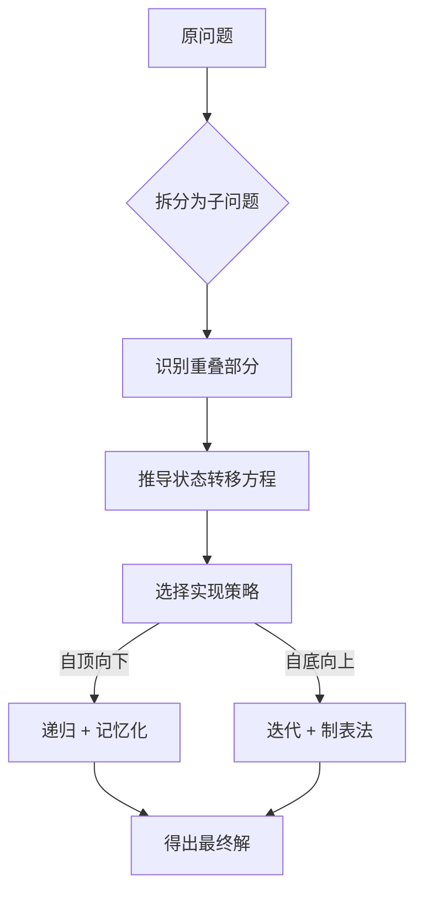

# 动态规划 (Dynamic Programming)

## 为什么动态规划很重要

动态规划（DP）通过将复杂问题分解为**重叠子问题**并存储其解，从而避免重复计算，是求解最优性问题的核心利器：

- **最优化问题**：寻找最大值/最小值。
- **计数问题**：计算方案数/排列数。
- **字符串匹配**：编辑距离、最长公共子序列（LCS）。
- **资源分配**：背包问题、区间拆分。

**实际影响**：
- 计算斐波那契数列第 50 项：
  - 暴力递归：约 $2^{50} \approx 10^{15}$ 次操作（需耗时数天）。
  - DP 记忆化：仅需 50 次操作（瞬间完成）。
  - **效率提升 10 万亿倍**。
- 生物信息学中的 DNA 序列比对本质上就是 DP 的应用。

---

## 核心概念

### DP 解题五部曲

1. **定义子问题**：什么样的小规模问题可以构建出原问题的解？
2. **状态定义**：用哪些参数来唯一标识一个子问题？（如 `dp[i]` 或 `dp[i][j]`）
3. **状态转移方程**：如何利用已知的子问题解组合出当前问题的解？
4. **确定边界条件**：最小的、可直接求解的子问题是什么？
5. **确定计算顺序**：是自底向上（迭代）还是自顶向下（递归+记忆化）？

### 自顶向下 vs 自底向上

| 维度 | 自顶向下 (Memoization) | 自底向上 (Tabulation) |
|--------|------------------------|----------------------|
| **实现方式** | 递归 + 缓存 | 迭代 + 填表 |
| **空间开销** | O(递归深度) 的栈空间 | O(表格大小) 的内存 |
| **运行速度** | 包含递归调用的函数开销 | 通常更快（纯循环） |
| **思考习惯** | 符合自然逻辑（从大到小） | 需理清依赖顺序（从小到大） |

---

## 深入理解

### 1D DP：基础入门
**打家劫舍 (House Robber)**：
- **状态**：`dp[i]` 表示偷到第 $i$ 间房能拿到的最大金额。
- **决策**：偷第 $i$ 间（则不能偷 $i-1$），或不偷第 $i$ 间。
- **转移**：`dp[i] = max(dp[i-1], dp[i-2] + nums[i])`。

### 2D DP：矩阵与双序列
**最长公共子序列 (LCS)**：
- **逻辑**：若当前字符匹配，则 $LCS = 1 +$ 去掉该字符后的子序列解；否则，取“去掉字符串 A 末尾”和“去掉字符串 B 末尾”两种情况的最大值。

### 进阶：状态机 DP
针对如“带冷冻期的股票交易”等复杂约束，通过定义多个状态（持股、持币、冷冻期）在不同天数间的转移来求解，能将极复杂的逻辑转化为清晰的数学推导。

---

## 实战应用

### 编辑距离 (Edit Distance)
计算将单词 A 转换为单词 B 所需的最少操作（插入、删除、替换）次数。
- **应用场景**：拼写纠错、基因比对、论文查重。

### 0/1 背包问题
在限定载重下，选择价值最高的物品组合。
- **空间优化**：通过倒序遍历，可以将 2D 的 `dp[i][j]` 优化为 1D 的 `dp[j]`，极大节省内存。

---

## 面试高频题

### Q1: 爬楼梯 (简单)
**思路**：典型的斐波那契变形。`dp[i] = dp[i-1] + dp[i-2]`。

### Q2: 零钱兑换 (中等)
**思路**：1D DP，外层遍历金额，内层尝试每种硬币。注意初始化为“无穷大”并在最后判断是否有解。

### Q3: 最长递增子序列 (LIS) (中等)
**思路**：
- 基础版：O(n²) 的 DP。
- 进阶版：利用二分查找优化到 O(n log n)，这是大厂面试的加分点。

### Q4: 分割等和子集 (中等)
**思路**：转化成背包问题。判断是否存在子集能填满 `sum/2` 的背包。

---

## 延伸阅读

- **递归基础**：理解 DP 之前的必修课。
- **贪心算法**：了解何时可以用更简单的贪心代替复杂的 DP。
- **空间优化 (Rolling Array)**：如何在 DP 中实现 O(1) 空间复杂度。
- **LeetCode**：[动态规划标签题目](https://leetcode.com/tag/dynamic-programming/)
