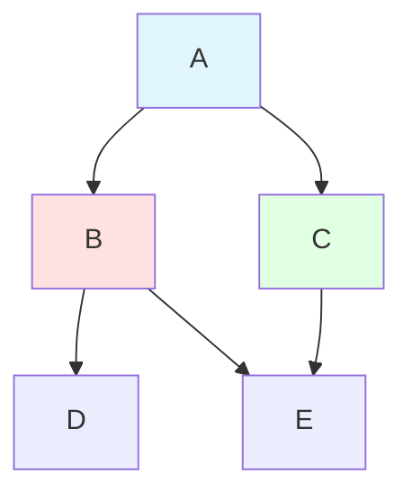
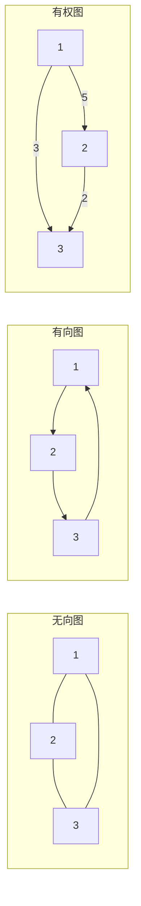
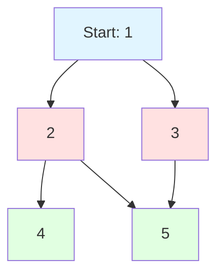

# 图

## 为什么图很重要

图用于建模实体之间的关系——无数现实世界系统的基础：

- **社交网络**：朋友、关注者、连接（Facebook、Twitter、LinkedIn）
- **地图与导航**：道路、交叉口、路线（Google Maps）
- **网络拓扑**：计算机网络、服务器连接
- **依赖图**：包管理器、构建系统、任务调度
- **知识图谱**：Wikipedia 链接、概念关系

**实际影响**：Google 的 PageRank 算法使用图遍历来对网页排序。 Dijkstra 算法为 GPS 导航系统在数百万节点中毫秒级找到最优路线。

## 核心概念

### 图的结构

Graph = (V, E) 其中 V = 顶点（节点), E = 边



**关键术语**：
- **顶点（Vertex/Node）**：基本单元
- **边（Edge）**：两个顶点之间的连接
- **度（Degree）**：与顶点相关联的边数
- **路径（Path）**：相连顶点的序列
- **环（Cycle）**：起点和终点相同的路径
- **连通（Connected）**：每个顶点都可以从其他任何顶点到达

### 图的类型

| 类型 | 边 | 方向 | 示例 |
|------|-----|------|------|
| **无向图** | 无箭头 | 双向 | 社交网络好友关系 |
| **有向图** | 有箭头 | 单向 | Twitter 关注 |
| **有权图** | 有权重/代价 | 任一 | 道路网络（距离） |
| **无权图** | 无权重 | 任一 | 网页链接 |



### 图的表示

#### 邻接矩阵

```java
int[][] graph = new int[V][V];  // V = 顶点数
graph[u][v] = weight;  // 从 u 到 v 的边，权重为 weight
```

| 优点 | 缺点 |
|------|------|
| O(1) 边查找 | O(V²) 空间 |
| 实现简单 | 稀疏图浪费空间 |
| 适合稠密图 | 遍历邻居慢 |

#### 邻接表

```java
List<List<int[]>> graph = new ArrayList<>();
for (int i = 0; i < V; i++) {
    graph.add(new ArrayList<>());
}
graph.get(u).add(new int[]{v, weight});  // 边 u→v
```

| 优点 | 缺点 |
|------|------|
| O(V + E) 空间 | O(度) 邻居查找 |
| 高效迭代 | 稍复杂 |
| 适合稀疏图 | |

**建议**：大多数情况使用邻接表（大多数现实图是稀疏的）。

## 深入理解

### 图遍历

#### 广度优先搜索（BFS）

逐层探索，使用队列：

```java
public void bfs(int start, int V, List<List<Integer>> graph) {
    boolean[] visited = new boolean[V];
    Queue<Integer> queue = new LinkedList<>();

    visited[start] = true;
    queue.offer(start);

    while (!queue.isEmpty()) {
        int node = queue.poll();
        System.out.print(node + " ");

        for (int neighbor : graph.get(node)) {
            if (!visited[neighbor]) {
                visited[neighbor] = true;
                queue.offer(neighbor);
            }
        }
    }
}
```



**BFS 顺序**：1, 2, 3, 4, 5（逐层）

**使用场景**：
- 无权图最短路径
- 层序遍历
- 连通分量

**复杂度**：O(V + E) 时间， O(V) 空间

#### 深度优先搜索（DFS）

尽可能深入探索，使用栈/递归：

```java
// 递归 DFS
public void dfs(int node, boolean[] visited, List<List<Integer>> graph) {
    visited[node] = true;
    System.out.print(node + " ");

    for (int neighbor : graph.get(node)) {
        if (!visited[neighbor]) {
            dfs(neighbor, visited, graph);
        }
    }
}

// 迭代 DFS
public void dfsIterative(int start, int V, List<List<Integer>> graph) {
    boolean[] visited = new boolean[V];
    Deque<Integer> stack = new ArrayDeque<>();

    stack.push(start);

    while (!stack.isEmpty()) {
        int node = stack.pop();

        if (!visited[node]) {
            visited[node] = true;
            System.out.print(node + " ");

            // 反序压入邻居
            for (int i = graph.get(node).size() - 1; i >= 0; i--) {
                int neighbor = graph.get(node).get(i);
                if (!visited[neighbor]) {
                    stack.push(neighbor);
                }
            }
        }
    }
}
```

**DFS 顺序**：1, 2, 4, 5, 3（深度优先）

**使用场景**：
- 检测环
- 拓扑排序
- 路径查找
- 连通分量

**复杂度**：O(V + E) 时间, O(V) 空间

### BFS vs DFS

| 方面 | BFS | DFS |
|------|-----|-----|
| **数据结构** | 队列 | 栈 / 递归 |
| **内存** | 宽图 O(V) | 深图 O(h) |
| **最短路径** | 是（无权图） | 否 |
| **探索方式** | 逐层 | 逐分支 |
| **实现** | 迭代（自然） | 递归（自然） |

### 环检测

#### 无向图

```java
public boolean hasCycleUndirected(int V, List<List<Integer>> graph) {
    boolean[] visited = new boolean[V];

    for (int i = 0; i < V; i++) {
        if (!visited[i]) {
            if (dfsCycleUndirected(i, -1, visited, graph)) {
                return true;
            }
        }
    }

    return false;
}

private boolean dfsCycleUndirected(int node, int parent,
                                    boolean[] visited, List<List<Integer>> graph) {
    visited[node] = true;

    for (int neighbor : graph.get(node)) {
        if (!visited[neighbor]) {
            if (dfsCycleUndirected(neighbor, node, visited, graph)) {
                return true;
            }
        } else if (neighbor != parent) {
            return true;  // 访问了非父节点的节点 = 有环
        }
    }

    return false;
}
```

#### 有向图

```java
public boolean hasCycleDirected(int V, List<List<Integer>> graph) {
    int[] state = new int[V];  // 0=未访问, 1=访问中, 2=已完成

    for (int i = 0; i < V; i++) {
        if (state[i] == 0) {
            if (dfsCycleDirected(i, state, graph)) {
                return true;
            }
        }
    }

    return false;
}

private boolean dfsCycleDirected(int node, int[] state,
                                 List<List<Integer>> graph) {
    state[node] = 1;  // 标记为访问中

    for (int neighbor : graph.get(node)) {
        if (state[neighbor] == 1) {
            return true;  // 回边 = 有环
        }
        if (state[neighbor] == 0 && dfsCycleDirected(neighbor, state, graph)) {
            return true;
        }
    }

    state[node] = 2;  // 标记为已完成
    return false;
}
```

### 拓扑排序

仅适用于**有向无环图（DAG）**：

```java
public List<Integer> topologicalSort(int V, List<List<Integer>> graph) {
    List<Integer> order = new ArrayList<>();
    boolean[] visited = new boolean[V];

    for (int i = 0; i < V; i++) {
        if (!visited[i]) {
            dfsTopo(i, visited, graph, order);
        }
    }

    Collections.reverse(order);  // 反转后序
    return order;
}

private void dfsTopo(int node, boolean[] visited,
                    List<List<Integer>> graph, List<Integer> order) {
    visited[node] = true;

    for (int neighbor : graph.get(node)) {
        if (!visited[neighbor]) {
            dfsTopo(neighbor, visited, graph, order);
        }
    }

    order.add(node);  // 完成后添加
}
```

**使用场景**：
- 构建系统（Maven、Gradle）
- 课程先修关系
- 任务调度
- 编译器

### Dijkstra 算法（最短路径）

带权图最短路径算法：

```java
public int[] dijkstra(int V, List<List<int[]>> graph, int source) {
    int[] dist = new int[V];
    Arrays.fill(dist, Integer.MAX_VALUE);
    dist[source] = 0;

    PriorityQueue<int[]> minHeap =
        new PriorityQueue<>((a, b) -> a[1] - b[1]);
    minHeap.offer(new int[]{source, 0});

    while (!minHeap.isEmpty()) {
        int[] current = minHeap.poll();
        int node = current[0], d = current[1];

        if (d > dist[node]) continue;  // 已找到更短路径

        for (int[] edge : graph.get(node)) {
            int neighbor = edge[0], weight = edge[1];
            int newDist = dist[node] + weight;

            if (newDist < dist[neighbor]) {
                dist[neighbor] = newDist;
                minHeap.offer(new int[]{neighbor, newDist});
            }
        }
    }

    return dist;
}
```

**关键点**：
- 贪心：总是扩展最近的未访问节点
- 需要优先队列（最小堆）
- 不处理负权边（用 Bellman-Ford 代替）

**复杂度**：O((V + E) log V) 使用优先队列

## 面试题

### Q1：岛屿数量（中等）

**题目**：统计二维网格中的岛屿数量。

**方法**：DFS/BFS 淹没连通区域

**复杂度**：O(m × n) 时间， O(m × n) 空间

```java
public int numIslands(char[][] grid) {
    int count = 0;
    int m = grid.length, n = grid[0].length;

    for (int i = 0; i < m; i++) {
        for (int j = 0; j < n; j++) {
            if (grid[i][j] == '1') {
                count++;
                dfs(grid, i, j, m, n);
            }
        }
    }

    return count;
}

private void dfs(char[][] grid, int i, int j, int m, int n) {
    if (i < 0 || i >= m || j < 0 || j >= n || grid[i][j] != '1') return;

    grid[i][j] = '0';  // 标记为已访问

    dfs(grid, i + 1, j, m, n);
    dfs(grid, i - 1, j, m, n);
    dfs(grid, i, j + 1, m, n);
    dfs(grid, i, j - 1, m, n);
}
```

### Q2：克隆图（中等）

**题目**：深拷贝无向图。

**方法**：BFS/DFS + HashMap 映射原节点到新节点

**复杂度**：O(V + E) 时间, O(V) 空间

```java
public Node cloneGraph(Node node) {
    if (node == null) return null;

    Map<Node, Node> visited = new HashMap<>();
    return dfsClone(node, visited);
}

private Node dfsClone(Node node, Map<Node, Node> visited) {
    if (visited.containsKey(node)) {
        return visited.get(node);
    }

    Node copy = new Node(node.val);
    visited.put(node, copy);

    for (Node neighbor : node.neighbors) {
        copy.neighbors.add(dfsClone(neighbor, visited));
    }

    return copy;
}
```

### Q3：课程表（中等）

**题目**：完成所有课程的最少学期数（拓扑排序）。

**方法**：拓扑排序 + 最长路径

**复杂度**：O(V + E) 时间, O(V) 空间

```java
public boolean canFinish(int numCourses, int[][] prerequisites) {
    List<List<Integer>> graph = new ArrayList<>();
    int[] inDegree = new int[numCourses];

    for (int i = 0; i < numCourses; i++) {
        graph.add(new ArrayList<>());
    }

    for (int[] pre : prerequisites) {
        graph.get(pre[1]).add(pre[0]);
        inDegree[pre[0]]++;
    }

    Queue<Integer> queue = new LinkedList<>();
    for (int i = 0; i < numCourses; i++) {
        if (inDegree[i] == 0) {
            queue.offer(i);
        }
    }

    int count = 0;
    while (!queue.isEmpty()) {
        int course = queue.poll();
        count++;

        for (int next : graph.get(course)) {
            if (--inDegree[next] == 0) {
                queue.offer(next);
            }
        }
    }

    return count == numCourses;
}
```

### Q4：腐烂的橘子（中等）

**题目**：找到所有橘子腐烂的最少分钟数。

**方法**：多源 BFS

**复杂度**：O(m × n) 时间, O(m × n) 空间

```java
public int orangesRotting(int[][] grid) {
    int m = grid.length, n = grid[0].length;
    Queue<int[]> queue = new LinkedList<>();
    int fresh = 0;

    for (int i = 0; i < m; i++) {
        for (int j = 0; j < n; j++) {
            if (grid[i][j] == 2) {
                queue.offer(new int[]{i, j, 0});  // [行, 列, 时间]
            } else if (grid[i][j] == 1) {
                fresh++;
            }
        }
    }

    int maxTime = 0;
    int[][] dirs = {{0, 1}, {0, -1}, {1, 0}, {-1, 0}};

    while (!queue.isEmpty()) {
        int[] current = queue.poll();
        int row = current[0], col = current[1], time = current[2];

        for (int[] dir : dirs) {
            int r = row + dir[0], c = col + dir[1];

            if (r >= 0 && r < m && c >= 0 && c < n && grid[r][c] == 1) {
                grid[r][c] = 2;
                fresh--;
                maxTime = Math.max(maxTime, time + 1);
                queue.offer(new int[]{r, c, time + 1});
            }
        }
    }

    return fresh == 0 ? maxTime : -1;
}
```

### Q5：网络延迟时间（中等）

**题目**：找到信号到达所有节点的最短时间（Dijkstra）。

**方法**：Dijkstra 算法

**复杂度**：O((V + E) log V) 时间, O(V) 空间

```java
public int networkDelayTime(int[][] times, int n, int k) {
    List<List<int[]>> graph = new ArrayList<>();
    for (int i = 0; i <= n; i++) {
        graph.add(new ArrayList<>());
    }

    for (int[] edge : times) {
        graph.get(edge[0]).add(new int[]{edge[1], edge[2]});
    }

    int[] dist = new int[n + 1];
    Arrays.fill(dist, Integer.MAX_VALUE);
    dist[k] = 0;

    PriorityQueue<int[]> minHeap =
        new PriorityQueue<>((a, b) -> a[1] - b[1]);
    minHeap.offer(new int[]{k, 0});

    while (!minHeap.isEmpty()) {
        int[] current = minHeap.poll();
        int node = current[0], time = current[1];

        if (time > dist[node]) continue;

        for (int[] edge : graph.get(node)) {
            int neighbor = edge[0], weight = edge[1];
            int newTime = dist[node] + weight;

            if (newTime < dist[neighbor]) {
                dist[neighbor] = newTime;
                minHeap.offer(new int[]{neighbor, newTime});
            }
        }
    }

    int maxTime = 0;
    for (int i = 1; i <= n; i++) {
        maxTime = Math.max(maxTime, dist[i]);
        if (dist[i] == Integer.MAX_VALUE) return -1;
    }

    return maxTime;
}
```

### Q6：K 站中转最便宜的价格（中等）

**题目**：找到最多 K 次中转的最便宜路线。

**方法**：修改的 Dijkstra，带中转次数约束

**复杂度**：O(E × k) 时间, O(V) 空间

```java
public int findCheapestPrice(int n, int[][] flights, int src, int dst, int k) {
    List<List<int[]>> graph = new ArrayList<>();
    for (int i = 0; i < n; i++) {
        graph.add(new ArrayList<>());
    }

    for (int[] flight : flights) {
        graph.get(flight[0]).add(new int[]{flight[1], flight[2]});
    }

    PriorityQueue<int[]> minHeap =
        new PriorityQueue<>((a, b) -> a[1] - b[1]);  // [节点, 代价, 中转次数]
    minHeap.offer(new int[]{src, 0, -1});

    while (!minHeap.isEmpty()) {
        int[] current = minHeap.poll();
        int node = current[0], cost = current[1], stops = current[1];

        if (node == dst) return cost;

        if (stops < k) {
            for (int[] flight : graph.get(node)) {
                int neighbor = flight[0], price = flight[1];
                minHeap.offer(new int[]{neighbor, cost + price, stops + 1});
            }
        }
    }

    return -1;
}
```

### Q7：单词接龙（困难）

**题目**：找到从 beginWord 到 endWord 的最短转换序列长度。

**方法**：BFS，每次变换一个字母

**复杂度**：O(M² × N) 时间, O(M × N) 空间（M = 单词长度, N = 字典大小）

```java
public int ladderLength(String beginWord, String endWord, List<String> wordList) {
    Set<String> wordSet = new HashSet<>(wordList);
    if (!wordSet.contains(endWord)) return 0;

    Queue<String> queue = new LinkedList<>();
    queue.offer(beginWord);
    int level = 1;

    while (!queue.isEmpty()) {
        int size = queue.size();
        for (int i = 0; i < size; i++) {
            String word = queue.poll();
            char[] chars = word.toCharArray();

            for (int j = 0; j < chars.length; j++) {
                char original = chars[j];
                for (char c = 'a'; c <= 'z'; c++) {
                    chars[j] = c;
                    String newWord = new String(chars);

                    if (newWord.equals(endWord)) return level + 1;

                    if (wordSet.contains(newWord)) {
                        wordSet.remove(newWord);
                        queue.offer(newWord);
                    }
                }
                chars[j] = original;
            }
        }
        level++;
    }

    return 0;
}
```

## 延伸阅读

- **树**：图的特殊情况
- **DFS**：用于拓扑排序、环检测
- **BFS**：无权图最短路径
- **Dijkstra**：使用优先队列的带权最短路径
- **LeetCode**：[图题目](https://leetcode.com/tag/graph/)
