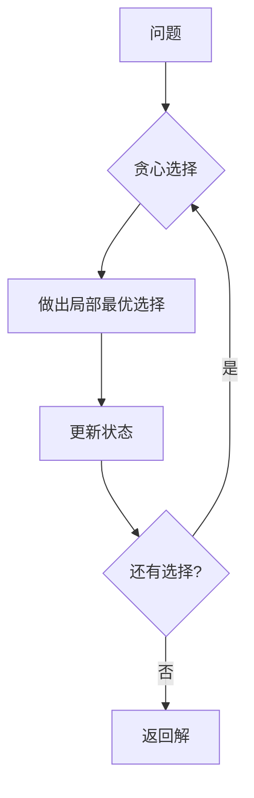

# 贪心算法

## 为什么贪心算法很重要

贪心算法在每一步做出局部最优选择——通常能得到全局最优解：

- **区间调度**：最大化不重叠任务数量
- **Huffman 编码**：最优数据压缩
- **最短路径**：Dijkstra 算法
- **最小生成树**：Prim 和 Kruskal 算法

**实际影响**：
- 活动选择：贪心选择最早结束时间 → O(n log n) vs O(2ⁿ) 暴力搜索
- Huffman 编码：文本文件压缩 20-50%
- 找零钱：对美国硬币面额最优（贪心有效），对某些硬币系统会失败

**贪心何时有效**：
1. **贪心选择性质**：局部最优导致全局最优
2. **最优子结构**：最优解包含子问题的最优解

## 核心概念

### 贪心策略

在每一步，做出当前看起来最好的选择：



### 经典贪心问题

| 问题 | 贪心策略 | 时间复杂度 |
|------|---------|-----------|
| **活动选择** | 最早结束时间 | O(n log n) |
| **分数背包** | 最高价值/重量比 | O(n log n) |
| **Huffman 编码** | 合并最小频率 | O(n log n) |
| **最小生成树** | 最轻的边 | O(E log V) |

### 贪心 vs 动态规划

| 方面 | 贪心 | 动态规划 |
|------|------|---------|
| **决策方式** | 局部最优 | 探索所有选项 |
| **速度** | 更快（通常 O(n log n)）| 更慢（多项式） |
| **最优性** | 不总是保证 | 总是保证 |
| **回溯** | 无 | 有 |

## 深入理解

### 活动选择

选择最多数量的不重叠活动：

```java
public int activitySelection(int[] start, int[] end) {
    int n = start.length;
    int[][] activities = new int[n][2];

    for (int i = 0; i < n; i++) {
        activities[i] = new int[]{start[i], end[i]};
    }

    // 按结束时间排序
    Arrays.sort(activities, (a, b) -> a[1] - b[1]);

    int count = 1;
    int lastEnd = activities[0][1];

    for (int i = 1; i < n; i++) {
        if (activities[i][0] >= lastEnd) {
            count++;
            lastEnd = activities[i][1];
        }
    }

    return count;
}
```

**为什么有效**：选择最早结束时间为剩余活动留出最大空间

### 分数背包

```java
class Item {
    int value, weight;

    double getValuePerWeight() {
        return (double) value / weight;
    }
}

public double fractionalKnapsack(Item[] items, int capacity) {
    // 按价值/重量比降序排序
    Arrays.sort(items, (a, b) ->
        Double.compare(b.getValuePerWeight(), a.getValuePerWeight()));

    double totalValue = 0;

    for (Item item : items) {
        if (capacity >= item.weight) {
            // 取整个物品
            totalValue += item.value;
            capacity -= item.weight;
        } else {
            // 取物品的一部分
            totalValue += item.getValuePerWeight() * capacity;
            break;
        }
    }

    return totalValue;
}
```

**贪心选择**：取价值/重量比最高的物品

### Huffman 编码

构建最优前缀编码用于压缩：

```java
class HuffmanNode implements Comparable<HuffmanNode> {
    char character;
    int frequency;
    HuffmanNode left, right;

    boolean isLeaf() { return left == null && right == null; }

    @Override
    public int compareTo(HuffmanNode other) {
        return this.frequency - other.frequency;
    }
}
```

## 实际应用

### 最小找零数

```java
public int minCoins(int[] coins, int amount) {
    Arrays.sort(coins);
    int count = 0;

    for (int i = coins.length - 1; i >= 0; i--) {
        if (coins[i] <= amount) {
            int num = amount / coins[i];
            count += num;
            amount -= num * coins[i];
        }
        if (amount == 0) break;
    }

    return amount == 0 ? count : -1;
}
```

**注意**：贪心并不适用于所有硬币系统（如 coins = [1, 3, 4], amount = 6）

### 跳跃游戏

```java
public boolean canJump(int[] nums) {
    int maxReach = 0;

    for (int i = 0; i < nums.length; i++) {
        if (i > maxReach) return false;
        maxReach = Math.max(maxReach, i + nums[i]);
    }

    return true;
}
```

## 面试题

### Q1：分发饼干（简单）

**问题**：用饼干最大化满足孩子数量。

**方法**：贪心匹配满足每个孩子的最小饼干

**复杂度**：O(n log n + m log m) 时间

```java
public int findContentChildren(int[] greed, int[] size) {
    Arrays.sort(greed);
    Arrays.sort(size);

    int child = 0, cookie = 0;

    while (child < greed.length && cookie < size.length) {
        if (size[cookie] >= greed[child]) {
            child++;
        }
        cookie++;
    }

    return child;
}
```

### Q2：加油站（中等）

**问题**：找到能完成环路的起始加油站。

**方法**：贪心加总油量检查

**复杂度**：O(n) 时间

```java
public int canCompleteCircuit(int[] gas, int[] cost) {
    int totalGas = 0, totalCost = 0;
    int currentGas = 0, start = 0;

    for (int i = 0; i < gas.length; i++) {
        totalGas += gas[i];
        totalCost += cost[i];

        currentGas += gas[i] - cost[i];

        if (currentGas < 0) {
            start = i + 1;
            currentGas = 0;
        }
    }

    return totalGas >= totalCost ? start : -1;
}
```

## 延伸阅读

- **动态规划**：用于贪心失效的问题
- **堆**：贪心算法中使用（Huffman）
- **贪心**：区间调度、MST
- **LeetCode**：[贪心问题](https://leetcode.com/tag/greedy/)
