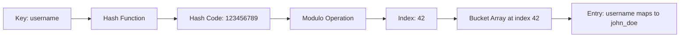
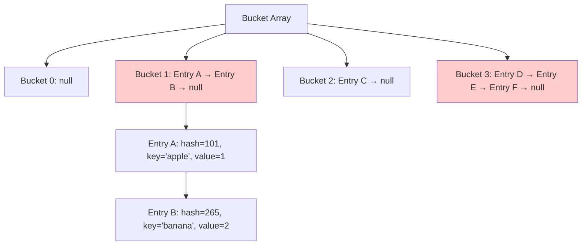
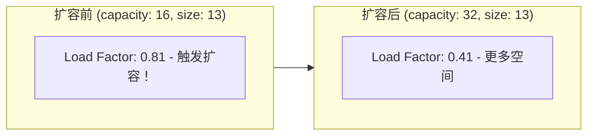
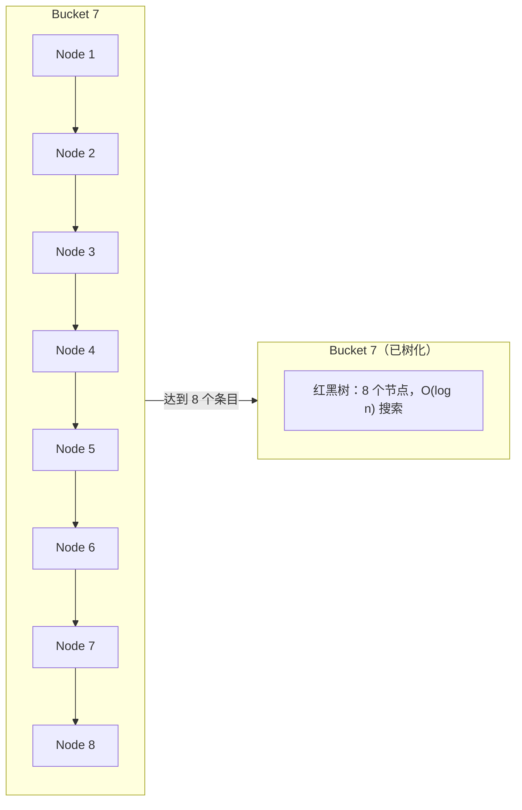

# HashMaps & HashSets

## 为什么 HashMap 很重要

HashMap 提供平均 O(1) 的查找——是后端系统中最广泛使用的数据结构：

- **缓存**：Redis、Memcached 使用哈希表进行键值存储
- **会话管理**：用户会话按会话 ID 存储
- **数据库索引**：精确匹配查询的哈希索引
- **计数/频率统计**：词频统计、分析、去重

**实际影响**：拥有 100 万条目的 HashMap 执行查找只需 O(1) ~50ns，而线性搜索 100 万个数组元素需要 ~5ms——**慢 100,000 倍**。

## 核心概念

### 哈希函数

将键转换为数组索引：

```java
int index = Math.abs(key.hashCode()) % array.length;
```

**好的哈希函数特性**：
- **确定性**：相同键始终产生相同哈希值
- **均匀分布**：将键均匀分散到各桶中
- **快速计算**：O(1) 计算



### Java 的 hashCode() 契约

```java
// String.hashCode() 实现
public int hashCode() {
    int h = hash;
    if (h == 0 && value.length > 0) {
        char val[] = value;
        for (int i = 0; i < value.length; i++) {
            h = 31 * h + val[i];  // 31 是质数（分布好）
        }
        hash = h;
    }
    return h;
}
```

**契约**：
1. 如果 `equals()` 返回 true，`hashCode()` 必须返回相同值
2. 如果 `equals()` 返回 false，`hashCode()` *应该*返回不同值
3. 多次调用必须返回相同整数（一致性）

```java
// ❌ 错误：违反 hashCode 契约
class BadKey {
    private String id;

    @Override
    public boolean equals(Object obj) {
        if (!(obj instanceof BadKey)) return false;
        return id.equals(((BadKey) obj).id);
    }

    // 缺少 hashCode() 重写！
}

// ✅ 正确：正确实现
class GoodKey {
    private String id;

    @Override
    public boolean equals(Object obj) {
        if (!(obj instanceof GoodKey)) return false;
        return id.equals(((GoodKey) obj).id);
    }

    @Override
    public int hashCode() {
        return Objects.hash(id);  // 或直接 id.hashCode()
    }
}
```

### 冲突解决

#### 链地址法（Java 的方式）

每个桶持有条目的链表：

```java
// HashMap 内部结构（简化）
static class Node<K,V> {
    final int hash;
    final K key;
    V value;
    Node<K,V> next;  // 用于链地址的链表
}

transient Node<K,V>[] table;  // 桶数组
```



**查找过程**：
1. 计算哈希：`hash(key)`
2. 找到桶：`index = hash % table.length`
3. 遍历链表：使用 `equals()` 比较键
4. 返回值或 null

#### 开放地址法

所有条目存储在数组本身中（无链表）：

- **线性探测**：检查 `index`、`index+1`、`index+2`...
- **二次探测**：检查 `index`、`index+1²`、`index+2²`...
- **双重哈希**：第二个哈希函数确定步长

**优点**：更好的缓存局部性，无指针开销
**缺点**：聚集问题、删除复杂、表必须 < 70% 满

### 负载因子与扩容

```java
// HashMap 默认值
static final int DEFAULT_INITIAL_CAPACITY = 16;
static final float DEFAULT_LOAD_FACTOR = 0.75f;
```

**负载因子** = `size / capacity`

当 `size > capacity * loadFactor`：
1. 创建大小为 2 倍的新数组
2. 重新哈希所有条目（计算新索引）
3. 替换旧数组



**为什么是 0.75？**
- 更高 → 更多冲突，查找更慢
- 更低 → 浪费内存，更频繁扩容
- 0.75 是经验最优值

### HashMap vs TreeMap vs LinkedHashMap

| 特性 | HashMap | TreeMap | LinkedHashMap |
|------|---------|---------|---------------|
| **排序** | 无 | 按键排序 | 插入顺序 |
| **查找** | O(1) 平均 | O(log n) | O(1) 平均 |
| **插入/删除** | O(1) 平均 | O(log n) | O(1) 平均 |
| **Null 键** | 允许一个 | 不允许 | 允许一个 |
| **实现** | 哈希表 | 红黑树 | 哈希表 + 链表 |
| **使用场景** | 通用 | 有序范围查询 | 保持顺序 |

```java
// HashMap：无序
Map<String, Integer> hashMap = new HashMap<>();
hashMap.put("banana", 2);
hashMap.put("apple", 1);
hashMap.put("cherry", 3);
System.out.println(hashMap);  // {banana=2, apple=1, cherry=3}（随机）

// TreeMap：按键排序
Map<String, Integer> treeMap = new TreeMap<>();
treeMap.put("banana", 2);
treeMap.put("apple", 1);
treeMap.put("cherry", 3);
System.out.println(treeMap);  // {apple=1, banana=2, cherry=3}（有序）

// LinkedHashMap：插入顺序
Map<String, Integer> linkedMap = new LinkedHashMap<>();
linkedMap.put("banana", 2);
linkedMap.put("apple", 1);
linkedMap.put("cherry", 3);
System.out.println(linkedMap);  // {banana=2, apple=1, cherry=3}
```

## 深入理解

### HashMap 内部实现

#### 计算索引

```java
// 简化的 HashMap.get()
public V get(Object key) {
    Node<K,V>[] tab; Node<K,V> first, e; int n, hash; K k;

    // 步骤 1：计算哈希
    hash = (key == null) ? 0 : (h = key.hashCode()) ^ (h >>> 16);

    // 步骤 2：找到桶
    tab = table;
    n = tab.length;
    index = (n - 1) & hash;  // 等同于 hash % n（当 n 是 2 的幂时）

    // 步骤 3：检查第一个节点
    first = tab[index];
    if (first != null) {
        if (first.hash == hash &&
            ((k = first.key) == key || (key != null && key.equals(k)))) {
            return first.value;
        }

        // 步骤 4：遍历链表
        e = first.next;
        while (e != null) {
            if (e.hash == hash &&
                ((k = e.key) == key || (key != null && key.equals(k)))) {
                return e.value;
            }
            e = e.next;
        }
    }

    return null;  // 未找到
}
```

**为什么与右移 16 位做异或？**
- 将高位比特扩散到低位
- 当表大小是 2 的幂时改善分布

#### 树化阈值（Java 8+）

当桶链表超过 8 个条目时，转换为 TreeMap：

```java
static final int TREEIFY_THRESHOLD = 8;
static final int UNTREEIFY_THRESHOLD = 6;
```

**为什么？**
- 链表：最坏 O(n)
- 红黑树：最坏 O(log n)
- 权衡：树有更多开销，只在长链时值得



### 常见陷阱

#### ❌ 可变键

```java
List<Integer> key = new ArrayList<>(Arrays.asList(1, 2, 3));
Map<List<Integer>, String> map = new HashMap<>();
map.put(key, "value");

key.add(4);  // 修改了键！

String result = map.get(key);  // 返回 null！
// hashCode() 改变了，所以在错误的桶中查找
```

#### ✅ 使用不可变键

```java
// String 是不可变的（安全键）
Map<String, Integer> map = new HashMap<>();
map.put("key", 1);

// 或创建自定义不可变键
class ImmutableKey {
    private final int id;
    private final String name;

    public ImmutableKey(int id, String name) {
        this.id = id;
        this.name = name;
    }

    @Override
    public boolean equals(Object o) {
        if (this == o) return true;
        if (!(o instanceof ImmutableKey)) return false;
        ImmutableKey that = (ImmutableKey) o;
        return id == that.id && Objects.equals(name, that.name);
    }

    @Override
    public int hashCode() {
        return Objects.hash(id, name);
    }
}
```

#### ❌ 迭代时修改

```java
Map<String, Integer> map = new HashMap<>();
for (int i = 0; i < 1000; i++) {
    map.put("key" + i, i);
}

for (String key : map.keySet()) {
    if (map.size() > 500) {
        map.put("newKey", 999);  // ConcurrentModificationException
    }
}
```

#### ✅ 使用 ConcurrentHashMap 或 Iterator.remove

```java
// 方案 1：ConcurrentHashMap
Map<String, Integer> map = new ConcurrentHashMap<>();

// 方案 2：Iterator.remove()
Iterator<Map.Entry<String, Integer>> it = map.entrySet().iterator();
while (it.hasNext()) {
    Map.Entry<String, Integer> entry = it.next();
    if (entry.getValue() > 500) {
        it.remove();  // 安全
    }
}
```

#### ❌ 有 hashCode() 无 equals()

```java
class BrokenKey {
    private int id;

    @Override
    public int hashCode() {
        return id;  // 定义了 hashCode
    }

    // 缺少 equals() - 使用 Object.equals()（引用相等）
}
```

#### ✅ 始终同时重写两者

```java
class ProperKey {
    private int id;

    @Override
    public boolean equals(Object o) {
        if (this == o) return true;
        if (!(o instanceof ProperKey)) return false;
        return id == ((ProperKey) o).id;
    }

    @Override
    public int hashCode() {
        return Objects.hash(id);
    }
}
```

### HashSet 实现

HashSet **就是**一个使用虚拟值的 HashMap：

```java
public class HashSet<E> {
    private transient HashMap<E, Object> map;
    private static final Object PRESENT = new Object();

    public HashSet() {
        map = new HashMap<>();
    }

    public boolean add(E e) {
        return map.put(e, PRESENT) == null;  // PRESENT 是虚拟值
    }

    public boolean contains(Object o) {
        return map.containsKey(o);
    }
}
```

**含义**：HashSet 操作与 HashMap 有相同的复杂度！

## 实际应用

### 频率计数器

```java
public class FrequencyCounter {
    public Map<String, Integer> countFrequencies(String[] words) {
        Map<String, Integer> freq = new HashMap<>();

        for (String word : words) {
            freq.merge(word, 1, Integer::sum);  // Java 8+
            // 或：freq.put(word, freq.getOrDefault(word, 0) + 1);
        }

        return freq;
    }

    public String mostCommon(String[] words) {
        Map<String, Integer> freq = countFrequencies(words);

        return freq.entrySet().stream()
            .max(Map.Entry.comparingByValue())
            .map(Map.Entry::getKey)
            .orElse(null);
    }
}
```

### 分组操作

```java
public class GroupBy {
    public Map<String, List<Person>> groupByCity(List<Person> people) {
        Map<String, List<Person>> byCity = new HashMap<>();

        for (Person person : people) {
            byCity.computeIfAbsent(person.getCity(), k -> new ArrayList<>())
                  .add(person);
        }

        return byCity;
    }

    // 泛型版本
    public <K, V> Map<K, List<V>> groupBy(List<V> items,
                                          Function<V, K> classifier) {
        Map<K, List<V>> groups = new HashMap<>();

        for (V item : items) {
            K key = classifier.apply(item);
            groups.computeIfAbsent(key, k -> new ArrayList<>()).add(item);
        }

        return groups;
    }
}
```

### 记忆化

```java
public class Fibonacci {
    private Map<Integer, Long> memo = new HashMap<>();

    public long fib(int n) {
        if (n <= 1) return n;

        // 检查缓存
        if (memo.containsKey(n)) {
            return memo.get(n);
        }

        // 计算并缓存
        long result = fib(n - 1) + fib(n - 2);
        memo.put(n, result);

        return result;
    }
}
```

**记忆化前**：`fib(50)` 需要约 60 秒
**记忆化后**：`fib(50)` 需要约 0.0001 秒

### 使用 HashMap 的两数之和

```java
public int[] twoSum(int[] nums, int target) {
    Map<Integer, Integer> numToIndex = new HashMap<>();

    for (int i = 0; i < nums.length; i++) {
        int complement = target - nums[i];

        if (numToIndex.containsKey(complement)) {
            return new int[]{numToIndex.get(complement), i};
        }

        numToIndex.put(nums[i], i);
    }

    throw new IllegalArgumentException("No two sum solution");
}
```

### LRU 缓存（LinkedHashMap）

```java
public class LRUCache extends LinkedHashMap<Integer, Integer> {
    private final int capacity;

    public LRUCache(int capacity) {
        super(capacity, 0.75f, true);  // accessOrder = true
        this.capacity = capacity;
    }

    @Override
    protected boolean removeEldestEntry(Map.Entry<Integer, Integer> eldest) {
        return size() > capacity;
    }
}

// 使用
LRUCache cache = new LRUCache(2);
cache.put(1, 1);
cache.put(2, 2);
cache.get(1);    // 访问 1（使其成为最近使用）
cache.put(3, 3); // 淘汰键 2
```

## 面试题

### Q1：两数之和（简单）

**题目**：找出和为目标值的两个数。

**方法**：HashMap 用于 O(1) 补数查找

**复杂度**：O(n) 时间，O(n) 空间

```java
public int[] twoSum(int[] nums, int target) {
    Map<Integer, Integer> map = new HashMap<>();

    for (int i = 0; i < nums.length; i++) {
        int complement = target - nums[i];
        if (map.containsKey(complement)) {
            return new int[]{map.get(complement), i};
        }
        map.put(nums[i], i);
    }

    throw new IllegalArgumentException("No solution");
}
```

### Q2：存在重复元素（简单）

**题目**：检查数组是否包含重复元素。

**方法**：HashSet 跟踪已见元素

**复杂度**：O(n) 时间，O(n) 空间

```java
public boolean containsDuplicate(int[] nums) {
    Set<Integer> seen = new HashSet<>();
    for (int num : nums) {
        if (!seen.add(num)) return true;
    }
    return false;
}
```

### Q3：只出现一次的数字（简单）

**题目**：找出只出现一次的元素（其他出现两次）。

**方法**：XOR（无额外空间！）

**复杂度**：O(n) 时间，O(1) 空间

```java
public int singleNumber(int[] nums) {
    int result = 0;
    for (int num : nums) {
        result ^= num;  // a ^ a = 0, 0 ^ b = b
    }
    return result;
}
```

### Q4：和为 K 的子数组（中等）

**题目**：统计和为 k 的子数组数量。

**方法**：前缀和 + HashMap

**复杂度**：O(n) 时间，O(n) 空间

```java
public int subarraySum(int[] nums, int k) {
    Map<Integer, Integer> count = new HashMap<>();
    count.put(0, 1);  // 空前缀和

    int sum = 0;
    int result = 0;

    for (int num : nums) {
        sum += num;
        result += count.getOrDefault(sum - k, 0);
        count.merge(sum, 1, Integer::sum);
    }

    return result;
}
```

### Q5：字母异位词分组（中等）

**题目**：将字母异位词分组。

**方法**：排序字符作为键

**复杂度**：O(n × k log k) 时间，O(n × k) 空间

```java
public List<List<String>> groupAnagrams(String[] strs) {
    Map<String, List<String>> groups = new HashMap<>();

    for (String s : strs) {
        char[] chars = s.toCharArray();
        Arrays.sort(chars);
        String key = new String(chars);

        groups.computeIfAbsent(key, k -> new ArrayList<>()).add(s);
    }

    return new ArrayList<>(groups.values());
}
```

### Q6：LRU 缓存（中等）

**题目**：实现支持 get/put 操作的 LRU 缓存。

**方法**：HashMap + 双向链表

**复杂度**：两种操作均为 O(1)

```java
class LRUCache {
    private class Node {
        int key, value;
        Node prev, next;
        Node(int key, int value) {
            this.key = key;
            this.value = value;
        }
    }

    private final int capacity;
    private final Map<Integer, Node> cache;
    private Node head, tail;

    public LRUCache(int capacity) {
        this.capacity = capacity;
        this.cache = new HashMap<>();

        head = new Node(0, 0);
        tail = new Node(0, 0);
        head.next = tail;
        tail.prev = head;
    }

    public int get(int key) {
        if (!cache.containsKey(key)) return -1;

        Node node = cache.get(key);
        moveToHead(node);
        return node.value;
    }

    public void put(int key, int value) {
        if (cache.containsKey(key)) {
            Node node = cache.get(key);
            node.value = value;
            moveToHead(node);
        } else {
            Node newNode = new Node(key, value);
            cache.put(key, newNode);
            addToHead(newNode);

            if (cache.size() > capacity) {
                Node lru = removeTail();
                cache.remove(lru.key);
            }
        }
    }

    private void addToHead(Node node) {
        node.prev = head;
        node.next = head.next;
        head.next.prev = node;
        head.next = node;
    }

    private void removeNode(Node node) {
        node.prev.next = node.next;
        node.next.prev = node.prev;
    }

    private void moveToHead(Node node) {
        removeNode(node);
        addToHead(node);
    }

    private Node removeTail() {
        Node node = tail.prev;
        removeNode(node);
        return node;
    }
}
```

### Q7：O(1) 时间插入、删除和获取随机元素（中等）

**题目**：设计支持 O(1) 插入、删除、getRandom 的数据结构。

**方法**：ArrayList + HashMap

**复杂度**：所有操作 O(1)

```java
class RandomizedSet {
    private List<Integer> nums;
    private Map<Integer, Integer> valToIndex;
    private Random rand;

    public RandomizedSet() {
        nums = new ArrayList<>();
        valToIndex = new HashMap<>();
        rand = new Random();
    }

    public boolean insert(int val) {
        if (valToIndex.containsKey(val)) return false;

        valToIndex.put(val, nums.size());
        nums.add(val);
        return true;
    }

    public boolean remove(int val) {
        if (!valToIndex.containsKey(val)) return false;

        int index = valToIndex.get(val);
        int lastVal = nums.get(nums.size() - 1);

        nums.set(index, lastVal);
        valToIndex.put(lastVal, index);

        nums.remove(nums.size() - 1);
        valToIndex.remove(val);

        return true;
    }

    public int getRandom() {
        return nums.get(rand.nextInt(nums.size()));
    }
}
```

## 延伸阅读

- **数组**：理解数组内部原理有助于理解 HashMap 桶数组
- **树**：TreeMap 使用红黑树
- **堆**：可以实现优先队列
- **LeetCode**：[哈希表题目](https://leetcode.com/tag/hash-table/)
