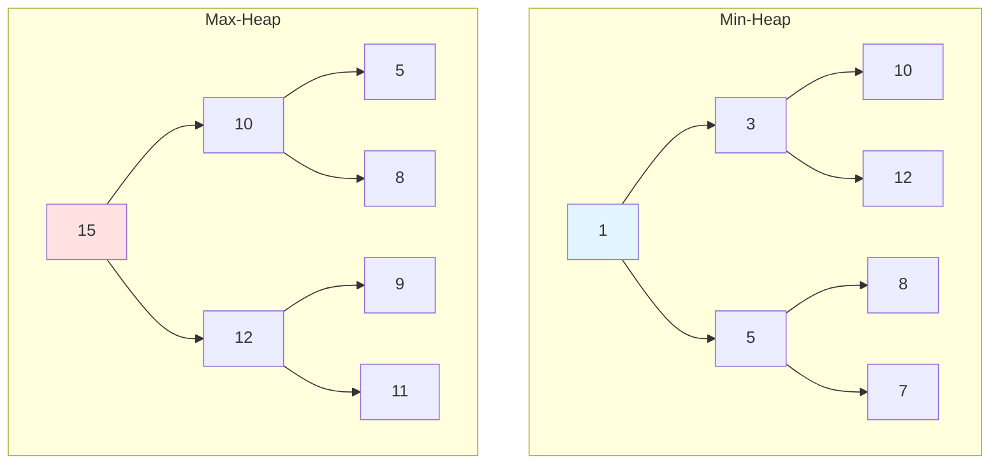
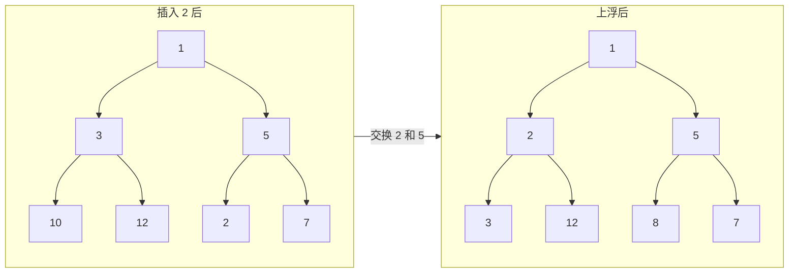

# 堆与优先队列

## 为什么堆很重要

堆提供对最小或最大元素的高效访问——优先处理的基础：

- **任务调度**：CPU 进程调度、作业队列
- **图算法**：Dijkstra 最短路径、Prim 最小生成树
- **流处理**：在数据流中找 Top K 元素
- **事件模拟**：按时间顺序处理事件

**实际影响**：Java 的 `PriorityQueue` 使用二叉堆，提供 O(log n) 插入和 O(1) 访问最小元素。从 100 万个元素中找前 10 个只需 20 次堆操作（2 × 10 × log₂1,000,000），而排序需要 1000 万次比较。

## 核心概念

### 二叉堆结构

一棵**完全二叉树**，每个节点 ≥ 其父节点（最小堆）或 ≤ 其父节点（最大堆）：



**堆的性质**：
- **形状性质**：完全二叉树（除最后一层外所有层都填满，最后一层从左到右填充）
- **有序性质**：最小堆：父 ≤ 子 | 最大堆：父 ≥ 子
- **数组表示**：对于索引 `i` 处的节点：
  - 父节点：`(i - 1) / 2`
  - 左子节点：`2i + 1`
  - 右子节点：`2i + 2`

### 数组表示

```
Index:  0   1   2   3   4   5   6
Array: [1,  3,  5, 10, 12,  8,  7]
        ↓   ↓   ↓
Tree:   1
       / \
      3   5
     /|   |\
   10 12 8  7
```

### 最小堆 vs 最大堆 vs BST

| 性质 | 最小堆 | 最大堆 | BST |
|------|--------|--------|-----|
| **访问最小值** | O(1) | O(n) | O(log n) |
| **访问最大值** | O(n) | O(1) | O(log n) |
| **插入** | O(log n) | O(log n) | O(log n) |
| **删除最小/最大值** | O(log n) | O(log n) | O(log n) |
| **搜索任意值** | O(n) | O(n) | O(log n) |
| **排序** | 部分（父子之间） | 部分（父子之间） | 完全（中序） |

**何时使用堆**：
- 需要快速访问最小/最大元素
- 不需要完全有序
- 频繁的插入/删除
- Top K 问题

**何时使用 BST**：
- 需要完全有序遍历
- 需要搜索任意元素
- 需要范围查询

## 深入理解

### 堆操作

#### 上浮（Heapify Up / Bubble Up）

插入后用于恢复堆性质：

```java
private void heapifyUp(int[] heap, int index) {
    while (index > 0) {
        int parent = (index - 1) / 2;

        if (heap[index] >= heap[parent]) break;  // 最小堆性质满足

        // 与父节点交换
        swap(heap, index, parent);
        index = parent;
    }
}

private void swap(int[] arr, int i, int j) {
    int temp = arr[i];
    arr[i] = arr[j];
    arr[j] = temp;
}
```



#### 下沉（Heapify Down / Bubble Down）

删除后用于恢复堆性质：

```java
private void heapifyDown(int[] heap, int index, int size) {
    while (true) {
        int leftChild = 2 * index + 1;
        int rightChild = 2 * index + 2;
        int smallest = index;

        if (leftChild < size && heap[leftChild] < heap[smallest]) {
            smallest = leftChild;
        }

        if (rightChild < size && heap[rightChild] < heap[smallest]) {
            smallest = rightChild;
        }

        if (smallest == index) break;  // 堆性质满足

        swap(heap, index, smallest);
        index = smallest;
    }
}
```

#### 建堆

在 O(n) 时间内将任意数组转换为堆：

```java
public void buildHeap(int[] arr) {
    int n = arr.length;
    // 从最后一个非叶节点开始
    for (int i = n / 2 - 1; i >= 0; i--) {
        heapifyDown(arr, i, n);
    }
}
```

**为什么是 O(n) 而不是 O(n log n)？**
- 大多数节点在底部附近（高度小）
- 总工作量：Σ（第 h 层的节点数）× h = O(n)
- 直觉：只有 n/2 个节点需要堆化，且高度递减

### Java 的 PriorityQueue

```java
// 最小堆（默认）
PriorityQueue<Integer> minHeap = new PriorityQueue<>();
minHeap.offer(5);
minHeap.offer(1);
minHeap.offer(3);
System.out.println(minHeap.poll());  // 1（最小值）

// 最大堆（使用反向比较器）
PriorityQueue<Integer> maxHeap =
    new PriorityQueue<>(Collections.reverseOrder());
maxHeap.offer(5);
maxHeap.offer(1);
maxHeap.offer(3);
System.out.println(maxHeap.poll());  // 5（最大值）

// 自定义比较器
PriorityQueue<Task> taskQueue =
    new PriorityQueue<>(Comparator.comparingInt(Task::getPriority));
```

### 常见陷阱

#### ❌ 删除元素后使用 heap.size()

```java
PriorityQueue<Integer> heap = new PriorityQueue<>();
heap.addAll(Arrays.asList(3, 1, 4, 1, 5));

for (int i = 0; i < heap.size(); i++) {  // BUG：size 在变化！
    System.out.println(heap.poll());
}
```

#### ✅ 保存 size 或使用 isEmpty()

```java
int size = heap.size();
for (int i = 0; i < size; i++) {
    System.out.println(heap.poll());
}

// 或
while (!heap.isEmpty()) {
    System.out.println(heap.poll());
}
```

#### ❌ 忘记实现 Comparable

```java
class Task {
    int priority;
    // 缺少 compareTo()！
}

PriorityQueue<Task> heap = new PriorityQueue<>();  // ClassCastException
```

#### ✅ 实现 Comparable 或提供 Comparator

```java
class Task implements Comparable<Task> {
    int priority;

    @Override
    public int compareTo(Task other) {
        return Integer.compare(this.priority, other.priority);
    }
}

// 或使用 Comparator
PriorityQueue<Task> heap = new PriorityQueue<>(
    Comparator.comparingInt(t -> t.priority)
);
```

### 进阶操作

#### 堆排序

```java
public void heapSort(int[] arr) {
    int n = arr.length;

    // 建最大堆
    for (int i = n / 2 - 1; i >= 0; i--) {
        heapifyDownMax(arr, i, n);
    }

    // 从堆中提取元素
    for (int i = n - 1; i > 0; i--) {
        swap(arr, 0, i);  // 将最大值移到末尾
        heapifyDownMax(arr, 0, i);  // 恢复堆性质
    }
}

private void heapifyDownMax(int[] arr, int index, int size) {
    while (true) {
        int left = 2 * index + 1;
        int right = 2 * index + 2;
        int largest = index;

        if (left < size && arr[left] > arr[largest]) {
            largest = left;
        }

        if (right < size && arr[right] > arr[largest]) {
            largest = right;
        }

        if (largest == index) break;

        swap(arr, index, largest);
        index = largest;
    }
}
```

**复杂度**：O(n log n) 时间，O(1) 空间（原地排序）

#### 合并 K 个有序链表

```java
public ListNode mergeKLists(ListNode[] lists) {
    PriorityQueue<ListNode> minHeap =
        new PriorityQueue<>((a, b) -> a.val - b.val);

    // 添加每条链表的头节点
    for (ListNode head : lists) {
        if (head != null) {
            minHeap.offer(head);
        }
    }

    ListNode dummy = new ListNode(0);
    ListNode current = dummy;

    while (!minHeap.isEmpty()) {
        ListNode node = minHeap.poll();
        current.next = node;
        current = current.next;

        if (node.next != null) {
            minHeap.offer(node.next);
        }
    }

    return dummy.next;
}
```

**复杂度**：O(n log k)，其中 n = 总元素数，k = 链表数

#### 滑动窗口中位数

```java
public double[] medianSlidingWindow(int[] nums, int k) {
    // 最大堆存储较小的一半
    PriorityQueue<Integer> low = new PriorityQueue<>(Collections.reverseOrder());
    // 最小堆存储较大的一半
    PriorityQueue<Integer> high = new PriorityQueue<>();

    double[] result = new double[nums.length - k + 1];

    for (int i = 0; i < nums.length; i++) {
        // 添加当前元素
        if (low.isEmpty() || nums[i] <= low.peek()) {
            low.offer(nums[i]);
        } else {
            high.offer(nums[i]);
        }

        // 平衡堆（low 最多比 high 多 1 个）
        if (low.size() > high.size() + 1) {
            high.offer(low.poll());
        } else if (high.size() > low.size()) {
            low.offer(high.poll());
        }

        // 移除离开窗口的元素
        if (i >= k) {
            int leaving = nums[i - k];
            if (leaving <= low.peek()) {
                low.remove(leaving);
            } else {
                high.remove(leaving);
            }

            // 重新平衡
            if (low.size() > high.size() + 1) {
                high.offer(low.poll());
            } else if (high.size() > low.size()) {
                low.offer(high.poll());
            }
        }

        // 计算中位数
        if (i >= k - 1) {
            if (k % 2 == 0) {
                result[i - k + 1] = (low.peek() / 2.0) + (high.peek() / 2.0);
            } else {
                result[i - k + 1] = low.peek();
            }
        }
    }

    return result;
}
```

## 实际应用

### 优先级任务调度器

```java
public class PriorityScheduler {
    private final PriorityQueue<Task> queue;
    private final ExecutorService executor;

    public PriorityScheduler(int threads) {
        this.queue = new PriorityQueue<>(
            Comparator.comparingInt(Task::getPriority)
                      .reversed()  // 高优先级先执行
                      .thenComparingLong(Task::getCreatedAt)
        );
        this.executor = Executors.newFixedThreadPool(threads);
    }

    public void submit(Task task) {
        synchronized (queue) {
            queue.offer(task);
        }
    }

    public void start() {
        for (int i = 0; i < executor.getMaximumPoolSize(); i++) {
            executor.submit(() -> {
                while (!Thread.currentThread().isInterrupted()) {
                    try {
                        Task task;
                        synchronized (queue) {
                            while (queue.isEmpty()) {
                                queue.wait();
                            }
                            task = queue.poll();
                        }
                        task.execute();
                    } catch (InterruptedException e) {
                        Thread.currentThread().interrupt();
                        break;
                    }
                }
            });
        }
    }
}
```

### 前 K 个高频元素

```java
public List<Integer> topKFrequent(int[] nums, int k) {
    // 统计频率
    Map<Integer, Integer> freq = new HashMap<>();
    for (int num : nums) {
        freq.merge(num, 1, Integer::sum);
    }

    // 大小为 k 的最小堆（堆顶是频率最低的）
    PriorityQueue<Integer> heap = new PriorityQueue<>(
        (a, b) -> freq.get(a) - freq.get(b)
    );

    for (int num : freq.keySet()) {
        heap.offer(num);
        if (heap.size() > k) {
            heap.poll();  // 移除频率最低的
        }
    }

    return new ArrayList<>(heap);
}
```

### 查找 K 个最接近的元素

```java
public List<Integer> findClosestElements(int[] arr, int k, int x) {
    // 基于 x 距离的最大堆
    PriorityQueue<Integer> heap = new PriorityQueue<>(
        (a, b) -> Math.abs(b - x) == Math.abs(a - x) ?
                 b - a :  // 平局时：较大元素优先
                 Math.abs(b - x) - Math.abs(a - x)
    );

    for (int num : arr) {
        heap.offer(num);
        if (heap.size() > k) {
            heap.poll();
        }
    }

    List<Integer> result = new ArrayList<>(heap);
    Collections.sort(result);
    return result;
}
```

## 面试题

### Q1：数组中第 K 大的元素（中等）

**题目**：在未排序数组中找第 k 大的元素。

**方法**：大小为 k 的最小堆

**复杂度**：O(n log k) 时间，O(k) 空间

```java
public int findKthLargest(int[] nums, int k) {
    PriorityQueue<Integer> minHeap = new PriorityQueue<>();

    for (int num : nums) {
        minHeap.offer(num);
        if (minHeap.size() > k) {
            minHeap.poll();  // 移除最小的
        }
    }

    return minHeap.peek();  // 第 k 大的元素
}
```

### Q2：前 K 个高频元素（中等）

**题目**：返回频率最高的 k 个元素。

**方法**：频率映射 + 大小为 k 的最小堆

**复杂度**：O(n log k) 时间，O(n) 空间

```java
public List<Integer> topKFrequent(int[] nums, int k) {
    Map<Integer, Integer> freq = new HashMap<>();
    for (int num : nums) {
        freq.merge(num, 1, Integer::sum);
    }

    PriorityQueue<Integer> heap = new PriorityQueue<>(
        (a, b) -> freq.get(a) - freq.get(b)
    );

    for (int num : freq.keySet()) {
        heap.offer(num);
        if (heap.size() > k) {
            heap.poll();
        }
    }

    return new ArrayList<>(heap);
}
```

### Q3：合并 K 个有序链表（困难）

**题目**：合并 k 条有序链表。

**方法**：最小堆存储每条链表的下一个节点

**复杂度**：O(n log k) 时间，O(k) 空间

```java
public ListNode mergeKLists(ListNode[] lists) {
    PriorityQueue<ListNode> heap =
        new PriorityQueue<>((a, b) -> a.val - b.val);

    for (ListNode head : lists) {
        if (head != null) heap.offer(head);
    }

    ListNode dummy = new ListNode(0);
    ListNode current = dummy;

    while (!heap.isEmpty()) {
        ListNode node = heap.poll();
        current.next = node;
        current = current.next;

        if (node.next != null) {
            heap.offer(node.next);
        }
    }

    return dummy.next;
}
```

### Q4：数据流的中位数（困难）

**题目**：设计数据结构从数据流中找中位数。

**方法**：双堆（最大堆存较小的一半，最小堆存较大的一半）

**复杂度**：addNum O(log n)，findMedian O(1)

```java
class MedianFinder {
    private PriorityQueue<Integer> low;   // 最大堆
    private PriorityQueue<Integer> high;  // 最小堆

    public MedianFinder() {
        low = new PriorityQueue<>(Collections.reverseOrder());
        high = new PriorityQueue<>();
    }

    public void addNum(int num) {
        low.offer(num);  // 加入最大堆
        high.offer(low.poll());  // 平衡

        if (high.size() > low.size()) {
            low.offer(high.poll());  // 重新平衡
        }
    }

    public double findMedian() {
        if (low.size() == high.size()) {
            return (low.peek() / 2.0) + (high.peek() / 2.0);
        }
        return low.peek();
    }
}
```

### Q5：任务调度器（中等）

**题目**：调度任务，相同任务之间有冷却时间。

**方法**：基于频率的最大堆 + 冷却队列

**复杂度**：O(n log n) 时间，O(1) 空间（26 个字母）

```java
public int leastInterval(char[] tasks, int cooldown) {
    Map<Character, Integer> freq = new HashMap<>();
    for (char task : tasks) {
        freq.merge(task, 1, Integer::sum);
    }

    PriorityQueue<Integer> maxHeap =
        new PriorityQueue<>(Collections.reverseOrder());
    maxHeap.addAll(freq.values());

    Queue<int[]> coolDown = new LinkedList<>();  // [任务, 可用时间]
    int time = 0;

    while (!maxHeap.isEmpty() || !coolDown.isEmpty()) {
        time++;

        if (!maxHeap.isEmpty()) {
            int count = maxHeap.poll() - 1;
            if (count > 0) {
                coolDown.offer(new int[]{count, time + cooldown});
            }
        }

        if (!coolDown.isEmpty() && coolDown.peek()[1] == time) {
            maxHeap.offer(coolDown.poll()[0]);
        }
    }

    return time;
}
```

### Q6：重组字符串（中等）

**题目**：重新排列字符串使没有两个相邻字符相同。

**方法**：最大堆，始终取频率最高的两个

**复杂度**：O(n log k) 时间，O(k) 空间

```java
public String reorganizeString(String s) {
    Map<Character, Integer> freq = new HashMap<>();
    for (char c : s.toCharArray()) {
        freq.merge(c, 1, Integer::sum);
    }

    PriorityQueue<Character> maxHeap =
        new PriorityQueue<>((a, b) -> freq.get(b) - freq.get(a));
    maxHeap.addAll(freq.keySet());

    StringBuilder result = new StringBuilder();

    while (maxHeap.size() >= 2) {
        char first = maxHeap.poll();
        char second = maxHeap.poll();

        result.append(first).append(second);

        freq.put(first, freq.get(first) - 1);
        freq.put(second, freq.get(second) - 1);

        if (freq.get(first) > 0) maxHeap.offer(first);
        if (freq.get(second) > 0) maxHeap.offer(second);
    }

    if (!maxHeap.isEmpty()) {
        char last = maxHeap.poll();
        if (freq.get(last) > 1) return "";  // 不可能
        result.append(last);
    }

    return result.toString();
}
```

### Q7：距离原点最近的 K 个点（中等）

**题目**：找到距离原点 (0, 0) 最近的 k 个点。

**方法**：基于距离的大小为 k 的最大堆

**复杂度**：O(n log k) 时间，O(k) 空间

```java
public int[][] kClosest(int[][] points, int k) {
    PriorityQueue<int[]> maxHeap = new PriorityQueue<>(
        (a, b) -> Integer.compare(
            distanceSquared(b), distanceSquared(a)
        )
    );

    for (int[] point : points) {
        maxHeap.offer(point);
        if (maxHeap.size() > k) {
            maxHeap.poll();
        }
    }

    int[][] result = new int[k][2];
    for (int i = 0; i < k; i++) {
        result[i] = maxHeap.poll();
    }
    return result;
}

private int distanceSquared(int[] point) {
    return point[0] * point[0] + point[1] * point[1];
}
```

## 延伸阅读

- **树**：BST 提供有序访问
- **图**：堆在 Dijkstra、Prim 算法中使用
- **贪心**：堆用于选择最优选择
- **LeetCode**：[堆题目](https://leetcode.com/tag/heap/)
